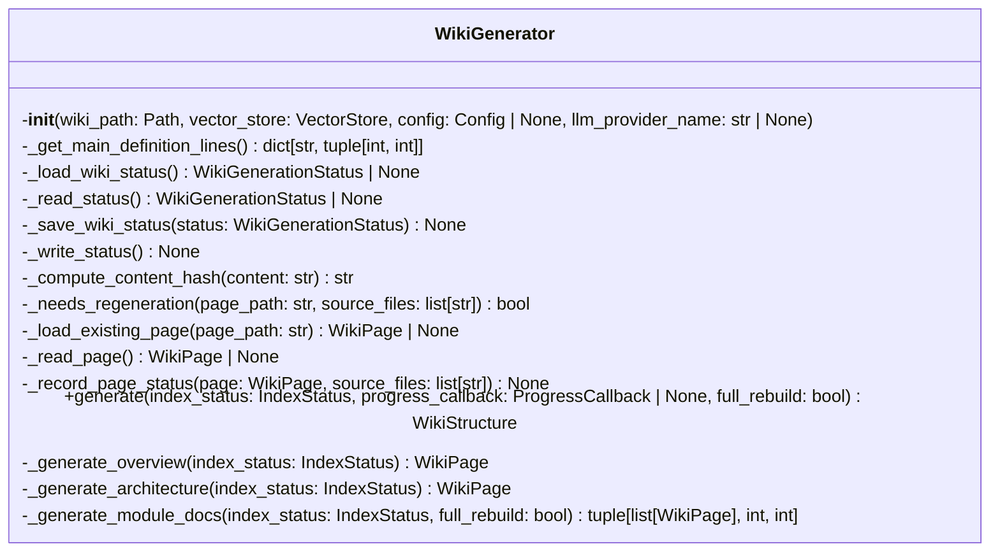

# Wiki Generator Module

## File Overview

The `wiki.py` module provides the core functionality for generating documentation wikis from indexed code. It contains the WikiGenerator class which orchestrates the creation of various documentation pages including overviews, architecture diagrams, module documentation, and file-specific pages.

## Classes

### WikiGenerator

The WikiGenerator class is responsible for generating comprehensive wiki documentation from a vector store of indexed code.

#### Constructor

```python
def __init__(
    self,
    wiki_path: Path,
    vector_store: VectorStore,
    config: Config | None = None,
    llm_provider_name: str | None = None,
):
```

**Parameters:**
- `wiki_path`: Path to wiki output directory
- `vector_store`: Vector store with indexed code
- `config`: Optional configuration object
- `llm_provider_name`: Override LLM provider ("ollama", "anthropic", "openai")

#### Key Methods

The WikiGenerator class includes several methods for different aspects of wiki generation:

- **Status Management**: Methods for tracking generation status and determining when regeneration is needed
- **Content Generation**: Methods for generating different types of documentation pages
- **File Operations**: Methods for reading and writing wiki pages
- **Utility Methods**: Helper methods for content processing and organization

## Functions

### generate_wiki

```python
generate_wiki(...)
```

A standalone function that provides a simplified interface for wiki generation.

## Usage Examples

### Basic Wiki Generation

```python
from pathlib import Path
from local_deepwiki.core.vectorstore import VectorStore
from local_deepwiki.generators.wiki import WikiGenerator

# Initialize components
wiki_path = Path("./wiki")
vector_store = VectorStore(...)  # Your vector store instance

# Create generator
generator = WikiGenerator(
    wiki_path=wiki_path,
    vector_store=vector_store
)

# Generate wiki
generator.generate()
```

### With Custom Configuration

```python
from local_deepwiki.config import Config

# Custom configuration
config = Config(...)

# Generator with custom config and LLM provider
generator = WikiGenerator(
    wiki_path=wiki_path,
    vector_store=vector_store,
    config=config,
    llm_provider_name="anthropic"
)
```

## Related Components

The WikiGenerator integrates with several other components from the local_deepwiki system:

- **[VectorStore](../core/vectorstore.md)**: Provides indexed code content for documentation generation
- **[Config](../config.md)**: Supplies configuration settings for the generation process
- **[EntityRegistry](crosslinks.md)**: Handles cross-linking between documentation entities
- **API Documentation Generator**: Generates API-specific documentation
- **Call Graph Generator**: Creates call graph visualizations
- **Test Examples Generator**: Extracts test examples for documentation
- **Diagram Generator**: Creates class diagrams and other visualizations

The module also integrates with various LLM providers through the specified provider name, allowing for flexible AI-powered content generation.

## API Reference

### class `WikiGenerator`

Generate wiki documentation from indexed code.

**Methods:**

#### `__init__`

```python
def __init__(wiki_path: Path, vector_store: VectorStore, config: Config | None = None, llm_provider_name: str | None = None)
```

Initialize the wiki generator.


| [Parameter](api_docs.md) | Type | Default | Description |
|-----------|------|---------|-------------|
| `wiki_path` | `Path` | - | Path to wiki output directory. |
| `vector_store` | [`VectorStore`](../core/vectorstore.md) | - | Vector store with indexed code. |
| `config` | `Config | None` | `None` | Optional configuration. |
| `llm_provider_name` | `str | None` | `None` | Override LLM provider ("ollama", "anthropic", "openai"). |

#### `generate`

```python
async def generate(index_status: IndexStatus, progress_callback: ProgressCallback | None = None, full_rebuild: bool = False) -> WikiStructure
```

Generate wiki documentation for the indexed repository.


| [Parameter](api_docs.md) | Type | Default | Description |
|-----------|------|---------|-------------|
| `index_status` | [`IndexStatus`](../models.md) | - | The index status with file information. |
| [`progress_callback`](../handlers.md) | `ProgressCallback | None` | `None` | Optional progress callback. |
| `full_rebuild` | `bool` | `False` | If True, regenerate all pages. Otherwise, only regenerate changed pages. |

#### `is_test_file`

```python
def is_test_file(path: str) -> bool
```

Check if a file is a test file.


| [Parameter](api_docs.md) | Type | Default | Description |
|-----------|------|---------|-------------|
| `path` | `str` | - | - |

#### `generate_with_semaphore`

```python
async def generate_with_semaphore(file_info: FileInfo) -> tuple[WikiPage | None, bool]
```


| [Parameter](api_docs.md) | Type | Default | Description |
|-----------|------|---------|-------------|
| `file_info` | [`FileInfo`](../models.md) | - | - |


---

### Functions

#### `generate_wiki`

```python
async def generate_wiki(repo_path: Path, wiki_path: Path, vector_store: VectorStore, index_status: IndexStatus, config: Config | None = None, llm_provider: str | None = None, progress_callback: ProgressCallback | None = None, full_rebuild: bool = False) -> WikiStructure
```

Convenience function to generate wiki documentation.


| [Parameter](api_docs.md) | Type | Default | Description |
|-----------|------|---------|-------------|
| `repo_path` | `Path` | - | Path to the repository. |
| `wiki_path` | `Path` | - | Path for wiki output. |
| `vector_store` | [`VectorStore`](../core/vectorstore.md) | - | Indexed vector store. |
| `index_status` | [`IndexStatus`](../models.md) | - | Index status. |
| `config` | `Config | None` | `None` | Optional configuration. |
| `llm_provider` | `str | None` | `None` | Optional LLM provider override. |
| [`progress_callback`](../handlers.md) | `ProgressCallback | None` | `None` | Optional progress callback. |
| `full_rebuild` | `bool` | `False` | If True, regenerate all pages. Otherwise, only regenerate changed pages. |

**Returns:** [`WikiStructure`](../models.md)


## Class Diagram



## Call Graph

```mermaid
flowchart TD
    N0[Path]
    N1[WikiGenerator.__init__]
    N2[WikiGenerator._compute_cont...]
    N3[WikiGenerator._generate_fil...]
    N4[WikiGenerator._generate_mod...]
    N5[WikiGenerator._generate_sin...]
    N6[WikiGenerator._get_main_def...]
    N7[WikiGenerator._load_existin...]
    N8[WikiGenerator._load_wiki_st...]
    N9[WikiGenerator._read_status]
    N10[WikiGenerator._save_wiki_st...]
    N11[WikiGenerator._write_page]
    N12[WikiGenerator.generate]
    N13[WikiPage]
    N14[_load_existing_page]
    N15[_needs_regeneration]
    N16[_record_page_status]
    N17[dump]
    N18[exists]
    N19[generate]
    N20[generate_wiki]
    N21[get_config]
    N22[hexdigest]
    N23[load]
    N24[model_dump]
    N25[model_validate]
    N26[search]
    N27[sha256]
    N28[time]
    N29[to_thread]
    N20 --> N21
    N20 --> N19
    N1 --> N21
    N8 --> N18
    N8 --> N23
    N8 --> N25
    N8 --> N29
    N9 --> N23
    N9 --> N25
    N10 --> N24
    N10 --> N17
    N10 --> N29
    N2 --> N22
    N2 --> N27
    N7 --> N18
    N7 --> N0
    N7 --> N28
    N7 --> N13
    N7 --> N29
    N12 --> N0
    N12 --> N15
    N12 --> N14
    N12 --> N16
    N12 --> N26
    N12 --> N28
    N12 --> N22
    N12 --> N27
    N12 --> N24
    N4 --> N0
    N4 --> N15
    N4 --> N14
    N4 --> N16
    N4 --> N26
    N4 --> N19
    N4 --> N13
    N4 --> N28
    N5 --> N0
    N5 --> N15
    N5 --> N14
    N5 --> N16
    N5 --> N26
    N5 --> N19
    N5 --> N18
    N5 --> N13
    N5 --> N28
    N3 --> N13
    N3 --> N28
    N3 --> N16
    N11 --> N29
    classDef func fill:#e1f5fe
    class N0,N13,N14,N15,N16,N17,N18,N19,N20,N21,N22,N23,N24,N25,N26,N27,N28,N29 func
    classDef method fill:#fff3e0
    class N1,N2,N3,N4,N5,N6,N7,N8,N9,N10,N11,N12 method
```



## Relevant Source Files

- `src/local_deepwiki/generators/wiki.py:65-963`
