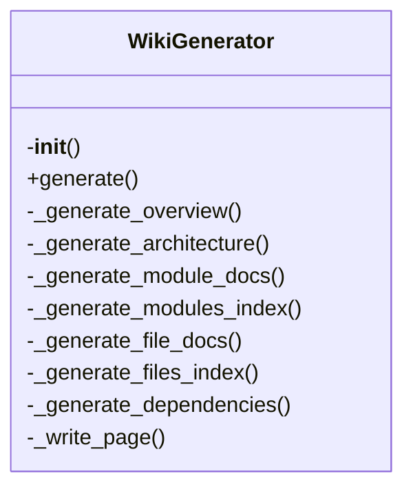

# Wiki Generator Documentation

## File Overview

This file implements the `WikiGenerator` class responsible for generating wiki documentation from a codebase. It processes indexed repository data to create structured documentation including overview pages, architecture diagrams, module documentation, file documentation, dependencies, cross-links, and search indexes.

## Classes

### `WikiGenerator`

The `WikiGenerator` class orchestrates the generation of wiki documentation from indexed repository data.

#### Constructor

```python
def __init__(
    self,
    wiki_path: Path,
    vector_store: VectorStore,
    config: Config | None = None,
    llm_provider_name: str | None = None,
)
```

**Purpose**: Initialize the wiki generator with required dependencies.

**Parameters**:
- `wiki_path`: Path to the wiki output directory
- `vector_store`: Vector store with indexed code
- `config`: Optional configuration object
- `llm_provider_name`: Override LLM provider ("ollama", "anthropic", "openai")

#### Methods

##### `generate`

```python
async def generate(
    self,
    index_status: IndexStatus,
    progress_callback: Any = None,
) -> WikiStructure:
```

**Purpose**: Generate complete wiki documentation for the indexed repository.

**Parameters**:
- `index_status`: The index status with file information
- `progress_callback`: Optional progress callback function

**Returns**: `WikiStructure` with generated pages

**Process**:
1. Generates overview page
2. Generates architecture documentation
3. Generates module documentation
4. Generates file documentation
5. Generates dependencies documentation
6. Adds cross-links between pages
7. Adds "see also" sections
8. Writes search index

##### `_write_page`

```python
def _write_page(self, page: WikiPage) -> None:
```

**Purpose**: Write a wiki page to disk.

**Parameters**:
- `page`: `WikiPage` object containing page data

## Functions

### `generate_wiki`

```python
async def generate_wiki(
    repo_path: Path,
    wiki_path: Path,
    vector_store: VectorStore,
    index_status: IndexStatus,
    config: Config | None = None,
    llm_provider: str | None = None,
    progress_callback: Any = None,
) -> WikiStructure:
```

**Purpose**: Convenience function to generate wiki documentation.

**Parameters**:
- `repo_path`: Path to the repository
- `wiki_path`: Path for wiki output
- `vector_store`: Indexed vector store
- `index_status`: Index status
- `config`: Optional configuration
- `llm_provider`: Optional LLM provider override
- `progress_callback`: Optional progress callback

**Returns**: `WikiStructure` with generated pages

### `_path_to_module`

```python
def _path_to_module(file_path: str) -> str | None:
```

**Purpose**: Convert file path to module name.

**Parameters**:
- `file_path`: Path like 'src/local_deepwiki/core/indexer.py'

**Returns**: Module name like 'core.indexer', or None if not applicable

## Usage Examples

### Basic Usage

```python
from local_deepwiki.generators.wiki import generate_wiki
from local_deepwiki.core.vectorstore import VectorStore
from local_deepwiki.models import IndexStatus
from pathlib import Path

# Assuming you have an indexed vector store and index status
vector_store = VectorStore()
index_status = IndexStatus()

# Generate wiki documentation
wiki_structure = await generate_wiki(
    repo_path=Path("my_repo"),
    wiki_path=Path("wiki_output"),
    vector_store=vector_store,
    index_status=index_status
)
```

### Using WikiGenerator Directly

```python
from local_deepwiki.generators.wiki import WikiGenerator
from local_deepwiki.core.vectorstore import VectorStore
from local_deepwiki.models import IndexStatus
from pathlib import Path

# Initialize generator
wiki_generator = WikiGenerator(
    wiki_path=Path("wiki_output"),
    vector_store=vector_store
)

# Generate documentation
wiki_structure = await wiki_generator.generate(index_status)
```

## Dependencies

This file imports:

- `re` - Regular expressions
- `time` - Time utilities
- `pathlib.Path` - Path manipulation
- `typing.Any` - Type hinting
- `local_deepwiki.config.Config` - Configuration management
- `local_deepwiki.core.vectorstore.VectorStore` - Vector store implementation
- `local_deepwiki.generators.crosslinks.EntityRegistry` - Cross-link entity registry
- `local_deepwiki.generators.crosslinks.add_cross_links` - Cross-link functionality
- `local_deepwiki.generators.search.write_search_index` - Search index writer
- `local_deepwiki.generators.see_also.RelationshipAnalyzer` - Relationship analyzer
- `local_deepwiki.generators.see_also.add_see_also_sections` - "See also" section generator
- `local_deepwiki.models.IndexStatus` - Index status model
- `local_deepwiki.models.WikiPage` - Wiki page model
- `local_deepwiki.models.WikiStructure` - Wiki structure model
- `local_deepwiki.providers.llm.get_llm_provider` - LLM provider factory
- `local_deepwiki.models.ChunkType` - Chunk type enumeration

## Class Diagram



## See Also

- [server](../server.md) - uses this
- [vectorstore](../core/vectorstore.md) - dependency
- [see_also](see_also.md) - dependency
- [models](../models.md) - dependency
- [search](search.md) - dependency
