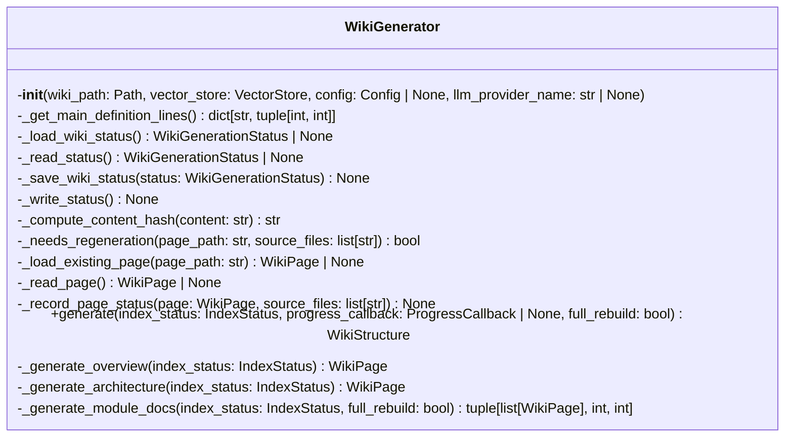

# WikiGenerator Module

## File Overview

The `wiki.py` module provides the core functionality for generating wiki documentation from code repositories. It contains the WikiGenerator class that orchestrates the creation of various documentation pages including overviews, architecture diagrams, module documentation, and changelogs.

## Classes

### WikiGenerator

The WikiGenerator class is the [main](../export/html.md) component responsible for generating comprehensive wiki documentation from indexed code repositories.

**Purpose**: Coordinates the generation of multiple types of documentation pages including module docs, architecture overviews, dependency information, and changelogs.

**Key Methods**:

- `__init__`: Initializes the generator with wiki path, vector store, configuration, and optional LLM provider override
- `generate`: Main method that orchestrates the complete wiki generation process
- `_generate_overview`: Creates overview documentation pages
- `_generate_architecture`: Generates architecture documentation and diagrams
- `_generate_module_docs`: Creates documentation for individual modules
- `_generate_modules_index`: Generates an index of all modules
- `_generate_single_file_doc`: Creates documentation for a single file
- `_generate_file_docs`: Processes multiple files for documentation
- `_generate_files_index`: Creates an index of all documented files
- `_generate_dependencies`: Generates dependency documentation
- `_generate_changelog`: Creates changelog from git history
- `_load_wiki_status`: Loads existing wiki generation status
- `_save_wiki_status`: Saves current wiki generation status
- `_needs_regeneration`: Determines if content needs to be regenerated
- `_write_page`: Writes generated pages to disk

## Functions

### generate_wiki

```python
async def generate_wiki(
    repo_path: Path,
    wiki_path: Path,
    vector_store: VectorStore,
    index_status: IndexStatus,
    config: Config | None = None,
    llm_provider: str | None = None,
    progress_callback: ProgressCallback | None = None,
    full_rebuild: bool = False,
) -> WikiStructure
```

Convenience function that provides a simplified interface for generating wiki documentation.

**Parameters**:
- `repo_path`: Path to the source repository
- `wiki_path`: Directory where wiki files will be generated
- `vector_store`: Indexed vector store containing code information
- `index_status`: Current indexing status
- `config`: Optional configuration object
- `llm_provider`: Optional LLM provider override ("ollama", "anthropic", "openai")
- [`progress_callback`](../watcher.md): Optional callback for progress updates
- `full_rebuild`: Whether to perform a complete rebuild

**Returns**: [WikiStructure](../models.md) containing the generated documentation structure

## Usage Examples

### Basic Wiki Generation

```python
from pathlib import Path
from local_deepwiki.generators.wiki import generate_wiki
from local_deepwiki.core.vectorstore import VectorStore

# Generate wiki documentation
wiki_structure = await generate_wiki(
    repo_path=Path("./my_project"),
    wiki_path=Path("./wiki_output"),
    vector_store=vector_store,
    index_status=index_status
)
```

### Using WikiGenerator Directly

```python
from local_deepwiki.generators.wiki import WikiGenerator
from local_deepwiki.config import get_config

# Initialize generator
generator = WikiGenerator(
    wiki_path=Path("./wiki"),
    vector_store=vector_store,
    config=get_config(),
    llm_provider_name="ollama"
)

# Generate documentation
result = await generator.generate(
    repo_path=Path("./source"),
    index_status=index_status
)
```

## Related Components

The WikiGenerator integrates with several other components from the codebase:

- **[VectorStore](../core/vectorstore.md)**: Provides indexed code information for documentation generation
- **[Config](../config.md)**: Supplies configuration settings for the generation process
- **[EntityRegistry](crosslinks.md)**: Manages cross-linking between documentation pages
- **API docs generator**: Creates API documentation for code files
- **Call graph generator**: Generates call relationship documentation
- **Test examples generator**: Extracts test examples for documentation
- **Diagram generators**: Creates visual diagrams for architecture documentation
- **Changelog generator**: Generates changelog from git history

The module handles asynchronous processing and includes status tracking to support incremental updates and avoid unnecessary regeneration of unchanged content.

## API Reference

### class `WikiGenerator`

Generate wiki documentation from indexed code.

**Methods:**

#### `__init__`

```python
def __init__(wiki_path: Path, vector_store: VectorStore, config: Config | None = None, llm_provider_name: str | None = None)
```

Initialize the wiki generator.


| [Parameter](api_docs.md) | Type | Default | Description |
|-----------|------|---------|-------------|
| `wiki_path` | `Path` | - | Path to wiki output directory. |
| `vector_store` | [`VectorStore`](../core/vectorstore.md) | - | Vector store with indexed code. |
| `config` | `Config | None` | `None` | Optional configuration. |
| `llm_provider_name` | `str | None` | `None` | Override LLM provider ("ollama", "anthropic", "openai"). |

#### `generate`

```python
async def generate(index_status: IndexStatus, progress_callback: ProgressCallback | None = None, full_rebuild: bool = False) -> WikiStructure
```

Generate wiki documentation for the indexed repository.


| [Parameter](api_docs.md) | Type | Default | Description |
|-----------|------|---------|-------------|
| `index_status` | [`IndexStatus`](../models.md) | - | The index status with file information. |
| [`progress_callback`](../watcher.md) | `ProgressCallback | None` | `None` | Optional progress callback. |
| `full_rebuild` | `bool` | `False` | If True, regenerate all pages. Otherwise, only regenerate changed pages. |

#### `generate_with_semaphore`

```python
async def generate_with_semaphore(file_info: FileInfo) -> tuple[WikiPage | None, bool]
```


| [Parameter](api_docs.md) | Type | Default | Description |
|-----------|------|---------|-------------|
| `file_info` | [`FileInfo`](../models.md) | - | - |


---

### Functions

#### `generate_wiki`

```python
async def generate_wiki(repo_path: Path, wiki_path: Path, vector_store: VectorStore, index_status: IndexStatus, config: Config | None = None, llm_provider: str | None = None, progress_callback: ProgressCallback | None = None, full_rebuild: bool = False) -> WikiStructure
```

Convenience function to generate wiki documentation.


| [Parameter](api_docs.md) | Type | Default | Description |
|-----------|------|---------|-------------|
| `repo_path` | `Path` | - | Path to the repository. |
| `wiki_path` | `Path` | - | Path for wiki output. |
| `vector_store` | [`VectorStore`](../core/vectorstore.md) | - | Indexed vector store. |
| `index_status` | [`IndexStatus`](../models.md) | - | Index status. |
| `config` | `Config | None` | `None` | Optional configuration. |
| `llm_provider` | `str | None` | `None` | Optional LLM provider override. |
| [`progress_callback`](../watcher.md) | `ProgressCallback | None` | `None` | Optional progress callback. |
| `full_rebuild` | `bool` | `False` | If True, regenerate all pages. Otherwise, only regenerate changed pages. |

**Returns:** [`WikiStructure`](../models.md)


## Class Diagram



## Call Graph

```mermaid
flowchart TD
    N0[Path]
    N1[WikiGenerator.__init__]
    N2[WikiGenerator._compute_cont...]
    N3[WikiGenerator._generate_arc...]
    N4[WikiGenerator._generate_cha...]
    N5[WikiGenerator._generate_dep...]
    N6[WikiGenerator._generate_fil...]
    N7[WikiGenerator._generate_mod...]
    N8[WikiGenerator._generate_ove...]
    N9[WikiGenerator._generate_sin...]
    N10[WikiGenerator._get_main_def...]
    N11[WikiGenerator._load_existin...]
    N12[WikiGenerator._load_wiki_st...]
    N13[WikiGenerator._save_wiki_st...]
    N14[WikiGenerator._write_page]
    N15[WikiGenerator.generate]
    N16[WikiPage]
    N17[_load_existing_page]
    N18[_needs_regeneration]
    N19[_record_page_status]
    N20[add]
    N21[exists]
    N22[generate]
    N23[generate_wiki]
    N24[get_config]
    N25[load]
    N26[model_validate]
    N27[search]
    N28[time]
    N29[to_thread]
    N23 --> N24
    N23 --> N22
    N1 --> N24
    N12 --> N21
    N12 --> N25
    N12 --> N26
    N12 --> N29
    N13 --> N29
    N11 --> N21
    N11 --> N0
    N11 --> N28
    N11 --> N16
    N11 --> N29
    N15 --> N0
    N15 --> N18
    N15 --> N17
    N15 --> N19
    N15 --> N27
    N15 --> N28
    N8 --> N0
    N8 --> N27
    N8 --> N20
    N8 --> N22
    N8 --> N16
    N8 --> N28
    N3 --> N27
    N3 --> N20
    N3 --> N22
    N3 --> N16
    N3 --> N28
    N7 --> N0
    N7 --> N18
    N7 --> N17
    N7 --> N19
    N7 --> N27
    N7 --> N22
    N7 --> N16
    N7 --> N28
    N9 --> N0
    N9 --> N18
    N9 --> N17
    N9 --> N19
    N9 --> N27
    N9 --> N22
    N9 --> N21
    N9 --> N16
    N9 --> N28
    N6 --> N16
    N6 --> N28
    N6 --> N19
    N5 --> N27
    N5 --> N20
    N5 --> N22
    N5 --> N16
    N5 --> N28
    N4 --> N16
    N4 --> N28
    N14 --> N29
    classDef func fill:#e1f5fe
    class N0,N16,N17,N18,N19,N20,N21,N22,N23,N24,N25,N26,N27,N28,N29 func
    classDef method fill:#fff3e0
    class N1,N2,N3,N4,N5,N6,N7,N8,N9,N10,N11,N12,N13,N14,N15 method
```



## Relevant Source Files

- `src/local_deepwiki/generators/wiki.py:69-1318`

## See Also

- [test_incremental_wiki](../../../tests/test_incremental_wiki.md) - uses this
- [source_refs](source_refs.md) - dependency
- [models](../models.md) - dependency
- [crosslinks](crosslinks.md) - dependency
- [search](search.md) - dependency
