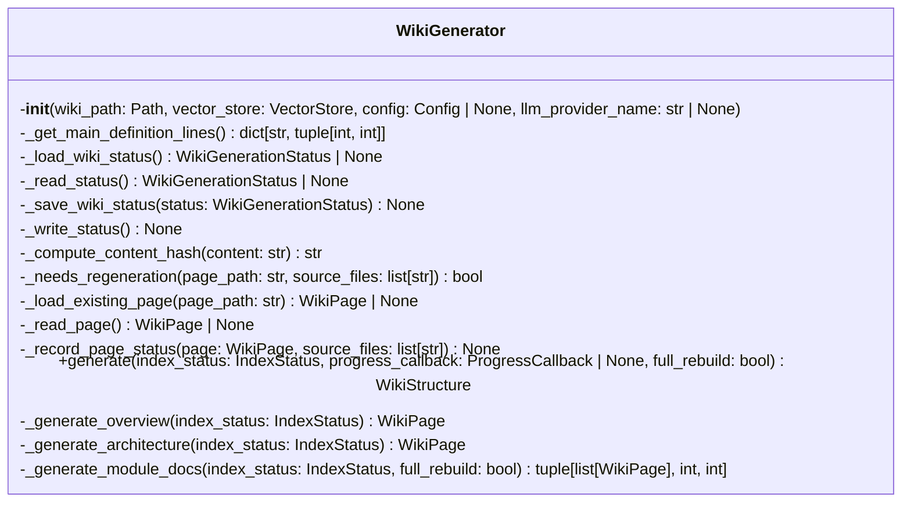

# Wiki Generator Module

## Overview

The `wiki.py` module provides the core functionality for generating documentation wikis from indexed code repositories. It contains the WikiGenerator class that orchestrates the creation of comprehensive documentation including overview pages, architecture diagrams, module documentation, and file-level documentation.

## Classes

### WikiGenerator

The WikiGenerator class is the [main](../watcher.md) component responsible for generating wiki documentation from a vector store of indexed code.

#### Constructor

```python
def __init__(
    self,
    wiki_path: Path,
    vector_store: VectorStore,
    config: Config | None = None,
    llm_provider_name: str | None = None,
):
```

**Parameters:**
- `wiki_path`: Path to the wiki output directory where documentation will be generated
- `vector_store`: [VectorStore](../core/vectorstore.md) instance containing the indexed code repository
- `config`: Optional [Config](../config.md) instance for customization (defaults to global config if not provided)
- `llm_provider_name`: Optional override for the LLM provider ("ollama", "anthropic", "openai")

#### Key Methods

The WikiGenerator class includes several methods for managing the documentation generation process:

- **Status Management**: Methods for loading and saving wiki generation status to track which pages need regeneration
- **Content Generation**: Methods for generating different types of documentation pages including overviews, architecture documentation, module docs, and file-level documentation
- **Page Management**: Methods for writing pages to disk and managing the wiki structure

## Functions

### generate_wiki

```python
async def generate_wiki(
    repo_path: Path,
    wiki_path: Path,
    vector_store: VectorStore,
    index_status: IndexStatus,
    config: Config | None = None,
    llm_provider: str | None = None,
    progress_callback: ProgressCallback | None = None,
    full_rebuild: bool = False,
) -> WikiStructure:
```

A convenience function that provides a high-level interface for generating wiki documentation.

**Parameters:**
- `repo_path`: Path to the source repository
- `wiki_path`: Path where the wiki documentation should be generated
- `vector_store`: [VectorStore](../core/vectorstore.md) instance with indexed repository content
- `index_status`: IndexStatus object tracking the indexing state
- `config`: Optional [Config](../config.md) instance for customization
- `llm_provider`: Optional LLM provider override
- [`progress_callback`](../watcher.md): Optional callback for tracking generation progress
- `full_rebuild`: Boolean flag to force complete regeneration of all pages

**Returns:**
- `WikiStructure`: Object representing the generated wiki structure

## Usage Examples

### Basic Wiki Generation

```python
from pathlib import Path
from local_deepwiki.generators.wiki import generate_wiki

# Generate wiki documentation
wiki_structure = await generate_wiki(
    repo_path=Path("./my-project"),
    wiki_path=Path("./wiki-output"),
    vector_store=my_vector_store,
    index_status=my_index_status
)
```

### Custom Configuration

```python
from local_deepwiki.generators.wiki import WikiGenerator

# Create generator with custom configuration
generator = WikiGenerator(
    wiki_path=Path("./docs"),
    vector_store=my_vector_store,
    config=my_config,
    llm_provider_name="anthropic"
)

# Generate the wiki
await generator.generate(
    repo_path=Path("./my-project"),
    index_status=my_index_status
)
```

## Related Components

The WikiGenerator integrates with several other components from the local_deepwiki system:

- **[VectorStore](../core/vectorstore.md)**: Provides indexed code content for documentation generation
- **[Config](../config.md)**: Supplies configuration settings for the generation process
- **[EntityRegistry](crosslinks.md)**: Manages cross-linking between documentation pages
- **API Documentation Generator**: Generates API documentation for files
- **Call Graph Generator**: Creates call graph information for code analysis
- **Diagram Generators**: Creates various types of diagrams including class diagrams, dependency graphs, and language charts

The module also works with external components for LLM integration through providers like Ollama, Anthropic, and OpenAI to generate intelligent documentation content.

## API Reference

### class `WikiGenerator`

Generate wiki documentation from indexed code.

**Methods:**

#### `__init__`

```python
def __init__(wiki_path: Path, vector_store: VectorStore, config: Config | None = None, llm_provider_name: str | None = None)
```

Initialize the wiki generator.


| [Parameter](api_docs.md) | Type | Default | Description |
|-----------|------|---------|-------------|
| `wiki_path` | `Path` | - | Path to wiki output directory. |
| `vector_store` | [`VectorStore`](../core/vectorstore.md) | - | Vector store with indexed code. |
| `config` | `Config | None` | `None` | Optional configuration. |
| `llm_provider_name` | `str | None` | `None` | Override LLM provider ("ollama", "anthropic", "openai"). |

#### `generate`

```python
async def generate(index_status: IndexStatus, progress_callback: ProgressCallback | None = None, full_rebuild: bool = False) -> WikiStructure
```

Generate wiki documentation for the indexed repository.


| [Parameter](api_docs.md) | Type | Default | Description |
|-----------|------|---------|-------------|
| `index_status` | `IndexStatus` | - | The index status with file information. |
| [`progress_callback`](../watcher.md) | `ProgressCallback | None` | `None` | Optional progress callback. |
| `full_rebuild` | `bool` | `False` | If True, regenerate all pages. Otherwise, only regenerate changed pages. |


---

### Functions

#### `generate_wiki`

```python
async def generate_wiki(repo_path: Path, wiki_path: Path, vector_store: VectorStore, index_status: IndexStatus, config: Config | None = None, llm_provider: str | None = None, progress_callback: ProgressCallback | None = None, full_rebuild: bool = False) -> WikiStructure
```

Convenience function to generate wiki documentation.


| [Parameter](api_docs.md) | Type | Default | Description |
|-----------|------|---------|-------------|
| `repo_path` | `Path` | - | Path to the repository. |
| `wiki_path` | `Path` | - | Path for wiki output. |
| `vector_store` | [`VectorStore`](../core/vectorstore.md) | - | Indexed vector store. |
| `index_status` | `IndexStatus` | - | Index status. |
| `config` | `Config | None` | `None` | Optional configuration. |
| `llm_provider` | `str | None` | `None` | Optional LLM provider override. |
| [`progress_callback`](../watcher.md) | `ProgressCallback | None` | `None` | Optional progress callback. |
| `full_rebuild` | `bool` | `False` | If True, regenerate all pages. Otherwise, only regenerate changed pages. |

**Returns:** `WikiStructure`


## Class Diagram



## Call Graph

```mermaid
flowchart TD
    N0[Path]
    N1[WikiGenerator.__init__]
    N2[WikiGenerator._compute_cont...]
    N3[WikiGenerator._generate_arc...]
    N4[WikiGenerator._generate_dep...]
    N5[WikiGenerator._generate_fil...]
    N6[WikiGenerator._generate_mod...]
    N7[WikiGenerator._generate_ove...]
    N8[WikiGenerator._get_main_def...]
    N9[WikiGenerator._load_existin...]
    N10[WikiGenerator._load_wiki_st...]
    N11[WikiGenerator._read_status]
    N12[WikiGenerator._save_wiki_st...]
    N13[WikiGenerator._write_page]
    N14[WikiGenerator.generate]
    N15[WikiPage]
    N16[_load_existing_page]
    N17[_needs_regeneration]
    N18[_record_page_status]
    N19[dump]
    N20[exists]
    N21[generate]
    N22[generate_wiki]
    N23[hexdigest]
    N24[load]
    N25[model_dump]
    N26[model_validate]
    N27[search]
    N28[time]
    N29[to_thread]
    N22 --> N21
    N10 --> N20
    N10 --> N24
    N10 --> N26
    N10 --> N29
    N11 --> N24
    N11 --> N26
    N12 --> N25
    N12 --> N19
    N12 --> N29
    N2 --> N23
    N9 --> N20
    N9 --> N0
    N9 --> N28
    N9 --> N15
    N9 --> N29
    N14 --> N0
    N14 --> N17
    N14 --> N16
    N14 --> N18
    N14 --> N27
    N14 --> N28
    N14 --> N23
    N14 --> N25
    N7 --> N0
    N7 --> N27
    N7 --> N21
    N7 --> N15
    N7 --> N28
    N3 --> N27
    N3 --> N21
    N3 --> N15
    N3 --> N28
    N6 --> N0
    N6 --> N17
    N6 --> N16
    N6 --> N18
    N6 --> N27
    N6 --> N21
    N6 --> N15
    N6 --> N28
    N5 --> N0
    N5 --> N17
    N5 --> N16
    N5 --> N18
    N5 --> N27
    N5 --> N21
    N5 --> N20
    N5 --> N15
    N5 --> N28
    N4 --> N27
    N4 --> N21
    N4 --> N15
    N4 --> N28
    N13 --> N29
    classDef func fill:#e1f5fe
    class N0,N15,N16,N17,N18,N19,N20,N21,N22,N23,N24,N25,N26,N27,N28,N29 func
    classDef method fill:#fff3e0
    class N1,N2,N3,N4,N5,N6,N7,N8,N9,N10,N11,N12,N13,N14 method
```



## Relevant Source Files

- `src/local_deepwiki/generators/wiki.py:66-1160`

## See Also

- [server](../server.md) - uses this
