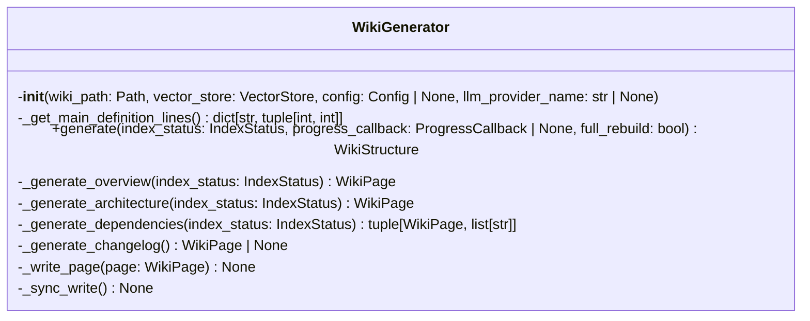

# Wiki Generator Module

## File Overview

The `wiki.py` module contains the core wiki generation functionality for the local-deepwiki system. It provides the WikiGenerator class that orchestrates the creation of documentation wikis from code analysis, utilizing vector stores for semantic search and various specialized generators for different types of content.

## Classes

### WikiGenerator

The WikiGenerator class is the [main](../export/pdf.md) orchestrator for generating documentation wikis from analyzed codebases.

#### Constructor

```python
def __init__(
    self,
    wiki_path: Path,
    vector_store: VectorStore,
    config: Config | None = None,
    llm_provider_name: str | None = None,
):
```

**Parameters:**
- `wiki_path`: Path to the wiki output directory where generated documentation will be saved
- `vector_store`: [VectorStore](../core/vectorstore.md) instance containing indexed code for semantic search
- `config`: Optional [Config](../config.md) instance for customization (defaults to system config if not provided)
- `llm_provider_name`: Optional override for LLM provider selection ("ollama", "anthropic", "openai")

**Purpose:** Initializes the wiki generator with the necessary components for documentation generation, including output location, code index, configuration, and AI provider settings.

## Functions

### generate_wiki

```python
def generate_wiki(
    # Function signature not fully visible in provided code
):
```

A module-level function for generating wikis. The complete signature and implementation details are not visible in the provided code chunks.

## Usage Examples

### Basic WikiGenerator Setup

```python
from pathlib import Path
from local_deepwiki.generators.wiki import WikiGenerator
from local_deepwiki.core.vectorstore import VectorStore

# Initialize with required components
wiki_path = Path("./docs/wiki")
vector_store = VectorStore()  # Assume properly initialized
generator = WikiGenerator(wiki_path, vector_store)
```

### WikiGenerator with Custom Configuration

```python
from local_deepwiki.config import Config

# Use custom configuration and LLM provider
config = Config()  # Assume properly configured
generator = WikiGenerator(
    wiki_path=Path("./output"),
    vector_store=vector_store,
    config=config,
    llm_provider_name="anthropic"
)
```

## Related Components

The WikiGenerator integrates with several other components in the local-deepwiki system:

### Core Components
- **[VectorStore](../core/vectorstore.md)**: Provides semantic search capabilities over indexed code
- **[Config](../config.md)**: Manages system configuration and settings

### Specialized Generators
- **Coverage Generator**: Creates coverage analysis pages
- **CrossLinks Generator**: Handles entity registry and cross-reference linking
- **Stale Detection Generator**: Generates reports on outdated documentation
- **Glossary Generator**: Creates glossary pages for technical terms
- **Inheritance Generator**: Generates class inheritance documentation
- **Manifest Generator**: Manages project manifests and metadata

### Utilities
- **[EntityRegistry](crosslinks.md)**: Manages cross-reference entities for linking
- **[add_cross_links](crosslinks.md)**: Function for adding cross-references between wiki pages

The module uses standard Python libraries including `hashlib`, `json`, `time`, and `pathlib` for core functionality like file operations, data serialization, and content hashing.

## API Reference

### class `WikiGenerator`

Generate wiki documentation from indexed code.

**Methods:**


<details>
<summary>View Source (lines 42-460) | <a href="https://github.com/UrbanDiver/local-deepwiki-mcp/blob/[main](../export/pdf.md)/src/local_deepwiki/generators/wiki.py#L42-L460">GitHub</a></summary>

```python
class WikiGenerator:
    # Methods: __init__, _get_main_definition_lines, generate, _generate_overview, _generate_architecture, _generate_dependencies, _generate_changelog, _write_page, _sync_write
```

</details>

#### `__init__`

```python
def __init__(wiki_path: Path, vector_store: VectorStore, config: Config | None = None, llm_provider_name: str | None = None)
```

Initialize the wiki generator.


| [Parameter](api_docs.md) | Type | Default | Description |
|-----------|------|---------|-------------|
| `wiki_path` | `Path` | - | Path to wiki output directory. |
| `vector_store` | [`VectorStore`](../core/vectorstore.md) | - | Vector store with indexed code. |
| `config` | `Config | None` | `None` | Optional configuration. |
| `llm_provider_name` | `str | None` | `None` | Override LLM provider ("ollama", "anthropic", "openai"). |


<details>
<summary>View Source (lines 45-86) | <a href="https://github.com/UrbanDiver/local-deepwiki-mcp/blob/[main](../export/pdf.md)/src/local_deepwiki/generators/wiki.py#L45-L86">GitHub</a></summary>

```python
def __init__(
        self,
        wiki_path: Path,
        vector_store: VectorStore,
        config: Config | None = None,
        llm_provider_name: str | None = None,
    ):
        """Initialize the wiki generator.

        Args:
            wiki_path: Path to wiki output directory.
            vector_store: Vector store with indexed code.
            config: Optional configuration.
            llm_provider_name: Override LLM provider ("ollama", "anthropic", "openai").
        """
        self.wiki_path = wiki_path
        self.vector_store = vector_store
        self.config = config or get_config()

        # Override LLM provider if specified
        if llm_provider_name:
            self.config.llm.provider = llm_provider_name  # type: ignore

        self.llm = get_llm_provider(self.config.llm)

        # Get provider-specific system prompt
        self._system_prompt = self.config.get_prompts().wiki_system

        # Entity registry for cross-linking
        self.entity_registry = EntityRegistry()

        # Relationship analyzer for See Also sections
        self.relationship_analyzer = RelationshipAnalyzer()

        # Status manager for incremental updates
        self.status_manager = WikiStatusManager(wiki_path)

        # Cached project manifest (parsed from package files)
        self._manifest: ProjectManifest | None = None

        # Repository path (set during generation)
        self._repo_path: Path | None = None
```

</details>

#### `generate`

```python
async def generate(index_status: IndexStatus, progress_callback: ProgressCallback | None = None, full_rebuild: bool = False) -> WikiStructure
```

Generate wiki documentation for the indexed repository.


| [Parameter](api_docs.md) | Type | Default | Description |
|-----------|------|---------|-------------|
| `index_status` | [`IndexStatus`](../models.md) | - | The index status with file information. |
| [`progress_callback`](../handlers.md) | `ProgressCallback | None` | `None` | Optional progress callback. |
| `full_rebuild` | `bool` | `False` | If True, regenerate all pages. Otherwise, only regenerate changed pages. |


---


<details>
<summary>View Source (lines 117-410) | <a href="https://github.com/UrbanDiver/local-deepwiki-mcp/blob/[main](../export/pdf.md)/src/local_deepwiki/generators/wiki.py#L117-L410">GitHub</a></summary>

```python
async def generate(
        self,
        index_status: IndexStatus,
        progress_callback: ProgressCallback | None = None,
        full_rebuild: bool = False,
    ) -> WikiStructure:
        """Generate wiki documentation for the indexed repository.

        Args:
            index_status: The index status with file information.
            progress_callback: Optional progress callback.
            full_rebuild: If True, regenerate all pages. Otherwise, only regenerate changed pages.

        Returns:
            WikiStructure with generated pages.
        """
        logger.info(f"Starting wiki generation for {index_status.repo_path}")
        logger.debug(f"Full rebuild: {full_rebuild}, Total files: {index_status.total_files}")

        pages: list[WikiPage] = []
        total_steps = 13  # overview, architecture, modules, files, dependencies, changelog, inheritance, glossary, coverage, cross-links, see-also, search, freshness
        pages_generated = 0
        pages_skipped = 0

        # Store repo path and parse manifest for grounded generation (with caching)
        self._repo_path = Path(index_status.repo_path)
        self._manifest = get_cached_manifest(self._repo_path, cache_dir=self.wiki_path)

        # Build file hash map for incremental generation
        self.status_manager.file_hashes = {f.path: f.hash for f in index_status.files}
        all_source_files = list(self.status_manager.file_hashes.keys())

        # Load previous wiki status for incremental updates
        if not full_rebuild:
            await self.status_manager.load_status()

        # Pre-compute line info for source files (for source refs with line numbers)
        self.status_manager.file_line_info = self._get_main_definition_lines()

        # Generate index page (overview) - depends on all files
        if progress_callback:
            progress_callback("Generating overview", 0, total_steps)

        overview_path = "index.md"
        overview_page: WikiPage
        if full_rebuild or self.status_manager.needs_regeneration(overview_path, all_source_files):
            overview_page = await self._generate_overview(index_status)
            pages_generated += 1
        else:
            existing_page = await self.status_manager.load_existing_page(overview_path)
            if existing_page is None:
                overview_page = await self._generate_overview(index_status)
                pages_generated += 1
            else:
                overview_page = existing_page
                pages_skipped += 1

        pages.append(overview_page)
        self.status_manager.record_page_status(overview_page, all_source_files)
        await self._write_page(overview_page)

        # Generate architecture page - depends on all files
        if progress_callback:
            progress_callback("Generating architecture docs", 1, total_steps)

        architecture_path = "architecture.md"
        architecture_page: WikiPage
        if full_rebuild or self.status_manager.needs_regeneration(
            architecture_path, all_source_files
        ):
            architecture_page = await self._generate_architecture(index_status)
            pages_generated += 1
        else:
            existing_arch_page = await self.status_manager.load_existing_page(architecture_path)
            if existing_arch_page is None:
                architecture_page = await self._generate_architecture(index_status)
                pages_generated += 1
            else:
                architecture_page = existing_arch_page
                pages_skipped += 1

        pages.append(architecture_page)
        self.status_manager.record_page_status(architecture_page, all_source_files)
        await self._write_page(architecture_page)

        # Collect import chunks for relationship analysis (needed for See Also)
        import_results = await self.vector_store.search(
            "import require include",
            limit=self.config.wiki.import_search_limit,
        )
        import_chunks = [r.chunk for r in import_results if r.chunk.chunk_type.value == "import"]
        self.relationship_analyzer.analyze_chunks(import_chunks)

        # Generate module pages
        if progress_callback:
            progress_callback("Generating module documentation", 2, total_steps)

        module_pages, gen_count, skip_count = await generate_module_docs(
            index_status=index_status,
            vector_store=self.vector_store,
            llm=self.llm,
            system_prompt=self._system_prompt,
            status_manager=self.status_manager,
            full_rebuild=full_rebuild,
        )
        pages_generated += gen_count
        pages_skipped += skip_count
        for page in module_pages:
            pages.append(page)
            await self._write_page(page)

        # Generate file-level documentation
        if progress_callback:
            progress_callback("Generating file documentation", 3, total_steps)

        file_pages, gen_count, skip_count = await generate_file_docs(
            index_status=index_status,
            vector_store=self.vector_store,
            llm=self.llm,
            system_prompt=self._system_prompt,
            status_manager=self.status_manager,
            entity_registry=self.entity_registry,
            config=self.config,
            progress_callback=progress_callback,
            full_rebuild=full_rebuild,
        )
        pages_generated += gen_count
        pages_skipped += skip_count
        for page in file_pages:
            pages.append(page)
            await self._write_page(page)

        # Generate dependencies page - depends on all files
        if progress_callback:
            progress_callback("Generating dependencies", 4, total_steps)

        deps_path = "dependencies.md"
        deps_page: WikiPage
        deps_source_files: list[str]
        if full_rebuild or self.status_manager.needs_regeneration(deps_path, all_source_files):
            deps_page, deps_source_files = await self._generate_dependencies(index_status)
            pages_generated += 1
        else:
            existing_deps_page = await self.status_manager.load_existing_page(deps_path)
            if existing_deps_page is None:
                deps_page, deps_source_files = await self._generate_dependencies(index_status)
                pages_generated += 1
            else:
                deps_page = existing_deps_page
                # Use source files from previous status if available
                prev_status = self.status_manager.page_statuses.get(deps_path) or (
                    self.status_manager.previous_status.pages.get(deps_path)
                    if self.status_manager.previous_status
                    else None
                )
                deps_source_files = prev_status.source_files if prev_status else all_source_files
                pages_skipped += 1

        pages.append(deps_page)
        self.status_manager.record_page_status(deps_page, deps_source_files)
        await self._write_page(deps_page)

        # Generate changelog page from git history
        if progress_callback:
            progress_callback("Generating changelog", 5, total_steps)

        changelog_page = await self._generate_changelog()
        if changelog_page:
            pages.append(changelog_page)
            self.status_manager.record_page_status(changelog_page, all_source_files)
            await self._write_page(changelog_page)
            pages_generated += 1

        # Generate inheritance page
        if progress_callback:
            progress_callback("Generating inheritance tree", 6, total_steps)

        inheritance_content = await generate_inheritance_page(index_status, self.vector_store)
        if inheritance_content:
            inheritance_page = WikiPage(
                path="inheritance.md",
                title="Class Inheritance",
                content=inheritance_content,
                generated_at=time.time(),
            )
            pages.append(inheritance_page)
            self.status_manager.record_page_status(inheritance_page, all_source_files)
            await self._write_page(inheritance_page)
            pages_generated += 1

        # Generate glossary page
        if progress_callback:
            progress_callback("Generating glossary", 7, total_steps)

        glossary_content = await generate_glossary_page(index_status, self.vector_store)
        if glossary_content:
            glossary_page = WikiPage(
                path="glossary.md",
                title="Glossary",
                content=glossary_content,
                generated_at=time.time(),
            )
            pages.append(glossary_page)
            self.status_manager.record_page_status(glossary_page, all_source_files)
            await self._write_page(glossary_page)
            pages_generated += 1

        # Generate coverage report page
        if progress_callback:
            progress_callback("Generating coverage report", 8, total_steps)

        coverage_content = await generate_coverage_page(index_status, self.vector_store)
        if coverage_content:
            coverage_page = WikiPage(
                path="coverage.md",
                title="Documentation Coverage",
                content=coverage_content,
                generated_at=time.time(),
            )
            pages.append(coverage_page)
            self.status_manager.record_page_status(coverage_page, all_source_files)
            await self._write_page(coverage_page)
            pages_generated += 1

        # Apply cross-links to all pages
        if progress_callback:
            progress_callback("Adding cross-links", 9, total_steps)

        pages = add_cross_links(pages, self.entity_registry)

        # Add Relevant Source Files sections with local wiki links
        pages = add_source_refs_sections(pages, self.status_manager.page_statuses, self.wiki_path)

        # Add See Also sections
        if progress_callback:
            progress_callback("Adding See Also sections", 10, total_steps)

        pages = add_see_also_sections(pages, self.relationship_analyzer)

        # Re-write pages with cross-links and See Also sections
        for page in pages:
            await self._write_page(page)

        # Generate search index with entity-level entries
        if progress_callback:
            progress_callback("Generating search index", 11, total_steps)

        await write_full_search_index(self.wiki_path, pages, index_status, self.vector_store)

        # Generate table of contents with hierarchical numbering
        page_list = [{"path": p.path, "title": p.title} for p in pages]
        toc = generate_toc(page_list)
        write_toc(toc, self.wiki_path)

        # Build wiki generation status
        wiki_status = WikiGenerationStatus(
            repo_path=index_status.repo_path,
            generated_at=time.time(),
            total_pages=len(pages),
            index_status_hash=hashlib.sha256(
                json.dumps(index_status.model_dump(), sort_keys=True).encode()
            ).hexdigest()[:16],
            pages=self.status_manager.page_statuses,
        )

        # Generate freshness report (stale documentation detection)
        freshness_page = generate_stale_report_page(
            repo_path=self._repo_path,
            wiki_status=wiki_status,
            stale_threshold_days=0,
        )
        pages.append(freshness_page)
        self.status_manager.record_page_status(freshness_page, all_source_files)
        await self._write_page(freshness_page)
        pages_generated += 1

        # Update wiki status with freshness page
        wiki_status.pages[freshness_page.path] = self.status_manager.page_statuses[freshness_page.path]
        wiki_status.total_pages = len(pages)

        await self.status_manager.save_status(wiki_status)

        if progress_callback:
            progress_callback(
                f"Wiki generation complete ({pages_generated} generated, {pages_skipped} unchanged)",
                total_steps,
                total_steps,
            )

        logger.info(
            f"Wiki generation complete: {pages_generated} pages generated, "
            f"{pages_skipped} pages unchanged, {len(pages)} total pages"
        )
        return WikiStructure(root=str(self.wiki_path), pages=pages)
```

</details>

### Functions

#### `generate_wiki`

```python
async def generate_wiki(repo_path: Path, wiki_path: Path, vector_store: VectorStore, index_status: IndexStatus, config: Config | None = None, llm_provider: str | None = None, progress_callback: ProgressCallback | None = None, full_rebuild: bool = False) -> WikiStructure
```

Convenience function to generate wiki documentation.


| [Parameter](api_docs.md) | Type | Default | Description |
|-----------|------|---------|-------------|
| `repo_path` | `Path` | - | Path to the repository. |
| `wiki_path` | `Path` | - | Path for wiki output. |
| `vector_store` | [`VectorStore`](../core/vectorstore.md) | - | Indexed vector store. |
| `index_status` | [`IndexStatus`](../models.md) | - | Index status. |
| `config` | `Config | None` | `None` | Optional configuration. |
| `llm_provider` | `str | None` | `None` | Optional LLM provider override. |
| [`progress_callback`](../handlers.md) | `ProgressCallback | None` | `None` | Optional progress callback. |
| `full_rebuild` | `bool` | `False` | If True, regenerate all pages. Otherwise, only regenerate changed pages. |

**Returns:** [`WikiStructure`](../models.md)


<details>
<summary>View Source (lines 463-505) | <a href="https://github.com/UrbanDiver/local-deepwiki-mcp/blob/[main](../export/pdf.md)/src/local_deepwiki/generators/wiki.py#L463-L505">GitHub</a></summary>

```python
async def generate_wiki(
    repo_path: Path,
    wiki_path: Path,
    vector_store: VectorStore,
    index_status: IndexStatus,
    config: Config | None = None,
    llm_provider: str | None = None,
    progress_callback: ProgressCallback | None = None,
    full_rebuild: bool = False,
) -> WikiStructure:
    """Convenience function to generate wiki documentation.

    Args:
        repo_path: Path to the repository.
        wiki_path: Path for wiki output.
        vector_store: Indexed vector store.
        index_status: Index status.
        config: Optional configuration.
        llm_provider: Optional LLM provider override.
        progress_callback: Optional progress callback.
        full_rebuild: If True, regenerate all pages. Otherwise, only regenerate changed pages.

    Returns:
        WikiStructure with generated pages.
    """
    from local_deepwiki.core.git_utils import is_github_repo

    config = config or get_config()

    # Auto-switch to cloud provider for GitHub repos if configured
    effective_provider = llm_provider
    if effective_provider is None and config.wiki.use_cloud_for_github:
        if is_github_repo(repo_path):
            effective_provider = config.wiki.github_llm_provider
            logger.info(f"GitHub repo detected, using cloud provider: {effective_provider}")

    generator = WikiGenerator(
        wiki_path=wiki_path,
        vector_store=vector_store,
        config=config,
        llm_provider_name=effective_provider,
    )
    return await generator.generate(index_status, progress_callback, full_rebuild)
```

</details>

## Class Diagram



## Call Graph

```mermaid
flowchart TD
    N0[EntityRegistry]
    N1[Path]
    N2[RelationshipAnalyzer]
    N3[WikiGenerator]
    N4[WikiGenerator.__init__]
    N5[WikiGenerator._get_main_def...]
    N6[WikiGenerator._sync_write]
    N7[WikiGenerator._write_page]
    N8[WikiGenerator.generate]
    N9[WikiStatusManager]
    N10[_generate_overview]
    N11[_get_main_definition_lines]
    N12[_get_table]
    N13[generate]
    N14[generate_wiki]
    N15[get_cached_manifest]
    N16[get_config]
    N17[get_llm_provider]
    N18[get_prompts]
    N19[groupby]
    N20[is_github_repo]
    N21[load_existing_page]
    N22[load_status]
    N23[mkdir]
    N24[needs_regeneration]
    N25[progress_callback]
    N26[record_page_status]
    N27[sort_values]
    N28[to_pandas]
    N29[write_text]
    N14 --> N16
    N14 --> N20
    N14 --> N3
    N14 --> N13
    N4 --> N16
    N4 --> N17
    N4 --> N18
    N4 --> N0
    N4 --> N2
    N4 --> N9
    N5 --> N12
    N5 --> N28
    N5 --> N19
    N5 --> N27
    N8 --> N1
    N8 --> N15
    N8 --> N22
    N8 --> N11
    N8 --> N25
    N8 --> N24
    N8 --> N10
    N8 --> N21
    N8 --> N26
    N7 --> N23
    N7 --> N29
    N6 --> N23
    N6 --> N29
    classDef func fill:#e1f5fe
    class N0,N1,N2,N3,N9,N10,N11,N12,N13,N14,N15,N16,N17,N18,N19,N20,N21,N22,N23,N24,N25,N26,N27,N28,N29 func
    classDef method fill:#fff3e0
    class N4,N5,N6,N7,N8 method
```



## Used By

Functions and methods in this file and their callers:

- **[`EntityRegistry`](crosslinks.md)**: called by `WikiGenerator.__init__`
- **`Path`**: called by `WikiGenerator.generate`
- **[`RelationshipAnalyzer`](see_also.md)**: called by `WikiGenerator.__init__`
- **[`WikiGenerationStatus`](../models.md)**: called by `WikiGenerator.generate`
- **`WikiGenerator`**: called by `generate_wiki`
- **[`WikiPage`](../models.md)**: called by `WikiGenerator.generate`
- **[`WikiStatusManager`](wiki_status.md)**: called by `WikiGenerator.__init__`
- **[`WikiStructure`](../models.md)**: called by `WikiGenerator.generate`
- **`_generate_architecture`**: called by `WikiGenerator.generate`
- **`_generate_changelog`**: called by `WikiGenerator.generate`
- **`_generate_dependencies`**: called by `WikiGenerator.generate`
- **`_generate_overview`**: called by `WikiGenerator.generate`
- **`_get_main_definition_lines`**: called by `WikiGenerator.generate`
- **`_get_table`**: called by `WikiGenerator._get_main_definition_lines`
- **`_write_page`**: called by `WikiGenerator.generate`
- **[`add_cross_links`](crosslinks.md)**: called by `WikiGenerator.generate`
- **[`add_see_also_sections`](see_also.md)**: called by `WikiGenerator.generate`
- **[`add_source_refs_sections`](source_refs.md)**: called by `WikiGenerator.generate`
- **`analyze_chunks`**: called by `WikiGenerator.generate`
- **`dumps`**: called by `WikiGenerator.generate`
- **`encode`**: called by `WikiGenerator.generate`
- **`generate`**: called by `generate_wiki`
- **[`generate_architecture_page`](wiki_pages.md)**: called by `WikiGenerator._generate_architecture`
- **[`generate_changelog_page`](wiki_pages.md)**: called by `WikiGenerator._generate_changelog`
- **[`generate_coverage_page`](coverage.md)**: called by `WikiGenerator.generate`
- **[`generate_dependencies_page`](wiki_pages.md)**: called by `WikiGenerator._generate_dependencies`
- **[`generate_file_docs`](wiki_files.md)**: called by `WikiGenerator.generate`
- **[`generate_glossary_page`](glossary.md)**: called by `WikiGenerator.generate`
- **[`generate_inheritance_page`](inheritance.md)**: called by `WikiGenerator.generate`
- **[`generate_module_docs`](wiki_modules.md)**: called by `WikiGenerator.generate`
- **[`generate_overview_page`](wiki_pages.md)**: called by `WikiGenerator._generate_overview`
- **[`generate_stale_report_page`](stale_detection.md)**: called by `WikiGenerator.generate`
- **[`generate_toc`](toc.md)**: called by `WikiGenerator.generate`
- **[`get_cached_manifest`](manifest.md)**: called by `WikiGenerator.generate`
- **[`get_config`](../config.md)**: called by `WikiGenerator.__init__`, `generate_wiki`
- **`get_llm_provider`**: called by `WikiGenerator.__init__`
- **`get_prompts`**: called by `WikiGenerator.__init__`
- **`groupby`**: called by `WikiGenerator._get_main_definition_lines`
- **`hexdigest`**: called by `WikiGenerator.generate`
- **[`is_github_repo`](../core/git_utils.md)**: called by `generate_wiki`
- **`load_existing_page`**: called by `WikiGenerator.generate`
- **`load_status`**: called by `WikiGenerator.generate`
- **`mkdir`**: called by `WikiGenerator._sync_write`, `WikiGenerator._write_page`
- **`model_dump`**: called by `WikiGenerator.generate`
- **`needs_regeneration`**: called by `WikiGenerator.generate`
- **[`progress_callback`](../handlers.md)**: called by `WikiGenerator.generate`
- **`record_page_status`**: called by `WikiGenerator.generate`
- **`save_status`**: called by `WikiGenerator.generate`
- **`search`**: called by `WikiGenerator.generate`
- **`sha256`**: called by `WikiGenerator.generate`
- **`sort_values`**: called by `WikiGenerator._get_main_definition_lines`
- **`time`**: called by `WikiGenerator.generate`
- **`to_pandas`**: called by `WikiGenerator._get_main_definition_lines`
- **`to_thread`**: called by `WikiGenerator._write_page`
- **[`write_full_search_index`](search.md)**: called by `WikiGenerator.generate`
- **`write_text`**: called by `WikiGenerator._sync_write`, `WikiGenerator._write_page`
- **[`write_toc`](toc.md)**: called by `WikiGenerator.generate`

## Usage Examples

*Examples extracted from test files*

### Test generates basic overview page

From `test_wiki_pages_coverage.py::TestGenerateOverviewPage::test_generates_basic_overview`:

```python
result = await generate_overview_page(
    index_status=index_status,
    vector_store=mock_vector_store,
    llm=mock_llm,
    system_prompt="You are a documentation expert.",
    manifest=None,
    repo_path=repo_path,
)

assert result.path == "index.md"
assert result.title == "Overview"
```

### Test includes manifest description in content

From `test_wiki_pages_coverage.py::TestGenerateOverviewPage::test_includes_manifest_description`:

```python
result = await generate_overview_page(
    index_status=index_status,
    vector_store=mock_vector_store,
    llm=mock_llm,
    system_prompt="You are a documentation expert.",
    manifest=manifest,
    repo_path=repo_path,
)

assert "A great project for testing." in result.content
```

### Test returns empty when no files in index

From `test_wiki_files_coverage.py::TestGenerateFileDocs::test_returns_empty_for_no_files`:

```python
pages, generated, skipped = await generate_file_docs(
    index_status=index_status,
    vector_store=mock_vector_store,
    llm=mock_llm,
    system_prompt="System prompt",
    status_manager=mock_status_manager,
    entity_registry=mock_entity_registry,
    config=mock_config,
    full_rebuild=True,
)

assert pages == []
assert generated == 0
```

### Test filters out __init__.py files

From `test_wiki_files_coverage.py::TestGenerateFileDocs::test_filters_init_files`:

```python
files=[make_file_info(path="src/__init__.py")],
)

pages, generated, skipped = await generate_file_docs(
    index_status=index_status,
    vector_store=mock_vector_store,
    llm=mock_llm,
    system_prompt="System prompt",
    status_manager=mock_status_manager,
    entity_registry=mock_entity_registry,
    config=mock_config,
    full_rebuild=True,
)

assert pages == []
```

### Test filters out __init__.py files

From `test_wiki_files_coverage.py::TestGenerateFileDocs::test_filters_init_files`:

```python
pages, generated, skipped = await generate_file_docs(
    index_status=index_status,
    vector_store=mock_vector_store,
    llm=mock_llm,
    system_prompt="System prompt",
    status_manager=mock_status_manager,
    entity_registry=mock_entity_registry,
    config=mock_config,
    full_rebuild=True,
)

assert pages == []
```


## Last Modified

| Entity | Type | Author | Date | Commit |
|--------|------|--------|------|--------|
| `WikiGenerator` | class | Not Committed Yet | today | `0000000` Version of src/local_deepwi... |
| `generate` | method | Not Committed Yet | today | `0000000` Version of src/local_deepwi... |
| `_generate_dependencies` | method | Brian Breidenbach | today | `0d91a70` Apply Python best practices... |
| `generate_wiki` | function | Brian Breidenbach | today | `0d91a70` Apply Python best practices... |
| `_get_main_definition_lines` | method | Brian Breidenbach | yesterday | `65d50b1` Fix remaining pyright type ... |
| `__init__` | method | Brian Breidenbach | yesterday | `3defaaa` Refactor: Extract validatio... |
| `_write_page` | method | Brian Breidenbach | yesterday | `3defaaa` Refactor: Extract validatio... |
| `_generate_overview` | method | Brian Breidenbach | yesterday | `b8f8b68` Refactor: Extract page gene... |
| `_generate_architecture` | method | Brian Breidenbach | yesterday | `b8f8b68` Refactor: Extract page gene... |
| `_generate_changelog` | method | Brian Breidenbach | yesterday | `b8f8b68` Refactor: Extract page gene... |
| `_sync_write` | method | Brian Breidenbach | 3 days ago | `c568951` Add input validation, type ... |

## Additional Source Code

Source code for functions and methods not listed in the API Reference above.

#### `_get_main_definition_lines`

<details>
<summary>View Source (lines 88-115) | <a href="https://github.com/UrbanDiver/local-deepwiki-mcp/blob/[main](../export/pdf.md)/src/local_deepwiki/generators/wiki.py#L88-L115">GitHub</a></summary>

```python
def _get_main_definition_lines(self) -> dict[str, tuple[int, int]]:
        """Get line range of main definition (first class or function) per file.

        Returns:
            Dict mapping file_path to (start_line, end_line) tuple.
        """
        table = self.vector_store._get_table()
        if table is None:
            return {}

        df = table.to_pandas()
        result: dict[str, tuple[int, int]] = {}

        for file_path, group in df.groupby("file_path"):
            # Sort by start_line to get first definitions
            classes = group[group["chunk_type"] == "class"].sort_values(by="start_line")  # type: ignore[call-overload]
            functions = group[group["chunk_type"] == "function"].sort_values(by="start_line")  # type: ignore[call-overload]

            if not classes.empty:
                # Use first class definition
                row = classes.iloc[0]
                result[str(file_path)] = (int(row["start_line"]), int(row["end_line"]))
            elif not functions.empty:
                # Use first function definition
                row = functions.iloc[0]
                result[str(file_path)] = (int(row["start_line"]), int(row["end_line"]))

        return result
```

</details>


#### `_generate_overview`

<details>
<summary>View Source (lines 412-421) | <a href="https://github.com/UrbanDiver/local-deepwiki-mcp/blob/[main](../export/pdf.md)/src/local_deepwiki/generators/wiki.py#L412-L421">GitHub</a></summary>

```python
async def _generate_overview(self, index_status: IndexStatus) -> WikiPage:
        """Generate the main overview/index page with grounded facts."""
        return await generate_overview_page(
            index_status=index_status,
            vector_store=self.vector_store,
            llm=self.llm,
            system_prompt=self._system_prompt,
            manifest=self._manifest,
            repo_path=self._repo_path,
        )
```

</details>


#### `_generate_architecture`

<details>
<summary>View Source (lines 423-432) | <a href="https://github.com/UrbanDiver/local-deepwiki-mcp/blob/[main](../export/pdf.md)/src/local_deepwiki/generators/wiki.py#L423-L432">GitHub</a></summary>

```python
async def _generate_architecture(self, index_status: IndexStatus) -> WikiPage:
        """Generate architecture documentation with diagrams and grounded facts."""
        return await generate_architecture_page(
            index_status=index_status,
            vector_store=self.vector_store,
            llm=self.llm,
            system_prompt=self._system_prompt,
            manifest=self._manifest,
            repo_path=self._repo_path,
        )
```

</details>


#### `_generate_dependencies`

<details>
<summary>View Source (lines 434-443) | <a href="https://github.com/UrbanDiver/local-deepwiki-mcp/blob/[main](../export/pdf.md)/src/local_deepwiki/generators/wiki.py#L434-L443">GitHub</a></summary>

```python
async def _generate_dependencies(self, index_status: IndexStatus) -> tuple[WikiPage, list[str]]:
        """Generate dependencies documentation with grounded facts from manifest."""
        return await generate_dependencies_page(
            index_status=index_status,
            vector_store=self.vector_store,
            llm=self.llm,
            system_prompt=self._system_prompt,
            manifest=self._manifest,
            import_search_limit=self.config.wiki.import_search_limit,
        )
```

</details>


#### `_generate_changelog`

<details>
<summary>View Source (lines 445-447) | <a href="https://github.com/UrbanDiver/local-deepwiki-mcp/blob/[main](../export/pdf.md)/src/local_deepwiki/generators/wiki.py#L445-L447">GitHub</a></summary>

```python
async def _generate_changelog(self) -> WikiPage | None:
        """Generate changelog page from git history."""
        return await generate_changelog_page(self._repo_path)
```

</details>


#### `_write_page`

<details>
<summary>View Source (lines 449-460) | <a href="https://github.com/UrbanDiver/local-deepwiki-mcp/blob/[main](../export/pdf.md)/src/local_deepwiki/generators/wiki.py#L449-L460">GitHub</a></summary>

```python
async def _write_page(self, page: WikiPage) -> None:
        """Write a wiki page to disk asynchronously."""
        import asyncio

        page_path = self.wiki_path / page.path
        content = page.content

        def _sync_write() -> None:
            page_path.parent.mkdir(parents=True, exist_ok=True)
            page_path.write_text(content)

        await asyncio.to_thread(_sync_write)
```

</details>


#### `_sync_write`

<details>
<summary>View Source (lines 456-458) | <a href="https://github.com/UrbanDiver/local-deepwiki-mcp/blob/[main](../export/pdf.md)/src/local_deepwiki/generators/wiki.py#L456-L458">GitHub</a></summary>

```python
def _sync_write() -> None:
            page_path.parent.mkdir(parents=True, exist_ok=True)
            page_path.write_text(content)
```

</details>

## Relevant Source Files

- `src/local_deepwiki/generators/wiki.py:42-460`
