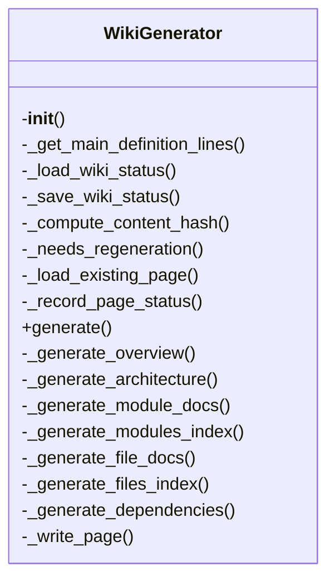

# Wiki Generator Documentation

## File Overview

This file contains the core logic for generating wiki documentation from code repositories. It defines the `WikiGenerator` class and a convenience function `generate_wiki` to orchestrate the wiki generation process. The generator uses vector stores for code indexing, LLMs for content generation, and various code analysis tools to extract API documentation, call graphs, and diagrams.

## Classes

### WikiGenerator

The `WikiGenerator` class is responsible for generating wiki documentation for a code repository. It uses a vector store for code indexing and integrates with various code analysis tools to produce structured documentation including overview pages, architecture diagrams, module documentation, and more.

#### Methods

##### `__init__`

Initializes the WikiGenerator with paths, vector store, and configuration.

```python
def __init__(
    self,
    wiki_path: Path,
    vector_store: VectorStore,
    config: Config | None = None,
    llm_provider_name: str | None = None,
) -> None
```

**Parameters:**
- `wiki_path`: Path to wiki output directory.
- `vector_store`: Vector store with indexed code.
- `config`: Optional configuration.
- `llm_provider_name`: Override LLM provider ("ollama", "anthropic", "openai").

##### `generate`

Generates the complete wiki documentation.

```python
async def generate(
    self,
    repo_path: Path,
    index_status: IndexStatus,
    progress_callback: Any = None,
    full_rebuild: bool = False,
) -> WikiStructure
```

**Parameters:**
- `repo_path`: Path to the repository.
- `index_status`: Index status.
- [`progress_callback`](../server.md): Optional callback for progress updates.
- `full_rebuild`: Whether to perform a full rebuild.

**Returns:**
- `WikiStructure`: The generated wiki structure.

##### `_get_main_definition_lines`

Extracts [main](../export/html.md) definition lines from a file.

```python
def _get_main_definition_lines(self, file_path: Path, lines: list[str]) -> list[str]
```

**Parameters:**
- `file_path`: Path to the file.
- `lines`: List of file lines.

**Returns:**
- `list[str]`: Lines containing [main](../export/html.md) definitions.

##### `_load_wiki_status`

Loads the wiki status from disk.

```python
def _load_wiki_status(self) -> dict[str, Any]
```

**Returns:**
- `dict[str, Any]`: Wiki status data.

##### `_save_wiki_status`

Saves the wiki status to disk.

```python
def _save_wiki_status(self, status: dict[str, Any]) -> None
```

**Parameters:**
- `status`: Wiki status data to save.

##### `_compute_content_hash`

Computes a hash of file content.

```python
def _compute_content_hash(self, content: str) -> str
```

**Parameters:**
- `content`: File content.

**Returns:**
- `str`: Hash of the content.

##### `_needs_regeneration`

Determines if a page needs regeneration.

```python
def _needs_regeneration(self, file_path: Path, page_path: Path) -> bool
```

**Parameters:**
- `file_path`: Path to the source file.
- `page_path`: Path to the wiki page.

**Returns:**
- `bool`: True if regeneration is needed.

##### `_load_existing_page`

Loads an existing wiki page.

```python
def _load_existing_page(self, page_path: Path) -> str | None
```

**Parameters:**
- `page_path`: Path to the wiki page.

**Returns:**
- `str | None`: Page content or None if not found.

##### `_record_page_status`

Records the status of a generated page.

```python
def _record_page_status(self, file_path: Path, page_path: Path) -> None
```

**Parameters:**
- `file_path`: Path to the source file.
- `page_path`: Path to the wiki page.

##### `_generate_overview`

Generates the overview page.

```python
def _generate_overview(self) -> str
```

**Returns:**
- `str`: Overview page content.

##### `_generate_architecture`

Generates the architecture documentation.

```python
def _generate_architecture(self) -> str
```

**Returns:**
- `str`: Architecture documentation.

##### `_generate_module_docs`

Generates documentation for a module.

```python
def _generate_module_docs(self, module_path: Path) -> str
```

**Parameters:**
- `module_path`: Path to the module.

**Returns:**
- `str`: Module documentation.

##### `_generate_modules_index`

Generates the modules index page.

```python
def _generate_modules_index(self) -> str
```

**Returns:**
- `str`: Modules index page content.

##### `_generate_file_docs`

Generates documentation for a file.

```python
def _generate_file_docs(self, file_path: Path) -> str
```

**Parameters:**
- `file_path`: Path to the file.

**Returns:**
- `str`: File documentation.

##### `_generate_files_index`

Generates the files index page.

```python
def _generate_files_index(self) -> str
```

**Returns:**
- `str`: Files index page content.

##### `_generate_dependencies`

Generates dependency information.

```python
def _generate_dependencies(self) -> str
```

**Returns:**
- `str`: Dependency documentation.

##### `_write_page`

Writes a page to disk.

```python
def _write_page(self, page_path: Path, content: str) -> None
```

**Parameters:**
- `page_path`: Path to write the page.
- `content`: Page content.

## Functions

### generate_wiki

A convenience function to generate wiki documentation for a repository.

```python
async def generate_wiki(
    repo_path: Path,
    wiki_path: Path,
    vector_store: VectorStore,
    index_status: IndexStatus,
    config: Config | None = None,
    llm_provider: str | None = None,
    progress_callback: Any = None,
    full_rebuild: bool = False,
) -> WikiStructure
```

**Parameters:**
- `repo_path`: Path to the repository.
- `wiki_path`: Path for wiki output.
- `vector_store`: Indexed vector store.
- `index_status`: Index status.
- `config`: Optional configuration.
- `llm_provider`: Optional LLM provider name.
- [`progress_callback`](../server.md): Optional callback for progress updates.
- `full_rebuild`: Whether to perform a full rebuild.

**Returns:**
- `WikiStructure`: The generated wiki structure.

## Usage Examples

### Basic Usage

```python
from local_deepwiki.generators.wiki import generate_wiki
from local_deepwiki.core.vectorstore import VectorStore
from local_deepwiki.config import Config
from pathlib import Path

# Initialize components
repo_path = Path("path/to/repo")
wiki_path = Path("path/to/wiki")
vector_store = VectorStore()
config = Config()
index_status = IndexStatus()

# Generate wiki
wiki_structure = await generate_wiki(
    repo_path=repo_path,
    wiki_path=wiki_path,
    vector_store=vector_store,
    index_status=index_status,
    config=config,
    llm_provider="openai"
)
```

### Using WikiGenerator Directly

```python
from local_deepwiki.generators.wiki import WikiGenerator
from local_deepwiki.core.vectorstore import VectorStore
from pathlib import Path

# Initialize components
wiki_path = Path("path/to/wiki")
vector_store = VectorStore()

# Create generator
wiki_gen = WikiGenerator(
    wiki_path=wiki_path,
    vector_store=vector_store
)

# Generate wiki
wiki_structure = await wiki_gen.generate(
    repo_path=Path("path/to/repo"),
    index_status=IndexStatus()
)
```

## Related Components

This file works with the following components:

- [`VectorStore`](../core/vectorstore.md): For code indexing and retrieval
- [`Config`](../config.md): Configuration management
- `IndexStatus`: Index status tracking
- `WikiStructure`: Structure of generated wiki
- Various code analysis generators:
  - [`get_file_api_docs`](api_docs.md)
  - `get_file_call_graph`
  - [`generate_class_diagram`](diagrams.md)
  - [`generate_dependency_graph`](diagrams.md)
  - [`generate_language_pie_chart`](diagrams.md)
  - [`generate_module_overview`](diagrams.md)
- Cross-linking tools: [`EntityRegistry`](crosslinks.md), [`add_cross_links`](crosslinks.md)

## API Reference

### class `WikiGenerator`

Generate wiki documentation from indexed code.

**Methods:**

#### `__init__`

```python
def __init__(wiki_path: Path, vector_store: VectorStore, config: Config | None = None, llm_provider_name: str | None = None)
```

Initialize the wiki generator.


| [Parameter](api_docs.md) | Type | Default | Description |
|-----------|------|---------|-------------|
| `wiki_path` | `Path` | - | Path to wiki output directory. |
| `vector_store` | [`VectorStore`](../core/vectorstore.md) | - | Vector store with indexed code. |
| `config` | `Config | None` | `None` | Optional configuration. |
| `llm_provider_name` | `str | None` | `None` | Override LLM provider ("ollama", "anthropic", "openai"). |

#### `generate`

```python
async def generate(index_status: IndexStatus, progress_callback: Any = None, full_rebuild: bool = False) -> WikiStructure
```

Generate wiki documentation for the indexed repository.


| [Parameter](api_docs.md) | Type | Default | Description |
|-----------|------|---------|-------------|
| `index_status` | `IndexStatus` | - | The index status with file information. |
| [`progress_callback`](../server.md) | `Any` | `None` | Optional progress callback. |
| `full_rebuild` | `bool` | `False` | If True, regenerate all pages. Otherwise, only regenerate changed pages. |


---

### Functions

#### `generate_wiki`

```python
async def generate_wiki(repo_path: Path, wiki_path: Path, vector_store: VectorStore, index_status: IndexStatus, config: Config | None = None, llm_provider: str | None = None, progress_callback: Any = None, full_rebuild: bool = False) -> WikiStructure
```

Convenience function to generate wiki documentation.


| [Parameter](api_docs.md) | Type | Default | Description |
|-----------|------|---------|-------------|
| `repo_path` | `Path` | - | Path to the repository. |
| `wiki_path` | `Path` | - | Path for wiki output. |
| `vector_store` | [`VectorStore`](../core/vectorstore.md) | - | Indexed vector store. |
| `index_status` | `IndexStatus` | - | Index status. |
| `config` | `Config | None` | `None` | Optional configuration. |
| `llm_provider` | `str | None` | `None` | Optional LLM provider override. |
| [`progress_callback`](../server.md) | `Any` | `None` | Optional progress callback. |
| `full_rebuild` | `bool` | `False` | If True, regenerate all pages. Otherwise, only regenerate changed pages. |

**Returns:** `WikiStructure`


## Class Diagram



## Call Graph

```mermaid
flowchart TD
    N0[Path]
    N1[WikiGenerator.__init__]
    N2[WikiGenerator._compute_cont...]
    N3[WikiGenerator._generate_arc...]
    N4[WikiGenerator._generate_dep...]
    N5[WikiGenerator._generate_fil...]
    N6[WikiGenerator._generate_mod...]
    N7[WikiGenerator._generate_ove...]
    N8[WikiGenerator._get_main_def...]
    N9[WikiGenerator._load_existin...]
    N10[WikiGenerator._load_wiki_st...]
    N11[WikiGenerator._record_page_...]
    N12[WikiGenerator._save_wiki_st...]
    N13[WikiGenerator.generate]
    N14[WikiPage]
    N15[_load_existing_page]
    N16[_needs_regeneration]
    N17[_record_page_status]
    N18[add]
    N19[encode]
    N20[exists]
    N21[generate]
    N22[generate_wiki]
    N23[get_directory_tree]
    N24[hexdigest]
    N25[model_dump]
    N26[search]
    N27[setdefault]
    N28[sha256]
    N29[time]
    N22 --> N21
    N10 --> N20
    N12 --> N25
    N2 --> N24
    N2 --> N28
    N2 --> N19
    N9 --> N20
    N9 --> N0
    N9 --> N29
    N9 --> N14
    N13 --> N0
    N13 --> N16
    N13 --> N15
    N13 --> N17
    N13 --> N26
    N13 --> N29
    N13 --> N24
    N13 --> N28
    N13 --> N19
    N13 --> N25
    N7 --> N0
    N7 --> N26
    N7 --> N18
    N7 --> N23
    N7 --> N21
    N7 --> N14
    N7 --> N29
    N3 --> N26
    N3 --> N18
    N3 --> N23
    N3 --> N21
    N3 --> N14
    N3 --> N29
    N6 --> N0
    N6 --> N27
    N6 --> N16
    N6 --> N15
    N6 --> N17
    N6 --> N26
    N6 --> N21
    N6 --> N14
    N6 --> N29
    N5 --> N0
    N5 --> N16
    N5 --> N15
    N5 --> N17
    N5 --> N26
    N5 --> N21
    N5 --> N20
    N5 --> N14
    N5 --> N29
    N4 --> N26
    N4 --> N21
    N4 --> N14
    N4 --> N29
    classDef func fill:#e1f5fe
    class N0,N14,N15,N16,N17,N18,N19,N20,N21,N22,N23,N24,N25,N26,N27,N28,N29 func
    classDef method fill:#fff3e0
    class N1,N2,N3,N4,N5,N6,N7,N8,N9,N10,N11,N12,N13 method
```



## Relevant Source Files

- `src/local_deepwiki/generators/wiki.py:59-1131`

## See Also

- [test_incremental_wiki](../../../tests/test_incremental_wiki.md) - uses this
- [server](../server.md) - uses this
- [see_also](see_also.md) - dependency
- [vectorstore](../core/vectorstore.md) - dependency
- [crosslinks](crosslinks.md) - dependency
