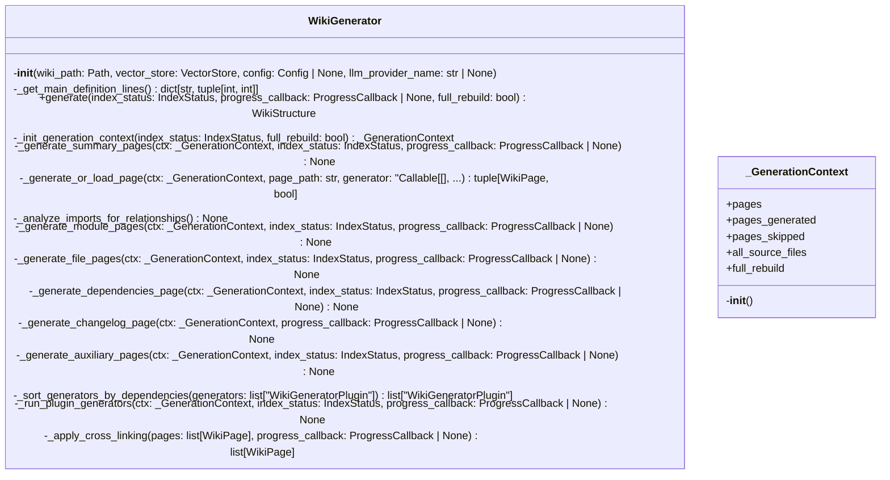

# File: `src/local_deepwiki/generators/wiki.py`

## File Overview

This file defines the core logic for generating wiki documentation from a codebase using indexing, vector search, and plugin-based generation. It provides the main `WikiGenerator` class responsible for orchestrating the wiki generation process, including module and file documentation, dependency graphs, changelogs, and cross-linking.

The module integrates with:
- `VectorStore` for code indexing and retrieval
- `Config` and `get_config` for configuration management
- `WikiGeneratorPlugin` for extensible generation plugins
- `EntityRegistry` and `add_cross_links` for cross-linking
- `DependencyGraphGenerator` and related tools for dependency visualization
- `get_event_emitter` for event handling
- `generate_coverage_page` and related coverage generation functions

## Classes

### `_GenerationContext`

Internal context for tracking wiki generation state.

This class encapsulates mutable state during generation to avoid passing many parameters between helper methods.

**Attributes:**
- `pages`: List of generated wiki pages.
- `pages_generated`: Number of pages generated.
- `pages_skipped`: Number of pages skipped.
- `all_source_files`: List of all source files.
- `full_rebuild`: Whether to perform a full rebuild.

**Methods:**
- `__init__(self, pages, pages_generated, pages_skipped, all_source_files, full_rebuild)`: Initializes the context with provided values.


<details>
<summary>View Source (lines 57-84) | <a href="https://github.com/UrbanDiver/local-deepwiki-mcp/blob/main/src/local_deepwiki/generators/wiki.py#L57-L84">GitHub</a></summary>

```python
class _GenerationContext:
    """Internal context for tracking wiki generation state.

    This class encapsulates mutable state during generation to avoid
    passing many parameters between helper methods.
    """

    __slots__ = (
        "pages",
        "pages_generated",
        "pages_skipped",
        "all_source_files",
        "full_rebuild",
    )

    def __init__(
        self,
        pages: list["WikiPage"],
        pages_generated: int,
        pages_skipped: int,
        all_source_files: list[str],
        full_rebuild: bool,
    ):
        self.pages = pages
        self.pages_generated = pages_generated
        self.pages_skipped = pages_skipped
        self.all_source_files = all_source_files
        self.full_rebuild = full_rebuild
```

</details>

### `WikiGenerator`

The main class responsible for generating wiki documentation.

**Methods:**


<details>
<summary>View Source (lines 87-969) | <a href="https://github.com/UrbanDiver/local-deepwiki-mcp/blob/main/src/local_deepwiki/generators/wiki.py#L87-L969">GitHub</a></summary>

```python
class WikiGenerator:
    # Methods: __init__, _get_main_definition_lines, generate, _init_generation_context, _generate_summary_pages, _generate_or_load_page, _analyze_imports_for_relationships, _generate_module_pages, _generate_file_pages, _generate_dependencies_page, _generate_changelog_page, _generate_auxiliary_pages, _sort_generators_by_dependencies, _run_plugin_generators, _apply_cross_linking, _generate_search_and_toc, _build_wiki_status, _generate_freshness_and_finalize, _generate_overview, _generate_architecture, _generate_dependencies, _generate_changelog, _write_page, _sync_write
```

</details>

#### `__init__(self, wiki_path, vector_store, config=None, llm_provider_name=None)`

Initialize the wiki generator.

**Parameters:**
- `wiki_path`: Path to wiki output directory.
- `vector_store`: Vector store with indexed code.
- `config`: Optional configuration.
- `llm_provider_name`: Override LLM provider ("ollama", "anthropic", "openai").

#### `_get_main_definition_lines(self)`

Get line range of main definition (first class or function) per file.

**Returns:**
- Dict mapping file_path to (start_line, end_line) tuple.

#### `generate(self, index_status, progress_callback=None, full_rebuild=False)`

Generate wiki documentation for the indexed repository.

**Parameters:**
- `index_status`: The index status with file information.
- `progress_callback`: Optional progress callback.
- `full_rebuild`: If True, regenerate all pages. Otherwise, only regenerate changed pages.

**Returns:**
- `WikiStructure` with generated pages.

#### `_init_generation_context(self, index_status, full_rebuild)`

Initialize the generation context with tracking state.

**Parameters:**
- `index_status`: The index status with file information.
- `full_rebuild`: Whether to do a full rebuild.

**Returns:**
- Initialized generation context.

#### `_generate_summary_pages(self, ctx, index_status, progress_callback)`

Generate overview and architecture pages.

**Parameters:**
- `ctx`: Generation context for tracking state.
- `index_status`: The index status.
- `progress_callback`: Optional progress callback.

#### `_generate_or_load_page(self, ctx, page_path, generator, source_files)`

Generate a page or load from cache if unchanged.

**Parameters:**
- `ctx`: Generation context.
- `page_path`: Path for the wiki page.
- `generator`: Async function to generate the page.
- `source_files`: Source files this page depends on.

**Returns:**
- Tuple of (page, was_generated).

#### `_analyze_imports_for_relationships(self)`

Collect import chunks for relationship analysis (See Also sections).

#### `_generate_module_pages(self, ctx, index_status, progress_callback)`

Generate module documentation pages.

**Parameters:**
- `ctx`: Generation context.
- `index_status`: Index status.
- `progress_callback`: Optional progress callback.

#### `_generate_file_pages(self, ctx, index_status, progress_callback)`

Generate file-level documentation pages.

**Parameters:**
- `ctx`: Generation context.
- `index_status`: Index status.
- `progress_callback`: Optional progress callback.

#### `_generate_dependencies_page(self, ctx, index_status, progress_callback)`

Generate the dependencies documentation page.

**Parameters:**
- `ctx`: Generation context.
- `index_status`: Index status.
- `progress_callback`: Optional progress callback.

#### `_generate_changelog_page(self, ctx, progress_callback)`

Generate changelog page from git history.

**Parameters:**
- `ctx`: Generation context.
- `progress_callback`: Optional progress callback.

## Functions

### `generate_wiki`

This function is not shown in the provided code snippet but is referenced as being called by `WikiGenerator` and `test_plugins`.


<details>
<summary>View Source (lines 972-1014) | <a href="https://github.com/UrbanDiver/local-deepwiki-mcp/blob/main/src/local_deepwiki/generators/wiki.py#L972-L1014">GitHub</a></summary>

```python
async def generate_wiki(
    repo_path: Path,
    wiki_path: Path,
    vector_store: VectorStore,
    index_status: IndexStatus,
    config: Config | None = None,
    llm_provider: str | None = None,
    progress_callback: ProgressCallback | None = None,
    full_rebuild: bool = False,
) -> WikiStructure:
    """Convenience function to generate wiki documentation.

    Args:
        repo_path: Path to the repository.
        wiki_path: Path for wiki output.
        vector_store: Indexed vector store.
        index_status: Index status.
        config: Optional configuration.
        llm_provider: Optional LLM provider override.
        progress_callback: Optional progress callback.
        full_rebuild: If True, regenerate all pages. Otherwise, only regenerate changed pages.

    Returns:
        WikiStructure with generated pages.
    """
    from local_deepwiki.core.git_utils import is_github_repo

    config = config or get_config()

    # Auto-switch to cloud provider for GitHub repos if configured
    effective_provider = llm_provider
    if effective_provider is None and config.wiki.use_cloud_for_github:
        if is_github_repo(repo_path):
            effective_provider = config.wiki.github_llm_provider
            logger.info(f"GitHub repo detected, using cloud provider: {effective_provider}")

    generator = WikiGenerator(
        wiki_path=wiki_path,
        vector_store=vector_store,
        config=config,
        llm_provider_name=effective_provider,
    )
    return await generator.generate(index_status, progress_callback, full_rebuild)
```

</details>

## Integration

This file is part of the `local_deepwiki` project and integrates with:

- **CLI Entry Point**: Called from `src/local_deepwiki/cli/__init__.py` to start the generation process.
- **Core Components**: Depends on `VectorStore` from `local_deepwiki.core.vectorstore` for code indexing and retrieval.
- **Plugin System**: Uses `WikiGeneratorPlugin` from `local_deepwiki.plugins.base` for extensible generation.
- **Event System**: Integrates with `get_event_emitter` from `local_deepwiki.events` for event handling.
- **Generation Tools**: Utilizes `generate_coverage_page`, `add_cross_links`, and `DependencyGraphGenerator` for various documentation tasks.
- **Tests**: Used by `tests/test_plugins.py` for testing plugin functionality.

## Usage Examples

### Initialize and Generate Wiki

```python
from pathlib import Path
from local_deepwiki.generators.wiki import WikiGenerator
from local_deepwiki.core.vectorstore import VectorStore
from local_deepwiki.config import get_config

# Initialize vector store and config
vector_store = VectorStore(...)
config = get_config()

# Create WikiGenerator instance
wiki_gen = WikiGenerator(
    wiki_path=Path("output/wiki"),
    vector_store=vector_store,
    config=config,
)

# Generate wiki
index_status = ...  # Assume this is provided
wiki_structure = await wiki_gen.generate(index_status)
```

## API Reference

### class `WikiGenerator`

Generate wiki documentation from indexed code.

**Methods:**


<details>
<summary>View Source (lines 87-969) | <a href="https://github.com/UrbanDiver/local-deepwiki-mcp/blob/main/src/local_deepwiki/generators/wiki.py#L87-L969">GitHub</a></summary>

```python
class WikiGenerator:
    # Methods: __init__, _get_main_definition_lines, generate, _init_generation_context, _generate_summary_pages, _generate_or_load_page, _analyze_imports_for_relationships, _generate_module_pages, _generate_file_pages, _generate_dependencies_page, _generate_changelog_page, _generate_auxiliary_pages, _sort_generators_by_dependencies, _run_plugin_generators, _apply_cross_linking, _generate_search_and_toc, _build_wiki_status, _generate_freshness_and_finalize, _generate_overview, _generate_architecture, _generate_dependencies, _generate_changelog, _write_page, _sync_write
```

</details>

#### `__init__`

```python
def __init__(wiki_path: Path, vector_store: VectorStore, config: Config | None = None, llm_provider_name: str | None = None)
```

Initialize the wiki generator.


| Parameter | Type | Default | Description |
|-----------|------|---------|-------------|
| `wiki_path` | `Path` | - | Path to wiki output directory. |
| `vector_store` | `VectorStore` | - | Vector store with indexed code. |
| `config` | `Config | None` | `None` | Optional configuration. |
| `llm_provider_name` | `str | None` | `None` | Override LLM provider ("ollama", "anthropic", "openai"). |


<details>
<summary>View Source (lines 90-152) | <a href="https://github.com/UrbanDiver/local-deepwiki-mcp/blob/main/src/local_deepwiki/generators/wiki.py#L90-L152">GitHub</a></summary>

```python
def __init__(
        self,
        wiki_path: Path,
        vector_store: VectorStore,
        config: Config | None = None,
        llm_provider_name: str | None = None,
    ):
        """Initialize the wiki generator.

        Args:
            wiki_path: Path to wiki output directory.
            vector_store: Vector store with indexed code.
            config: Optional configuration.
            llm_provider_name: Override LLM provider ("ollama", "anthropic", "openai").
        """
        self.wiki_path = wiki_path
        self.vector_store = vector_store
        base_config = config or get_config()

        # Create a copy with overridden LLM provider if specified
        if llm_provider_name:
            self.config = base_config.with_llm_provider(llm_provider_name)  # type: ignore
        else:
            # Store a defensive copy to prevent external mutation
            self.config = base_config.model_copy(deep=True)

        # Use cached LLM provider for better performance on repeated generations
        cache_path = wiki_path / "llm_cache.lance"
        self.llm = get_cached_llm_provider(
            cache_path=cache_path,
            embedding_provider=vector_store.embedding_provider,
            cache_config=self.config.llm_cache,
            llm_config=self.config.llm,
        )

        # Initialize prompt manager for custom prompt support
        custom_prompts_dir = None
        if self.config.prompts.custom_dir:
            custom_prompts_dir = Path(self.config.prompts.custom_dir)
        self._prompt_manager = PromptManager(
            custom_dir=custom_prompts_dir,
            repo_path=None,  # Will be set during generation
        )

        # Get provider-specific system prompt (may be overridden by custom prompts)
        self._system_prompt = self._prompt_manager.get_wiki_system_prompt(
            provider=self.config.llm.provider,
        )

        # Entity registry for cross-linking
        self.entity_registry = EntityRegistry()

        # Relationship analyzer for See Also sections
        self.relationship_analyzer = RelationshipAnalyzer()

        # Status manager for incremental updates
        self.status_manager = WikiStatusManager(wiki_path)

        # Cached project manifest (parsed from package files)
        self._manifest: ProjectManifest | None = None

        # Repository path (set during generation)
        self._repo_path: Path | None = None
```

</details>

#### `generate`

```python
async def generate(index_status: IndexStatus, progress_callback: ProgressCallback | None = None, full_rebuild: bool = False) -> WikiStructure
```

Generate wiki documentation for the indexed repository.


| Parameter | Type | Default | Description |
|-----------|------|---------|-------------|
| `index_status` | `IndexStatus` | - | The index status with file information. |
| `progress_callback` | `ProgressCallback | None` | `None` | Optional progress callback. |
| `full_rebuild` | `bool` | `False` | If True, regenerate all pages. Otherwise, only regenerate changed pages. |


---


<details>
<summary>View Source (lines 164-268) | <a href="https://github.com/UrbanDiver/local-deepwiki-mcp/blob/main/src/local_deepwiki/generators/wiki.py#L164-L268">GitHub</a></summary>

```python
async def generate(
        self,
        index_status: IndexStatus,
        progress_callback: ProgressCallback | None = None,
        full_rebuild: bool = False,
    ) -> WikiStructure:
        """Generate wiki documentation for the indexed repository.

        Args:
            index_status: The index status with file information.
            progress_callback: Optional progress callback.
            full_rebuild: If True, regenerate all pages. Otherwise, only regenerate changed pages.

        Returns:
            WikiStructure with generated pages.
        """
        logger.info(f"Starting wiki generation for {index_status.repo_path}")
        logger.debug(f"Full rebuild: {full_rebuild}, Total files: {index_status.total_files}")

        # Emit WIKI_START event
        emitter = get_event_emitter()
        await emitter.emit(
            EventType.WIKI_START,
            {
                "repo_path": index_status.repo_path,
                "full_rebuild": full_rebuild,
                "total_files": index_status.total_files,
            },
        )

        # Initialize generation context
        ctx = await self._init_generation_context(index_status, full_rebuild)

        # Phase 1: Generate summary pages (overview, architecture)
        await self._generate_summary_pages(ctx, index_status, progress_callback)

        # Phase 2: Analyze imports for relationship tracking
        await self._analyze_imports_for_relationships()

        # Phase 3: Generate module documentation
        await self._generate_module_pages(ctx, index_status, progress_callback)

        # Phase 4: Generate file documentation
        await self._generate_file_pages(ctx, index_status, progress_callback)

        # Phase 5: Generate dependencies page
        await self._generate_dependencies_page(ctx, index_status, progress_callback)

        # Phase 6: Generate changelog
        await self._generate_changelog_page(ctx, progress_callback)

        # Phase 7: Generate auxiliary pages (inheritance, glossary, coverage)
        await self._generate_auxiliary_pages(ctx, index_status, progress_callback)

        # Phase 7b: Run wiki generator plugins
        await self._run_plugin_generators(ctx, index_status, progress_callback)

        # Phase 8: Apply cross-links and see-also sections
        ctx.pages = await self._apply_cross_linking(ctx.pages, progress_callback)

        # Phase 9: Generate search index and TOC
        await self._generate_search_and_toc(ctx.pages, index_status, progress_callback)

        # Phase 10: Generate freshness report and finalize
        wiki_status = self._build_wiki_status(ctx, index_status)
        await self._generate_freshness_and_finalize(ctx, wiki_status, progress_callback)

        logger.info(
            f"Wiki generation complete: {ctx.pages_generated} pages generated, "
            f"{ctx.pages_skipped} pages unchanged, {len(ctx.pages)} total pages"
        )

        # Log LLM cache statistics if available
        if hasattr(self.llm, "stats"):
            try:
                cache_stats = self.llm.stats
                hits = int(cache_stats.get("hits", 0))
                misses = int(cache_stats.get("misses", 0))
                skipped = int(cache_stats.get("skipped", 0))
                total = hits + misses
                hit_rate = (hits / total * 100) if total > 0 else 0.0
                logger.info(
                    f"LLM cache stats: {hits} hits, {misses} misses, {skipped} skipped "
                    f"({hit_rate:.1f}% hit rate)"
                )
            except (TypeError, ValueError, AttributeError):
                # Skip logging if stats are not properly available (e.g., mock objects)
                pass

        # Finalize progress tracker and print summary
        summary = self._progress.finalize(success=True)
        print(summary)

        # Emit WIKI_COMPLETE event
        await emitter.emit(
            EventType.WIKI_COMPLETE,
            {
                "repo_path": index_status.repo_path,
                "total_pages": len(ctx.pages),
                "pages_generated": ctx.pages_generated,
                "pages_skipped": ctx.pages_skipped,
            },
        )

        return WikiStructure(root=str(self.wiki_path), pages=ctx.pages)
```

</details>

### Functions

#### `generate_wiki`

```python
async def generate_wiki(repo_path: Path, wiki_path: Path, vector_store: VectorStore, index_status: IndexStatus, config: Config | None = None, llm_provider: str | None = None, progress_callback: ProgressCallback | None = None, full_rebuild: bool = False) -> WikiStructure
```

Convenience function to generate wiki documentation.


| Parameter | Type | Default | Description |
|-----------|------|---------|-------------|
| `repo_path` | `Path` | - | Path to the repository. |
| `wiki_path` | `Path` | - | Path for wiki output. |
| `vector_store` | `VectorStore` | - | Indexed vector store. |
| `index_status` | `IndexStatus` | - | Index status. |
| `config` | `Config | None` | `None` | Optional configuration. |
| `llm_provider` | `str | None` | `None` | Optional LLM provider override. |
| `progress_callback` | `ProgressCallback | None` | `None` | Optional progress callback. |
| `full_rebuild` | `bool` | `False` | If True, regenerate all pages. Otherwise, only regenerate changed pages. |

**Returns:** `WikiStructure`


<details>
<summary>View Source (lines 972-1014) | <a href="https://github.com/UrbanDiver/local-deepwiki-mcp/blob/main/src/local_deepwiki/generators/wiki.py#L972-L1014">GitHub</a></summary>

```python
async def generate_wiki(
    repo_path: Path,
    wiki_path: Path,
    vector_store: VectorStore,
    index_status: IndexStatus,
    config: Config | None = None,
    llm_provider: str | None = None,
    progress_callback: ProgressCallback | None = None,
    full_rebuild: bool = False,
) -> WikiStructure:
    """Convenience function to generate wiki documentation.

    Args:
        repo_path: Path to the repository.
        wiki_path: Path for wiki output.
        vector_store: Indexed vector store.
        index_status: Index status.
        config: Optional configuration.
        llm_provider: Optional LLM provider override.
        progress_callback: Optional progress callback.
        full_rebuild: If True, regenerate all pages. Otherwise, only regenerate changed pages.

    Returns:
        WikiStructure with generated pages.
    """
    from local_deepwiki.core.git_utils import is_github_repo

    config = config or get_config()

    # Auto-switch to cloud provider for GitHub repos if configured
    effective_provider = llm_provider
    if effective_provider is None and config.wiki.use_cloud_for_github:
        if is_github_repo(repo_path):
            effective_provider = config.wiki.github_llm_provider
            logger.info(f"GitHub repo detected, using cloud provider: {effective_provider}")

    generator = WikiGenerator(
        wiki_path=wiki_path,
        vector_store=vector_store,
        config=config,
        llm_provider_name=effective_provider,
    )
    return await generator.generate(index_status, progress_callback, full_rebuild)
```

</details>

## Class Diagram


```mermaid
classDiagram
    class WikiGenerator {
        -__init__(wiki_path: Path, vector_store: VectorStore, config: Config | None, llm_provider_name: str | None)
        -_get_main_definition_lines() dict[str, tuple[int, int]]
        +generate(index_status: IndexStatus, progress_callback: ProgressCallback | None, full_rebuild: bool) WikiStructure
        -_init_generation_context(index_status: IndexStatus, full_rebuild: bool) _GenerationContext
        -_generate_summary_pages(ctx: _GenerationContext, index_status: IndexStatus, progress_callback: ProgressCallback | None) None
        -_generate_or_load_page(ctx: _GenerationContext, page_path: str, generator: "Callable[[], ...) tuple[WikiPage, bool]
        -_analyze_imports_for_relationships() None
        -_generate_module_pages(ctx: _GenerationContext, index_status: IndexStatus, progress_callback: ProgressCallback | None) None
        -_generate_file_pages(ctx: _GenerationContext, index_status: IndexStatus, progress_callback: ProgressCallback | None) None
        -_generate_dependencies_page(ctx: _GenerationContext, index_status: IndexStatus, progress_callback: ProgressCallback | None) None
        -_generate_changelog_page(ctx: _GenerationContext, progress_callback: ProgressCallback | None) None
        -_generate_auxiliary_pages(ctx: _GenerationContext, index_status: IndexStatus, progress_callback: ProgressCallback | None) None
        -_sort_generators_by_dependencies(generators: list["WikiGeneratorPlugin"]) list["WikiGeneratorPlugin"]
        -_run_plugin_generators(ctx: _GenerationContext, index_status: IndexStatus, progress_callback: ProgressCallback | None) None
        -_apply_cross_linking(pages: list[WikiPage], progress_callback: ProgressCallback | None) list[WikiPage]
    }
    class _GenerationContext {
        +pages
        +pages_generated
        +pages_skipped
        +all_source_files
        +full_rebuild
        -__init__()
    }
```

## Call Graph


```mermaid
flowchart TD
    N0[Path]
    N1[WikiGenerator.__init__]
    N2[WikiGenerator._analyze_impo...]
    N3[WikiGenerator._apply_cross_...]
    N4[WikiGenerator._build_wiki_s...]
    N5[WikiGenerator._generate_aux...]
    N6[WikiGenerator._generate_cha...]
    N7[WikiGenerator._generate_dep...]
    N8[WikiGenerator._generate_fil...]
    N9[WikiGenerator._generate_fre...]
    N10[WikiGenerator._generate_mod...]
    N11[WikiGenerator._generate_or_...]
    N12[WikiGenerator._generate_sea...]
    N13[WikiGenerator._generate_sum...]
    N14[WikiGenerator._init_generat...]
    N15[WikiGenerator._run_plugin_g...]
    N16[WikiGenerator._write_page]
    N17[WikiGenerator.generate]
    N18[_write_page]
    N19[emit]
    N20[generate]
    N21[generate_wiki]
    N22[get_config]
    N23[get_event_emitter]
    N24[get_wiki_system_prompt]
    N25[load_existing_page]
    N26[needs_regeneration]
    N27[progress_callback]
    N28[record_page_status]
    N29[start_phase]
    N21 --> N22
    N21 --> N20
    N1 --> N22
    N1 --> N0
    N1 --> N24
    N17 --> N23
    N17 --> N19
    N14 --> N29
    N14 --> N0
    N14 --> N24
    N13 --> N27
    N11 --> N26
    N11 --> N25
    N11 --> N28
    N11 --> N18
    N11 --> N23
    N11 --> N19
    N10 --> N27
    N10 --> N29
    N10 --> N18
    N8 --> N27
    N7 --> N27
    N7 --> N26
    N7 --> N25
    N7 --> N28
    N7 --> N18
    N6 --> N27
    N6 --> N28
    N6 --> N18
    N5 --> N27
    N5 --> N28
    N5 --> N18
    N15 --> N20
    N15 --> N28
    N15 --> N18
    N3 --> N27
    N3 --> N18
    N12 --> N27
    N9 --> N28
    N9 --> N18
    N9 --> N27
    classDef func fill:#e1f5fe
    class N0,N18,N19,N20,N21,N22,N23,N24,N25,N26,N27,N28,N29 func
    classDef method fill:#fff3e0
    class N1,N2,N3,N4,N5,N6,N7,N8,N9,N10,N11,N12,N13,N14,N15,N16,N17 method
```

## Used By

Functions and methods in this file and their callers:

- **`EntityRegistry`**: called by `WikiGenerator.__init__`
- **`GenerationProgress`**: called by `WikiGenerator._init_generation_context`
- **`Path`**: called by `WikiGenerator.__init__`, `WikiGenerator._init_generation_context`
- **`PromptManager`**: called by `WikiGenerator.__init__`
- **`RelationshipAnalyzer`**: called by `WikiGenerator.__init__`
- **`WikiGenerationStatus`**: called by `WikiGenerator._build_wiki_status`
- **`WikiGenerator`**: called by `generate_wiki`
- **`WikiPage`**: called by `WikiGenerator._generate_auxiliary_pages`
- **`WikiStatusManager`**: called by `WikiGenerator.__init__`
- **`WikiStructure`**: called by `WikiGenerator.generate`
- **`_GenerationContext`**: called by `WikiGenerator._init_generation_context`
- **`_analyze_imports_for_relationships`**: called by `WikiGenerator.generate`
- **`_apply_cross_linking`**: called by `WikiGenerator.generate`
- **`_build_wiki_status`**: called by `WikiGenerator.generate`
- **`_generate_architecture`**: called by `WikiGenerator._generate_summary_pages`
- **`_generate_auxiliary_pages`**: called by `WikiGenerator.generate`
- **`_generate_changelog`**: called by `WikiGenerator._generate_changelog_page`
- **`_generate_changelog_page`**: called by `WikiGenerator.generate`
- **`_generate_dependencies`**: called by `WikiGenerator._generate_dependencies_page`
- **`_generate_dependencies_page`**: called by `WikiGenerator.generate`
- **`_generate_file_pages`**: called by `WikiGenerator.generate`
- **`_generate_freshness_and_finalize`**: called by `WikiGenerator.generate`
- **`_generate_module_pages`**: called by `WikiGenerator.generate`
- **`_generate_or_load_page`**: called by `WikiGenerator._generate_summary_pages`
- **`_generate_overview`**: called by `WikiGenerator._generate_summary_pages`
- **`_generate_search_and_toc`**: called by `WikiGenerator.generate`
- **`_generate_summary_pages`**: called by `WikiGenerator.generate`
- **`_get_main_definition_lines`**: called by `WikiGenerator._init_generation_context`
- **`_init_generation_context`**: called by `WikiGenerator.generate`
- **`_run_plugin_generators`**: called by `WikiGenerator.generate`
- **`_sort_generators_by_dependencies`**: called by `WikiGenerator._run_plugin_generators`
- **`_write_page`**: called by `WikiGenerator._apply_cross_linking`, `WikiGenerator._generate_auxiliary_pages`, `WikiGenerator._generate_changelog_page`, `WikiGenerator._generate_dependencies_page`, `WikiGenerator._generate_freshness_and_finalize`, `WikiGenerator._generate_module_pages`, `WikiGenerator._generate_or_load_page`, `WikiGenerator._run_plugin_generators`
- **`add_cross_links`**: called by `WikiGenerator._apply_cross_linking`
- **`add_see_also_sections`**: called by `WikiGenerator._apply_cross_linking`
- **`add_source_refs_sections`**: called by `WikiGenerator._apply_cross_linking`
- **`analyze_chunks`**: called by `WikiGenerator._analyze_imports_for_relationships`
- **`clear_cache`**: called by `WikiGenerator._init_generation_context`
- **`complete_phase`**: called by `WikiGenerator._generate_module_pages`
- **`dumps`**: called by `WikiGenerator._build_wiki_status`
- **`emit`**: called by `WikiGenerator._generate_or_load_page`, `WikiGenerator.generate`
- **`encode`**: called by `WikiGenerator._build_wiki_status`
- **`finalize`**: called by `WikiGenerator.generate`
- **`generate`**: called by `WikiGenerator._run_plugin_generators`, `generate_wiki`
- **`generate_architecture_page`**: called by `WikiGenerator._generate_architecture`
- **`generate_changelog_page`**: called by `WikiGenerator._generate_changelog`
- **`generate_coverage_page`**: called by `WikiGenerator._generate_auxiliary_pages`
- **`generate_dependencies_page`**: called by `WikiGenerator._generate_dependencies`
- **`generate_dependency_graph_page`**: called by `WikiGenerator._generate_auxiliary_pages`
- **`generate_file_docs`**: called by `WikiGenerator._generate_file_pages`
- **`generate_glossary_page`**: called by `WikiGenerator._generate_auxiliary_pages`
- **`generate_inheritance_page`**: called by `WikiGenerator._generate_auxiliary_pages`
- **`generate_module_docs`**: called by `WikiGenerator._generate_module_pages`
- **`generate_overview_page`**: called by `WikiGenerator._generate_overview`
- **`generate_stale_report_page`**: called by `WikiGenerator._generate_freshness_and_finalize`
- **`generate_toc`**: called by `WikiGenerator._generate_search_and_toc`
- **`generator`**: called by `WikiGenerator._generate_or_load_page`
- **`get_cached_llm_provider`**: called by `WikiGenerator.__init__`
- **`get_cached_manifest`**: called by `WikiGenerator._init_generation_context`
- **`get_config`**: called by `WikiGenerator.__init__`, `generate_wiki`
- **`get_event_emitter`**: called by `WikiGenerator._generate_or_load_page`, `WikiGenerator.generate`
- **`get_main_definition_lines`**: called by `WikiGenerator._get_main_definition_lines`
- **`get_plugin_registry`**: called by `WikiGenerator._run_plugin_generators`
- **`get_regeneration_summary`**: called by `WikiGenerator._init_generation_context`
- **`get_wiki_system_prompt`**: called by `WikiGenerator.__init__`, `WikiGenerator._init_generation_context`
- **`hexdigest`**: called by `WikiGenerator._build_wiki_status`
- **`is_github_repo`**: called by `generate_wiki`
- **`load_existing_page`**: called by `WikiGenerator._generate_dependencies_page`, `WikiGenerator._generate_or_load_page`
- **`load_status`**: called by `WikiGenerator._init_generation_context`
- **`mkdir`**: called by `WikiGenerator._sync_write`, `WikiGenerator._write_page`
- **`model_copy`**: called by `WikiGenerator.__init__`
- **`model_dump`**: called by `WikiGenerator._build_wiki_status`
- **`needs_regeneration`**: called by `WikiGenerator._generate_dependencies_page`, `WikiGenerator._generate_or_load_page`
- **`progress_callback`**: called by `WikiGenerator._apply_cross_linking`, `WikiGenerator._generate_auxiliary_pages`, `WikiGenerator._generate_changelog_page`, `WikiGenerator._generate_dependencies_page`, `WikiGenerator._generate_file_pages`, `WikiGenerator._generate_freshness_and_finalize`, `WikiGenerator._generate_module_pages`, `WikiGenerator._generate_search_and_toc`, `WikiGenerator._generate_summary_pages`
- **`record_page_status`**: called by `WikiGenerator._generate_auxiliary_pages`, `WikiGenerator._generate_changelog_page`, `WikiGenerator._generate_dependencies_page`, `WikiGenerator._generate_freshness_and_finalize`, `WikiGenerator._generate_or_load_page`, `WikiGenerator._run_plugin_generators`
- **`save_status`**: called by `WikiGenerator._generate_freshness_and_finalize`
- **`search`**: called by `WikiGenerator._analyze_imports_for_relationships`
- **`sha256`**: called by `WikiGenerator._build_wiki_status`
- **`sort`**: called by `WikiGenerator._sort_generators_by_dependencies`
- **`start_phase`**: called by `WikiGenerator._generate_module_pages`, `WikiGenerator._init_generation_context`
- **`time`**: called by `WikiGenerator._build_wiki_status`, `WikiGenerator._generate_auxiliary_pages`
- **`to_thread`**: called by `WikiGenerator._write_page`
- **`with_llm_provider`**: called by `WikiGenerator.__init__`
- **`write_full_search_index`**: called by `WikiGenerator._generate_search_and_toc`
- **`write_text`**: called by `WikiGenerator._sync_write`, `WikiGenerator._write_page`
- **`write_toc`**: called by `WikiGenerator._generate_search_and_toc`

## Usage Examples

*Examples extracted from test files*

### Test _generate_or_load_page loads from cache when available (lines 318-324)

From `test_wiki_coverage.py::TestIncrementalGeneration::test_generate_or_load_page_loads_from_cache`:

```python
from local_deepwiki.generators.wiki import _GenerationContext
from local_deepwiki.models import WikiGenerationStatus, WikiPageStatus

ctx = _GenerationContext(
    pages=[],
    pages_generated=0,
    pages_skipped=0,
    all_source_files=["src/main.py"],
    full_rebuild=False,
)

prev_status = WikiGenerationStatus(
    repo_path=str(tmp_path),
    generated_at=time.time(),
    total_pages=1,
    pages={
        "test_page.md": WikiPageStatus(
            path="test_page.md",
            source_files=["src/main.py"],
            source_hashes={"src/main.py": "same_hash"},
            content_hash="xyz",
            generated_at=12345.0,
        ),
    },
)
```

### Test _generate_or_load_page loads from cache when available (lines 318-324)

From `test_wiki_coverage.py::TestIncrementalGeneration::test_generate_or_load_page_loads_from_cache`:

```python
from local_deepwiki.generators.wiki import _GenerationContext
from local_deepwiki.models import WikiGenerationStatus, WikiPageStatus

ctx = _GenerationContext(
    pages=[],
    pages_generated=0,
    pages_skipped=0,
    all_source_files=["src/main.py"],
    full_rebuild=False,
)

prev_status = WikiGenerationStatus(
    repo_path=str(tmp_path),
    generated_at=time.time(),
    total_pages=1,
    pages={
        "test_page.md": WikiPageStatus(
            path="test_page.md",
            source_files=["src/main.py"],
            source_hashes={"src/main.py": "same_hash"},
            content_hash="xyz",
            generated_at=12345.0,
        ),
    },
)
```

### Test _generate_or_load_page loads from cache when available (lines 318-324)

From `test_wiki_coverage.py::TestIncrementalGeneration::test_generate_or_load_page_loads_from_cache`:

```python
pages_generated=0,
    pages_skipped=0,
    all_source_files=["src/main.py"],
    full_rebuild=False,
)

prev_status = WikiGenerationStatus(
    repo_path=str(tmp_path),
    generated_at=time.time(),
    total_pages=1,
    pages={
        "test_page.md": WikiPageStatus(
            path="test_page.md",
            source_files=["src/main.py"],
            source_hashes={"src/main.py": "same_hash"},
            content_hash="xyz",
            generated_at=12345.0,
        ),
    },
)
generator.status_manager._previous_status = prev_status
generator.status_manager.file_hashes = {"src/main.py": "same_hash"}

# Generator function that should NOT be called
async def mock_generator_fn():
```

### Test _generate_or_load_page loads from cache when available (lines 318-324)

From `test_wiki_coverage.py::TestIncrementalGeneration::test_generate_or_load_page_loads_from_cache`:

```python
page, was_generated = await generator._generate_or_load_page(
    ctx=ctx,
    page_path="test_page.md",
    generator=mock_generator_fn,
    source_files=["src/main.py"],
)

# Should load from cache
assert was_generated is False
assert "# Cached Page Content" in page.content
```

### Test _generate_or_load_page generates when cache file missing (lines 320-321)

From `test_wiki_coverage.py::TestIncrementalGeneration::test_generate_or_load_page_generates_when_cache_missing`:

```python
from local_deepwiki.generators.wiki import _GenerationContext
from local_deepwiki.models import WikiGenerationStatus, WikiPageStatus

ctx = _GenerationContext(
    pages=[],
    pages_generated=0,
    pages_skipped=0,
    all_source_files=["src/main.py"],
    full_rebuild=False,
)

prev_status = WikiGenerationStatus(
    repo_path=str(tmp_path),
    generated_at=time.time(),
    total_pages=1,
    pages={
        "missing_page.md": WikiPageStatus(
            path="missing_page.md",
            source_files=["src/main.py"],
            source_hashes={"src/main.py": "same_hash"},
            content_hash="xyz",
            generated_at=12345.0,
        ),
    },
)
```


## Last Modified

| Entity | Type | Author | Date | Commit |
|--------|------|--------|------|--------|
| `WikiGenerator` | class | Brian Breidenbach | 1 week ago | `a64166a` Add seven medium-priority e... |
| `_generate_auxiliary_pages` | method | Brian Breidenbach | 1 week ago | `a64166a` Add seven medium-priority e... |
| `_sort_generators_by_dependencies` | method | Brian Breidenbach | 1 week ago | `b6594e4` Add dependency validation a... |
| `_run_plugin_generators` | method | Brian Breidenbach | 1 week ago | `b6594e4` Add dependency validation a... |
| `generate` | method | Brian Breidenbach | 1 week ago | `4e9d8f5` Integrate plugin system int... |
| `_generate_or_load_page` | method | Brian Breidenbach | 1 week ago | `a0b2f83` Integrate event system into... |
| `__init__` | method | Brian Breidenbach | 1 week ago | `a142542` Add custom prompt template ... |
| `_init_generation_context` | method | Brian Breidenbach | 1 week ago | `a142542` Add custom prompt template ... |
| `_generate_freshness_and_finalize` | method | Brian Breidenbach | 1 week ago | `31cf97a` Fix mypy type errors across... |
| `_get_main_definition_lines` | method | Brian Breidenbach | 2 weeks ago | `95d6a4c` Refactor async I/O, extract... |
| `_GenerationContext` | class | Brian Breidenbach | 2 weeks ago | `2f85bf8` Fix critical issues: config... |
| `_generate_summary_pages` | method | Brian Breidenbach | 2 weeks ago | `2f85bf8` Fix critical issues: config... |
| `_analyze_imports_for_relationships` | method | Brian Breidenbach | 2 weeks ago | `2f85bf8` Fix critical issues: config... |
| `_generate_module_pages` | method | Brian Breidenbach | 2 weeks ago | `2f85bf8` Fix critical issues: config... |
| `_generate_file_pages` | method | Brian Breidenbach | 2 weeks ago | `2f85bf8` Fix critical issues: config... |
| `_generate_dependencies_page` | method | Brian Breidenbach | 2 weeks ago | `2f85bf8` Fix critical issues: config... |
| `_generate_changelog_page` | method | Brian Breidenbach | 2 weeks ago | `2f85bf8` Fix critical issues: config... |
| `_apply_cross_linking` | method | Brian Breidenbach | 2 weeks ago | `2f85bf8` Fix critical issues: config... |
| `_generate_search_and_toc` | method | Brian Breidenbach | 2 weeks ago | `2f85bf8` Fix critical issues: config... |
| `_build_wiki_status` | method | Brian Breidenbach | 2 weeks ago | `2f85bf8` Fix critical issues: config... |
| `_generate_dependencies` | method | Brian Breidenbach | 3 weeks ago | `0d91a70` Apply Python best practices... |
| `generate_wiki` | function | Brian Breidenbach | 3 weeks ago | `0d91a70` Apply Python best practices... |
| `_write_page` | method | Brian Breidenbach | 3 weeks ago | `3defaaa` Refactor: Extract validatio... |
| `_generate_overview` | method | Brian Breidenbach | 3 weeks ago | `b8f8b68` Refactor: Extract page gene... |
| `_generate_architecture` | method | Brian Breidenbach | 3 weeks ago | `b8f8b68` Refactor: Extract page gene... |
| `_generate_changelog` | method | Brian Breidenbach | 3 weeks ago | `b8f8b68` Refactor: Extract page gene... |
| `_sync_write` | method | Brian Breidenbach | 3 weeks ago | `c568951` Add input validation, type ... |

## Additional Source Code

Source code for functions and methods not listed in the API Reference above.

#### `_get_main_definition_lines`

<details>
<summary>View Source (lines 154-162) | <a href="https://github.com/UrbanDiver/local-deepwiki-mcp/blob/main/src/local_deepwiki/generators/wiki.py#L154-L162">GitHub</a></summary>

```python
def _get_main_definition_lines(self) -> dict[str, tuple[int, int]]:
        """Get line range of main definition (first class or function) per file.

        Delegates to VectorStore's public method for proper encapsulation.

        Returns:
            Dict mapping file_path to (start_line, end_line) tuple.
        """
        return self.vector_store.get_main_definition_lines()
```

</details>


#### `_init_generation_context`

<details>
<summary>View Source (lines 270-329) | <a href="https://github.com/UrbanDiver/local-deepwiki-mcp/blob/main/src/local_deepwiki/generators/wiki.py#L270-L329">GitHub</a></summary>

```python
async def _init_generation_context(
        self, index_status: IndexStatus, full_rebuild: bool
    ) -> _GenerationContext:
        """Initialize the generation context with tracking state.

        Args:
            index_status: The index status with file information.
            full_rebuild: Whether to do a full rebuild.

        Returns:
            Initialized generation context.
        """
        # Initialize live progress tracker
        self._progress = GenerationProgress(wiki_path=self.wiki_path)
        self._progress.start_phase("initializing", total=0)

        # Store repo path and parse manifest for grounded generation (with caching)
        self._repo_path = Path(index_status.repo_path)
        self._manifest = get_cached_manifest(self._repo_path, cache_dir=self.wiki_path)

        # Update prompt manager with repo path for per-project prompts
        self._prompt_manager.loader.repo_path = self._repo_path
        self._prompt_manager.loader.clear_cache()  # Clear cache to pick up repo prompts
        # Reload system prompt in case repo has custom prompts
        self._system_prompt = self._prompt_manager.get_wiki_system_prompt(
            provider=self.config.llm.provider,
        )

        # Build file hash map for incremental generation
        self.status_manager.file_hashes = {f.path: f.hash for f in index_status.files}
        all_source_files = list(self.status_manager.file_hashes.keys())

        # Load previous wiki status for incremental updates
        if not full_rebuild:
            await self.status_manager.load_status()

            # Log regeneration summary for incremental updates
            summary = self.status_manager.get_regeneration_summary()
            if summary["is_full_rebuild"]:
                logger.info("No previous wiki status found, performing full generation")
            else:
                logger.info(
                    f"Incremental update: {summary['changed_file_count']} files changed, "
                    f"{summary['affected_page_count']} pages to regenerate, "
                    f"{summary['unchanged_page_count']} pages unchanged"
                )
                if summary["changed_file_count"] <= 5:
                    for f in summary["changed_files"]:
                        logger.debug(f"  Changed: {f}")

        # Pre-compute line info for source files (for source refs with line numbers)
        self.status_manager.file_line_info = self._get_main_definition_lines()

        return _GenerationContext(
            pages=[],
            pages_generated=0,
            pages_skipped=0,
            all_source_files=all_source_files,
            full_rebuild=full_rebuild,
        )
```

</details>


#### `_generate_summary_pages`

<details>
<summary>View Source (lines 331-376) | <a href="https://github.com/UrbanDiver/local-deepwiki-mcp/blob/main/src/local_deepwiki/generators/wiki.py#L331-L376">GitHub</a></summary>

```python
async def _generate_summary_pages(
        self,
        ctx: _GenerationContext,
        index_status: IndexStatus,
        progress_callback: ProgressCallback | None,
    ) -> None:
        """Generate overview and architecture pages.

        Args:
            ctx: Generation context for tracking state.
            index_status: The index status.
            progress_callback: Optional progress callback.
        """
        total_steps = 13

        # Generate overview page
        if progress_callback:
            progress_callback("Generating overview", 0, total_steps)

        overview_page, generated = await self._generate_or_load_page(
            ctx=ctx,
            page_path="index.md",
            generator=lambda: self._generate_overview(index_status),
            source_files=ctx.all_source_files,
        )
        ctx.pages.append(overview_page)
        if generated:
            ctx.pages_generated += 1
        else:
            ctx.pages_skipped += 1

        # Generate architecture page
        if progress_callback:
            progress_callback("Generating architecture docs", 1, total_steps)

        architecture_page, generated = await self._generate_or_load_page(
            ctx=ctx,
            page_path="architecture.md",
            generator=lambda: self._generate_architecture(index_status),
            source_files=ctx.all_source_files,
        )
        ctx.pages.append(architecture_page)
        if generated:
            ctx.pages_generated += 1
        else:
            ctx.pages_skipped += 1
```

</details>


#### `_generate_or_load_page`

<details>
<summary>View Source (lines 378-422) | <a href="https://github.com/UrbanDiver/local-deepwiki-mcp/blob/main/src/local_deepwiki/generators/wiki.py#L378-L422">GitHub</a></summary>

```python
async def _generate_or_load_page(
        self,
        ctx: _GenerationContext,
        page_path: str,
        generator: "Callable[[], Awaitable[WikiPage]]",
        source_files: list[str],
    ) -> tuple[WikiPage, bool]:
        """Generate a page or load from cache if unchanged.

        Args:
            ctx: Generation context.
            page_path: Path for the wiki page.
            generator: Async function to generate the page.
            source_files: Source files this page depends on.

        Returns:
            Tuple of (page, was_generated).
        """
        if ctx.full_rebuild or self.status_manager.needs_regeneration(page_path, source_files):
            page = await generator()
            was_generated = True
        else:
            existing_page = await self.status_manager.load_existing_page(page_path)
            if existing_page is None:
                page = await generator()
                was_generated = True
            else:
                page = existing_page
                was_generated = False

        self.status_manager.record_page_status(page, source_files)
        await self._write_page(page)

        # Emit WIKI_PAGE_COMPLETE event
        emitter = get_event_emitter()
        await emitter.emit(
            EventType.WIKI_PAGE_COMPLETE,
            {
                "page_path": page.path,
                "page_title": page.title,
                "was_generated": was_generated,
            },
        )

        return page, was_generated
```

</details>


#### `_analyze_imports_for_relationships`

<details>
<summary>View Source (lines 424-431) | <a href="https://github.com/UrbanDiver/local-deepwiki-mcp/blob/main/src/local_deepwiki/generators/wiki.py#L424-L431">GitHub</a></summary>

```python
async def _analyze_imports_for_relationships(self) -> None:
        """Collect import chunks for relationship analysis (See Also sections)."""
        import_results = await self.vector_store.search(
            "import require include",
            limit=self.config.wiki.import_search_limit,
        )
        import_chunks = [r.chunk for r in import_results if r.chunk.chunk_type.value == "import"]
        self.relationship_analyzer.analyze_chunks(import_chunks)
```

</details>


#### `_generate_module_pages`

<details>
<summary>View Source (lines 433-468) | <a href="https://github.com/UrbanDiver/local-deepwiki-mcp/blob/main/src/local_deepwiki/generators/wiki.py#L433-L468">GitHub</a></summary>

```python
async def _generate_module_pages(
        self,
        ctx: _GenerationContext,
        index_status: IndexStatus,
        progress_callback: ProgressCallback | None,
    ) -> None:
        """Generate module documentation pages.

        Args:
            ctx: Generation context.
            index_status: Index status.
            progress_callback: Optional progress callback.
        """
        if progress_callback:
            progress_callback("Generating module documentation", 2, 13)

        self._progress.start_phase("modules", total=0)

        module_pages, gen_count, skip_count = await generate_module_docs(
            index_status=index_status,
            vector_store=self.vector_store,
            llm=self.llm,
            system_prompt=self._system_prompt,
            status_manager=self.status_manager,
            full_rebuild=ctx.full_rebuild,
        )
        ctx.pages_generated += gen_count
        ctx.pages_skipped += skip_count

        # Update module stats and write pages
        self._progress._phase_stats["modules"].items_completed = len(module_pages)
        self._progress.complete_phase()

        for page in module_pages:
            ctx.pages.append(page)
            await self._write_page(page)
```

</details>


#### `_generate_file_pages`

<details>
<summary>View Source (lines 470-501) | <a href="https://github.com/UrbanDiver/local-deepwiki-mcp/blob/main/src/local_deepwiki/generators/wiki.py#L470-L501">GitHub</a></summary>

```python
async def _generate_file_pages(
        self,
        ctx: _GenerationContext,
        index_status: IndexStatus,
        progress_callback: ProgressCallback | None,
    ) -> None:
        """Generate file-level documentation pages.

        Args:
            ctx: Generation context.
            index_status: Index status.
            progress_callback: Optional progress callback.
        """
        if progress_callback:
            progress_callback("Generating file documentation", 3, 13)

        file_pages, gen_count, skip_count = await generate_file_docs(
            index_status=index_status,
            vector_store=self.vector_store,
            llm=self.llm,
            system_prompt=self._system_prompt,
            status_manager=self.status_manager,
            entity_registry=self.entity_registry,
            config=self.config,
            progress_callback=progress_callback,
            full_rebuild=ctx.full_rebuild,
            write_callback=self._write_page,
            generation_progress=self._progress,
        )
        ctx.pages_generated += gen_count
        ctx.pages_skipped += skip_count
        ctx.pages.extend(file_pages)
```

</details>


#### `_generate_dependencies_page`

<details>
<summary>View Source (lines 503-546) | <a href="https://github.com/UrbanDiver/local-deepwiki-mcp/blob/main/src/local_deepwiki/generators/wiki.py#L503-L546">GitHub</a></summary>

```python
async def _generate_dependencies_page(
        self,
        ctx: _GenerationContext,
        index_status: IndexStatus,
        progress_callback: ProgressCallback | None,
    ) -> None:
        """Generate the dependencies documentation page.

        Args:
            ctx: Generation context.
            index_status: Index status.
            progress_callback: Optional progress callback.
        """
        if progress_callback:
            progress_callback("Generating dependencies", 4, 13)

        deps_path = "dependencies.md"

        if ctx.full_rebuild or self.status_manager.needs_regeneration(
            deps_path, ctx.all_source_files
        ):
            deps_page, deps_source_files = await self._generate_dependencies(index_status)
            ctx.pages_generated += 1
        else:
            existing_deps_page = await self.status_manager.load_existing_page(deps_path)
            if existing_deps_page is None:
                deps_page, deps_source_files = await self._generate_dependencies(index_status)
                ctx.pages_generated += 1
            else:
                deps_page = existing_deps_page
                # Use source files from previous status if available
                prev_status = self.status_manager.page_statuses.get(deps_path) or (
                    self.status_manager.previous_status.pages.get(deps_path)
                    if self.status_manager.previous_status
                    else None
                )
                deps_source_files = (
                    prev_status.source_files if prev_status else ctx.all_source_files
                )
                ctx.pages_skipped += 1

        ctx.pages.append(deps_page)
        self.status_manager.record_page_status(deps_page, deps_source_files)
        await self._write_page(deps_page)
```

</details>


#### `_generate_changelog_page`

<details>
<summary>View Source (lines 548-567) | <a href="https://github.com/UrbanDiver/local-deepwiki-mcp/blob/main/src/local_deepwiki/generators/wiki.py#L548-L567">GitHub</a></summary>

```python
async def _generate_changelog_page(
        self,
        ctx: _GenerationContext,
        progress_callback: ProgressCallback | None,
    ) -> None:
        """Generate changelog page from git history.

        Args:
            ctx: Generation context.
            progress_callback: Optional progress callback.
        """
        if progress_callback:
            progress_callback("Generating changelog", 5, 13)

        changelog_page = await self._generate_changelog()
        if changelog_page:
            ctx.pages.append(changelog_page)
            self.status_manager.record_page_status(changelog_page, ctx.all_source_files)
            await self._write_page(changelog_page)
            ctx.pages_generated += 1
```

</details>


#### `_generate_auxiliary_pages`

<details>
<summary>View Source (lines 569-657) | <a href="https://github.com/UrbanDiver/local-deepwiki-mcp/blob/main/src/local_deepwiki/generators/wiki.py#L569-L657">GitHub</a></summary>

```python
async def _generate_auxiliary_pages(
        self,
        ctx: _GenerationContext,
        index_status: IndexStatus,
        progress_callback: ProgressCallback | None,
    ) -> None:
        """Generate auxiliary pages: inheritance, glossary, and coverage.

        Args:
            ctx: Generation context.
            index_status: Index status.
            progress_callback: Optional progress callback.
        """
        # Inheritance page
        if progress_callback:
            progress_callback("Generating inheritance tree", 6, 13)

        inheritance_content = await generate_inheritance_page(index_status, self.vector_store)
        if inheritance_content:
            inheritance_page = WikiPage(
                path="inheritance.md",
                title="Class Inheritance",
                content=inheritance_content,
                generated_at=time.time(),
            )
            ctx.pages.append(inheritance_page)
            self.status_manager.record_page_status(inheritance_page, ctx.all_source_files)
            await self._write_page(inheritance_page)
            ctx.pages_generated += 1

        # Glossary page
        if progress_callback:
            progress_callback("Generating glossary", 7, 13)

        glossary_content = await generate_glossary_page(index_status, self.vector_store)
        if glossary_content:
            glossary_page = WikiPage(
                path="glossary.md",
                title="Glossary",
                content=glossary_content,
                generated_at=time.time(),
            )
            ctx.pages.append(glossary_page)
            self.status_manager.record_page_status(glossary_page, ctx.all_source_files)
            await self._write_page(glossary_page)
            ctx.pages_generated += 1

        # Coverage report page
        if progress_callback:
            progress_callback("Generating coverage report", 8, 13)

        coverage_content = await generate_coverage_page(index_status, self.vector_store)
        if coverage_content:
            coverage_page = WikiPage(
                path="coverage.md",
                title="Documentation Coverage",
                content=coverage_content,
                generated_at=time.time(),
            )
            ctx.pages.append(coverage_page)
            self.status_manager.record_page_status(coverage_page, ctx.all_source_files)
            await self._write_page(coverage_page)
            ctx.pages_generated += 1

        # Dependency graph page
        if progress_callback:
            progress_callback("Generating dependency graph", 9, 13)

        try:
            dependency_content = await generate_dependency_graph_page(
                index_status=index_status,
                vector_store=self.vector_store,
                show_external=True,
                max_external=10,
                wiki_base_path="files/",
            )
            if dependency_content:
                dependency_page = WikiPage(
                    path="dependency-graph.md",
                    title="Dependency Graph",
                    content=dependency_content,
                    generated_at=time.time(),
                )
                ctx.pages.append(dependency_page)
                self.status_manager.record_page_status(dependency_page, ctx.all_source_files)
                await self._write_page(dependency_page)
                ctx.pages_generated += 1
        except Exception as e:
            logger.warning(f"Failed to generate dependency graph: {e}")
```

</details>


#### `_sort_generators_by_dependencies`

<details>
<summary>View Source (lines 659-736) | <a href="https://github.com/UrbanDiver/local-deepwiki-mcp/blob/main/src/local_deepwiki/generators/wiki.py#L659-L736">GitHub</a></summary>

```python
def _sort_generators_by_dependencies(
        self,
        generators: list["WikiGeneratorPlugin"],
    ) -> list["WikiGeneratorPlugin"]:
        """Sort generators respecting run_after dependencies with validation.

        Uses topological sort to ensure generators run after their dependencies.
        Validates that all dependencies exist and warns about missing ones.

        Args:
            generators: List of generator plugins to sort.

        Returns:
            Sorted list of generators respecting dependencies.
        """
        if not generators:
            return generators

        # Build name -> generator mapping
        by_name: dict[str, "WikiGeneratorPlugin"] = {g.generator_name: g for g in generators}
        available_names = set(by_name.keys())

        # Validate dependencies exist and warn about missing ones
        for generator in generators:
            missing_deps = set(generator.run_after) - available_names
            if missing_deps:
                logger.warning(
                    f"Wiki generator '{generator.generator_name}' has missing dependencies: "
                    f"{missing_deps}. These generators are not registered and will be skipped."
                )

        # Build dependency graph for topological sort
        # in_degree[name] = number of dependencies that must run first
        in_degree: dict[str, int] = {g.generator_name: 0 for g in generators}
        # dependents[name] = list of generators that depend on this one
        dependents: dict[str, list[str]] = {g.generator_name: [] for g in generators}

        for generator in generators:
            for dep in generator.run_after:
                if dep in available_names:
                    in_degree[generator.generator_name] += 1
                    dependents[dep].append(generator.generator_name)

        # Kahn's algorithm for topological sort
        # Start with generators that have no dependencies
        # Sort by priority (higher first) within each level
        ready = [g for g in generators if in_degree[g.generator_name] == 0]
        ready.sort(key=lambda g: g.priority, reverse=True)

        sorted_generators: list["WikiGeneratorPlugin"] = []
        while ready:
            # Take the highest priority generator from ready list
            current = ready.pop(0)
            sorted_generators.append(current)

            # Update dependents
            for dep_name in dependents[current.generator_name]:
                in_degree[dep_name] -= 1
                if in_degree[dep_name] == 0:
                    # Insert in priority order
                    dep_gen = by_name[dep_name]
                    insert_idx = 0
                    for i, g in enumerate(ready):
                        if dep_gen.priority > g.priority:
                            insert_idx = i
                            break
                        insert_idx = i + 1
                    ready.insert(insert_idx, dep_gen)

        # Check for cycles (some generators still have unresolved dependencies)
        if len(sorted_generators) != len(generators):
            unresolved = [g.generator_name for g in generators if g not in sorted_generators]
            logger.error(
                f"Circular dependency detected in wiki generators: {unresolved}. "
                f"These generators will not run."
            )

        return sorted_generators
```

</details>


#### `_run_plugin_generators`

<details>
<summary>View Source (lines 738-796) | <a href="https://github.com/UrbanDiver/local-deepwiki-mcp/blob/main/src/local_deepwiki/generators/wiki.py#L738-L796">GitHub</a></summary>

```python
async def _run_plugin_generators(
        self,
        ctx: _GenerationContext,
        index_status: IndexStatus,
        progress_callback: ProgressCallback | None,
    ) -> None:
        """Run registered wiki generator plugins.

        Args:
            ctx: Generation context.
            index_status: Index status.
            progress_callback: Optional progress callback.
        """
        registry = get_plugin_registry()
        generators: list["WikiGeneratorPlugin"] = list(registry.wiki_generators.values())

        if not generators:
            return

        # Validate and sort generators respecting run_after dependencies
        generators = self._sort_generators_by_dependencies(generators)

        logger.info(f"Running {len(generators)} wiki generator plugin(s)")

        # Build context dict for plugins
        plugin_context = {
            "vector_store": self.vector_store,
            "llm": self.llm,
            "config": self.config,
            "existing_pages": list(ctx.pages),
        }

        for generator in generators:
            try:
                logger.debug(f"Running wiki generator plugin: {generator.generator_name}")
                result = await generator.generate(
                    index_status=index_status,
                    wiki_path=self.wiki_path,
                    context=plugin_context,
                )

                # Add generated pages
                for page in result.pages:
                    ctx.pages.append(page)
                    self.status_manager.record_page_status(page, ctx.all_source_files)
                    await self._write_page(page)
                    ctx.pages_generated += 1

                # Update existing_pages in context for subsequent plugins
                plugin_context["existing_pages"] = list(ctx.pages)

                logger.debug(
                    f"Plugin '{generator.generator_name}' generated {len(result.pages)} page(s)"
                )

            except Exception as e:
                logger.warning(
                    f"Wiki generator plugin '{generator.generator_name}' failed: {e}"
                )
```

</details>


#### `_apply_cross_linking`

<details>
<summary>View Source (lines 798-831) | <a href="https://github.com/UrbanDiver/local-deepwiki-mcp/blob/main/src/local_deepwiki/generators/wiki.py#L798-L831">GitHub</a></summary>

```python
async def _apply_cross_linking(
        self,
        pages: list[WikiPage],
        progress_callback: ProgressCallback | None,
    ) -> list[WikiPage]:
        """Apply cross-links, source refs, and see-also sections to pages.

        Args:
            pages: List of wiki pages to process.
            progress_callback: Optional progress callback.

        Returns:
            Updated list of pages with cross-linking applied.
        """
        if progress_callback:
            progress_callback("Adding cross-links", 9, 13)

        pages = add_cross_links(pages, self.entity_registry)

        # Add Relevant Source Files sections with local wiki links
        pages = add_source_refs_sections(
            pages, self.status_manager.page_statuses, self.wiki_path
        )

        if progress_callback:
            progress_callback("Adding See Also sections", 10, 13)

        pages = add_see_also_sections(pages, self.relationship_analyzer)

        # Re-write pages with cross-links and See Also sections
        for page in pages:
            await self._write_page(page)

        return pages
```

</details>


#### `_generate_search_and_toc`

<details>
<summary>View Source (lines 833-854) | <a href="https://github.com/UrbanDiver/local-deepwiki-mcp/blob/main/src/local_deepwiki/generators/wiki.py#L833-L854">GitHub</a></summary>

```python
async def _generate_search_and_toc(
        self,
        pages: list[WikiPage],
        index_status: IndexStatus,
        progress_callback: ProgressCallback | None,
    ) -> None:
        """Generate search index and table of contents.

        Args:
            pages: List of wiki pages.
            index_status: Index status.
            progress_callback: Optional progress callback.
        """
        if progress_callback:
            progress_callback("Generating search index", 11, 13)

        await write_full_search_index(self.wiki_path, pages, index_status, self.vector_store)

        # Generate table of contents with hierarchical numbering
        page_list = [{"path": p.path, "title": p.title} for p in pages]
        toc = generate_toc(page_list)
        write_toc(toc, self.wiki_path)
```

</details>


#### `_build_wiki_status`

<details>
<summary>View Source (lines 856-878) | <a href="https://github.com/UrbanDiver/local-deepwiki-mcp/blob/main/src/local_deepwiki/generators/wiki.py#L856-L878">GitHub</a></summary>

```python
def _build_wiki_status(
        self,
        ctx: _GenerationContext,
        index_status: IndexStatus,
    ) -> WikiGenerationStatus:
        """Build the wiki generation status object.

        Args:
            ctx: Generation context.
            index_status: Index status.

        Returns:
            WikiGenerationStatus object.
        """
        return WikiGenerationStatus(
            repo_path=index_status.repo_path,
            generated_at=time.time(),
            total_pages=len(ctx.pages),
            index_status_hash=hashlib.sha256(
                json.dumps(index_status.model_dump(), sort_keys=True).encode()
            ).hexdigest()[:16],
            pages=self.status_manager.page_statuses,
        )
```

</details>


#### `_generate_freshness_and_finalize`

<details>
<summary>View Source (lines 880-919) | <a href="https://github.com/UrbanDiver/local-deepwiki-mcp/blob/main/src/local_deepwiki/generators/wiki.py#L880-L919">GitHub</a></summary>

```python
async def _generate_freshness_and_finalize(
        self,
        ctx: _GenerationContext,
        wiki_status: WikiGenerationStatus,
        progress_callback: ProgressCallback | None,
    ) -> None:
        """Generate freshness report and finalize wiki status.

        Args:
            ctx: Generation context.
            wiki_status: Wiki generation status to update.
            progress_callback: Optional progress callback.
        """
        total_steps = 13

        assert self._repo_path is not None, "Repository path must be set before generating wiki"
        freshness_page = generate_stale_report_page(
            repo_path=self._repo_path,
            wiki_status=wiki_status,
            stale_threshold_days=0,
        )
        ctx.pages.append(freshness_page)
        self.status_manager.record_page_status(freshness_page, ctx.all_source_files)
        await self._write_page(freshness_page)
        ctx.pages_generated += 1

        # Update wiki status with freshness page
        wiki_status.pages[freshness_page.path] = self.status_manager.page_statuses[
            freshness_page.path
        ]
        wiki_status.total_pages = len(ctx.pages)

        await self.status_manager.save_status(wiki_status)

        if progress_callback:
            progress_callback(
                f"Wiki generation complete ({ctx.pages_generated} generated, {ctx.pages_skipped} unchanged)",
                total_steps,
                total_steps,
            )
```

</details>


#### `_generate_overview`

<details>
<summary>View Source (lines 921-930) | <a href="https://github.com/UrbanDiver/local-deepwiki-mcp/blob/main/src/local_deepwiki/generators/wiki.py#L921-L930">GitHub</a></summary>

```python
async def _generate_overview(self, index_status: IndexStatus) -> WikiPage:
        """Generate the main overview/index page with grounded facts."""
        return await generate_overview_page(
            index_status=index_status,
            vector_store=self.vector_store,
            llm=self.llm,
            system_prompt=self._system_prompt,
            manifest=self._manifest,
            repo_path=self._repo_path,
        )
```

</details>


#### `_generate_architecture`

<details>
<summary>View Source (lines 932-941) | <a href="https://github.com/UrbanDiver/local-deepwiki-mcp/blob/main/src/local_deepwiki/generators/wiki.py#L932-L941">GitHub</a></summary>

```python
async def _generate_architecture(self, index_status: IndexStatus) -> WikiPage:
        """Generate architecture documentation with diagrams and grounded facts."""
        return await generate_architecture_page(
            index_status=index_status,
            vector_store=self.vector_store,
            llm=self.llm,
            system_prompt=self._system_prompt,
            manifest=self._manifest,
            repo_path=self._repo_path,
        )
```

</details>


#### `_generate_dependencies`

<details>
<summary>View Source (lines 943-952) | <a href="https://github.com/UrbanDiver/local-deepwiki-mcp/blob/main/src/local_deepwiki/generators/wiki.py#L943-L952">GitHub</a></summary>

```python
async def _generate_dependencies(self, index_status: IndexStatus) -> tuple[WikiPage, list[str]]:
        """Generate dependencies documentation with grounded facts from manifest."""
        return await generate_dependencies_page(
            index_status=index_status,
            vector_store=self.vector_store,
            llm=self.llm,
            system_prompt=self._system_prompt,
            manifest=self._manifest,
            import_search_limit=self.config.wiki.import_search_limit,
        )
```

</details>


#### `_generate_changelog`

<details>
<summary>View Source (lines 954-956) | <a href="https://github.com/UrbanDiver/local-deepwiki-mcp/blob/main/src/local_deepwiki/generators/wiki.py#L954-L956">GitHub</a></summary>

```python
async def _generate_changelog(self) -> WikiPage | None:
        """Generate changelog page from git history."""
        return await generate_changelog_page(self._repo_path)
```

</details>


#### `_write_page`

<details>
<summary>View Source (lines 958-969) | <a href="https://github.com/UrbanDiver/local-deepwiki-mcp/blob/main/src/local_deepwiki/generators/wiki.py#L958-L969">GitHub</a></summary>

```python
async def _write_page(self, page: WikiPage) -> None:
        """Write a wiki page to disk asynchronously."""
        import asyncio

        page_path = self.wiki_path / page.path
        content = page.content

        def _sync_write() -> None:
            page_path.parent.mkdir(parents=True, exist_ok=True)
            page_path.write_text(content)

        await asyncio.to_thread(_sync_write)
```

</details>


#### `_sync_write`

<details>
<summary>View Source (lines 965-967) | <a href="https://github.com/UrbanDiver/local-deepwiki-mcp/blob/main/src/local_deepwiki/generators/wiki.py#L965-L967">GitHub</a></summary>

```python
def _sync_write() -> None:
            page_path.parent.mkdir(parents=True, exist_ok=True)
            page_path.write_text(content)
```

</details>

