# Wiki Generator Module Documentation

## File Overview

This module provides the core functionality for generating wiki documentation from a codebase. It orchestrates the creation of various documentation components including module documentation, architecture overviews, dependency graphs, and search indexes. The WikiGenerator class is the [main](../web/app.md) entry point for generating documentation, using a vector store to access code information and configuration to control generation behavior.

This module works closely with other components in the local_deepwiki system:
- It uses [VectorStore](../core/vectorstore.md) to access indexed code embeddings
- It integrates with [Config](../config.md) to control generation parameters
- It relies on various generators like api_docs, callgraph, and crosslinks
- It produces output that is consumed by the search module for indexing

## Classes

### WikiGenerator

The WikiGenerator class is the [main](../web/app.md) component responsible for generating wiki documentation from a codebase. It manages the overall generation process, tracks status, and coordinates the creation of different documentation sections.

**Key Methods:**

- `__init__`: Initializes the generator with paths, vector store, and configuration
- `_load_wiki_status`: Loads previous generation status to determine what needs regeneration
- `_save_wiki_status`: Saves current generation status for future incremental builds
- `_compute_content_hash`: Computes hash of content to detect changes
- `_needs_regeneration`: Determines if a page needs to be regenerated
- `_load_existing_page`: Loads existing page content when possible
- `_record_page_status`: Records status information for generated pages
- `generate`: Main method that orchestrates the complete wiki generation process
- `_generate_overview`: Creates the overview documentation page
- `_generate_architecture`: Generates architecture documentation including diagrams
- `_generate_module_docs`: Creates documentation for individual modules
- `_generate_modules_index`: Builds index of all modules
- `_generate_file_docs`: Generates documentation for individual files
- `_generate_files_index`: Builds index of all files
- `_generate_dependencies`: Creates dependency documentation and graphs
- `_write_page`: Writes a generated page to disk

**Usage:**
```python
from local_deepwiki.generators.wiki import WikiGenerator
from local_deepwiki.core.vectorstore import VectorStore
from local_deepwiki.config import Config

# Initialize components
vector_store = VectorStore()
config = Config()
wiki_gen = WikiGenerator(
    wiki_path=Path("wiki_output"),
    vector_store=vector_store,
    config=config
)

# Generate the wiki
wiki_structure = await wiki_gen.generate()
```

## Functions

### generate_wiki

A convenience function that provides a simplified interface for generating wiki documentation. This function handles the complete workflow from initialization to final output.

**Parameters:**
- `repo_path`: Path to the repository to document
- `wiki_path`: Path for wiki output
- `vector_store`: Indexed vector store with code embeddings
- `index_status`: Status of the code index
- `config`: Optional configuration object
- `llm_provider`: Optional LLM provider override
- [`progress_callback`](../server.md): Optional callback for progress updates
- `full_rebuild`: Whether to perform a full rebuild instead of incremental

**Returns:**
- [WikiStructure](../models.md): The generated wiki structure

**Usage:**
```python
from local_deepwiki.generators.wiki import generate_wiki
from pathlib import Path

# Generate wiki documentation
wiki_structure = await generate_wiki(
    repo_path=Path("my_project"),
    wiki_path=Path("wiki_output"),
    vector_store=vector_store,
    index_status=index_status
)
```

### generate_class_diagram

Generates a class diagram for a given module by analyzing class relationships and inheritance.

**Parameters:**
- `module_path`: Path to the module file
- `vector_store`: Vector store with indexed code

**Returns:**
- String containing the class diagram

### sanitize

Sanitizes text content to ensure it's safe for wiki output, removing or escaping problematic characters.

**Parameters:**
- `text`: Input text to sanitize

**Returns:**
- Sanitized text string

### generate_dependency_graph

Creates a dependency graph visualization for a module, showing imports and relationships.

**Parameters:**
- `module_path`: Path to the module file
- `vector_store`: Vector store with indexed code

**Returns:**
- String containing the dependency graph

### _path_to_module

Converts a file path to a Python module name.

**Parameters:**
- `path`: File path to convert

**Returns:**
- Module name as string

### _parse_import_line

Parses an import statement to extract module information.

**Parameters:**
- `line`: Import line to parse

**Returns:**
- Parsed import information

## Usage Examples

### Basic Wiki Generation

```python
from local_deepwiki.generators.wiki import WikiGenerator
from local_deepwiki.core.vectorstore import VectorStore
from pathlib import Path

# Initialize the generator
vector_store = VectorStore()
wiki_gen = WikiGenerator(
    wiki_path=Path("docs/wiki"),
    vector_store=vector_store
)

# Generate the complete wiki
wiki_structure = await wiki_gen.generate()
```

### Using the Convenience Function

```python
from local_deepwiki.generators.wiki import generate_wiki
from pathlib import Path

# Generate wiki using convenience function
wiki_structure = await generate_wiki(
    repo_path=Path("my_project"),
    wiki_path=Path("wiki_output"),
    vector_store=vector_store,
    index_status=index_status
)
```

### Custom Configuration

```python
from local_deepwiki.generators.wiki import WikiGenerator
from local_deepwiki.config import Config
from pathlib import Path

# Create custom configuration
config = Config()
config.llm_provider = "openai"
config.max_tokens = 2048

# Initialize generator with custom config
wiki_gen = WikiGenerator(
    wiki_path=Path("custom_wiki"),
    vector_store=vector_store,
    config=config
)

# Generate wiki with custom settings
wiki_structure = await wiki_gen.generate()
```

## Related Components

This module works with [VectorStore](../core/vectorstore.md) to access code embeddings and documentation information. It integrates with [Config](../config.md) to control generation parameters and behavior. The WikiGenerator class coordinates with various specialized generators including api_docs, callgraph, and crosslinks to create comprehensive documentation. It also interacts with [ProjectManifest](manifest.md) and [get_directory_tree](manifest.md) to understand the project structure, and with write_search_index to make generated documentation searchable.

## API Reference

### class `WikiGenerator`

Generate wiki documentation from indexed code.

**Methods:**

#### `__init__`

```python
def __init__(wiki_path: Path, vector_store: VectorStore, config: Config | None = None, llm_provider_name: str | None = None)
```

Initialize the wiki generator.


| [Parameter](api_docs.md) | Type | Default | Description |
|-----------|------|---------|-------------|
| `wiki_path` | `Path` | - | Path to wiki output directory. |
| `vector_store` | [`VectorStore`](../core/vectorstore.md) | - | Vector store with indexed code. |
| `config` | `Config | None` | `None` | Optional configuration. |
| `llm_provider_name` | `str | None` | `None` | Override LLM provider ("ollama", "anthropic", "openai"). |

#### `generate`

```python
async def generate(index_status: IndexStatus, progress_callback: Any = None, full_rebuild: bool = False) -> WikiStructure
```

Generate wiki documentation for the indexed repository.


| [Parameter](api_docs.md) | Type | Default | Description |
|-----------|------|---------|-------------|
| `index_status` | [`IndexStatus`](../models.md) | - | The index status with file information. |
| [`progress_callback`](../server.md) | `Any` | `None` | Optional progress callback. |
| `full_rebuild` | `bool` | `False` | If True, regenerate all pages. Otherwise, only regenerate changed pages. |


---

### Functions

#### `generate_class_diagram`

```python
def generate_class_diagram(chunks: list) -> str | None
```

Generate a Mermaid class diagram from code chunks.


| [Parameter](api_docs.md) | Type | Default | Description |
|-----------|------|---------|-------------|
| `chunks` | `list` | - | List of [CodeChunk](../models.md) objects. |

**Returns:** `str | None`


#### `sanitize`

```python
def sanitize(name: str) -> str
```


| [Parameter](api_docs.md) | Type | Default | Description |
|-----------|------|---------|-------------|
| `name` | `str` | - | - |

**Returns:** `str`


#### `generate_dependency_graph`

```python
def generate_dependency_graph(chunks: list, project_name: str = "project") -> str | None
```

Generate a Mermaid flowchart showing module dependencies.


| [Parameter](api_docs.md) | Type | Default | Description |
|-----------|------|---------|-------------|
| `chunks` | `list` | - | List of [CodeChunk](../models.md) objects (should include IMPORT chunks). |
| `project_name` | `str` | `"project"` | Name of the project for filtering internal imports. |

**Returns:** `str | None`


#### `generate_wiki`

```python
async def generate_wiki(repo_path: Path, wiki_path: Path, vector_store: VectorStore, index_status: IndexStatus, config: Config | None = None, llm_provider: str | None = None, progress_callback: Any = None, full_rebuild: bool = False) -> WikiStructure
```

Convenience function to generate wiki documentation.


| [Parameter](api_docs.md) | Type | Default | Description |
|-----------|------|---------|-------------|
| `repo_path` | `Path` | - | Path to the repository. |
| `wiki_path` | `Path` | - | Path for wiki output. |
| `vector_store` | [`VectorStore`](../core/vectorstore.md) | - | Indexed vector store. |
| `index_status` | [`IndexStatus`](../models.md) | - | Index status. |
| `config` | `Config | None` | `None` | Optional configuration. |
| `llm_provider` | `str | None` | `None` | Optional LLM provider override. |
| [`progress_callback`](../server.md) | `Any` | `None` | Optional progress callback. |
| `full_rebuild` | `bool` | `False` | If True, regenerate all pages. Otherwise, only regenerate changed pages. |

**Returns:** [`WikiStructure`](../models.md)


## Class Diagram


## Call Graph

```mermaid
flowchart TD
    N0[Path]
    N1[WikiGenerator.__init__]
    N2[WikiGenerator._compute_cont...]
    N3[WikiGenerator._generate_arc...]
    N4[WikiGenerator._generate_dep...]
    N5[WikiGenerator._generate_fil...]
    N6[WikiGenerator._generate_mod...]
    N7[WikiGenerator._generate_ove...]
    N8[WikiGenerator._load_existin...]
    N9[WikiGenerator._load_wiki_st...]
    N10[WikiGenerator._record_page_...]
    N11[WikiGenerator._save_wiki_st...]
    N12[WikiGenerator.generate]
    N13[WikiPage]
    N14[_load_existing_page]
    N15[_needs_regeneration]
    N16[_path_to_module]
    N17[_record_page_status]
    N18[add]
    N19[encode]
    N20[exists]
    N21[generate]
    N22[generate_class_diagram]
    N23[generate_dependency_graph]
    N24[generate_wiki]
    N25[hexdigest]
    N26[model_dump]
    N27[search]
    N28[sha256]
    N29[time]
    N23 --> N16
    N23 --> N18
    N16 --> N0
    N24 --> N21
    N9 --> N20
    N11 --> N26
    N2 --> N25
    N2 --> N28
    N2 --> N19
    N8 --> N20
    N8 --> N0
    N8 --> N29
    N8 --> N13
    N12 --> N0
    N12 --> N15
    N12 --> N14
    N12 --> N17
    N12 --> N27
    N12 --> N29
    N12 --> N25
    N12 --> N28
    N12 --> N19
    N12 --> N26
    N7 --> N0
    N7 --> N27
    N7 --> N18
    N7 --> N21
    N7 --> N13
    N7 --> N29
    N3 --> N27
    N3 --> N18
    N3 --> N21
    N3 --> N13
    N3 --> N29
    N6 --> N0
    N6 --> N15
    N6 --> N14
    N6 --> N17
    N6 --> N27
    N6 --> N21
    N6 --> N13
    N6 --> N29
    N5 --> N0
    N5 --> N15
    N5 --> N14
    N5 --> N17
    N5 --> N27
    N5 --> N21
    N5 --> N20
    N5 --> N22
    N5 --> N13
    N5 --> N29
    N4 --> N27
    N4 --> N21
    N4 --> N23
    N4 --> N13
    N4 --> N29
    classDef func fill:#e1f5fe
    class N0,N13,N14,N15,N16,N17,N18,N19,N20,N21,N22,N23,N24,N25,N26,N27,N28,N29 func
    classDef method fill:#fff3e0
    class N1,N2,N3,N4,N5,N6,N7,N8,N9,N10,N11,N12 method
```



## See Also

- [server](../server.md) - uses this
- [test_incremental_wiki](../../../tests/test_incremental_wiki.md) - uses this
- [models](../models.md) - dependency
- [config](../config.md) - dependency
- [manifest](manifest.md) - dependency
