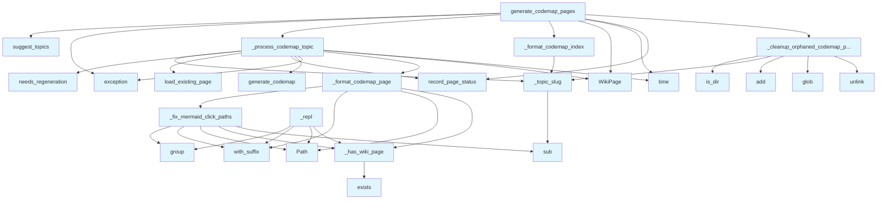

# File: `src/local_deepwiki/generators/wiki/codemap_pages.py`

## File Overview

This file is responsible for generating **execution-flow codemap pages** for a wiki. It auto-detects high-value entry points in a codebase using [`suggest_topics`](../codemap/generator.md), then generates Mermaid diagrams and narrative explanations for each entry point using the [`generate_codemap`](../codemap/generator.md) function. These diagrams are formatted into markdown pages under the `codemaps/` directory of the wiki output.

The file integrates with the broader pipeline via the [`WikiPipelineContext`](context.md) and handles caching, cleanup of stale pages, and formatting of both individual codemap pages and an index page.

## Key Concepts

### Codemap Generation Workflow

The workflow for generating codemaps is as follows:
1. **Topic Discovery**: [`suggest_topics`](../codemap/generator.md) identifies entry points that are likely to be of interest for documentation.
2. **Codemap Generation**: For each topic, [`generate_codemap`](../codemap/generator.md) is invoked to create an execution-flow diagram and a narrative explanation.
3. **Formatting**: The raw codemap result is formatted into a structured markdown page using `_format_codemap_page`.
4. **Index Page**: An index page (`codemaps/index.md`) is generated to list all codemaps.
5. **Caching and Cleanup**: Pages are either loaded from cache or regenerated. Orphaned codemap pages are removed to keep the output clean.

### Mermaid Click Path Handling

Mermaid diagrams generated by the codemap tool use relative paths to files in the repository. These paths must be rewritten for the wiki context where files are stored under `files/` and codemap pages are under `codemaps/`. The `_fix_mermaid_click_paths` function adjusts these paths and removes click handlers for files that do not exist in the wiki.

### Slug Generation

To create filesystem-safe filenames for codemap pages, `_topic_slug` normalizes entry-point names into lowercase, replaces non-alphanumeric characters with hyphens, and truncates to 80 characters. This ensures compatibility with filesystems and prevents issues with long or special-character-rich names.

### Trivial Result Filtering

To avoid generating overly simple or unhelpful codemaps, `_process_codemap_topic` skips topics that result in graphs with fewer than `_MIN_NODES` (a constant defined in the file, currently set to 3). This helps maintain quality and relevance.

## Integration

This file is part of the `local_deepwiki.generators.wiki` module and is used by the main pipeline to generate codemap content. It relies on:

- `local_deepwiki.generators.codemap`: For [`suggest_topics`](../codemap/generator.md) and [`generate_codemap`](../codemap/generator.md).
- `local_deepwiki.generators.wiki.context`: For [`WikiPipelineContext`](context.md) which provides shared state like `vector_store`, `repo_path`, `wiki_path`, and `status_manager`.
- `local_deepwiki.models`: For [`WikiPage`](../../export/streaming.md) model used to represent generated pages.
- `local_deepwiki.logging`: For logging.

It is called from:
- `generate_codemap_pages` (main entry point)
- Various helper functions like `_fix_mermaid_click_paths`, `_topic_slug`, `_format_codemap_index`, and `_process_codemap_topic` are used by `generate_codemap_pages` and `test_wiki_codemaps`.

## Design Notes

### Caching and Regeneration Logic

The system uses a `status_manager` to determine whether a codemap page needs regeneration. It checks if the source files (entry point files) have changed since the last generation. This avoids unnecessary regeneration and speeds up the build process.

### Orphaned Page Cleanup

After generating codemaps, `_cleanup_orphaned_codemap_pages` ensures that stale or deleted topics no longer have corresponding markdown files. This prevents clutter and ensures that the wiki output accurately reflects the current set of discovered topics.

### Error Handling

The system gracefully handles errors during topic discovery and codemap generation by logging exceptions and returning empty results, allowing the pipeline to continue processing other topics.

### Mermaid Path Rewriting

The `_fix_mermaid_click_paths` function is a critical part of ensuring that codemap diagrams are functional within the wiki. It ensures that click handlers in Mermaid diagrams point to the correct wiki paths and removes handlers for files that don't exist, preventing broken links.

### Markdown Formatting

The `_format_codemap_page` function produces rich, structured markdown that includes:
- A hidden metadata block for interactivity.
- A reference to the entry point file.
- A Mermaid diagram with execution flow.
- A narrative explanation.
- Statistics and a list of involved files.

This structure is designed to be both informative and navigable within the wiki context.

## API Reference

### Functions

#### `generate_codemap_pages`

```python
async def generate_codemap_pages(ctx: "WikiPipelineContext") -> tuple[list[WikiPage], int, int]
```

Generate codemap wiki pages for auto-discovered entry points.


| Parameter | Type | Default | Description |
|-----------|------|---------|-------------|
| `ctx` | `"WikiPipelineContext"` | - | Immutable pipeline context bundling shared parameters. |

**Returns:** `tuple[list[WikiPage], int, int]`


<details>
<summary>View Source (lines 261-332) | <a href="https://github.com/UrbanDiver/local-deepwiki-mcp/blob/main/src/local_deepwiki/generators/wiki/codemap_pages.py#L261-L332">GitHub</a></summary>

```python
async def generate_codemap_pages(
    ctx: "WikiPipelineContext",
) -> tuple[list[WikiPage], int, int]:
    """Generate codemap wiki pages for auto-discovered entry points.

    Args:
        ctx: Immutable pipeline context bundling shared parameters.

    Returns:
        Tuple of (pages list, generated count, skipped count).
    """
    config = ctx.wiki_config
    if not config.codemap_enabled or config.codemap_max_topics <= 0:
        return [], 0, 0

    # Discover high-value entry points
    try:
        topics = await suggest_topics(
            vector_store=ctx.vector_store,
            repo_path=ctx.repo_path,
            max_suggestions=config.codemap_max_topics,
        )
    except (ValueError, RuntimeError, OSError):
        # ValueError/RuntimeError: vector store or call graph extraction failures
        # OSError: file I/O errors during topic discovery
        logger.exception("Failed to discover codemap topics")
        return [], 0, 0

    if not topics:
        logger.info("No codemap topics discovered, skipping codemap generation")
        return [], 0, 0

    logger.info("Generating codemaps for %s entry points", len(topics))

    pages: list[WikiPage] = []
    generated = 0
    skipped = 0
    generated_topics: list[dict] = []

    for topic in topics:
        page, was_skipped, was_generated = await _process_codemap_topic(
            topic,
            ctx,
        )
        if page is not None:
            pages.append(page)
            generated_topics.append(topic)
            if was_skipped:
                skipped += 1
            elif was_generated:
                generated += 1

    # Generate index page
    index_content = _format_codemap_index(generated_topics)
    index_page = WikiPage(
        path="codemaps/index.md",
        title="Codemaps",
        content=index_content,
        generated_at=time.time(),
    )
    pages.append(index_page)
    all_source_files = [t.get("file_path", "") for t in generated_topics]
    ctx.status_manager.record_page_status(index_page, all_source_files or [""])
    generated += 1

    # Clean up orphaned codemap pages
    _cleanup_orphaned_codemap_pages(ctx.wiki_path, generated_topics)

    logger.info(
        "Codemap generation complete: %d generated, %d unchanged", generated, skipped
    )
    return pages, generated, skipped
```

</details>

## Call Graph



## Used By

Functions and methods in this file and their callers:

- **`Path`**: called by `_fix_mermaid_click_paths`, `_format_codemap_page`, `_repl`
- **[`WikiPage`](../../export/streaming.md)**: called by `_process_codemap_topic`, `generate_codemap_pages`
- **`_cleanup_orphaned_codemap_pages`**: called by `generate_codemap_pages`
- **`_fix_mermaid_click_paths`**: called by `_format_codemap_page`
- **`_format_codemap_index`**: called by `generate_codemap_pages`
- **`_format_codemap_page`**: called by `_process_codemap_topic`
- **`_has_wiki_page`**: called by `_fix_mermaid_click_paths`, `_format_codemap_page`, `_repl`
- **`_process_codemap_topic`**: called by `generate_codemap_pages`
- **`_topic_slug`**: called by `_cleanup_orphaned_codemap_pages`, `_format_codemap_index`, `_process_codemap_topic`
- **`add`**: called by `_cleanup_orphaned_codemap_pages`
- **`exception`**: called by `_process_codemap_topic`, `generate_codemap_pages`
- **`exists`**: called by `_has_wiki_page`
- **[`generate_codemap`](../codemap/generator.md)**: called by `_process_codemap_topic`
- **`glob`**: called by `_cleanup_orphaned_codemap_pages`
- **`group`**: called by `_fix_mermaid_click_paths`, `_repl`
- **`is_dir`**: called by `_cleanup_orphaned_codemap_pages`
- **`load_existing_page`**: called by `_process_codemap_topic`
- **`needs_regeneration`**: called by `_process_codemap_topic`
- **`record_page_status`**: called by `_process_codemap_topic`, `generate_codemap_pages`
- **`sub`**: called by `_fix_mermaid_click_paths`, `_topic_slug`
- **[`suggest_topics`](../codemap/generator.md)**: called by `generate_codemap_pages`
- **`time`**: called by `_process_codemap_topic`, `generate_codemap_pages`
- **`unlink`**: called by `_cleanup_orphaned_codemap_pages`
- **`with_suffix`**: called by `_fix_mermaid_click_paths`, `_format_codemap_page`, `_repl`

## Last Modified

| Entity | Type | Author | Date | Commit |
|--------|------|--------|------|--------|
| `_format_codemap_page` | function | Brian Breidenbach | today | `d8d0cfa` fix: codemap wiki pages mat... |
| `_process_codemap_topic` | function | Brian Breidenbach | yesterday | `f69b56c` refactor: introduce WikiPip... |
| `generate_codemap_pages` | function | Brian Breidenbach | yesterday | `f69b56c` refactor: introduce WikiPip... |
| `_cleanup_orphaned_codemap_pages` | function | Brian Breidenbach | 2 days ago | `caf8018` refactor: decompose CC > 15... |
| `_has_wiki_page` | function | Brian Breidenbach | Feb 15, 2026 | `2d1048b` fix: codemap node clicks no... |
| `_fix_mermaid_click_paths` | function | Brian Breidenbach | Feb 15, 2026 | `2d1048b` fix: codemap node clicks no... |
| `_repl` | function | Brian Breidenbach | Feb 15, 2026 | `2d1048b` fix: codemap node clicks no... |
| `_topic_slug` | function | Brian Breidenbach | Feb 08, 2026 | `8c91bd8` feat: Auto-generate codemap... |
| `_format_codemap_index` | function | Brian Breidenbach | Feb 08, 2026 | `8c91bd8` feat: Auto-generate codemap... |

## Additional Source Code

Source code for functions and methods not listed in the API Reference above.

#### `_has_wiki_page`

<details>
<summary>View Source (lines 34-38) | <a href="https://github.com/UrbanDiver/local-deepwiki-mcp/blob/main/src/local_deepwiki/generators/wiki/codemap_pages.py#L34-L38">GitHub</a></summary>

```python
def _has_wiki_page(wiki_path: Path | None, rel_md: str) -> bool:
    """Check whether a wiki file page exists on disk."""
    if wiki_path is None:
        return True  # Optimistic when wiki_path unknown
    return (wiki_path / "files" / rel_md).exists()
```

</details>


#### `_fix_mermaid_click_paths`

<details>
<summary>View Source (lines 41-60) | <a href="https://github.com/UrbanDiver/local-deepwiki-mcp/blob/main/src/local_deepwiki/generators/wiki/codemap_pages.py#L41-L60">GitHub</a></summary>

```python
def _fix_mermaid_click_paths(diagram: str, wiki_path: Path | None = None) -> str:
    """Rewrite Mermaid click handlers for wiki context.

    The codemap generator produces ``click N0 "files/src/foo.py" _blank``
    but wiki codemap pages live under ``codemaps/``, so relative links must
    go up one level and use ``.md`` extensions.

    Click handlers for files without wiki pages are removed entirely.
    """

    def _repl(m: re.Match) -> str:
        prefix, rel_path, suffix = m.group(1), m.group(2), m.group(3)
        md_path = str(Path(rel_path).with_suffix(".md"))
        if not _has_wiki_page(wiki_path, md_path):
            return ""  # Remove click handler for missing pages
        return f'{prefix}"../files/{md_path}"{suffix}'

    # Filter out empty replacements (removed click lines)
    result = _CLICK_RE.sub(_repl, diagram)
    return "\n".join(line for line in result.split("\n") if line.strip())
```

</details>


#### `_repl`

<details>
<summary>View Source (lines 51-56) | <a href="https://github.com/UrbanDiver/local-deepwiki-mcp/blob/main/src/local_deepwiki/generators/wiki/codemap_pages.py#L51-L56">GitHub</a></summary>

```python
def _repl(m: re.Match) -> str:
        prefix, rel_path, suffix = m.group(1), m.group(2), m.group(3)
        md_path = str(Path(rel_path).with_suffix(".md"))
        if not _has_wiki_page(wiki_path, md_path):
            return ""  # Remove click handler for missing pages
        return f'{prefix}"../files/{md_path}"{suffix}'
```

</details>


#### `_topic_slug`

<details>
<summary>View Source (lines 63-73) | <a href="https://github.com/UrbanDiver/local-deepwiki-mcp/blob/main/src/local_deepwiki/generators/wiki/codemap_pages.py#L63-L73">GitHub</a></summary>

```python
def _topic_slug(entry_point: str) -> str:
    """Derive a filesystem-safe slug from an entry-point name.

    Examples:
        >>> _topic_slug("WikiGenerator.generate")
        'wikigenerator-generate'
        >>> _topic_slug("__main__")
        'main'
    """
    slug = _SLUG_RE.sub("-", entry_point.lower()).strip("-")
    return slug[:80] if slug else "unnamed"
```

</details>


#### `_format_codemap_page`

<details>
<summary>View Source (lines 76-136) | <a href="https://github.com/UrbanDiver/local-deepwiki-mcp/blob/main/src/local_deepwiki/generators/wiki/codemap_pages.py#L76-L136">GitHub</a></summary>

```python
def _format_codemap_page(
    topic: dict, result: CodemapResult, wiki_path: Path | None = None
) -> str:
    """Format a single codemap result as a markdown page."""
    entry_point = topic.get("entry_point", "unknown")
    file_path = topic.get("file_path", "")

    diagram = _fix_mermaid_click_paths(result.mermaid_diagram, wiki_path)

    # Build a wiki-relative link for the entry point file (only if page exists)
    entry_link = str(Path(file_path).with_suffix(".md")) if file_path else ""
    if entry_link and _has_wiki_page(wiki_path, entry_link):
        entry_ref = (
            f"> Entry point: [`{entry_point}`](../files/{entry_link}) in `{file_path}`"
        )
    else:
        entry_ref = f"> Entry point: `{entry_point}` in `{file_path}`"

    query = topic.get("suggested_query", f"How does {entry_point} work?")

    lines = [
        f"# Codemap: How {entry_point} Works",
        "",
        # Hidden metadata for the "Open in Codemap" link in page.html.
        # The template JS reads data-codemap-* attributes to pass the same
        # parameters to the interactive codemap, ensuring identical results.
        f'<div data-codemap-query="{query}" data-codemap-entry="{entry_point}"'
        f' data-codemap-focus="execution_flow" style="display:none"></div>',
        "",
        entry_ref,
        "",
        "## Execution Flow",
        "",
        "```mermaid",
        diagram,
        "```",
        "",
        "## Trace",
        "",
        result.narrative,
        "",
        "## Statistics",
        "",
        "| Metric | Value |",
        "|--------|-------|",
        f"| Nodes | {result.total_nodes} |",
        f"| Edges | {result.total_edges} |",
        f"| Cross-file edges | {result.cross_file_edges} |",
        f"| Files involved | {len(result.files_involved)} |",
        "",
        "## Files Involved",
        "",
    ]
    for fp in sorted(result.files_involved):
        md_rel = str(Path(fp).with_suffix(".md"))
        if _has_wiki_page(wiki_path, md_rel):
            lines.append(f"- [`{fp}`](../files/{md_rel})")
        else:
            lines.append(f"- `{fp}`")

    return "\n".join(lines) + "\n"
```

</details>


#### `_format_codemap_index`

<details>
<summary>View Source (lines 139-164) | <a href="https://github.com/UrbanDiver/local-deepwiki-mcp/blob/main/src/local_deepwiki/generators/wiki/codemap_pages.py#L139-L164">GitHub</a></summary>

```python
def _format_codemap_index(topics: list[dict]) -> str:
    """Format the codemaps index page listing all generated codemaps."""
    lines = [
        "# Codemaps",
        "",
        "Auto-generated execution-flow diagrams for key entry points.",
        "",
    ]
    if not topics:
        lines.append("*No codemaps were generated for this repository.*")
        return "\n".join(lines) + "\n"

    lines.extend(
        [
            "| Entry Point | File | Reason |",
            "|-------------|------|--------|",
        ]
    )
    for topic in topics:
        entry = topic.get("entry_point", "")
        fp = topic.get("file_path", "")
        reason = topic.get("reason", "")
        slug = _topic_slug(entry)
        lines.append(f"| [{entry}]({slug}.md) | `{fp}` | {reason} |")

    return "\n".join(lines) + "\n"
```

</details>


#### `_process_codemap_topic`

<details>
<summary>View Source (lines 167-233) | <a href="https://github.com/UrbanDiver/local-deepwiki-mcp/blob/main/src/local_deepwiki/generators/wiki/codemap_pages.py#L167-L233">GitHub</a></summary>

```python
async def _process_codemap_topic(
    topic: dict,
    ctx: "WikiPipelineContext",
) -> tuple[WikiPage | None, bool, bool]:
    """Process a single codemap topic: check cache or generate fresh.

    Args:
        topic: Topic dict with entry_point, file_path, suggested_query.
        ctx: Immutable pipeline context bundling shared parameters.

    Returns:
        Tuple of (page_or_None, was_skipped, was_generated). Both False when
        the topic was skipped due to error or trivial result.
    """
    entry_point = topic.get("entry_point", "")
    slug = _topic_slug(entry_point)
    page_path = f"codemaps/{slug}.md"
    source_files = [topic.get("file_path", "")]

    config = ctx.wiki_config

    # Check if page needs regeneration
    if not ctx.full_rebuild and not ctx.status_manager.needs_regeneration(
        page_path, source_files
    ):
        existing_page = await ctx.status_manager.load_existing_page(page_path)
        if existing_page is not None:
            ctx.status_manager.record_page_status(existing_page, source_files)
            return existing_page, True, False

    # Generate codemap
    try:
        result = await generate_codemap(
            query=topic.get("suggested_query", f"How does {entry_point} work?"),
            vector_store=ctx.vector_store,
            repo_path=ctx.repo_path,
            llm=ctx.llm,
            entry_point=entry_point,
            focus=CodemapFocus.EXECUTION_FLOW,
            max_depth=config.codemap_max_depth,
            max_nodes=config.codemap_max_nodes,
        )
    except (ValueError, RuntimeError, OSError, TypeError):
        # ValueError/RuntimeError: vector store or LLM provider failures
        # OSError: file I/O or network errors
        # TypeError: unexpected data shapes from LLM or vector store
        logger.exception("Failed to generate codemap for %s", entry_point)
        return None, False, False

    # Skip trivial graphs
    if result.total_nodes < _MIN_NODES:
        logger.debug(
            "Skipping trivial codemap for %s (%d nodes)",
            entry_point,
            result.total_nodes,
        )
        return None, False, False

    content = _format_codemap_page(topic, result, ctx.wiki_path)
    page = WikiPage(
        path=page_path,
        title=f"Codemap: {entry_point}",
        content=content,
        generated_at=time.time(),
    )
    ctx.status_manager.record_page_status(page, source_files)
    return page, False, True
```

</details>


#### `_cleanup_orphaned_codemap_pages`

<details>
<summary>View Source (lines 236-258) | <a href="https://github.com/UrbanDiver/local-deepwiki-mcp/blob/main/src/local_deepwiki/generators/wiki/codemap_pages.py#L236-L258">GitHub</a></summary>

```python
def _cleanup_orphaned_codemap_pages(
    wiki_path: Path | None, generated_topics: list[dict]
) -> None:
    """Remove codemap pages on disk that are no longer in the generated set.

    Args:
        wiki_path: Wiki output directory.
        generated_topics: Topics that were successfully generated or loaded.
    """
    if wiki_path is None:
        return
    codemaps_dir = wiki_path / "codemaps"
    if not codemaps_dir.is_dir():
        return
    current_slugs = {_topic_slug(t.get("entry_point", "")) for t in generated_topics}
    current_slugs.add("index")
    for md_file in codemaps_dir.glob("*.md"):
        if md_file.stem not in current_slugs:
            try:
                md_file.unlink()
                logger.debug("Removed orphaned codemap page: %s", md_file.name)
            except OSError:
                logger.debug("Failed to remove orphaned codemap: %s", md_file.name)
```

</details>

## Relevant Source Files

- `src/local_deepwiki/generators/wiki/codemap_pages.py:34-38`
