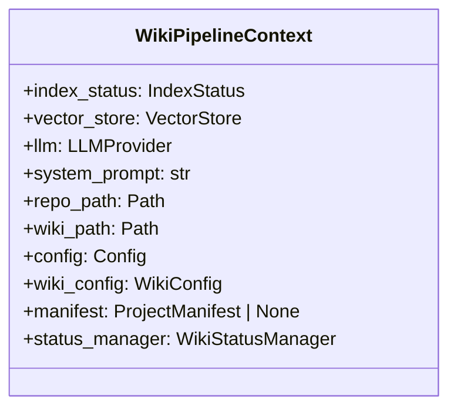

# File: `src/local_deepwiki/generators/wiki/context.py`

## File Overview

This file defines the `WikiPipelineContext` class, which serves as an immutable shared context for the wiki generation pipeline. It bundles together various configuration, state, and service objects that are needed across multiple components in the wiki generation process, avoiding the need to pass long parameter lists to individual functions.

The purpose of this file is to centralize and streamline access to commonly used resources and configuration values throughout the wiki generation pipeline, promoting code reusability and maintainability.

## Key Concepts

### Immutable Context Design

The `WikiPipelineContext` is designed as an immutable data structure (using a dataclass) to ensure that once initialized, its values do not change during the execution of the pipeline. This immutability helps prevent unintended side effects and makes the system more predictable and easier to reason about.

### Shared State Abstraction

By encapsulating commonly used objects such as [`IndexStatus`](../../models/wiki.md), [`VectorStore`](../../core/vectorstore/store.md), [`LLMProvider`](../../providers/base.md), and configuration settings ([`Config`](../../config/models.md), [`WikiConfig`](../../config/models_wiki.md)) into a single context object, this design reduces coupling between components and simplifies dependency injection. It also supports the principle of passing only what is necessary to each stage of the pipeline.

### Configuration and Resource Bundling

The context bundles both configuration data ([`Config`](../../config/models.md), [`WikiConfig`](../../config/models_wiki.md)) and runtime resources ([`VectorStore`](../../core/vectorstore/store.md), [`LLMProvider`](../../providers/base.md), [`IndexStatus`](../../models/wiki.md)). This approach ensures that all required dependencies for wiki generation are available in one place, making it easier to manage and test.

## Integration

This file is imported and used by the `WikiPipelineContext` class, which is referenced by other components in the codebase such as `__init__`, `pipeline_params`, `test_wiki_codemaps`, and potentially others in the wiki generation pipeline.

The `WikiPipelineContext` is constructed using the following types:
- [`IndexStatus`](../../models/wiki.md) from `local_deepwiki.core.index_manager`
- [`VectorStore`](../../core/vectorstore/store.md) from `local_deepwiki.core.vectorstore.store`
- [`LLMProvider`](../../providers/base.md) from `local_deepwiki.providers.base`
- [`Config`](../../config/models.md) and [`WikiConfig`](../../config/models_wiki.md) from `local_deepwiki.config.models`
- [`ProjectManifest`](../manifest.md) from `local_deepwiki.generators.manifest`
- [`WikiStatusManager`](status.md) from `local_deepwiki.generators.wiki.status`

These dependencies reflect the core services and configuration needed to support wiki generation workflows, including indexing, vector storage, language model interaction, and status tracking.

## Design Notes

### Why a Dataclass?

Using a `dataclass` for `WikiPipelineContext` provides a clean and concise way to define a container for immutable state. It automatically generates special methods like `__init__`, `__repr__`, and `__eq__`, which are useful for managing context objects in a pipeline.

### Why Not Include All Dependencies in Every Function?

Rather than passing every dependency directly into functions, this design centralizes them in a single context object. This approach reduces boilerplate code, improves readability, and makes it easier to extend or modify the pipeline without changing function signatures.

### Default Values and Flexibility

The class includes default values for `full_rebuild` and `max_chunk_content_chars`. These defaults allow for flexibility in how the pipeline is invoked while still enforcing sensible defaults when not explicitly overridden. This supports both full rebuilds and incremental updates, as well as configurable chunking behavior for content processing.

### Type Checking Considerations

The import includes `TYPE_CHECKING` to support type hints without creating runtime dependencies, ensuring that type checking works correctly without affecting performance or execution.

## API Reference

### class `WikiPipelineContext`

Immutable context shared across wiki page generators.  Bundles the parameters that are threaded through nearly every page generation function to eliminate long parameter lists.


<details>
<summary>View Source (lines 19-37) | <a href="https://github.com/UrbanDiver/local-deepwiki-mcp/blob/main/src/local_deepwiki/generators/wiki/context.py#L19-L37">GitHub</a></summary>

```python
class WikiPipelineContext:
    """Immutable context shared across wiki page generators.

    Bundles the parameters that are threaded through nearly every
    page generation function to eliminate long parameter lists.
    """

    index_status: IndexStatus
    vector_store: VectorStore
    llm: LLMProvider
    system_prompt: str
    repo_path: Path
    wiki_path: Path
    config: Config
    wiki_config: WikiConfig
    manifest: ProjectManifest | None
    status_manager: WikiStatusManager
    full_rebuild: bool = False
    max_chunk_content_chars: int = 15000
```

</details>

## Class Diagram



## Usage Examples

*Examples extracted from test files*

### FileContext.warnings defaults to an empty list

From `test_context_builder_warnings.py::TestBuildFileContextWarnings::test_warnings_field_is_list`:

```python
context = FileContext(file_path="src/test.py")
assert context.warnings == []
assert isinstance(context.warnings, list)
```

### No 'Generation Notes' section when there are no warnings

From `test_context_builder_warnings.py::TestFormatContextForLlmWarnings::test_omits_generation_notes_without_warnings`:

```python
imports=["import os"],
)

result = format_context_for_llm(context)

assert "Generation Notes" not in result
```

### Generation notes appear at the end, after other sections

From `test_context_builder_warnings.py::TestFormatContextForLlmWarnings::test_generation_notes_appear_after_other_sections`:

```python
imports=["import os"],
    warnings=["Something failed"],
)

result = format_context_for_llm(context)

deps_pos = result.index("Dependencies")
notes_pos = result.index("Generation Notes")
assert notes_pos > deps_pos
```

### Test extracting from 'from X import Y' statement

From `test_context_builder.py::TestExtractImportsFromChunks::test_extracts_from_import_statement`:

```python
chunk = make_chunk(
    chunk_type=ChunkType.IMPORT,
    content="from pathlib import Path\nfrom typing import List",
)

imports, modules = extract_imports_from_chunks([chunk])

assert len(imports) == 2
assert "from pathlib import Path" in imports
assert "from typing import List" in imports
assert "pathlib" in modules
assert "typing" in modules
```

### Test extracting from 'import X' statement

From `test_context_builder.py::TestExtractImportsFromChunks::test_extracts_import_statement`:

```python
chunk = make_chunk(
    chunk_type=ChunkType.IMPORT,
    content="import os\nimport sys",
)

imports, modules = extract_imports_from_chunks([chunk])

assert len(imports) == 2
assert "import os" in imports
assert "os" in modules
assert "sys" in modules
```


## Last Modified

| Entity | Type | Author | Date | Commit |
|--------|------|--------|------|--------|
| `WikiPipelineContext` | class | Brian Breidenbach | 1 week ago | `ef282ff` refactor: introduce WikiPip... |

## Relevant Source Files

- `src/local_deepwiki/generators/wiki/context.py:19-37`
