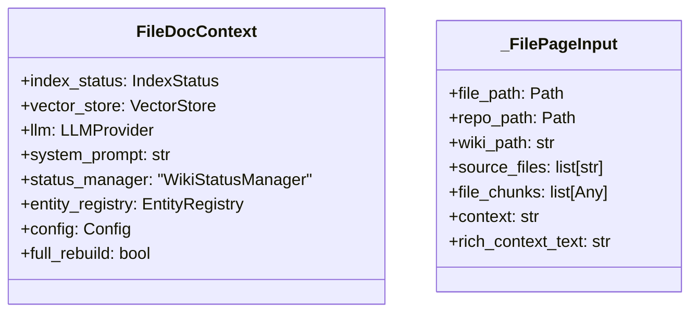
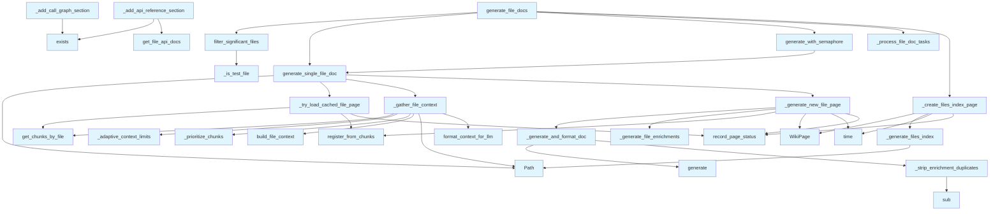

# File: `src/local_deepwiki/generators/wiki/files.py`

## File Overview

This file implements the core logic for generating documentation for individual source files within a codebase, producing Markdown wiki pages that serve as the foundation for a project's documentation system. It orchestrates the process of gathering code context, prompting an LLM for documentation generation, enriching the output with diagrams and cross-references, and managing caching and concurrency.

## Key Concepts

### Documentation Generation Pipeline
The file implements a structured pipeline for generating file-level documentation:
1. **Context Gathering**: Collects code chunks, imports, and related context for a file using vector store lookups.
2. **Prompt Construction**: Builds a detailed prompt including code content and rich context for the LLM.
3. **LLM Generation**: Calls the LLM to produce the core documentation content.
4. **Enrichment**: Adds supplementary information like API references, class diagrams, call graphs, usage examples, and git blame information.
5. **Finalization**: Injects inline source code snippets and registers entities for cross-linking.

### Adaptive Context Limits
The `_adaptive_context_limits` function dynamically adjusts the maximum characters and chunks included in LLM prompts based on file complexity. Simple files (≤5 chunks) get reduced context to speed up generation, while complex files receive full limits.

### Concurrency and Caching
The system uses `asyncio.Semaphore` to control concurrent LLM calls, respecting provider limits. Caching is implemented via `_try_load_cached_file_page` to avoid regenerating documentation for unchanged files.

### File Filtering and Indexing
The `filter_significant_files` function filters out files that are not suitable for documentation (e.g., `__init__.py`, test files, files with minimal content). The `_generate_files_index` function creates a hierarchical index page listing all generated documentation files.

## Integration

This file integrates with several core components of the `local_deepwiki` system:

- **Configuration**: Uses [`Config`](../../config/models.md) for settings like `max_chunk_content_chars`, `max_chunks_per_file`, and `max_concurrent_llm_calls`.
- **[Vector Store](../../core/vectorstore/store.md)**: Interacts with [`VectorStore`](../../core/vectorstore/store.md) to retrieve code chunks via `get_chunks_by_file`.
- **LLM Providers**: Delegates to [`LLMProvider`](../../providers/base.md) implementations for text generation.
- **Code Analysis**: Leverages modules from `local_deepwiki.generators.analysis` (e.g., [`get_file_api_docs`](../analysis/api_docs.md), [`get_file_call_graph`](../analysis/callgraph.md), [`get_file_callers`](../analysis/callgraph.md)) for enrichments.
- **Context Building**: Uses [`build_file_context`](../context_builder.md) and [`format_context_for_llm`](../context_builder.md) from `local_deepwiki.generators.context_builder`.
- **Cross-linking**: Integrates with [`EntityRegistry`](../crosslinks.md) and [`WikiStatusManager`](status.md) for tracking entities and managing page status.
- **Source Formatting**: Utilizes functions from `local_deepwiki.generators.wiki.source_formatter` for inline code injection and blame section generation.

## Design Notes

### Error Handling and Isolation
File generation failures are isolated using `asyncio.as_completed` and wrapped in try-except blocks within `_process_file_doc_tasks`. This ensures that a single file's failure does not halt the entire documentation generation process.

### Caching Strategy
The system checks for existing cached pages using [`WikiStatusManager`](status.md). If a file hasn't changed since the last documentation run, it reuses the cached version, avoiding unnecessary LLM calls and speeding up regeneration.

### Semaphore Usage
The `generate_with_semaphore` function wraps `generate_single_file_doc` to enforce concurrency limits. This is crucial for respecting rate limits of LLM providers and avoiding overwhelming the system with concurrent requests.

### Prompt Engineering
The `_build_llm_prompt` function carefully constructs the prompt to guide the LLM towards generating high-quality documentation. It explicitly instructs the LLM not to generate sections that are auto-generated (like API references, call graphs, etc.), and includes a safety-net (`_strip_enrichment_duplicates`) to remove any such sections that the LLM might generate anyway.

### Performance Considerations
- **Adaptive Context**: Reduces context size for simple files to improve generation speed.
- **Parallel Processing**: Uses `asyncio.gather` and `asyncio.as_completed` for parallel file processing.
- **Efficient Lookups**: Uses scalar vector store lookups for fast retrieval of file chunks.
- **Memory Management**: Processes files in batches and avoids holding all results in memory simultaneously.

### Test File Handling
The `_is_test_file` function identifies test files, which are filtered out of documentation generation by `filter_significant_files` to prevent documenting test code. This is crucial for maintaining a clean and focused documentation set.

### Index Page Generation
The `_generate_files_index` function creates a hierarchical index of all generated file documentation, grouping pages by directory to improve navigation. It also handles the special case of the index page itself to prevent recursive inclusion.

### Inline Source Code Injection
The `_inject_inline_source_code` function integrates actual source code snippets into the generated documentation, enhancing clarity and providing concrete examples. This is done by parsing the generated content and injecting code blocks at appropriate locations.

### Rich Context Building
The `_gather_file_context` function builds a rich context by collecting imports, callers, and related files. This information is formatted using [`format_context_for_llm`](../context_builder.md) and included in the prompt to help the LLM understand how the file integrates into the larger system.

## API Reference

### class `FileDocContext`

Bundled context for file documentation generation.  Groups the parameters shared between generate_file_docs and generate_single_file_doc to reduce parameter counts.

---


<details>
<summary>View Source (lines 541-555) | <a href="https://github.com/UrbanDiver/local-deepwiki-mcp/blob/main/src/local_deepwiki/generators/wiki/files.py#L541-L555">GitHub</a></summary>

```python
class FileDocContext:
    """Bundled context for file documentation generation.

    Groups the parameters shared between generate_file_docs and
    generate_single_file_doc to reduce parameter counts.
    """

    index_status: IndexStatus
    vector_store: VectorStore
    llm: LLMProvider
    system_prompt: str
    status_manager: "WikiStatusManager"
    entity_registry: EntityRegistry
    config: Config
    full_rebuild: bool = False
```

</details>

### Functions

#### `generate_single_file_doc`

```python
async def generate_single_file_doc(file_info: FileInfo, ctx: FileDocContext) -> tuple[WikiPage | None, bool]
```

Generate documentation for a single source file.  Coordinates the documentation generation pipeline: 1. Check if regeneration is needed 2. Gather file context (chunks, imports, related context) 3. Build LLM prompt with all context 4. Generate and format documentation via LLM 5. Add enrichments (diagrams, call graphs, examples, blame) 6. Inject inline source code and register entities


| Parameter | Type | Default | Description |
|-----------|------|---------|-------------|
| `file_info` | `FileInfo` | - | File status information. |
| `ctx` | `FileDocContext` | - | Bundled context with all generation dependencies. |

**Returns:** `tuple[WikiPage | None, bool]`


<details>
<summary>View Source (lines 467-533) | <a href="https://github.com/UrbanDiver/local-deepwiki-mcp/blob/main/src/local_deepwiki/generators/wiki/files.py#L467-L533">GitHub</a></summary>

```python
async def generate_single_file_doc(
    file_info: FileInfo,
    ctx: FileDocContext,
) -> tuple[WikiPage | None, bool]:
    """Generate documentation for a single source file.

    Coordinates the documentation generation pipeline:
    1. Check if regeneration is needed
    2. Gather file context (chunks, imports, related context)
    3. Build LLM prompt with all context
    4. Generate and format documentation via LLM
    5. Add enrichments (diagrams, call graphs, examples, blame)
    6. Inject inline source code and register entities

    Args:
        file_info: File status information.
        ctx: Bundled context with all generation dependencies.

    Returns:
        Tuple of (WikiPage or None, was_skipped).
        Returns (None, False) if file should be skipped entirely.
        Returns (page, True) if existing page was reused.
        Returns (page, False) if new page was generated.
    """
    file_path = Path(file_info.path)
    repo_path = Path(ctx.index_status.repo_path)

    parts = file_path.parts
    if len(parts) > 1:
        wiki_path = f"files/{'/'.join(parts[:-1])}/{file_path.stem}.md"
    else:
        wiki_path = f"files/{file_path.stem}.md"

    source_files = [file_info.path]

    cached = await _try_load_cached_file_page(file_info, wiki_path, source_files, ctx)
    if cached is not None:
        return cached, True

    context_result = await _gather_file_context(
        file_info=file_info,
        index_status=ctx.index_status,
        vector_store=ctx.vector_store,
        max_chunk_content_chars=ctx.config.wiki.max_chunk_content_chars,
        max_chunks_per_file=ctx.config.wiki.max_chunks_per_file,
    )

    if context_result is None:
        return None, False  # No content to document

    file_chunks, context, rich_context_text = context_result

    inp = _FilePageInput(
        file_path=file_path,
        repo_path=repo_path,
        wiki_path=wiki_path,
        source_files=source_files,
        file_chunks=file_chunks,
        context=context,
        rich_context_text=rich_context_text,
    )
    page = await _generate_new_file_page(
        file_info,
        inp,
        ctx,
    )
    return page, False  # Generated new
```

</details>

#### `filter_significant_files`

```python
def filter_significant_files(files: list[FileInfo], max_files: int) -> list[FileInfo]
```

Filter and limit files for documentation generation.


| Parameter | Type | Default | Description |
|-----------|------|---------|-------------|
| `files` | `list[FileInfo]` | - | All indexed files. |
| `max_files` | `int` | - | Maximum files to document (0 = unlimited). |

**Returns:** `list[FileInfo]`


<details>
<summary>View Source (lines 567-592) | <a href="https://github.com/UrbanDiver/local-deepwiki-mcp/blob/main/src/local_deepwiki/generators/wiki/files.py#L567-L592">GitHub</a></summary>

```python
def filter_significant_files(files: list[FileInfo], max_files: int) -> list[FileInfo]:
    """Filter and limit files for documentation generation.

    Args:
        files: All indexed files.
        max_files: Maximum files to document (0 = unlimited).

    Returns:
        Filtered and prioritized list of files.
    """
    # Filter: skip __init__.py, test files, and files with minimal content
    significant = [
        f
        for f in files
        if not f.path.endswith("__init__.py")
        and not _is_test_file(f.path)
        and f.chunk_count >= 2
    ]

    # Limit and prioritize by complexity (chunk count)
    if max_files > 0 and len(significant) > max_files:
        significant = sorted(significant, key=lambda x: x.chunk_count, reverse=True)[
            :max_files
        ]

    return significant
```

</details>

#### `generate_file_docs`

```python
async def generate_file_docs(ctx: FileDocContext, progress_callback: ProgressCallback | None = None, write_callback: WriteCallback | None = None, generation_progress: "GenerationProgress | None" = None, max_files: int | None = None, semaphore: asyncio.Semaphore | None = None) -> tuple[list[WikiPage], int, int]
```

Generate documentation for individual source files.  Uses parallel LLM calls for faster generation, controlled by config.wiki.max_concurrent_llm_calls. Pages are written to disk immediately as they complete if write_callback is provided.


| Parameter | Type | Default | Description |
|-----------|------|---------|-------------|
| `ctx` | `FileDocContext` | - | Bundled context with index status, vector store, LLM, and configuration. |
| `progress_callback` | `ProgressCallback | None` | `None` | Optional progress callback. |
| `write_callback` | `WriteCallback | None` | `None` | Optional async callback to write pages immediately as they complete. |
| `generation_progress` | `"GenerationProgress | None"` | `None` | Optional live progress tracker for status updates. |
| `max_files` | `int | None` | `None` | Optional limit on number of files to process. |
| `semaphore` | `asyncio.Semaphore | None` | `None` | Optional semaphore to limit concurrent LLM calls. |

**Returns:** `tuple[list[WikiPage], int, int]`


<details>
<summary>View Source (lines 703-780) | <a href="https://github.com/UrbanDiver/local-deepwiki-mcp/blob/main/src/local_deepwiki/generators/wiki/files.py#L703-L780">GitHub</a></summary>

```python
async def generate_file_docs(
    ctx: FileDocContext,
    *,
    progress_callback: ProgressCallback | None = None,
    write_callback: WriteCallback | None = None,
    generation_progress: "GenerationProgress | None" = None,
    max_files: int | None = None,
    semaphore: asyncio.Semaphore | None = None,
) -> tuple[list[WikiPage], int, int]:
    """Generate documentation for individual source files.

    Uses parallel LLM calls for faster generation, controlled by
    config.wiki.max_concurrent_llm_calls. Pages are written to disk
    immediately as they complete if write_callback is provided.

    Args:
        ctx: Bundled context with index status, vector store, LLM, and configuration.
        progress_callback: Optional progress callback.
        write_callback: Optional async callback to write pages immediately as they complete.
        generation_progress: Optional live progress tracker for status updates.
        max_files: Optional limit on number of files to process.
        semaphore: Optional semaphore to limit concurrent LLM calls.

    Returns:
        Tuple of (pages list, generated count, skipped count).
    """
    significant_files = filter_significant_files(
        ctx.index_status.files, ctx.config.wiki.max_file_docs
    )
    if not significant_files:
        return [], 0, 0
    if max_files is not None and max_files < len(significant_files):
        significant_files = significant_files[:max_files]

    # Use semaphore to limit concurrent LLM calls (provider-aware)
    max_concurrent = ctx.config.effective_llm_concurrency
    semaphore = semaphore or asyncio.Semaphore(max_concurrent)
    logger.info(
        "Generating file docs for %d files (max %d concurrent)",
        len(significant_files),
        max_concurrent,
    )

    if generation_progress:
        generation_progress.start_phase("file_docs", total=len(significant_files))

    async def generate_with_semaphore(
        file_info: FileInfo,
    ) -> tuple[FileInfo, WikiPage | None, bool]:
        """Generate doc for a file, returning file_info for tracking."""
        async with semaphore:
            logger.debug("Generating doc for %s", file_info.path)
            page, was_skipped = await generate_single_file_doc(
                file_info=file_info,
                ctx=ctx,
            )
            return file_info, page, was_skipped

    tasks = [asyncio.create_task(generate_with_semaphore(f)) for f in significant_files]
    pages, pages_generated, pages_skipped, pages_failed = await _process_file_doc_tasks(
        tasks,
        progress_callback=progress_callback,
        write_callback=write_callback,
        generation_progress=generation_progress,
    )

    # Create files index
    if pages:
        files_index = _create_files_index_page(
            pages, significant_files, ctx.status_manager
        )
        pages.insert(0, files_index)

    if generation_progress:
        generation_progress.complete_phase()

    _log_file_docs_summary(pages_generated, pages_skipped, pages_failed, len(tasks))
    return pages, pages_generated, pages_skipped
```

</details>

#### `generate_with_semaphore`

```python
async def generate_with_semaphore(file_info: FileInfo) -> tuple[FileInfo, WikiPage | None, bool]
```

Generate doc for a file, returning file_info for tracking.


| Parameter | Type | Default | Description |
|-----------|------|---------|-------------|
| `file_info` | `FileInfo` | - | - |

**Returns:** `tuple[FileInfo, WikiPage | None, bool]`


<details>
<summary>View Source (lines 749-759) | <a href="https://github.com/UrbanDiver/local-deepwiki-mcp/blob/main/src/local_deepwiki/generators/wiki/files.py#L749-L759">GitHub</a></summary>

```python
async def generate_with_semaphore(
        file_info: FileInfo,
    ) -> tuple[FileInfo, WikiPage | None, bool]:
        """Generate doc for a file, returning file_info for tracking."""
        async with semaphore:
            logger.debug("Generating doc for %s", file_info.path)
            page, was_skipped = await generate_single_file_doc(
                file_info=file_info,
                ctx=ctx,
            )
            return file_info, page, was_skipped
```

</details>

## Class Diagram



## Call Graph



## Used By

Functions and methods in this file and their callers:

- **`Path`**: called by `_gather_file_context`, `_generate_files_index`, `generate_single_file_doc`
- **`Semaphore`**: called by `generate_file_docs`
- **[`WikiPage`](../../export/streaming.md)**: called by `_create_files_index_page`, `_generate_new_file_page`
- **`_FilePageInput`**: called by `generate_single_file_doc`
- **`_adaptive_context_limits`**: called by `_gather_file_context`
- **`_build_llm_prompt`**: called by `_generate_new_file_page`
- **`_create_files_index_page`**: called by `generate_file_docs`
- **`_gather_file_context`**: called by `generate_single_file_doc`
- **`_generate_and_format_doc`**: called by `_generate_new_file_page`
- **`_generate_blame_section`**: called by `_add_blame_section`
- **`_generate_file_enrichments`**: called by `_generate_new_file_page`
- **`_generate_files_index`**: called by `_create_files_index_page`
- **`_generate_new_file_page`**: called by `generate_single_file_doc`
- **`_inject_inline_source_code`**: called by `_generate_new_file_page`
- **`_is_test_file`**: called by `filter_significant_files`
- **`_log_file_docs_summary`**: called by `generate_file_docs`
- **`_prioritize_chunks`**: called by `_gather_file_context`
- **`_process_file_doc_tasks`**: called by `generate_file_docs`
- **`_strip_enrichment_duplicates`**: called by `_generate_and_format_doc`
- **`_try_load_cached_file_page`**: called by `generate_single_file_doc`
- **`as_completed`**: called by `_process_file_doc_tasks`
- **[`build_file_context`](../context_builder.md)**: called by `_gather_file_context`
- **`complete_file`**: called by `_process_file_doc_tasks`
- **`complete_phase`**: called by `generate_file_docs`
- **`create_task`**: called by `generate_file_docs`
- **`exists`**: called by `_add_api_reference_section`, `_add_call_graph_section`
- **`filter_significant_files`**: called by `generate_file_docs`
- **[`format_context_for_llm`](../context_builder.md)**: called by `_gather_file_context`
- **`gather`**: called by `_generate_file_enrichments`
- **`generate`**: called by `_generate_and_format_doc`
- **[`generate_class_diagram`](../diagrams/class_diagram.md)**: called by `_add_class_diagram_section`
- **`generate_single_file_doc`**: called by `generate_file_docs`, `generate_with_semaphore`
- **`generate_with_semaphore`**: called by `generate_file_docs`
- **`get_chunks_by_file`**: called by `_gather_file_context`, `_try_load_cached_file_page`
- **[`get_file_api_docs`](../analysis/api_docs.md)**: called by `_add_api_reference_section`
- **[`get_file_call_graph`](../analysis/callgraph.md)**: called by `_add_call_graph_section`
- **[`get_file_callers`](../analysis/callgraph.md)**: called by `_add_call_graph_section`
- **[`get_file_examples`](../examples/orchestrator.md)**: called by `_add_examples_section`
- **[`get_repo_info`](../../core/git_utils.md)**: called by `_generate_new_file_page`
- **[`is_test_file`](../analysis/source_filter.md)**: called by `_is_test_file`
- **`load_existing_page`**: called by `_try_load_cached_file_page`
- **`needs_regeneration`**: called by `_try_load_cached_file_page`
- **[`progress_callback`](../../handlers/research.md)**: called by `_process_file_doc_tasks`
- **`record_page_status`**: called by `_create_files_index_page`, `_generate_new_file_page`, `_try_load_cached_file_page`
- **`register_from_chunks`**: called by `_generate_new_file_page`, `_try_load_cached_file_page`
- **`setdefault`**: called by `_generate_files_index`
- **`start_phase`**: called by `generate_file_docs`
- **`sub`**: called by `_strip_enrichment_duplicates`
- **`time`**: called by `_create_files_index_page`, `_generate_new_file_page`
- **`to_thread`**: called by `_generate_file_enrichments`
- **`write_callback`**: called by `_process_file_doc_tasks`

## Last Modified

| Entity | Type | Author | Date | Commit |
|--------|------|--------|------|--------|
| `_FilePageInput` | class | Brian Breidenbach | yesterday | `f69b56c` refactor: introduce WikiPip... |
| `_generate_new_file_page` | function | Brian Breidenbach | yesterday | `f69b56c` refactor: introduce WikiPip... |
| `generate_single_file_doc` | function | Brian Breidenbach | yesterday | `f69b56c` refactor: introduce WikiPip... |
| `_try_load_cached_file_page` | function | Brian Breidenbach | yesterday | `29ae780` refactor: decompose long me... |
| `_process_file_doc_tasks` | function | Brian Breidenbach | 2 days ago | `caf8018` refactor: decompose CC > 15... |
| `_log_file_docs_summary` | function | Brian Breidenbach | 2 days ago | `caf8018` refactor: decompose CC > 15... |
| `generate_file_docs` | function | Brian Breidenbach | 2 days ago | `caf8018` refactor: decompose CC > 15... |
| `_build_llm_prompt` | function | Brian Breidenbach | 2 weeks ago | `60e826b` fix: improve wiki documenta... |
| `_generate_and_format_doc` | function | Brian Breidenbach | 2 weeks ago | `60e826b` fix: improve wiki documenta... |
| `_strip_enrichment_duplicates` | function | Brian Breidenbach | 2 weeks ago | `60e826b` fix: improve wiki documenta... |
| `_adaptive_context_limits` | function | Brian Breidenbach | 2 weeks ago | `7cbd84b` perf: adaptive context sizi... |
| `_gather_file_context` | function | Brian Breidenbach | 2 weeks ago | `7cbd84b` perf: adaptive context sizi... |
| `_generate_file_enrichments` | function | Brian Breidenbach | 2 weeks ago | `7cbd84b` perf: adaptive context sizi... |
| `_add_api_reference_section` | function | Brian Breidenbach | Feb 23, 2026 | `086ea33` refactor: reduce cyclomatic... |
| `_add_class_diagram_section` | function | Brian Breidenbach | Feb 23, 2026 | `086ea33` refactor: reduce cyclomatic... |
| `_add_call_graph_section` | function | Brian Breidenbach | Feb 23, 2026 | `086ea33` refactor: reduce cyclomatic... |
| `_add_examples_section` | function | Brian Breidenbach | Feb 23, 2026 | `086ea33` refactor: reduce cyclomatic... |
| `_add_blame_section` | function | Brian Breidenbach | Feb 23, 2026 | `086ea33` refactor: reduce cyclomatic... |
| `_is_test_file` | function | Brian Breidenbach | Feb 22, 2026 | `213e3ce` refactor: unify _is_test_fi... |
| `filter_significant_files` | function | Brian Breidenbach | Feb 14, 2026 | `45d649a` feat: lazy wiki generation ... |
| `FileDocContext` | class | Brian Breidenbach | Feb 13, 2026 | `bdbd62f` perf: structural fingerprin... |
| `generate_with_semaphore` | function | Brian Breidenbach | Feb 13, 2026 | `bdbd62f` perf: structural fingerprin... |
| `_create_files_index_page` | function | Brian Breidenbach | Jan 24, 2026 | `1e08705` Refactor generate_file_docs... |
| `_generate_files_index` | function | Brian Breidenbach | Jan 15, 2026 | `3defaaa` Refactor: Extract validatio... |

## Additional Source Code

Source code for functions and methods not listed in the API Reference above.

#### `_adaptive_context_limits`

<details>
<summary>View Source (lines 75-100) | <a href="https://github.com/UrbanDiver/local-deepwiki-mcp/blob/main/src/local_deepwiki/generators/wiki/files.py#L75-L100">GitHub</a></summary>

```python
def _adaptive_context_limits(
    chunk_count: int,
    max_chunk_content_chars: int,
    max_chunks_per_file: int,
) -> tuple[int, int]:
    """Scale context limits based on file complexity.

    Simple files (few chunks) get smaller prompts for faster LLM generation.
    Complex files get the full configured limits.

    Args:
        chunk_count: Number of chunks in the file.
        max_chunk_content_chars: Configured max chars.
        max_chunks_per_file: Configured max chunks.

    Returns:
        Tuple of (effective_chars, effective_chunks).
    """
    if chunk_count <= 5:
        # Simple file: use ~1/3 of limits
        return max(500, max_chunk_content_chars // 3), min(chunk_count, 10)
    if chunk_count <= 15:
        # Medium file: use ~2/3 of limits
        return max(500, max_chunk_content_chars * 2 // 3), min(max_chunks_per_file, 30)
    # Complex file: full limits
    return max_chunk_content_chars, max_chunks_per_file
```

</details>


#### `_gather_file_context`

<details>
<summary>View Source (lines 103-158) | <a href="https://github.com/UrbanDiver/local-deepwiki-mcp/blob/main/src/local_deepwiki/generators/wiki/files.py#L103-L158">GitHub</a></summary>

```python
async def _gather_file_context(
    file_info: FileInfo,
    index_status: IndexStatus,
    vector_store: VectorStore,
    max_chunk_content_chars: int = 15000,
    max_chunks_per_file: int = 60,
) -> tuple[list[CodeChunk], str, str] | None:
    """Collect chunks, imports, and related context for the file.

    Args:
        file_info: File status information.
        index_status: Index status with repo information.
        vector_store: Vector store with indexed code.
        max_chunk_content_chars: Max characters of chunk content in LLM prompt.
        max_chunks_per_file: Max chunks to include in LLM prompt context.

    Returns:
        Tuple of (chunks_list, context_text, rich_context_text) or None if no content.
    """
    # Get all chunks for this file using direct lookup (efficient scalar index)
    file_chunks = await vector_store.get_chunks_by_file(file_info.path)

    if not file_chunks:
        return None  # No content to document

    # Scale context limits based on file complexity
    effective_chars, effective_chunks = _adaptive_context_limits(
        len(file_chunks), max_chunk_content_chars, max_chunks_per_file
    )

    # Prioritize chunks by documentation value: functions/methods first,
    # then classes, then module summaries, then imports
    prioritized = _prioritize_chunks(file_chunks, effective_chunks)

    # Build context from prioritized chunks
    context_parts = []
    for chunk in prioritized:
        context_parts.append(
            f"Type: {chunk.chunk_type.value}\n"
            f"Name: {chunk.name}\n"
            f"Lines: {chunk.start_line}-{chunk.end_line}\n"
            f"```\n{chunk.content[:effective_chars]}\n```"
        )

    context = "\n\n".join(context_parts)

    # Build rich context with imports, callers, and related files
    rich_context = await build_file_context(
        file_path=file_info.path,
        chunks=file_chunks,
        repo_path=Path(index_status.repo_path),
        vector_store=vector_store,
    )
    rich_context_text = format_context_for_llm(rich_context)

    return file_chunks, context, rich_context_text
```

</details>


#### `_build_llm_prompt`

<details>
<summary>View Source (lines 161-205) | <a href="https://github.com/UrbanDiver/local-deepwiki-mcp/blob/main/src/local_deepwiki/generators/wiki/files.py#L161-L205">GitHub</a></summary>

```python
def _build_llm_prompt(
    file_info: FileInfo,
    context: str,
    rich_context_text: str,
) -> str:
    """Construct the LLM prompt with all context.

    Args:
        file_info: File status information.
        context: Code context text.
        rich_context_text: Rich context with imports and callers.

    Returns:
        The formatted LLM prompt string.
    """
    return f"""Generate documentation for the file '{file_info.path}' based on the code and context provided.

Language: {file_info.language}
Total code chunks: {file_info.chunk_count}

{rich_context_text}
## Code Contents
{context}

Generate documentation that includes:
1. **File Overview**: Purpose, responsibility, and design rationale of this file
2. **Key Concepts**: Important abstractions, patterns, or algorithms and WHY they were chosen
3. **Integration**: How this file fits into the larger codebase (based on imports and callers)
4. **Design Notes**: Trade-offs, edge cases handled, or non-obvious implementation choices

Do NOT include these sections — they are auto-generated from the AST and will be appended:
- Classes or Functions reference (auto-generated as "API Reference")
- Class diagrams (auto-generated from AST)
- Usage examples (auto-extracted from test files)
- Call graphs (auto-generated from static analysis)

CRITICAL CONSTRAINTS:
- ONLY describe components that appear in the code above
- Do NOT invent additional methods or parameters not shown
- Write class names as plain text (e.g., "The WikiGenerator class") for cross-linking
- Use the dependency and caller information to explain integration, but don't fabricate details
- Focus on the WHY (design rationale) not just the WHAT (listing classes/functions)
- Only use backticks for actual code snippets

Format as markdown with clear sections."""
```

</details>


#### `_generate_and_format_doc`

<details>
<summary>View Source (lines 208-229) | <a href="https://github.com/UrbanDiver/local-deepwiki-mcp/blob/main/src/local_deepwiki/generators/wiki/files.py#L208-L229">GitHub</a></summary>

```python
async def _generate_and_format_doc(
    prompt: str,
    llm: LLMProvider,
    system_prompt: str,
) -> str:
    """Call LLM and format the response.

    Args:
        prompt: The LLM prompt.
        llm: LLM provider for generation.
        system_prompt: System prompt for LLM.

    Returns:
        The formatted documentation content.
    """
    content = await llm.generate(prompt, system_prompt=system_prompt)

    # Safety-net: strip LLM-generated sections that duplicate AST enrichments.
    # Even though the prompt says not to generate these, LLMs sometimes do anyway.
    content = _strip_enrichment_duplicates(content)

    return content
```

</details>


#### `_strip_enrichment_duplicates`

<details>
<summary>View Source (lines 263-273) | <a href="https://github.com/UrbanDiver/local-deepwiki-mcp/blob/main/src/local_deepwiki/generators/wiki/files.py#L263-L273">GitHub</a></summary>

```python
def _strip_enrichment_duplicates(content: str) -> str:
    """Remove LLM-generated sections that duplicate AST enrichments.

    The prompt instructs the LLM not to generate Classes, Functions,
    Usage Examples, or Class Diagram sections, but LLMs sometimes
    ignore instructions. This safety net strips those sections so
    only the authoritative AST-derived versions appear.
    """
    for pattern in _DUPLICATE_SECTION_PATTERNS:
        content = pattern.sub("", content)
    return content
```

</details>


#### `_add_api_reference_section`

<details>
<summary>View Source (lines 276-281) | <a href="https://github.com/UrbanDiver/local-deepwiki-mcp/blob/main/src/local_deepwiki/generators/wiki/files.py#L276-L281">GitHub</a></summary>

```python
def _add_api_reference_section(abs_file_path: Path) -> str:
    """Generate API reference section with type signatures."""
    if not abs_file_path.exists():
        return ""
    api_docs = get_file_api_docs(abs_file_path)
    return ("\n\n## API Reference\n\n" + api_docs) if api_docs else ""
```

</details>


#### `_add_class_diagram_section`

<details>
<summary>View Source (lines 284-287) | <a href="https://github.com/UrbanDiver/local-deepwiki-mcp/blob/main/src/local_deepwiki/generators/wiki/files.py#L284-L287">GitHub</a></summary>

```python
def _add_class_diagram_section(all_file_chunks: list[CodeChunk]) -> str:
    """Generate class diagram if file has classes."""
    class_diagram = generate_class_diagram(all_file_chunks)
    return ("\n\n## Class Diagram\n\n" + class_diagram) if class_diagram else ""
```

</details>


#### `_add_call_graph_section`

<details>
<summary>View Source (lines 290-317) | <a href="https://github.com/UrbanDiver/local-deepwiki-mcp/blob/main/src/local_deepwiki/generators/wiki/files.py#L290-L317">GitHub</a></summary>

```python
def _add_call_graph_section(abs_file_path: Path, repo_path: Path) -> str:
    """Generate call graph diagram and used-by information."""
    if not abs_file_path.exists():
        return ""

    parts: list[str] = []

    call_graph = get_file_call_graph(abs_file_path, repo_path)
    if call_graph:
        parts.append("\n\n## Call Graph\n\n```mermaid\n" + call_graph + "\n```")

    callers_map = get_file_callers(abs_file_path, repo_path)
    if callers_map:
        used_by_lines = [
            "## Used By",
            "",
            "Functions and methods in this file and their callers:",
            "",
        ]
        for callee in sorted(callers_map.keys()):
            callers = callers_map[callee]
            if callers:
                caller_list = ", ".join(f"`{c}`" for c in sorted(callers))
                used_by_lines.append(f"- **`{callee}`**: called by {caller_list}")
        if len(used_by_lines) > 4:  # More than just the header
            parts.append("\n\n" + "\n".join(used_by_lines))

    return "".join(parts)
```

</details>


#### `_add_examples_section`

<details>
<summary>View Source (lines 320-337) | <a href="https://github.com/UrbanDiver/local-deepwiki-mcp/blob/main/src/local_deepwiki/generators/wiki/files.py#L320-L337">GitHub</a></summary>

```python
def _add_examples_section(
    abs_file_path: Path,
    repo_path: Path,
    all_file_chunks: list[CodeChunk],
) -> str:
    """Add usage examples from test files."""
    entity_names = [
        chunk.name for chunk in all_file_chunks if chunk.name and len(chunk.name) > 2
    ]
    if not entity_names:
        return ""
    examples_md = get_file_examples(
        source_file=abs_file_path,
        repo_root=repo_path,
        entity_names=entity_names,
        max_examples=5,
    )
    return ("\n\n" + examples_md) if examples_md else ""
```

</details>


#### `_add_blame_section`

<details>
<summary>View Source (lines 340-351) | <a href="https://github.com/UrbanDiver/local-deepwiki-mcp/blob/main/src/local_deepwiki/generators/wiki/files.py#L340-L351">GitHub</a></summary>

```python
def _add_blame_section(
    repo_path: Path,
    file_path: str,
    all_file_chunks: list[CodeChunk],
) -> str:
    """Add git blame "Last Modified" section."""
    blame_section = _generate_blame_section(
        repo_path=repo_path,
        file_path=file_path,
        chunks=all_file_chunks,
    )
    return ("\n\n" + blame_section) if blame_section else ""
```

</details>


#### `_generate_file_enrichments`

<details>
<summary>View Source (lines 354-385) | <a href="https://github.com/UrbanDiver/local-deepwiki-mcp/blob/main/src/local_deepwiki/generators/wiki/files.py#L354-L385">GitHub</a></summary>

```python
async def _generate_file_enrichments(
    content: str,
    abs_file_path: Path,
    repo_path: Path,
    file_path: str,
    all_file_chunks: list[CodeChunk],
) -> str:
    """Generate diagrams, call graphs, examples, and blame info concurrently.

    Each enrichment is independent and involves file I/O or subprocess calls,
    so they run in parallel via ``asyncio.to_thread``.

    Args:
        content: The base documentation content.
        abs_file_path: Absolute path to the source file.
        repo_path: Path to the repository root.
        file_path: Relative path to the source file.
        all_file_chunks: All code chunks from the file.

    Returns:
        The enriched documentation content.
    """
    results = await asyncio.gather(
        asyncio.to_thread(_add_api_reference_section, abs_file_path),
        asyncio.to_thread(_add_class_diagram_section, all_file_chunks),
        asyncio.to_thread(_add_call_graph_section, abs_file_path, repo_path),
        asyncio.to_thread(
            _add_examples_section, abs_file_path, repo_path, all_file_chunks
        ),
        asyncio.to_thread(_add_blame_section, repo_path, file_path, all_file_chunks),
    )
    return content + "".join(results)
```

</details>


### `_FilePageInput`

<details>
<summary>View Source (lines 389-403) | <a href="https://github.com/UrbanDiver/local-deepwiki-mcp/blob/main/src/local_deepwiki/generators/wiki/files.py#L389-L403">GitHub</a></summary>

```python
class _FilePageInput:
    """Intermediate data for generating a single file page.

    Groups the file-specific values computed by
    :func:`generate_single_file_doc` so that
    :func:`_generate_new_file_page` stays under the 6-param threshold.
    """

    file_path: Path
    repo_path: Path
    wiki_path: str
    source_files: list[str]
    file_chunks: list[Any]
    context: str
    rich_context_text: str
```

</details>


#### `_generate_new_file_page`

<details>
<summary>View Source (lines 406-441) | <a href="https://github.com/UrbanDiver/local-deepwiki-mcp/blob/main/src/local_deepwiki/generators/wiki/files.py#L406-L441">GitHub</a></summary>

```python
async def _generate_new_file_page(
    file_info: FileInfo,
    inp: _FilePageInput,
    ctx: FileDocContext,
) -> WikiPage:
    """Build the prompt, generate content, add enrichments, and return a new WikiPage."""
    prompt = _build_llm_prompt(
        file_info=file_info,
        context=inp.context,
        rich_context_text=inp.rich_context_text,
    )
    content = await _generate_and_format_doc(
        prompt=prompt,
        llm=ctx.llm,
        system_prompt=ctx.system_prompt,
    )
    abs_file_path = inp.repo_path / file_info.path
    content = await _generate_file_enrichments(
        content=content,
        abs_file_path=abs_file_path,
        repo_path=inp.repo_path,
        file_path=file_info.path,
        all_file_chunks=inp.file_chunks,
    )
    lang_str = file_info.language.value if file_info.language else None
    repo_info = get_repo_info(inp.repo_path)
    content = _inject_inline_source_code(content, inp.file_chunks, lang_str, repo_info)
    ctx.entity_registry.register_from_chunks(inp.file_chunks, inp.wiki_path)
    page = WikiPage(
        path=inp.wiki_path,
        title=f"{inp.file_path.name}",
        content=content,
        generated_at=time.time(),
    )
    ctx.status_manager.record_page_status(page, inp.source_files)
    return page
```

</details>


#### `_try_load_cached_file_page`

<details>
<summary>View Source (lines 444-464) | <a href="https://github.com/UrbanDiver/local-deepwiki-mcp/blob/main/src/local_deepwiki/generators/wiki/files.py#L444-L464">GitHub</a></summary>

```python
async def _try_load_cached_file_page(
    file_info: FileInfo,
    wiki_path: str,
    source_files: list[str],
    ctx: FileDocContext,
) -> WikiPage | None:
    """Return the existing cached page if regeneration is not needed, else None.

    Also registers entities for cross-linking when returning a cached page.
    """
    if ctx.full_rebuild or ctx.status_manager.needs_regeneration(
        wiki_path, source_files
    ):
        return None
    existing_page = await ctx.status_manager.load_existing_page(wiki_path)
    if existing_page is None:
        return None
    all_file_chunks = await ctx.vector_store.get_chunks_by_file(file_info.path)
    ctx.entity_registry.register_from_chunks(all_file_chunks, wiki_path)
    ctx.status_manager.record_page_status(existing_page, source_files)
    return existing_page
```

</details>


#### `_is_test_file`

<details>
<summary>View Source (lines 558-564) | <a href="https://github.com/UrbanDiver/local-deepwiki-mcp/blob/main/src/local_deepwiki/generators/wiki/files.py#L558-L564">GitHub</a></summary>

```python
def _is_test_file(path: str) -> bool:
    """Check if a file is in a test directory.

    Delegates to :func:`local_deepwiki.core.path_utils.is_test_file`
    with ``check_filename=False`` (directory membership only).
    """
    return is_test_file(path, check_filename=False)
```

</details>


#### `_create_files_index_page`

<details>
<summary>View Source (lines 595-618) | <a href="https://github.com/UrbanDiver/local-deepwiki-mcp/blob/main/src/local_deepwiki/generators/wiki/files.py#L595-L618">GitHub</a></summary>

```python
def _create_files_index_page(
    pages: list[WikiPage],
    significant_files: list[FileInfo],
    status_manager: "WikiStatusManager",
) -> WikiPage:
    """Create the files index page.

    Args:
        pages: All generated file pages.
        significant_files: Files that were documented.
        status_manager: Status manager for recording.

    Returns:
        Files index WikiPage.
    """
    all_file_paths = [f.path for f in significant_files]
    files_index = WikiPage(
        path="files/index.md",
        title="Source Files",
        content=_generate_files_index(pages),
        generated_at=time.time(),
    )
    status_manager.record_page_status(files_index, all_file_paths)
    return files_index
```

</details>


#### `_process_file_doc_tasks`

<details>
<summary>View Source (lines 621-675) | <a href="https://github.com/UrbanDiver/local-deepwiki-mcp/blob/main/src/local_deepwiki/generators/wiki/files.py#L621-L675">GitHub</a></summary>

```python
async def _process_file_doc_tasks(
    tasks: list,
    *,
    progress_callback: ProgressCallback | None,
    write_callback: WriteCallback | None,
    generation_progress: "GenerationProgress | None",
) -> tuple[list[WikiPage], int, int, int]:
    """Collect results from file-doc generation tasks as they complete.

    Handles optional callbacks for progress reporting and immediate page
    writing. Failures are isolated so one bad file cannot abort the whole run.

    Args:
        tasks: asyncio tasks returning (FileInfo, WikiPage | None, was_skipped).
        progress_callback: Optional progress reporter callback.
        write_callback: Optional async callback to write pages immediately.
        generation_progress: Optional live progress tracker.

    Returns:
        Tuple of (pages, pages_generated, pages_skipped, pages_failed).
    """
    pages: list[WikiPage] = []
    pages_generated = 0
    pages_skipped = 0
    pages_failed = 0

    for coro in asyncio.as_completed(tasks):
        try:
            file_info, page, was_skipped = await coro

            if page is not None:
                pages.append(page)
                if was_skipped:
                    pages_skipped += 1
                else:
                    pages_generated += 1

                if write_callback:
                    await write_callback(page)

                if progress_callback:
                    progress_callback(
                        f"Generated {file_info.path}", len(pages), len(tasks)
                    )

            if generation_progress:
                generation_progress.complete_file(file_info.path)

        except Exception as e:  # noqa: BLE001 — file generation isolation: one file failure must not abort entire wiki build
            logger.error("Error generating file doc: %s", e)
            pages_failed += 1
            if generation_progress:
                generation_progress.complete_file()

    return pages, pages_generated, pages_skipped, pages_failed
```

</details>


#### `_log_file_docs_summary`

<details>
<summary>View Source (lines 678-700) | <a href="https://github.com/UrbanDiver/local-deepwiki-mcp/blob/main/src/local_deepwiki/generators/wiki/files.py#L678-L700">GitHub</a></summary>

```python
def _log_file_docs_summary(
    pages_generated: int, pages_skipped: int, pages_failed: int, total: int
) -> None:
    """Log a summary of file-doc generation results.

    Args:
        pages_generated: Number of pages newly generated.
        pages_skipped: Number of pages loaded from cache.
        pages_failed: Number of pages that failed.
        total: Total number of tasks attempted.
    """
    log_msg = (
        f"File docs complete: {pages_generated} generated, {pages_skipped} skipped"
    )
    if pages_failed:
        log_msg += f", {pages_failed} failed"
    logger.info(log_msg)
    if pages_failed:
        logger.warning(
            "%d file docs failed to generate out of %d total",
            pages_failed,
            total,
        )
```

</details>


#### `_generate_files_index`

<details>
<summary>View Source (lines 783-816) | <a href="https://github.com/UrbanDiver/local-deepwiki-mcp/blob/main/src/local_deepwiki/generators/wiki/files.py#L783-L816">GitHub</a></summary>

```python
def _generate_files_index(file_pages: list[WikiPage]) -> str:
    """Generate index page for file documentation.

    Args:
        file_pages: List of file wiki pages.

    Returns:
        Markdown content for files index.
    """
    lines = [
        "# Source Files\n",
        "Detailed documentation for individual source files.\n",
    ]

    # Group by directory
    by_dir: dict[str, list[WikiPage]] = {}
    for page in file_pages:
        if page.path == "files/index.md":
            continue
        parts = Path(page.path).parts
        if len(parts) > 2:
            dir_name = parts[1]  # files/DIR/file.md -> DIR
        else:
            dir_name = "root"
        by_dir.setdefault(dir_name, []).append(page)

    for dir_name, dir_pages in sorted(by_dir.items()):
        lines.append(f"\n## {dir_name}\n")
        for page in sorted(dir_pages, key=lambda p: p.title):
            # Make relative link from files/index.md
            rel_path = page.path.replace("files/", "")
            lines.append(f"- [{page.title}]({rel_path})")

    return "\n".join(lines)
```

</details>

## Relevant Source Files

- `src/local_deepwiki/generators/wiki/files.py:389-403`
