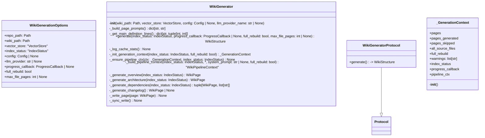

# File: `src/local_deepwiki/generators/wiki/generator.py`

## File Overview

This file defines the core `WikiGenerator` class and supporting utilities for generating wiki documentation using LLMs and structured data. It serves as the main entry point for wiki generation, orchestrating a multi-phase pipeline that produces documentation pages such as overview, architecture, dependencies, and changelogs.

The file integrates with several other components in the system:
- LLM providers via `get_cached_llm_provider`
- Vector stores for semantic search
- Configuration management via [`Config`](../../config/models.md) and [`get_config`](../../config/loader.md)
- Progress tracking and status management
- Cross-linking and relationship analysis
- Git repository utilities

The design emphasizes modularity, testability, and performance through caching, incremental updates, and deferred context initialization.

## Key Concepts

### Protocol-Based Interface
The `WikiGeneratorProtocol` defines a lightweight interface that allows for substituting implementations (e.g., no-op generators for CI). This supports testability and decouples consumers from concrete implementations.

### Generation Context and Pipeline
The `_GenerationContext` class encapsulates mutable state during generation, avoiding the need to pass many parameters between helper methods. The [`run_generation_pipeline`](pipeline.md) function orchestrates the full multi-phase process, leveraging the `WikiGenerator` instance and its context.

### Prompt Management
The [`PromptManager`](../../prompts.md) is used to load and customize system prompts per LLM provider and page type. This enables tailored documentation generation while maintaining a consistent structure.

### Incremental Updates and Caching
The [`WikiStatusManager`](status.md) and [`GenerationProgress`](../progress_tracker.md) support incremental builds, reducing rework. Caching is implemented at both the LLM provider level (`get_cached_llm_provider`) and in the vector store for performance.

### Modular Page Generation
Each major documentation page (overview, architecture, dependencies, etc.) is generated by a dedicated function in the `analysis` or `wiki` modules. The `WikiGenerator` delegates to these functions using a pipeline context that includes relevant configuration and data.

## Integration

### With Core Components
- [`VectorStore`](../../core/vectorstore/store.md): Used for semantic search, retrieving main definition lines, and providing embeddings for LLM context.
- [`Config`](../../config/models.md) and [`get_config`](../../config/loader.md): Provide configuration for LLMs, prompts, caching, and wiki generation behavior.
- [`WikiPipelineContext`](context.md): Passed to page generation functions to provide context for LLMs and access to shared resources.

### With CLI and Plugin Systems
- The `generate_wiki` convenience function is called by CLI entry points and plugins to initiate generation.
- The `WikiGenerator` class implements `WikiGeneratorProtocol`, making it compatible with systems that accept protocol-based interfaces.

### With Other Generators
- Functions like [`generate_overview_page`](pages.md), [`generate_architecture_page`](pages.md), and others in the `analysis` and `wiki` modules are imported and used by `WikiGenerator` methods to produce individual pages.
- Cross-linking and relationship analysis are handled by [`EntityRegistry`](../crosslinks.md) and [`RelationshipAnalyzer`](../see_also.md).

## Design Notes

### Deferred Context Initialization
The `_ensure_pipeline_ctx` method allows tests to bypass [`init_generation_context`](pipeline.md) by lazily building the [`WikiPipelineContext`](context.md). This supports test isolation without requiring full initialization.

### LLM Caching Strategy
The `WikiGenerator` uses `get_cached_llm_provider` with a cache path (`llm_cache.lance`) to improve performance on repeated generations. This is especially important in development workflows where incremental updates are common.

### GitHub Repo Detection
When `wiki.use_cloud_for_github` is enabled, `generate_wiki` automatically switches to a cloud LLM provider for GitHub repositories. This allows leveraging more powerful models for large projects without manual configuration.

### Backward Compatibility
The `generate_wiki` function supports both the new `WikiGenerationOptions` pattern and legacy keyword arguments for backward compatibility. The `WikiGenerationOptions` class acts as a data bag that encapsulates all parameters needed for generation, reducing function signature complexity.

### Performance and Memory Management
The `_write_page` method writes wiki pages asynchronously using `asyncio.to_thread` to avoid blocking the event loop. This improves responsiveness during large document generation.

### Error Handling and Logging
The `_log_cache_stats` method logs LLM cache statistics to aid in performance monitoring and debugging. It gracefully handles cases where cache stats are not available.

### Extensibility
The design supports adding new page types or modifying existing ones through the prompt system and modular page generation functions. This allows for easy extension without modifying core logic.

## API Reference

### class `WikiGeneratorProtocol`

**Inherits from:** `Protocol`

Protocol defining the interface for wiki documentation generators.  Components that trigger wiki generation should accept this Protocol so that lightweight test stubs and alternative implementations (e.g. a no-op generator for CI) can be substituted without inheriting from the concrete ``WikiGenerator`` class.

**Methods:**


<details>
<summary>View Source (lines 49-66) | <a href="https://github.com/UrbanDiver/local-deepwiki-mcp/blob/main/src/local_deepwiki/generators/wiki/generator.py#L49-L66">GitHub</a></summary>

```python
class WikiGeneratorProtocol(Protocol):
    """Protocol defining the interface for wiki documentation generators.

    Components that trigger wiki generation should accept this Protocol so
    that lightweight test stubs and alternative implementations (e.g. a no-op
    generator for CI) can be substituted without inheriting from the concrete
    ``WikiGenerator`` class.
    """

    async def generate(
        self,
        index_status: IndexStatus,
        progress_callback: ProgressCallback | None = None,
        full_rebuild: bool = False,
        max_file_pages: int | None = None,
    ) -> WikiStructure:
        """Generate wiki documentation and return the resulting structure."""
        ...
```

</details>

#### `generate`

```python
async def generate(index_status: IndexStatus, progress_callback: ProgressCallback | None = None, full_rebuild: bool = False, max_file_pages: int | None = None) -> WikiStructure
```

Generate wiki documentation and return the resulting structure.


| Parameter | Type | Default | Description |
|-----------|------|---------|-------------|
| `index_status` | `IndexStatus` | - | - |
| `progress_callback` | `ProgressCallback | None` | `None` | - |
| `full_rebuild` | `bool` | `False` | - |
| `max_file_pages` | `int | None` | `None` | - |


<details>
<summary>View Source (lines 49-66) | <a href="https://github.com/UrbanDiver/local-deepwiki-mcp/blob/main/src/local_deepwiki/generators/wiki/generator.py#L49-L66">GitHub</a></summary>

```python
class WikiGeneratorProtocol(Protocol):
    """Protocol defining the interface for wiki documentation generators.

    Components that trigger wiki generation should accept this Protocol so
    that lightweight test stubs and alternative implementations (e.g. a no-op
    generator for CI) can be substituted without inheriting from the concrete
    ``WikiGenerator`` class.
    """

    async def generate(
        self,
        index_status: IndexStatus,
        progress_callback: ProgressCallback | None = None,
        full_rebuild: bool = False,
        max_file_pages: int | None = None,
    ) -> WikiStructure:
        """Generate wiki documentation and return the resulting structure."""
        ...
```

</details>

### class `WikiGenerationOptions`

Options for wiki generation, replacing the large function signature.  Encapsulates all parameters needed by ``generate_wiki()`` into a single frozen dataclass.  The function still accepts individual keyword arguments for backward compatibility, but new callers should prefer passing an ``options`` instance.


<details>
<summary>View Source (lines 70-87) | <a href="https://github.com/UrbanDiver/local-deepwiki-mcp/blob/main/src/local_deepwiki/generators/wiki/generator.py#L70-L87">GitHub</a></summary>

```python
class WikiGenerationOptions:
    """Options for wiki generation, replacing the large function signature.

    Encapsulates all parameters needed by ``generate_wiki()`` into a single
    frozen dataclass.  The function still accepts individual keyword arguments
    for backward compatibility, but new callers should prefer passing an
    ``options`` instance.
    """

    repo_path: Path
    wiki_path: Path
    vector_store: "VectorStore"
    index_status: "IndexStatus"
    config: Config | None = None
    llm_provider: str | None = None
    progress_callback: ProgressCallback | None = None
    full_rebuild: bool = False
    max_file_pages: int | None = None
```

</details>

### class `WikiGenerator`

Generate wiki documentation from indexed code.

**Methods:**


<details>
<summary>View Source (lines 131-381) | <a href="https://github.com/UrbanDiver/local-deepwiki-mcp/blob/main/src/local_deepwiki/generators/wiki/generator.py#L131-L381">GitHub</a></summary>

```python
class WikiGenerator:
    # Methods: __init__, _build_page_prompts, _get_main_definition_lines, generate, _log_cache_stats, _init_generation_context, _ensure_pipeline_ctx, _build_pipeline_context, _generate_overview, _generate_architecture, _generate_dependencies, _generate_changelog, _write_page, _sync_write
```

</details>

#### `__init__`

```python
def __init__(wiki_path: Path, vector_store: VectorStore, config: Config | None = None, llm_provider_name: str | None = None)
```

Initialize the wiki generator.


| Parameter | Type | Default | Description |
|-----------|------|---------|-------------|
| `wiki_path` | `Path` | - | - |
| `vector_store` | `VectorStore` | - | - |
| `config` | `Config | None` | `None` | - |
| `llm_provider_name` | `str | None` | `None` | - |


<details>
<summary>View Source (lines 134-195) | <a href="https://github.com/UrbanDiver/local-deepwiki-mcp/blob/main/src/local_deepwiki/generators/wiki/generator.py#L134-L195">GitHub</a></summary>

```python
def __init__(
        self,
        wiki_path: Path,
        vector_store: VectorStore,
        config: Config | None = None,
        llm_provider_name: str | None = None,
    ):
        """Initialize the wiki generator."""
        self.wiki_path = wiki_path
        self.vector_store = vector_store
        base_config = config or get_config()

        # Create a copy with overridden LLM provider if specified
        if llm_provider_name:
            self.config = base_config.with_llm_provider(llm_provider_name)
        else:
            # Store a defensive copy to prevent external mutation
            self.config = base_config.model_copy(deep=True)

        # Use cached LLM provider for better performance on repeated generations
        cache_path = wiki_path / "llm_cache.lance"
        self.llm = get_cached_llm_provider(
            cache_path=cache_path,
            embedding_provider=vector_store.embedding_provider,
            cache_config=self.config.llm_cache,
            llm_config=self.config.llm,
        )

        # Initialize prompt manager for custom prompt support
        custom_prompts_dir = None
        if self.config.prompts.custom_dir:
            custom_prompts_dir = Path(self.config.prompts.custom_dir)
        self._prompt_manager = PromptManager(
            custom_dir=custom_prompts_dir,
            repo_path=None,  # Will be set during generation
        )

        # Get provider-specific system prompt (may be overridden by custom prompts)
        self._system_prompt = self._prompt_manager.get_wiki_system_prompt(
            provider=self.config.llm.provider,
        )

        # Build page-type-specific prompts
        self._page_prompts = self._build_page_prompts()

        # Entity registry for cross-linking
        self.entity_registry = EntityRegistry()

        # Relationship analyzer for See Also sections
        self.relationship_analyzer = RelationshipAnalyzer()

        # Status manager for incremental updates
        self.status_manager = WikiStatusManager(wiki_path)

        # Cached project manifest (parsed from package files)
        self._manifest: ProjectManifest | None = None

        # Repository path (set during generation)
        self._repo_path: Path | None = None

        # Progress tracker (set during generation by init_generation_context)
        self._progress: GenerationProgress | None = None
```

</details>

#### `generate`

```python
async def generate(index_status: IndexStatus, progress_callback: ProgressCallback | None = None, full_rebuild: bool = False, max_file_pages: int | None = None) -> WikiStructure
```

Generate wiki documentation for the indexed repository.  Delegates the full multi-phase pipeline to :func:`~local_deepwiki.generators.wiki.pipeline.run_generation_pipeline`.


| Parameter | Type | Default | Description |
|-----------|------|---------|-------------|
| `index_status` | `IndexStatus` | - | - |
| `progress_callback` | `ProgressCallback | None` | `None` | - |
| `full_rebuild` | `bool` | `False` | - |
| `max_file_pages` | `int | None` | `None` | - |


---


<details>
<summary>View Source (lines 216-236) | <a href="https://github.com/UrbanDiver/local-deepwiki-mcp/blob/main/src/local_deepwiki/generators/wiki/generator.py#L216-L236">GitHub</a></summary>

```python
async def generate(
        self,
        index_status: IndexStatus,
        progress_callback: ProgressCallback | None = None,
        full_rebuild: bool = False,
        max_file_pages: int | None = None,
    ) -> WikiStructure:
        """Generate wiki documentation for the indexed repository.

        Delegates the full multi-phase pipeline to
        :func:`~local_deepwiki.generators.wiki.pipeline.run_generation_pipeline`.
        """
        from local_deepwiki.generators.wiki.pipeline import run_generation_pipeline

        return await run_generation_pipeline(
            generator=self,
            index_status=index_status,
            progress_callback=progress_callback,
            full_rebuild=full_rebuild,
            max_file_pages=max_file_pages,
        )
```

</details>

### Functions

#### `generate_wiki`

```python
async def generate_wiki(repo_path: Path | None = None, wiki_path: Path | None = None, vector_store: VectorStore | None = None, index_status: IndexStatus | None = None, options: WikiGenerationOptions | None = None, config: Config | None = None, llm_provider: str | None = None, progress_callback: ProgressCallback | None = None, full_rebuild: bool = False, max_file_pages: int | None = None) -> WikiStructure
```

Convenience function to generate wiki documentation.  Accepts either a ``WikiGenerationOptions`` instance via ``options`` or individual keyword arguments for backward compatibility.  When ``options`` is provided, its values take precedence and individual keyword arguments are ignored.


| Parameter | Type | Default | Description |
|-----------|------|---------|-------------|
| `repo_path` | `Path | None` | `None` | - |
| `wiki_path` | `Path | None` | `None` | - |
| `vector_store` | `VectorStore | None` | `None` | - |
| `index_status` | `IndexStatus | None` | `None` | - |
| `options` | `WikiGenerationOptions | None` | `None` | - |
| `config` | `Config | None` | `None` | - |
| `llm_provider` | `str | None` | `None` | - |
| `progress_callback` | `ProgressCallback | None` | `None` | - |
| `full_rebuild` | `bool` | `False` | - |
| `max_file_pages` | `int | None` | `None` | - |

**Returns:** [`WikiStructure`](../../models/wiki.md)


<details>
<summary>View Source (lines 384-452) | <a href="https://github.com/UrbanDiver/local-deepwiki-mcp/blob/main/src/local_deepwiki/generators/wiki/generator.py#L384-L452">GitHub</a></summary>

```python
async def generate_wiki(
    repo_path: Path | None = None,
    wiki_path: Path | None = None,
    vector_store: VectorStore | None = None,
    index_status: IndexStatus | None = None,
    *,
    options: WikiGenerationOptions | None = None,
    config: Config | None = None,
    llm_provider: str | None = None,
    progress_callback: ProgressCallback | None = None,
    full_rebuild: bool = False,
    max_file_pages: int | None = None,
) -> WikiStructure:
    """Convenience function to generate wiki documentation.

    Accepts either a ``WikiGenerationOptions`` instance via ``options`` or
    individual keyword arguments for backward compatibility.  When ``options``
    is provided, its values take precedence and individual keyword arguments
    are ignored.
    """
    from local_deepwiki.core.git_utils import is_github_repo

    # Build options from individual kwargs when not provided directly
    if options is not None:
        opts = options
    else:
        if repo_path is None:
            raise TypeError("repo_path is required when options is not provided")
        if wiki_path is None:
            raise TypeError("wiki_path is required when options is not provided")
        if vector_store is None:
            raise TypeError("vector_store is required when options is not provided")
        if index_status is None:
            raise TypeError("index_status is required when options is not provided")
        opts = WikiGenerationOptions(
            repo_path=repo_path,
            wiki_path=wiki_path,
            vector_store=vector_store,
            index_status=index_status,
            config=config,
            llm_provider=llm_provider,
            progress_callback=progress_callback,
            full_rebuild=full_rebuild,
            max_file_pages=max_file_pages,
        )

    resolved_config = opts.config or get_config()

    # Auto-switch to cloud provider for GitHub repos if configured
    effective_provider = opts.llm_provider
    if effective_provider is None and resolved_config.wiki.use_cloud_for_github:
        if is_github_repo(opts.repo_path):
            effective_provider = resolved_config.wiki.github_llm_provider
            logger.info(
                "GitHub repo detected, using cloud provider: %s", effective_provider
            )

    generator = WikiGenerator(
        wiki_path=opts.wiki_path,
        vector_store=opts.vector_store,
        config=resolved_config,
        llm_provider_name=effective_provider,
    )
    return await generator.generate(
        opts.index_status,
        opts.progress_callback,
        opts.full_rebuild,
        max_file_pages=opts.max_file_pages,
    )
```

</details>

## Class Diagram



## Call Graph

```mermaid
flowchart TD
    N0[EntityRegistry]
    N1[Path]
    N2[PromptManager]
    N3[RelationshipAnalyzer]
    N4[TypeError]
    N5[WikiGenerationOptions]
    N6[WikiGenerator]
    N7[WikiGenerator.__init__]
    N8[WikiGenerator._build_page_p...]
    N9[WikiGenerator._ensure_pipel...]
    N10[WikiGenerator._generate_arc...]
    N11[WikiGenerator._generate_dep...]
    N12[WikiGenerator._generate_ove...]
    N13[WikiGenerator._sync_write]
    N14[WikiGenerator._write_page]
    N15[WikiPipelineContext]
    N16[WikiStatusManager]
    N17[_build_page_prompts]
    N18[_build_pipeline_context]
    N19[generate]
    N20[generate_wiki]
    N21[get_cached_llm_provider]
    N22[get_config]
    N23[get_wiki_page_prompt]
    N24[get_wiki_system_prompt]
    N25[is_github_repo]
    N26[mkdir]
    N27[model_copy]
    N28[with_llm_provider]
    N29[write_text]
    N20 --> N4
    N20 --> N5
    N20 --> N22
    N20 --> N25
    N20 --> N6
    N20 --> N19
    N7 --> N22
    N7 --> N28
    N7 --> N27
    N7 --> N21
    N7 --> N1
    N7 --> N2
    N7 --> N24
    N7 --> N17
    N7 --> N0
    N7 --> N3
    N7 --> N16
    N8 --> N23
    N9 --> N1
    N9 --> N15
    N12 --> N18
    N10 --> N18
    N11 --> N18
    N14 --> N26
    N14 --> N29
    N13 --> N26
    N13 --> N29
    classDef func fill:#e1f5fe
    class N0,N1,N2,N3,N4,N5,N6,N15,N16,N17,N18,N19,N20,N21,N22,N23,N24,N25,N26,N27,N28,N29 func
    classDef method fill:#fff3e0
    class N7,N8,N9,N10,N11,N12,N13,N14 method
```



## Used By

Functions and methods in this file and their callers:

- **[`EntityRegistry`](../crosslinks.md)**: called by `WikiGenerator.__init__`
- **`Path`**: called by `WikiGenerator.__init__`, `WikiGenerator._ensure_pipeline_ctx`
- **[`PromptManager`](../../prompts.md)**: called by `WikiGenerator.__init__`
- **[`RelationshipAnalyzer`](../see_also.md)**: called by `WikiGenerator.__init__`
- **`TypeError`**: called by `generate_wiki`
- **`WikiGenerationOptions`**: called by `generate_wiki`
- **`WikiGenerator`**: called by `generate_wiki`
- **[`WikiPipelineContext`](context.md)**: called by `WikiGenerator._build_pipeline_context`, `WikiGenerator._ensure_pipeline_ctx`
- **[`WikiStatusManager`](status.md)**: called by `WikiGenerator.__init__`
- **`_build_page_prompts`**: called by `WikiGenerator.__init__`
- **`_build_pipeline_context`**: called by `WikiGenerator._generate_architecture`, `WikiGenerator._generate_dependencies`, `WikiGenerator._generate_overview`
- **`generate`**: called by `generate_wiki`
- **[`generate_architecture_page`](pages.md)**: called by `WikiGenerator._generate_architecture`
- **[`generate_changelog_page`](pages.md)**: called by `WikiGenerator._generate_changelog`
- **[`generate_dependencies_page`](pages.md)**: called by `WikiGenerator._generate_dependencies`
- **[`generate_overview_page`](pages.md)**: called by `WikiGenerator._generate_overview`
- **`get_cached_llm_provider`**: called by `WikiGenerator.__init__`
- **[`get_config`](../../config/loader.md)**: called by `WikiGenerator.__init__`, `generate_wiki`
- **`get_main_definition_lines`**: called by `WikiGenerator._get_main_definition_lines`
- **`get_wiki_page_prompt`**: called by `WikiGenerator._build_page_prompts`
- **`get_wiki_system_prompt`**: called by `WikiGenerator.__init__`
- **[`init_generation_context`](pipeline.md)**: called by `WikiGenerator._init_generation_context`
- **[`is_github_repo`](../../core/git_utils.md)**: called by `generate_wiki`
- **`mkdir`**: called by `WikiGenerator._sync_write`, `WikiGenerator._write_page`
- **`model_copy`**: called by `WikiGenerator.__init__`
- **[`run_generation_pipeline`](pipeline.md)**: called by `WikiGenerator.generate`
- **`to_thread`**: called by `WikiGenerator._write_page`
- **`with_llm_provider`**: called by `WikiGenerator.__init__`
- **`write_text`**: called by `WikiGenerator._sync_write`, `WikiGenerator._write_page`

## Last Modified

| Entity | Type | Author | Date | Commit |
|--------|------|--------|------|--------|
| `WikiGenerator` | class | Brian Breidenbach | yesterday | `4b1fa98` fix: add type narrowing for... |
| `__init__` | method | Brian Breidenbach | yesterday | `4b1fa98` fix: add type narrowing for... |
| `_ensure_pipeline_ctx` | method | Brian Breidenbach | yesterday | `e10b842` fix: _ensure_pipeline_ctx u... |
| `_GenerationContext` | class | Brian Breidenbach | yesterday | `22c9676` refactor: build WikiPipelin... |
| `WikiGeneratorProtocol` | class | Brian Breidenbach | yesterday | `515ba66` refactor: improve coupling ... |
| `_build_pipeline_context` | method | Brian Breidenbach | 1 week ago | `e91da1c` fix: consolidate _make_ctx ... |
| `_generate_overview` | method | Brian Breidenbach | 1 week ago | `ffc79e6` refactor: change wiki gener... |
| `_generate_architecture` | method | Brian Breidenbach | 1 week ago | `ffc79e6` refactor: change wiki gener... |
| `_generate_dependencies` | method | Brian Breidenbach | 1 week ago | `ffc79e6` refactor: change wiki gener... |
| `generate` | method | Brian Breidenbach | 1 week ago | `0f86cb5` refactor: extract services,... |
| `_init_generation_context` | method | Brian Breidenbach | 1 week ago | `0f86cb5` refactor: extract services,... |
| `WikiGenerationOptions` | class | Brian Breidenbach | 2 weeks ago | `3cad9fa` refactor: introduce WikiGen... |
| `generate_wiki` | function | Brian Breidenbach | 2 weeks ago | `3cad9fa` refactor: introduce WikiGen... |
| `_log_cache_stats` | method | Brian Breidenbach | Feb 20, 2026 | `b807417` refactor: high-priority Pyt... |
| `_build_page_prompts` | method | Brian Breidenbach | Feb 19, 2026 | `fe2a6e6` feat: improve wiki generati... |
| `_get_main_definition_lines` | method | Brian Breidenbach | Feb 09, 2026 | `99410a9` refactor: split 4 large fil... |
| `_write_page` | method | Brian Breidenbach | Jan 15, 2026 | `3defaaa` Refactor: Extract validatio... |
| `_generate_changelog` | method | Brian Breidenbach | Jan 15, 2026 | `b8f8b68` Refactor: Extract page gene... |
| `_sync_write` | method | Brian Breidenbach | Jan 13, 2026 | `c568951` Add input validation, type ... |

## Additional Source Code

Source code for functions and methods not listed in the API Reference above.

### `_GenerationContext`

<details>
<summary>View Source (lines 90-128) | <a href="https://github.com/UrbanDiver/local-deepwiki-mcp/blob/main/src/local_deepwiki/generators/wiki/generator.py#L90-L128">GitHub</a></summary>

```python
class _GenerationContext:
    """Internal context for tracking wiki generation state.

    This class encapsulates mutable state during generation to avoid
    passing many parameters between helper methods.
    """

    __slots__ = (
        "pages",
        "pages_generated",
        "pages_skipped",
        "all_source_files",
        "full_rebuild",
        "warnings",
        "index_status",
        "progress_callback",
        "pipeline_ctx",
    )

    def __init__(
        self,
        pages: list["WikiPage"],
        pages_generated: int,
        pages_skipped: int,
        all_source_files: list[str],
        full_rebuild: bool,
        index_status: "IndexStatus | None" = None,
        progress_callback: "ProgressCallback | None" = None,
        pipeline_ctx: "WikiPipelineContext | None" = None,
    ):
        self.pages = pages
        self.pages_generated = pages_generated
        self.pages_skipped = pages_skipped
        self.all_source_files = all_source_files
        self.full_rebuild = full_rebuild
        self.warnings: list[str] = []
        self.index_status = index_status
        self.progress_callback = progress_callback
        self.pipeline_ctx = pipeline_ctx
```

</details>


#### `_build_page_prompts`

<details>
<summary>View Source (lines 197-210) | <a href="https://github.com/UrbanDiver/local-deepwiki-mcp/blob/main/src/local_deepwiki/generators/wiki/generator.py#L197-L210">GitHub</a></summary>

```python
def _build_page_prompts(self) -> dict[str, str]:
        """Build page-type-specific system prompts.

        Returns a dict mapping page type names to their system prompts,
        falling back to ``self._system_prompt`` for unknown types.
        """
        provider = self.config.llm.provider
        prompts: dict[str, str] = {}
        for page_type in ("overview", "architecture", "file", "module"):
            prompts[page_type] = self._prompt_manager.get_wiki_page_prompt(
                page_type=page_type,
                provider=provider,
            )
        return prompts
```

</details>


#### `_get_main_definition_lines`

<details>
<summary>View Source (lines 212-214) | <a href="https://github.com/UrbanDiver/local-deepwiki-mcp/blob/main/src/local_deepwiki/generators/wiki/generator.py#L212-L214">GitHub</a></summary>

```python
def _get_main_definition_lines(self) -> dict[str, tuple[int, int]]:
        """Get line range of main definition (first class/function) per file."""
        return self.vector_store.get_main_definition_lines()
```

</details>


#### `_log_cache_stats`

<details>
<summary>View Source (lines 238-257) | <a href="https://github.com/UrbanDiver/local-deepwiki-mcp/blob/main/src/local_deepwiki/generators/wiki/generator.py#L238-L257">GitHub</a></summary>

```python
def _log_cache_stats(self) -> None:
        """Log LLM cache statistics if available."""
        try:
            cache_stats = getattr(self.llm, "stats", None)
            if cache_stats is None:
                return
            hits = int(cache_stats.get("hits", 0))
            misses = int(cache_stats.get("misses", 0))
            skipped = int(cache_stats.get("skipped", 0))
            total = hits + misses
            hit_rate = (hits / total * 100) if total > 0 else 0.0
            logger.info(
                "LLM cache stats: %d hits, %d misses, %d skipped (%.1f%% hit rate)",
                hits,
                misses,
                skipped,
                hit_rate,
            )
        except (TypeError, ValueError, AttributeError):
            pass
```

</details>


#### `_init_generation_context`

<details>
<summary>View Source (lines 259-265) | <a href="https://github.com/UrbanDiver/local-deepwiki-mcp/blob/main/src/local_deepwiki/generators/wiki/generator.py#L259-L265">GitHub</a></summary>

```python
async def _init_generation_context(
        self, index_status: IndexStatus, full_rebuild: bool
    ) -> _GenerationContext:
        """Initialize the generation context with tracking state."""
        from local_deepwiki.generators.wiki.pipeline import init_generation_context

        return await init_generation_context(self, index_status, full_rebuild)
```

</details>


#### `_ensure_pipeline_ctx`

<details>
<summary>View Source (lines 267-296) | <a href="https://github.com/UrbanDiver/local-deepwiki-mcp/blob/main/src/local_deepwiki/generators/wiki/generator.py#L267-L296">GitHub</a></summary>

```python
def _ensure_pipeline_ctx(
        self, ctx: _GenerationContext, index_status: IndexStatus
    ) -> None:
        """Lazily build ``pipeline_ctx`` on *ctx* when tests bypass init."""
        if ctx.pipeline_ctx is not None:
            return
        from local_deepwiki.generators.wiki.context import WikiPipelineContext

        # Fallback for tests that skip init_generation_context.
        # Use getattr throughout because __new__-created instances may
        # lack attributes that __init__ normally sets.
        repo_path = getattr(self, "_repo_path", None) or Path(index_status.repo_path)
        config = getattr(self, "config", None)
        wiki_config = getattr(config, "wiki", None)
        ctx.pipeline_ctx = WikiPipelineContext(
            index_status=index_status,
            vector_store=self.vector_store,
            llm=getattr(self, "llm", None),  # type: ignore[arg-type]
            system_prompt=getattr(self, "_system_prompt", ""),
            repo_path=repo_path,
            wiki_path=self.wiki_path,
            config=config,  # type: ignore[arg-type]
            wiki_config=wiki_config,  # type: ignore[arg-type]
            manifest=getattr(self, "_manifest", None),
            status_manager=self.status_manager,
            full_rebuild=ctx.full_rebuild,
            max_chunk_content_chars=(
                wiki_config.max_chunk_content_chars if wiki_config else 15000
            ),
        )
```

</details>


#### `_build_pipeline_context`

<details>
<summary>View Source (lines 298-335) | <a href="https://github.com/UrbanDiver/local-deepwiki-mcp/blob/main/src/local_deepwiki/generators/wiki/generator.py#L298-L335">GitHub</a></summary>

```python
def _build_pipeline_context(
        self,
        index_status: IndexStatus,
        *,
        system_prompt: str | None = None,
        full_rebuild: bool = False,
    ) -> "WikiPipelineContext":
        """Build an immutable pipeline context from generator state.

        Args:
            index_status: Current repository index status.
            system_prompt: Override system prompt (defaults to ``self._system_prompt``).
            full_rebuild: Whether this is a full rebuild.

        Returns:
            A frozen ``WikiPipelineContext`` dataclass.
        """
        from local_deepwiki.generators.wiki.context import WikiPipelineContext

        assert self._repo_path is not None, (
            "Repository path must be set before building pipeline context"
        )
        return WikiPipelineContext(
            index_status=index_status,
            vector_store=self.vector_store,
            llm=self.llm,
            system_prompt=system_prompt
            if system_prompt is not None
            else self._system_prompt,
            repo_path=self._repo_path,
            wiki_path=self.wiki_path,
            config=self.config,
            wiki_config=self.config.wiki,
            manifest=self._manifest,
            status_manager=self.status_manager,
            full_rebuild=full_rebuild,
            max_chunk_content_chars=self.config.wiki.max_chunk_content_chars,
        )
```

</details>


#### `_generate_overview`

<details>
<summary>View Source (lines 337-344) | <a href="https://github.com/UrbanDiver/local-deepwiki-mcp/blob/main/src/local_deepwiki/generators/wiki/generator.py#L337-L344">GitHub</a></summary>

```python
async def _generate_overview(self, index_status: IndexStatus) -> WikiPage:
        """Generate the main overview/index page with grounded facts."""
        return await generate_overview_page(
            self._build_pipeline_context(
                index_status,
                system_prompt=self._page_prompts.get("overview", self._system_prompt),
            )
        )
```

</details>


#### `_generate_architecture`

<details>
<summary>View Source (lines 346-355) | <a href="https://github.com/UrbanDiver/local-deepwiki-mcp/blob/main/src/local_deepwiki/generators/wiki/generator.py#L346-L355">GitHub</a></summary>

```python
async def _generate_architecture(self, index_status: IndexStatus) -> WikiPage:
        """Generate architecture documentation with diagrams and grounded facts."""
        return await generate_architecture_page(
            self._build_pipeline_context(
                index_status,
                system_prompt=self._page_prompts.get(
                    "architecture", self._system_prompt
                ),
            )
        )
```

</details>


#### `_generate_dependencies`

<details>
<summary>View Source (lines 357-364) | <a href="https://github.com/UrbanDiver/local-deepwiki-mcp/blob/main/src/local_deepwiki/generators/wiki/generator.py#L357-L364">GitHub</a></summary>

```python
async def _generate_dependencies(
        self, index_status: IndexStatus
    ) -> tuple[WikiPage, list[str]]:
        """Generate dependencies documentation with grounded facts from manifest."""
        return await generate_dependencies_page(
            self._build_pipeline_context(index_status),
            import_search_limit=self.config.wiki.import_search_limit,
        )
```

</details>


#### `_generate_changelog`

<details>
<summary>View Source (lines 366-368) | <a href="https://github.com/UrbanDiver/local-deepwiki-mcp/blob/main/src/local_deepwiki/generators/wiki/generator.py#L366-L368">GitHub</a></summary>

```python
async def _generate_changelog(self) -> WikiPage | None:
        """Generate changelog page from git history."""
        return await generate_changelog_page(self._repo_path)
```

</details>


#### `_write_page`

<details>
<summary>View Source (lines 370-381) | <a href="https://github.com/UrbanDiver/local-deepwiki-mcp/blob/main/src/local_deepwiki/generators/wiki/generator.py#L370-L381">GitHub</a></summary>

```python
async def _write_page(self, page: WikiPage) -> None:
        """Write a wiki page to disk asynchronously."""
        import asyncio

        page_path = self.wiki_path / page.path
        content = page.content

        def _sync_write() -> None:
            page_path.parent.mkdir(parents=True, exist_ok=True)
            page_path.write_text(content)

        await asyncio.to_thread(_sync_write)
```

</details>


#### `_sync_write`

<details>
<summary>View Source (lines 377-379) | <a href="https://github.com/UrbanDiver/local-deepwiki-mcp/blob/main/src/local_deepwiki/generators/wiki/generator.py#L377-L379">GitHub</a></summary>

```python
def _sync_write() -> None:
            page_path.parent.mkdir(parents=True, exist_ok=True)
            page_path.write_text(content)
```

</details>

## Relevant Source Files

- `src/local_deepwiki/generators/wiki/generator.py:49-66`
