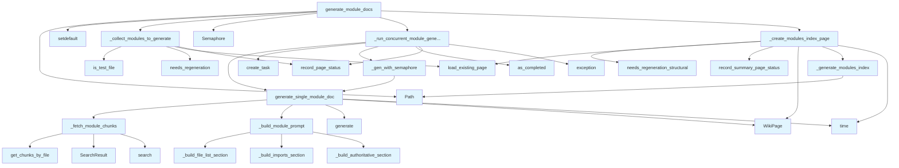

# File: `src/local_deepwiki/generators/wiki/modules.py`

## File Overview

This file implements the core logic for generating documentation for modules (directories) within a codebase. It orchestrates the process of identifying modules that need documentation, fetching relevant code chunks, building prompts for LLMs, and generating wiki pages for each module. The module is designed to work within a larger wiki generation pipeline, integrating with vector stores, LLMs, and status managers to support incremental and concurrent documentation generation.

## Key Concepts

### Module Documentation Generation

The primary abstraction in this file is the **module documentation generation pipeline**. It processes directories of files as modules, grouping files by directory, and generating a single documentation page per module. This approach mirrors how projects are structured and helps maintain a logical separation of concerns in the generated wiki.

### Concurrent Generation with Semaphores

To manage resource usage and prevent overwhelming the LLM backend, the system uses `asyncio.Semaphore` to control concurrency. This ensures that only a specified number of LLM calls are active at once, which is critical for performance and rate-limiting compliance.

### Prompt Engineering for Contextual Documentation

The system builds a structured prompt that includes:
- A list of files in the module
- Relevant code chunks from those files
- Import information extracted from the code
- Authoritative project documentation for grounding

This design ensures that the LLM has sufficient and relevant context to produce accurate, contextual documentation.

### Incremental Builds and Caching

The system supports incremental builds by tracking the status of pages and their dependencies. If a module's files haven't changed since the last documentation run, the system can skip regeneration and reuse cached content. This improves performance for large codebases.

## Integration

This file is part of the `local_deepwiki.generators.wiki` module and integrates deeply with:
- [`WikiPipelineContext`](context.md): Provides shared parameters like LLM, vector store, repo path, and system prompt.
- [`VectorStore`](../../core/vectorstore/store.md): Used to fetch code chunks and perform semantic search.
- `StatusManager`: Manages page freshness and caching.
- [`WikiPage`](../../export/streaming.md): Represents generated documentation pages.
- [`SearchResult`](../../handlers/types.md): Represents code chunks returned by the vector store.
- [`extract_imports_from_chunks`](../context_builder.md): Utility for parsing import statements from code chunks.

The file is called by `test_wiki_modules_coverage`, indicating its use in testing the documentation coverage of modules.

## Design Notes

### Why Not Process Files Individually?

Processing files individually would not align with the conceptual structure of a module. Modules are logical groupings of related files, and documenting them as a unit ensures coherence and completeness in the generated documentation.

### Why Limit Concurrent Tasks?

Limiting concurrent tasks via `asyncio.Semaphore` is a pragmatic design choice to avoid overwhelming LLM APIs and to ensure stable performance. It also allows for better control over resource consumption.

### Why Use Structural Status Checking?

Instead of just checking file timestamps, the system uses structural fingerprinting for index pages. This ensures that changes in the module structure (e.g., new files added) are detected and trigger rebuilds.

### Why Prioritize File Content Over Imports?

The prompt prioritizes code context over import information. This ensures that the LLM focuses on what the code does rather than how it's imported, which is more useful for documentation purposes.

### Why Not Generate Documentation for Single-File Modules?

The system skips directories with fewer than two files. This is a pragmatic decision to avoid generating documentation for directories that are likely not actual modules but perhaps just test or utility directories.

### Error Handling

The system uses a broad `except Exception` clause in `_run_concurrent_module_generation` to ensure that one failed module generation doesn't halt the entire documentation build. This allows for graceful degradation and partial documentation generation.

## API Reference

### Functions

#### `generate_module_docs`

```python
async def generate_module_docs(ctx: WikiPipelineContext, max_concurrent: int = 8, semaphore: asyncio.Semaphore | None = None) -> tuple[list[WikiPage], int, int]
```

Generate documentation for each module/directory.


| Parameter | Type | Default | Description |
|-----------|------|---------|-------------|
| `ctx` | `WikiPipelineContext` | - | Immutable pipeline context bundling shared parameters. |
| `max_concurrent` | `int` | `8` | Maximum concurrent LLM calls (ignored if semaphore provided). |
| `semaphore` | `asyncio.Semaphore | None` | `None` | Optional shared semaphore for concurrency control. |

**Returns:** `tuple[list[WikiPage], int, int]`


<details>
<summary>View Source (lines 150-206) | <a href="https://github.com/UrbanDiver/local-deepwiki-mcp/blob/main/src/local_deepwiki/generators/wiki/modules.py#L150-L206">GitHub</a></summary>

```python
async def generate_module_docs(
    ctx: WikiPipelineContext,
    *,
    max_concurrent: int = 8,
    semaphore: asyncio.Semaphore | None = None,
) -> tuple[list[WikiPage], int, int]:
    """Generate documentation for each module/directory.

    Args:
        ctx: Immutable pipeline context bundling shared parameters.
        max_concurrent: Maximum concurrent LLM calls (ignored if semaphore provided).
        semaphore: Optional shared semaphore for concurrency control.

    Returns:
        Tuple of (pages list, generated count, skipped count).
    """
    index_status = ctx.index_status

    pages: list[WikiPage] = []
    pages_generated = 0

    # Group files by top-level directory
    directories: dict[str, list[str]] = {}
    for file_info in index_status.files:
        parts = Path(file_info.path).parts
        dir_name = parts[0] if len(parts) > 1 else "root"
        directories.setdefault(dir_name, []).append(file_info.path)

    (
        modules_to_generate,
        cached_pages,
        pages_skipped,
    ) = await _collect_modules_to_generate(
        directories, ctx.status_manager, ctx.full_rebuild
    )
    pages.extend(cached_pages)

    if modules_to_generate:
        sem = semaphore or asyncio.Semaphore(max_concurrent)
        new_pages, new_count = await _run_concurrent_module_generation(
            modules_to_generate, ctx, sem, max_concurrent
        )
        pages.extend(new_pages)
        pages_generated += new_count

    # Create modules index
    if pages:
        index_page, was_generated = await _create_modules_index_page(
            pages, directories, index_status, ctx.status_manager, ctx.full_rebuild
        )
        pages.insert(0, index_page)
        if was_generated:
            pages_generated += 1
        else:
            pages_skipped += 1

    return pages, pages_generated, pages_skipped
```

</details>

#### `generate_single_module_doc`

```python
async def generate_single_module_doc(dir_name: str, files: list[str], ctx: WikiPipelineContext) -> WikiPage | None
```

Generate documentation for a single module directory.


| Parameter | Type | Default | Description |
|-----------|------|---------|-------------|
| `dir_name` | `str` | - | Name of the module directory. |
| `files` | `list[str]` | - | List of file paths in this module. |
| `ctx` | `WikiPipelineContext` | - | Immutable pipeline context bundling shared parameters. |

**Returns:** `WikiPage | None`


<details>
<summary>View Source (lines 267-302) | <a href="https://github.com/UrbanDiver/local-deepwiki-mcp/blob/main/src/local_deepwiki/generators/wiki/modules.py#L267-L302">GitHub</a></summary>

```python
async def generate_single_module_doc(
    dir_name: str,
    files: list[str],
    ctx: WikiPipelineContext,
) -> WikiPage | None:
    """Generate documentation for a single module directory.

    Args:
        dir_name: Name of the module directory.
        files: List of file paths in this module.
        ctx: Immutable pipeline context bundling shared parameters.

    Returns:
        WikiPage with module documentation, or None if no relevant content.
    """
    page_path = f"modules/{dir_name}.md"

    relevant_chunks = await _fetch_module_chunks(dir_name, files, ctx.vector_store)
    if not relevant_chunks:
        return None

    prompt = _build_module_prompt(
        dir_name=dir_name,
        files=files,
        relevant_chunks=relevant_chunks,
        repo_path=ctx.repo_path,
        max_chunk_content_chars=ctx.max_chunk_content_chars,
    )
    content = await ctx.llm.generate(prompt, system_prompt=ctx.system_prompt)

    return WikiPage(
        path=page_path,
        title=f"Module: {dir_name}",
        content=content,
        generated_at=time.time(),
    )
```

</details>

## Call Graph



## Used By

Functions and methods in this file and their callers:

- **`Path`**: called by `_generate_modules_index`, `generate_module_docs`
- **[`SearchResult`](../../handlers/types.md)**: called by `_fetch_module_chunks`
- **`Semaphore`**: called by `generate_module_docs`
- **[`WikiPage`](../../export/streaming.md)**: called by `_create_modules_index_page`, `generate_single_module_doc`
- **`_build_authoritative_section`**: called by `_build_module_prompt`
- **`_build_file_list_section`**: called by `_build_module_prompt`
- **`_build_imports_section`**: called by `_build_module_prompt`
- **`_build_module_prompt`**: called by `generate_single_module_doc`
- **`_collect_modules_to_generate`**: called by `generate_module_docs`
- **`_create_modules_index_page`**: called by `generate_module_docs`
- **`_fetch_module_chunks`**: called by `generate_single_module_doc`
- **`_gen_with_semaphore`**: called by `_run_concurrent_module_generation`
- **`_generate_modules_index`**: called by `_create_modules_index_page`
- **`_read_authoritative_docs`**: called by `_build_authoritative_section`
- **`_run_concurrent_module_generation`**: called by `generate_module_docs`
- **`as_completed`**: called by `_run_concurrent_module_generation`
- **`create_task`**: called by `_run_concurrent_module_generation`
- **`exception`**: called by `_run_concurrent_module_generation`
- **[`extract_imports_from_chunks`](../context_builder.md)**: called by `_build_imports_section`
- **`generate`**: called by `generate_single_module_doc`
- **`generate_single_module_doc`**: called by `_gen_with_semaphore`, `_run_concurrent_module_generation`
- **`get_chunks_by_file`**: called by `_fetch_module_chunks`
- **[`is_test_file`](../analysis/source_filter.md)**: called by `_collect_modules_to_generate`
- **`load_existing_page`**: called by `_collect_modules_to_generate`, `_create_modules_index_page`
- **`needs_regeneration`**: called by `_collect_modules_to_generate`
- **`needs_regeneration_structural`**: called by `_create_modules_index_page`
- **`record_page_status`**: called by `_collect_modules_to_generate`, `_run_concurrent_module_generation`
- **`record_summary_page_status`**: called by `_create_modules_index_page`
- **`search`**: called by `_fetch_module_chunks`
- **`setdefault`**: called by `generate_module_docs`
- **`time`**: called by `_create_modules_index_page`, `generate_single_module_doc`

## Last Modified

| Entity | Type | Author | Date | Commit |
|--------|------|--------|------|--------|
| `_run_concurrent_module_generation` | function | Brian Breidenbach | yesterday | `f69b56c` refactor: introduce WikiPip... |
| `_gen_with_semaphore` | function | Brian Breidenbach | yesterday | `f69b56c` refactor: introduce WikiPip... |
| `generate_single_module_doc` | function | Brian Breidenbach | yesterday | `f69b56c` refactor: introduce WikiPip... |
| `generate_module_docs` | function | Brian Breidenbach | yesterday | `29ae780` refactor: decompose long me... |
| `_fetch_module_chunks` | function | Brian Breidenbach | yesterday | `29ae780` refactor: decompose long me... |
| `_build_module_prompt` | function | Brian Breidenbach | yesterday | `29ae780` refactor: decompose long me... |
| `_collect_modules_to_generate` | function | Brian Breidenbach | 3 days ago | `eb7b9e2` refactor: extract collectio... |
| `_create_modules_index_page` | function | Brian Breidenbach | 3 days ago | `eb7b9e2` refactor: extract collectio... |
| `_build_authoritative_section` | function | Brian Breidenbach | Feb 23, 2026 | `462ead0` refactor: reorganize genera... |
| `_build_file_list_section` | function | Brian Breidenbach | Feb 19, 2026 | `fe2a6e6` feat: improve wiki generati... |
| `_build_imports_section` | function | Brian Breidenbach | Feb 19, 2026 | `fe2a6e6` feat: improve wiki generati... |
| `_generate_modules_index` | function | Brian Breidenbach | Jan 15, 2026 | `3defaaa` Refactor: Extract validatio... |

## Additional Source Code

Source code for functions and methods not listed in the API Reference above.

#### `_collect_modules_to_generate`

<details>
<summary>View Source (lines 19-56) | <a href="https://github.com/UrbanDiver/local-deepwiki-mcp/blob/main/src/local_deepwiki/generators/wiki/modules.py#L19-L56">GitHub</a></summary>

```python
async def _collect_modules_to_generate(
    directories: dict[str, list[str]],
    status_manager: Any,
    full_rebuild: bool,
) -> tuple[list[tuple[str, list[str]]], list[WikiPage], int]:
    """Filter directories and return modules that need (re)generation.

    Args:
        directories: Mapping of directory name to file paths.
        status_manager: Wiki status manager for checking page freshness.
        full_rebuild: Whether to force regeneration of all pages.

    Returns:
        Tuple of (modules_to_generate, cached_pages, pages_skipped).
    """
    modules_to_generate: list[tuple[str, list[str]]] = []
    cached_pages: list[WikiPage] = []
    pages_skipped = 0

    for dir_name, files in directories.items():
        if len(files) < 2:
            continue
        if is_test_file(dir_name + "/dummy", check_filename=False):
            continue

        page_path = f"modules/{dir_name}.md"

        if not full_rebuild and not status_manager.needs_regeneration(page_path, files):
            existing_page = await status_manager.load_existing_page(page_path)
            if existing_page is not None:
                cached_pages.append(existing_page)
                status_manager.record_page_status(existing_page, files)
                pages_skipped += 1
                continue

        modules_to_generate.append((dir_name, files))

    return modules_to_generate, cached_pages, pages_skipped
```

</details>


#### `_create_modules_index_page`

<details>
<summary>View Source (lines 59-101) | <a href="https://github.com/UrbanDiver/local-deepwiki-mcp/blob/main/src/local_deepwiki/generators/wiki/modules.py#L59-L101">GitHub</a></summary>

```python
async def _create_modules_index_page(
    pages: list[WikiPage],
    directories: dict[str, list[str]],
    index_status: Any,
    status_manager: Any,
    full_rebuild: bool,
) -> tuple[WikiPage, bool]:
    """Create or load the modules index page.

    Args:
        pages: Module pages to list in the index.
        directories: All directory groupings (for dependency tracking).
        index_status: Index status for structural fingerprinting.
        status_manager: Wiki status manager for cache checking.
        full_rebuild: Whether to force regeneration.

    Returns:
        Tuple of (index_page, was_generated). ``was_generated`` is True if the
        page was freshly created, False if loaded from cache.
    """
    index_path = "modules/index.md"
    all_module_files = [f for files in directories.values() for f in files]

    if not full_rebuild and not status_manager.needs_regeneration_structural(
        index_path, index_status
    ):
        existing = await status_manager.load_existing_page(index_path)
        if existing is not None:
            status_manager.record_summary_page_status(
                existing, all_module_files, index_status
            )
            return existing, False

    modules_index = WikiPage(
        path=index_path,
        title="Modules",
        content=_generate_modules_index(pages),
        generated_at=time.time(),
    )
    status_manager.record_summary_page_status(
        modules_index, all_module_files, index_status
    )
    return modules_index, True
```

</details>


#### `_run_concurrent_module_generation`

<details>
<summary>View Source (lines 104-147) | <a href="https://github.com/UrbanDiver/local-deepwiki-mcp/blob/main/src/local_deepwiki/generators/wiki/modules.py#L104-L147">GitHub</a></summary>

```python
async def _run_concurrent_module_generation(
    modules_to_generate: list[tuple[str, list[str]]],
    ctx: WikiPipelineContext,
    sem: asyncio.Semaphore,
    max_concurrent: int,
) -> tuple[list[WikiPage], int]:
    """Generate module docs concurrently and return (pages, pages_generated)."""
    status_manager = ctx.status_manager

    pages: list[WikiPage] = []
    pages_generated = 0

    logger.info(
        "Generating module docs for %d modules (max %d concurrent)",
        len(modules_to_generate),
        max_concurrent,
    )

    async def _gen_with_semaphore(
        dir_name: str, files: list[str]
    ) -> tuple[str, list[str], WikiPage | None]:
        async with sem:
            page = await generate_single_module_doc(
                dir_name=dir_name,
                files=files,
                ctx=ctx,
            )
            return dir_name, files, page

    tasks = [
        asyncio.create_task(_gen_with_semaphore(dn, fs))
        for dn, fs in modules_to_generate
    ]
    for coro in asyncio.as_completed(tasks):
        try:
            dir_name, files, page = await coro
            if page is not None:
                pages.append(page)
                status_manager.record_page_status(page, files)
                pages_generated += 1
        except Exception:  # noqa: BLE001 — module failure must not abort wiki build
            logger.exception("Error generating module doc")

    return pages, pages_generated
```

</details>


#### `_gen_with_semaphore`

<details>
<summary>View Source (lines 122-131) | <a href="https://github.com/UrbanDiver/local-deepwiki-mcp/blob/main/src/local_deepwiki/generators/wiki/modules.py#L122-L131">GitHub</a></summary>

```python
async def _gen_with_semaphore(
        dir_name: str, files: list[str]
    ) -> tuple[str, list[str], WikiPage | None]:
        async with sem:
            page = await generate_single_module_doc(
                dir_name=dir_name,
                files=files,
                ctx=ctx,
            )
            return dir_name, files, page
```

</details>


#### `_fetch_module_chunks`

<details>
<summary>View Source (lines 209-224) | <a href="https://github.com/UrbanDiver/local-deepwiki-mcp/blob/main/src/local_deepwiki/generators/wiki/modules.py#L209-L224">GitHub</a></summary>

```python
async def _fetch_module_chunks(
    dir_name: str,
    files: list[str],
    vector_store: VectorStore,
) -> list[SearchResult]:
    """Fetch code chunks for a module, falling back to semantic search."""
    chunks: list[SearchResult] = []
    for fp in files[:40]:
        file_chunks = await vector_store.get_chunks_by_file(fp)
        chunks.extend(
            SearchResult(chunk=c, score=1.0, highlights=[]) for c in file_chunks
        )
    if not chunks:
        search_results = await vector_store.search(f"module {dir_name}", limit=40)
        chunks = [r for r in search_results if r.chunk.file_path.startswith(dir_name)]
    return chunks
```

</details>


#### `_build_module_prompt`

<details>
<summary>View Source (lines 227-264) | <a href="https://github.com/UrbanDiver/local-deepwiki-mcp/blob/main/src/local_deepwiki/generators/wiki/modules.py#L227-L264">GitHub</a></summary>

```python
def _build_module_prompt(
    *,
    dir_name: str,
    files: list[str],
    relevant_chunks: list[SearchResult],
    repo_path: Path | None,
    max_chunk_content_chars: int,
) -> str:
    """Build the LLM prompt for module documentation generation."""
    context = "\n\n".join(
        f"File: {r.chunk.file_path}\nType: {r.chunk.chunk_type.value}\nName: {r.chunk.name}\n{r.chunk.content[:max_chunk_content_chars]}"
        for r in relevant_chunks[:25]
    )
    file_list_section = _build_file_list_section(files, relevant_chunks)
    imports_section = _build_imports_section(relevant_chunks)
    auth_section = _build_authoritative_section(repo_path)

    return f"""Generate documentation for the '{dir_name}' module based ONLY on the code provided.

FILES IN MODULE:
{file_list_section}
{auth_section}{imports_section}CODE CONTEXT:
{context}

Generate documentation that includes:
1. **Module Purpose** - Explain what this module does based on the code shown
2. **Key Classes and Functions** - Describe each class/function visible in the code above. Write class names as plain text for cross-linking.
3. **How Components Interact** - Explain how the components shown work together
4. **Usage Examples** - Show how to use the components (use code blocks)
5. **Dependencies** - What other modules this depends on (based on imports shown)

CRITICAL CONSTRAINTS:
- ONLY describe classes and functions that appear in the code context above
- Do NOT invent additional components not shown
- Do NOT fabricate usage patterns or APIs not visible in the code
- Write class names as plain text (e.g., "The CodeParser class") for cross-linking

Format as markdown."""
```

</details>


#### `_build_file_list_section`

<details>
<summary>View Source (lines 305-336) | <a href="https://github.com/UrbanDiver/local-deepwiki-mcp/blob/main/src/local_deepwiki/generators/wiki/modules.py#L305-L336">GitHub</a></summary>

```python
def _build_file_list_section(files: list[str], relevant_chunks: list) -> str:
    """Build a file list with brief descriptions from search results.

    Args:
        files: File paths in the module.
        relevant_chunks: Search results containing chunks from this module.

    Returns:
        Formatted file list string.
    """
    # Build a map of file -> first class/function name from search results
    file_entity_map: dict[str, str] = {}
    for r in relevant_chunks:
        fp = r.chunk.file_path
        if (
            fp not in file_entity_map
            and r.chunk.name
            and r.chunk.chunk_type.value in ("class", "function")
        ):
            file_entity_map[fp] = r.chunk.name

    lines: list[str] = []
    for file_path in sorted(files[:20]):
        entity_name = file_entity_map.get(file_path)
        if entity_name:
            lines.append(f"- {file_path} (defines {entity_name})")
        else:
            lines.append(f"- {file_path}")

    if len(files) > 20:
        lines.append(f"- ... and {len(files) - 20} more files")
    return "\n".join(lines) if lines else ", ".join(files[:10])
```

</details>


#### `_build_imports_section`

<details>
<summary>View Source (lines 339-370) | <a href="https://github.com/UrbanDiver/local-deepwiki-mcp/blob/main/src/local_deepwiki/generators/wiki/modules.py#L339-L370">GitHub</a></summary>

```python
def _build_imports_section(relevant_chunks: list) -> str:
    """Extract import information from search results.

    Args:
        relevant_chunks: Search results filtered to this module.

    Returns:
        Formatted imports section for the prompt, or empty string.
    """
    try:
        from local_deepwiki.generators.context_builder import (
            extract_imports_from_chunks,
        )

        import_chunks = [
            r.chunk for r in relevant_chunks if r.chunk.chunk_type.value == "import"
        ]
        if not import_chunks:
            return ""

        names, modules = extract_imports_from_chunks(import_chunks)
        if not names and not modules:
            return ""

        parts = ["MODULE IMPORTS:\n"]
        if modules:
            parts.append(f"Imported modules: {', '.join(sorted(modules)[:20])}")
        if names:
            parts.append(f"Imported names: {', '.join(sorted(names)[:20])}")
        return "\n".join(parts) + "\n\n"
    except (ImportError, AttributeError, TypeError):
        return ""
```

</details>


#### `_build_authoritative_section`

<details>
<summary>View Source (lines 373-397) | <a href="https://github.com/UrbanDiver/local-deepwiki-mcp/blob/main/src/local_deepwiki/generators/wiki/modules.py#L373-L397">GitHub</a></summary>

```python
def _build_authoritative_section(repo_path: Path | None) -> str:
    """Read authoritative project docs for LLM grounding.

    Args:
        repo_path: Path to the repository root.

    Returns:
        Formatted authoritative docs section, or empty string.
    """
    if repo_path is None:
        return ""

    try:
        from local_deepwiki.generators.wiki.pages import _read_authoritative_docs

        docs = _read_authoritative_docs(repo_path)
        if docs:
            return f"""AUTHORITATIVE PROJECT DOCUMENTATION (HIGH PRIORITY):
{docs}

"""
    except ImportError:
        pass

    return ""
```

</details>


#### `_generate_modules_index`

<details>
<summary>View Source (lines 400-416) | <a href="https://github.com/UrbanDiver/local-deepwiki-mcp/blob/main/src/local_deepwiki/generators/wiki/modules.py#L400-L416">GitHub</a></summary>

```python
def _generate_modules_index(module_pages: list[WikiPage]) -> str:
    """Generate index page for modules.

    Args:
        module_pages: List of module wiki pages.

    Returns:
        Markdown content for modules index.
    """
    lines = ["# Modules\n", "This section contains documentation for each module.\n"]

    for page in module_pages:
        if page.path != "modules/index.md":
            name = Path(page.path).stem
            lines.append(f"- [{page.title}]({name}.md)")

    return "\n".join(lines)
```

</details>

## Relevant Source Files

- `src/local_deepwiki/generators/wiki/modules.py:19-56`
