# File: `src/local_deepwiki/generators/wiki/pages.py`

## File Overview

This file contains the core logic for generating specific documentation pages within the wiki generation pipeline. It provides functions to create overview, architecture, dependencies, and changelog pages, all designed to be grounded in actual code and manifest data to avoid hallucinations.

The file is responsible for orchestrating the gathering of context from vector stores, building prompts for LLMs, and assembling final page content using both LLM-generated and static sections. It leverages [`WikiPipelineContext`](context.md) to access shared parameters and integrates with other modules for dependency graph generation and changelog creation.

## Key Concepts

### Grounded Documentation Generation
The primary design principle is to generate documentation that is **grounded** in actual code and manifest data. This is achieved by:
- Using static sections built from manifest data (tech stack, directory structure, quick start)
- Employing vector store searches to gather relevant code samples
- Incorporating authoritative project documentation (CLAUDE.md, README.md) as high-priority context
- Building prompts that strictly constrain the LLM to only describe what is visible in the provided sources

### Modular Page Generation
Each page generation function (`generate_overview_page`, `generate_architecture_page`, etc.) is responsible for a specific type of documentation. This modularity allows for:
- Clear separation of concerns
- Independent testing of each documentation type
- Reuse of common utility functions for context gathering and prompt building

### Asynchronous Context Gathering
The file uses `asyncio.gather` to perform multiple vector store searches in parallel, improving performance when collecting context for LLM prompts. This is particularly important for the architecture and overview pages where multiple code samples are needed.

## Integration

### External Usage
This file is called by:
- The main generator pipeline (`generator.py`)
- Test modules (`test_wiki_pages_coverage.py`, `test_wiki_quality_improvements.py`)

### Dependencies and Imports
This file imports:
- `asyncio` and `time` for async operations and timing
- `Path` from `pathlib` for path handling
- [`VectorStore`](../../core/vectorstore/store.md) from `local_deepwiki.core.vectorstore` for code search
- [`ProjectManifest`](../manifest.md) and [`get_directory_tree`](../dir_tree.md) from `local_deepwiki.generators.manifest` for manifest data and directory structure
- [`WikiPipelineContext`](context.md) from `local_deepwiki.generators.wiki.context` for shared pipeline parameters
- [`get_logger`](../../logging.md) from `local_deepwiki.logging` for logging
- [`WikiPage`](../../export/streaming.md) from `local_deepwiki.models` for page structure
- [`generate_dependency_graph`](../diagrams/dependency_diagram.md) from `local_deepwiki.generators.diagrams` for dependency graph generation
- [`generate_changelog_content`](../changelog.md) from `local_deepwiki.generators.changelog` for changelog generation

### Related Files
This file integrates with:
- `src/local_deepwiki/cli/main.py` - The main CLI entry point that calls the generator pipeline
- `src/local_deepwiki/core/vectorstore.py` - The vector store used for code search
- `src/local_deepwiki/generators/analysis/tours.py` - May be used in code context gathering
- `src/local_deepwiki/generators/changelog.py` - For changelog generation
- `src/local_deepwiki/generators/diagrams.py` - For dependency graph generation

## Design Notes

### Truncation and Limits
- Authoritative documentation is truncated to `_MAX_AUTHORITATIVE_CHARS` to prevent LLM prompt bloat
- Code samples are limited to 15000 characters per chunk to maintain prompt manageability
- Various lists (dependencies, class names, etc.) are capped at reasonable numbers to prevent overwhelming the LLM

### Context Deduplication
- Import chunks are categorized as source or test files and deduplicated to prevent redundant context
- Results from multiple vector searches are deduplicated by file path and chunk name to avoid repetition

### Prompt Constraints
- All LLM prompts are designed with strict constraints to prevent hallucination
- The "AUTHORITATIVE PROJECT DOCUMENTATION" section is weighted heavily to ensure LLM alignment with actual project intent
- Clear instructions are provided to the LLM about what sections to generate and what to avoid

### Error Handling
- File reading operations for authoritative docs include error handling for `OSError` and `UnicodeDecodeError`
- Repository path checks ensure that operations only proceed when valid paths are provided
- Graceful handling of missing git repositories in changelog generation

### Performance Considerations
- Parallel execution of vector searches (`asyncio.gather`) improves context gathering performance
- Limits on search results and content lengths help manage memory usage and prompt size
- Reuse of static sections reduces redundant processing across multiple pages

## API Reference

### Functions

#### `generate_overview_page`

```python
async def generate_overview_page(ctx: WikiPipelineContext) -> WikiPage
```

Generate the main overview/index page with grounded facts.  This method generates structured sections programmatically (tech stack, directory structure, quick start) to avoid LLM hallucination, and only uses the LLM to generate the description and features sections.


| Parameter | Type | Default | Description |
|-----------|------|---------|-------------|
| `ctx` | `WikiPipelineContext` | - | Immutable pipeline context bundling shared parameters. |

**Returns:** [`WikiPage`](../../export/streaming.md)


<details>
<summary>View Source (lines 330-378) | <a href="https://github.com/UrbanDiver/local-deepwiki-mcp/blob/main/src/local_deepwiki/generators/wiki/pages.py#L330-L378">GitHub</a></summary>

```python
async def generate_overview_page(ctx: WikiPipelineContext) -> WikiPage:
    """Generate the main overview/index page with grounded facts.

    This method generates structured sections programmatically (tech stack,
    directory structure, quick start) to avoid LLM hallucination, and only
    uses the LLM to generate the description and features sections.

    Args:
        ctx: Immutable pipeline context bundling shared parameters.

    Returns:
        WikiPage with overview content.
    """
    repo_name = Path(ctx.index_status.repo_path).name

    # Gather code context for LLM
    code_context_parts = await _gather_code_context(
        ctx.vector_store, ctx.max_chunk_content_chars
    )
    code_samples = (
        "\n\n".join(code_context_parts)
        if code_context_parts
        else "No code samples available."
    )

    # Read authoritative project docs (CLAUDE.md, README.md, etc.)
    authoritative_docs = _read_authoritative_docs(ctx.repo_path)

    # Build prompt context and generate LLM content
    pre_generated = _build_overview_prompt_context(
        repo_name, ctx.manifest, ctx.repo_path
    )
    prompt = _build_overview_prompt(pre_generated, code_samples, authoritative_docs)
    llm_content = await ctx.llm.generate(prompt, system_prompt=ctx.system_prompt)

    # Build final content: static sections with LLM content inserted after header
    final_parts = _build_overview_static_sections(
        repo_name, ctx.manifest, ctx.repo_path
    )
    # LLM content goes after the header (and optional description)
    insert_idx = 2 if (ctx.manifest and ctx.manifest.description) else 1
    final_parts.insert(insert_idx, llm_content)

    return WikiPage(
        path="index.md",
        title="Overview",
        content="\n".join(final_parts),
        generated_at=time.time(),
    )
```

</details>

#### `generate_architecture_page`

```python
async def generate_architecture_page(ctx: WikiPipelineContext) -> WikiPage
```

Generate architecture documentation with diagrams and grounded facts.


| Parameter | Type | Default | Description |
|-----------|------|---------|-------------|
| `ctx` | `WikiPipelineContext` | - | - |

**Returns:** [`WikiPage`](../../export/streaming.md)


<details>
<summary>View Source (lines 451-523) | <a href="https://github.com/UrbanDiver/local-deepwiki-mcp/blob/main/src/local_deepwiki/generators/wiki/pages.py#L451-L523">GitHub</a></summary>

```python
async def generate_architecture_page(ctx: WikiPipelineContext) -> WikiPage:
    """Generate architecture documentation with diagrams and grounded facts."""
    arch_ctx = await _gather_architecture_context(
        ctx.vector_store,
        ctx.max_chunk_content_chars,
        ctx.repo_path,
        ctx.manifest,
    )
    code_context, class_list, dir_structure, dep_context, authoritative_docs = arch_ctx

    auth_section = (
        f"AUTHORITATIVE PROJECT DOCUMENTATION (HIGH PRIORITY "
        f"— the project maintainer wrote this):\n{authoritative_docs}\n\n"
        if authoritative_docs
        else ""
    )

    prompt = f"""Generate architecture documentation based ONLY on the code provided below.

{auth_section}CLASSES FOUND IN CODEBASE:
{class_list}

DIRECTORY STRUCTURE:
```
{dir_structure}
```

{dep_context}

CODE CONTEXT:
{code_context}

Generate architecture documentation with these sections:

1. **System Overview** - What problem does this system solve, and what is the high-level approach? Describe the overall architecture in 2-3 paragraphs.

2. **Key Components** - For each major component, explain:
   - What it does (one sentence)
   - WHY it exists as a separate component (what would break or become unwieldy without it?)
   - What it depends on and what depends on it
   Write class names as plain text in sentences (e.g., "The WikiGenerator class") so they can be cross-linked.

3. **Data Flow** - Trace a concrete request through the system from input to output. Use a specific scenario (e.g., "When a user indexes a repository, the data flows through..."). Name the actual classes and methods involved.

4. **Component Diagram** - Create a Mermaid diagram (```mermaid) showing relationships between the components. Only include components that actually exist in the code. Keep edges minimal — show primary dependencies only, not every possible connection.

5. **Design Decisions and Trade-offs** - For each major architectural choice visible in the code, explain:
   - What was chosen (e.g., "async throughout", "AST-aware chunking")
   - WHY this approach over alternatives (e.g., "async because LLM calls are I/O-bound and benefit from concurrent execution")
   - What trade-offs this creates (e.g., "requires all callers to be async-aware")

CRITICAL CONSTRAINTS:
- ONLY describe classes and components that are shown in the code above
- ONLY mention design patterns if you can point to specific classes implementing them
- Do NOT invent components, patterns, or data flows not shown in the code
- If you're uncertain about a relationship, omit it rather than guess
- Write class names as plain text for cross-linking, not in backticks
- Focus on WHY and trade-offs, not just listing WHAT exists — a reader can see what exists from the code

Format as markdown with clear sections."""

    content = await ctx.llm.generate(prompt, system_prompt=ctx.system_prompt)
    content += (
        "\n\n## Module Dependencies\n\n"
        "For a detailed view of module interdependencies including circular dependency "
        "detection, see the [Dependency Graph](dependency-graph.md) page.\n"
    )
    return WikiPage(
        path="architecture.md",
        title="Architecture",
        content=content,
        generated_at=time.time(),
    )
```

</details>

#### `generate_dependencies_page`

```python
async def generate_dependencies_page(ctx: WikiPipelineContext, import_search_limit: int = 100) -> tuple[WikiPage, list[str]]
```

Generate dependencies documentation with grounded facts from manifest.


| Parameter | Type | Default | Description |
|-----------|------|---------|-------------|
| `ctx` | `WikiPipelineContext` | - | Immutable pipeline context bundling shared parameters. |
| `import_search_limit` | `int` | `100` | Max import chunks to search. |

**Returns:** `tuple[WikiPage, list[str]]`


<details>
<summary>View Source (lines 586-632) | <a href="https://github.com/UrbanDiver/local-deepwiki-mcp/blob/main/src/local_deepwiki/generators/wiki/pages.py#L586-L632">GitHub</a></summary>

```python
async def generate_dependencies_page(
    ctx: WikiPipelineContext,
    *,
    import_search_limit: int = 100,
) -> tuple[WikiPage, list[str]]:
    """Generate dependencies documentation with grounded facts from manifest.

    Args:
        ctx: Immutable pipeline context bundling shared parameters.
        import_search_limit: Max import chunks to search.

    Returns:
        Tuple of (WikiPage, list of source files that contributed).
    """
    # Build grounded fact sections from manifest
    facts_sections = _build_manifest_dep_facts(ctx.manifest)

    # Get import chunks for internal dependency analysis
    # Use higher limit to capture more modules for a complete dependency graph
    search_results = await ctx.vector_store.search(
        "import require include from",
        limit=500,
    )
    import_chunks = [r for r in search_results if r.chunk.chunk_type.value == "import"]

    # Categorize files and build import context section
    source_files, test_files = _categorize_import_files(import_chunks)
    all_relevant_files = source_files + test_files

    import_context = "\n\n".join(
        f"File: {r.chunk.file_path}\n{r.chunk.content}" for r in import_chunks[:25]
    )
    if import_context:
        facts_sections.append(f"IMPORT STATEMENTS FROM CODE:\n{import_context}")

    grounded_context = "\n\n".join(facts_sections)
    prompt = _build_dependencies_prompt(grounded_context)
    content = await ctx.llm.generate(prompt, system_prompt=ctx.system_prompt)
    content = _append_dependency_graph(content, import_chunks)

    page = WikiPage(
        path="dependencies.md",
        title="Dependencies",
        content=content,
        generated_at=time.time(),
    )
    return page, all_relevant_files
```

</details>

#### `generate_changelog_page`

```python
async def generate_changelog_page(repo_path: Path | None) -> WikiPage | None
```

Generate changelog page from git history.


| Parameter | Type | Default | Description |
|-----------|------|---------|-------------|
| `repo_path` | `Path | None` | - | Path to the repository root. |

**Returns:** `WikiPage | None`


<details>
<summary>View Source (lines 635-659) | <a href="https://github.com/UrbanDiver/local-deepwiki-mcp/blob/main/src/local_deepwiki/generators/wiki/pages.py#L635-L659">GitHub</a></summary>

```python
async def generate_changelog_page(repo_path: Path | None) -> WikiPage | None:
    """Generate changelog page from git history.

    Args:
        repo_path: Path to the repository root.

    Returns:
        WikiPage with changelog content, or None if not a git repo.
    """
    if repo_path is None:
        return None

    from local_deepwiki.generators.changelog import generate_changelog_content

    content = generate_changelog_content(repo_path)
    if not content:
        logger.debug("No changelog generated (not a git repo or no commits)")
        return None

    return WikiPage(
        path="changelog.md",
        title="Changelog",
        content=content,
        generated_at=time.time(),
    )
```

</details>

## Call Graph

```mermaid
flowchart TD
    N0[Path]
    N1[WikiPage]
    N2[_append_dependency_graph]
    N3[_build_dependencies_prompt]
    N4[_build_directory_section]
    N5[_build_manifest_dep_facts]
    N6[_build_overview_prompt]
    N7[_build_overview_prompt_context]
    N8[_build_overview_static_sect...]
    N9[_build_quick_start_section]
    N10[_build_tech_stack_section]
    N11[_categorize_import_files]
    N12[_gather_architecture_context]
    N13[_gather_code_context]
    N14[_read_authoritative_docs]
    N15[add]
    N16[gather]
    N17[generate]
    N18[generate_architecture_page]
    N19[generate_changelog_content]
    N20[generate_changelog_page]
    N21[generate_dependencies_page]
    N22[generate_dependency_graph]
    N23[generate_overview_page]
    N24[get_directory_tree]
    N25[is_file]
    N26[read_text]
    N27[search]
    N28[time]
    N14 --> N25
    N14 --> N26
    N4 --> N24
    N8 --> N10
    N8 --> N4
    N8 --> N9
    N11 --> N15
    N13 --> N16
    N13 --> N27
    N13 --> N15
    N7 --> N8
    N23 --> N0
    N23 --> N13
    N23 --> N14
    N23 --> N7
    N23 --> N6
    N23 --> N17
    N23 --> N8
    N23 --> N1
    N23 --> N28
    N12 --> N16
    N12 --> N27
    N12 --> N15
    N12 --> N24
    N12 --> N14
    N18 --> N12
    N18 --> N17
    N18 --> N1
    N18 --> N28
    N2 --> N22
    N21 --> N5
    N21 --> N27
    N21 --> N11
    N21 --> N3
    N21 --> N17
    N21 --> N2
    N21 --> N1
    N21 --> N28
    N20 --> N19
    N20 --> N1
    N20 --> N28
    classDef func fill:#e1f5fe
    class N0,N1,N2,N3,N4,N5,N6,N7,N8,N9,N10,N11,N12,N13,N14,N15,N16,N17,N18,N19,N20,N21,N22,N23,N24,N25,N26,N27,N28 func
```



## Used By

Functions and methods in this file and their callers:

- **`Path`**: called by `generate_overview_page`
- **[`WikiPage`](../../export/streaming.md)**: called by `generate_architecture_page`, `generate_changelog_page`, `generate_dependencies_page`, `generate_overview_page`
- **`_append_dependency_graph`**: called by `generate_dependencies_page`
- **`_build_dependencies_prompt`**: called by `generate_dependencies_page`
- **`_build_directory_section`**: called by `_build_overview_static_sections`
- **`_build_manifest_dep_facts`**: called by `generate_dependencies_page`
- **`_build_overview_prompt`**: called by `generate_overview_page`
- **`_build_overview_prompt_context`**: called by `generate_overview_page`
- **`_build_overview_static_sections`**: called by `_build_overview_prompt_context`, `generate_overview_page`
- **`_build_quick_start_section`**: called by `_build_overview_static_sections`
- **`_build_tech_stack_section`**: called by `_build_overview_static_sections`
- **`_categorize_import_files`**: called by `generate_dependencies_page`
- **`_gather_architecture_context`**: called by `generate_architecture_page`
- **`_gather_code_context`**: called by `generate_overview_page`
- **`_read_authoritative_docs`**: called by `_gather_architecture_context`, `generate_overview_page`
- **`add`**: called by `_categorize_import_files`, `_gather_architecture_context`, `_gather_code_context`
- **`gather`**: called by `_gather_architecture_context`, `_gather_code_context`
- **`generate`**: called by `generate_architecture_page`, `generate_dependencies_page`, `generate_overview_page`
- **[`generate_changelog_content`](../changelog.md)**: called by `generate_changelog_page`
- **[`generate_dependency_graph`](../diagrams/dependency_diagram.md)**: called by `_append_dependency_graph`
- **[`get_directory_tree`](../dir_tree.md)**: called by `_build_directory_section`, `_gather_architecture_context`
- **`is_file`**: called by `_read_authoritative_docs`
- **`read_text`**: called by `_read_authoritative_docs`
- **`search`**: called by `_gather_architecture_context`, `_gather_code_context`, `generate_dependencies_page`
- **`time`**: called by `generate_architecture_page`, `generate_changelog_page`, `generate_dependencies_page`, `generate_overview_page`

## Last Modified

| Entity | Type | Author | Date | Commit |
|--------|------|--------|------|--------|
| `_build_overview_static_sections` | function | Brian Breidenbach | 2 days ago | `caf8018` refactor: decompose CC > 15... |
| `_build_manifest_dep_facts` | function | Brian Breidenbach | 2 days ago | `caf8018` refactor: decompose CC > 15... |
| `_categorize_import_files` | function | Brian Breidenbach | 2 days ago | `caf8018` refactor: decompose CC > 15... |
| `_build_overview_prompt_context` | function | Brian Breidenbach | 2 days ago | `caf8018` refactor: decompose CC > 15... |
| `generate_overview_page` | function | Brian Breidenbach | 2 days ago | `caf8018` refactor: decompose CC > 15... |
| `_build_dependencies_prompt` | function | Brian Breidenbach | 2 days ago | `caf8018` refactor: decompose CC > 15... |
| `_append_dependency_graph` | function | Brian Breidenbach | 2 days ago | `caf8018` refactor: decompose CC > 15... |
| `generate_dependencies_page` | function | Brian Breidenbach | 2 days ago | `caf8018` refactor: decompose CC > 15... |
| `_gather_architecture_context` | function | Brian Breidenbach | 1 week ago | `658356d` refactor: extract helpers f... |
| `generate_architecture_page` | function | Brian Breidenbach | 1 week ago | `658356d` refactor: extract helpers f... |
| `_gather_code_context` | function | Brian Breidenbach | Feb 20, 2026 | `43f3a22` feat: configurable chunk li... |
| `_read_authoritative_docs` | function | Brian Breidenbach | Feb 18, 2026 | `71fc9d6` fix: reduce wiki hallucinat... |
| `_build_overview_prompt` | function | Brian Breidenbach | Feb 18, 2026 | `71fc9d6` fix: reduce wiki hallucinat... |
| `_build_tech_stack_section` | function | Brian Breidenbach | Jan 24, 2026 | `106b11c` Refactor generate_overview_... |
| `_build_directory_section` | function | Brian Breidenbach | Jan 24, 2026 | `106b11c` Refactor generate_overview_... |
| `_build_quick_start_section` | function | Brian Breidenbach | Jan 24, 2026 | `106b11c` Refactor generate_overview_... |
| `generate_changelog_page` | function | Brian Breidenbach | Jan 15, 2026 | `b8f8b68` Refactor: Extract page gene... |

## Additional Source Code

Source code for functions and methods not listed in the API Reference above.

#### `_read_authoritative_docs`

<details>
<summary>View Source (lines 31-60) | <a href="https://github.com/UrbanDiver/local-deepwiki-mcp/blob/main/src/local_deepwiki/generators/wiki/pages.py#L31-L60">GitHub</a></summary>

```python
def _read_authoritative_docs(repo_path: Path | None) -> str | None:
    """Read authoritative project documentation for LLM grounding.

    Checks for CLAUDE.md and README files in the repo root. Returns the
    first found, truncated to a reasonable size.

    Args:
        repo_path: Path to the repository root.

    Returns:
        Content string if found, None otherwise.
    """
    if repo_path is None:
        return None

    for name in _AUTHORITATIVE_DOC_NAMES:
        doc_path = repo_path / name
        if doc_path.is_file():
            try:
                content = doc_path.read_text(encoding="utf-8")
                if content.strip():
                    logger.debug("Using %s as authoritative project doc", name)
                    truncated = content[:_MAX_AUTHORITATIVE_CHARS]
                    if len(content) > _MAX_AUTHORITATIVE_CHARS:
                        truncated += "\n\n[... truncated]"
                    return truncated
            except (OSError, UnicodeDecodeError) as e:
                logger.debug("Could not read %s: %s", name, e)

    return None
```

</details>


#### `_build_tech_stack_section`

<details>
<summary>View Source (lines 63-89) | <a href="https://github.com/UrbanDiver/local-deepwiki-mcp/blob/main/src/local_deepwiki/generators/wiki/pages.py#L63-L89">GitHub</a></summary>

```python
def _build_tech_stack_section(manifest: ProjectManifest, max_deps: int = 12) -> str:
    """Build technology stack section from manifest.

    Args:
        manifest: Project manifest with dependencies.
        max_deps: Maximum dependencies to list.

    Returns:
        Markdown section for tech stack.
    """
    if not manifest.dependencies:
        return ""

    lines = ["\n## Technology Stack\n"]
    if manifest.language:
        lang_str = manifest.language
        if manifest.language_version:
            lang_str += f" {manifest.language_version}"
        lines.append(f"- **{lang_str}**")

    key_deps = sorted(manifest.dependencies.keys())
    if key_deps:
        lines.append(f"- **Dependencies**: {', '.join(key_deps[:max_deps])}")
        if len(key_deps) > max_deps:
            lines.append(f"  - Plus {len(key_deps) - max_deps} more...")

    return "\n".join(lines)
```

</details>


#### `_build_directory_section`

<details>
<summary>View Source (lines 92-102) | <a href="https://github.com/UrbanDiver/local-deepwiki-mcp/blob/main/src/local_deepwiki/generators/wiki/pages.py#L92-L102">GitHub</a></summary>

```python
def _build_directory_section(repo_path: Path) -> str:
    """Build directory structure section.

    Args:
        repo_path: Path to repository root.

    Returns:
        Markdown section for directory structure.
    """
    dir_tree = get_directory_tree(repo_path, max_depth=2, max_items=25)
    return f"\n## Directory Structure\n\n```\n{dir_tree}\n```"
```

</details>


#### `_build_quick_start_section`

<details>
<summary>View Source (lines 105-120) | <a href="https://github.com/UrbanDiver/local-deepwiki-mcp/blob/main/src/local_deepwiki/generators/wiki/pages.py#L105-L120">GitHub</a></summary>

```python
def _build_quick_start_section(manifest: ProjectManifest) -> str:
    """Build quick start section from entry points.

    Args:
        manifest: Project manifest with entry points.

    Returns:
        Markdown section for quick start.
    """
    if not manifest.entry_points:
        return ""

    lines = ["\n## Quick Start\n"]
    for cmd, target in sorted(manifest.entry_points.items()):
        lines.append(f"- `{cmd}` → `{target}`")
    return "\n".join(lines)
```

</details>


#### `_build_overview_static_sections`

<details>
<summary>View Source (lines 123-157) | <a href="https://github.com/UrbanDiver/local-deepwiki-mcp/blob/main/src/local_deepwiki/generators/wiki/pages.py#L123-L157">GitHub</a></summary>

```python
def _build_overview_static_sections(
    repo_name: str,
    manifest: ProjectManifest | None,
    repo_path: Path | None,
    max_deps: int = 12,
) -> list[str]:
    """Build the static (non-LLM) sections for the overview page.

    These sections are built from manifest data and directory structure,
    not from LLM output. They are reused for both the prompt context and
    the final page content.

    Args:
        repo_name: Repository name for the heading.
        manifest: Project manifest, may be None.
        repo_path: Path to repo root, may be None.
        max_deps: Maximum dependencies to include in tech stack.

    Returns:
        List of markdown section strings.
    """
    parts: list[str] = [f"# {repo_name}\n"]
    if manifest and manifest.description:
        parts.append(f"\n{manifest.description}\n")
    if manifest:
        tech_section = _build_tech_stack_section(manifest, max_deps=max_deps)
        if tech_section:
            parts.append(tech_section)
    if repo_path:
        parts.append(_build_directory_section(repo_path))
    if manifest:
        qs_section = _build_quick_start_section(manifest)
        if qs_section:
            parts.append(qs_section)
    return parts
```

</details>


#### `_build_manifest_dep_facts`

<details>
<summary>View Source (lines 160-188) | <a href="https://github.com/UrbanDiver/local-deepwiki-mcp/blob/main/src/local_deepwiki/generators/wiki/pages.py#L160-L188">GitHub</a></summary>

```python
def _build_manifest_dep_facts(manifest: ProjectManifest | None) -> list[str]:
    """Build grounded dependency fact sections from manifest.

    Args:
        manifest: Project manifest with dependency info.

    Returns:
        List of formatted fact strings for the LLM prompt.
    """
    facts: list[str] = []
    if manifest and manifest.dependencies:
        deps_list = [
            f"- {name}" + (f" ({version})" if version and version != "*" else "")
            for name, version in sorted(manifest.dependencies.items())
        ]
        facts.append(
            "EXTERNAL DEPENDENCIES (from package manifest):\n"
            + "\n".join(deps_list[:30])
        )
    if manifest and manifest.dev_dependencies:
        dev_deps_list = [
            f"- {name}" + (f" ({version})" if version and version != "*" else "")
            for name, version in sorted(manifest.dev_dependencies.items())
        ]
        facts.append(
            "DEV DEPENDENCIES (from package manifest):\n"
            + "\n".join(dev_deps_list[:20])
        )
    return facts
```

</details>


#### `_categorize_import_files`

<details>
<summary>View Source (lines 191-211) | <a href="https://github.com/UrbanDiver/local-deepwiki-mcp/blob/main/src/local_deepwiki/generators/wiki/pages.py#L191-L211">GitHub</a></summary>

```python
def _categorize_import_files(import_chunks: list) -> tuple[list[str], list[str]]:
    """Split import chunks into source and test file paths (deduplicated).

    Args:
        import_chunks: Search result chunks with chunk_type == "import".

    Returns:
        Tuple of (source_files, test_files) lists.
    """
    seen_files: set[str] = set()
    source_files: list[str] = []
    test_files: list[str] = []
    for r in import_chunks:
        file_path = r.chunk.file_path
        if file_path not in seen_files:
            seen_files.add(file_path)
            if "/test" in file_path or file_path.startswith("test"):
                test_files.append(file_path)
            else:
                source_files.append(file_path)
    return source_files, test_files
```

</details>


#### `_gather_code_context`

<details>
<summary>View Source (lines 214-243) | <a href="https://github.com/UrbanDiver/local-deepwiki-mcp/blob/main/src/local_deepwiki/generators/wiki/pages.py#L214-L243">GitHub</a></summary>

```python
async def _gather_code_context(
    vector_store: VectorStore,
    max_chunk_content_chars: int = 15000,
) -> list[str]:
    """Search for main entry points and key classes for context.

    Args:
        vector_store: Vector store for code search.
        max_chunk_content_chars: Max characters of chunk content in LLM prompt.

    Returns:
        List of formatted code context strings.
    """
    entry_search, key_class_search = await asyncio.gather(
        vector_store.search("main entry point init server app", limit=10),
        vector_store.search("class main core primary", limit=10),
    )

    seen_paths: set[str] = set()
    code_parts: list[str] = []
    for r in entry_search + key_class_search:
        if r.chunk.file_path not in seen_paths and len(code_parts) < 16:
            seen_paths.add(r.chunk.file_path)
            code_parts.append(
                f"File: {r.chunk.file_path}\n"
                f"Type: {r.chunk.chunk_type.value}\n"
                f"Name: {r.chunk.name}\n"
                f"```\n{r.chunk.content[:max_chunk_content_chars]}\n```"
            )
    return code_parts
```

</details>


#### `_build_overview_prompt`

<details>
<summary>View Source (lines 246-296) | <a href="https://github.com/UrbanDiver/local-deepwiki-mcp/blob/main/src/local_deepwiki/generators/wiki/pages.py#L246-L296">GitHub</a></summary>

```python
def _build_overview_prompt(
    pre_generated: str,
    code_samples: str,
    authoritative_docs: str | None = None,
) -> str:
    """Build the LLM prompt for overview generation.

    Args:
        pre_generated: Already-generated content sections.
        code_samples: Formatted code samples for context.
        authoritative_docs: Optional high-priority project documentation
            (CLAUDE.md, README.md) that should be weighted heavily.

    Returns:
        Formatted prompt for LLM.
    """
    auth_section = ""
    auth_rule = ""
    if authoritative_docs:
        auth_section = f"""
AUTHORITATIVE PROJECT DOCUMENTATION (HIGH PRIORITY — the project maintainer wrote this):
{authoritative_docs}
"""
        auth_rule = (
            "- The AUTHORITATIVE PROJECT DOCUMENTATION is the most reliable source "
            "of truth. Align your description and features with it. Code samples "
            "provide supporting detail but should not contradict the authoritative docs.\n"
        )

    return f"""You are filling in sections of a README. Some sections are already written below. You need to write the "## Description" and "## Key Features" sections ONLY.

ALREADY WRITTEN (do not modify):
{pre_generated}
{auth_section}
CODE SAMPLES FOR CONTEXT:
{code_samples}

YOUR TASK:
Write ONLY these two sections:

1. **## Description** (2-3 sentences explaining what this project does)

2. **## Key Features** (bullet list of 3-5 features you can VERIFY from the sources shown)

RULES:
{auth_rule}- ONLY describe functionality visible in the provided sources
- Do NOT invent features not shown
- Do NOT mention libraries not in the Technology Stack section
- Keep it factual and grounded

Return ONLY the Description and Key Features sections as markdown."""
```

</details>


#### `_build_overview_prompt_context`

<details>
<summary>View Source (lines 299-327) | <a href="https://github.com/UrbanDiver/local-deepwiki-mcp/blob/main/src/local_deepwiki/generators/wiki/pages.py#L299-L327">GitHub</a></summary>

```python
def _build_overview_prompt_context(
    repo_name: str,
    manifest: ProjectManifest | None,
    repo_path: Path | None,
) -> str:
    """Build the pre-generated context string passed to the overview LLM prompt.

    Includes a key-features instruction line between the header and the static
    sections so the LLM knows what to fill in.

    Args:
        repo_name: Repository name.
        manifest: Project manifest, may be None.
        repo_path: Path to repo root, may be None.

    Returns:
        Formatted pre-generated context string.
    """
    prompt_parts = _build_overview_static_sections(
        repo_name, manifest, repo_path, max_deps=10
    )
    # Insert the instruction after the header (and optional description)
    insert_idx = 2 if (manifest and manifest.description) else 1
    prompt_parts.insert(
        insert_idx,
        '\nBased on the code samples below, write a "## Key Features" section '
        "listing 3-5 features you can VERIFY from the actual code.\n",
    )
    return "\n".join(prompt_parts)
```

</details>


#### `_gather_architecture_context`

<details>
<summary>View Source (lines 381-448) | <a href="https://github.com/UrbanDiver/local-deepwiki-mcp/blob/main/src/local_deepwiki/generators/wiki/pages.py#L381-L448">GitHub</a></summary>

```python
async def _gather_architecture_context(
    vector_store: VectorStore,
    max_chunk_content_chars: int,
    repo_path: Path | None,
    manifest: ProjectManifest | None,
) -> tuple[str, str, str, str, str | None]:
    """Gather all context needed for the architecture page LLM prompt.

    Runs four parallel vector searches, deduplicates results, and builds
    the formatted strings consumed by the prompt template.

    Args:
        vector_store: Vector store for code search.
        max_chunk_content_chars: Max characters per chunk in the prompt.
        repo_path: Repository root path (may be None).
        manifest: Parsed project manifest (may be None).

    Returns:
        Tuple of (code_context, class_list, dir_structure, dep_context,
        authoritative_docs) strings.
    """
    core_results, pattern_results, flow_results, class_results = await asyncio.gather(
        vector_store.search("main core primary class module", limit=15),
        vector_store.search("factory provider service handler controller", limit=10),
        vector_store.search("process pipeline flow parse index generate", limit=10),
        vector_store.search("class def __init__", limit=30),
    )

    # Combine and deduplicate results
    seen_chunks: set[tuple[str, str | None]] = set()
    all_chunks = []
    for r in core_results + pattern_results + flow_results:
        chunk_key = (r.chunk.file_path, r.chunk.name)
        if chunk_key not in seen_chunks:
            seen_chunks.add(chunk_key)
            all_chunks.append(r)

    context_parts = [
        f"File: {r.chunk.file_path}\n"
        f"Type: {r.chunk.chunk_type.value}\n"
        f"Name: {r.chunk.name}\n"
        f"```\n{r.chunk.content[:max_chunk_content_chars]}\n```"
        for r in all_chunks[:40]
    ]
    code_context = "\n\n".join(context_parts)

    class_names = {
        r.chunk.name
        for r in class_results
        if r.chunk.chunk_type.value == "class" and r.chunk.name
    }
    class_list = (
        ", ".join(sorted(class_names)[:30]) if class_names else "No classes found"
    )

    dir_structure = (
        get_directory_tree(repo_path, max_depth=2, max_items=25) if repo_path else ""
    )

    dep_context = ""
    if manifest and manifest.dependencies:
        dep_context = "Key dependencies: " + ", ".join(
            sorted(manifest.dependencies.keys())[:15]
        )

    authoritative_docs = _read_authoritative_docs(repo_path)

    return code_context, class_list, dir_structure, dep_context, authoritative_docs
```

</details>


#### `_build_dependencies_prompt`

<details>
<summary>View Source (lines 526-551) | <a href="https://github.com/UrbanDiver/local-deepwiki-mcp/blob/main/src/local_deepwiki/generators/wiki/pages.py#L526-L551">GitHub</a></summary>

```python
def _build_dependencies_prompt(grounded_context: str) -> str:
    """Build the LLM prompt for dependency page generation.

    Args:
        grounded_context: Concatenated fact sections (manifest + imports).

    Returns:
        Formatted prompt string.
    """
    return f"""Generate a dependencies overview based ONLY on the facts provided below.

{grounded_context}

Generate documentation that includes:
1. **External Dependencies** - List the third-party libraries shown in the manifest above and briefly explain their purpose (infer from common knowledge about these libraries)
2. **Dev Dependencies** - List development dependencies if shown
3. **Internal Module Dependencies** - Based on the import statements, describe how internal modules depend on each other. Write class names as plain text for cross-linking.

CRITICAL CONSTRAINTS:
- ONLY list dependencies that appear in the manifest or imports above
- Do NOT invent or guess additional dependencies
- For internal dependencies, only describe relationships visible in the import statements
- When mentioning class names, write them as plain text (e.g., "WikiGenerator depends on VectorStore")
- Do NOT include a Mermaid diagram - one will be auto-generated

Format as markdown."""
```

</details>


#### `_append_dependency_graph`

<details>
<summary>View Source (lines 554-583) | <a href="https://github.com/UrbanDiver/local-deepwiki-mcp/blob/main/src/local_deepwiki/generators/wiki/pages.py#L554-L583">GitHub</a></summary>

```python
def _append_dependency_graph(content: str, import_chunks: list) -> str:
    """Append the auto-generated module dependency graph to page content.

    Args:
        content: Existing LLM-generated markdown content.
        import_chunks: Import chunks used to build the graph.

    Returns:
        Content with the dependency graph appended (unchanged if no graph).
    """
    from local_deepwiki.generators.diagrams import generate_dependency_graph

    dep_graph = generate_dependency_graph(
        import_chunks,
        "local_deepwiki",
        detect_circular=True,
        show_external=True,
        max_external=10,
        wiki_base_path="files/",
    )
    if not dep_graph:
        return content
    return (
        content
        + "\n\n## Module Dependency Graph\n\n"
        + "The following diagram shows module dependencies. "
        + "Click on a module to view its documentation. "
        + "External dependencies are shown with dashed borders.\n\n"
        + dep_graph
    )
```

</details>

## Relevant Source Files

- `src/local_deepwiki/generators/wiki/pages.py:31-60`
