# File: `src/local_deepwiki/generators/wiki/phases.py`

## File Overview

This file implements the individual phases of wiki generation as standalone async functions. It extracts the logic from the [`WikiGenerator`](generator.md) class to keep the main orchestrator focused on the public API. Each function corresponds to a distinct step in the wiki generation pipeline, such as generating summary pages, dependencies, changelog, and auxiliary content.

The module is designed to support incremental builds by checking structural fingerprints and caching pages when possible. It also handles error isolation for auxiliary page generation, ensuring that a failure in one component does not halt the entire wiki build process.

## Key Concepts

### Structural Fingerprinting
The module uses structural fingerprinting to determine if pages need regeneration. This involves comparing the current state of source files or repository index status against previously recorded states. Functions like `needs_regeneration_structural` and `needs_regeneration` help decide whether to recompute or reuse cached content.

### Asynchronous Page Generation
All page generation functions are asynchronous (`async def`) and use `asyncio.gather` to run independent tasks concurrently. This improves performance by leveraging parallelism where possible, especially for independent pages like overview and architecture.

### Error Isolation
Auxiliary page generation is wrapped in safe wrappers (`_safe_dependency_graph`, `_safe_executor_page`) to catch exceptions and log warnings without failing the entire build. This pattern ensures robustness in case of failures in external analysis or rendering steps.

### Late Imports
Late imports from `local_deepwiki.generators.wiki.generator` allow test patches to remain effective during execution. This is particularly important for testing, as it prevents the need to modify test files when patching specific generator functions.

## Integration

This file is part of the `local_deepwiki.generators.wiki` package and is used by the [`WikiGenerator`](generator.md) class and its associated pipeline components. It integrates with:

- [`WikiGenerator`](generator.md): Provides core generation logic and shared state.
- [`WikiPipelineParams`](pipeline_params.md): Used to configure generation parameters for auxiliary pages.
- [`WikiStatusManager`](status.md): Manages incremental build tracking and caching.
- [`IndexStatus`](../../models/wiki.md): Represents the current repository state used for fingerprinting.
- [`EventType`](../../events.md) and [`get_event_emitter`](../../events.md): Emit events when pages are completed.
- [`WikiPage`](../../export/streaming.md): Represents individual wiki pages being generated.

Functions in this file are called by the main [`WikiGenerator`](generator.md) methods or by `lazy_generator`, which orchestrates the overall pipeline.

## Design Notes

### Incremental Builds
The design emphasizes incremental builds by using both file-based and structural fingerprinting. This allows users to regenerate only the parts of the wiki that have changed, improving build times.

### Caching Strategy
Pages are cached using [`WikiStatusManager`](status.md), which tracks page statuses and source file dependencies. If a page's dependencies haven't changed, it is loaded from disk rather than regenerated.

### Error Handling
Failures in auxiliary page generation are caught and logged as warnings, allowing the build to continue. This ensures that a broken dependency graph or onboarding guide doesn't prevent the rest of the wiki from being built.

### Parallelism
Independent pages (like overview and architecture) are generated concurrently using `asyncio.gather`, improving efficiency. However, some phases like onboarding require sequential execution due to dependencies on vector stores and LLMs.

### Flexibility for Testing
Late imports are used to ensure that tests can patch generator functions without needing to modify the actual implementation or test files. This is crucial for unit testing isolated components of the wiki generation pipeline.

### Onboarding Guide Generation
The onboarding guide generation (`generate_onboarding_page`) is optional and requires an LLM. If the LLM is not available or the generation fails, the step is skipped gracefully. This allows the wiki to be built even in environments without full LLM access.

## API Reference

### Functions

#### `generate_summary_pages`

```python
async def generate_summary_pages(ctx: _GenerationContext, generator: WikiGenerator) -> None
```

Generate overview and architecture pages (Phase 1).  Parameters ---------- ctx: Mutable generation context (carries ``index_status`` and `[`progress_callback`](../../handlers/research.md)`). generator: `[`WikiGenerator`](generator.md)` instance providing ``_generate_overview``, ``_generate_architecture``, ``status_manager``, and ``_write_page``.


| Parameter | Type | Default | Description |
|-----------|------|---------|-------------|
| `ctx` | `_GenerationContext` | - | - |
| `generator` | `WikiGenerator` | - | - |

**Returns:** `None`


<details>
<summary>View Source (lines 167-214) | <a href="https://github.com/UrbanDiver/local-deepwiki-mcp/blob/main/src/local_deepwiki/generators/wiki/phases.py#L167-L214">GitHub</a></summary>

```python
async def generate_summary_pages(
    ctx: _GenerationContext,
    generator: WikiGenerator,
) -> None:
    """Generate overview and architecture pages (Phase 1).

    Parameters
    ----------
    ctx:
        Mutable generation context (carries ``index_status`` and
        ``progress_callback``).
    generator:
        ``WikiGenerator`` instance providing ``_generate_overview``,
        ``_generate_architecture``, ``status_manager``, and ``_write_page``.
    """
    assert ctx.index_status is not None, "index_status must be set before summary phase"
    index_status = ctx.index_status
    progress_callback = ctx.progress_callback

    if progress_callback:
        progress_callback("Generating overview and architecture", 0, 14)

    # Generate overview and architecture pages concurrently — they are independent
    results = await asyncio.gather(
        _generate_or_load_summary_page(
            ctx=ctx,
            page_path="index.md",
            generator=lambda: generator._generate_overview(index_status),
            index_status=index_status,
            status_manager=generator.status_manager,
            write_callback=generator._write_page,
        ),
        _generate_or_load_summary_page(
            ctx=ctx,
            page_path="architecture.md",
            generator=lambda: generator._generate_architecture(index_status),
            index_status=index_status,
            status_manager=generator.status_manager,
            write_callback=generator._write_page,
        ),
    )

    for page, generated in results:
        ctx.pages.append(page)
        if generated:
            ctx.pages_generated += 1
        else:
            ctx.pages_skipped += 1
```

</details>

#### `generate_dependencies_page_phase`

```python
async def generate_dependencies_page_phase(ctx: _GenerationContext, generator: WikiGenerator) -> None
```

Generate the dependencies documentation page (Phase 5).  Parameters ---------- ctx: Mutable generation context (carries ``index_status`` and `[`progress_callback`](../../handlers/research.md)`). generator: `[`WikiGenerator`](generator.md)` instance.


| Parameter | Type | Default | Description |
|-----------|------|---------|-------------|
| `ctx` | `_GenerationContext` | - | - |
| `generator` | `WikiGenerator` | - | - |

**Returns:** `None`


<details>
<summary>View Source (lines 222-276) | <a href="https://github.com/UrbanDiver/local-deepwiki-mcp/blob/main/src/local_deepwiki/generators/wiki/phases.py#L222-L276">GitHub</a></summary>

```python
async def generate_dependencies_page_phase(
    ctx: _GenerationContext,
    generator: WikiGenerator,
) -> None:
    """Generate the dependencies documentation page (Phase 5).

    Parameters
    ----------
    ctx:
        Mutable generation context (carries ``index_status`` and
        ``progress_callback``).
    generator:
        ``WikiGenerator`` instance.
    """
    assert ctx.index_status is not None, (
        "index_status must be set before dependencies phase"
    )
    index_status = ctx.index_status
    progress_callback = ctx.progress_callback

    if progress_callback:
        progress_callback("Generating dependencies", 4, 14)

    deps_path = "dependencies.md"
    status_manager = generator.status_manager

    if ctx.full_rebuild or status_manager.needs_regeneration(
        deps_path, ctx.all_source_files
    ):
        deps_page, deps_source_files = await generator._generate_dependencies(
            index_status
        )
        ctx.pages_generated += 1
    else:
        existing_deps_page = await status_manager.load_existing_page(deps_path)
        if existing_deps_page is None:
            deps_page, deps_source_files = await generator._generate_dependencies(
                index_status
            )
            ctx.pages_generated += 1
        else:
            deps_page = existing_deps_page
            prev_status = status_manager.page_statuses.get(deps_path) or (
                status_manager.previous_status.pages.get(deps_path)
                if status_manager.previous_status
                else None
            )
            deps_source_files = (
                prev_status.source_files if prev_status else ctx.all_source_files
            )
            ctx.pages_skipped += 1

    ctx.pages.append(deps_page)
    status_manager.record_page_status(deps_page, deps_source_files)
    await generator._write_page(deps_page)
```

</details>

#### `generate_changelog_phase`

```python
async def generate_changelog_phase(ctx: _GenerationContext, generator: WikiGenerator) -> None
```

Generate changelog page from git history (Phase 6).  Parameters ---------- ctx: Mutable generation context (carries ``index_status`` and `[`progress_callback`](../../handlers/research.md)`). generator: `[`WikiGenerator`](generator.md)` instance.


| Parameter | Type | Default | Description |
|-----------|------|---------|-------------|
| `ctx` | `_GenerationContext` | - | - |
| `generator` | `WikiGenerator` | - | - |

**Returns:** `None`


<details>
<summary>View Source (lines 284-329) | <a href="https://github.com/UrbanDiver/local-deepwiki-mcp/blob/main/src/local_deepwiki/generators/wiki/phases.py#L284-L329">GitHub</a></summary>

```python
async def generate_changelog_phase(
    ctx: _GenerationContext,
    generator: WikiGenerator,
) -> None:
    """Generate changelog page from git history (Phase 6).

    Parameters
    ----------
    ctx:
        Mutable generation context (carries ``index_status`` and
        ``progress_callback``).
    generator:
        ``WikiGenerator`` instance.
    """
    assert ctx.index_status is not None, (
        "index_status must be set before changelog phase"
    )
    index_status = ctx.index_status
    progress_callback = ctx.progress_callback

    if progress_callback:
        progress_callback("Generating changelog", 5, 14)

    page_path = "changelog.md"
    status_manager = generator.status_manager

    if not ctx.full_rebuild and not status_manager.needs_regeneration_structural(
        page_path, index_status
    ):
        existing_page = await status_manager.load_existing_page(page_path)
        if existing_page is not None:
            ctx.pages.append(existing_page)
            status_manager.record_summary_page_status(
                existing_page, ctx.all_source_files, index_status
            )
            ctx.pages_skipped += 1
            return

    changelog_page = await generator._generate_changelog()
    if changelog_page:
        ctx.pages.append(changelog_page)
        status_manager.record_summary_page_status(
            changelog_page, ctx.all_source_files, index_status
        )
        await generator._write_page(changelog_page)
        ctx.pages_generated += 1
```

</details>

#### `generate_auxiliary_pages`

```python
async def generate_auxiliary_pages(ctx: _GenerationContext, generator: WikiGenerator) -> None
```

Generate auxiliary pages concurrently with structural fingerprinting.  Parameters ---------- ctx: Mutable generation context (carries ``index_status`` and `[`progress_callback`](../../handlers/research.md)`). generator: `[`WikiGenerator`](generator.md)` instance.


| Parameter | Type | Default | Description |
|-----------|------|---------|-------------|
| `ctx` | `_GenerationContext` | - | - |
| `generator` | `WikiGenerator` | - | - |

**Returns:** `None`


<details>
<summary>View Source (lines 549-607) | <a href="https://github.com/UrbanDiver/local-deepwiki-mcp/blob/main/src/local_deepwiki/generators/wiki/phases.py#L549-L607">GitHub</a></summary>

```python
async def generate_auxiliary_pages(
    ctx: _GenerationContext,
    generator: WikiGenerator,
) -> None:
    """Generate auxiliary pages concurrently with structural fingerprinting.

    Parameters
    ----------
    ctx:
        Mutable generation context (carries ``index_status`` and
        ``progress_callback``).
    generator:
        ``WikiGenerator`` instance.
    """
    assert ctx.index_status is not None, (
        "index_status must be set before auxiliary phase"
    )
    index_status = ctx.index_status
    progress_callback = ctx.progress_callback

    if progress_callback:
        progress_callback("Generating auxiliary pages", 6, 14)

    status_manager = generator.status_manager

    params = _build_auxiliary_params(generator, ctx)

    if not await _try_load_cached_auxiliary_pages(
        ctx, _AUX_PAGE_METADATA, index_status, status_manager
    ):
        contents = await _gather_auxiliary_contents(
            index_status,
            generator.vector_store,
            ctx.warnings,
        )

        for (page_path, title), content in zip(_AUX_PAGE_METADATA, contents):
            await _add_auxiliary_page(
                ctx,
                content,
                page_path,
                title,
                params,
            )

    # Generate onboarding guide (requires vector store + LLM)
    llm = getattr(generator, "llm", None)
    if llm is not None:
        onboarding_page = await _generate_onboarding_with_params(
            ctx,
            params,
        )
        if onboarding_page is not None:
            ctx.pages.append(onboarding_page)
            status_manager.record_summary_page_status(
                onboarding_page, ctx.all_source_files, index_status
            )
            await generator._write_page(onboarding_page)
            ctx.pages_generated += 1
```

</details>

#### `generate_onboarding_page`

```python
async def generate_onboarding_page(repo_path: Path, vector_store: Any, llm: Any, index_status: IndexStatus | None = None, status_manager: Any | None = None, full_rebuild: bool = False) -> WikiPage | None
```

Generate the rich onboarding page for the wiki.  Returns a [WikiPage](../../export/streaming.md) if successful, None if generation fails. Skips regeneration if the structural fingerprint is unchanged.  .. note:: The ``wiki_path`` keyword argument is accepted but ignored for backward compatibility.


| Parameter | Type | Default | Description |
|-----------|------|---------|-------------|
| `repo_path` | `Path` | - | - |
| `vector_store` | `Any` | - | - |
| `llm` | `Any` | - | - |
| `index_status` | `IndexStatus | None` | `None` | - |
| `status_manager` | `Any | None` | `None` | - |
| `full_rebuild` | `bool` | `False` | - |

**Returns:** `[WikiPage](../../export/streaming.md) | None`


<details>
<summary>View Source (lines 629-653) | <a href="https://github.com/UrbanDiver/local-deepwiki-mcp/blob/main/src/local_deepwiki/generators/wiki/phases.py#L629-L653">GitHub</a></summary>

```python
async def generate_onboarding_page(
    repo_path: Path,
    vector_store: Any,
    llm: Any,
    index_status: IndexStatus | None = None,
    status_manager: Any | None = None,
    full_rebuild: bool = False,
    **_kwargs: Any,
) -> WikiPage | None:
    """Generate the rich onboarding page for the wiki.

    Returns a WikiPage if successful, None if generation fails.
    Skips regeneration if the structural fingerprint is unchanged.

    .. note:: The ``wiki_path`` keyword argument is accepted but ignored
       for backward compatibility.
    """
    return await _generate_onboarding_core(
        repo_path=repo_path,
        vector_store=vector_store,
        llm=llm,
        index_status=index_status,
        status_manager=status_manager,
        full_rebuild=full_rebuild,
    )
```

</details>

## Call Graph

```mermaid
flowchart TD
    N0[WikiPage]
    N1[WikiPipelineParams]
    N2[_add_auxiliary_page]
    N3[_build_auxiliary_params]
    N4[_gather_auxiliary_contents]
    N5[_generate_onboarding_core]
    N6[_generate_onboarding_with_p...]
    N7[_generate_or_load_page]
    N8[_generate_or_load_summary_page]
    N9[_safe_dependency_graph]
    N10[_safe_executor_page]
    N11[_try_load_cached_auxiliary_...]
    N12[_write_page]
    N13[emit]
    N14[gather]
    N15[generate_auxiliary_pages]
    N16[generate_changelog_phase]
    N17[generate_dependencies_page_...]
    N18[generate_onboarding_page]
    N19[generate_summary_pages]
    N20[generator]
    N21[get_event_emitter]
    N22[load_existing_page]
    N23[needs_regeneration]
    N24[needs_regeneration_structural]
    N25[progress_callback]
    N26[record_page_status]
    N27[record_summary_page_status]
    N28[time]
    N29[write_callback]
    N3 --> N1
    N7 --> N23
    N7 --> N20
    N7 --> N22
    N7 --> N26
    N7 --> N29
    N7 --> N21
    N7 --> N13
    N8 --> N24
    N8 --> N20
    N8 --> N22
    N8 --> N27
    N8 --> N29
    N8 --> N21
    N8 --> N13
    N19 --> N25
    N19 --> N14
    N19 --> N8
    N17 --> N25
    N17 --> N23
    N17 --> N22
    N17 --> N26
    N17 --> N12
    N16 --> N25
    N16 --> N24
    N16 --> N22
    N16 --> N27
    N16 --> N12
    N2 --> N0
    N2 --> N28
    N2 --> N27
    N2 --> N29
    N11 --> N24
    N11 --> N22
    N11 --> N27
    N4 --> N14
    N4 --> N9
    N4 --> N10
    N15 --> N25
    N15 --> N3
    N15 --> N11
    N15 --> N4
    N15 --> N2
    N15 --> N6
    N15 --> N27
    N15 --> N12
    N6 --> N18
    N18 --> N5
    N5 --> N24
    N5 --> N22
    N5 --> N0
    N5 --> N28
    classDef func fill:#e1f5fe
    class N0,N1,N2,N3,N4,N5,N6,N7,N8,N9,N10,N11,N12,N13,N14,N15,N16,N17,N18,N19,N20,N21,N22,N23,N24,N25,N26,N27,N28,N29 func
```



## Used By

Functions and methods in this file and their callers:

- **[`WikiPage`](../../export/streaming.md)**: called by `_add_auxiliary_page`, `_generate_onboarding_core`
- **[`WikiPipelineParams`](pipeline_params.md)**: called by `_build_auxiliary_params`
- **`_Path`**: called by `_safe_executor_page`
- **`_add_auxiliary_page`**: called by `generate_auxiliary_pages`
- **`_build_auxiliary_params`**: called by `generate_auxiliary_pages`
- **`_gather_auxiliary_contents`**: called by `generate_auxiliary_pages`
- **`_generate_architecture`**: called by `generate_summary_pages`
- **`_generate_changelog`**: called by `generate_changelog_phase`
- **`_generate_dependencies`**: called by `generate_dependencies_page_phase`
- **`_generate_onboarding_core`**: called by `generate_onboarding_page`
- **`_generate_onboarding_with_params`**: called by `generate_auxiliary_pages`
- **`_generate_or_load_summary_page`**: called by `generate_summary_pages`
- **`_generate_overview`**: called by `generate_summary_pages`
- **`_safe_dependency_graph`**: called by `_gather_auxiliary_contents`
- **`_safe_executor_page`**: called by `_gather_auxiliary_contents`
- **`_try_load_cached_auxiliary_pages`**: called by `generate_auxiliary_pages`
- **`_write_page`**: called by `generate_auxiliary_pages`, `generate_changelog_phase`, `generate_dependencies_page_phase`
- **`emit`**: called by `_generate_or_load_page`, `_generate_or_load_summary_page`
- **`gather`**: called by `_gather_auxiliary_contents`, `generate_summary_pages`
- **[`generate_coverage_page`](../analysis/coverage.md)**: called by `_gather_auxiliary_contents`
- **`generate_fn`**: called by `_safe_dependency_graph`
- **[`generate_glossary_page`](../analysis/glossary.md)**: called by `_gather_auxiliary_contents`
- **[`generate_inheritance_page`](../analysis/inheritance.md)**: called by `_gather_auxiliary_contents`
- **`generate_onboarding_page`**: called by `_generate_onboarding_with_params`
- **[`generate_rich_onboarding`](../analysis/onboarding.md)**: called by `_generate_onboarding_core`
- **`generator`**: called by `_generate_or_load_page`, `_generate_or_load_summary_page`
- **[`get_event_emitter`](../../events.md)**: called by `_generate_or_load_page`, `_generate_or_load_summary_page`
- **`get_event_loop`**: called by `_safe_executor_page`
- **`import_module`**: called by `_safe_executor_page`
- **`load_existing_page`**: called by `_generate_onboarding_core`, `_generate_or_load_page`, `_generate_or_load_summary_page`, `_try_load_cached_auxiliary_pages`, `generate_changelog_phase`, `generate_dependencies_page_phase`
- **`needs_regeneration`**: called by `_generate_or_load_page`, `generate_dependencies_page_phase`
- **`needs_regeneration_structural`**: called by `_generate_onboarding_core`, `_generate_or_load_summary_page`, `_try_load_cached_auxiliary_pages`, `generate_changelog_phase`
- **[`progress_callback`](../../handlers/research.md)**: called by `generate_auxiliary_pages`, `generate_changelog_phase`, `generate_dependencies_page_phase`, `generate_summary_pages`
- **`record_page_status`**: called by `_generate_or_load_page`, `generate_dependencies_page_phase`
- **`record_summary_page_status`**: called by `_add_auxiliary_page`, `_generate_or_load_summary_page`, `_try_load_cached_auxiliary_pages`, `generate_auxiliary_pages`, `generate_changelog_phase`
- **`render_fn`**: called by `_safe_executor_page`
- **`rsplit`**: called by `_safe_executor_page`
- **`run_in_executor`**: called by `_safe_executor_page`
- **`time`**: called by `_add_auxiliary_page`, `_generate_onboarding_core`
- **`write_callback`**: called by `_add_auxiliary_page`, `_generate_or_load_page`, `_generate_or_load_summary_page`

## Last Modified

| Entity | Type | Author | Date | Commit |
|--------|------|--------|------|--------|
| `_build_auxiliary_params` | function | Brian Breidenbach | yesterday | `233b2ed` refactor: simplify phases.p... |
| `generate_auxiliary_pages` | function | Brian Breidenbach | yesterday | `233b2ed` refactor: simplify phases.p... |
| `generate_summary_pages` | function | Brian Breidenbach | yesterday | `db2e827` fix: add IndexStatus narrow... |
| `generate_dependencies_page_phase` | function | Brian Breidenbach | yesterday | `db2e827` fix: add IndexStatus narrow... |
| `generate_changelog_phase` | function | Brian Breidenbach | yesterday | `db2e827` fix: add IndexStatus narrow... |
| `_add_auxiliary_page` | function | Brian Breidenbach | yesterday | `f69b56c` refactor: introduce WikiPip... |
| `_generate_onboarding_with_params` | function | Brian Breidenbach | yesterday | `f69b56c` refactor: introduce WikiPip... |
| `generate_onboarding_page` | function | Brian Breidenbach | yesterday | `f69b56c` refactor: introduce WikiPip... |
| `_generate_onboarding_core` | function | Brian Breidenbach | yesterday | `f69b56c` refactor: introduce WikiPip... |
| `_safe_dependency_graph` | function | Brian Breidenbach | 1 week ago | `658356d` refactor: extract helpers f... |
| `_safe_executor_page` | function | Brian Breidenbach | 1 week ago | `658356d` refactor: extract helpers f... |
| `_gather_auxiliary_contents` | function | Brian Breidenbach | 1 week ago | `658356d` refactor: extract helpers f... |
| `_generate_or_load_page` | function | Brian Breidenbach | Feb 23, 2026 | `c6fe2bd` refactor: split oversized m... |
| `_generate_or_load_summary_page` | function | Brian Breidenbach | Feb 23, 2026 | `c6fe2bd` refactor: split oversized m... |
| `_try_load_cached_auxiliary_pages` | function | Brian Breidenbach | Feb 23, 2026 | `c6fe2bd` refactor: split oversized m... |

## Additional Source Code

Source code for functions and methods not listed in the API Reference above.

#### `_build_auxiliary_params`

<details>
<summary>View Source (lines 38-51) | <a href="https://github.com/UrbanDiver/local-deepwiki-mcp/blob/main/src/local_deepwiki/generators/wiki/phases.py#L38-L51">GitHub</a></summary>

```python
def _build_auxiliary_params(
    generator: WikiGenerator,
    ctx: _GenerationContext,
) -> WikiPipelineParams:
    """Build :class:`WikiPipelineParams` for auxiliary page generation."""
    assert ctx.pipeline_ctx is not None, (
        "pipeline_ctx must be set before building auxiliary params"
    )
    return WikiPipelineParams(
        ctx=ctx.pipeline_ctx,
        write_callback=generator._write_page,
        progress_callback=ctx.progress_callback,
        all_source_files=ctx.all_source_files,
    )
```

</details>


#### `_generate_or_load_page`

<details>
<summary>View Source (lines 59-109) | <a href="https://github.com/UrbanDiver/local-deepwiki-mcp/blob/main/src/local_deepwiki/generators/wiki/phases.py#L59-L109">GitHub</a></summary>

```python
async def _generate_or_load_page(
    ctx: _GenerationContext,
    page_path: str,
    generator: Callable[[], Awaitable[WikiPage]],
    source_files: list[str],
    status_manager: WikiStatusManager,
    write_callback: Callable[[WikiPage], Awaitable[None]],
) -> tuple[WikiPage, bool]:
    """Generate a page or load from cache if unchanged.

    Parameters
    ----------
    ctx:
        Mutable generation context.
    page_path:
        Wiki-relative path of the page (e.g. ``"index.md"``).
    generator:
        Async callable that produces the page when generation is needed.
    source_files:
        Source files that the page depends on.
    status_manager:
        ``WikiStatusManager`` instance for incremental tracking.
    write_callback:
        Async callable to persist the page to disk.
    """
    if ctx.full_rebuild or status_manager.needs_regeneration(page_path, source_files):
        page = await generator()
        was_generated = True
    else:
        existing_page = await status_manager.load_existing_page(page_path)
        if existing_page is None:
            page = await generator()
            was_generated = True
        else:
            page = existing_page
            was_generated = False

    status_manager.record_page_status(page, source_files)
    await write_callback(page)

    emitter = get_event_emitter()
    await emitter.emit(
        EventType.WIKI_PAGE_COMPLETE,
        {
            "page_path": page.path,
            "page_title": page.title,
            "was_generated": was_generated,
        },
    )

    return page, was_generated
```

</details>


#### `_generate_or_load_summary_page`

<details>
<summary>View Source (lines 112-164) | <a href="https://github.com/UrbanDiver/local-deepwiki-mcp/blob/main/src/local_deepwiki/generators/wiki/phases.py#L112-L164">GitHub</a></summary>

```python
async def _generate_or_load_summary_page(
    ctx: _GenerationContext,
    page_path: str,
    generator: Callable[[], Awaitable[WikiPage]],
    index_status: IndexStatus,
    status_manager: WikiStatusManager,
    write_callback: Callable[[WikiPage], Awaitable[None]],
) -> tuple[WikiPage, bool]:
    """Generate a summary page or load from cache using structural fingerprint.

    Parameters
    ----------
    ctx:
        Mutable generation context.
    page_path:
        Wiki-relative path of the page.
    generator:
        Async callable that produces the page when generation is needed.
    index_status:
        Current repository index status.
    status_manager:
        ``WikiStatusManager`` instance for incremental tracking.
    write_callback:
        Async callable to persist the page to disk.
    """
    if ctx.full_rebuild or status_manager.needs_regeneration_structural(
        page_path, index_status
    ):
        page = await generator()
        was_generated = True
    else:
        existing_page = await status_manager.load_existing_page(page_path)
        if existing_page is None:
            page = await generator()
            was_generated = True
        else:
            page = existing_page
            was_generated = False

    status_manager.record_summary_page_status(page, ctx.all_source_files, index_status)
    await write_callback(page)

    emitter = get_event_emitter()
    await emitter.emit(
        EventType.WIKI_PAGE_COMPLETE,
        {
            "page_path": page.path,
            "page_title": page.title,
            "was_generated": was_generated,
        },
    )

    return page, was_generated
```

</details>


#### `_add_auxiliary_page`

<details>
<summary>View Source (lines 337-353) | <a href="https://github.com/UrbanDiver/local-deepwiki-mcp/blob/main/src/local_deepwiki/generators/wiki/phases.py#L337-L353">GitHub</a></summary>

```python
async def _add_auxiliary_page(
    ctx: _GenerationContext,
    content: str | None,
    path: str,
    title: str,
    params: WikiPipelineParams,
) -> None:
    """Record and write an auxiliary page if content was generated."""
    if not content:
        return
    page = WikiPage(path=path, title=title, content=content, generated_at=time.time())
    ctx.pages.append(page)
    params.ctx.status_manager.record_summary_page_status(
        page, ctx.all_source_files, params.ctx.index_status
    )
    await params.write_callback(page)
    ctx.pages_generated += 1
```

</details>


#### `_try_load_cached_auxiliary_pages`

<details>
<summary>View Source (lines 356-390) | <a href="https://github.com/UrbanDiver/local-deepwiki-mcp/blob/main/src/local_deepwiki/generators/wiki/phases.py#L356-L390">GitHub</a></summary>

```python
async def _try_load_cached_auxiliary_pages(
    ctx: _GenerationContext,
    aux_pages: list[tuple[str, str]],
    index_status: IndexStatus,
    status_manager: WikiStatusManager,
) -> bool:
    """Try to load all auxiliary pages from cache.

    Returns True if all pages loaded successfully; False (with rollback)
    if any page was missing.
    """
    if ctx.full_rebuild or status_manager.needs_regeneration_structural(
        aux_pages[0][0], index_status
    ):
        return False

    for page_path, _title in aux_pages:
        existing = await status_manager.load_existing_page(page_path)
        if existing is None:
            loaded_paths = {
                pp for pp, _ in aux_pages if pp in status_manager.page_statuses
            }
            ctx.pages = [p for p in ctx.pages if p.path not in loaded_paths]
            for pp in loaded_paths:
                status_manager.page_statuses.pop(pp, None)
            ctx.pages_skipped -= len(loaded_paths)
            return False

        ctx.pages.append(existing)
        status_manager.record_summary_page_status(
            existing, ctx.all_source_files, index_status
        )
        ctx.pages_skipped += 1

    return True
```

</details>


#### `_safe_dependency_graph`

<details>
<summary>View Source (lines 393-411) | <a href="https://github.com/UrbanDiver/local-deepwiki-mcp/blob/main/src/local_deepwiki/generators/wiki/phases.py#L393-L411">GitHub</a></summary>

```python
async def _safe_dependency_graph(
    index_status: IndexStatus,
    vector_store: object,
    generate_fn: Callable[..., Awaitable[str | None]],
    warnings: list[str],
) -> str | None:
    """Wrapper that catches dependency graph errors."""
    try:
        return await generate_fn(
            index_status=index_status,
            vector_store=vector_store,
            show_external=True,
            max_external=10,
            wiki_base_path="files/",
        )
    except Exception as e:  # noqa: BLE001 — generator isolation: auxiliary page failure must not abort wiki build
        logger.debug("Failed to generate dependency graph: %s", e)
        warnings.append(f"Dependency graph generation failed: {e}")
        return None
```

</details>


#### `_safe_executor_page`

<details>
<summary>View Source (lines 414-465) | <a href="https://github.com/UrbanDiver/local-deepwiki-mcp/blob/main/src/local_deepwiki/generators/wiki/phases.py#L414-L465">GitHub</a></summary>

```python
async def _safe_executor_page(
    repo_path_str: str,
    analyze_fn_path: str,
    render_fn_path: str,
    label: str,
    warnings: list[str],
    *,
    pass_project_name: bool = False,
) -> str | None:
    """Run a sync analysis in an executor and render the result page.

    Parameters
    ----------
    repo_path_str:
        Repository path string from ``index_status.repo_path``.
    analyze_fn_path:
        Dotted import path for the analysis function (e.g.
        ``"local_deepwiki.generators.analysis.hotspots.analyze_hotspots"``).
    render_fn_path:
        Dotted import path for the page-rendering function.
    label:
        Human-readable label used in warning messages.
    warnings:
        List to append warning messages to on failure.
    pass_project_name:
        If True, pass ``project_name`` as the second argument to the analysis
        function (used by ``analyze_architecture_health``).
    """
    import importlib
    from pathlib import Path as _Path

    try:
        # Dynamically import analysis and render functions
        analyze_mod_path, analyze_fn_name = analyze_fn_path.rsplit(".", 1)
        render_mod_path, render_fn_name = render_fn_path.rsplit(".", 1)
        analyze_fn = getattr(importlib.import_module(analyze_mod_path), analyze_fn_name)
        render_fn = getattr(importlib.import_module(render_mod_path), render_fn_name)

        repo_path = _Path(repo_path_str)
        if pass_project_name:
            data = await asyncio.get_event_loop().run_in_executor(
                None, analyze_fn, repo_path, repo_path.name
            )
        else:
            data = await asyncio.get_event_loop().run_in_executor(
                None, analyze_fn, repo_path
            )
        return render_fn(data)
    except Exception as e:  # noqa: BLE001 — generator isolation: auxiliary page failure must not abort wiki build
        logger.debug("Failed to generate %s page: %s", label, e)
        warnings.append(f"{label} page generation failed: {e}")
        return None
```

</details>


#### `_gather_auxiliary_contents`

<details>
<summary>View Source (lines 510-546) | <a href="https://github.com/UrbanDiver/local-deepwiki-mcp/blob/main/src/local_deepwiki/generators/wiki/phases.py#L510-L546">GitHub</a></summary>

```python
async def _gather_auxiliary_contents(
    index_status: IndexStatus,
    vector_store: Any,
    warnings: list[str],
) -> list[str | None]:
    """Run all auxiliary page generators concurrently.

    Late-imports the wiki generator module so that test patches remain effective.

    Returns a tuple of content strings (or None) aligned with ``_AUX_PAGE_METADATA``.
    """
    from local_deepwiki.generators.wiki import generator as _wiki_gen

    repo_path_str = index_status.repo_path

    return await asyncio.gather(
        _wiki_gen.generate_inheritance_page(index_status, vector_store),
        _wiki_gen.generate_glossary_page(index_status, vector_store),
        _wiki_gen.generate_coverage_page(index_status, vector_store),
        _safe_dependency_graph(
            index_status,
            vector_store,
            _wiki_gen.generate_dependency_graph_page,
            warnings,
        ),
        *(
            _safe_executor_page(
                repo_path_str,
                analyze_path,
                render_path,
                label,
                warnings,
                pass_project_name=needs_name,
            )
            for analyze_path, render_path, label, needs_name in _EXECUTOR_PAGE_SPECS
        ),
    )
```

</details>


#### `_generate_onboarding_with_params`

<details>
<summary>View Source (lines 610-626) | <a href="https://github.com/UrbanDiver/local-deepwiki-mcp/blob/main/src/local_deepwiki/generators/wiki/phases.py#L610-L626">GitHub</a></summary>

```python
async def _generate_onboarding_with_params(
    gen_ctx: _GenerationContext,
    params: WikiPipelineParams,
) -> WikiPage | None:
    """Generate onboarding page using pipeline params.

    Thin wrapper that unpacks :class:`WikiPipelineParams` and delegates
    to :func:`generate_onboarding_page`.
    """
    return await generate_onboarding_page(
        repo_path=params.ctx.repo_path,
        vector_store=params.ctx.vector_store,
        llm=params.ctx.llm,
        index_status=params.ctx.index_status,
        status_manager=params.ctx.status_manager,
        full_rebuild=gen_ctx.full_rebuild,
    )
```

</details>


#### `_generate_onboarding_core`

<details>
<summary>View Source (lines 656-700) | <a href="https://github.com/UrbanDiver/local-deepwiki-mcp/blob/main/src/local_deepwiki/generators/wiki/phases.py#L656-L700">GitHub</a></summary>

```python
async def _generate_onboarding_core(
    *,
    repo_path: Path,
    vector_store: Any,
    llm: Any,
    index_status: IndexStatus | None = None,
    status_manager: Any | None = None,
    full_rebuild: bool = False,
) -> WikiPage | None:
    """Core implementation for onboarding page generation."""
    from local_deepwiki.generators.analysis.onboarding import generate_rich_onboarding

    page_path = "onboarding.md"

    # Check if regeneration is needed (structural fingerprint)
    if (
        not full_rebuild
        and status_manager is not None
        and index_status is not None
        and not status_manager.needs_regeneration_structural(page_path, index_status)
    ):
        existing = await status_manager.load_existing_page(page_path)
        if existing is not None:
            logger.info("Onboarding guide unchanged, using cached version")
            return existing

    try:
        result = await generate_rich_onboarding(
            repo_path=repo_path,
            vector_store=vector_store,
            llm=llm,
        )
        guide = result.get("guide", "")
        if not guide:
            return None

        return WikiPage(
            path=page_path,
            title="Developer Onboarding Guide",
            content=guide,
            generated_at=time.time(),
        )
    except Exception:
        logger.warning("Rich onboarding generation failed, skipping")
        return None
```

</details>

## Relevant Source Files

- `src/local_deepwiki/generators/wiki/phases.py:38-51`
