# File: `src/local_deepwiki/generators/wiki/pipeline.py`

## File Overview

This module implements the core wiki generation pipeline for the `local_deepwiki` tool. It orchestrates a multi-phase process to generate documentation from source code, including module and file-level documentation, cross-linking, search index generation, and finalization steps.

The file is designed to be a collection of phase functions that are called by `WikiGenerator.generate()`. Each phase function is responsible for a specific part of the documentation generation workflow, ensuring modularity and separation of concerns.

## Key Concepts

### Modular Pipeline Architecture
The pipeline is divided into discrete phases, each implemented as a separate function:
1. **Initialization**: Sets up context and state.
2. **Content Generation**: Creates module and file documentation pages.
3. **Post-processing**: Applies cross-linking, search indexing, and TOC generation.
4. **Finalization**: Generates freshness reports and emits completion events.

This modular approach allows for:
- Easier testing and debugging of individual components
- Concurrent execution of independent phases (e.g., module and file documentation)
- Clear separation between data generation and post-processing logic

### Context Management
The module relies heavily on `_GenerationContext` and [`WikiPipelineContext`](context.md) to pass state between phases without requiring methods on the main [`WikiGenerator`](generator.md) class. This pattern reduces coupling and keeps the [`WikiGenerator`](generator.md) class focused on its public API.

### Asynchronous Execution
The pipeline uses `asyncio` throughout to support concurrent operations (e.g., generating multiple file documentation pages) and to allow for I/O-bound operations like LLM calls and vector store queries to not block the main execution thread.

## Integration

### Within the Codebase
This module is imported and used by:
- [`local_deepwiki.generators.wiki.generator.WikiGenerator`](generator.md) (via `generate()` method)
- Various CLI entrypoints that initialize and execute the generation pipeline

### External Dependencies
- `local_deepwiki.events`: For emitting `WIKI_START` and `WIKI_COMPLETE` events
- [`local_deepwiki.generators.progress_tracker.GenerationProgress`](../progress_tracker.md): For tracking and reporting progress
- [`local_deepwiki.generators.wiki.pipeline_params.WikiPipelineParams`](pipeline_params.md): For passing parameters to post-processing functions
- [`local_deepwiki.generators.wiki.plugin_runner.run_plugin_generators`](plugin_runner.md): For executing registered plugins
- `local_deepwiki.generators.wiki.postprocessing.*`: For post-processing steps like cross-linking and search index generation
- `local_deepwiki.models.*`: For type hints and core data structures

### Call Flow
The `run_generation_pipeline` function serves as the entry point, orchestrating all phases in order:
1. Initialization and summary pages
2. Import analysis
3. Concurrent content generation (modules and files)
4. Dependencies and changelog
5. Auxiliary pages, plugins, and codemap
6. Final cross-linking, search index, freshness report, and completion

## Design Notes

### Separation of Concerns
The module separates concerns by keeping:
- **Data generation** (module/file docs) in dedicated functions
- **Post-processing** (cross-linking, search, TOC) in separate functions
- **Pipeline orchestration** (concurrency, phase ordering) in dedicated functions

This separation makes the code easier to maintain and test.

### Incremental Updates
The pipeline supports incremental generation by:
- Loading previous wiki status to determine what needs regeneration
- Using file hash maps to track changes
- Only regenerating pages affected by changed files

### Concurrency Control
The pipeline uses `asyncio.Semaphore` to control LLM concurrency, ensuring that the number of concurrent requests to LLMs does not exceed configured limits.

### Error Handling and Logging
- Comprehensive logging throughout the pipeline for debugging and monitoring
- Graceful handling of missing or invalid cache stats
- Warnings are collected and logged at the end of generation
- Progress tracking is used to provide feedback to users

### Event-Driven Completion
The pipeline emits `WIKI_START` and `WIKI_COMPLETE` events to allow external systems to react to generation lifecycle events, supporting integration with monitoring or other tools.

## API Reference

### Functions

#### `init_generation_context`

```python
async def init_generation_context(generator: WikiGenerator, index_status: IndexStatus, full_rebuild: bool) -> _GenerationContext
```

Initialize the generation context with tracking state.  Sets up the progress tracker, parses the project manifest, reloads custom prompts, and builds the file-hash map for incremental updates.


| Parameter | Type | Default | Description |
|-----------|------|---------|-------------|
| `generator` | `WikiGenerator` | - | - |
| `index_status` | `IndexStatus` | - | - |
| `full_rebuild` | `bool` | - | - |

**Returns:** `_GenerationContext`


<details>
<summary>View Source (lines 82-154) | <a href="https://github.com/UrbanDiver/local-deepwiki-mcp/blob/main/src/local_deepwiki/generators/wiki/pipeline.py#L82-L154">GitHub</a></summary>

```python
async def init_generation_context(
    generator: WikiGenerator,
    index_status: IndexStatus,
    full_rebuild: bool,
) -> _GenerationContext:
    """Initialize the generation context with tracking state.

    Sets up the progress tracker, parses the project manifest, reloads
    custom prompts, and builds the file-hash map for incremental updates.
    """
    from local_deepwiki.generators.wiki.generator import _GenerationContext

    # Late import so test patches at generators.wiki.generator.get_cached_manifest work
    from local_deepwiki.generators.wiki import generator as _wiki_gen

    _get_cached_manifest = _wiki_gen.get_cached_manifest

    # Initialize live progress tracker
    generator._progress = GenerationProgress(wiki_path=generator.wiki_path)
    generator._progress.start_phase("initializing", total=0)

    # Store repo path and parse manifest for grounded generation (with caching)
    generator._repo_path = Path(index_status.repo_path)
    generator._manifest = _get_cached_manifest(
        generator._repo_path, cache_dir=generator.wiki_path
    )

    # Update prompt manager with repo path for per-project prompts
    generator._prompt_manager.loader.repo_path = generator._repo_path
    generator._prompt_manager.loader.clear_cache()
    # Reload system prompt and page-type prompts in case repo has custom prompts
    generator._system_prompt = generator._prompt_manager.get_wiki_system_prompt(
        provider=generator.config.llm.provider,
    )
    generator._page_prompts = generator._build_page_prompts()

    # Build file hash map for incremental generation
    generator.status_manager.file_hashes = {f.path: f.hash for f in index_status.files}
    all_source_files = list(generator.status_manager.file_hashes.keys())

    # Load previous wiki status for incremental updates
    if not full_rebuild:
        await generator.status_manager.load_status()

        summary = generator.status_manager.get_regeneration_summary()
        if summary["is_full_rebuild"]:
            logger.info("No previous wiki status found, performing full generation")
        else:
            logger.info(
                "Incremental update: %d files changed, "
                "%d pages to regenerate, %d pages unchanged",
                summary["changed_file_count"],
                summary["affected_page_count"],
                summary["unchanged_page_count"],
            )
            if summary["changed_file_count"] <= 5:
                for f in summary["changed_files"]:
                    logger.debug("  Changed: %s", f)

    # Pre-compute line info for source files (for source refs with line numbers)
    generator.status_manager.file_line_info = generator._get_main_definition_lines()

    pipeline_ctx = _build_initial_pipeline_ctx(generator, index_status, full_rebuild)

    return _GenerationContext(
        pages=[],
        pages_generated=0,
        pages_skipped=0,
        all_source_files=all_source_files,
        full_rebuild=full_rebuild,
        index_status=index_status,
        pipeline_ctx=pipeline_ctx,
    )
```

</details>

#### `analyze_imports_for_relationships`

```python
async def analyze_imports_for_relationships(generator: WikiGenerator) -> None
```

Collect import chunks for relationship analysis (See Also sections).


| Parameter | Type | Default | Description |
|-----------|------|---------|-------------|
| `generator` | `WikiGenerator` | - | - |

**Returns:** `None`


<details>
<summary>View Source (lines 201-212) | <a href="https://github.com/UrbanDiver/local-deepwiki-mcp/blob/main/src/local_deepwiki/generators/wiki/pipeline.py#L201-L212">GitHub</a></summary>

```python
async def analyze_imports_for_relationships(
    generator: WikiGenerator,
) -> None:
    """Collect import chunks for relationship analysis (See Also sections)."""
    import_results = await generator.vector_store.search(
        "import require include",
        limit=generator.config.wiki.import_search_limit,
    )
    import_chunks = [
        r.chunk for r in import_results if r.chunk.chunk_type.value == "import"
    ]
    generator.relationship_analyzer.analyze_chunks(import_chunks)
```

</details>

#### `generate_module_pages`

```python
async def generate_module_pages(generator: WikiGenerator, ctx: _GenerationContext, semaphore: asyncio.Semaphore | None = None) -> None
```

Generate module documentation pages.


| Parameter | Type | Default | Description |
|-----------|------|---------|-------------|
| `generator` | `WikiGenerator` | - | - |
| `ctx` | `_GenerationContext` | - | - |
| `semaphore` | `asyncio.Semaphore | None` | `None` | - |

**Returns:** `None`


<details>
<summary>View Source (lines 215-251) | <a href="https://github.com/UrbanDiver/local-deepwiki-mcp/blob/main/src/local_deepwiki/generators/wiki/pipeline.py#L215-L251">GitHub</a></summary>

```python
async def generate_module_pages(
    generator: WikiGenerator,
    ctx: _GenerationContext,
    semaphore: asyncio.Semaphore | None = None,
) -> None:
    """Generate module documentation pages."""
    progress = _require_progress(generator)
    index_status = _require_index_status(ctx)

    if ctx.progress_callback:
        ctx.progress_callback("Generating module documentation", 2, 14)

    progress.start_phase("modules", total=0)

    # Late import so test patches at generators.wiki.generator work
    from local_deepwiki.generators.wiki import generator as _wiki_gen

    pipeline_ctx = generator._build_pipeline_context(
        index_status,
        system_prompt=generator._page_prompts.get("module", generator._system_prompt),
        full_rebuild=ctx.full_rebuild,
    )

    module_pages, gen_count, skip_count = await _wiki_gen.generate_module_docs(
        pipeline_ctx,
        semaphore=semaphore,
    )
    ctx.pages_generated += gen_count
    ctx.pages_skipped += skip_count

    # Update module stats and write pages
    progress._phase_stats["modules"].items_completed = len(module_pages)
    progress.complete_phase()

    for page in module_pages:
        ctx.pages.append(page)
        await generator._write_page(page)
```

</details>

#### `generate_file_pages`

```python
async def generate_file_pages(generator: WikiGenerator, ctx: _GenerationContext, max_files: int | None = None, semaphore: asyncio.Semaphore | None = None) -> None
```

Generate file-level documentation pages.


| Parameter | Type | Default | Description |
|-----------|------|---------|-------------|
| `generator` | `WikiGenerator` | - | - |
| `ctx` | `_GenerationContext` | - | - |
| `max_files` | `int | None` | `None` | - |
| `semaphore` | `asyncio.Semaphore | None` | `None` | - |

**Returns:** `None`


<details>
<summary>View Source (lines 254-291) | <a href="https://github.com/UrbanDiver/local-deepwiki-mcp/blob/main/src/local_deepwiki/generators/wiki/pipeline.py#L254-L291">GitHub</a></summary>

```python
async def generate_file_pages(
    generator: WikiGenerator,
    ctx: _GenerationContext,
    max_files: int | None = None,
    semaphore: asyncio.Semaphore | None = None,
) -> None:
    """Generate file-level documentation pages."""
    progress = _require_progress(generator)
    index_status = _require_index_status(ctx)

    if ctx.progress_callback:
        ctx.progress_callback("Generating file documentation", 3, 14)

    # Late import so test patches at generators.wiki.generator work
    from local_deepwiki.generators.wiki import generator as _wiki_gen
    from local_deepwiki.generators.wiki.files import FileDocContext

    file_ctx = FileDocContext(
        index_status=index_status,
        vector_store=generator.vector_store,
        llm=generator.llm,
        system_prompt=generator._page_prompts.get("file", generator._system_prompt),
        status_manager=generator.status_manager,
        entity_registry=generator.entity_registry,
        config=generator.config,
        full_rebuild=ctx.full_rebuild,
    )
    file_pages, gen_count, skip_count = await _wiki_gen.generate_file_docs(
        file_ctx,
        progress_callback=ctx.progress_callback,
        write_callback=generator._write_page,
        generation_progress=progress,
        max_files=max_files,
        semaphore=semaphore,
    )
    ctx.pages_generated += gen_count
    ctx.pages_skipped += skip_count
    ctx.pages.extend(file_pages)
```

</details>

#### `run_wiki_plugin_generators`

```python
async def run_wiki_plugin_generators(generator: WikiGenerator, ctx: _GenerationContext) -> None
```

Run registered wiki generator plugins.


| Parameter | Type | Default | Description |
|-----------|------|---------|-------------|
| `generator` | `WikiGenerator` | - | - |
| `ctx` | `_GenerationContext` | - | - |

**Returns:** `None`


<details>
<summary>View Source (lines 294-305) | <a href="https://github.com/UrbanDiver/local-deepwiki-mcp/blob/main/src/local_deepwiki/generators/wiki/pipeline.py#L294-L305">GitHub</a></summary>

```python
async def run_wiki_plugin_generators(
    generator: WikiGenerator,
    ctx: _GenerationContext,
) -> None:
    """Run registered wiki generator plugins."""
    params = _build_pipeline_params(generator, ctx)
    new_pages, pages_generated = await run_plugin_generators(
        params=params,
        pages=ctx.pages,
    )
    ctx.pages.extend(new_pages)
    ctx.pages_generated += pages_generated
```

</details>

#### `generate_codemap_pages`

```python
async def generate_codemap_pages(generator: WikiGenerator, ctx: _GenerationContext) -> None
```

Generate codemap pages for auto-discovered entry points.


| Parameter | Type | Default | Description |
|-----------|------|---------|-------------|
| `generator` | `WikiGenerator` | - | - |
| `ctx` | `_GenerationContext` | - | - |

**Returns:** `None`


<details>
<summary>View Source (lines 308-333) | <a href="https://github.com/UrbanDiver/local-deepwiki-mcp/blob/main/src/local_deepwiki/generators/wiki/pipeline.py#L308-L333">GitHub</a></summary>

```python
async def generate_codemap_pages(
    generator: WikiGenerator,
    ctx: _GenerationContext,
) -> None:
    """Generate codemap pages for auto-discovered entry points."""
    progress = _require_progress(generator)

    assert generator._repo_path is not None, (
        "Repository path must be set before generating codemaps"
    )

    params = _build_pipeline_params(generator, ctx)

    (
        codemap_pages,
        ctx.pages_generated,
        ctx.pages_skipped,
    ) = await generate_codemap_pages_phase(
        ctx=params.ctx,
        pages=ctx.pages,
        pages_generated=ctx.pages_generated,
        pages_skipped=ctx.pages_skipped,
        progress=progress,
        params=params,
    )
    ctx.pages.extend(codemap_pages)
```

</details>

#### `apply_cross_linking_phase`

```python
async def apply_cross_linking_phase(generator: WikiGenerator, ctx: _GenerationContext) -> list[WikiPage]
```

Apply cross-links, source refs, and see-also sections to pages.


| Parameter | Type | Default | Description |
|-----------|------|---------|-------------|
| `generator` | `WikiGenerator` | - | - |
| `ctx` | `_GenerationContext` | - | - |

**Returns:** `list[WikiPage]`


<details>
<summary>View Source (lines 336-347) | <a href="https://github.com/UrbanDiver/local-deepwiki-mcp/blob/main/src/local_deepwiki/generators/wiki/pipeline.py#L336-L347">GitHub</a></summary>

```python
async def apply_cross_linking_phase(
    generator: WikiGenerator,
    ctx: _GenerationContext,
) -> list[WikiPage]:
    """Apply cross-links, source refs, and see-also sections to pages."""
    params = _build_pipeline_params(generator, ctx)
    return await apply_cross_linking(
        pages=ctx.pages,
        entity_registry=generator.entity_registry,
        relationship_analyzer=generator.relationship_analyzer,
        params=params,
    )
```

</details>

#### `generate_search_and_toc_phase`

```python
async def generate_search_and_toc_phase(generator: WikiGenerator, ctx: _GenerationContext) -> None
```

Generate search index and table of contents.


| Parameter | Type | Default | Description |
|-----------|------|---------|-------------|
| `generator` | `WikiGenerator` | - | - |
| `ctx` | `_GenerationContext` | - | - |

**Returns:** `None`


<details>
<summary>View Source (lines 350-363) | <a href="https://github.com/UrbanDiver/local-deepwiki-mcp/blob/main/src/local_deepwiki/generators/wiki/pipeline.py#L350-L363">GitHub</a></summary>

```python
async def generate_search_and_toc_phase(
    generator: WikiGenerator,
    ctx: _GenerationContext,
) -> None:
    """Generate search index and table of contents."""
    index_status = _require_index_status(ctx)

    await generate_search_and_toc(
        pages=ctx.pages,
        index_status=index_status,
        vector_store=generator.vector_store,
        wiki_path=generator.wiki_path,
        progress_callback=ctx.progress_callback,
    )
```

</details>

#### `build_wiki_status_from_context`

```python
def build_wiki_status_from_context(generator: WikiGenerator, ctx: _GenerationContext) -> WikiGenerationStatus
```

Build the wiki generation status object.


| Parameter | Type | Default | Description |
|-----------|------|---------|-------------|
| `generator` | `WikiGenerator` | - | - |
| `ctx` | `_GenerationContext` | - | - |

**Returns:** [`WikiGenerationStatus`](../../models/wiki.md)


<details>
<summary>View Source (lines 366-377) | <a href="https://github.com/UrbanDiver/local-deepwiki-mcp/blob/main/src/local_deepwiki/generators/wiki/pipeline.py#L366-L377">GitHub</a></summary>

```python
def build_wiki_status_from_context(
    generator: WikiGenerator,
    ctx: _GenerationContext,
) -> WikiGenerationStatus:
    """Build the wiki generation status object."""
    index_status = _require_index_status(ctx)

    return build_wiki_status(
        pages=ctx.pages,
        index_status=index_status,
        page_statuses=generator.status_manager.page_statuses,
    )
```

</details>

#### `generate_freshness_and_finalize_phase`

```python
async def generate_freshness_and_finalize_phase(generator: WikiGenerator, ctx: _GenerationContext, wiki_status: WikiGenerationStatus) -> None
```

Generate freshness report and finalize wiki status.


| Parameter | Type | Default | Description |
|-----------|------|---------|-------------|
| `generator` | `WikiGenerator` | - | - |
| `ctx` | `_GenerationContext` | - | - |
| `wiki_status` | `WikiGenerationStatus` | - | - |

**Returns:** `None`


<details>
<summary>View Source (lines 380-399) | <a href="https://github.com/UrbanDiver/local-deepwiki-mcp/blob/main/src/local_deepwiki/generators/wiki/pipeline.py#L380-L399">GitHub</a></summary>

```python
async def generate_freshness_and_finalize_phase(
    generator: WikiGenerator,
    ctx: _GenerationContext,
    wiki_status: WikiGenerationStatus,
) -> None:
    """Generate freshness report and finalize wiki status."""
    assert generator._repo_path is not None, (
        "Repository path must be set before generating wiki"
    )

    params = _build_pipeline_params(generator, ctx)

    freshness_page, ctx.pages_generated = await generate_freshness_and_finalize(
        params=params,
        pages=ctx.pages,
        pages_generated=ctx.pages_generated,
        pages_skipped=ctx.pages_skipped,
        wiki_status=wiki_status,
    )
    ctx.pages.append(freshness_page)
```

</details>

#### `log_cache_stats`

```python
def log_cache_stats(generator: WikiGenerator) -> None
```

Log LLM cache statistics if available.


| Parameter | Type | Default | Description |
|-----------|------|---------|-------------|
| `generator` | `WikiGenerator` | - | - |

**Returns:** `None`


<details>
<summary>View Source (lines 402-422) | <a href="https://github.com/UrbanDiver/local-deepwiki-mcp/blob/main/src/local_deepwiki/generators/wiki/pipeline.py#L402-L422">GitHub</a></summary>

```python
def log_cache_stats(generator: WikiGenerator) -> None:
    """Log LLM cache statistics if available."""
    try:
        cache_stats = getattr(generator.llm, "stats", None)
        if cache_stats is None:
            return
        hits = int(cache_stats.get("hits", 0))
        misses = int(cache_stats.get("misses", 0))
        skipped = int(cache_stats.get("skipped", 0))
        total = hits + misses
        hit_rate = (hits / total * 100) if total > 0 else 0.0
        logger.info(
            "LLM cache stats: %d hits, %d misses, %d skipped (%.1f%% hit rate)",
            hits,
            misses,
            skipped,
            hit_rate,
        )
    except (TypeError, ValueError, AttributeError):
        # Skip logging if stats are not properly available
        pass
```

</details>

#### `run_generation_pipeline`

```python
async def run_generation_pipeline(generator: WikiGenerator, index_status: IndexStatus, progress_callback: ProgressCallback | None = None, full_rebuild: bool = False, max_file_pages: int | None = None) -> WikiStructure
```

Execute all generation phases and return the wiki structure.  This function is called by ``WikiGenerator.generate()`` and contains the full multi-phase pipeline.


| Parameter | Type | Default | Description |
|-----------|------|---------|-------------|
| `generator` | `WikiGenerator` | - | - |
| `index_status` | `IndexStatus` | - | - |
| `progress_callback` | `ProgressCallback | None` | `None` | - |
| `full_rebuild` | `bool` | `False` | - |
| `max_file_pages` | `int | None` | `None` | - |

**Returns:** [`WikiStructure`](../../models/wiki.md)


<details>
<summary>View Source (lines 529-582) | <a href="https://github.com/UrbanDiver/local-deepwiki-mcp/blob/main/src/local_deepwiki/generators/wiki/pipeline.py#L529-L582">GitHub</a></summary>

```python
async def run_generation_pipeline(
    generator: WikiGenerator,
    index_status: IndexStatus,
    progress_callback: ProgressCallback | None = None,
    full_rebuild: bool = False,
    max_file_pages: int | None = None,
) -> WikiStructure:
    """Execute all generation phases and return the wiki structure.

    This function is called by ``WikiGenerator.generate()`` and contains
    the full multi-phase pipeline.
    """
    from local_deepwiki.generators.wiki.phases import (
        generate_auxiliary_pages as _phases_generate_auxiliary_pages,
        generate_changelog_phase,
        generate_dependencies_page_phase,
        generate_summary_pages,
    )

    logger.info("Starting wiki generation for %s", index_status.repo_path)
    logger.debug(
        "Full rebuild: %s, Total files: %s",
        full_rebuild,
        index_status.total_files,
    )

    ctx = await _init_pipeline_context(
        generator, index_status, full_rebuild, progress_callback
    )

    # Phase 1: summary pages (overview, architecture)
    await generate_summary_pages(ctx, generator)

    # Phase 2: import analysis for relationship tracking
    await analyze_imports_for_relationships(generator)

    # Phase 3+4: module and file documentation (concurrent)
    await _generate_content_pages(generator, ctx, max_file_pages)

    # Phase 5: dependencies page
    await generate_dependencies_page_phase(ctx, generator)

    # Phase 6: changelog
    await generate_changelog_phase(ctx, generator)

    # Phase 7: auxiliary pages + plugins + codemap
    await _phases_generate_auxiliary_pages(ctx, generator)
    await run_wiki_plugin_generators(generator, ctx)
    await generate_codemap_pages(generator, ctx)

    # Phases 8-10: cross-links, search/TOC, freshness, and completion
    await _finalize_pipeline(generator, ctx)

    return WikiStructure(root=str(generator.wiki_path), pages=ctx.pages)
```

</details>

## Call Graph

```mermaid
flowchart TD
    N0[GenerationProgress]
    N1[Path]
    N2[WikiPipelineContext]
    N3[_build_initial_pipeline_ctx]
    N4[_build_pipeline_params]
    N5[_emit_wiki_complete_event]
    N6[_finalize_pipeline]
    N7[_generate_content_pages]
    N8[_get_cached_manifest]
    N9[_init_pipeline_context]
    N10[_log_generation_summary]
    N11[_require_index_status]
    N12[_require_progress]
    N13[analyze_imports_for_relatio...]
    N14[apply_cross_linking_phase]
    N15[build_wiki_status_from_context]
    N16[clear_cache]
    N17[emit]
    N18[generate_codemap_pages]
    N19[generate_file_pages]
    N20[generate_freshness_and_fina...]
    N21[generate_module_pages]
    N22[generate_search_and_toc_phase]
    N23[get_event_emitter]
    N24[get_wiki_system_prompt]
    N25[init_generation_context]
    N26[progress_callback]
    N27[run_generation_pipeline]
    N28[run_wiki_plugin_generators]
    N29[start_phase]
    N3 --> N2
    N25 --> N0
    N25 --> N29
    N25 --> N1
    N25 --> N8
    N25 --> N16
    N25 --> N24
    N25 --> N3
    N21 --> N12
    N21 --> N11
    N21 --> N26
    N21 --> N29
    N19 --> N12
    N19 --> N11
    N19 --> N26
    N28 --> N4
    N18 --> N12
    N18 --> N4
    N14 --> N4
    N22 --> N11
    N15 --> N11
    N20 --> N4
    N5 --> N23
    N5 --> N17
    N10 --> N12
    N9 --> N23
    N9 --> N17
    N9 --> N25
    N7 --> N21
    N7 --> N19
    N6 --> N14
    N6 --> N22
    N6 --> N15
    N6 --> N20
    N6 --> N10
    N6 --> N5
    N6 --> N11
    N27 --> N9
    N27 --> N13
    N27 --> N7
    N27 --> N28
    N27 --> N18
    N27 --> N6
    classDef func fill:#e1f5fe
    class N0,N1,N2,N3,N4,N5,N6,N7,N8,N9,N10,N11,N12,N13,N14,N15,N16,N17,N18,N19,N20,N21,N22,N23,N24,N25,N26,N27,N28,N29 func
```



## Used By

Functions and methods in this file and their callers:

- **[`FileDocContext`](files.md)**: called by `generate_file_pages`
- **[`GenerationProgress`](../progress_tracker.md)**: called by `init_generation_context`
- **`Path`**: called by `init_generation_context`
- **`Semaphore`**: called by `_generate_content_pages`
- **[`WikiPipelineContext`](context.md)**: called by `_build_initial_pipeline_ctx`
- **[`WikiPipelineParams`](pipeline_params.md)**: called by `_build_pipeline_params`
- **[`WikiStructure`](../../models/wiki.md)**: called by `run_generation_pipeline`
- **`_GenerationContext`**: called by `init_generation_context`
- **`_build_initial_pipeline_ctx`**: called by `init_generation_context`
- **`_build_page_prompts`**: called by `init_generation_context`
- **`_build_pipeline_context`**: called by `generate_module_pages`
- **`_build_pipeline_params`**: called by `apply_cross_linking_phase`, `generate_codemap_pages`, `generate_freshness_and_finalize_phase`, `run_wiki_plugin_generators`
- **`_emit_wiki_complete_event`**: called by `_finalize_pipeline`
- **`_finalize_pipeline`**: called by `run_generation_pipeline`
- **`_generate_content_pages`**: called by `run_generation_pipeline`
- **`_get_cached_manifest`**: called by `init_generation_context`
- **`_get_main_definition_lines`**: called by `init_generation_context`
- **`_init_pipeline_context`**: called by `run_generation_pipeline`
- **`_log`**: called by `_log_generation_summary`
- **`_log_cache_stats`**: called by `_log_generation_summary`
- **`_log_generation_summary`**: called by `_finalize_pipeline`
- **`_phases_generate_auxiliary_pages`**: called by `run_generation_pipeline`
- **`_require_index_status`**: called by `_finalize_pipeline`, `build_wiki_status_from_context`, `generate_file_pages`, `generate_module_pages`, `generate_search_and_toc_phase`
- **`_require_progress`**: called by `_log_generation_summary`, `generate_codemap_pages`, `generate_file_pages`, `generate_module_pages`
- **`_write_page`**: called by `generate_module_pages`
- **`analyze_chunks`**: called by `analyze_imports_for_relationships`
- **`analyze_imports_for_relationships`**: called by `run_generation_pipeline`
- **[`apply_cross_linking`](postprocessing.md)**: called by `apply_cross_linking_phase`
- **`apply_cross_linking_phase`**: called by `_finalize_pipeline`
- **[`build_wiki_status`](postprocessing.md)**: called by `build_wiki_status_from_context`
- **`build_wiki_status_from_context`**: called by `_finalize_pipeline`
- **`clear_cache`**: called by `init_generation_context`
- **`complete_phase`**: called by `generate_module_pages`
- **`emit`**: called by `_emit_wiki_complete_event`, `_init_pipeline_context`
- **`finalize`**: called by `_log_generation_summary`
- **`gather`**: called by `_generate_content_pages`
- **[`generate_changelog_phase`](phases.md)**: called by `run_generation_pipeline`
- **`generate_codemap_pages`**: called by `run_generation_pipeline`
- **[`generate_codemap_pages_phase`](postprocessing.md)**: called by `generate_codemap_pages`
- **[`generate_dependencies_page_phase`](phases.md)**: called by `run_generation_pipeline`
- **[`generate_file_docs`](files.md)**: called by `generate_file_pages`
- **`generate_file_pages`**: called by `_generate_content_pages`
- **[`generate_freshness_and_finalize`](postprocessing.md)**: called by `generate_freshness_and_finalize_phase`
- **`generate_freshness_and_finalize_phase`**: called by `_finalize_pipeline`
- **[`generate_module_docs`](modules.md)**: called by `generate_module_pages`
- **`generate_module_pages`**: called by `_generate_content_pages`
- **[`generate_search_and_toc`](postprocessing.md)**: called by `generate_search_and_toc_phase`
- **`generate_search_and_toc_phase`**: called by `_finalize_pipeline`
- **[`generate_summary_pages`](phases.md)**: called by `run_generation_pipeline`
- **[`get_event_emitter`](../../events.md)**: called by `_emit_wiki_complete_event`, `_init_pipeline_context`
- **`get_regeneration_summary`**: called by `init_generation_context`
- **`get_wiki_system_prompt`**: called by `init_generation_context`
- **`init_generation_context`**: called by `_init_pipeline_context`
- **`load_status`**: called by `init_generation_context`
- **[`progress_callback`](../../handlers/research.md)**: called by `generate_file_pages`, `generate_module_pages`
- **[`run_plugin_generators`](plugin_runner.md)**: called by `run_wiki_plugin_generators`
- **`run_wiki_plugin_generators`**: called by `run_generation_pipeline`
- **`search`**: called by `analyze_imports_for_relationships`
- **`start_phase`**: called by `generate_module_pages`, `init_generation_context`

## Last Modified

| Entity | Type | Author | Date | Commit |
|--------|------|--------|------|--------|
| `_build_initial_pipeline_ctx` | function | Brian Breidenbach | yesterday | `4b1fa98` fix: add type narrowing for... |
| `_require_index_status` | function | Brian Breidenbach | yesterday | `4b1fa98` fix: add type narrowing for... |
| `_require_progress` | function | Brian Breidenbach | yesterday | `4b1fa98` fix: add type narrowing for... |
| `generate_module_pages` | function | Brian Breidenbach | yesterday | `4b1fa98` fix: add type narrowing for... |
| `generate_file_pages` | function | Brian Breidenbach | yesterday | `4b1fa98` fix: add type narrowing for... |
| `generate_codemap_pages` | function | Brian Breidenbach | yesterday | `4b1fa98` fix: add type narrowing for... |
| `generate_search_and_toc_phase` | function | Brian Breidenbach | yesterday | `4b1fa98` fix: add type narrowing for... |
| `build_wiki_status_from_context` | function | Brian Breidenbach | yesterday | `4b1fa98` fix: add type narrowing for... |
| `_log_generation_summary` | function | Brian Breidenbach | yesterday | `4b1fa98` fix: add type narrowing for... |
| `_finalize_pipeline` | function | Brian Breidenbach | yesterday | `4b1fa98` fix: add type narrowing for... |
| `init_generation_context` | function | Brian Breidenbach | yesterday | `0d1edf2` refactor: extract _build_in... |
| `_build_pipeline_params` | function | Brian Breidenbach | yesterday | `22c9676` refactor: build WikiPipelin... |
| `analyze_imports_for_relationships` | function | Brian Breidenbach | yesterday | `22c9676` refactor: build WikiPipelin... |
| `run_wiki_plugin_generators` | function | Brian Breidenbach | yesterday | `22c9676` refactor: build WikiPipelin... |
| `apply_cross_linking_phase` | function | Brian Breidenbach | yesterday | `22c9676` refactor: build WikiPipelin... |
| `generate_freshness_and_finalize_phase` | function | Brian Breidenbach | yesterday | `22c9676` refactor: build WikiPipelin... |
| `log_cache_stats` | function | Brian Breidenbach | yesterday | `22c9676` refactor: build WikiPipelin... |
| `_generate_content_pages` | function | Brian Breidenbach | yesterday | `22c9676` refactor: build WikiPipelin... |
| `run_generation_pipeline` | function | Brian Breidenbach | yesterday | `22c9676` refactor: build WikiPipelin... |
| `_emit_wiki_complete_event` | function | Brian Breidenbach | yesterday | `29ae780` refactor: decompose long me... |
| `_init_pipeline_context` | function | Brian Breidenbach | yesterday | `29ae780` refactor: decompose long me... |

## Additional Source Code

Source code for functions and methods not listed in the API Reference above.

#### `_build_initial_pipeline_ctx`

<details>
<summary>View Source (lines 55-79) | <a href="https://github.com/UrbanDiver/local-deepwiki-mcp/blob/main/src/local_deepwiki/generators/wiki/pipeline.py#L55-L79">GitHub</a></summary>

```python
def _build_initial_pipeline_ctx(
    generator: WikiGenerator,
    index_status: IndexStatus,
    full_rebuild: bool,
) -> "WikiPipelineContext":
    """Build the immutable pipeline context for a generation run."""
    from local_deepwiki.generators.wiki.context import WikiPipelineContext

    assert generator._repo_path is not None, (
        "repo_path must be set before building context"
    )
    return WikiPipelineContext(
        index_status=index_status,
        vector_store=generator.vector_store,
        llm=generator.llm,
        system_prompt=generator._system_prompt,
        repo_path=generator._repo_path,
        wiki_path=generator.wiki_path,
        config=generator.config,
        wiki_config=generator.config.wiki,
        manifest=generator._manifest,
        status_manager=generator.status_manager,
        full_rebuild=full_rebuild,
        max_chunk_content_chars=generator.config.wiki.max_chunk_content_chars,
    )
```

</details>


#### `_require_index_status`

<details>
<summary>View Source (lines 164-169) | <a href="https://github.com/UrbanDiver/local-deepwiki-mcp/blob/main/src/local_deepwiki/generators/wiki/pipeline.py#L164-L169">GitHub</a></summary>

```python
def _require_index_status(ctx: _GenerationContext) -> IndexStatus:
    """Return ctx.index_status, asserting it is not None."""
    assert ctx.index_status is not None, (
        "index_status must be set before pipeline phases"
    )
    return ctx.index_status
```

</details>


#### `_require_progress`

<details>
<summary>View Source (lines 172-177) | <a href="https://github.com/UrbanDiver/local-deepwiki-mcp/blob/main/src/local_deepwiki/generators/wiki/pipeline.py#L172-L177">GitHub</a></summary>

```python
def _require_progress(generator: WikiGenerator) -> GenerationProgress:
    """Return generator._progress, asserting it is not None."""
    assert generator._progress is not None, (
        "_progress must be set before pipeline phases"
    )
    return generator._progress
```

</details>


#### `_build_pipeline_params`

<details>
<summary>View Source (lines 185-198) | <a href="https://github.com/UrbanDiver/local-deepwiki-mcp/blob/main/src/local_deepwiki/generators/wiki/pipeline.py#L185-L198">GitHub</a></summary>

```python
def _build_pipeline_params(
    generator: WikiGenerator,
    ctx: _GenerationContext,
) -> WikiPipelineParams:
    """Build a :class:`WikiPipelineParams` from generator and context state."""
    assert ctx.pipeline_ctx is not None, (
        "pipeline_ctx must be set before building pipeline params"
    )
    return WikiPipelineParams(
        ctx=ctx.pipeline_ctx,
        write_callback=generator._write_page,
        progress_callback=ctx.progress_callback,
        all_source_files=ctx.all_source_files,
    )
```

</details>


#### `_emit_wiki_complete_event`

<details>
<summary>View Source (lines 430-444) | <a href="https://github.com/UrbanDiver/local-deepwiki-mcp/blob/main/src/local_deepwiki/generators/wiki/pipeline.py#L430-L444">GitHub</a></summary>

```python
async def _emit_wiki_complete_event(
    index_status: IndexStatus,
    ctx: Any,
) -> None:
    """Emit the WIKI_COMPLETE event with page statistics."""
    emitter = get_event_emitter()
    await emitter.emit(
        EventType.WIKI_COMPLETE,
        {
            "repo_path": index_status.repo_path,
            "total_pages": len(ctx.pages),
            "pages_generated": ctx.pages_generated,
            "pages_skipped": ctx.pages_skipped,
        },
    )
```

</details>


#### `_log_generation_summary`

<details>
<summary>View Source (lines 447-468) | <a href="https://github.com/UrbanDiver/local-deepwiki-mcp/blob/main/src/local_deepwiki/generators/wiki/pipeline.py#L447-L468">GitHub</a></summary>

```python
def _log_generation_summary(generator: WikiGenerator, ctx: Any) -> None:
    """Log completion stats, warnings, cache stats, and finalize."""
    progress = _require_progress(generator)

    logger.info(
        "Wiki generation complete: %d pages generated, "
        "%d pages unchanged, %d total pages",
        ctx.pages_generated,
        ctx.pages_skipped,
        len(ctx.pages),
    )
    if ctx.warnings:
        logger.warning(
            "Wiki generation completed with %s warning(s)",
            len(ctx.warnings),
        )
        for warning in ctx.warnings:
            logger.warning("  - %s", warning)
            progress._log(f"WARNING: {warning}")
    generator._log_cache_stats()
    summary = progress.finalize(success=True, warnings=ctx.warnings)
    logger.info(summary)
```

</details>


#### `_init_pipeline_context`

<details>
<summary>View Source (lines 471-489) | <a href="https://github.com/UrbanDiver/local-deepwiki-mcp/blob/main/src/local_deepwiki/generators/wiki/pipeline.py#L471-L489">GitHub</a></summary>

```python
async def _init_pipeline_context(
    generator: WikiGenerator,
    index_status: IndexStatus,
    full_rebuild: bool,
    progress_callback: ProgressCallback | None,
) -> _GenerationContext:
    """Emit WIKI_START event and initialise the generation context."""
    emitter = get_event_emitter()
    await emitter.emit(
        EventType.WIKI_START,
        {
            "repo_path": index_status.repo_path,
            "full_rebuild": full_rebuild,
            "total_files": index_status.total_files,
        },
    )
    ctx = await init_generation_context(generator, index_status, full_rebuild)
    ctx.progress_callback = progress_callback
    return ctx
```

</details>


#### `_generate_content_pages`

<details>
<summary>View Source (lines 492-507) | <a href="https://github.com/UrbanDiver/local-deepwiki-mcp/blob/main/src/local_deepwiki/generators/wiki/pipeline.py#L492-L507">GitHub</a></summary>

```python
async def _generate_content_pages(
    generator: WikiGenerator,
    ctx: _GenerationContext,
    max_file_pages: int | None,
) -> None:
    """Run module and file documentation phases concurrently (phases 3+4)."""
    shared_semaphore = asyncio.Semaphore(generator.config.effective_llm_concurrency)
    await asyncio.gather(
        generate_module_pages(generator, ctx, semaphore=shared_semaphore),
        generate_file_pages(
            generator,
            ctx,
            max_files=max_file_pages,
            semaphore=shared_semaphore,
        ),
    )
```

</details>


#### `_finalize_pipeline`

<details>
<summary>View Source (lines 510-526) | <a href="https://github.com/UrbanDiver/local-deepwiki-mcp/blob/main/src/local_deepwiki/generators/wiki/pipeline.py#L510-L526">GitHub</a></summary>

```python
async def _finalize_pipeline(
    generator: WikiGenerator,
    ctx: _GenerationContext,
) -> None:
    """Cross-link, build search/TOC, freshness report, and emit completion."""
    # Phase 8: cross-links and see-also sections
    ctx.pages = await apply_cross_linking_phase(generator, ctx)

    # Phase 9: search index and TOC
    await generate_search_and_toc_phase(generator, ctx)

    # Phase 10: freshness report and finalize
    wiki_status = build_wiki_status_from_context(generator, ctx)
    await generate_freshness_and_finalize_phase(generator, ctx, wiki_status)

    _log_generation_summary(generator, ctx)
    await _emit_wiki_complete_event(_require_index_status(ctx), ctx)
```

</details>

## Relevant Source Files

- `src/local_deepwiki/generators/wiki/pipeline.py:55-79`
