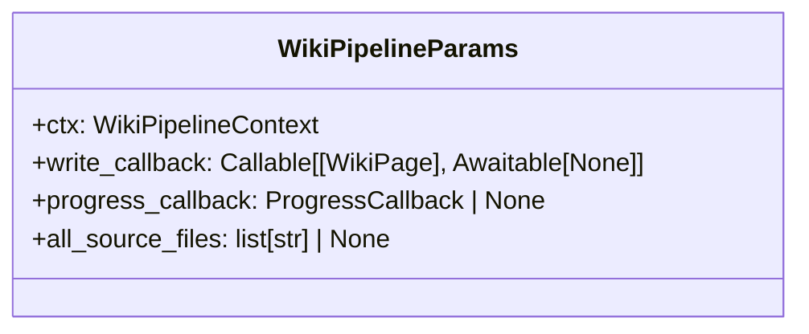

# File: `src/local_deepwiki/generators/wiki/pipeline_params.py`

## File Overview

This file defines the `WikiPipelineParams` class, which serves as an immutable parameter bundle for wiki generation phases. It groups together commonly used parameters that are passed through various pipeline functions, reducing the number of individual arguments and improving code maintainability.

The purpose of this file is to encapsulate the shared mutable session parameters—such as callbacks and source file lists—alongside the immutable core context ([`WikiPipelineContext`](context.md)). This design promotes cleaner function signatures and reduces the risk of parameter drift or inconsistency across pipeline phases.

## Key Concepts

### Parameter Bundling Pattern

The core abstraction in this file is the use of a **parameter bundling pattern**, where multiple related parameters are wrapped into a single dataclass. This approach addresses the "long parameter list" code smell by consolidating parameters that are consistently used together.

Why this was chosen:
- Reduces cognitive load on developers by simplifying function signatures.
- Improves modularity and testability by encapsulating related dependencies.
- Facilitates easier refactoring and extension of pipeline parameters without modifying multiple function signatures.

### Immutable Core with Mutable Session Parameters

The `WikiPipelineParams` class combines:
1. An immutable `ctx` field of type [`WikiPipelineContext`](context.md), which holds core pipeline state (e.g., index status, vector store, LLM configuration).
2. Mutable session parameters like `write_callback`, [`progress_callback`](../../handlers/research.md), and `all_source_files`.

This design separates concerns:
- The core pipeline state remains unchanged across phases.
- Session-specific behavior (callbacks, source tracking) can vary per execution without affecting the immutable context.

## Integration

This file integrates deeply with the wiki generation pipeline:

- **Used by**: The `WikiPipelineParams` class is consumed by several modules in the pipeline, including `__init__`, `phases`, `pipeline`, and potentially others.
- **Imports**: It imports [`WikiPipelineContext`](context.md), [`ProgressCallback`](../../models/foundation.md), and [`WikiPage`](../../export/streaming.md) from the local codebase, indicating tight coupling with core pipeline components.
- **Related Files**: It's part of a family of files that support wiki generation, such as `phases.py`, `postprocessing.py`, and `plugin_runner.py`, where long parameter lists were previously problematic.

By centralizing parameter passing into `WikiPipelineParams`, this module helps reduce complexity in other parts of the codebase, especially in files that perform post-processing or auxiliary generation tasks.

## Design Notes

### Why `dataclass`?

Using `@dataclass` provides:
- Automatic generation of `__init__`, `__repr__`, and comparison methods.
- Clear and concise definition of parameters with type hints.
- Compatibility with Python’s typing system and IDE support.

### Optional Fields

Fields like [`progress_callback`](../../handlers/research.md) and `all_source_files` are optional (`| None = None`). This design choice allows:
- Flexibility in pipeline execution, where some phases may not require progress reporting or source file tracking.
- Backward compatibility with older code that doesn't provide these values.

### Async-Aware Callbacks

The `write_callback` is typed as `Callable[[WikiPage], Awaitable[None]]`, indicating it is an asynchronous function. This reflects the need for I/O operations during page writing, and aligns with the async nature of the overall pipeline.

### Type Hinting and `TYPE_CHECKING`

The import of `TYPE_CHECKING` suggests that this module may be used in type-checking contexts but not at runtime, possibly to avoid circular imports or to defer certain type resolution until necessary.

## API Reference

### class `WikiPipelineParams`

Immutable parameter bundle for wiki generation phases.  Wraps a :class:[`WikiPipelineContext`](context.md) (core immutable state) with the mutable-session parameters that many phase functions need:  * ``write_callback`` -- async function to persist a page to disk * `[`progress_callback`](../../handlers/research.md)` -- optional progress reporter * ``all_source_files`` -- list of all indexed source file paths  This allows phase functions to accept a single ``params`` argument instead of 7-10 individual parameters.


<details>
<summary>View Source (lines 24-48) | <a href="https://github.com/UrbanDiver/local-deepwiki-mcp/blob/main/src/local_deepwiki/generators/wiki/pipeline_params.py#L24-L48">GitHub</a></summary>

```python
class WikiPipelineParams:
    """Immutable parameter bundle for wiki generation phases.

    Wraps a :class:`WikiPipelineContext` (core immutable state) with the
    mutable-session parameters that many phase functions need:

    * ``write_callback`` -- async function to persist a page to disk
    * ``progress_callback`` -- optional progress reporter
    * ``all_source_files`` -- list of all indexed source file paths

    This allows phase functions to accept a single ``params`` argument
    instead of 7-10 individual parameters.
    """

    ctx: WikiPipelineContext
    """Core immutable pipeline context (index_status, vector_store, llm, etc.)."""

    write_callback: Callable[[WikiPage], Awaitable[None]]
    """Async callback to persist a WikiPage to disk."""

    progress_callback: ProgressCallback | None = None
    """Optional progress reporter callback."""

    all_source_files: list[str] | None = None
    """List of all indexed source file paths (used for status tracking)."""
```

</details>

## Class Diagram



## Last Modified

| Entity | Type | Author | Date | Commit |
|--------|------|--------|------|--------|
| `WikiPipelineParams` | class | Brian Breidenbach | yesterday | `f69b56c` refactor: introduce WikiPip... |

## Relevant Source Files

- `src/local_deepwiki/generators/wiki/pipeline_params.py:24-48`
