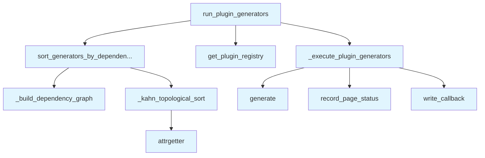

# File: `src/local_deepwiki/generators/wiki/plugin_runner.py`

## File Overview

This file orchestrates the execution of registered wiki generator plugins. It is responsible for sorting plugins according to their dependencies and running them in the correct order. The module uses topological sorting to ensure that plugins which depend on others (via the `run_after` attribute) are executed in the proper sequence.

The design allows for flexible plugin registration and execution, supporting both ordered and parallel plugin execution where dependencies are respected.

## Key Concepts

### Topological Sorting with Kahn's Algorithm

The core of the plugin execution logic is based on Kahn's algorithm for topological sorting. This ensures that plugins are executed in an order that respects their dependencies. The algorithm builds two mappings:
- `in_degree`: Tracks how many dependencies each plugin has.
- `dependents`: Maps each plugin to the list of plugins that depend on it.

This approach is chosen for its clarity and effectiveness in handling complex dependency graphs while detecting circular dependencies.

### Plugin Context Isolation

Each plugin is provided with a shared context (`plugin_context`) that includes:
- Vector store
- LLM instance
- Configuration
- Existing pages

This allows plugins to access common resources and share state, while maintaining clean separation of concerns.

### Error Handling and Plugin Isolation

If a plugin fails during execution, the error is logged but does not stop the entire pipeline. This isolation ensures that one failing plugin doesn't prevent others from running, improving robustness.

## Integration

This file integrates with the broader `local_deepwiki` codebase by:

- Using `get_plugin_registry()` to fetch registered wiki generator plugins.
- Leveraging [`WikiPipelineParams`](pipeline_params.md) to pass pipeline context and callbacks.
- Working with [`WikiPage`](../../export/streaming.md) models to manage and update the list of generated pages.
- Logging via `get_logger()` for debugging and informational messages.

The `run_plugin_generators` function is the main entry point for plugin execution, called from the pipeline logic. The dependency sorting and execution functions are internal helpers used to ensure correct plugin ordering and execution.

Related files include:
- `src/local_deepwiki/cli/main.py` — likely calls `run_plugin_generators` during the pipeline execution.
- `src/local_deepwiki/plugins/registry.py` — provides access to registered plugins.
- `src/local_deepwiki/generators/analysis/` — contains concrete implementations of [`WikiGeneratorPlugin`](../../plugins/base.md) that are run by this module.

## Design Notes

### Dependency Resolution and Validation

The `sort_generators_by_dependencies` function validates that all dependencies listed in `run_after` are registered. It warns about missing dependencies but does not fail the process, allowing partial execution if some plugins are not available.

### Circular Dependency Detection

The function also detects circular dependencies by comparing the number of sorted generators with the input. If they differ, it logs an error indicating unresolved dependencies, ensuring that the system does not silently fail due to circular logic.

### Priority-Based Insertion

In `_kahn_topological_sort`, plugins with higher priority are inserted earlier in the ready queue, ensuring that priority is respected even when inserting dependent plugins. This maintains both dependency and priority order.

### Asynchronous Execution

All plugin execution is done asynchronously, which is critical for performance in scenarios involving I/O or LLM calls. The `_execute_plugin_generators` function awaits each generator's `generate()` method, allowing for non-blocking execution and better resource utilization.

### Mutable Page Tracking

Each plugin's output is appended to `new_pages`, and `plugin_context["existing_pages"]` is updated to reflect the latest state. This ensures that subsequent plugins have access to pages generated by earlier ones, enabling inter-plugin dependencies and data accumulation.

## API Reference

### Functions

#### `sort_generators_by_dependencies`

```python
def sort_generators_by_dependencies(generators: list[WikiGeneratorPlugin]) -> list[WikiGeneratorPlugin]
```

Sort generators respecting run_after dependencies with validation.  Uses topological sort to ensure generators run after their dependencies. Validates that all dependencies exist and warns about missing ones.


| Parameter | Type | Default | Description |
|-----------|------|---------|-------------|
| `generators` | `list[WikiGeneratorPlugin]` | - | List of generator plugins to sort. |

**Returns:** `list[WikiGeneratorPlugin]`


<details>
<summary>View Source (lines 68-114) | <a href="https://github.com/UrbanDiver/local-deepwiki-mcp/blob/main/src/local_deepwiki/generators/wiki/plugin_runner.py#L68-L114">GitHub</a></summary>

```python
def sort_generators_by_dependencies(
    generators: list[WikiGeneratorPlugin],
) -> list[WikiGeneratorPlugin]:
    """Sort generators respecting run_after dependencies with validation.

    Uses topological sort to ensure generators run after their dependencies.
    Validates that all dependencies exist and warns about missing ones.

    Args:
        generators: List of generator plugins to sort.

    Returns:
        Sorted list of generators respecting dependencies.
    """
    if not generators:
        return generators

    by_name: dict[str, WikiGeneratorPlugin] = {g.generator_name: g for g in generators}
    available_names = set(by_name.keys())

    # Warn about missing dependencies
    for generator in generators:
        missing_deps = set(generator.run_after) - available_names
        if missing_deps:
            logger.debug(
                "Wiki generator '%s' has missing dependencies: %s. "
                "These generators are not registered and will be skipped.",
                generator.generator_name,
                missing_deps,
            )

    in_degree, dependents = _build_dependency_graph(generators, available_names)
    sorted_generators = _kahn_topological_sort(
        generators, by_name, in_degree, dependents
    )

    if len(sorted_generators) != len(generators):
        unresolved = [
            g.generator_name for g in generators if g not in sorted_generators
        ]
        logger.error(
            "Circular dependency detected in wiki generators: %s. "
            "These generators will not run.",
            unresolved,
        )

    return sorted_generators
```

</details>

#### `run_plugin_generators`

```python
async def run_plugin_generators(params: WikiPipelineParams, pages: list[WikiPage]) -> tuple[list[WikiPage], int]
```

Run registered wiki generator plugins.


| Parameter | Type | Default | Description |
|-----------|------|---------|-------------|
| `params` | `WikiPipelineParams` | - | Pipeline parameter bundle with context, callbacks, and source files. |
| `pages` | `list[WikiPage]` | - | Current list of wiki pages (will not be mutated). |

**Returns:** `tuple[list[WikiPage], int]`


<details>
<summary>View Source (lines 117-156) | <a href="https://github.com/UrbanDiver/local-deepwiki-mcp/blob/main/src/local_deepwiki/generators/wiki/plugin_runner.py#L117-L156">GitHub</a></summary>

```python
async def run_plugin_generators(
    *,
    params: WikiPipelineParams,
    pages: list[WikiPage],
) -> tuple[list[WikiPage], int]:
    """Run registered wiki generator plugins.

    Args:
        params: Pipeline parameter bundle with context, callbacks, and source files.
        pages: Current list of wiki pages (will not be mutated).

    Returns:
        Tuple of (new_pages, pages_generated_count).
    """
    registry = get_plugin_registry()
    generators: list[WikiGeneratorPlugin] = list(registry.wiki_generators.values())

    if not generators:
        return [], 0

    # Validate and sort generators respecting run_after dependencies
    generators = sort_generators_by_dependencies(generators)

    logger.info("Running %s wiki generator plugin(s)", len(generators))

    # Build context dict for plugins
    plugin_context: dict[str, object] = {
        "vector_store": params.ctx.vector_store,
        "llm": params.ctx.llm,
        "config": params.ctx.config,
        "existing_pages": list(pages),
    }

    new_pages, pages_generated = await _execute_plugin_generators(
        generators=generators,
        pages=pages,
        params=params,
        plugin_context=plugin_context,
    )
    return new_pages, pages_generated
```

</details>

## Call Graph



## Used By

Functions and methods in this file and their callers:

- **`_build_dependency_graph`**: called by `sort_generators_by_dependencies`
- **`_execute_plugin_generators`**: called by `run_plugin_generators`
- **`_kahn_topological_sort`**: called by `sort_generators_by_dependencies`
- **`attrgetter`**: called by `_kahn_topological_sort`
- **`generate`**: called by `_execute_plugin_generators`
- **[`get_plugin_registry`](../../plugins/registry.md)**: called by `run_plugin_generators`
- **`record_page_status`**: called by `_execute_plugin_generators`
- **`sort_generators_by_dependencies`**: called by `run_plugin_generators`
- **`write_callback`**: called by `_execute_plugin_generators`

## Last Modified

| Entity | Type | Author | Date | Commit |
|--------|------|--------|------|--------|
| `run_plugin_generators` | function | Brian Breidenbach | yesterday | `f69b56c` refactor: introduce WikiPip... |
| `_execute_plugin_generators` | function | Brian Breidenbach | yesterday | `f69b56c` refactor: introduce WikiPip... |
| `_build_dependency_graph` | function | Brian Breidenbach | yesterday | `29ae780` refactor: decompose long me... |
| `_kahn_topological_sort` | function | Brian Breidenbach | yesterday | `29ae780` refactor: decompose long me... |
| `sort_generators_by_dependencies` | function | Brian Breidenbach | yesterday | `29ae780` refactor: decompose long me... |

## Additional Source Code

Source code for functions and methods not listed in the API Reference above.

#### `_build_dependency_graph`

<details>
<summary>View Source (lines 23-35) | <a href="https://github.com/UrbanDiver/local-deepwiki-mcp/blob/main/src/local_deepwiki/generators/wiki/plugin_runner.py#L23-L35">GitHub</a></summary>

```python
def _build_dependency_graph(
    generators: list[WikiGeneratorPlugin],
    available_names: set[str],
) -> tuple[dict[str, int], dict[str, list[str]]]:
    """Build in-degree and dependents mappings for Kahn's topological sort."""
    in_degree: dict[str, int] = {g.generator_name: 0 for g in generators}
    dependents: dict[str, list[str]] = {g.generator_name: [] for g in generators}
    for generator in generators:
        for dep in generator.run_after:
            if dep in available_names:
                in_degree[generator.generator_name] += 1
                dependents[dep].append(generator.generator_name)
    return in_degree, dependents
```

</details>


#### `_kahn_topological_sort`

<details>
<summary>View Source (lines 38-65) | <a href="https://github.com/UrbanDiver/local-deepwiki-mcp/blob/main/src/local_deepwiki/generators/wiki/plugin_runner.py#L38-L65">GitHub</a></summary>

```python
def _kahn_topological_sort(
    generators: list[WikiGeneratorPlugin],
    by_name: dict[str, WikiGeneratorPlugin],
    in_degree: dict[str, int],
    dependents: dict[str, list[str]],
) -> list[WikiGeneratorPlugin]:
    """Run Kahn's algorithm to produce a priority-respecting topological ordering."""
    ready = sorted(
        [g for g in generators if in_degree[g.generator_name] == 0],
        key=attrgetter("priority"),
        reverse=True,
    )
    sorted_generators: list[WikiGeneratorPlugin] = []
    while ready:
        current = ready.pop(0)
        sorted_generators.append(current)
        for dep_name in dependents[current.generator_name]:
            in_degree[dep_name] -= 1
            if in_degree[dep_name] == 0:
                dep_gen = by_name[dep_name]
                insert_idx = 0
                for i, g in enumerate(ready):
                    if dep_gen.priority > g.priority:
                        insert_idx = i
                        break
                    insert_idx = i + 1
                ready.insert(insert_idx, dep_gen)
    return sorted_generators
```

</details>


#### `_execute_plugin_generators`

<details>
<summary>View Source (lines 159-196) | <a href="https://github.com/UrbanDiver/local-deepwiki-mcp/blob/main/src/local_deepwiki/generators/wiki/plugin_runner.py#L159-L196">GitHub</a></summary>

```python
async def _execute_plugin_generators(
    *,
    generators: list[WikiGeneratorPlugin],
    pages: list[WikiPage],
    params: WikiPipelineParams,
    plugin_context: dict[str, object],
) -> tuple[list[WikiPage], int]:
    """Execute each plugin generator in order, collecting generated pages."""
    new_pages: list[WikiPage] = []
    pages_generated = 0
    all_source_files = params.all_source_files or []

    for generator in generators:
        try:
            logger.debug("Running wiki generator plugin: %s", generator.generator_name)
            result = await generator.generate(
                index_status=params.ctx.index_status,
                wiki_path=params.ctx.wiki_path,
                context=plugin_context,
            )
            for page in result.pages:
                new_pages.append(page)
                params.ctx.status_manager.record_page_status(page, all_source_files)
                await params.write_callback(page)
                pages_generated += 1
            # Update existing_pages in context for subsequent plugins
            plugin_context["existing_pages"] = list(pages) + list(new_pages)
            logger.debug(
                "Plugin '%s' generated %d page(s)",
                generator.generator_name,
                len(result.pages),
            )
        except Exception as e:  # noqa: BLE001 — plugin isolation
            logger.debug(
                "Wiki generator plugin '%s' failed: %s", generator.generator_name, e
            )

    return new_pages, pages_generated
```

</details>

## Relevant Source Files

- `src/local_deepwiki/generators/wiki/plugin_runner.py:23-35`
