# File: `src/local_deepwiki/generators/wiki/postprocessing.py`

## File Overview

This file implements the final stages of the wiki generation pipeline, focusing on post-processing steps that enhance the quality, discoverability, and maintainability of generated wiki content. It orchestrates tasks such as cross-linking, search index generation, table of contents creation, and status tracking.

The module is designed to be used as part of a larger wiki generation pipeline and integrates with various components including entity registries, vector stores, and status managers to ensure consistency and completeness in the final output.

## Key Concepts

### Cross-Linking and Semantic Enhancements
Cross-linking, source references, and "See Also" sections are applied to improve content connectivity and user navigation. These features are essential for creating a knowledge graph-like structure within the wiki.

- **[Entity Registry](../crosslinks.md)**: Used to identify and link entities across pages.
- **[Relationship Analyzer](../see_also.md)**: Determines semantic relationships for "See Also" sections.
- **Term Corrections**: Applied before cross-linking to ensure consistent naming.

### Search Index and Table of Contents
The module generates a full-text search index using a vector store and creates a hierarchical table of contents for better navigation.

- **[Vector Store](../../core/vectorstore/store.md) Integration**: Enables semantic search capabilities.
- **TOC Generation**: Uses a hierarchical numbering system for clear structure.

### Codemap Pages
Support for auto-discovered entry points through codemap pages. This feature is conditionally enabled via configuration.

### Wiki Status Management
The finalization step includes building a status object that tracks generation metadata and saving it to disk.

### Freshness Reporting
A freshness report is generated to indicate how recently each page was updated, helping maintain up-to-date documentation.

## Integration

This file is called from the main wiki generation pipeline by several key functions:

- `generate_codemap_pages_phase`: Handles optional codemap generation.
- `apply_cross_linking`: Applies semantic enhancements to pages.
- `generate_search_and_toc`: Builds search index and TOC.
- `build_wiki_status`: Constructs the final status object.
- `generate_freshness_and_finalize`: Finalizes the wiki with a freshness report.

It imports from core components like:
- [`WikiPipelineContext`](context.md) and [`WikiPipelineParams`](pipeline_params.md) for shared pipeline state and parameters.
- [`add_cross_links`](../crosslinks.md), [`add_see_also_sections`](../see_also.md), [`add_source_refs_sections`](../source_refs.md) for content enhancement.
- [`write_full_search_index`](../search.md) and [`generate_toc`](../toc.md) for index and TOC generation.
- [`generate_stale_report_page`](../analysis/stale_detection.md) for freshness reporting.
- [`VectorStore`](../../core/vectorstore/store.md) and [`EntityRegistry`](../crosslinks.md) for advanced features like semantic search and entity resolution.

These integrations allow the postprocessing module to act as a bridge between the core generation logic and the final output, ensuring that all generated content is properly linked, indexed, and tracked.

## Design Notes

### Conditional Feature Support
Codemap generation is only enabled if explicitly configured, allowing for flexible pipeline behavior without unnecessary overhead.

### Incremental Writing
Pages are only re-written to disk if their content has changed after processing. This optimization reduces I/O and avoids redundant updates.

### Progress Tracking
Progress callbacks are used throughout the pipeline to provide feedback during long-running operations, improving user experience and debugging.

### Error Handling
The [`generate_llms_txt`](../llms_txt.md) and [`generate_llms_full_txt`](../llms_txt.md) generation is wrapped in a try-except block to prevent failures in one part from halting the entire process.

### Hash-Based Change Detection
Content hashes are used to detect changes in pages before writing them back to disk. This ensures that only modified content is rewritten, optimizing performance.

### Status Management
Wiki status is built and updated incrementally, including the freshness report, to provide a complete picture of the generation process and output quality.

## API Reference

### Functions

#### `generate_codemap_pages_phase`

```python
async def generate_codemap_pages_phase(ctx: WikiPipelineContext, pages: list[WikiPage], pages_generated: int, pages_skipped: int, progress: "GenerationProgress", params: WikiPipelineParams) -> tuple[list[WikiPage], int, int]
```

Generate codemap pages for auto-discovered entry points.


| Parameter | Type | Default | Description |
|-----------|------|---------|-------------|
| `ctx` | `WikiPipelineContext` | - | Immutable pipeline context bundling shared parameters. |
| `pages` | `list[WikiPage]` | - | Current list of wiki pages (will not be mutated). |
| `pages_generated` | `int` | - | Running count of generated pages. |
| `pages_skipped` | `int` | - | Running count of skipped pages. |
| `progress` | `"GenerationProgress"` | - | Generation progress tracker. |
| `params` | `WikiPipelineParams` | - | Pipeline parameter bundle with write callback and progress callback. |

**Returns:** `tuple[list[WikiPage], int, int]`


<details>
<summary>View Source (lines 43-84) | <a href="https://github.com/UrbanDiver/local-deepwiki-mcp/blob/main/src/local_deepwiki/generators/wiki/postprocessing.py#L43-L84">GitHub</a></summary>

```python
async def generate_codemap_pages_phase(
    *,
    ctx: WikiPipelineContext,
    pages: list[WikiPage],
    pages_generated: int,
    pages_skipped: int,
    progress: "GenerationProgress",
    params: WikiPipelineParams,
) -> tuple[list[WikiPage], int, int]:
    """Generate codemap pages for auto-discovered entry points.

    Args:
        ctx: Immutable pipeline context bundling shared parameters.
        pages: Current list of wiki pages (will not be mutated).
        pages_generated: Running count of generated pages.
        pages_skipped: Running count of skipped pages.
        progress: Generation progress tracker.
        params: Pipeline parameter bundle with write callback and progress callback.

    Returns:
        Tuple of (new_codemap_pages, new_pages_generated, new_pages_skipped).
    """
    codemap_enabled = getattr(ctx.wiki_config, "codemap_enabled", None)
    if not isinstance(codemap_enabled, bool) or not codemap_enabled:
        return [], pages_generated, pages_skipped

    if params.progress_callback:
        params.progress_callback("Generating codemaps", 10, 14)

    progress.start_phase("codemaps", total=0)

    codemap_pages, gen_count, skip_count = await generate_codemap_pages(ctx)
    pages_generated += gen_count
    pages_skipped += skip_count

    progress._phase_stats["codemaps"].items_completed = len(codemap_pages)
    progress.complete_phase()

    for page in codemap_pages:
        await params.write_callback(page)

    return codemap_pages, pages_generated, pages_skipped
```

</details>

#### `apply_cross_linking`

```python
async def apply_cross_linking(pages: list[WikiPage], entity_registry: EntityRegistry, relationship_analyzer: RelationshipAnalyzer, params: WikiPipelineParams) -> list[WikiPage]
```

Apply cross-links, source refs, and see-also sections to pages.


| Parameter | Type | Default | Description |
|-----------|------|---------|-------------|
| `pages` | `list[WikiPage]` | - | List of wiki pages to process. |
| `entity_registry` | `EntityRegistry` | - | Entity registry for cross-linking. |
| `relationship_analyzer` | `RelationshipAnalyzer` | - | Analyzer for see-also sections. |
| `params` | `WikiPipelineParams` | - | Pipeline parameter bundle with status manager, wiki path, write callback, and progress callback. |

**Returns:** `list[WikiPage]`


<details>
<summary>View Source (lines 87-153) | <a href="https://github.com/UrbanDiver/local-deepwiki-mcp/blob/main/src/local_deepwiki/generators/wiki/postprocessing.py#L87-L153">GitHub</a></summary>

```python
async def apply_cross_linking(
    *,
    pages: list[WikiPage],
    entity_registry: EntityRegistry,
    relationship_analyzer: RelationshipAnalyzer,
    params: WikiPipelineParams,
) -> list[WikiPage]:
    """Apply cross-links, source refs, and see-also sections to pages.

    Args:
        pages: List of wiki pages to process.
        entity_registry: Entity registry for cross-linking.
        relationship_analyzer: Analyzer for see-also sections.
        params: Pipeline parameter bundle with status manager, wiki path,
            write callback, and progress callback.

    Returns:
        Updated list of pages with cross-linking applied.
    """
    progress_callback = params.progress_callback
    status_manager = params.ctx.status_manager
    wiki_path = params.ctx.wiki_path

    if progress_callback:
        progress_callback("Adding cross-links", 10, 14)

    # Apply term corrections before cross-linking so entity names are consistent
    pages = [
        WikiPage(
            path=page.path,
            title=page.title,
            content=apply_term_corrections(page.content),
            generated_at=page.generated_at,
        )
        for page in pages
    ]

    # Snapshot content hashes before cross-linking to detect changes
    original_hashes = {
        page.path: hashlib.sha256(page.content.encode()).digest() for page in pages
    }

    pages = add_cross_links(pages, entity_registry)

    # Add Relevant Source Files sections with local wiki links
    pages = add_source_refs_sections(pages, status_manager.page_statuses, wiki_path)

    if progress_callback:
        progress_callback("Adding See Also sections", 11, 14)

    pages = add_see_also_sections(pages, relationship_analyzer)

    # Re-write only pages whose content actually changed
    pages_rewritten = 0
    for page in pages:
        new_hash = hashlib.sha256(page.content.encode()).digest()
        if new_hash != original_hashes.get(page.path):
            await params.write_callback(page)
            pages_rewritten += 1

    logger.debug(
        "Cross-linking: %d/%d pages rewritten (rest unchanged)",
        pages_rewritten,
        len(pages),
    )

    return pages
```

</details>

#### `generate_search_and_toc`

```python
async def generate_search_and_toc(pages: list[WikiPage], index_status: IndexStatus, vector_store: VectorStore, wiki_path: Path, progress_callback: ProgressCallback | None) -> None
```

Generate search index and table of contents.


| Parameter | Type | Default | Description |
|-----------|------|---------|-------------|
| `pages` | `list[WikiPage]` | - | List of wiki pages. |
| `index_status` | `IndexStatus` | - | Index status. |
| `vector_store` | `VectorStore` | - | Vector store. |
| `wiki_path` | `Path` | - | Path to wiki output directory. |
| `progress_callback` | `ProgressCallback | None` | - | Optional progress callback. |

**Returns:** `None`


<details>
<summary>View Source (lines 156-193) | <a href="https://github.com/UrbanDiver/local-deepwiki-mcp/blob/main/src/local_deepwiki/generators/wiki/postprocessing.py#L156-L193">GitHub</a></summary>

```python
async def generate_search_and_toc(
    *,
    pages: list[WikiPage],
    index_status: IndexStatus,
    vector_store: VectorStore,
    wiki_path: Path,
    progress_callback: ProgressCallback | None,
) -> None:
    """Generate search index and table of contents.

    Args:
        pages: List of wiki pages.
        index_status: Index status.
        vector_store: Vector store.
        wiki_path: Path to wiki output directory.
        progress_callback: Optional progress callback.
    """
    if progress_callback:
        progress_callback("Generating search index", 12, 14)

    await write_full_search_index(wiki_path, pages, index_status, vector_store)

    # Generate table of contents with hierarchical numbering
    page_list = [{"path": p.path, "title": p.title} for p in pages]
    toc = generate_toc(page_list)
    write_toc(toc, wiki_path)

    # Generate llms.txt and llms-full.txt for LLM-friendly project discovery
    try:
        from local_deepwiki.generators.llms_txt import (
            generate_llms_full_txt,
            generate_llms_txt,
        )

        generate_llms_txt(pages, index_status, wiki_path)
        generate_llms_full_txt(pages, index_status, wiki_path)
    except Exception:  # noqa: BLE001
        logger.warning("Failed to generate llms.txt / llms-full.txt", exc_info=True)
```

</details>

#### `build_wiki_status`

```python
def build_wiki_status(pages: list[WikiPage], index_status: IndexStatus, page_statuses: dict) -> WikiGenerationStatus
```

Build the wiki generation status object.


| Parameter | Type | Default | Description |
|-----------|------|---------|-------------|
| `pages` | `list[WikiPage]` | - | List of generated wiki pages. |
| `index_status` | `IndexStatus` | - | Index status. |
| `page_statuses` | `dict` | - | Page status dict from the status manager. |

**Returns:** [`WikiGenerationStatus`](../../models/wiki.md)


<details>
<summary>View Source (lines 196-220) | <a href="https://github.com/UrbanDiver/local-deepwiki-mcp/blob/main/src/local_deepwiki/generators/wiki/postprocessing.py#L196-L220">GitHub</a></summary>

```python
def build_wiki_status(
    *,
    pages: list[WikiPage],
    index_status: IndexStatus,
    page_statuses: dict,
) -> WikiGenerationStatus:
    """Build the wiki generation status object.

    Args:
        pages: List of generated wiki pages.
        index_status: Index status.
        page_statuses: Page status dict from the status manager.

    Returns:
        WikiGenerationStatus object.
    """
    return WikiGenerationStatus(
        repo_path=index_status.repo_path,
        generated_at=time.time(),
        total_pages=len(pages),
        index_status_hash=hashlib.sha256(
            json.dumps(index_status.model_dump(), sort_keys=True).encode()
        ).hexdigest()[:16],
        pages=page_statuses,
    )
```

</details>

#### `generate_freshness_and_finalize`

```python
async def generate_freshness_and_finalize(params: WikiPipelineParams, pages: list[WikiPage], pages_generated: int, pages_skipped: int, wiki_status: WikiGenerationStatus) -> tuple[WikiPage, int]
```

Generate freshness report and finalize wiki status.


| Parameter | Type | Default | Description |
|-----------|------|---------|-------------|
| `params` | `WikiPipelineParams` | - | Pipeline parameter bundle with context, callbacks, and source files. |
| `pages` | `list[WikiPage]` | - | Current list of wiki pages (will not be mutated). |
| `pages_generated` | `int` | - | Running count of generated pages. |
| `pages_skipped` | `int` | - | Running count of skipped pages. |
| `wiki_status` | `WikiGenerationStatus` | - | Wiki generation status to update. |

**Returns:** `tuple[WikiPage, int]`


<details>
<summary>View Source (lines 223-276) | <a href="https://github.com/UrbanDiver/local-deepwiki-mcp/blob/main/src/local_deepwiki/generators/wiki/postprocessing.py#L223-L276">GitHub</a></summary>

```python
async def generate_freshness_and_finalize(
    *,
    params: WikiPipelineParams,
    pages: list[WikiPage],
    pages_generated: int,
    pages_skipped: int,
    wiki_status: WikiGenerationStatus,
) -> tuple[WikiPage, int]:
    """Generate freshness report and finalize wiki status.

    Args:
        params: Pipeline parameter bundle with context, callbacks, and source files.
        pages: Current list of wiki pages (will not be mutated).
        pages_generated: Running count of generated pages.
        pages_skipped: Running count of skipped pages.
        wiki_status: Wiki generation status to update.

    Returns:
        Tuple of (freshness_page, updated_pages_generated).
    """
    repo_path = params.ctx.repo_path
    index_status = params.ctx.index_status
    status_manager = params.ctx.status_manager
    all_source_files = params.all_source_files or []

    total_steps = 14

    freshness_page = generate_stale_report_page(
        repo_path=repo_path,
        wiki_status=wiki_status,
        stale_threshold_days=0,
    )
    status_manager.record_summary_page_status(
        freshness_page, all_source_files, index_status
    )
    await params.write_callback(freshness_page)
    pages_generated += 1

    # Update wiki status with freshness page
    wiki_status.pages[freshness_page.path] = status_manager.page_statuses[
        freshness_page.path
    ]
    wiki_status.total_pages = len(pages) + 1

    await status_manager.save_status(wiki_status)

    if params.progress_callback:
        params.progress_callback(
            f"Wiki generation complete ({pages_generated} generated, {pages_skipped} unchanged)",
            total_steps,
            total_steps,
        )

    return freshness_page, pages_generated
```

</details>

## Call Graph

```mermaid
flowchart TD
    N0[WikiGenerationStatus]
    N1[WikiPage]
    N2[add_cross_links]
    N3[add_see_also_sections]
    N4[add_source_refs_sections]
    N5[apply_cross_linking]
    N6[apply_term_corrections]
    N7[build_wiki_status]
    N8[complete_phase]
    N9[digest]
    N10[dumps]
    N11[encode]
    N12[generate_codemap_pages]
    N13[generate_codemap_pages_phase]
    N14[generate_freshness_and_fina...]
    N15[generate_llms_full_txt]
    N16[generate_llms_txt]
    N17[generate_search_and_toc]
    N18[generate_stale_report_page]
    N19[generate_toc]
    N20[hexdigest]
    N21[model_dump]
    N22[progress_callback]
    N23[record_summary_page_status]
    N24[sha256]
    N25[start_phase]
    N26[time]
    N27[write_callback]
    N28[write_full_search_index]
    N29[write_toc]
    N13 --> N22
    N13 --> N25
    N13 --> N12
    N13 --> N8
    N13 --> N27
    N5 --> N22
    N5 --> N1
    N5 --> N6
    N5 --> N9
    N5 --> N24
    N5 --> N11
    N5 --> N2
    N5 --> N4
    N5 --> N3
    N5 --> N27
    N17 --> N22
    N17 --> N28
    N17 --> N19
    N17 --> N29
    N17 --> N16
    N17 --> N15
    N7 --> N0
    N7 --> N26
    N7 --> N20
    N7 --> N24
    N7 --> N11
    N7 --> N10
    N7 --> N21
    N14 --> N18
    N14 --> N23
    N14 --> N27
    N14 --> N22
    classDef func fill:#e1f5fe
    class N0,N1,N2,N3,N4,N5,N6,N7,N8,N9,N10,N11,N12,N13,N14,N15,N16,N17,N18,N19,N20,N21,N22,N23,N24,N25,N26,N27,N28,N29 func
```



## Used By

Functions and methods in this file and their callers:

- **[`WikiGenerationStatus`](../../models/wiki.md)**: called by `build_wiki_status`
- **[`WikiPage`](../../export/streaming.md)**: called by `apply_cross_linking`
- **[`add_cross_links`](../crosslinks.md)**: called by `apply_cross_linking`
- **[`add_see_also_sections`](../see_also.md)**: called by `apply_cross_linking`
- **[`add_source_refs_sections`](../source_refs.md)**: called by `apply_cross_linking`
- **[`apply_term_corrections`](term_validator.md)**: called by `apply_cross_linking`
- **`complete_phase`**: called by `generate_codemap_pages_phase`
- **`digest`**: called by `apply_cross_linking`
- **`dumps`**: called by `build_wiki_status`
- **`encode`**: called by `apply_cross_linking`, `build_wiki_status`
- **[`generate_codemap_pages`](pipeline.md)**: called by `generate_codemap_pages_phase`
- **[`generate_llms_full_txt`](../llms_txt.md)**: called by `generate_search_and_toc`
- **[`generate_llms_txt`](../llms_txt.md)**: called by `generate_search_and_toc`
- **[`generate_stale_report_page`](../analysis/stale_detection.md)**: called by `generate_freshness_and_finalize`
- **[`generate_toc`](../toc.md)**: called by `generate_search_and_toc`
- **`hexdigest`**: called by `build_wiki_status`
- **`model_dump`**: called by `build_wiki_status`
- **[`progress_callback`](../../handlers/research.md)**: called by `apply_cross_linking`, `generate_codemap_pages_phase`, `generate_freshness_and_finalize`, `generate_search_and_toc`
- **`record_summary_page_status`**: called by `generate_freshness_and_finalize`
- **`save_status`**: called by `generate_freshness_and_finalize`
- **`sha256`**: called by `apply_cross_linking`, `build_wiki_status`
- **`start_phase`**: called by `generate_codemap_pages_phase`
- **`time`**: called by `build_wiki_status`
- **`write_callback`**: called by `apply_cross_linking`, `generate_codemap_pages_phase`, `generate_freshness_and_finalize`
- **[`write_full_search_index`](../search.md)**: called by `generate_search_and_toc`
- **[`write_toc`](../toc.md)**: called by `generate_search_and_toc`

## Last Modified

| Entity | Type | Author | Date | Commit |
|--------|------|--------|------|--------|
| `generate_codemap_pages_phase` | function | Brian Breidenbach | yesterday | `f69b56c` refactor: introduce WikiPip... |
| `apply_cross_linking` | function | Brian Breidenbach | yesterday | `f69b56c` refactor: introduce WikiPip... |
| `generate_freshness_and_finalize` | function | Brian Breidenbach | yesterday | `f69b56c` refactor: introduce WikiPip... |
| `generate_search_and_toc` | function | Brian Breidenbach | Feb 14, 2026 | `2732638` feat: agent UX improvements... |
| `build_wiki_status` | function | Brian Breidenbach | Feb 09, 2026 | `99410a9` refactor: split 4 large fil... |

## Relevant Source Files

- `src/local_deepwiki/generators/wiki/postprocessing.py:43-84`
