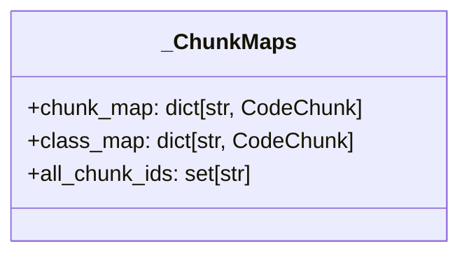
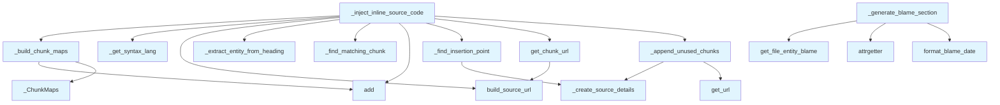

# File: `src/local_deepwiki/generators/wiki/source_formatter.py`

## File Overview

This module provides utilities for formatting and injecting source code into wiki documentation. It is responsible for generating collapsible markdown code blocks that link to source code, prioritizing chunks for documentation, and creating "Last Modified" sections using git blame data. The file integrates with Git repository information to provide links to source code and authorship details.

The module is used by various parts of the documentation generation pipeline to enrich markdown files with inline source code and metadata.

## Key Concepts

### Chunk Mapping and Lookup
The `_ChunkMaps` class is a utility structure used to efficiently look up code chunks by name. This enables quick matching of API reference headings (e.g., function or class names) to their corresponding source code chunks. This pattern is chosen for performance, as it avoids repeated linear scans of the chunk list during injection.

### Source Code Injection Logic
The `_inject_inline_source_code` function orchestrates the process of injecting source code blocks into markdown content. It:
- Builds a mapping of chunks by name and class
- Parses markdown headings to identify entities
- Matches headings to chunks using `_find_matching_chunk`
- Inserts source code blocks using `_find_insertion_point` and `_create_source_details`

This approach allows for precise placement of source code blocks directly after relevant API references, improving documentation readability.

### Prioritization of Documentation Relevance
The `_prioritize_chunks` function implements a priority-based selection of chunks for inclusion in documentation. It ensures that functions and methods (which are most useful for documentation) are prioritized over classes, module summaries, and imports. This maintains a logical flow in documentation while respecting resource constraints.

### Git Blame Integration
The `_generate_blame_section` function leverages git blame data to create a "Last Modified" section in documentation. It retrieves and formats information about the last modification of each documented entity, including author, date, and commit summary. This provides historical context and accountability in the documentation.

## Integration

This module is used by:
- The `extractor` module, which calls `_find_matching_chunk` to match entities in markdown with source code chunks.
- The `files` module, which calls `_generate_blame_section` to enrich documentation with modification history.
- Test modules (`test_wiki_file_enrichment`) that use `_create_source_details`, `_extract_entity_from_heading`, `_inject_inline_source_code`, and `_generate_blame_section` for testing documentation generation.

It imports:
- [`GitRepoInfo`](../../core/git_utils.md) and [`build_source_url`](../../core/git_utils.md) from `local_deepwiki.core.git_utils` to generate GitHub links.
- [`get_file_entity_blame`](../../core/git_blame.md) and [`format_blame_date`](../../core/git_blame.md) from `local_deepwiki.core.git_blame` to fetch and format git blame data.
- [`ChunkType`](../../models/foundation.md) and [`CodeChunk`](../../models/chunks.md) from `local_deepwiki.models` for type safety and chunk handling.

These dependencies enable the module to integrate seamlessly with Git-based source code repositories and the core documentation models.

## Design Notes

### Handling of Qualified Names
When building chunk maps, the code supports both simple names and qualified names (e.g., `ClassName.method_name`). This allows for accurate matching of method calls within class contexts, which is essential for correct documentation generation.

### Flexible Source Code Block Creation
The `_create_source_details` function supports optional GitHub URLs, allowing for flexible linking to source code depending on whether repository information is available. This design choice ensures that the documentation can be generated in both local and online contexts.

### Graceful Degradation
If no blame information is available, `_generate_blame_section` returns `None` instead of raising an error. This allows the documentation pipeline to continue without interruption, falling back to basic content generation.

### Line-by-Line Processing
The `_inject_inline_source_code` function processes markdown content line-by-line, which is efficient and avoids unnecessary string operations. It uses a state machine approach to track class context and insert source code at appropriate points.

### Chunk Usage Tracking
The code tracks which chunks have been used in the documentation to ensure that unused chunks are appended at the end in a dedicated section. This prevents duplication and ensures all source code is accounted for in the final documentation.

## API Reference

### Functions

#### `get_chunk_url`

```python
def get_chunk_url(chunk: CodeChunk) -> str | None
```


| Parameter | Type | Default | Description |
|-----------|------|---------|-------------|
| `chunk` | `CodeChunk` | - | - |

**Returns:** `str | None`


<details>
<summary>View Source (lines 300-305) | <a href="https://github.com/UrbanDiver/local-deepwiki-mcp/blob/main/src/local_deepwiki/generators/wiki/source_formatter.py#L300-L305">GitHub</a></summary>

```python
def get_chunk_url(chunk: CodeChunk) -> str | None:
        if repo_info is None:
            return None
        return build_source_url(
            repo_info, chunk.file_path, chunk.start_line, chunk.end_line
        )
```

</details>

## Class Diagram



## Call Graph



## Used By

Functions and methods in this file and their callers:

- **`_ChunkMaps`**: called by `_build_chunk_maps`
- **`_append_unused_chunks`**: called by `_inject_inline_source_code`
- **`_build_chunk_maps`**: called by `_inject_inline_source_code`
- **`_create_source_details`**: called by `_append_unused_chunks`, `_find_insertion_point`
- **`_extract_entity_from_heading`**: called by `_inject_inline_source_code`
- **`_find_insertion_point`**: called by `_inject_inline_source_code`
- **`_find_matching_chunk`**: called by `_inject_inline_source_code`
- **`_get_syntax_lang`**: called by `_inject_inline_source_code`
- **`add`**: called by `_build_chunk_maps`, `_inject_inline_source_code`
- **`attrgetter`**: called by `_generate_blame_section`
- **[`build_source_url`](../../core/git_utils.md)**: called by `_inject_inline_source_code`, `get_chunk_url`
- **[`format_blame_date`](../../core/git_blame.md)**: called by `_generate_blame_section`
- **`get_chunk_url`**: called by `_inject_inline_source_code`
- **[`get_file_entity_blame`](../../core/git_blame.md)**: called by `_generate_blame_section`
- **`get_url`**: called by `_append_unused_chunks`

## Last Modified

| Entity | Type | Author | Date | Commit |
|--------|------|--------|------|--------|
| `_generate_blame_section` | function | Brian Breidenbach | Feb 21, 2026 | `e45a53a` refactor: apply Pythonic id... |
| `_ChunkMaps` | class | Brian Breidenbach | Feb 21, 2026 | `fecde6f` refactor: split 10 large fi... |
| `_get_syntax_lang` | function | Brian Breidenbach | Feb 21, 2026 | `fecde6f` refactor: split 10 large fi... |
| `_create_source_details` | function | Brian Breidenbach | Feb 21, 2026 | `fecde6f` refactor: split 10 large fi... |
| `_build_chunk_maps` | function | Brian Breidenbach | Feb 21, 2026 | `fecde6f` refactor: split 10 large fi... |
| `_extract_entity_from_heading` | function | Brian Breidenbach | Feb 21, 2026 | `fecde6f` refactor: split 10 large fi... |
| `_find_matching_chunk` | function | Brian Breidenbach | Feb 21, 2026 | `fecde6f` refactor: split 10 large fi... |
| `_find_insertion_point` | function | Brian Breidenbach | Feb 21, 2026 | `fecde6f` refactor: split 10 large fi... |
| `_append_unused_chunks` | function | Brian Breidenbach | Feb 21, 2026 | `fecde6f` refactor: split 10 large fi... |
| `_inject_inline_source_code` | function | Brian Breidenbach | Feb 21, 2026 | `fecde6f` refactor: split 10 large fi... |
| `get_chunk_url` | function | Brian Breidenbach | Feb 21, 2026 | `fecde6f` refactor: split 10 large fi... |
| `_prioritize_chunks` | function | Brian Breidenbach | Feb 21, 2026 | `fecde6f` refactor: split 10 large fi... |

## Additional Source Code

Source code for functions and methods not listed in the API Reference above.

#### `_get_syntax_lang`

<details>
<summary>View Source (lines 18-43) | <a href="https://github.com/UrbanDiver/local-deepwiki-mcp/blob/main/src/local_deepwiki/generators/wiki/source_formatter.py#L18-L43">GitHub</a></summary>

```python
def _get_syntax_lang(language: str | None) -> str:
    """Get syntax highlighting language string.

    Args:
        language: Programming language name.

    Returns:
        Language string for markdown code blocks.
    """
    lang_map = {
        "python": "python",
        "javascript": "javascript",
        "typescript": "typescript",
        "tsx": "tsx",
        "go": "go",
        "rust": "rust",
        "java": "java",
        "c": "c",
        "cpp": "cpp",
        "swift": "swift",
        "ruby": "ruby",
        "php": "php",
        "kotlin": "kotlin",
        "csharp": "csharp",
    }
    return lang_map.get(language or "", "")
```

</details>


#### `_create_source_details`

<details>
<summary>View Source (lines 46-72) | <a href="https://github.com/UrbanDiver/local-deepwiki-mcp/blob/main/src/local_deepwiki/generators/wiki/source_formatter.py#L46-L72">GitHub</a></summary>

```python
def _create_source_details(
    chunk: CodeChunk, syntax_lang: str, github_url: str | None = None
) -> str:
    """Create a collapsible source code block for a chunk.

    Args:
        chunk: The code chunk.
        syntax_lang: Syntax highlighting language.
        github_url: Optional GitHub URL to link to source.

    Returns:
        Markdown details block with source code.
    """
    if github_url:
        summary = f'View Source (lines {chunk.start_line}-{chunk.end_line}) | <a href="{github_url}">GitHub</a>'
    else:
        summary = f"View Source (lines {chunk.start_line}-{chunk.end_line})"

    return f"""<details>
<summary>{summary}</summary>

```{syntax_lang}
{chunk.content}
```

</details>
"""
```

</details>


### `_ChunkMaps`

<details>
<summary>View Source (lines 76-81) | <a href="https://github.com/UrbanDiver/local-deepwiki-mcp/blob/main/src/local_deepwiki/generators/wiki/source_formatter.py#L76-L81">GitHub</a></summary>

```python
class _ChunkMaps:
    """Maps for looking up chunks by name."""

    chunk_map: dict[str, CodeChunk]
    class_map: dict[str, CodeChunk]
    all_chunk_ids: set[str]
```

</details>


#### `_build_chunk_maps`

<details>
<summary>View Source (lines 84-111) | <a href="https://github.com/UrbanDiver/local-deepwiki-mcp/blob/main/src/local_deepwiki/generators/wiki/source_formatter.py#L84-L111">GitHub</a></summary>

```python
def _build_chunk_maps(chunks: list[CodeChunk]) -> _ChunkMaps:
    """Build lookup maps for chunks by name.

    Args:
        chunks: List of code chunks.

    Returns:
        ChunkMaps with name-to-chunk mappings.
    """
    chunk_map: dict[str, CodeChunk] = {}
    class_map: dict[str, CodeChunk] = {}
    all_chunk_ids: set[str] = set()

    for chunk in chunks:
        if chunk.name and chunk.chunk_type in (
            ChunkType.CLASS,
            ChunkType.FUNCTION,
            ChunkType.METHOD,
        ):
            all_chunk_ids.add(chunk.id)
            chunk_map[chunk.name] = chunk
            if chunk.parent_name:
                qualified_name = f"{chunk.parent_name}.{chunk.name}"
                chunk_map[qualified_name] = chunk
            if chunk.chunk_type == ChunkType.CLASS:
                class_map[chunk.name] = chunk

    return _ChunkMaps(chunk_map, class_map, all_chunk_ids)
```

</details>


#### `_extract_entity_from_heading`

<details>
<summary>View Source (lines 114-139) | <a href="https://github.com/UrbanDiver/local-deepwiki-mcp/blob/main/src/local_deepwiki/generators/wiki/source_formatter.py#L114-L139">GitHub</a></summary>

```python
def _extract_entity_from_heading(line: str) -> tuple[str | None, bool]:
    """Extract entity name from a markdown heading.

    Args:
        line: Heading line like "#### `name`" or "### class `name`".

    Returns:
        Tuple of (entity_name, is_class_heading).
    """
    start = line.find("`") + 1
    end = line.find("`", start)
    if start <= 0 or end <= start:
        return None, False

    entity_name = line[start:end]

    # Normalize: strip signature
    if "(" in entity_name:
        entity_name = entity_name.split("(")[0]

    # Check if class heading
    is_class = entity_name.startswith("class ")
    if is_class:
        entity_name = entity_name[6:].strip()

    return entity_name, is_class
```

</details>


#### `_find_matching_chunk`

<details>
<summary>View Source (lines 142-175) | <a href="https://github.com/UrbanDiver/local-deepwiki-mcp/blob/main/src/local_deepwiki/generators/wiki/source_formatter.py#L142-L175">GitHub</a></summary>

```python
def _find_matching_chunk(
    entity_name: str,
    current_class: str | None,
    maps: _ChunkMaps,
) -> CodeChunk | None:
    """Find the chunk that matches an entity name.

    Args:
        entity_name: Name of the entity to find.
        current_class: Current class context, if any.
        maps: Chunk lookup maps.

    Returns:
        Matching chunk or None.
    """
    matched_chunk: CodeChunk | None = None

    # Try qualified name first for methods
    if current_class and entity_name != current_class:
        qualified_name = f"{current_class}.{entity_name}"
        matched_chunk = maps.chunk_map.get(qualified_name)

    # Try simple name
    if matched_chunk is None:
        candidate = maps.chunk_map.get(entity_name)
        if candidate is not None:
            if candidate.parent_name is None or candidate.parent_name == current_class:
                matched_chunk = candidate

    # Fallback to class source for unmatched methods
    if matched_chunk is None and current_class and entity_name != current_class:
        matched_chunk = maps.class_map.get(current_class)

    return matched_chunk
```

</details>


#### `_find_insertion_point`

<details>
<summary>View Source (lines 178-235) | <a href="https://github.com/UrbanDiver/local-deepwiki-mcp/blob/main/src/local_deepwiki/generators/wiki/source_formatter.py#L178-L235">GitHub</a></summary>

```python
def _find_insertion_point(
    lines: list[str],
    start_idx: int,
    result_lines: list[str],
    chunk: CodeChunk,
    syntax_lang: str,
    chunk_url: str | None,
) -> int:
    """Find where to insert source code and add it.

    Args:
        lines: All content lines.
        start_idx: Starting line index.
        result_lines: Result lines to append to.
        chunk: Chunk to insert source for.
        syntax_lang: Syntax highlighting language.
        chunk_url: Optional GitHub URL.

    Returns:
        New line index to continue from.
    """
    j = start_idx
    found_returns = False

    while j < len(lines):
        next_line = lines[j]

        # Stop at next heading of same or higher level
        if next_line.startswith(("#### ", "### ", "## ")):
            if not found_returns:
                result_lines.append("")
                result_lines.append(
                    _create_source_details(chunk, syntax_lang, chunk_url)
                )
            return j - 1

        # Track if we found Returns
        if next_line.startswith("**Returns:**"):
            found_returns = True
            result_lines.append(lines[j])
            j += 1
            # Skip blank lines after Returns
            while j < len(lines) and lines[j].strip() == "":
                result_lines.append(lines[j])
                j += 1
            # Insert source code here
            result_lines.append("")
            result_lines.append(_create_source_details(chunk, syntax_lang, chunk_url))
            return j - 1

        result_lines.append(lines[j])
        j += 1

    # Reached end of file
    if not found_returns:
        result_lines.append("")
        result_lines.append(_create_source_details(chunk, syntax_lang, chunk_url))
    return j - 1
```

</details>


#### `_append_unused_chunks`

<details>
<summary>View Source (lines 238-273) | <a href="https://github.com/UrbanDiver/local-deepwiki-mcp/blob/main/src/local_deepwiki/generators/wiki/source_formatter.py#L238-L273">GitHub</a></summary>

```python
def _append_unused_chunks(
    result_lines: list[str],
    chunks: list[CodeChunk],
    all_chunk_ids: set[str],
    used_chunks: set[str],
    syntax_lang: str,
    get_url: Callable[[CodeChunk], str | None],
) -> None:
    """Append unused chunks as additional source code section.

    Args:
        result_lines: Lines to append to.
        chunks: All chunks.
        all_chunk_ids: Set of all chunk IDs.
        used_chunks: Set of already-used chunk IDs.
        syntax_lang: Syntax highlighting language.
        get_url: Function to get GitHub URL for a chunk.
    """
    unused = [c for c in chunks if c.id in all_chunk_ids and c.id not in used_chunks]
    if not unused:
        return

    result_lines.append("")
    result_lines.append("## Additional Source Code")
    result_lines.append("")
    result_lines.append(
        "Source code for functions and methods not listed in the API Reference above."
    )
    result_lines.append("")

    for chunk in sorted(unused, key=lambda c: c.start_line):
        heading = "###" if chunk.chunk_type == ChunkType.CLASS else "####"
        result_lines.append(f"{heading} `{chunk.name}`")
        result_lines.append("")
        result_lines.append(_create_source_details(chunk, syntax_lang, get_url(chunk)))
        result_lines.append("")
```

</details>


#### `_inject_inline_source_code`

<details>
<summary>View Source (lines 276-352) | <a href="https://github.com/UrbanDiver/local-deepwiki-mcp/blob/main/src/local_deepwiki/generators/wiki/source_formatter.py#L276-L352">GitHub</a></summary>

```python
def _inject_inline_source_code(
    content: str,
    chunks: list[CodeChunk],
    language: str | None,
    repo_info: GitRepoInfo | None = None,
) -> str:
    """Inject collapsible source code after each function/class in the API Reference.

    Args:
        content: The markdown content to process.
        chunks: List of code chunks from the file.
        language: Programming language for syntax highlighting.
        repo_info: Optional git repo info for GitHub links.

    Returns:
        Content with inline source code blocks injected.
    """
    maps = _build_chunk_maps(chunks)
    if not maps.chunk_map:
        return content

    syntax_lang = _get_syntax_lang(language)
    used_chunks: set[str] = set()

    def get_chunk_url(chunk: CodeChunk) -> str | None:
        if repo_info is None:
            return None
        return build_source_url(
            repo_info, chunk.file_path, chunk.start_line, chunk.end_line
        )

    lines = content.split("\n")
    result_lines: list[str] = []
    current_class: str | None = None
    i = 0

    while i < len(lines):
        line = lines[i]
        result_lines.append(line)

        # Track class context
        if line.startswith("### class `"):
            entity, _ = _extract_entity_from_heading(line)
            if entity:
                current_class = entity

        # Look for API Reference headings
        if line.startswith(("#### `", "### `", "### class `")):
            entity_name, is_class = _extract_entity_from_heading(line)
            if entity_name:
                if is_class:
                    current_class = entity_name

                matched_chunk = _find_matching_chunk(entity_name, current_class, maps)
                if matched_chunk is not None:
                    used_chunks.add(matched_chunk.id)
                    i = _find_insertion_point(
                        lines,
                        i + 1,
                        result_lines,
                        matched_chunk,
                        syntax_lang,
                        get_chunk_url(matched_chunk),
                    )

        i += 1

    _append_unused_chunks(
        result_lines,
        chunks,
        maps.all_chunk_ids,
        used_chunks,
        syntax_lang,
        get_chunk_url,
    )

    return "\n".join(result_lines)
```

</details>


#### `_prioritize_chunks`

<details>
<summary>View Source (lines 367-389) | <a href="https://github.com/UrbanDiver/local-deepwiki-mcp/blob/main/src/local_deepwiki/generators/wiki/source_formatter.py#L367-L389">GitHub</a></summary>

```python
def _prioritize_chunks(chunks: list[CodeChunk], max_chunks: int) -> list[CodeChunk]:
    """Select the most documentation-relevant chunks up to a limit.

    Prioritizes functions/methods (most useful for documentation), then
    classes, then module summaries, then imports. Within each priority
    level, chunks retain their original file order.

    Args:
        chunks: All chunks for a file.
        max_chunks: Maximum number of chunks to return.

    Returns:
        Prioritized list of chunks, up to max_chunks.
    """
    if len(chunks) <= max_chunks:
        return chunks

    # Stable sort by priority (preserves file order within each level)
    sorted_chunks = sorted(
        chunks,
        key=lambda c: _CHUNK_TYPE_PRIORITY.get(c.chunk_type, 4),
    )
    return sorted_chunks[:max_chunks]
```

</details>


#### `_generate_blame_section`

<details>
<summary>View Source (lines 392-470) | <a href="https://github.com/UrbanDiver/local-deepwiki-mcp/blob/main/src/local_deepwiki/generators/wiki/source_formatter.py#L392-L470">GitHub</a></summary>

```python
def _generate_blame_section(
    repo_path: Path,
    file_path: str,
    chunks: list[CodeChunk],
) -> str | None:
    """Generate a "Last Modified" section with git blame info.

    Args:
        repo_path: Path to the repository root.
        file_path: Relative path to the source file.
        chunks: Code chunks from the file.

    Returns:
        Markdown section or None if no blame info available.
    """
    # Build entity list for blame lookup
    entities: list[tuple[str, str, int, int]] = []

    for chunk in chunks:
        if chunk.name and chunk.chunk_type in (
            ChunkType.CLASS,
            ChunkType.FUNCTION,
            ChunkType.METHOD,
        ):
            entities.append(
                (
                    chunk.name,
                    chunk.chunk_type.value,
                    chunk.start_line,
                    chunk.end_line,
                )
            )

    if not entities:
        return None

    # Get blame info for all entities
    blame_infos = get_file_entity_blame(repo_path, file_path, entities)

    if not blame_infos:
        return None

    # Sort by most recently modified first
    blame_infos = sorted(
        blame_infos, key=attrgetter("last_modified_date"), reverse=True
    )

    # Build the section
    lines = [
        "## Last Modified",
        "",
        "| Entity | Type | Author | Date | Commit |",
        "|--------|------|--------|------|--------|",
    ]

    for blame in blame_infos:
        entity_name = blame.entity_name
        entity_type = blame.entity_type
        author = blame.last_modified_by
        date_str = format_blame_date(blame.last_modified_date)
        commit_short = blame.commit_hash[:7]

        # Truncate long author names
        if len(author) > 20:
            author = author[:17] + "..."

        # Add commit summary if available (truncated)
        commit_info = f"`{commit_short}`"
        if blame.commit_summary:
            summary = blame.commit_summary
            if len(summary) > 30:
                summary = summary[:27] + "..."
            commit_info = f"`{commit_short}` {summary}"

        lines.append(
            f"| `{entity_name}` | {entity_type} | {author} | {date_str} | {commit_info} |"
        )

    return "\n".join(lines)
```

</details>

## Relevant Source Files

- `src/local_deepwiki/generators/wiki/source_formatter.py:76-81`
