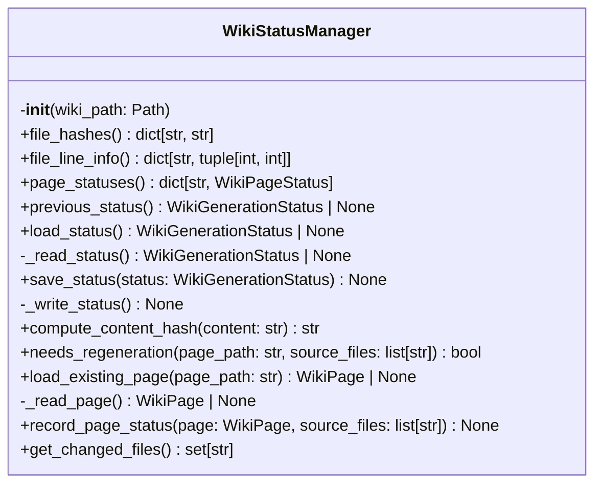

# File: `src/local_deepwiki/generators/wiki/status.py`

## File Overview

This file provides the `WikiStatusManager` class, which is responsible for managing the status of wiki generation processes. It supports incremental updates by tracking file hashes, page statuses, and source file dependencies. The class enables efficient regeneration of only those wiki pages that have been affected by changes in source files, and also handles special cases for summary pages that depend on structural changes rather than content changes.

The `WikiStatusManager` is used in conjunction with the [`WikiGenerationStatus`](../../models/wiki.md) model to store and retrieve information about previous wiki generation runs, including which files were processed, their hashes, and which pages were generated from them.

## Key Concepts

### Incremental Generation
The core concept is enabling incremental wiki generation where only the pages affected by source file changes are regenerated. This is achieved through:
- Tracking file hashes (`_file_hashes`) to detect content changes.
- Storing page statuses (`_page_statuses`) that include source file dependencies and hashes.
- Comparing current vs. previous statuses to determine what needs regeneration.

### Structural Fingerprinting
For summary pages like `index.md` or `architecture.md`, which are not directly tied to individual file content, the system uses structural fingerprinting:
- A fingerprint is computed based on the repository structure (files, languages, totals).
- This allows summary pages to avoid regeneration when only content changes, not structure.

### Asynchronous I/O Handling
File I/O operations (reading and writing status files) are offloaded to threads using `asyncio.to_thread` to avoid blocking the event loop, which is essential for performance in asynchronous environments.

### Hash-based Change Detection
The system uses SHA256 hashes to efficiently detect changes in file content:
- Content hashes are computed using `compute_content_hash`.
- Source file hashes are compared against stored values in previous status to detect changes.

## Integration

### External Usage
This file is used by the `WikiStatusManager` class, which is called from `test_incremental_wiki` (as indicated by the callers list). This implies that the functionality is primarily tested via a test suite focused on incremental wiki generation.

### Related Files
This module integrates with:
- `local_deepwiki.cli.status_cli.py`: Likely uses status information for CLI status reporting.
- `local_deepwiki.cli.main.py`: Possibly involved in status management during main CLI operations.
- `local_deepwiki.core.git_blame.py`: May be used to compute file hashes or line info.

### Dependencies
The module imports:
- `asyncio`, `hashlib`, `json`, `time`, `Path`, `Any` from standard library.
- [`get_logger`](../../logging.md) from `local_deepwiki.logging` for logging.
- [`IndexStatus`](../../models/wiki.md), [`WikiGenerationStatus`](../../models/wiki.md), [`WikiPage`](../../export/streaming.md), [`WikiPageStatus`](../../models/wiki.md) from `local_deepwiki.models`.

These models define the structure of the status data and are essential for serialization and validation of status information.

## Design Notes

### Why Asynchronous File I/O?
File I/O is performed in threads using `asyncio.to_thread` to prevent blocking the main event loop. This is a common pattern in asynchronous applications where I/O operations are expensive and should not block other tasks.

### Handling Missing or Corrupted Status Files
The `load_status` method gracefully handles:
- Missing status files (returns `None`).
- Corrupted or invalid JSON.
- pydantic validation errors.
In all cases, a warning is logged, and the system defaults to a full rebuild.

### Poisoned Hashes
The code guards against "poisoned" empty-string hashes from previous runs by treating them as missing hashes and forcing a regeneration. This prevents stale or corrupted data from causing incorrect decisions.

### Structural vs. Content Changes
Summary pages (e.g., index pages) are handled separately from regular pages:
- Regular pages use per-file content hashes.
- Summary pages use structural fingerprints to determine regeneration needs.
This design allows for efficient regeneration of structural summary pages without rebuilding on every content change.

### Reverse Index for Efficiency
The `build_reverse_index` method pre-computes a mapping from source files to dependent wiki pages. This allows efficient lookup of affected pages when changes are detected, avoiding linear scans through all pages.

### Thread Safety
The class is not explicitly thread-safe, as it's expected to be used within a single-threaded context (e.g., within an async event loop). However, it's designed to be safe for use with `asyncio.to_thread`, which ensures that I/O operations are executed in separate threads.

### File Path Handling
All file paths are handled relative to `wiki_path`, which is the root directory for the wiki output. This ensures consistent behavior across different environments and avoids hardcoding absolute paths.

## API Reference

### class `WikiStatusManager`

Manage wiki generation status for incremental updates.

**Methods:**


<details>
<summary>View Source (lines 23-469) | <a href="https://github.com/UrbanDiver/local-deepwiki-mcp/blob/main/src/local_deepwiki/generators/wiki/status.py#L23-L469">GitHub</a></summary>

```python
class WikiStatusManager:
    # Methods: __init__, file_hashes, file_hashes, file_line_info, file_line_info, page_statuses, previous_status, load_status, _read_status, save_status, _write_status, compute_content_hash, needs_regeneration, load_existing_page, _read_page, record_page_status, get_changed_files, build_reverse_index, get_affected_pages, get_regeneration_summary, compute_structural_fingerprint, needs_regeneration_structural, record_summary_page_status
```

</details>

#### `__init__`

```python
def __init__(wiki_path: Path)
```

Initialize the status manager.


| Parameter | Type | Default | Description |
|-----------|------|---------|-------------|
| `wiki_path` | `Path` | - | Path to wiki output directory. |


<details>
<summary>View Source (lines 28-46) | <a href="https://github.com/UrbanDiver/local-deepwiki-mcp/blob/main/src/local_deepwiki/generators/wiki/status.py#L28-L46">GitHub</a></summary>

```python
def __init__(self, wiki_path: Path):
        """Initialize the status manager.

        Args:
            wiki_path: Path to wiki output directory.
        """
        self.wiki_path = wiki_path

        # Track file hashes from index_status for incremental generation
        self._file_hashes: dict[str, str] = {}

        # Previous wiki generation status for incremental updates
        self._previous_status: WikiGenerationStatus | None = None

        # New page statuses for current generation
        self._page_statuses: dict[str, WikiPageStatus] = {}

        # Line info for source files (computed from chunks)
        self._file_line_info: dict[str, tuple[int, int]] = {}
```

</details>

#### `file_hashes`

```python
def file_hashes() -> dict[str, str]
```

Get file hashes map.


<details>
<summary>View Source (lines 54-56) | <a href="https://github.com/UrbanDiver/local-deepwiki-mcp/blob/main/src/local_deepwiki/generators/wiki/status.py#L54-L56">GitHub</a></summary>

```python
def file_hashes(self, value: dict[str, str]) -> None:
        """Set file hashes map."""
        self._file_hashes = value
```

</details>

#### `file_hashes`

```python
def file_hashes(value: dict[str, str]) -> None
```

Set file hashes map.


| Parameter | Type | Default | Description |
|-----------|------|---------|-------------|
| `value` | `dict[str, str]` | - | - |


<details>
<summary>View Source (lines 54-56) | <a href="https://github.com/UrbanDiver/local-deepwiki-mcp/blob/main/src/local_deepwiki/generators/wiki/status.py#L54-L56">GitHub</a></summary>

```python
def file_hashes(self, value: dict[str, str]) -> None:
        """Set file hashes map."""
        self._file_hashes = value
```

</details>

#### `file_line_info`

```python
def file_line_info() -> dict[str, tuple[int, int]]
```

Get file line info map.


<details>
<summary>View Source (lines 64-66) | <a href="https://github.com/UrbanDiver/local-deepwiki-mcp/blob/main/src/local_deepwiki/generators/wiki/status.py#L64-L66">GitHub</a></summary>

```python
def file_line_info(self, value: dict[str, tuple[int, int]]) -> None:
        """Set file line info map."""
        self._file_line_info = value
```

</details>

#### `file_line_info`

```python
def file_line_info(value: dict[str, tuple[int, int]]) -> None
```

Set file line info map.


| Parameter | Type | Default | Description |
|-----------|------|---------|-------------|
| `value` | `dict[str, tuple[int, int]]` | - | - |


<details>
<summary>View Source (lines 64-66) | <a href="https://github.com/UrbanDiver/local-deepwiki-mcp/blob/main/src/local_deepwiki/generators/wiki/status.py#L64-L66">GitHub</a></summary>

```python
def file_line_info(self, value: dict[str, tuple[int, int]]) -> None:
        """Set file line info map."""
        self._file_line_info = value
```

</details>

#### `page_statuses`

```python
def page_statuses() -> dict[str, WikiPageStatus]
```

Get page statuses map.


<details>
<summary>View Source (lines 69-71) | <a href="https://github.com/UrbanDiver/local-deepwiki-mcp/blob/main/src/local_deepwiki/generators/wiki/status.py#L69-L71">GitHub</a></summary>

```python
def page_statuses(self) -> dict[str, WikiPageStatus]:
        """Get page statuses map."""
        return self._page_statuses
```

</details>

#### `previous_status`

```python
def previous_status() -> WikiGenerationStatus | None
```

Get previous wiki generation status.


<details>
<summary>View Source (lines 74-76) | <a href="https://github.com/UrbanDiver/local-deepwiki-mcp/blob/main/src/local_deepwiki/generators/wiki/status.py#L74-L76">GitHub</a></summary>

```python
def previous_status(self) -> WikiGenerationStatus | None:
        """Get previous wiki generation status."""
        return self._previous_status
```

</details>

#### `load_status`

```python
async def load_status() -> WikiGenerationStatus | None
```

Load previous wiki generation status.


<details>
<summary>View Source (lines 78-101) | <a href="https://github.com/UrbanDiver/local-deepwiki-mcp/blob/main/src/local_deepwiki/generators/wiki/status.py#L78-L101">GitHub</a></summary>

```python
async def load_status(self) -> WikiGenerationStatus | None:
        """Load previous wiki generation status.

        Returns:
            WikiGenerationStatus or None if not found.
        """
        status_path = self.wiki_path / self.WIKI_STATUS_FILE
        if not status_path.exists():
            return None

        def _read_status() -> WikiGenerationStatus | None:
            try:
                with open(status_path) as f:
                    data = json.load(f)
                return WikiGenerationStatus.model_validate(data)
            except (json.JSONDecodeError, OSError, ValueError) as e:
                # json.JSONDecodeError: Corrupted or invalid JSON
                # OSError: File read issues
                # ValueError: Pydantic validation failure
                logger.warning("Failed to load wiki status from %s: %s", status_path, e)
                return None

        self._previous_status = await asyncio.to_thread(_read_status)
        return self._previous_status
```

</details>

#### `save_status`

```python
async def save_status(status: WikiGenerationStatus) -> None
```

Save wiki generation status.


| Parameter | Type | Default | Description |
|-----------|------|---------|-------------|
| `status` | `WikiGenerationStatus` | - | The WikiGenerationStatus to save. |


<details>
<summary>View Source (lines 103-116) | <a href="https://github.com/UrbanDiver/local-deepwiki-mcp/blob/main/src/local_deepwiki/generators/wiki/status.py#L103-L116">GitHub</a></summary>

```python
async def save_status(self, status: WikiGenerationStatus) -> None:
        """Save wiki generation status.

        Args:
            status: The WikiGenerationStatus to save.
        """
        status_path = self.wiki_path / self.WIKI_STATUS_FILE
        data = status.model_dump()

        def _write_status() -> None:
            with open(status_path, "w") as f:
                json.dump(data, f, indent=2)

        await asyncio.to_thread(_write_status)
```

</details>

#### `compute_content_hash`

```python
def compute_content_hash(content: str) -> str
```

Compute hash of page content.


| Parameter | Type | Default | Description |
|-----------|------|---------|-------------|
| `content` | `str` | - | Page content. |


<details>
<summary>View Source (lines 119-128) | <a href="https://github.com/UrbanDiver/local-deepwiki-mcp/blob/main/src/local_deepwiki/generators/wiki/status.py#L119-L128">GitHub</a></summary>

```python
def compute_content_hash(content: str) -> str:
        """Compute hash of page content.

        Args:
            content: Page content.

        Returns:
            SHA256 hash of content (first 16 chars).
        """
        return hashlib.sha256(content.encode()).hexdigest()[:16]
```

</details>

#### `needs_regeneration`

```python
def needs_regeneration(page_path: str, source_files: list[str]) -> bool
```

Check if a page needs regeneration based on source file changes.


| Parameter | Type | Default | Description |
|-----------|------|---------|-------------|
| `page_path` | `str` | - | Wiki page path. |
| `source_files` | `list[str]` | - | List of source files that contribute to this page. |


<details>
<summary>View Source (lines 130-194) | <a href="https://github.com/UrbanDiver/local-deepwiki-mcp/blob/main/src/local_deepwiki/generators/wiki/status.py#L130-L194">GitHub</a></summary>

```python
def needs_regeneration(
        self,
        page_path: str,
        source_files: list[str],
    ) -> bool:
        """Check if a page needs regeneration based on source file changes.

        Args:
            page_path: Wiki page path.
            source_files: List of source files that contribute to this page.

        Returns:
            True if page needs regeneration, False if it can be skipped.
        """
        if self._previous_status is None:
            logger.debug("needs_regeneration(%s): no previous status", page_path)
            return True

        prev_page = self._previous_status.pages.get(page_path)
        if prev_page is None:
            logger.debug("needs_regeneration(%s): new page", page_path)
            return True

        # Check if source files list changed
        if set(source_files) != set(prev_page.source_files):
            added = set(source_files) - set(prev_page.source_files)
            removed = set(prev_page.source_files) - set(source_files)
            logger.debug(
                "needs_regeneration(%s): source files changed +%d -%d",
                page_path,
                len(added),
                len(removed),
            )
            return True

        # Check if any source file has changed
        for source_file in source_files:
            current_hash = self._file_hashes.get(source_file)
            prev_hash = prev_page.source_hashes.get(source_file)

            if current_hash is None:
                logger.debug(
                    "needs_regeneration(%s): no current hash for %s",
                    page_path,
                    source_file,
                )
                return True
            if not prev_hash:
                # Guard against empty-string hash from previous poisoned runs
                logger.debug(
                    "needs_regeneration(%s): empty/missing prev hash for %s",
                    page_path,
                    source_file,
                )
                return True
            if current_hash != prev_hash:
                logger.debug(
                    "needs_regeneration(%s): hash changed for %s",
                    page_path,
                    source_file,
                )
                return True

        logger.debug("needs_regeneration(%s): up to date, skipping", page_path)
        return False
```

</details>

#### `load_existing_page`

```python
async def load_existing_page(page_path: str) -> WikiPage | None
```

Load an existing wiki page from disk.


| Parameter | Type | Default | Description |
|-----------|------|---------|-------------|
| `page_path` | `str` | - | Relative path to the page. |


<details>
<summary>View Source (lines 196-233) | <a href="https://github.com/UrbanDiver/local-deepwiki-mcp/blob/main/src/local_deepwiki/generators/wiki/status.py#L196-L233">GitHub</a></summary>

```python
async def load_existing_page(self, page_path: str) -> WikiPage | None:
        """Load an existing wiki page from disk.

        Args:
            page_path: Relative path to the page.

        Returns:
            WikiPage if found, None otherwise.
        """
        full_path = self.wiki_path / page_path
        if not full_path.exists():
            return None

        # Capture values needed for the sync function
        prev_page = (
            self._previous_status.pages.get(page_path)
            if self._previous_status
            else None
        )
        title = Path(page_path).stem.replace("_", " ").title()
        generated_at = prev_page.generated_at if prev_page else time.time()

        def _read_page() -> WikiPage | None:
            try:
                content = full_path.read_text()
                return WikiPage(
                    path=page_path,
                    title=title,
                    content=content,
                    generated_at=generated_at,
                )
            except (OSError, UnicodeDecodeError) as e:
                # OSError: File read issues
                # UnicodeDecodeError: File encoding issues
                logger.warning("Failed to load existing page %s: %s", page_path, e)
                return None

        return await asyncio.to_thread(_read_page)
```

</details>

#### `record_page_status`

```python
def record_page_status(page: WikiPage, source_files: list[str]) -> None
```

Record status for a generated/loaded page.


| Parameter | Type | Default | Description |
|-----------|------|---------|-------------|
| `page` | `WikiPage` | - | The wiki page. |
| `source_files` | `list[str]` | - | Source files that contributed to this page. |


<details>
<summary>View Source (lines 235-274) | <a href="https://github.com/UrbanDiver/local-deepwiki-mcp/blob/main/src/local_deepwiki/generators/wiki/status.py#L235-L274">GitHub</a></summary>

```python
def record_page_status(
        self,
        page: WikiPage,
        source_files: list[str],
    ) -> None:
        """Record status for a generated/loaded page.

        Args:
            page: The wiki page.
            source_files: Source files that contributed to this page.
        """
        source_hashes = {f: h for f in source_files if (h := self._file_hashes.get(f))}
        if len(source_hashes) < len(source_files):
            missing = [f for f in source_files if f not in source_hashes]
            logger.warning(
                "record_page_status(%s): %d source files have no hash, "
                "omitting to prevent poisoned empty-string hashes: %s",
                page.path,
                len(missing),
                missing[:5],
            )

        # Include line info for source files that have it
        source_line_info = {
            f: {
                "start_line": self._file_line_info[f][0],
                "end_line": self._file_line_info[f][1],
            }
            for f in source_files
            if f in self._file_line_info
        }

        self._page_statuses[page.path] = WikiPageStatus(
            path=page.path,
            source_files=source_files,
            source_hashes=source_hashes,
            source_line_info=source_line_info,
            content_hash=self.compute_content_hash(page.content),
            generated_at=page.generated_at,
        )
```

</details>

#### `get_changed_files`

```python
def get_changed_files() -> set[str]
```

Get set of files that have changed since last generation.  Compares current file hashes with previous generation's hashes.


<details>
<summary>View Source (lines 276-302) | <a href="https://github.com/UrbanDiver/local-deepwiki-mcp/blob/main/src/local_deepwiki/generators/wiki/status.py#L276-L302">GitHub</a></summary>

```python
def get_changed_files(self) -> set[str]:
        """Get set of files that have changed since last generation.

        Compares current file hashes with previous generation's hashes.

        Returns:
            Set of file paths that have changed or are new.
        """
        if self._previous_status is None:
            # No previous status means all files are "new"
            return set(self._file_hashes.keys())

        changed = set()

        # Check each current file against previous hashes
        for file_path, current_hash in self._file_hashes.items():
            # Find any page that previously tracked this file
            prev_hash = None
            for page_status in self._previous_status.pages.values():
                if file_path in page_status.source_hashes:
                    prev_hash = page_status.source_hashes[file_path]
                    break

            if prev_hash is None or prev_hash != current_hash:
                changed.add(file_path)

        return changed
```

</details>

#### `build_reverse_index`

```python
def build_reverse_index() -> dict[str, set[str]]
```

Build reverse index mapping source files to dependent wiki pages.  Uses previous generation's page statuses to build the mapping.


<details>
<summary>View Source (lines 304-323) | <a href="https://github.com/UrbanDiver/local-deepwiki-mcp/blob/main/src/local_deepwiki/generators/wiki/status.py#L304-L323">GitHub</a></summary>

```python
def build_reverse_index(self) -> dict[str, set[str]]:
        """Build reverse index mapping source files to dependent wiki pages.

        Uses previous generation's page statuses to build the mapping.

        Returns:
            Dict mapping source file path to set of wiki page paths that depend on it.
        """
        reverse_index: dict[str, set[str]] = {}

        if self._previous_status is None:
            return reverse_index

        for page_path, page_status in self._previous_status.pages.items():
            for source_file in page_status.source_files:
                if source_file not in reverse_index:
                    reverse_index[source_file] = set()
                reverse_index[source_file].add(page_path)

        return reverse_index
```

</details>

#### `get_affected_pages`

```python
def get_affected_pages(changed_files: set[str] | None = None) -> set[str]
```

Get set of wiki pages affected by file changes.  Uses reverse index to efficiently find all pages that depend on changed files.


| Parameter | Type | Default | Description |
|-----------|------|---------|-------------|
| `changed_files` | `set[str] | None` | `None` | Optional set of changed files. If None, computes automatically. |


<details>
<summary>View Source (lines 325-349) | <a href="https://github.com/UrbanDiver/local-deepwiki-mcp/blob/main/src/local_deepwiki/generators/wiki/status.py#L325-L349">GitHub</a></summary>

```python
def get_affected_pages(self, changed_files: set[str] | None = None) -> set[str]:
        """Get set of wiki pages affected by file changes.

        Uses reverse index to efficiently find all pages that depend on changed files.

        Args:
            changed_files: Optional set of changed files. If None, computes automatically.

        Returns:
            Set of wiki page paths that need regeneration.
        """
        if changed_files is None:
            changed_files = self.get_changed_files()

        if not changed_files:
            return set()

        reverse_index = self.build_reverse_index()
        affected: set[str] = set()

        for file_path in changed_files:
            if file_path in reverse_index:
                affected.update(reverse_index[file_path])

        return affected
```

</details>

#### `get_regeneration_summary`

```python
def get_regeneration_summary() -> dict[str, Any]
```

Get a summary of what will be regenerated and why.


<details>
<summary>View Source (lines 351-372) | <a href="https://github.com/UrbanDiver/local-deepwiki-mcp/blob/main/src/local_deepwiki/generators/wiki/status.py#L351-L372">GitHub</a></summary>

```python
def get_regeneration_summary(self) -> dict[str, Any]:
        """Get a summary of what will be regenerated and why.

        Returns:
            Dict with 'changed_files', 'affected_pages', 'unchanged_pages' counts.
        """
        changed_files = self.get_changed_files()
        affected_pages = self.get_affected_pages(changed_files)

        total_previous_pages = (
            len(self._previous_status.pages) if self._previous_status else 0
        )
        unchanged_pages = total_previous_pages - len(affected_pages)

        return {
            "changed_files": list(changed_files),
            "changed_file_count": len(changed_files),
            "affected_pages": list(affected_pages),
            "affected_page_count": len(affected_pages),
            "unchanged_page_count": max(0, unchanged_pages),
            "is_full_rebuild": self._previous_status is None,
        }
```

</details>

#### `compute_structural_fingerprint`

```python
def compute_structural_fingerprint(index_status: IndexStatus) -> str
```

Compute a structural fingerprint from the index status.  The fingerprint changes when files are added, removed, or renamed, but NOT when file content changes.  This allows summary pages (index.md, architecture.md, etc.) to skip regeneration on content-only edits.


| Parameter | Type | Default | Description |
|-----------|------|---------|-------------|
| `index_status` | `IndexStatus` | - | Current index status. |


<details>
<summary>View Source (lines 375-400) | <a href="https://github.com/UrbanDiver/local-deepwiki-mcp/blob/main/src/local_deepwiki/generators/wiki/status.py#L375-L400">GitHub</a></summary>

```python
def compute_structural_fingerprint(index_status: IndexStatus) -> str:
        """Compute a structural fingerprint from the index status.

        The fingerprint changes when files are added, removed, or renamed,
        but NOT when file content changes.  This allows summary pages
        (index.md, architecture.md, etc.) to skip regeneration on
        content-only edits.

        Args:
            index_status: Current index status.

        Returns:
            SHA-256 hex digest (first 16 chars) of the structural data.
        """
        sorted_paths = sorted(f.path for f in index_status.files)
        sorted_languages = sorted(index_status.languages.items())
        payload = json.dumps(
            {
                "files": sorted_paths,
                "languages": sorted_languages,
                "total_files": index_status.total_files,
                "total_chunks": index_status.total_chunks,
            },
            sort_keys=True,
        )
        return hashlib.sha256(payload.encode()).hexdigest()[:16]
```

</details>

#### `needs_regeneration_structural`

```python
def needs_regeneration_structural(page_path: str, index_status: IndexStatus) -> bool
```

Check if a summary page needs regeneration using structural fingerprint.  Unlike ``needs_regeneration`` which compares per-file content hashes, this only checks whether the repository *structure* has changed (files added/removed/renamed, language distribution, totals).


| Parameter | Type | Default | Description |
|-----------|------|---------|-------------|
| `page_path` | `str` | - | Wiki page path. |
| `index_status` | `IndexStatus` | - | Current index status. |


<details>
<summary>View Source (lines 402-432) | <a href="https://github.com/UrbanDiver/local-deepwiki-mcp/blob/main/src/local_deepwiki/generators/wiki/status.py#L402-L432">GitHub</a></summary>

```python
def needs_regeneration_structural(
        self,
        page_path: str,
        index_status: IndexStatus,
    ) -> bool:
        """Check if a summary page needs regeneration using structural fingerprint.

        Unlike ``needs_regeneration`` which compares per-file content hashes,
        this only checks whether the repository *structure* has changed
        (files added/removed/renamed, language distribution, totals).

        Args:
            page_path: Wiki page path.
            index_status: Current index status.

        Returns:
            True if the page needs regeneration.
        """
        if self._previous_status is None:
            return True

        prev_page = self._previous_status.pages.get(page_path)
        if prev_page is None:
            return True

        # Empty fingerprint means pre-migration data — force one-time rebuild
        if not prev_page.structural_fingerprint:
            return True

        current_fp = self.compute_structural_fingerprint(index_status)
        return current_fp != prev_page.structural_fingerprint
```

</details>

#### `record_summary_page_status`

```python
def record_summary_page_status(page: WikiPage, all_source_files: list[str], index_status: IndexStatus) -> None
```

Record status for a summary page, including the structural fingerprint.  Like ``record_page_status`` but also stores the structural fingerprint so that future incremental runs can use ``needs_regeneration_structural``.


| Parameter | Type | Default | Description |
|-----------|------|---------|-------------|
| `page` | `WikiPage` | - | The wiki page. |
| `all_source_files` | `list[str]` | - | All source files in the repo. |
| `index_status` | `IndexStatus` | - | Current index status for fingerprint computation. |


<details>
<summary>View Source (lines 434-469) | <a href="https://github.com/UrbanDiver/local-deepwiki-mcp/blob/main/src/local_deepwiki/generators/wiki/status.py#L434-L469">GitHub</a></summary>

```python
def record_summary_page_status(
        self,
        page: WikiPage,
        all_source_files: list[str],
        index_status: IndexStatus,
    ) -> None:
        """Record status for a summary page, including the structural fingerprint.

        Like ``record_page_status`` but also stores the structural fingerprint
        so that future incremental runs can use ``needs_regeneration_structural``.

        Args:
            page: The wiki page.
            all_source_files: All source files in the repo.
            index_status: Current index status for fingerprint computation.
        """
        source_hashes = {f: self._file_hashes.get(f, "") for f in all_source_files}

        source_line_info = {
            f: {
                "start_line": self._file_line_info[f][0],
                "end_line": self._file_line_info[f][1],
            }
            for f in all_source_files
            if f in self._file_line_info
        }

        self._page_statuses[page.path] = WikiPageStatus(
            path=page.path,
            source_files=all_source_files,
            source_hashes=source_hashes,
            source_line_info=source_line_info,
            structural_fingerprint=self.compute_structural_fingerprint(index_status),
            content_hash=self.compute_content_hash(page.content),
            generated_at=page.generated_at,
        )
```

</details>

## Class Diagram



## Call Graph

```mermaid
flowchart TD
    N0[Path]
    N1[WikiPage]
    N2[WikiPageStatus]
    N3[WikiStatusManager._read_page]
    N4[WikiStatusManager._read_status]
    N5[WikiStatusManager._write_st...]
    N6[WikiStatusManager.compute_c...]
    N7[WikiStatusManager.compute_s...]
    N8[WikiStatusManager.get_affec...]
    N9[WikiStatusManager.get_regen...]
    N10[WikiStatusManager.load_exis...]
    N11[WikiStatusManager.load_status]
    N12[WikiStatusManager.record_pa...]
    N13[WikiStatusManager.record_su...]
    N14[WikiStatusManager.save_status]
    N15[add]
    N16[compute_content_hash]
    N17[compute_structural_fingerprint]
    N18[dump]
    N19[encode]
    N20[exists]
    N21[get_changed_files]
    N22[hexdigest]
    N23[load]
    N24[model_dump]
    N25[model_validate]
    N26[read_text]
    N27[sha256]
    N28[title]
    N29[to_thread]
    N11 --> N20
    N11 --> N23
    N11 --> N25
    N11 --> N29
    N4 --> N23
    N4 --> N25
    N14 --> N24
    N14 --> N18
    N14 --> N29
    N5 --> N18
    N6 --> N22
    N6 --> N27
    N6 --> N19
    N10 --> N20
    N10 --> N28
    N10 --> N0
    N10 --> N26
    N10 --> N1
    N10 --> N29
    N3 --> N26
    N3 --> N1
    N12 --> N2
    N12 --> N16
    N8 --> N21
    N9 --> N21
    N7 --> N22
    N7 --> N27
    N7 --> N19
    N13 --> N2
    N13 --> N17
    N13 --> N16
    classDef func fill:#e1f5fe
    class N0,N1,N2,N15,N16,N17,N18,N19,N20,N21,N22,N23,N24,N25,N26,N27,N28,N29 func
    classDef method fill:#fff3e0
    class N3,N4,N5,N6,N7,N8,N9,N10,N11,N12,N13,N14 method
```



## Used By

Functions and methods in this file and their callers:

- **`Path`**: called by `WikiStatusManager.load_existing_page`
- **[`WikiPage`](../../export/streaming.md)**: called by `WikiStatusManager._read_page`, `WikiStatusManager.load_existing_page`
- **[`WikiPageStatus`](../../models/wiki.md)**: called by `WikiStatusManager.record_page_status`, `WikiStatusManager.record_summary_page_status`
- **`add`**: called by `WikiStatusManager.build_reverse_index`, `WikiStatusManager.get_changed_files`
- **`build_reverse_index`**: called by `WikiStatusManager.get_affected_pages`
- **`compute_content_hash`**: called by `WikiStatusManager.record_page_status`, `WikiStatusManager.record_summary_page_status`
- **`compute_structural_fingerprint`**: called by `WikiStatusManager.needs_regeneration_structural`, `WikiStatusManager.record_summary_page_status`
- **`dump`**: called by `WikiStatusManager._write_status`, `WikiStatusManager.save_status`
- **`dumps`**: called by `WikiStatusManager.compute_structural_fingerprint`
- **`encode`**: called by `WikiStatusManager.compute_content_hash`, `WikiStatusManager.compute_structural_fingerprint`
- **`exists`**: called by `WikiStatusManager.load_existing_page`, `WikiStatusManager.load_status`
- **`get_affected_pages`**: called by `WikiStatusManager.get_regeneration_summary`
- **`get_changed_files`**: called by `WikiStatusManager.get_affected_pages`, `WikiStatusManager.get_regeneration_summary`
- **`hexdigest`**: called by `WikiStatusManager.compute_content_hash`, `WikiStatusManager.compute_structural_fingerprint`
- **`load`**: called by `WikiStatusManager._read_status`, `WikiStatusManager.load_status`
- **`model_dump`**: called by `WikiStatusManager.save_status`
- **`model_validate`**: called by `WikiStatusManager._read_status`, `WikiStatusManager.load_status`
- **`read_text`**: called by `WikiStatusManager._read_page`, `WikiStatusManager.load_existing_page`
- **`sha256`**: called by `WikiStatusManager.compute_content_hash`, `WikiStatusManager.compute_structural_fingerprint`
- **`time`**: called by `WikiStatusManager.load_existing_page`
- **`title`**: called by `WikiStatusManager.load_existing_page`
- **`to_thread`**: called by `WikiStatusManager.load_existing_page`, `WikiStatusManager.load_status`, `WikiStatusManager.save_status`

## Last Modified

| Entity | Type | Author | Date | Commit |
|--------|------|--------|------|--------|
| `WikiStatusManager` | class | Brian Breidenbach | Feb 20, 2026 | `6be69f5` refactor: low-priority Pyth... |
| `compute_content_hash` | method | Brian Breidenbach | Feb 20, 2026 | `6be69f5` refactor: low-priority Pyth... |
| `compute_structural_fingerprint` | method | Brian Breidenbach | Feb 20, 2026 | `6be69f5` refactor: low-priority Pyth... |
| `needs_regeneration` | method | Brian Breidenbach | Feb 13, 2026 | `bdbd62f` perf: structural fingerprin... |
| `load_existing_page` | method | Brian Breidenbach | Feb 13, 2026 | `bdbd62f` perf: structural fingerprin... |
| `record_page_status` | method | Brian Breidenbach | Feb 13, 2026 | `bdbd62f` perf: structural fingerprin... |
| `needs_regeneration_structural` | method | Brian Breidenbach | Feb 13, 2026 | `bdbd62f` perf: structural fingerprin... |
| `record_summary_page_status` | method | Brian Breidenbach | Feb 13, 2026 | `bdbd62f` perf: structural fingerprin... |
| `load_status` | method | Brian Breidenbach | Feb 11, 2026 | `ba96da1` fix: publication plan P0-P2... |
| `_read_status` | method | Brian Breidenbach | Feb 11, 2026 | `ba96da1` fix: publication plan P0-P2... |
| `_read_page` | method | Brian Breidenbach | Feb 11, 2026 | `ba96da1` fix: publication plan P0-P2... |
| `get_changed_files` | method | Brian Breidenbach | Jan 25, 2026 | `f62161e` Add incremental wiki update... |
| `build_reverse_index` | method | Brian Breidenbach | Jan 25, 2026 | `f62161e` Add incremental wiki update... |
| `get_affected_pages` | method | Brian Breidenbach | Jan 25, 2026 | `f62161e` Add incremental wiki update... |
| `get_regeneration_summary` | method | Brian Breidenbach | Jan 25, 2026 | `f62161e` Add incremental wiki update... |
| `__init__` | method | Brian Breidenbach | Jan 15, 2026 | `3defaaa` Refactor: Extract validatio... |
| `file_hashes` | method | Brian Breidenbach | Jan 15, 2026 | `3defaaa` Refactor: Extract validatio... |
| `file_hashes` | method | Brian Breidenbach | Jan 15, 2026 | `3defaaa` Refactor: Extract validatio... |
| `file_line_info` | method | Brian Breidenbach | Jan 15, 2026 | `3defaaa` Refactor: Extract validatio... |
| `file_line_info` | method | Brian Breidenbach | Jan 15, 2026 | `3defaaa` Refactor: Extract validatio... |
| `page_statuses` | method | Brian Breidenbach | Jan 15, 2026 | `3defaaa` Refactor: Extract validatio... |
| `previous_status` | method | Brian Breidenbach | Jan 15, 2026 | `3defaaa` Refactor: Extract validatio... |
| `save_status` | method | Brian Breidenbach | Jan 15, 2026 | `3defaaa` Refactor: Extract validatio... |
| `_write_status` | method | Brian Breidenbach | Jan 15, 2026 | `3defaaa` Refactor: Extract validatio... |

## Additional Source Code

Source code for functions and methods not listed in the API Reference above.

#### `file_hashes`

<details>
<summary>View Source (lines 49-51) | <a href="https://github.com/UrbanDiver/local-deepwiki-mcp/blob/main/src/local_deepwiki/generators/wiki/status.py#L49-L51">GitHub</a></summary>

```python
def file_hashes(self) -> dict[str, str]:
        """Get file hashes map."""
        return self._file_hashes
```

</details>


#### `file_line_info`

<details>
<summary>View Source (lines 59-61) | <a href="https://github.com/UrbanDiver/local-deepwiki-mcp/blob/main/src/local_deepwiki/generators/wiki/status.py#L59-L61">GitHub</a></summary>

```python
def file_line_info(self) -> dict[str, tuple[int, int]]:
        """Get file line info map."""
        return self._file_line_info
```

</details>


#### `_read_status`

<details>
<summary>View Source (lines 88-98) | <a href="https://github.com/UrbanDiver/local-deepwiki-mcp/blob/main/src/local_deepwiki/generators/wiki/status.py#L88-L98">GitHub</a></summary>

```python
def _read_status() -> WikiGenerationStatus | None:
            try:
                with open(status_path) as f:
                    data = json.load(f)
                return WikiGenerationStatus.model_validate(data)
            except (json.JSONDecodeError, OSError, ValueError) as e:
                # json.JSONDecodeError: Corrupted or invalid JSON
                # OSError: File read issues
                # ValueError: Pydantic validation failure
                logger.warning("Failed to load wiki status from %s: %s", status_path, e)
                return None
```

</details>


#### `_write_status`

<details>
<summary>View Source (lines 112-114) | <a href="https://github.com/UrbanDiver/local-deepwiki-mcp/blob/main/src/local_deepwiki/generators/wiki/status.py#L112-L114">GitHub</a></summary>

```python
def _write_status() -> None:
            with open(status_path, "w") as f:
                json.dump(data, f, indent=2)
```

</details>


#### `_read_page`

<details>
<summary>View Source (lines 218-231) | <a href="https://github.com/UrbanDiver/local-deepwiki-mcp/blob/main/src/local_deepwiki/generators/wiki/status.py#L218-L231">GitHub</a></summary>

```python
def _read_page() -> WikiPage | None:
            try:
                content = full_path.read_text()
                return WikiPage(
                    path=page_path,
                    title=title,
                    content=content,
                    generated_at=generated_at,
                )
            except (OSError, UnicodeDecodeError) as e:
                # OSError: File read issues
                # UnicodeDecodeError: File encoding issues
                logger.warning("Failed to load existing page %s: %s", page_path, e)
                return None
```

</details>

## Relevant Source Files

- `src/local_deepwiki/generators/wiki/status.py:23-469`
