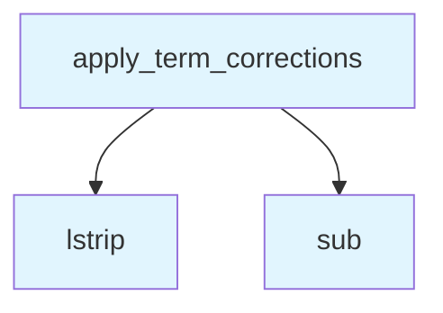

# File: `src/local_deepwiki/generators/wiki/term_validator.py`

## File Overview

This file implements a data-driven term correction mechanism for wiki content. It is designed to fix common factual errors in LLM-generated documentation by applying a curated set of correction rules. The module is part of the postprocessing pipeline that runs before cross-linking, ensuring that the generated documentation is both accurate and consistent.

The core function, `apply_term_corrections`, processes Markdown content line-by-line, carefully avoiding modification of code blocks to prevent corruption of code syntax. This approach allows for safe and targeted correction of textual content while preserving the integrity of code examples.

## Key Concepts

### Data-Driven Corrections
The module uses a curated list of correction patterns (`_CORRECTION_PATTERNS`) to identify and replace incorrect terms with their correct counterparts. This approach is chosen for its flexibility and scalability — corrections can be added or modified without changing the core logic of the function.

### Code Block Awareness
A key design decision is the awareness of fenced code blocks in Markdown. The function tracks whether it is inside a code block (`in_code_block` state) and skips applying corrections to such lines. This ensures that code examples are not inadvertently corrupted by text replacements.

### Line-by-Line Processing
Processing content line-by-line allows for precise control over which parts of the document are modified. It also simplifies handling of complex Markdown structures like indented code blocks and ensures that the output preserves the original formatting.

## Integration

This module is part of the documentation generation pipeline and integrates with other components in the `src/local_deepwiki/generators/wiki` package. It is likely used by the [`WikiGenerator`](generator.md) class or similar components that produce Markdown output.

While this file does not directly import or depend on other modules in the list, it is expected to be used as part of a broader workflow that includes:

- Content generation
- Preprocessing and postprocessing steps
- Cross-linking and analysis

The `apply_term_corrections` function is a key step in ensuring that generated documentation is clean and accurate before further processing, such as in the `core/reranker.py` or `handlers/analysis_diff.py` modules.

## Design Notes

### Handling of Code Blocks
The code block detection logic is designed to handle fenced code blocks (` ``` `) that may be indented up to three spaces. It correctly toggles the `in_code_block` state when encountering a closing fence (i.e., a line starting with ```` ``` ````) and avoids applying corrections to lines inside code blocks.

### Performance Considerations
By processing content line-by-line and using `re.sub` for pattern matching, the implementation avoids unnecessary overhead. However, performance could be a concern if `_CORRECTION_PATTERNS` grows very large. The current design balances readability and maintainability with acceptable performance for typical documentation sizes.

### Edge Cases
The function correctly handles:
- Lines that are indented more than three spaces (assumed to be part of code blocks)
- Empty lines and whitespace-only lines
- Nested or overlapping code blocks (by strictly tracking the fence state)

This approach ensures that the correction process is robust and safe for real-world documentation content.

## API Reference

### Functions

#### `apply_term_corrections`

```python
def apply_term_corrections(content: str) -> str
```

Apply data-driven term corrections to wiki content.  Skips content inside fenced code blocks to avoid corrupting code.


| Parameter | Type | Default | Description |
|-----------|------|---------|-------------|
| `content` | `str` | - | Markdown content to correct. |

**Returns:** `str`


<details>
<summary>View Source (lines 43-82) | <a href="https://github.com/UrbanDiver/local-deepwiki-mcp/blob/main/src/local_deepwiki/generators/wiki/term_validator.py#L43-L82">GitHub</a></summary>

```python
def apply_term_corrections(content: str) -> str:
    """Apply data-driven term corrections to wiki content.

    Skips content inside fenced code blocks to avoid corrupting code.

    Args:
        content: Markdown content to correct.

    Returns:
        Content with known incorrect terms replaced.
    """
    lines = content.split("\n")
    result: list[str] = []
    in_code_block = False

    for line in lines:
        stripped = line.lstrip()
        indent = len(line) - len(stripped)

        # Track code block boundaries
        if indent <= 3 and stripped.startswith("```"):
            if in_code_block:
                if not stripped[3:].strip():
                    in_code_block = False
            else:
                in_code_block = True
            result.append(line)
            continue

        if in_code_block:
            result.append(line)
            continue

        # Apply corrections to non-code lines
        corrected = line
        for pattern, replacement in _CORRECTION_PATTERNS:
            corrected = pattern.sub(replacement, corrected)
        result.append(corrected)

    return "\n".join(result)
```

</details>

## Call Graph



## Used By

Functions and methods in this file and their callers:

- **`lstrip`**: called by `apply_term_corrections`
- **`sub`**: called by `apply_term_corrections`

## Last Modified

| Entity | Type | Author | Date | Commit |
|--------|------|--------|------|--------|
| `apply_term_corrections` | function | Brian Breidenbach | 2 weeks ago | `60e826b` fix: improve wiki documenta... |

## Relevant Source Files

- `src/local_deepwiki/generators/wiki/term_validator.py:43-82`
