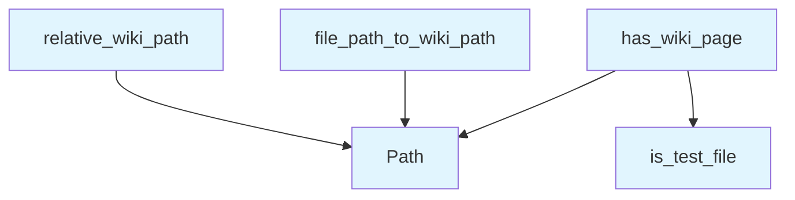

# File: `src/local_deepwiki/generators/wiki/utils.py`

## File Overview

This module provides shared utility functions for wiki generation logic, specifically focused on path manipulation and validation. The functions are used across multiple wiki generator modules to ensure consistent handling of file-to-wiki path conversions, relative path calculations, and exclusion of non-wiki pages (such as test files or `__init__.py`).

The design rationale of this file is to consolidate common path-related operations that were previously duplicated across different modules like `crosslinks`, `see_also`, `source_refs`, `glossary`, and `coverage`. This improves maintainability and reduces redundancy.

## Key Concepts

### Path Manipulation
The module centralizes logic for converting file paths into wiki paths, calculating relative paths between wiki pages, and determining whether a file should be included in the wiki.

### Relative Path Calculation (`relative_wiki_path`)
This function computes the relative path from one wiki page to another. It is used to generate links between wiki pages in a way that is consistent with the directory structure of the documentation.

**Why this approach**: By using `pathlib.Path` and comparing directory components, it ensures correctness across various path structures and avoids manual string manipulation, which can be error-prone.

### Wiki Page Inclusion Check (`has_wiki_page`)
This function determines if a given source file should be included in the wiki. It excludes test files and `__init__.py` files, which are not meant to be part of the public documentation.

**Why this approach**: The exclusion of test files and `__init__.py` avoids broken links and keeps the wiki focused on actual source code documentation.

### File to Wiki Path Conversion (`file_path_to_wiki_path`)
This function transforms a source file path into a corresponding wiki page path by replacing the file extension with `.md` and prepending the `files/` directory prefix.

**Why this approach**: This generic approach works across different languages and file structures, ensuring that the wiki can represent source code in a uniform way regardless of language-specific conventions.

## Integration

This module is imported and used by several other modules in the wiki generation pipeline:

- `source_refs` uses `relative_wiki_path` and `has_wiki_page` to compute relative links and validate page inclusion.
- `dependency_graph` uses `file_path_to_wiki_path` to map source files to their corresponding wiki paths.

It also imports from:
- `pathlib.Path`: For robust and cross-platform path handling.
- [`local_deepwiki.core.path_utils.is_test_file`](../analysis/source_filter.md): To detect test files and exclude them from wiki generation.

## Design Notes

### Handling of `__init__.py` Files
The function `has_wiki_page` explicitly excludes `__init__.py` files. This is a deliberate design choice to avoid cluttering the documentation with Python package initialization logic.

### Generic Extension Replacement
The `file_path_to_wiki_path` function replaces any file extension with `.md`. This supports a wide range of source file types without requiring language-specific logic.

### Relative Path Algorithm
The `relative_wiki_path` function uses a common prefix algorithm to determine how many levels up to go before navigating to the target path. This is a standard and robust method for computing relative paths.

### Path Normalization
All path operations are normalized using `pathlib.Path`, which ensures consistent behavior across different operating systems and handles edge cases like trailing slashes or double slashes gracefully.

## API Reference

### Functions

#### `relative_wiki_path`

```python
def relative_wiki_path(from_path: str, to_path: str) -> str
```

Calculate relative path between two wiki pages.


| Parameter | Type | Default | Description |
|-----------|------|---------|-------------|
| `from_path` | `str` | - | Path of the source page (e.g., "modules/src.md"). |
| `to_path` | `str` | - | Path of the target page (e.g., "files/src/indexer.md"). |

**Returns:** `str`


<details>
<summary>View Source (lines 14-39) | <a href="https://github.com/UrbanDiver/local-deepwiki-mcp/blob/main/src/local_deepwiki/generators/wiki/utils.py#L14-L39">GitHub</a></summary>

```python
def relative_wiki_path(from_path: str, to_path: str) -> str:
    """Calculate relative path between two wiki pages.

    Args:
        from_path: Path of the source page (e.g., "modules/src.md").
        to_path: Path of the target page (e.g., "files/src/indexer.md").

    Returns:
        Relative path from source to target.
    """
    from_parts = Path(from_path).parts[:-1]  # Directory parts only
    to_parts = Path(to_path).parts

    # Find common prefix
    common_length = 0
    for i in range(min(len(from_parts), len(to_parts) - 1)):
        if from_parts[i] == to_parts[i]:
            common_length = i + 1
        else:
            break

    # Build relative path
    ups = len(from_parts) - common_length
    rel_parts = [".."] * ups + list(to_parts[common_length:])

    return "/".join(rel_parts)
```

</details>

#### `has_wiki_page`

```python
def has_wiki_page(file_path: str) -> bool
```

Check if a source file would get a wiki page.  Files excluded from wiki generation (test files, ``__init__.py``) do not get wiki pages, so linking to them would produce broken links.


| Parameter | Type | Default | Description |
|-----------|------|---------|-------------|
| `file_path` | `str` | - | - |

**Returns:** `bool`


<details>
<summary>View Source (lines 42-51) | <a href="https://github.com/UrbanDiver/local-deepwiki-mcp/blob/main/src/local_deepwiki/generators/wiki/utils.py#L42-L51">GitHub</a></summary>

```python
def has_wiki_page(file_path: str) -> bool:
    """Check if a source file would get a wiki page.

    Files excluded from wiki generation (test files, ``__init__.py``)
    do not get wiki pages, so linking to them would produce broken links.
    """
    p = Path(file_path)
    if p.name == "__init__.py":
        return False
    return not is_test_file(file_path)
```

</details>

#### `file_path_to_wiki_path`

```python
def file_path_to_wiki_path(file_path: str) -> str
```

Convert a source file path to a wiki page path.  Works for any language by replacing the file extension with .md and prepending the files/ directory.


| Parameter | Type | Default | Description |
|-----------|------|---------|-------------|
| `file_path` | `str` | - | - |

**Returns:** `str`


<details>
<summary>View Source (lines 54-70) | <a href="https://github.com/UrbanDiver/local-deepwiki-mcp/blob/main/src/local_deepwiki/generators/wiki/utils.py#L54-L70">GitHub</a></summary>

```python
def file_path_to_wiki_path(file_path: str) -> str:
    """Convert a source file path to a wiki page path.

    Works for any language by replacing the file extension with .md
    and prepending the files/ directory.

    Examples:
        src/indexer.py  -> files/src/indexer.md
        main.go         -> files/main.md
        lib/utils.ts    -> files/lib/utils.md
    """
    p = Path(file_path)
    parts = p.parts
    stem = p.stem
    if len(parts) > 1:
        return f"files/{'/'.join(parts[:-1])}/{stem}.md"
    return f"files/{stem}.md"
```

</details>

## Call Graph



## Used By

Functions and methods in this file and their callers:

- **`Path`**: called by `file_path_to_wiki_path`, `has_wiki_page`, `relative_wiki_path`
- **[`is_test_file`](../analysis/source_filter.md)**: called by `has_wiki_page`

## Last Modified

| Entity | Type | Author | Date | Commit |
|--------|------|--------|------|--------|
| `has_wiki_page` | function | Brian Breidenbach | 2 weeks ago | `37654a7` fix: prevent broken links t... |
| `relative_wiki_path` | function | Brian Breidenbach | Feb 20, 2026 | `fdff11b` refactor: apply Pythonic id... |
| `file_path_to_wiki_path` | function | Brian Breidenbach | Feb 20, 2026 | `fdff11b` refactor: apply Pythonic id... |

## Relevant Source Files

- `src/local_deepwiki/generators/wiki/utils.py:14-39`
