# wiki_files.py

## File Overview

The `wiki_files.py` module is responsible for generating wiki documentation files from source code. It handles the creation of documentation that includes source code details, API documentation, call graphs, and cross-references. The module integrates with Git for source information, vector stores for semantic search, and various generators for different types of documentation content.

## Functions

### _get_syntax_lang

```python
def _get_syntax_lang(file_path: Path) -> str
```

Determines the appropriate syntax highlighting language identifier based on the file extension.

**Parameters:**
- `file_path`: Path object representing the file to analyze

**Returns:**
- String representing the syntax highlighting language identifier

### _create_source_details

```python
def _create_source_details(file_path: Path, repo_info: GitRepoInfo) -> str
```

Creates source details section for documentation, including Git blame information and source URLs.

**Parameters:**
- `file_path`: Path to the source file
- `repo_info`: [GitRepoInfo](../core/git_utils.md) object containing repository information

**Returns:**
- Formatted string containing source details

### _inject_inl

```python
def _inject_inl(content: str, entity_registry: EntityRegistry) -> str
```

Injects inline links into content by replacing entity references with appropriate cross-links.

**Parameters:**
- `content`: The content string to process
- `entity_registry`: [EntityRegistry](crosslinks.md) instance for resolving entity references

**Returns:**
- Content string with injected inline links

## Related Components

This module works closely with several other components:

- **[Config](../config.md)**: Provides configuration settings for the documentation generation process
- **[GitRepoInfo](../core/git_utils.md)**: Supplies Git repository information for source details
- **[VectorStore](../core/vectorstore.md)**: Enables semantic search capabilities for documentation
- **[EntityRegistry](crosslinks.md)**: Manages cross-references between different entities in the documentation
- **API documentation generators**: Integrates with [`get_file_api_docs`](api_docs.md) for generating API documentation
- **Call graph generators**: Uses [`get_file_call_graph`](callgraph.md) and [`get_file_callers`](callgraph.md) for analyzing code relationships
- **Git utilities**: Leverages various Git-related functions for blame information, source URLs, and repository details

## Usage Context

The module appears to be part of a larger documentation generation system that creates comprehensive wiki-style documentation from source code repositories. It combines static analysis, Git history, and semantic relationships to produce rich, interconnected documentation files.

## API Reference

### Functions

#### `get_chunk_url`

```python
def get_chunk_url(chunk: CodeChunk) -> str | None
```

Build GitHub URL for a chunk.


| [Parameter](api_docs.md) | Type | Default | Description |
|-----------|------|---------|-------------|
| `chunk` | [`CodeChunk`](../models.md) | - | - |

**Returns:** `str | None`


<details>
<summary>View Source (lines 132-136) | <a href="https://github.com/UrbanDiver/local-deepwiki-mcp/blob/[main](../export/pdf.md)/src/local_deepwiki/generators/wiki_files.py#L132-L136">GitHub</a></summary>

```python
def get_chunk_url(chunk: CodeChunk) -> str | None:
        """Build GitHub URL for a chunk."""
        if repo_info is None:
            return None
        return build_source_url(repo_info, chunk.file_path, chunk.start_line, chunk.end_line)
```

</details>

#### `generate_single_file_doc`

```python
async def generate_single_file_doc(file_info: FileInfo, index_status: IndexStatus, vector_store: VectorStore, llm: LLMProvider, system_prompt: str, status_manager: "WikiStatusManager", entity_registry: EntityRegistry, config: Config, full_rebuild: bool) -> tuple[WikiPage | None, bool]
```

Generate documentation for a single source file.


| [Parameter](api_docs.md) | Type | Default | Description |
|-----------|------|---------|-------------|
| `file_info` | [`FileInfo`](../models.md) | - | File status information. |
| `index_status` | [`IndexStatus`](../models.md) | - | Index status with repo information. |
| `vector_store` | [`VectorStore`](../core/vectorstore.md) | - | Vector store with indexed code. |
| `llm` | [`LLMProvider`](../providers/base.md) | - | LLM provider for generation. |
| `system_prompt` | `str` | - | System prompt for LLM. |
| `status_manager` | `"WikiStatusManager"` | - | Wiki status manager for incremental updates. |
| `entity_registry` | [`EntityRegistry`](crosslinks.md) | - | Entity registry for cross-linking. |
| `config` | [`Config`](../config.md) | - | Configuration. |
| `full_rebuild` | `bool` | - | If True, regenerate even if unchanged. |

**Returns:** `tuple[WikiPage | None, bool]`


<details>
<summary>View Source (lines 258-444) | <a href="https://github.com/UrbanDiver/local-deepwiki-mcp/blob/[main](../export/pdf.md)/src/local_deepwiki/generators/wiki_files.py#L258-L444">GitHub</a></summary>

```python
async def generate_single_file_doc(
    file_info: FileInfo,
    index_status: IndexStatus,
    vector_store: VectorStore,
    llm: LLMProvider,
    system_prompt: str,
    status_manager: "WikiStatusManager",
    entity_registry: EntityRegistry,
    config: Config,
    full_rebuild: bool,
) -> tuple[WikiPage | None, bool]:
    """Generate documentation for a single source file.

    Args:
        file_info: File status information.
        index_status: Index status with repo information.
        vector_store: Vector store with indexed code.
        llm: LLM provider for generation.
        system_prompt: System prompt for LLM.
        status_manager: Wiki status manager for incremental updates.
        entity_registry: Entity registry for cross-linking.
        config: Configuration.
        full_rebuild: If True, regenerate even if unchanged.

    Returns:
        Tuple of (WikiPage or None, was_skipped).
        Returns (None, False) if file should be skipped entirely.
        Returns (page, True) if existing page was reused.
        Returns (page, False) if new page was generated.
    """
    file_path = Path(file_info.path)

    # Create nested path structure: files/module/filename.md
    parts = file_path.parts
    if len(parts) > 1:
        wiki_path = f"files/{'/'.join(parts[:-1])}/{file_path.stem}.md"
    else:
        wiki_path = f"files/{file_path.stem}.md"

    source_files = [file_info.path]

    # Check if this file page needs regeneration
    if not full_rebuild and not status_manager.needs_regeneration(wiki_path, source_files):
        existing_page = await status_manager.load_existing_page(wiki_path)
        if existing_page is not None:
            # Still need to register entities for cross-linking
            all_file_chunks = await vector_store.get_chunks_by_file(file_info.path)
            entity_registry.register_from_chunks(all_file_chunks, wiki_path)
            status_manager.record_page_status(existing_page, source_files)
            return existing_page, True  # Skipped (reused existing)

    # Get all chunks for this file
    search_results = await vector_store.search(
        f"file:{file_info.path}",
        limit=config.wiki.context_search_limit,
    )

    # Filter to chunks from this specific file
    file_chunks = [r for r in search_results if r.chunk.file_path == file_info.path]

    if not file_chunks:
        # Fallback: search by filename
        search_results = await vector_store.search(
            file_path.stem,
            limit=config.wiki.fallback_search_limit,
        )
        file_chunks = [r for r in search_results if r.chunk.file_path == file_info.path]

    if not file_chunks:
        return None, False  # No content to document

    # Build context from chunks
    context_parts = []
    for r in file_chunks[:15]:  # Limit context size
        chunk = r.chunk
        context_parts.append(
            f"Type: {chunk.chunk_type.value}\n"
            f"Name: {chunk.name}\n"
            f"Lines: {chunk.start_line}-{chunk.end_line}\n"
            f"```\n{chunk.content[:600]}\n```"
        )

    context = "\n\n".join(context_parts)

    prompt = f"""Generate documentation for the file '{file_info.path}' based ONLY on the code provided.

Language: {file_info.language}
Total code chunks: {file_info.chunk_count}

Code contents:
{context}

Generate documentation that includes:
1. **File Overview**: Purpose of this file based on the code shown
2. **Classes**: Document each class visible in the code with its purpose and key methods
3. **Functions**: Document each function with parameters and return values as shown
4. **Usage Examples**: Show how to use the components (based on their actual signatures)
5. **Related Components**: Mention other classes this file works with (based on imports/references shown)

CRITICAL CONSTRAINTS:
- ONLY document classes, methods, and functions that appear in the code above
- Do NOT invent additional methods or parameters not shown
- Do NOT fabricate usage examples with APIs not visible in the code
- Write class names as plain text (e.g., "The WikiGenerator class") for cross-linking
- Only use backticks for actual code snippets

Format as markdown with clear sections.
Do NOT include mermaid class diagrams - they will be auto-generated."""

    content = await llm.generate(prompt, system_prompt=system_prompt)

    # Strip any LLM-generated class diagram sections (we add our own)
    content = re.sub(
        r"\n*##\s*Class\s*Diagram\s*\n+```mermaid\s*\n+classDiagram.*?```",
        "",
        content,
        flags=re.DOTALL | re.IGNORECASE,
    )

    # Generate API reference section with type signatures
    abs_file_path = Path(index_status.repo_path) / file_info.path
    if abs_file_path.exists():
        api_docs = get_file_api_docs(abs_file_path)
        if api_docs:
            content += "\n\n## API Reference\n\n" + api_docs

    # Generate class diagram if file has classes
    all_file_chunks = await vector_store.get_chunks_by_file(file_info.path)
    class_diagram = generate_class_diagram(all_file_chunks)
    if class_diagram:
        content += "\n\n## Class Diagram\n\n" + class_diagram

    # Generate call graph diagram and used-by information
    if abs_file_path.exists():
        call_graph = get_file_call_graph(abs_file_path, Path(index_status.repo_path))
        if call_graph:
            content += "\n\n## Call Graph\n\n```mermaid\n" + call_graph + "\n```"

        # Add "Used by" section showing callers for each function
        callers_map = get_file_callers(abs_file_path, Path(index_status.repo_path))
        if callers_map:
            used_by_lines = ["## Used By", "", "Functions and methods in this file and their callers:", ""]
            for callee in sorted(callers_map.keys()):
                callers = callers_map[callee]
                if callers:
                    caller_list = ", ".join(f"`{c}`" for c in sorted(callers))
                    used_by_lines.append(f"- **`{callee}`**: called by {caller_list}")
            if len(used_by_lines) > 4:  # More than just the header
                content += "\n\n" + "\n".join(used_by_lines)

    # Add usage examples from test files
    entity_names = [chunk.name for chunk in all_file_chunks if chunk.name and len(chunk.name) > 2]
    if entity_names:
        examples_md = get_file_examples(
            source_file=abs_file_path,
            repo_root=Path(index_status.repo_path),
            entity_names=entity_names,
            max_examples=5,
        )
        if examples_md:
            content += "\n\n" + examples_md

    # Add git blame "Last Modified" section
    blame_section = _generate_blame_section(
        repo_path=Path(index_status.repo_path),
        file_path=file_info.path,
        chunks=all_file_chunks,
    )
    if blame_section:
        content += "\n\n" + blame_section

    # Inject inline source code after each function/class in API Reference
    lang_str = file_info.language.value if file_info.language else None
    repo_info = get_repo_info(Path(index_status.repo_path))
    content = _inject_inline_source_code(content, all_file_chunks, lang_str, repo_info)

    # Register entities for cross-linking
    entity_registry.register_from_chunks(all_file_chunks, wiki_path)

    page = WikiPage(
        path=wiki_path,
        title=f"{file_path.name}",
        content=content,
        generated_at=time.time(),
    )
    status_manager.record_page_status(page, source_files)
    return page, False  # Generated new
```

</details>

#### `generate_file_docs`

```python
async def generate_file_docs(index_status: IndexStatus, vector_store: VectorStore, llm: LLMProvider, system_prompt: str, status_manager: "WikiStatusManager", entity_registry: EntityRegistry, config: Config, progress_callback: ProgressCallback | None = None, full_rebuild: bool = False) -> tuple[list[WikiPage], int, int]
```

Generate documentation for individual source files.  Uses parallel LLM calls for faster generation, controlled by config.wiki.max_concurrent_llm_calls.


| [Parameter](api_docs.md) | Type | Default | Description |
|-----------|------|---------|-------------|
| `index_status` | [`IndexStatus`](../models.md) | - | Index status with file information. |
| `vector_store` | [`VectorStore`](../core/vectorstore.md) | - | Vector store with indexed code. |
| `llm` | [`LLMProvider`](../providers/base.md) | - | LLM provider for generation. |
| `system_prompt` | `str` | - | System prompt for LLM. |
| `status_manager` | `"WikiStatusManager"` | - | Wiki status manager for incremental updates. |
| `entity_registry` | [`EntityRegistry`](crosslinks.md) | - | Entity registry for cross-linking. |
| `config` | [`Config`](../config.md) | - | Configuration. |
| [`progress_callback`](../handlers.md) | `ProgressCallback | None` | `None` | Optional progress callback. |
| `full_rebuild` | `bool` | `False` | If True, regenerate all pages. |

**Returns:** `tuple[list[WikiPage], int, int]`


<details>
<summary>View Source (lines 447-569) | <a href="https://github.com/UrbanDiver/local-deepwiki-mcp/blob/[main](../export/pdf.md)/src/local_deepwiki/generators/wiki_files.py#L447-L569">GitHub</a></summary>

```python
async def generate_file_docs(
    index_status: IndexStatus,
    vector_store: VectorStore,
    llm: LLMProvider,
    system_prompt: str,
    status_manager: "WikiStatusManager",
    entity_registry: EntityRegistry,
    config: Config,
    progress_callback: ProgressCallback | None = None,
    full_rebuild: bool = False,
) -> tuple[list[WikiPage], int, int]:
    """Generate documentation for individual source files.

    Uses parallel LLM calls for faster generation, controlled by
    config.wiki.max_concurrent_llm_calls.

    Args:
        index_status: Index status with file information.
        vector_store: Vector store with indexed code.
        llm: LLM provider for generation.
        system_prompt: System prompt for LLM.
        status_manager: Wiki status manager for incremental updates.
        entity_registry: Entity registry for cross-linking.
        config: Configuration.
        progress_callback: Optional progress callback.
        full_rebuild: If True, regenerate all pages.

    Returns:
        Tuple of (pages list, generated count, skipped count).
    """

    # Filter files: skip __init__.py and test files
    def is_test_file(path: str) -> bool:
        """Check if a file is a test file."""
        parts = path.split("/")
        # Skip files in tests/ directory only
        # Don't skip test_*.py in src/ (e.g., test_examples.py is a source file)
        return "tests" in parts

    significant_files = [
        f
        for f in index_status.files
        if not f.path.endswith("__init__.py")
        and not is_test_file(f.path)
        and f.chunk_count >= 2  # Has meaningful content
    ]

    # Limit test files separately if we want them later
    # For source files, include all of them (no limit)
    max_files = config.wiki.max_file_docs
    if len(significant_files) > max_files:
        # Only limit if we have way too many files
        # Prioritize files with more chunks (more complex)
        significant_files = sorted(significant_files, key=lambda x: x.chunk_count, reverse=True)[
            :max_files
        ]

    if not significant_files:
        return [], 0, 0

    # Use semaphore to limit concurrent LLM calls
    max_concurrent = config.wiki.max_concurrent_llm_calls
    semaphore = asyncio.Semaphore(max_concurrent)
    logger.info(
        f"Generating file docs for {len(significant_files)} files "
        f"(max {max_concurrent} concurrent)"
    )

    async def generate_with_semaphore(
        file_info: FileInfo,
    ) -> tuple[WikiPage | None, bool]:
        async with semaphore:
            logger.debug(f"Generating doc for {file_info.path}")
            return await generate_single_file_doc(
                file_info=file_info,
                index_status=index_status,
                vector_store=vector_store,
                llm=llm,
                system_prompt=system_prompt,
                status_manager=status_manager,
                entity_registry=entity_registry,
                config=config,
                full_rebuild=full_rebuild,
            )

    # Run all file doc generations concurrently (limited by semaphore)
    results = await asyncio.gather(
        *[generate_with_semaphore(f) for f in significant_files],
        return_exceptions=True,
    )

    # Process results
    pages = []
    pages_generated = 0
    pages_skipped = 0

    for file_info, result in zip(significant_files, results):
        if isinstance(result, BaseException):
            logger.error(f"Error generating doc for {file_info.path}: {result}")
            continue

        page, was_skipped = result
        if page is not None:
            pages.append(page)
            if was_skipped:
                pages_skipped += 1
            else:
                pages_generated += 1

    # Create files index (always regenerate since it depends on all file pages)
    if pages:
        all_file_paths = [f.path for f in significant_files]
        files_index = WikiPage(
            path="files/index.md",
            title="Source Files",
            content=_generate_files_index(pages),
            generated_at=time.time(),
        )
        pages.insert(0, files_index)
        status_manager.record_page_status(files_index, all_file_paths)

    logger.info(f"File docs complete: {pages_generated} generated, {pages_skipped} skipped")
    return pages, pages_generated, pages_skipped
```

</details>

#### `is_test_file`

```python
def is_test_file(path: str) -> bool
```

Check if a file is a test file.


| [Parameter](api_docs.md) | Type | Default | Description |
|-----------|------|---------|-------------|
| `path` | `str` | - | - |

**Returns:** `bool`


<details>
<summary>View Source (lines 479-484) | <a href="https://github.com/UrbanDiver/local-deepwiki-mcp/blob/[main](../export/pdf.md)/src/local_deepwiki/generators/wiki_files.py#L479-L484">GitHub</a></summary>

```python
def is_test_file(path: str) -> bool:
        """Check if a file is a test file."""
        parts = path.split("/")
        # Skip files in tests/ directory only
        # Don't skip test_*.py in src/ (e.g., test_examples.py is a source file)
        return "tests" in parts
```

</details>

#### `generate_with_semaphore`

```python
async def generate_with_semaphore(file_info: FileInfo) -> tuple[WikiPage | None, bool]
```


| [Parameter](api_docs.md) | Type | Default | Description |
|-----------|------|---------|-------------|
| `file_info` | [`FileInfo`](../models.md) | - | - |

**Returns:** `tuple[WikiPage | None, bool]`


<details>
<summary>View Source (lines 515-530) | <a href="https://github.com/UrbanDiver/local-deepwiki-mcp/blob/[main](../export/pdf.md)/src/local_deepwiki/generators/wiki_files.py#L515-L530">GitHub</a></summary>

```python
async def generate_with_semaphore(
        file_info: FileInfo,
    ) -> tuple[WikiPage | None, bool]:
        async with semaphore:
            logger.debug(f"Generating doc for {file_info.path}")
            return await generate_single_file_doc(
                file_info=file_info,
                index_status=index_status,
                vector_store=vector_store,
                llm=llm,
                system_prompt=system_prompt,
                status_manager=status_manager,
                entity_registry=entity_registry,
                config=config,
                full_rebuild=full_rebuild,
            )
```

</details>

## Call Graph

```mermaid
flowchart TD
    N0[Path]
    N1[WikiPage]
    N2[_create_source_details]
    N3[_generate_blame_section]
    N4[_generate_files_index]
    N5[_get_syntax_lang]
    N6[_inject_inline_source_code]
    N7[add]
    N8[build_source_url]
    N9[exists]
    N10[generate]
    N11[generate_class_diagram]
    N12[generate_file_docs]
    N13[generate_single_file_doc]
    N14[generate_with_semaphore]
    N15[get_chunk_url]
    N16[get_chunks_by_file]
    N17[get_file_api_docs]
    N18[get_file_call_graph]
    N19[get_file_callers]
    N20[get_file_examples]
    N21[get_repo_info]
    N22[is_test_file]
    N23[load_existing_page]
    N24[needs_regeneration]
    N25[record_page_status]
    N26[register_from_chunks]
    N27[search]
    N28[sub]
    N29[time]
    N6 --> N7
    N6 --> N5
    N6 --> N8
    N6 --> N2
    N6 --> N15
    N15 --> N8
    N13 --> N0
    N13 --> N24
    N13 --> N23
    N13 --> N16
    N13 --> N26
    N13 --> N25
    N13 --> N27
    N13 --> N10
    N13 --> N28
    N13 --> N9
    N13 --> N17
    N13 --> N11
    N13 --> N18
    N13 --> N19
    N13 --> N20
    N13 --> N3
    N13 --> N21
    N13 --> N6
    N13 --> N1
    N13 --> N29
    N12 --> N22
    N12 --> N13
    N12 --> N14
    N12 --> N1
    N12 --> N4
    N12 --> N29
    N12 --> N25
    N14 --> N13
    N4 --> N0
    classDef func fill:#e1f5fe
    class N0,N1,N2,N3,N4,N5,N6,N7,N8,N9,N10,N11,N12,N13,N14,N15,N16,N17,N18,N19,N20,N21,N22,N23,N24,N25,N26,N27,N28,N29 func
```



## Used By

Functions and methods in this file and their callers:

- **`Path`**: called by `_generate_files_index`, `generate_single_file_doc`
- **`Semaphore`**: called by `generate_file_docs`
- **[`WikiPage`](../models.md)**: called by `generate_file_docs`, `generate_single_file_doc`
- **`_create_source_details`**: called by `_inject_inline_source_code`
- **`_generate_blame_section`**: called by `generate_single_file_doc`
- **`_generate_files_index`**: called by `generate_file_docs`
- **`_get_syntax_lang`**: called by `_inject_inline_source_code`
- **`_inject_inline_source_code`**: called by `generate_single_file_doc`
- **`add`**: called by `_inject_inline_source_code`
- **[`build_source_url`](../core/git_utils.md)**: called by `_inject_inline_source_code`, `get_chunk_url`
- **`exists`**: called by `generate_single_file_doc`
- **[`format_blame_date`](../core/git_utils.md)**: called by `_generate_blame_section`
- **`gather`**: called by `generate_file_docs`
- **`generate`**: called by `generate_single_file_doc`
- **[`generate_class_diagram`](diagrams.md)**: called by `generate_single_file_doc`
- **`generate_single_file_doc`**: called by `generate_file_docs`, `generate_with_semaphore`
- **`generate_with_semaphore`**: called by `generate_file_docs`
- **`get_chunk_url`**: called by `_inject_inline_source_code`
- **`get_chunks_by_file`**: called by `generate_single_file_doc`
- **[`get_file_api_docs`](api_docs.md)**: called by `generate_single_file_doc`
- **[`get_file_call_graph`](callgraph.md)**: called by `generate_single_file_doc`
- **[`get_file_callers`](callgraph.md)**: called by `generate_single_file_doc`
- **[`get_file_entity_blame`](../core/git_utils.md)**: called by `_generate_blame_section`
- **[`get_file_examples`](test_examples.md)**: called by `generate_single_file_doc`
- **[`get_repo_info`](../core/git_utils.md)**: called by `generate_single_file_doc`
- **`is_test_file`**: called by `generate_file_docs`
- **`load_existing_page`**: called by `generate_single_file_doc`
- **`needs_regeneration`**: called by `generate_single_file_doc`
- **`record_page_status`**: called by `generate_file_docs`, `generate_single_file_doc`
- **`register_from_chunks`**: called by `generate_single_file_doc`
- **`search`**: called by `generate_single_file_doc`
- **`setdefault`**: called by `_generate_files_index`
- **`sort`**: called by `_generate_blame_section`
- **`sub`**: called by `generate_single_file_doc`
- **`time`**: called by `generate_file_docs`, `generate_single_file_doc`

## Usage Examples

*Examples extracted from test files*

### Test returns empty when no files in index

From `test_wiki_files_coverage.py::TestGenerateFileDocs::test_returns_empty_for_no_files`:

```python
pages, generated, skipped = await generate_file_docs(
    index_status=index_status,
    vector_store=mock_vector_store,
    llm=mock_llm,
    system_prompt="System prompt",
    status_manager=mock_status_manager,
    entity_registry=mock_entity_registry,
    config=mock_config,
    full_rebuild=True,
)

assert pages == []
assert generated == 0
```

### Test filters out __init__.py files

From `test_wiki_files_coverage.py::TestGenerateFileDocs::test_filters_init_files`:

```python
pages, generated, skipped = await generate_file_docs(
    index_status=index_status,
    vector_store=mock_vector_store,
    llm=mock_llm,
    system_prompt="System prompt",
    status_manager=mock_status_manager,
    entity_registry=mock_entity_registry,
    config=mock_config,
    full_rebuild=True,
)

assert pages == []
```

### Test generates basic index content

From `test_wiki_files_coverage.py::TestGenerateFilesIndex::test_generates_basic_index`:

```python
pages = [
    WikiPage(
        path="files/src/main.md", title="main.py", content="", generated_at=time.time()
    ),
    WikiPage(
        path="files/src/utils.md", title="utils.py", content="", generated_at=time.time()
    ),
]

result = _generate_files_index(pages)

assert "# Source Files" in result
assert "[main.py]" in result
assert "[utils.py]" in result
```

### Test groups files by directory

From `test_wiki_files_coverage.py::TestGenerateFilesIndex::test_groups_by_directory`:

```python
pages = [
    WikiPage(
        path="files/src/main.md", title="main.py", content="", generated_at=time.time()
    ),
    WikiPage(
        path="files/tests/test_main.md",
        title="test_main.py",
        content="",
        generated_at=time.time(),
    ),
]

result = _generate_files_index(pages)

assert "## src" in result
assert "## tests" in result
```

### Test creates a properly formatted details block

From `test_wiki_files_coverage.py::TestCreateSourceDetails::test_creates_details_block`:

```python
chunk = make_code_chunk(
    name="my_func",
    chunk_type=ChunkType.FUNCTION,
    content="def my_func():\n    pass",
    start_line=10,
    end_line=12,
)

result = _create_source_details(chunk, "python")

assert "<details>" in result
assert "</details>" in result
assert "View Source (lines 10-12)" in result
assert "```python" in result
assert "def my_func():" in result
```


## Last Modified

| Entity | Type | Author | Date | Commit |
|--------|------|--------|------|--------|
| `generate_single_file_doc` | function | Brian Breidenbach | today | `37aec0f` Add git blame integration t... |
| `_generate_blame_section` | function | Brian Breidenbach | today | `37aec0f` Add git blame integration t... |
| `_create_source_details` | function | Brian Breidenbach | today | `62e3290` Add GitHub source links and... |
| `_inject_inline_source_code` | function | Brian Breidenbach | today | `62e3290` Add GitHub source links and... |
| `get_chunk_url` | function | Brian Breidenbach | today | `62e3290` Add GitHub source links and... |
| `_get_syntax_lang` | function | Brian Breidenbach | today | `d275583` Add inline expandable sourc... |
| `generate_file_docs` | function | Brian Breidenbach | today | `0d91a70` Apply Python best practices... |
| `is_test_file` | function | Brian Breidenbach | yesterday | `3defaaa` Refactor: Extract validatio... |
| `generate_with_semaphore` | function | Brian Breidenbach | yesterday | `3defaaa` Refactor: Extract validatio... |
| `_generate_files_index` | function | Brian Breidenbach | yesterday | `3defaaa` Refactor: Extract validatio... |

## Additional Source Code

Source code for functions and methods not listed in the API Reference above.

#### `_get_syntax_lang`

<details>
<summary>View Source (lines 33-58) | <a href="https://github.com/UrbanDiver/local-deepwiki-mcp/blob/main/src/local_deepwiki/generators/wiki_files.py#L33-L58">GitHub</a></summary>

```python
def _get_syntax_lang(language: str | None) -> str:
    """Get syntax highlighting language string.

    Args:
        language: Programming language name.

    Returns:
        [Language](../models.md) string for markdown code blocks.
    """
    lang_map = {
        "python": "python",
        "javascript": "javascript",
        "typescript": "typescript",
        "tsx": "tsx",
        "go": "go",
        "rust": "rust",
        "java": "java",
        "c": "c",
        "cpp": "cpp",
        "swift": "swift",
        "ruby": "ruby",
        "php": "php",
        "kotlin": "kotlin",
        "csharp": "csharp",
    }
    return lang_map.get(language or "", "")
```

</details>


#### `_create_source_details`

<details>
<summary>View Source (lines 61-87) | <a href="https://github.com/UrbanDiver/local-deepwiki-mcp/blob/main/src/local_deepwiki/generators/wiki_files.py#L61-L87">GitHub</a></summary>

```python
def _create_source_details(
    chunk: [CodeChunk](../models.md), syntax_lang: str, github_url: str | None = None
) -> str:
    """Create a collapsible source code block for a chunk.

    Args:
        chunk: The code chunk.
        syntax_lang: Syntax highlighting language.
        github_url: Optional GitHub URL to link to source.

    Returns:
        Markdown details block with source code.
    """
    if github_url:
        summary = f'View Source (lines {chunk.start_line}-{chunk.end_line}) | <a href="{github_url}">GitHub</a>'
    else:
        summary = f"View Source (lines {chunk.start_line}-{chunk.end_line})"

    return f"""<details>
<summary>{summary}</summary>

```{syntax_lang}
{chunk.content}
```

</details>
"""
```

</details>


#### `_inject_inline_source_code`

<details>
<summary>View Source (lines 90-255) | <a href="https://github.com/UrbanDiver/local-deepwiki-mcp/blob/main/src/local_deepwiki/generators/wiki_files.py#L90-L255">GitHub</a></summary>

```python
def _inject_inline_source_code(
    content: str,
    chunks: list[[CodeChunk](../models.md)],
    language: str | None,
    repo_info: [GitRepoInfo](../core/git_utils.md) | None = None,
) -> str:
    """Inject collapsible source code after each function/class in the API Reference.

    Args:
        content: The markdown content to process.
        chunks: List of code chunks from the file.
        language: Programming language for syntax highlighting.
        repo_info: Optional git repo info for GitHub links.

    Returns:
        Content with inline source code blocks injected.
    """
    # Build maps of entity names to their chunks
    # Use both simple names and qualified names (Parent.method) for methods
    chunk_map: dict[str, [CodeChunk](../models.md)] = {}
    class_map: dict[str, [CodeChunk](../models.md)] = {}  # For fallback to class source
    all_chunks: set[str] = set()  # Track all chunk IDs
    used_chunks: set[str] = set()  # Track which chunks we've injected

    for chunk in chunks:
        if chunk.name and chunk.chunk_type in ([ChunkType](../models.md).CLASS, [ChunkType](../models.md).FUNCTION, [ChunkType](../models.md).METHOD):
            all_chunks.add(chunk.id)
            # Store by simple name (may be overwritten by duplicates)
            chunk_map[chunk.name] = chunk
            # Also store by qualified name for methods with parents
            if chunk.parent_name:
                qualified_name = f"{chunk.parent_name}.{chunk.name}"
                chunk_map[qualified_name] = chunk
            # Build class map for fallback
            if chunk.chunk_type == [ChunkType](../models.md).CLASS:
                class_map[chunk.name] = chunk

    if not chunk_map:
        return content

    syntax_lang = _get_syntax_lang(language)

    def get_chunk_url(chunk: [CodeChunk](../models.md)) -> str | None:
        """Build GitHub URL for a chunk."""
        if repo_info is None:
            return None
        return [build_source_url](../core/git_utils.md)(repo_info, chunk.file_path, chunk.start_line, chunk.end_line)

    # Split into lines for processing
    lines = content.split("\n")
    result_lines: list[str] = []
    current_class: str | None = None  # Track current class context
    i = 0

    while i < len(lines):
        line = lines[i]
        result_lines.append(line)

        # Track class context from headings like "### class `ClassName`"
        if line.startswith("### class `"):
            start = line.find("`") + 1
            end = line.[find](manifest.md)("`", start)
            if start > 0 and end > start:
                current_class = line[start:end]

        # Look for API Reference function/class headings
        # Matches: #### `name`, ### `name`, ### class `name`
        if line.startswith("#### `") or line.startswith("### `") or line.startswith("### class `"):
            # Extract entity name from heading like "#### [`setup_logging`](../logging.md)"
            start = line.[find](manifest.md)("`") + 1
            end = line.find("`", start)
            if start > 0 and end > start:
                entity_name = line[start:end]

                # Normalize: strip signature and class prefix
                # e.g., "__init__(self, ...)" -> "__init__"
                # e.g., "class MyClass" -> "MyClass"
                if "(" in entity_name:
                    entity_name = entity_name.split("(")[0]
                if entity_name.startswith("class "):
                    entity_name = entity_name[6:].strip()
                    # This is a class heading, update context
                    current_class = entity_name

                # Try to [find](manifest.md) the chunk - first try qualified name, then simple name
                chunk = None
                if current_class and entity_name != current_class:
                    # This is likely a method under the current class
                    qualified_name = f"{current_class}.{entity_name}"
                    chunk = chunk_map.get(qualified_name)
                if chunk is None:
                    candidate = chunk_map.get(entity_name)
                    # Only use simple name match if:
                    # - It's a class/function (no parent), OR
                    # - Its parent matches our current context
                    if candidate is not None:
                        if candidate.parent_name is None or candidate.parent_name == current_class:
                            chunk = candidate

                # Part A: Fallback to class source for unmatched methods
                if chunk is None and current_class and entity_name != current_class:
                    # Method not found, use parent class source as fallback
                    chunk = class_map.get(current_class)

                if chunk is not None:
                    used_chunks.add(chunk.id)
                    # Find the end of this function's documentation
                    # Look for: next heading at same or higher level, or **Returns:** line
                    j = i + 1
                    found_returns = False
                    while j < len(lines):
                        next_line = lines[j]
                        # Stop at next heading of same or higher level
                        if next_line.startswith("#### ") or next_line.startswith("### ") or next_line.startswith("## "):
                            # Inject source before next heading if no Returns found
                            if not found_returns:
                                result_lines.append("")
                                result_lines.append(_create_source_details(chunk, syntax_lang, get_chunk_url(chunk)))
                            i = j - 1  # Back up so we process next heading
                            break
                        # Track if we found Returns
                        if next_line.startswith("**Returns:**"):
                            found_returns = True
                            # Include the Returns line and blank line after it
                            result_lines.append(lines[j])
                            j += 1
                            # Skip blank lines after Returns
                            while j < len(lines) and lines[j].strip() == "":
                                result_lines.append(lines[j])
                                j += 1
                            # Insert source code here
                            result_lines.append("")
                            result_lines.append(_create_source_details(chunk, syntax_lang, get_chunk_url(chunk)))
                            i = j - 1  # Continue from here
                            break
                        result_lines.append(lines[j])
                        j += 1
                    else:
                        # Reached end of file without finding next heading
                        # Add source code at the end
                        if not found_returns:
                            result_lines.append("")
                            result_lines.append(_create_source_details(chunk, syntax_lang, get_chunk_url(chunk)))
                        i = j - 1

        i += 1

    # Part B: Add remaining unused chunks at the end
    unused_chunks = [c for c in chunks if c.id in all_chunks and c.id not in used_chunks]
    if unused_chunks:
        result_lines.append("")
        result_lines.append("## Additional Source Code")
        result_lines.append("")
        result_lines.append("Source code for functions and methods not listed in the API Reference above.")
        result_lines.append("")

        for chunk in sorted(unused_chunks, key=lambda c: c.start_line):
            if chunk.chunk_type == [ChunkType](../models.md).CLASS:
                result_lines.append(f"### `{chunk.name}`")
            else:
                result_lines.append(f"#### `{chunk.name}`")
            result_lines.append("")
            result_lines.append(_create_source_details(chunk, syntax_lang, get_chunk_url(chunk)))
            result_lines.append("")

    return "\n".join(result_lines)
```

</details>


#### `_generate_blame_section`

<details>
<summary>View Source (lines 572-640) | <a href="https://github.com/UrbanDiver/local-deepwiki-mcp/blob/main/src/local_deepwiki/generators/wiki_files.py#L572-L640">GitHub</a></summary>

```python
def _generate_blame_section(
    repo_path: Path,
    file_path: str,
    chunks: list[[CodeChunk](../models.md)],
) -> str | None:
    """Generate a "Last Modified" section with git blame info.

    Args:
        repo_path: Path to the repository root.
        file_path: Relative path to the source file.
        chunks: Code chunks from the file.

    Returns:
        Markdown section or None if no blame info available.
    """
    # Build entity list for blame lookup
    entities: list[tuple[str, str, int, int]] = []

    for chunk in chunks:
        if chunk.name and chunk.chunk_type in ([ChunkType](../models.md).CLASS, [ChunkType](../models.md).FUNCTION, [ChunkType](../models.md).METHOD):
            entities.append((
                chunk.name,
                chunk.chunk_type.value,
                chunk.start_line,
                chunk.end_line,
            ))

    if not entities:
        return None

    # Get blame info for all entities
    blame_infos = [get_file_entity_blame](../core/git_utils.md)(repo_path, file_path, entities)

    if not blame_infos:
        return None

    # Sort by most recently modified first
    blame_infos.sort(key=lambda b: b.last_modified_date, reverse=True)

    # Build the section
    lines = [
        "## Last Modified",
        "",
        "| Entity | Type | Author | Date | Commit |",
        "|--------|------|--------|------|--------|",
    ]

    for blame in blame_infos:
        entity_name = blame.entity_name
        entity_type = blame.entity_type
        author = blame.last_modified_by
        date_str = [format_blame_date](../core/git_utils.md)(blame.last_modified_date)
        commit_short = blame.commit_hash[:7]

        # Truncate long author names
        if len(author) > 20:
            author = author[:17] + "..."

        # Add commit summary if available (truncated)
        commit_info = f"`{commit_short}`"
        if blame.commit_summary:
            summary = blame.commit_summary
            if len(summary) > 30:
                summary = summary[:27] + "..."
            commit_info = f"`{commit_short}` {summary}"

        lines.append(f"| `{entity_name}` | {entity_type} | {author} | {date_str} | {commit_info} |")

    return "\n".join(lines)
```

</details>


#### `_generate_files_index`

<details>
<summary>View Source (lines 643-676) | <a href="https://github.com/UrbanDiver/local-deepwiki-mcp/blob/main/src/local_deepwiki/generators/wiki_files.py#L643-L676">GitHub</a></summary>

```python
def _generate_files_index(file_pages: list[[WikiPage](../models.md)]) -> str:
    """Generate index page for file documentation.

    Args:
        file_pages: List of file wiki pages.

    Returns:
        Markdown content for files index.
    """
    lines = [
        "# Source Files\n",
        "Detailed documentation for individual source files.\n",
    ]

    # Group by directory
    by_dir: dict[str, list[[WikiPage](../models.md)]] = {}
    for page in file_pages:
        if page.path == "files/index.md":
            continue
        parts = Path(page.path).parts
        if len(parts) > 2:
            dir_name = parts[1]  # files/DIR/file.md -> DIR
        else:
            dir_name = "root"
        by_dir.setdefault(dir_name, []).append(page)

    for dir_name, dir_pages in sorted(by_dir.items()):
        lines.append(f"\n## {dir_name}\n")
        for page in sorted(dir_pages, key=lambda p: p.title):
            # Make relative link from files/index.md
            rel_path = page.path.replace("files/", "")
            lines.append(f"- [{page.title}]({rel_path})")

    return "\n".join(lines)
```

</details>

## Relevant Source Files

- `src/local_deepwiki/generators/wiki_files.py:33-58`
