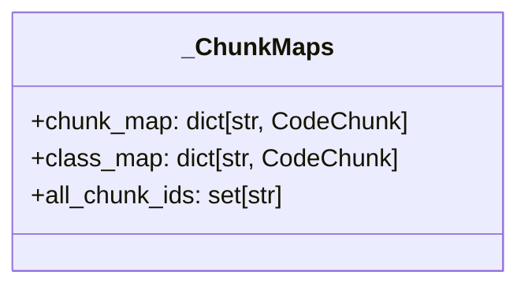
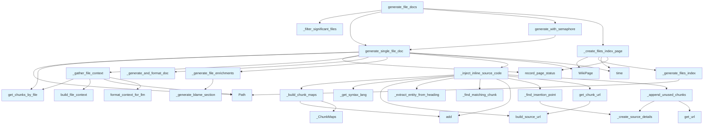

# File Overview

This module, `wiki_files`, is responsible for generating documentation for source code files by injecting inline source code blocks and building context-aware prompts for LLM-based documentation generation. It integrates with Git repository information, vector stores for code context, and various code analysis utilities to produce rich, source-linked documentation.

Key dependencies include:
- [`local_deepwiki.config.Config`](../config.md)
- `local_deepwiki.core.git_utils` for Git repository and blame information
- [`local_deepwiki.core.vectorstore.VectorStore`](../core/vectorstore.md) for code context retrieval
- `local_deepwiki.generators.api_docs` for API reference generation
- `local_deepwiki.generators.callgraph` for call graph and callers information
- `local_deepwiki.generators.context_builder` for context building
- `local_deepwiki.generators.source_refs` for source references
- `local_deepwiki.plugins.base` for plugin base functionality

Functions in this file are called by:
- `generate_file_docs` (used by wiki)
- `_inject_inline_source_code` (used by test_wiki_files_coverage)
- `_generate_blame_section` (used by test_wiki_files_coverage)

## Classes

### _ChunkMaps

Maps for looking up chunks by name.

**Attributes:**
- `chunk_map: dict[str, CodeChunk]` - Maps chunk names to their corresponding [`CodeChunk`](../models.md) objects.
- `class_map: dict[str, CodeChunk]` - Maps class names to their corresponding [`CodeChunk`](../models.md) objects.
- `all_chunk_ids: set[str]` - Set of all chunk IDs for quick lookup.

## Functions

### _get_syntax_lang

Get syntax highlighting language string.

**Parameters:**
- `language: str | None` - Programming language name.

**Returns:**
- `str` - [Language](../models.md) string for markdown code blocks.

### _create_source_details

Create a collapsible source code block for a chunk.

**Parameters:**
- `chunk: CodeChunk` - The code chunk.
- `syntax_lang: str` - Syntax highlighting language.
- `github_url: str | None` - Optional GitHub URL to link to source.

**Returns:**
- `str` - Markdown details block with source code.

### _build_chunk_maps

Build lookup maps for chunks by name.

**Parameters:**
- `chunks: list[CodeChunk]` - List of code chunks.

**Returns:**
- `_ChunkMaps` - ChunkMaps with name-to-chunk mappings.

### _extract_entity_from_heading

Extract entity name from a markdown heading.

**Parameters:**
- `line: str` - Heading line like "#### `name`" or "### class `name`".

**Returns:**
- `tuple[str | None, bool]` - Tuple of (entity_name, is_class_heading).

### _find_matching_chunk

Find the chunk that matches an entity name.

**Parameters:**
- `entity_name: str` - Name of the entity to [find](manifest.md).
- `current_class: str | None` - Current class context, if any.
- `maps: _ChunkMaps` - Chunk lookup maps.

**Returns:**
- `CodeChunk | None` - Matching chunk or None.

### _find_insertion_point

Find where to insert source code and add it.

**Parameters:**
- `lines: list[str]` - All content lines.
- `start_idx: int` - Starting line index.
- `result_lines: list[str]` - Result lines to append to.
- `chunk: CodeChunk` - Chunk to insert source for.
- `syntax_lang: str` - Syntax highlighting language.
- `chunk_url: str | None` - Optional GitHub URL.

**Returns:**
- `int` - New line index to continue from.

### _append_unused_chunks

Append unused chunks as additional source code section.

**Parameters:**
- `result_lines: list[str]` - Lines to append to.
- `chunks: list[CodeChunk]` - All chunks.
- `all_chunk_ids: set[str]` - Set of all chunk IDs.
- `used_chunks: set[str]` - Set of already-used chunk IDs.
- `syntax_lang: str` - Syntax highlighting language.
- `get_url: Callable[[CodeChunk], str | None]` - Function to get GitHub URL for a chunk.

**Returns:**
- `None`

### _inject_inline_source_code

Inject collapsible source code after each function/class in the API Reference.

**Parameters:**
- `content: str` - The markdown content to process.
- `chunks: list[CodeChunk]` - List of code chunks from the file.
- `language: str | None` - Programming language for syntax highlighting.
- `repo_info: GitRepoInfo | None` - Optional git repo info for GitHub links.

**Returns:**
- `str` - Content with inline source code blocks injected.

### get_chunk_url

Generate a GitHub URL for a chunk.

**Parameters:**
- `chunk: CodeChunk` - The code chunk.

**Returns:**
- `str | None` - GitHub URL for the chunk or None if no repo info.

### _gather_file_context

Collect chunks, imports, and related context for the file.

**Parameters:**
- `file_info: FileInfo` - File status information.
- `index_status: IndexStatus` - Index status with repo information.
- `vector_store: VectorStore` - Vector store with indexed code.

**Returns:**
- `tuple[list[CodeChunk], str, str] | None` - Tuple of (chunks_list, context_text, rich_context_text) or None if no content.

### _build_llm_prompt

Construct the LLM prompt with all context.

**Parameters:**
- `file_info: FileInfo` - File status information.
- `context: str` - Code context text.
- `rich_context_text: str` - Rich context with imports and callers.

**Returns:**
- `str` - The formatted LLM prompt string.

### _generate_and_format_doc

Call LLM and format the response.

**Parameters:**
- `prompt: str` - The LLM prompt.
- `llm: LLMProvider` - LLM provider for generation.
- `system_prompt: str` - System prompt for LLM.

**Returns:**
- `str` - The formatted documentation content.

## Integration

This module integrates with the broader codebase by:
1. Using [`local_deepwiki.config.Config`](../config.md) for configuration management.
2. Leveraging `local_deepwiki.core.git_utils` to fetch Git repository information and build source URLs.
3. Accessing [`local_deepwiki.core.vectorstore.VectorStore`](../core/vectorstore.md) for retrieving code context.
4. Utilizing `local_deepwiki.generators.api_docs`, `local_deepwiki.generators.callgraph`, and `local_deepwiki.generators.context_builder` for gathering and processing code information.
5. Using `local_deepwiki.plugins.base` for plugin architecture support.

The [main](../export/pdf.md) entry point for documentation generation is `generate_file_docs`, which orchestrates the process of gathering file context, building prompts, and generating documentation using an LLM.

## Usage Examples

### Generating Documentation for a File

```python
from local_deepwiki.generators.wiki_files import generate_file_docs

# Assuming llm_provider, vector_store, and index_status are properly initialized
doc_content = await generate_file_docs(file_info, index_status, vector_store, llm_provider)
```

### Injecting Inline Source Code

```python
from local_deepwiki.generators.wiki_files import _inject_inline_source_code

# Process markdown content with inline source code blocks
processed_content = _inject_inline_source_code(content, chunks, language, repo_info)
```

### Building LLM Prompt

```python
from local_deepwiki.generators.wiki_files import _build_llm_prompt

prompt = _build_llm_prompt(file_info, context, rich_context_text)
```

## API Reference

### Functions

#### `get_chunk_url`

```python
def get_chunk_url(chunk: CodeChunk) -> str | None
```


| [Parameter](api_docs.md) | Type | Default | Description |
|-----------|------|---------|-------------|
| `chunk` | [`CodeChunk`](../models.md) | - | - |

**Returns:** `str | None`


<details>
<summary>View Source (lines 323-326) | <a href="https://github.com/UrbanDiver/local-deepwiki-mcp/blob/[main](../export/pdf.md)/src/local_deepwiki/generators/wiki_files.py#L323-L326">GitHub</a></summary>

```python
def get_chunk_url(chunk: CodeChunk) -> str | None:
        if repo_info is None:
            return None
        return build_source_url(repo_info, chunk.file_path, chunk.start_line, chunk.end_line)
```

</details>

#### `generate_single_file_doc`

```python
async def generate_single_file_doc(file_info: FileInfo, index_status: IndexStatus, vector_store: VectorStore, llm: LLMProvider, system_prompt: str, status_manager: "WikiStatusManager", entity_registry: EntityRegistry, config: Config, full_rebuild: bool) -> tuple[WikiPage | None, bool]
```

Generate documentation for a single source file.  Coordinates the documentation generation pipeline: 1. Check if regeneration is needed 2. Gather file context (chunks, imports, related context) 3. Build LLM prompt with all context 4. Generate and format documentation via LLM 5. Add enrichments (diagrams, call graphs, examples, blame) 6. Inject inline source code and register entities


| [Parameter](api_docs.md) | Type | Default | Description |
|-----------|------|---------|-------------|
| `file_info` | [`FileInfo`](../models.md) | - | File status information. |
| `index_status` | [`IndexStatus`](../models.md) | - | Index status with repo information. |
| `vector_store` | [`VectorStore`](../core/vectorstore.md) | - | Vector store with indexed code. |
| `llm` | [`LLMProvider`](../providers/base.md) | - | LLM provider for generation. |
| `system_prompt` | `str` | - | System prompt for LLM. |
| `status_manager` | `"WikiStatusManager"` | - | Wiki status manager for incremental updates. |
| `entity_registry` | [`EntityRegistry`](crosslinks.md) | - | Entity registry for cross-linking. |
| `config` | [`Config`](../config.md) | - | Configuration. |
| `full_rebuild` | `bool` | - | If True, regenerate even if unchanged. |

**Returns:** `tuple[WikiPage | None, bool]`


<details>
<summary>View Source (lines 561-672) | <a href="https://github.com/UrbanDiver/local-deepwiki-mcp/blob/[main](../export/pdf.md)/src/local_deepwiki/generators/wiki_files.py#L561-L672">GitHub</a></summary>

```python
async def generate_single_file_doc(
    file_info: FileInfo,
    index_status: IndexStatus,
    vector_store: VectorStore,
    llm: LLMProvider,
    system_prompt: str,
    status_manager: "WikiStatusManager",
    entity_registry: EntityRegistry,
    config: Config,
    full_rebuild: bool,
) -> tuple[WikiPage | None, bool]:
    """Generate documentation for a single source file.

    Coordinates the documentation generation pipeline:
    1. Check if regeneration is needed
    2. Gather file context (chunks, imports, related context)
    3. Build LLM prompt with all context
    4. Generate and format documentation via LLM
    5. Add enrichments (diagrams, call graphs, examples, blame)
    6. Inject inline source code and register entities

    Args:
        file_info: File status information.
        index_status: Index status with repo information.
        vector_store: Vector store with indexed code.
        llm: LLM provider for generation.
        system_prompt: System prompt for LLM.
        status_manager: Wiki status manager for incremental updates.
        entity_registry: Entity registry for cross-linking.
        config: Configuration.
        full_rebuild: If True, regenerate even if unchanged.

    Returns:
        Tuple of (WikiPage or None, was_skipped).
        Returns (None, False) if file should be skipped entirely.
        Returns (page, True) if existing page was reused.
        Returns (page, False) if new page was generated.
    """
    file_path = Path(file_info.path)
    repo_path = Path(index_status.repo_path)

    # Create nested path structure: files/module/filename.md
    parts = file_path.parts
    if len(parts) > 1:
        wiki_path = f"files/{'/'.join(parts[:-1])}/{file_path.stem}.md"
    else:
        wiki_path = f"files/{file_path.stem}.md"

    source_files = [file_info.path]

    # Check if this file page needs regeneration
    if not full_rebuild and not status_manager.needs_regeneration(wiki_path, source_files):
        existing_page = await status_manager.load_existing_page(wiki_path)
        if existing_page is not None:
            # Still need to register entities for cross-linking
            all_file_chunks = await vector_store.get_chunks_by_file(file_info.path)
            entity_registry.register_from_chunks(all_file_chunks, wiki_path)
            status_manager.record_page_status(existing_page, source_files)
            return existing_page, True  # Skipped (reused existing)

    # Step 1: Gather file context (chunks, imports, related context)
    context_result = await _gather_file_context(
        file_info=file_info,
        index_status=index_status,
        vector_store=vector_store,
    )

    if context_result is None:
        return None, False  # No content to document

    file_chunks, context, rich_context_text = context_result

    # Step 2: Build the LLM prompt
    prompt = _build_llm_prompt(
        file_info=file_info,
        context=context,
        rich_context_text=rich_context_text,
    )

    # Step 3: Generate and format the documentation
    content = await _generate_and_format_doc(
        prompt=prompt,
        llm=llm,
        system_prompt=system_prompt,
    )

    # Step 4: Generate enrichments (diagrams, call graphs, examples, blame)
    abs_file_path = repo_path / file_info.path
    content = _generate_file_enrichments(
        content=content,
        abs_file_path=abs_file_path,
        repo_path=repo_path,
        file_path=file_info.path,
        all_file_chunks=file_chunks,
    )

    # Inject inline source code after each function/class in API Reference
    lang_str = file_info.language.value if file_info.language else None
    repo_info = get_repo_info(repo_path)
    content = _inject_inline_source_code(content, file_chunks, lang_str, repo_info)

    # Register entities for cross-linking
    entity_registry.register_from_chunks(file_chunks, wiki_path)

    page = WikiPage(
        path=wiki_path,
        title=f"{file_path.name}",
        content=content,
        generated_at=time.time(),
    )
    status_manager.record_page_status(page, source_files)
    return page, False  # Generated new
```

</details>

#### `generate_file_docs`

```python
async def generate_file_docs(index_status: IndexStatus, vector_store: VectorStore, llm: LLMProvider, system_prompt: str, status_manager: "WikiStatusManager", entity_registry: EntityRegistry, config: Config, progress_callback: ProgressCallback | None = None, full_rebuild: bool = False, write_callback: WriteCallback | None = None, generation_progress: "GenerationProgress | None" = None) -> tuple[list[WikiPage], int, int]
```

Generate documentation for individual source files.  Uses parallel LLM calls for faster generation, controlled by config.wiki.max_concurrent_llm_calls. Pages are written to disk immediately as they complete if write_callback is provided.


| [Parameter](api_docs.md) | Type | Default | Description |
|-----------|------|---------|-------------|
| `index_status` | [`IndexStatus`](../models.md) | - | Index status with file information. |
| `vector_store` | [`VectorStore`](../core/vectorstore.md) | - | Vector store with indexed code. |
| `llm` | [`LLMProvider`](../providers/base.md) | - | LLM provider for generation. |
| `system_prompt` | `str` | - | System prompt for LLM. |
| `status_manager` | `"WikiStatusManager"` | - | Wiki status manager for incremental updates. |
| `entity_registry` | [`EntityRegistry`](crosslinks.md) | - | Entity registry for cross-linking. |
| `config` | [`Config`](../config.md) | - | Configuration. |
| [`progress_callback`](../handlers.md) | `ProgressCallback | None` | `None` | Optional progress callback. |
| `full_rebuild` | `bool` | `False` | If True, regenerate all pages. |
| `write_callback` | `WriteCallback | None` | `None` | Optional async callback to write pages immediately as they complete. |
| `generation_progress` | `"GenerationProgress | None"` | `None` | Optional live progress tracker for status updates. |

**Returns:** `tuple[list[WikiPage], int, int]`


<details>
<summary>View Source (lines 746-855) | <a href="https://github.com/UrbanDiver/local-deepwiki-mcp/blob/[main](../export/pdf.md)/src/local_deepwiki/generators/wiki_files.py#L746-L855">GitHub</a></summary>

```python
async def generate_file_docs(
    index_status: IndexStatus,
    vector_store: VectorStore,
    llm: LLMProvider,
    system_prompt: str,
    status_manager: "WikiStatusManager",
    entity_registry: EntityRegistry,
    config: Config,
    progress_callback: ProgressCallback | None = None,
    full_rebuild: bool = False,
    write_callback: WriteCallback | None = None,
    generation_progress: "GenerationProgress | None" = None,
) -> tuple[list[WikiPage], int, int]:
    """Generate documentation for individual source files.

    Uses parallel LLM calls for faster generation, controlled by
    config.wiki.max_concurrent_llm_calls. Pages are written to disk
    immediately as they complete if write_callback is provided.

    Args:
        index_status: Index status with file information.
        vector_store: Vector store with indexed code.
        llm: LLM provider for generation.
        system_prompt: System prompt for LLM.
        status_manager: Wiki status manager for incremental updates.
        entity_registry: Entity registry for cross-linking.
        config: Configuration.
        progress_callback: Optional progress callback.
        full_rebuild: If True, regenerate all pages.
        write_callback: Optional async callback to write pages immediately as they complete.
        generation_progress: Optional live progress tracker for status updates.

    Returns:
        Tuple of (pages list, generated count, skipped count).
    """
    significant_files = _filter_significant_files(index_status.files, config.wiki.max_file_docs)
    if not significant_files:
        return [], 0, 0

    # Use semaphore to limit concurrent LLM calls
    max_concurrent = config.wiki.max_concurrent_llm_calls
    semaphore = asyncio.Semaphore(max_concurrent)
    logger.info(
        f"Generating file docs for {len(significant_files)} files "
        f"(max {max_concurrent} concurrent)"
    )

    if generation_progress:
        generation_progress.start_phase("file_docs", total=len(significant_files))

    async def generate_with_semaphore(
        file_info: FileInfo,
    ) -> tuple[FileInfo, WikiPage | None, bool]:
        """Generate doc for a file, returning file_info for tracking."""
        async with semaphore:
            logger.debug(f"Generating doc for {file_info.path}")
            page, was_skipped = await generate_single_file_doc(
                file_info=file_info,
                index_status=index_status,
                vector_store=vector_store,
                llm=llm,
                system_prompt=system_prompt,
                status_manager=status_manager,
                entity_registry=entity_registry,
                config=config,
                full_rebuild=full_rebuild,
            )
            return file_info, page, was_skipped

    # Create and process tasks
    tasks = [asyncio.create_task(generate_with_semaphore(f)) for f in significant_files]
    pages: list[WikiPage] = []
    pages_generated = 0
    pages_skipped = 0

    for coro in asyncio.as_completed(tasks):
        try:
            file_info, page, was_skipped = await coro

            if page is not None:
                pages.append(page)
                if was_skipped:
                    pages_skipped += 1
                else:
                    pages_generated += 1

                if write_callback:
                    await write_callback(page)

                if progress_callback:
                    progress_callback(f"Generated {file_info.path}", len(pages), len(tasks))

            if generation_progress:
                generation_progress.complete_file(file_info.path)

        except Exception as e:
            logger.error(f"Error generating file doc: {e}")
            if generation_progress:
                generation_progress.complete_file()

    # Create files index
    if pages:
        files_index = _create_files_index_page(pages, significant_files, status_manager)
        pages.insert(0, files_index)

    if generation_progress:
        generation_progress.complete_phase()

    logger.info(f"File docs complete: {pages_generated} generated, {pages_skipped} skipped")
    return pages, pages_generated, pages_skipped
```

</details>

#### `generate_with_semaphore`

```python
async def generate_with_semaphore(file_info: FileInfo) -> tuple[FileInfo, WikiPage | None, bool]
```

Generate doc for a file, returning file_info for tracking.


| [Parameter](api_docs.md) | Type | Default | Description |
|-----------|------|---------|-------------|
| `file_info` | [`FileInfo`](../models.md) | - | - |

**Returns:** `tuple[FileInfo, WikiPage | None, bool]`


<details>
<summary>View Source (lines 796-813) | <a href="https://github.com/UrbanDiver/local-deepwiki-mcp/blob/[main](../export/pdf.md)/src/local_deepwiki/generators/wiki_files.py#L796-L813">GitHub</a></summary>

```python
async def generate_with_semaphore(
        file_info: FileInfo,
    ) -> tuple[FileInfo, WikiPage | None, bool]:
        """Generate doc for a file, returning file_info for tracking."""
        async with semaphore:
            logger.debug(f"Generating doc for {file_info.path}")
            page, was_skipped = await generate_single_file_doc(
                file_info=file_info,
                index_status=index_status,
                vector_store=vector_store,
                llm=llm,
                system_prompt=system_prompt,
                status_manager=status_manager,
                entity_registry=entity_registry,
                config=config,
                full_rebuild=full_rebuild,
            )
            return file_info, page, was_skipped
```

</details>

## Class Diagram


```mermaid
classDiagram
    class _ChunkMaps {
        +chunk_map: dict[str, CodeChunk]
        +class_map: dict[str, CodeChunk]
        +all_chunk_ids: set[str]
    }
```

## Call Graph


```mermaid
flowchart TD
    N0[Path]
    N1[WikiPage]
    N2[_ChunkMaps]
    N3[_append_unused_chunks]
    N4[_build_chunk_maps]
    N5[_create_files_index_page]
    N6[_create_source_details]
    N7[_extract_entity_from_heading]
    N8[_filter_significant_files]
    N9[_find_insertion_point]
    N10[_find_matching_chunk]
    N11[_gather_file_context]
    N12[_generate_and_format_doc]
    N13[_generate_blame_section]
    N14[_generate_file_enrichments]
    N15[_generate_files_index]
    N16[_get_syntax_lang]
    N17[_inject_inline_source_code]
    N18[add]
    N19[build_file_context]
    N20[build_source_url]
    N21[format_context_for_llm]
    N22[generate_file_docs]
    N23[generate_single_file_doc]
    N24[generate_with_semaphore]
    N25[get_chunk_url]
    N26[get_chunks_by_file]
    N27[get_url]
    N28[record_page_status]
    N29[time]
    N4 --> N18
    N4 --> N2
    N9 --> N6
    N3 --> N6
    N3 --> N27
    N17 --> N4
    N17 --> N16
    N17 --> N20
    N17 --> N7
    N17 --> N10
    N17 --> N18
    N17 --> N9
    N17 --> N25
    N17 --> N3
    N25 --> N20
    N11 --> N26
    N11 --> N19
    N11 --> N0
    N11 --> N21
    N14 --> N13
    N23 --> N0
    N23 --> N26
    N23 --> N28
    N23 --> N11
    N23 --> N12
    N23 --> N14
    N23 --> N17
    N23 --> N1
    N23 --> N29
    N5 --> N1
    N5 --> N15
    N5 --> N29
    N5 --> N28
    N22 --> N8
    N22 --> N23
    N22 --> N24
    N22 --> N5
    N24 --> N23
    N15 --> N0
    classDef func fill:#e1f5fe
    class N0,N1,N2,N3,N4,N5,N6,N7,N8,N9,N10,N11,N12,N13,N14,N15,N16,N17,N18,N19,N20,N21,N22,N23,N24,N25,N26,N27,N28,N29 func
```

## Used By

Functions and methods in this file and their callers:

- **`Path`**: called by `_gather_file_context`, `_generate_files_index`, `generate_single_file_doc`
- **`Semaphore`**: called by `generate_file_docs`
- **[`WikiPage`](../export/streaming.md)**: called by `_create_files_index_page`, `generate_single_file_doc`
- **`_ChunkMaps`**: called by `_build_chunk_maps`
- **`_append_unused_chunks`**: called by `_inject_inline_source_code`
- **`_build_chunk_maps`**: called by `_inject_inline_source_code`
- **`_build_llm_prompt`**: called by `generate_single_file_doc`
- **`_create_files_index_page`**: called by `generate_file_docs`
- **`_create_source_details`**: called by `_append_unused_chunks`, `_find_insertion_point`
- **`_extract_entity_from_heading`**: called by `_inject_inline_source_code`
- **`_filter_significant_files`**: called by `generate_file_docs`
- **`_find_insertion_point`**: called by `_inject_inline_source_code`
- **`_find_matching_chunk`**: called by `_inject_inline_source_code`
- **`_gather_file_context`**: called by `generate_single_file_doc`
- **`_generate_and_format_doc`**: called by `generate_single_file_doc`
- **`_generate_blame_section`**: called by `_generate_file_enrichments`
- **`_generate_file_enrichments`**: called by `generate_single_file_doc`
- **`_generate_files_index`**: called by `_create_files_index_page`
- **`_get_syntax_lang`**: called by `_inject_inline_source_code`
- **`_inject_inline_source_code`**: called by `generate_single_file_doc`
- **`_is_test_file`**: called by `_filter_significant_files`
- **`add`**: called by `_build_chunk_maps`, `_inject_inline_source_code`
- **`as_completed`**: called by `generate_file_docs`
- **[`build_file_context`](context_builder.md)**: called by `_gather_file_context`
- **[`build_source_url`](../core/git_utils.md)**: called by `_inject_inline_source_code`, `get_chunk_url`
- **`complete_file`**: called by `generate_file_docs`
- **`complete_phase`**: called by `generate_file_docs`
- **`create_task`**: called by `generate_file_docs`
- **`exists`**: called by `_generate_file_enrichments`
- **[`format_blame_date`](../core/git_utils.md)**: called by `_generate_blame_section`
- **[`format_context_for_llm`](context_builder.md)**: called by `_gather_file_context`
- **`generate`**: called by `_generate_and_format_doc`
- **[`generate_class_diagram`](diagrams.md)**: called by `_generate_file_enrichments`
- **`generate_single_file_doc`**: called by `generate_file_docs`, `generate_with_semaphore`
- **`generate_with_semaphore`**: called by `generate_file_docs`
- **`get_chunk_url`**: called by `_inject_inline_source_code`
- **`get_chunks_by_file`**: called by `_gather_file_context`, `generate_single_file_doc`
- **[`get_file_api_docs`](api_docs.md)**: called by `_generate_file_enrichments`
- **[`get_file_call_graph`](callgraph.md)**: called by `_generate_file_enrichments`
- **[`get_file_callers`](callgraph.md)**: called by `_generate_file_enrichments`
- **[`get_file_entity_blame`](../core/git_utils.md)**: called by `_generate_blame_section`
- **[`get_file_examples`](test_examples.md)**: called by `_generate_file_enrichments`
- **[`get_repo_info`](../core/git_utils.md)**: called by `generate_single_file_doc`
- **`get_url`**: called by `_append_unused_chunks`
- **`load_existing_page`**: called by `generate_single_file_doc`
- **`needs_regeneration`**: called by `generate_single_file_doc`
- **[`progress_callback`](../handlers.md)**: called by `generate_file_docs`
- **`record_page_status`**: called by `_create_files_index_page`, `generate_single_file_doc`
- **`register_from_chunks`**: called by `generate_single_file_doc`
- **`setdefault`**: called by `_generate_files_index`
- **`sort`**: called by `_generate_blame_section`
- **`start_phase`**: called by `generate_file_docs`
- **`sub`**: called by `_generate_and_format_doc`
- **`time`**: called by `_create_files_index_page`, `generate_single_file_doc`
- **`write_callback`**: called by `generate_file_docs`

## Usage Examples

*Examples extracted from test files*

### Test returns empty when no files in index

From `test_wiki_files_coverage.py::TestGenerateFileDocs::test_returns_empty_for_no_files`:

```python
pages, generated, skipped = await generate_file_docs(
    index_status=index_status,
    vector_store=mock_vector_store,
    llm=mock_llm,
    system_prompt="System prompt",
    status_manager=mock_status_manager,
    entity_registry=mock_entity_registry,
    config=mock_config,
    full_rebuild=True,
)

assert pages == []
assert generated == 0
```

### Test filters out __init__.py files

From `test_wiki_files_coverage.py::TestGenerateFileDocs::test_filters_init_files`:

```python
pages, generated, skipped = await generate_file_docs(
    index_status=index_status,
    vector_store=mock_vector_store,
    llm=mock_llm,
    system_prompt="System prompt",
    status_manager=mock_status_manager,
    entity_registry=mock_entity_registry,
    config=mock_config,
    full_rebuild=True,
)

assert pages == []
```

### Test generates basic index content

From `test_wiki_files_coverage.py::TestGenerateFilesIndex::test_generates_basic_index`:

```python
pages = [
    WikiPage(
        path="files/src/main.md", title="main.py", content="", generated_at=time.time()
    ),
    WikiPage(
        path="files/src/utils.md", title="utils.py", content="", generated_at=time.time()
    ),
]

result = _generate_files_index(pages)

assert "# Source Files" in result
assert "[main.py]" in result
assert "[utils.py]" in result
```

### Test groups files by directory

From `test_wiki_files_coverage.py::TestGenerateFilesIndex::test_groups_by_directory`:

```python
pages = [
    WikiPage(
        path="files/src/main.md", title="main.py", content="", generated_at=time.time()
    ),
    WikiPage(
        path="files/tests/test_main.md",
        title="test_main.py",
        content="",
        generated_at=time.time(),
    ),
]

result = _generate_files_index(pages)

assert "## src" in result
assert "## tests" in result
```

### Test creates a properly formatted details block

From `test_wiki_files_coverage.py::TestCreateSourceDetails::test_creates_details_block`:

```python
chunk = make_code_chunk(
    name="my_func",
    chunk_type=ChunkType.FUNCTION,
    content="def my_func():\n    pass",
    start_line=10,
    end_line=12,
)

result = _create_source_details(chunk, "python")

assert "<details>" in result
assert "</details>" in result
assert "View Source (lines 10-12)" in result
assert "```python" in result
assert "def my_func():" in result
```


## Last Modified

| Entity | Type | Author | Date | Commit |
|--------|------|--------|------|--------|
| `_is_test_file` | function | Brian Breidenbach | 2 weeks ago | `1e08705` Refactor generate_file_docs... |
| `_filter_significant_files` | function | Brian Breidenbach | 2 weeks ago | `1e08705` Refactor generate_file_docs... |
| `_create_files_index_page` | function | Brian Breidenbach | 2 weeks ago | `1e08705` Refactor generate_file_docs... |
| `generate_file_docs` | function | Brian Breidenbach | 2 weeks ago | `1e08705` Refactor generate_file_docs... |
| `_ChunkMaps` | class | Brian Breidenbach | 2 weeks ago | `8c219ae` Refactor long functions in ... |
| `_build_chunk_maps` | function | Brian Breidenbach | 2 weeks ago | `8c219ae` Refactor long functions in ... |
| `_extract_entity_from_heading` | function | Brian Breidenbach | 2 weeks ago | `8c219ae` Refactor long functions in ... |
| `_find_matching_chunk` | function | Brian Breidenbach | 2 weeks ago | `8c219ae` Refactor long functions in ... |
| `_find_insertion_point` | function | Brian Breidenbach | 2 weeks ago | `8c219ae` Refactor long functions in ... |
| `_append_unused_chunks` | function | Brian Breidenbach | 2 weeks ago | `8c219ae` Refactor long functions in ... |
| `_inject_inline_source_code` | function | Brian Breidenbach | 2 weeks ago | `8c219ae` Refactor long functions in ... |
| `_gather_file_context` | function | Brian Breidenbach | 2 weeks ago | `85c8346` Performance optimizations a... |
| `_build_llm_prompt` | function | Brian Breidenbach | 2 weeks ago | `85c8346` Performance optimizations a... |
| `_generate_and_format_doc` | function | Brian Breidenbach | 2 weeks ago | `85c8346` Performance optimizations a... |
| `_generate_file_enrichments` | function | Brian Breidenbach | 2 weeks ago | `85c8346` Performance optimizations a... |
| `generate_single_file_doc` | function | Brian Breidenbach | 2 weeks ago | `85c8346` Performance optimizations a... |
| `_generate_blame_section` | function | Brian Breidenbach | 2 weeks ago | `85c8346` Performance optimizations a... |
| `generate_with_semaphore` | function | Brian Breidenbach | 2 weeks ago | `ac74e3b` Add progress tracking with ... |
| `_create_source_details` | function | Brian Breidenbach | 3 weeks ago | `62e3290` Add GitHub source links and... |
| `get_chunk_url` | function | Brian Breidenbach | 3 weeks ago | `62e3290` Add GitHub source links and... |
| `_get_syntax_lang` | function | Brian Breidenbach | 3 weeks ago | `d275583` Add inline expandable sourc... |
| `_generate_files_index` | function | Brian Breidenbach | 3 weeks ago | `3defaaa` Refactor: Extract validatio... |

## Additional Source Code

Source code for functions and methods not listed in the API Reference above.

#### `_get_syntax_lang`

<details>
<summary>View Source (lines 43-68) | <a href="https://github.com/UrbanDiver/local-deepwiki-mcp/blob/main/src/local_deepwiki/generators/wiki_files.py#L43-L68">GitHub</a></summary>

```python
def _get_syntax_lang(language: str | None) -> str:
    """Get syntax highlighting language string.

    Args:
        language: Programming language name.

    Returns:
        [Language](../models.md) string for markdown code blocks.
    """
    lang_map = {
        "python": "python",
        "javascript": "javascript",
        "typescript": "typescript",
        "tsx": "tsx",
        "go": "go",
        "rust": "rust",
        "java": "java",
        "c": "c",
        "cpp": "cpp",
        "swift": "swift",
        "ruby": "ruby",
        "php": "php",
        "kotlin": "kotlin",
        "csharp": "csharp",
    }
    return lang_map.get(language or "", "")
```

</details>


#### `_create_source_details`

<details>
<summary>View Source (lines 71-97) | <a href="https://github.com/UrbanDiver/local-deepwiki-mcp/blob/main/src/local_deepwiki/generators/wiki_files.py#L71-L97">GitHub</a></summary>

```python
def _create_source_details(
    chunk: [CodeChunk](../models.md), syntax_lang: str, github_url: str | None = None
) -> str:
    """Create a collapsible source code block for a chunk.

    Args:
        chunk: The code chunk.
        syntax_lang: Syntax highlighting language.
        github_url: Optional GitHub URL to link to source.

    Returns:
        Markdown details block with source code.
    """
    if github_url:
        summary = f'View Source (lines {chunk.start_line}-{chunk.end_line}) | <a href="{github_url}">GitHub</a>'
    else:
        summary = f"View Source (lines {chunk.start_line}-{chunk.end_line})"

    return f"""<details>
<summary>{summary}</summary>

```{syntax_lang}
{chunk.content}
```

</details>
"""
```

</details>


### `_ChunkMaps`

<details>
<summary>View Source (lines 101-106) | <a href="https://github.com/UrbanDiver/local-deepwiki-mcp/blob/main/src/local_deepwiki/generators/wiki_files.py#L101-L106">GitHub</a></summary>

```python
class _ChunkMaps:
    """Maps for looking up chunks by name."""

    chunk_map: dict[str, [CodeChunk](../models.md)]
    class_map: dict[str, [CodeChunk](../models.md)]
    all_chunk_ids: set[str]
```

</details>


#### `_build_chunk_maps`

<details>
<summary>View Source (lines 109-136) | <a href="https://github.com/UrbanDiver/local-deepwiki-mcp/blob/main/src/local_deepwiki/generators/wiki_files.py#L109-L136">GitHub</a></summary>

```python
def _build_chunk_maps(chunks: list[[CodeChunk](../models.md)]) -> _ChunkMaps:
    """Build lookup maps for chunks by name.

    Args:
        chunks: List of code chunks.

    Returns:
        ChunkMaps with name-to-chunk mappings.
    """
    chunk_map: dict[str, [CodeChunk](../models.md)] = {}
    class_map: dict[str, [CodeChunk](../models.md)] = {}
    all_chunk_ids: set[str] = set()

    for chunk in chunks:
        if chunk.name and chunk.chunk_type in (
            [ChunkType](../models.md).CLASS,
            [ChunkType](../models.md).FUNCTION,
            [ChunkType](../models.md).METHOD,
        ):
            all_chunk_ids.add(chunk.id)
            chunk_map[chunk.name] = chunk
            if chunk.parent_name:
                qualified_name = f"{chunk.parent_name}.{chunk.name}"
                chunk_map[qualified_name] = chunk
            if chunk.chunk_type == [ChunkType](../models.md).CLASS:
                class_map[chunk.name] = chunk

    return _ChunkMaps(chunk_map, class_map, all_chunk_ids)
```

</details>


#### `_extract_entity_from_heading`

<details>
<summary>View Source (lines 139-164) | <a href="https://github.com/UrbanDiver/local-deepwiki-mcp/blob/main/src/local_deepwiki/generators/wiki_files.py#L139-L164">GitHub</a></summary>

```python
def _extract_entity_from_heading(line: str) -> tuple[str | None, bool]:
    """Extract entity name from a markdown heading.

    Args:
        line: Heading line like "#### `name`" or "### class `name`".

    Returns:
        Tuple of (entity_name, is_class_heading).
    """
    start = line.[find](manifest.md)("`") + 1
    end = line.find("`", start)
    if start <= 0 or end <= start:
        return None, False

    entity_name = line[start:end]

    # Normalize: strip signature
    if "(" in entity_name:
        entity_name = entity_name.split("(")[0]

    # Check if class heading
    is_class = entity_name.startswith("class ")
    if is_class:
        entity_name = entity_name[6:].strip()

    return entity_name, is_class
```

</details>


#### `_find_matching_chunk`

<details>
<summary>View Source (lines 167-200) | <a href="https://github.com/UrbanDiver/local-deepwiki-mcp/blob/main/src/local_deepwiki/generators/wiki_files.py#L167-L200">GitHub</a></summary>

```python
def _find_matching_chunk(
    entity_name: str,
    current_class: str | None,
    maps: _ChunkMaps,
) -> [CodeChunk](../models.md) | None:
    """Find the chunk that matches an entity name.

    Args:
        entity_name: Name of the entity to [find](manifest.md).
        current_class: Current class context, if any.
        maps: Chunk lookup maps.

    Returns:
        Matching chunk or None.
    """
    matched_chunk: [CodeChunk](../models.md) | None = None

    # Try qualified name first for methods
    if current_class and entity_name != current_class:
        qualified_name = f"{current_class}.{entity_name}"
        matched_chunk = maps.chunk_map.get(qualified_name)

    # Try simple name
    if matched_chunk is None:
        candidate = maps.chunk_map.get(entity_name)
        if candidate is not None:
            if candidate.parent_name is None or candidate.parent_name == current_class:
                matched_chunk = candidate

    # Fallback to class source for unmatched methods
    if matched_chunk is None and current_class and entity_name != current_class:
        matched_chunk = maps.class_map.get(current_class)

    return matched_chunk
```

</details>


#### `_find_insertion_point`

<details>
<summary>View Source (lines 203-258) | <a href="https://github.com/UrbanDiver/local-deepwiki-mcp/blob/main/src/local_deepwiki/generators/wiki_files.py#L203-L258">GitHub</a></summary>

```python
def _find_insertion_point(
    lines: list[str],
    start_idx: int,
    result_lines: list[str],
    chunk: [CodeChunk](../models.md),
    syntax_lang: str,
    chunk_url: str | None,
) -> int:
    """Find where to insert source code and add it.

    Args:
        lines: All content lines.
        start_idx: Starting line index.
        result_lines: Result lines to append to.
        chunk: Chunk to insert source for.
        syntax_lang: Syntax highlighting language.
        chunk_url: Optional GitHub URL.

    Returns:
        New line index to continue from.
    """
    j = start_idx
    found_returns = False

    while j < len(lines):
        next_line = lines[j]

        # Stop at next heading of same or higher level
        if next_line.startswith(("#### ", "### ", "## ")):
            if not found_returns:
                result_lines.append("")
                result_lines.append(_create_source_details(chunk, syntax_lang, chunk_url))
            return j - 1

        # Track if we found Returns
        if next_line.startswith("**Returns:**"):
            found_returns = True
            result_lines.append(lines[j])
            j += 1
            # Skip blank lines after Returns
            while j < len(lines) and lines[j].strip() == "":
                result_lines.append(lines[j])
                j += 1
            # Insert source code here
            result_lines.append("")
            result_lines.append(_create_source_details(chunk, syntax_lang, chunk_url))
            return j - 1

        result_lines.append(lines[j])
        j += 1

    # Reached end of file
    if not found_returns:
        result_lines.append("")
        result_lines.append(_create_source_details(chunk, syntax_lang, chunk_url))
    return j - 1
```

</details>


#### `_append_unused_chunks`

<details>
<summary>View Source (lines 261-296) | <a href="https://github.com/UrbanDiver/local-deepwiki-mcp/blob/main/src/local_deepwiki/generators/wiki_files.py#L261-L296">GitHub</a></summary>

```python
def _append_unused_chunks(
    result_lines: list[str],
    chunks: list[[CodeChunk](../models.md)],
    all_chunk_ids: set[str],
    used_chunks: set[str],
    syntax_lang: str,
    get_url: Callable[[[CodeChunk](../models.md)], str | None],
) -> None:
    """Append unused chunks as additional source code section.

    Args:
        result_lines: Lines to append to.
        chunks: All chunks.
        all_chunk_ids: Set of all chunk IDs.
        used_chunks: Set of already-used chunk IDs.
        syntax_lang: Syntax highlighting language.
        get_url: Function to get GitHub URL for a chunk.
    """
    unused = [c for c in chunks if c.id in all_chunk_ids and c.id not in used_chunks]
    if not unused:
        return

    result_lines.append("")
    result_lines.append("## Additional Source Code")
    result_lines.append("")
    result_lines.append(
        "Source code for functions and methods not listed in the API Reference above."
    )
    result_lines.append("")

    for chunk in sorted(unused, key=lambda c: c.start_line):
        heading = "###" if chunk.chunk_type == [ChunkType](../models.md).CLASS else "####"
        result_lines.append(f"{heading} `{chunk.name}`")
        result_lines.append("")
        result_lines.append(_create_source_details(chunk, syntax_lang, get_url(chunk)))
        result_lines.append("")
```

</details>


#### `_inject_inline_source_code`

<details>
<summary>View Source (lines 299-365) | <a href="https://github.com/UrbanDiver/local-deepwiki-mcp/blob/main/src/local_deepwiki/generators/wiki_files.py#L299-L365">GitHub</a></summary>

```python
def _inject_inline_source_code(
    content: str,
    chunks: list[[CodeChunk](../models.md)],
    language: str | None,
    repo_info: [GitRepoInfo](../core/git_utils.md) | None = None,
) -> str:
    """Inject collapsible source code after each function/class in the API Reference.

    Args:
        content: The markdown content to process.
        chunks: List of code chunks from the file.
        language: Programming language for syntax highlighting.
        repo_info: Optional git repo info for GitHub links.

    Returns:
        Content with inline source code blocks injected.
    """
    maps = _build_chunk_maps(chunks)
    if not maps.chunk_map:
        return content

    syntax_lang = _get_syntax_lang(language)
    used_chunks: set[str] = set()

    def get_chunk_url(chunk: [CodeChunk](../models.md)) -> str | None:
        if repo_info is None:
            return None
        return [build_source_url](../core/git_utils.md)(repo_info, chunk.file_path, chunk.start_line, chunk.end_line)

    lines = content.split("\n")
    result_lines: list[str] = []
    current_class: str | None = None
    i = 0

    while i < len(lines):
        line = lines[i]
        result_lines.append(line)

        # Track class context
        if line.startswith("### class `"):
            entity, _ = _extract_entity_from_heading(line)
            if entity:
                current_class = entity

        # Look for API Reference headings
        if line.startswith(("#### `", "### `", "### class `")):
            entity_name, is_class = _extract_entity_from_heading(line)
            if entity_name:
                if is_class:
                    current_class = entity_name

                matched_chunk = _find_matching_chunk(entity_name, current_class, maps)
                if matched_chunk is not None:
                    used_chunks.add(matched_chunk.id)
                    i = _find_insertion_point(
                        lines, i + 1, result_lines, matched_chunk,
                        syntax_lang, get_chunk_url(matched_chunk)
                    )

        i += 1

    _append_unused_chunks(
        result_lines, chunks, maps.all_chunk_ids, used_chunks,
        syntax_lang, get_chunk_url
    )

    return "\n".join(result_lines)
```

</details>


#### `_gather_file_context`

<details>
<summary>View Source (lines 368-410) | <a href="https://github.com/UrbanDiver/local-deepwiki-mcp/blob/main/src/local_deepwiki/generators/wiki_files.py#L368-L410">GitHub</a></summary>

```python
async def _gather_file_context(
    file_info: [FileInfo](../models.md),
    index_status: [IndexStatus](../models.md),
    vector_store: [VectorStore](../core/vectorstore.md),
) -> tuple[list[[CodeChunk](../models.md)], str, str] | None:
    """Collect chunks, imports, and related context for the file.

    Args:
        file_info: File status information.
        index_status: Index status with repo information.
        vector_store: Vector store with indexed code.

    Returns:
        Tuple of (chunks_list, context_text, rich_context_text) or None if no content.
    """
    # Get all chunks for this file using direct lookup (efficient scalar index)
    file_chunks = await vector_store.get_chunks_by_file(file_info.path)

    if not file_chunks:
        return None  # No content to document

    # Build context from chunks
    context_parts = []
    for chunk in file_chunks[:15]:  # Limit context size
        context_parts.append(
            f"Type: {chunk.chunk_type.value}\n"
            f"Name: {chunk.name}\n"
            f"Lines: {chunk.start_line}-{chunk.end_line}\n"
            f"```\n{chunk.content[:600]}\n```"
        )

    context = "\n\n".join(context_parts)

    # Build rich context with imports, callers, and related files
    rich_context = await [build_file_context](context_builder.md)(
        file_path=file_info.path,
        chunks=file_chunks,
        repo_path=Path(index_status.repo_path),
        vector_store=vector_store,
    )
    rich_context_text = [format_context_for_llm](context_builder.md)(rich_context)

    return file_chunks, context, rich_context_text
```

</details>


#### `_build_llm_prompt`

<details>
<summary>View Source (lines 413-453) | <a href="https://github.com/UrbanDiver/local-deepwiki-mcp/blob/main/src/local_deepwiki/generators/wiki_files.py#L413-L453">GitHub</a></summary>

```python
def _build_llm_prompt(
    file_info: [FileInfo](../models.md),
    context: str,
    rich_context_text: str,
) -> str:
    """Construct the LLM prompt with all context.

    Args:
        file_info: File status information.
        context: Code context text.
        rich_context_text: Rich context with imports and callers.

    Returns:
        The formatted LLM prompt string.
    """
    return f"""Generate documentation for the file '{file_info.path}' based on the code and context provided.

[Language](../models.md): {file_info.language}
Total code chunks: {file_info.chunk_count}

{rich_context_text}
## Code Contents
{context}

Generate documentation that includes:
1. **File Overview**: Purpose of this file based on the code shown and its dependencies
2. **Classes**: Document each class visible in the code with its purpose and key methods
3. **Functions**: Document each function with parameters and return values as shown
4. **Integration**: How this file fits into the larger codebase (based on imports and callers)
5. **Usage Examples**: Show how to use the components (based on their actual signatures)

CRITICAL CONSTRAINTS:
- ONLY document classes, methods, and functions that appear in the code above
- Do NOT invent additional methods or parameters not shown
- Do NOT fabricate usage examples with APIs not visible in the code
- Write class names as plain text (e.g., "The [WikiGenerator](wiki.md) class") for cross-linking
- Use the dependency and caller information to explain integration, but don't fabricate details
- Only use backticks for actual code snippets

Format as markdown with clear sections.
Do NOT include mermaid class diagrams - they will be auto-generated."""
```

</details>


#### `_generate_and_format_doc`

<details>
<summary>View Source (lines 456-481) | <a href="https://github.com/UrbanDiver/local-deepwiki-mcp/blob/main/src/local_deepwiki/generators/wiki_files.py#L456-L481">GitHub</a></summary>

```python
async def _generate_and_format_doc(
    prompt: str,
    llm: [LLMProvider](../providers/base.md),
    system_prompt: str,
) -> str:
    """Call LLM and format the response.

    Args:
        prompt: The LLM prompt.
        llm: LLM provider for generation.
        system_prompt: System prompt for LLM.

    Returns:
        The formatted documentation content.
    """
    content = await llm.generate(prompt, system_prompt=system_prompt)

    # Strip any LLM-generated class diagram sections (we add our own)
    content = re.sub(
        r"\n*##\s*Class\s*Diagram\s*\n+```mermaid\s*\n+classDiagram.*?```",
        "",
        content,
        flags=re.DOTALL | re.IGNORECASE,
    )

    return content
```

</details>


#### `_generate_file_enrichments`

<details>
<summary>View Source (lines 484-558) | <a href="https://github.com/UrbanDiver/local-deepwiki-mcp/blob/main/src/local_deepwiki/generators/wiki_files.py#L484-L558">GitHub</a></summary>

```python
def _generate_file_enrichments(
    content: str,
    abs_file_path: Path,
    repo_path: Path,
    file_path: str,
    all_file_chunks: list[[CodeChunk](../models.md)],
) -> str:
    """Generate diagrams, call graphs, examples, and blame info.

    Args:
        content: The base documentation content.
        abs_file_path: Absolute path to the source file.
        repo_path: Path to the repository root.
        file_path: Relative path to the source file.
        all_file_chunks: All code chunks from the file.

    Returns:
        The enriched documentation content.
    """
    # Generate API reference section with type signatures
    if abs_file_path.exists():
        api_docs = [get_file_api_docs](api_docs.md)(abs_file_path)
        if api_docs:
            content += "\n\n## API Reference\n\n" + api_docs

    # Generate class diagram if file has classes
    class_diagram = [generate_class_diagram](diagrams.md)(all_file_chunks)
    if class_diagram:
        content += "\n\n## Class Diagram\n\n" + class_diagram

    # Generate call graph diagram and used-by information
    if abs_file_path.exists():
        call_graph = [get_file_call_graph](callgraph.md)(abs_file_path, repo_path)
        if call_graph:
            content += "\n\n## Call Graph\n\n```mermaid\n" + call_graph + "\n```"

        # Add "Used by" section showing callers for each function
        callers_map = [get_file_callers](callgraph.md)(abs_file_path, repo_path)
        if callers_map:
            used_by_lines = [
                "## Used By",
                "",
                "Functions and methods in this file and their callers:",
                "",
            ]
            for callee in sorted(callers_map.keys()):
                callers = callers_map[callee]
                if callers:
                    caller_list = ", ".join(f"`{c}`" for c in sorted(callers))
                    used_by_lines.append(f"- **`{callee}`**: called by {caller_list}")
            if len(used_by_lines) > 4:  # More than just the [header](../../../coverage_openai_embeddings/coverage_html_cb_dd2e7eb5.md)
                content += "\n\n" + "\n".join(used_by_lines)

    # Add usage examples from test files
    entity_names = [chunk.name for chunk in all_file_chunks if chunk.name and len(chunk.name) > 2]
    if entity_names:
        examples_md = [get_file_examples](test_examples.md)(
            source_file=abs_file_path,
            repo_root=repo_path,
            entity_names=entity_names,
            max_examples=5,
        )
        if examples_md:
            content += "\n\n" + examples_md

    # Add git blame "Last Modified" section
    blame_section = _generate_blame_section(
        repo_path=repo_path,
        file_path=file_path,
        chunks=all_file_chunks,
    )
    if blame_section:
        content += "\n\n" + blame_section

    return content
```

</details>


#### `_is_test_file`

<details>
<summary>View Source (lines 679-691) | <a href="https://github.com/UrbanDiver/local-deepwiki-mcp/blob/main/src/local_deepwiki/generators/wiki_files.py#L679-L691">GitHub</a></summary>

```python
def _is_test_file(path: str) -> bool:
    """Check if a file is a test file in tests/ directory.

    Note: Don't skip test_*.py in src/ (e.g., test_examples.py is a source file).

    Args:
        path: File path to check.

    Returns:
        True if file is in tests/ directory.
    """
    parts = path.split("/")
    return "tests" in parts
```

</details>


#### `_filter_significant_files`

<details>
<summary>View Source (lines 694-717) | <a href="https://github.com/UrbanDiver/local-deepwiki-mcp/blob/main/src/local_deepwiki/generators/wiki_files.py#L694-L717">GitHub</a></summary>

```python
def _filter_significant_files(files: list[[FileInfo](../models.md)], max_files: int) -> list[[FileInfo](../models.md)]:
    """Filter and limit files for documentation generation.

    Args:
        files: All indexed files.
        max_files: Maximum files to document (0 = unlimited).

    Returns:
        Filtered and prioritized list of files.
    """
    # Filter: skip __init__.py, test files, and files with minimal content
    significant = [
        f
        for f in files
        if not f.path.endswith("__init__.py")
        and not _is_test_file(f.path)
        and f.chunk_count >= 2
    ]

    # Limit and prioritize by complexity (chunk count)
    if max_files > 0 and len(significant) > max_files:
        significant = sorted(significant, key=lambda x: x.chunk_count, reverse=True)[:max_files]

    return significant
```

</details>


#### `_create_files_index_page`

<details>
<summary>View Source (lines 720-743) | <a href="https://github.com/UrbanDiver/local-deepwiki-mcp/blob/main/src/local_deepwiki/generators/wiki_files.py#L720-L743">GitHub</a></summary>

```python
def _create_files_index_page(
    pages: list[[WikiPage](../export/streaming.md)],
    significant_files: list[[FileInfo](../models.md)],
    status_manager: "[WikiStatusManager](wiki_status.md)",
) -> [WikiPage](../export/streaming.md):
    """Create the files index page.

    Args:
        pages: All generated file pages.
        significant_files: Files that were documented.
        status_manager: Status manager for recording.

    Returns:
        Files index [WikiPage](../export/streaming.md).
    """
    all_file_paths = [f.path for f in significant_files]
    files_index = [WikiPage](../export/streaming.md)(
        path="files/index.md",
        title="Source Files",
        content=_generate_files_index(pages),
        generated_at=time.time(),
    )
    status_manager.record_page_status(files_index, all_file_paths)
    return files_index
```

</details>


#### `_generate_blame_section`

<details>
<summary>View Source (lines 858-932) | <a href="https://github.com/UrbanDiver/local-deepwiki-mcp/blob/main/src/local_deepwiki/generators/wiki_files.py#L858-L932">GitHub</a></summary>

```python
def _generate_blame_section(
    repo_path: Path,
    file_path: str,
    chunks: list[[CodeChunk](../models.md)],
) -> str | None:
    """Generate a "Last Modified" section with git blame info.

    Args:
        repo_path: Path to the repository root.
        file_path: Relative path to the source file.
        chunks: Code chunks from the file.

    Returns:
        Markdown section or None if no blame info available.
    """
    # Build entity list for blame lookup
    entities: list[tuple[str, str, int, int]] = []

    for chunk in chunks:
        if chunk.name and chunk.chunk_type in (
            [ChunkType](../models.md).CLASS,
            [ChunkType](../models.md).FUNCTION,
            [ChunkType](../models.md).METHOD,
        ):
            entities.append(
                (
                    chunk.name,
                    chunk.chunk_type.value,
                    chunk.start_line,
                    chunk.end_line,
                )
            )

    if not entities:
        return None

    # Get blame info for all entities
    blame_infos = [get_file_entity_blame](../core/git_utils.md)(repo_path, file_path, entities)

    if not blame_infos:
        return None

    # Sort by most recently modified first
    blame_infos.sort(key=lambda b: b.last_modified_date, reverse=True)

    # Build the section
    lines = [
        "## Last Modified",
        "",
        "| Entity | Type | Author | Date | Commit |",
        "|--------|------|--------|------|--------|",
    ]

    for blame in blame_infos:
        entity_name = blame.entity_name
        entity_type = blame.entity_type
        author = blame.last_modified_by
        date_str = [format_blame_date](../core/git_utils.md)(blame.last_modified_date)
        commit_short = blame.commit_hash[:7]

        # Truncate long author names
        if len(author) > 20:
            author = author[:17] + "..."

        # Add commit summary if available (truncated)
        commit_info = f"`{commit_short}`"
        if blame.commit_summary:
            summary = blame.commit_summary
            if len(summary) > 30:
                summary = summary[:27] + "..."
            commit_info = f"`{commit_short}` {summary}"

        lines.append(f"| `{entity_name}` | {entity_type} | {author} | {date_str} | {commit_info} |")

    return "\n".join(lines)
```

</details>


#### `_generate_files_index`

<details>
<summary>View Source (lines 935-968) | <a href="https://github.com/UrbanDiver/local-deepwiki-mcp/blob/main/src/local_deepwiki/generators/wiki_files.py#L935-L968">GitHub</a></summary>

```python
def _generate_files_index(file_pages: list[[WikiPage](../export/streaming.md)]) -> str:
    """Generate index page for file documentation.

    Args:
        file_pages: List of file wiki pages.

    Returns:
        Markdown content for files index.
    """
    lines = [
        "# Source Files\n",
        "Detailed documentation for individual source files.\n",
    ]

    # Group by directory
    by_dir: dict[str, list[[WikiPage](../export/streaming.md)]] = {}
    for page in file_pages:
        if page.path == "files/index.md":
            continue
        parts = Path(page.path).parts
        if len(parts) > 2:
            dir_name = parts[1]  # files/DIR/file.md -> DIR
        else:
            dir_name = "root"
        by_dir.setdefault(dir_name, []).append(page)

    for dir_name, dir_pages in sorted(by_dir.items()):
        lines.append(f"\n## {dir_name}\n")
        for page in sorted(dir_pages, key=lambda p: p.title):
            # Make relative link from files/index.md
            rel_path = page.path.replace("files/", "")
            lines.append(f"- [{page.title}]({rel_path})")

    return "\n".join(lines)
```

</details>

## Relevant Source Files

- `src/local_deepwiki/generators/wiki_files.py:101-106`
