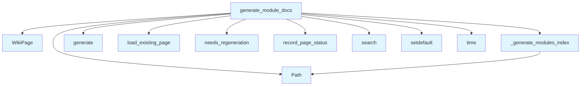

# File Overview

This file, `src/local_deepwiki/generators/wiki_modules.py`, contains functions for generating documentation for modules and directories within a codebase. It leverages a vector store for code indexing, an LLM provider for content generation, and a status manager for handling incremental updates. The module is part of the `local_deepwiki` project and is used in the `generate_module_docs` function, which is called by the wiki generation process.

## Functions

### `generate_module_docs`

```python
async def generate_module_docs(
    index_status: IndexStatus,
    vector_store: VectorStore,
    llm: LLMProvider,
    system_prompt: str,
    status_manager: "WikiStatusManager",
    full_rebuild: bool = False,
) -> tuple[list[WikiPage], int, int]:
```

**Purpose**:  
Generates documentation for each module/directory based on code indexing and LLM capabilities.

**Parameters**:
- `index_status`: Index status with file information.
- `vector_store`: Vector store with indexed code.
- `llm`: LLM provider for generation.
- `system_prompt`: System prompt for LLM.
- `status_manager`: Wiki status manager for incremental updates.
- `full_rebuild`: Flag to indicate whether a full rebuild is required.

**Returns**:
- A tuple containing:
  - List of generated `WikiPage` objects.
  - An integer representing the number of processed items.
  - An integer representing the number of skipped items.


<details>
<summary>View Source (lines 15-132) | <a href="https://github.com/UrbanDiver/local-deepwiki-mcp/blob/main/src/local_deepwiki/generators/wiki_modules.py#L15-L132">GitHub</a></summary>

```python
async def generate_module_docs(
    index_status: IndexStatus,
    vector_store: VectorStore,
    llm: LLMProvider,
    system_prompt: str,
    status_manager: "WikiStatusManager",
    full_rebuild: bool = False,
) -> tuple[list[WikiPage], int, int]:
    """Generate documentation for each module/directory.

    Args:
        index_status: Index status with file information.
        vector_store: Vector store with indexed code.
        llm: LLM provider for generation.
        system_prompt: System prompt for LLM.
        status_manager: Wiki status manager for incremental updates.
        full_rebuild: If True, regenerate all pages.

    Returns:
        Tuple of (pages list, generated count, skipped count).
    """
    pages = []
    pages_generated = 0
    pages_skipped = 0

    # Group files by top-level directory
    directories: dict[str, list[str]] = {}
    for file_info in index_status.files:
        parts = Path(file_info.path).parts
        if len(parts) > 1:
            dir_name = parts[0]
        else:
            dir_name = "root"
        directories.setdefault(dir_name, []).append(file_info.path)

    # Generate a page for each significant directory
    for dir_name, files in directories.items():
        if len(files) < 2:
            continue

        page_path = f"modules/{dir_name}.md"

        # Check if page needs regeneration (module pages depend on all files in that module)
        if not full_rebuild and not status_manager.needs_regeneration(page_path, files):
            existing_page = await status_manager.load_existing_page(page_path)
            if existing_page is not None:
                pages.append(existing_page)
                status_manager.record_page_status(existing_page, files)
                pages_skipped += 1
                continue

        # Get chunks for this directory
        search_results = await vector_store.search(
            f"module {dir_name}",
            limit=15,
        )

        # Filter to chunks from this directory
        relevant_chunks = [r for r in search_results if r.chunk.file_path.startswith(dir_name)]

        if not relevant_chunks:
            continue

        context = "\n\n".join(
            [
                f"File: {r.chunk.file_path}\nType: {r.chunk.chunk_type.value}\nName: {r.chunk.name}\n{r.chunk.content[:400]}"
                for r in relevant_chunks[:10]
            ]
        )

        prompt = f"""Generate documentation for the '{dir_name}' module based ONLY on the code provided.

Files in module: {', '.join(files[:10])}{'...' if len(files) > 10 else ''}

Code context:
{context}

Generate documentation that includes:
1. **Module Purpose** - Explain what this module does based on the code shown
2. **Key Classes and Functions** - Describe each class/function visible in the code above. Write class names as plain text for cross-linking.
3. **How Components Interact** - Explain how the components shown work together
4. **Usage Examples** - Show how to use the components (use code blocks)
5. **Dependencies** - What other modules this depends on (based on imports shown)

CRITICAL CONSTRAINTS:
- ONLY describe classes and functions that appear in the code context above
- Do NOT invent additional components not shown
- Do NOT fabricate usage patterns or APIs not visible in the code
- Write class names as plain text (e.g., "The CodeParser class") for cross-linking

Format as markdown."""

        content = await llm.generate(prompt, system_prompt=system_prompt)

        page = WikiPage(
            path=page_path,
            title=f"Module: {dir_name}",
            content=content,
            generated_at=time.time(),
        )
        pages.append(page)
        status_manager.record_page_status(page, files)
        pages_generated += 1

    # Create modules index (always regenerate since it depends on module pages)
    if pages:
        modules_index = WikiPage(
            path="modules/index.md",
            title="Modules",
            content=_generate_modules_index(pages),
            generated_at=time.time(),
        )
        pages.insert(0, modules_index)
        # Index depends on all files in all modules
        all_module_files = [f for files in directories.values() for f in files]
        status_manager.record_page_status(modules_index, all_module_files)

    return pages, pages_generated, pages_skipped
```

</details>

### `_generate_modules_index`

```python
def _generate_modules_index(module_pages: list[WikiPage]) -> str:
```

**Purpose**:  
Generates an index page for modules, listing each module's documentation.

**Parameters**:
- `module_pages`: List of module wiki pages.

**Returns**:
- Markdown content for the modules index.


<details>
<summary>View Source (lines 135-151) | <a href="https://github.com/UrbanDiver/local-deepwiki-mcp/blob/main/src/local_deepwiki/generators/wiki_modules.py#L135-L151">GitHub</a></summary>

```python
def _generate_modules_index(module_pages: list[WikiPage]) -> str:
    """Generate index page for modules.

    Args:
        module_pages: List of module wiki pages.

    Returns:
        Markdown content for modules index.
    """
    lines = ["# Modules\n", "This section contains documentation for each module.\n"]

    for page in module_pages:
        if page.path != "modules/index.md":
            name = Path(page.path).stem
            lines.append(f"- [{page.title}]({name}.md)")

    return "\n".join(lines)
```

</details>

## Integration

This module is used by the `generate_module_docs` function, which is called during the wiki generation process. It integrates with:

- `local_deepwiki.core.vectorstore.VectorStore` for code indexing.
- `local_deepwiki.models.IndexStatus` and `local_deepwiki.models.WikiPage` for data structures.
- `local_deepwiki.providers.base.LLMProvider` for content generation.
- `local_deepwiki.generators.wiki_status.WikiStatusManager` for managing incremental updates.

It is part of the larger `local_deepwiki` project and is related to other modules such as `wiki.py`, `source_refs.py`, and CLI components.

## Usage Examples

To use `generate_module_docs`, you would typically call it with appropriate parameters, such as:

```python
await generate_module_docs(
    index_status=index_status,
    vector_store=vector_store,
    llm=llm_provider,
    system_prompt=system_prompt,
    status_manager=status_manager,
    full_rebuild=False
)
```

This function is part of a larger system for generating documentation and is used in the context of building a wiki from code.

## API Reference

### Functions

#### `generate_module_docs`

```python
async def generate_module_docs(index_status: IndexStatus, vector_store: VectorStore, llm: LLMProvider, system_prompt: str, status_manager: "WikiStatusManager", full_rebuild: bool = False) -> tuple[list[WikiPage], int, int]
```

Generate documentation for each module/directory.


| Parameter | Type | Default | Description |
|-----------|------|---------|-------------|
| `index_status` | `IndexStatus` | - | Index status with file information. |
| `vector_store` | `VectorStore` | - | Vector store with indexed code. |
| `llm` | `LLMProvider` | - | LLM provider for generation. |
| `system_prompt` | `str` | - | System prompt for LLM. |
| `status_manager` | `"WikiStatusManager"` | - | Wiki status manager for incremental updates. |
| `full_rebuild` | `bool` | `False` | If True, regenerate all pages. |

**Returns:** `tuple[list[WikiPage], int, int]`


<details>
<summary>View Source (lines 15-132) | <a href="https://github.com/UrbanDiver/local-deepwiki-mcp/blob/main/src/local_deepwiki/generators/wiki_modules.py#L15-L132">GitHub</a></summary>

```python
async def generate_module_docs(
    index_status: IndexStatus,
    vector_store: VectorStore,
    llm: LLMProvider,
    system_prompt: str,
    status_manager: "WikiStatusManager",
    full_rebuild: bool = False,
) -> tuple[list[WikiPage], int, int]:
    """Generate documentation for each module/directory.

    Args:
        index_status: Index status with file information.
        vector_store: Vector store with indexed code.
        llm: LLM provider for generation.
        system_prompt: System prompt for LLM.
        status_manager: Wiki status manager for incremental updates.
        full_rebuild: If True, regenerate all pages.

    Returns:
        Tuple of (pages list, generated count, skipped count).
    """
    pages = []
    pages_generated = 0
    pages_skipped = 0

    # Group files by top-level directory
    directories: dict[str, list[str]] = {}
    for file_info in index_status.files:
        parts = Path(file_info.path).parts
        if len(parts) > 1:
            dir_name = parts[0]
        else:
            dir_name = "root"
        directories.setdefault(dir_name, []).append(file_info.path)

    # Generate a page for each significant directory
    for dir_name, files in directories.items():
        if len(files) < 2:
            continue

        page_path = f"modules/{dir_name}.md"

        # Check if page needs regeneration (module pages depend on all files in that module)
        if not full_rebuild and not status_manager.needs_regeneration(page_path, files):
            existing_page = await status_manager.load_existing_page(page_path)
            if existing_page is not None:
                pages.append(existing_page)
                status_manager.record_page_status(existing_page, files)
                pages_skipped += 1
                continue

        # Get chunks for this directory
        search_results = await vector_store.search(
            f"module {dir_name}",
            limit=15,
        )

        # Filter to chunks from this directory
        relevant_chunks = [r for r in search_results if r.chunk.file_path.startswith(dir_name)]

        if not relevant_chunks:
            continue

        context = "\n\n".join(
            [
                f"File: {r.chunk.file_path}\nType: {r.chunk.chunk_type.value}\nName: {r.chunk.name}\n{r.chunk.content[:400]}"
                for r in relevant_chunks[:10]
            ]
        )

        prompt = f"""Generate documentation for the '{dir_name}' module based ONLY on the code provided.

Files in module: {', '.join(files[:10])}{'...' if len(files) > 10 else ''}

Code context:
{context}

Generate documentation that includes:
1. **Module Purpose** - Explain what this module does based on the code shown
2. **Key Classes and Functions** - Describe each class/function visible in the code above. Write class names as plain text for cross-linking.
3. **How Components Interact** - Explain how the components shown work together
4. **Usage Examples** - Show how to use the components (use code blocks)
5. **Dependencies** - What other modules this depends on (based on imports shown)

CRITICAL CONSTRAINTS:
- ONLY describe classes and functions that appear in the code context above
- Do NOT invent additional components not shown
- Do NOT fabricate usage patterns or APIs not visible in the code
- Write class names as plain text (e.g., "The CodeParser class") for cross-linking

Format as markdown."""

        content = await llm.generate(prompt, system_prompt=system_prompt)

        page = WikiPage(
            path=page_path,
            title=f"Module: {dir_name}",
            content=content,
            generated_at=time.time(),
        )
        pages.append(page)
        status_manager.record_page_status(page, files)
        pages_generated += 1

    # Create modules index (always regenerate since it depends on module pages)
    if pages:
        modules_index = WikiPage(
            path="modules/index.md",
            title="Modules",
            content=_generate_modules_index(pages),
            generated_at=time.time(),
        )
        pages.insert(0, modules_index)
        # Index depends on all files in all modules
        all_module_files = [f for files in directories.values() for f in files]
        status_manager.record_page_status(modules_index, all_module_files)

    return pages, pages_generated, pages_skipped
```

</details>

## Call Graph


```mermaid
flowchart TD
    N0[Path]
    N1[WikiPage]
    N2[_generate_modules_index]
    N3[generate]
    N4[generate_module_docs]
    N5[load_existing_page]
    N6[needs_regeneration]
    N7[record_page_status]
    N8[search]
    N9[setdefault]
    N10[time]
    N4 --> N0
    N4 --> N9
    N4 --> N6
    N4 --> N5
    N4 --> N7
    N4 --> N8
    N4 --> N3
    N4 --> N1
    N4 --> N10
    N4 --> N2
    N2 --> N0
    classDef func fill:#e1f5fe
    class N0,N1,N2,N3,N4,N5,N6,N7,N8,N9,N10 func
```

## Used By

Functions and methods in this file and their callers:

- **`Path`**: called by `_generate_modules_index`, `generate_module_docs`
- **`WikiPage`**: called by `generate_module_docs`
- **`_generate_modules_index`**: called by `generate_module_docs`
- **`generate`**: called by `generate_module_docs`
- **`load_existing_page`**: called by `generate_module_docs`
- **`needs_regeneration`**: called by `generate_module_docs`
- **`record_page_status`**: called by `generate_module_docs`
- **`search`**: called by `generate_module_docs`
- **`setdefault`**: called by `generate_module_docs`
- **`time`**: called by `generate_module_docs`

## Usage Examples

*Examples extracted from test files*

### Test returns empty when no files in index

From `test_wiki_modules_coverage.py::TestGenerateModuleDocs::test_returns_empty_for_no_files`:

```python
pages, generated, skipped = await generate_module_docs(
    index_status=index_status,
    vector_store=mock_vector_store,
    llm=mock_llm,
    system_prompt="System prompt",
    status_manager=mock_status_manager,
    full_rebuild=True,
)

assert pages == []
assert generated == 0
```

### Test generates basic index content

From `test_wiki_modules_coverage.py::TestGenerateModulesIndex::test_generates_basic_index`:

```python
pages = [
    WikiPage(
        path="modules/src.md", title="Module: src", content="", generated_at=time.time()
    ),
    WikiPage(
        path="modules/tests.md", title="Module: tests", content="", generated_at=time.time()
    ),
]

result = _generate_modules_index(pages)

assert "# Modules" in result
assert "[Module: src](src.md)" in result
assert "[Module: tests](tests.md)" in result
```

### Test excludes the index page itself from listings

From `test_wiki_modules_coverage.py::TestGenerateModulesIndex::test_excludes_index_page_from_listing`:

```python
result = _generate_modules_index(pages)

# Should have link to src.md but not to index.md
assert "[Module: src](src.md)" in result
assert "index.md" not in result
```


## Last Modified

| Entity | Type | Author | Date | Commit |
|--------|------|--------|------|--------|
| `generate_module_docs` | function | Brian Breidenbach | 3 weeks ago | `3defaaa` Refactor: Extract validatio... |
| `_generate_modules_index` | function | Brian Breidenbach | 3 weeks ago | `3defaaa` Refactor: Extract validatio... |