# Wiki Pages Generator

## File Overview

The `wiki_pages.py` module provides functionality for generating various types of wiki pages for project documentation. Based on the imports and function signatures shown, it appears to coordinate the generation of overview, architecture, and changelog pages by integrating with other components like the [WikiGenerator](wiki.md), [VectorStore](../core/vectorstore.md), and various specialized generators.

## Functions

### generate_changelog_page

```python
async def generate_changelog_page(repo_path: Path | None) -> WikiPage | None
```

Generates a changelog page from git history.

**Parameters:**
- `repo_path` (Path | None): Path to the repository root

**Returns:**
- [`WikiPage`](../models.md): Wiki page containing changelog content
- `None`: If the path is None or no changelog could be generated

**Behavior:**
- Returns `None` immediately if `repo_path` is None
- Imports and uses [`generate_changelog_content`](changelog.md) from the changelog generator module
- Logs debug messages when no changelog is generated (not a git repo or no commits)
- Creates and returns a [WikiPage](../models.md) instance with the generated content

## Usage Examples

### Generating a Changelog Page

```python
from pathlib import Path
from local_deepwiki.generators.wiki_pages import generate_changelog_page

# Generate changelog for a repository
repo_path = Path("/path/to/repository")
changelog_page = await generate_changelog_page(repo_path)

if changelog_page:
    print("Changelog generated successfully")
else:
    print("No changelog generated")

# Handle case where repo_path is None
changelog_page = await generate_changelog_page(None)
# Returns None immediately
```

## Related Components

This module integrates with several other components based on the imports:

- **[WikiGenerator](wiki.md)**: Core wiki generation functionality
- **[VectorStore](../core/vectorstore.md)**: Vector storage and retrieval system
- **[ProjectManifest](manifest.md)**: Project structure and metadata handling
- **[LLMProvider](../providers/base.md)**: [Language](../models.md) model provider interface
- **[WikiPage](../models.md)**: Data model for wiki pages
- **[IndexStatus](../models.md)**: Status tracking for indexing operations

The module also works with specialized generators:
- **Changelog Generator**: For git history-based changelog generation
- **Diagrams Generator**: For workflow sequences and dependency graphs
- **Manifest Generator**: For directory tree generation

## Notes

- The module uses async/await patterns for asynchronous operations
- Logging is integrated through the [`get_logger`](../logging.md) function
- Git repository detection and handling is built into the changelog generation functionality
- The code includes proper error handling for cases where git repositories are not available

## API Reference

### Functions

#### `generate_overview_page`

```python
async def generate_overview_page(index_status: IndexStatus, vector_store: VectorStore, llm: LLMProvider, system_prompt: str, manifest: ProjectManifest | None, repo_path: Path | None) -> WikiPage
```

Generate the [main](../export/pdf.md) overview/index page with grounded facts.  This method generates structured sections programmatically (tech stack, directory structure, quick start) to avoid LLM hallucination, and only uses the LLM to generate the description and features sections.


| [Parameter](api_docs.md) | Type | Default | Description |
|-----------|------|---------|-------------|
| `index_status` | [`IndexStatus`](../models.md) | - | Index status with repository information. |
| `vector_store` | [`VectorStore`](../core/vectorstore.md) | - | Vector store for code search. |
| `llm` | [`LLMProvider`](../providers/base.md) | - | LLM provider for content generation. |
| `system_prompt` | `str` | - | System prompt for the LLM. |
| `manifest` | `ProjectManifest | None` | - | Parsed project manifest (dependencies, entry points). |
| `repo_path` | `Path | None` | - | Path to the repository root. |

**Returns:** [`WikiPage`](../models.md)


#### `generate_architecture_page`

```python
async def generate_architecture_page(index_status: IndexStatus, vector_store: VectorStore, llm: LLMProvider, system_prompt: str, manifest: ProjectManifest | None, repo_path: Path | None) -> WikiPage
```

Generate architecture documentation with diagrams and grounded facts.


| [Parameter](api_docs.md) | Type | Default | Description |
|-----------|------|---------|-------------|
| `index_status` | [`IndexStatus`](../models.md) | - | Index status with repository information. |
| `vector_store` | [`VectorStore`](../core/vectorstore.md) | - | Vector store for code search. |
| `llm` | [`LLMProvider`](../providers/base.md) | - | LLM provider for content generation. |
| `system_prompt` | `str` | - | System prompt for the LLM. |
| `manifest` | `ProjectManifest | None` | - | Parsed project manifest. |
| `repo_path` | `Path | None` | - | Path to the repository root. |

**Returns:** [`WikiPage`](../models.md)


#### `generate_dependencies_page`

```python
async def generate_dependencies_page(index_status: IndexStatus, vector_store: VectorStore, llm: LLMProvider, system_prompt: str, manifest: ProjectManifest | None, import_search_limit: int) -> tuple[WikiPage, list[str]]
```

Generate dependencies documentation with grounded facts from manifest.


| [Parameter](api_docs.md) | Type | Default | Description |
|-----------|------|---------|-------------|
| `index_status` | [`IndexStatus`](../models.md) | - | Index status with repository information. |
| `vector_store` | [`VectorStore`](../core/vectorstore.md) | - | Vector store for code search. |
| `llm` | [`LLMProvider`](../providers/base.md) | - | LLM provider for content generation. |
| `system_prompt` | `str` | - | System prompt for the LLM. |
| `manifest` | `ProjectManifest | None` | - | Parsed project manifest. |
| `import_search_limit` | `int` | - | Max import chunks to search. |

**Returns:** `tuple[WikiPage, list[str]]`


#### `generate_changelog_page`

```python
async def generate_changelog_page(repo_path: Path | None) -> WikiPage | None
```

Generate changelog page from git history.


| [Parameter](api_docs.md) | Type | Default | Description |
|-----------|------|---------|-------------|
| `repo_path` | `Path | None` | - | Path to the repository root. |

**Returns:** `WikiPage | None`


## Call Graph

```mermaid
flowchart TD
    N0[Path]
    N1[WikiPage]
    N2[add]
    N3[generate]
    N4[generate_architecture_page]
    N5[generate_changelog_content]
    N6[generate_changelog_page]
    N7[generate_dependencies_page]
    N8[generate_dependency_graph]
    N9[generate_overview_page]
    N10[generate_workflow_sequences]
    N11[get_directory_tree]
    N12[search]
    N13[time]
    N9 --> N0
    N9 --> N12
    N9 --> N2
    N9 --> N11
    N9 --> N3
    N9 --> N1
    N9 --> N13
    N4 --> N12
    N4 --> N2
    N4 --> N11
    N4 --> N3
    N4 --> N10
    N4 --> N1
    N4 --> N13
    N7 --> N12
    N7 --> N2
    N7 --> N3
    N7 --> N8
    N7 --> N1
    N7 --> N13
    N6 --> N5
    N6 --> N1
    N6 --> N13
    classDef func fill:#e1f5fe
    class N0,N1,N2,N3,N4,N5,N6,N7,N8,N9,N10,N11,N12,N13 func
```



## Relevant Source Files

- `src/local_deepwiki/generators/wiki_pages.py:20-192`
