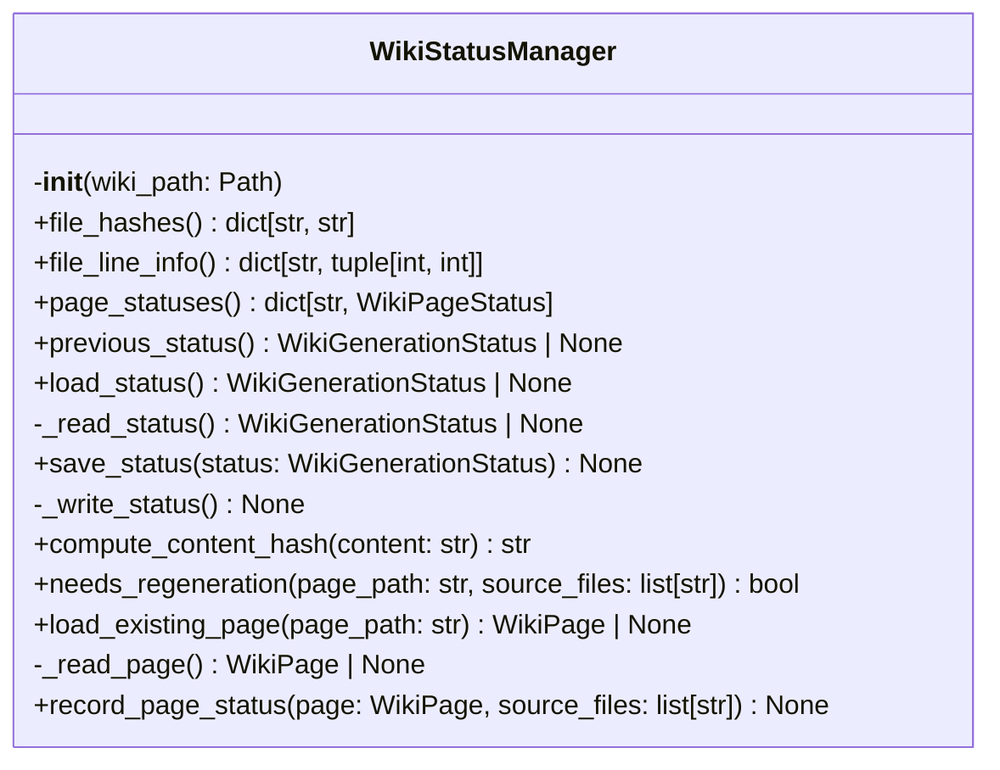

# Wiki Status Manager

## File Overview

The `wiki_status.py` file provides status tracking and management functionality for wiki generation processes. It handles loading and managing wiki generation status, tracking file changes through hashing, and maintaining page statuses for incremental wiki updates.

## Classes

### WikiStatusManager

The WikiStatusManager class manages the status of wiki generation processes, including tracking file changes and maintaining page statuses for incremental updates.

#### Constructor

**`__init__(wiki_path: Path)`**

Initializes the status manager with the specified wiki output directory.

**Parameters:**
- `wiki_path` (Path): Path to wiki output directory

**Internal State:**
- Tracks file hashes from index status for incremental generation
- Maintains previous wiki generation status for incremental updates  
- Stores new page statuses for current generation
- Handles line info for source files

#### Methods

**`load_status() -> WikiGenerationStatus | None`**

Loads previous wiki generation status from the wiki directory.

**Returns:**
- [`WikiGenerationStatus`](../models.md) object if status file exists and is valid
- `None` if status file not found or cannot be loaded

The method reads from a status file in the wiki path and validates the data using the [WikiGenerationStatus](../models.md) model.

## Usage Examples

### Basic Initialization

```python
from pathlib import Path
from local_deepwiki.generators.wiki_status import WikiStatusManager

# Initialize status manager
wiki_path = Path("./wiki_output")
status_manager = WikiStatusManager(wiki_path)
```

### Loading Previous Status

```python
# Load existing wiki generation status
previous_status = await status_manager.load_status()

if previous_status:
    print("Found previous wiki generation status")
else:
    print("No previous status found - fresh generation")
```

## Related Components

The WikiStatusManager works with several other components from the codebase:

- **[WikiGenerationStatus](../models.md)**: Model class for representing overall wiki generation status
- **[WikiPage](../models.md)**: Model class representing individual wiki pages
- **[WikiPageStatus](../models.md)**: Model class for tracking the status of individual pages
- **Logging system**: Uses the application's logging infrastructure via [`get_logger`](../logging.md)

The class integrates with the broader wiki generation system by providing persistent status tracking and enabling incremental updates based on file changes and previous generation states.

## API Reference

### class `WikiStatusManager`

Manage wiki generation status for incremental updates.

**Methods:**


<details>
<summary>View Source (lines 15-220)</summary>

```python
class WikiStatusManager:
    # Methods: __init__, file_hashes, file_hashes, file_line_info, file_line_info, page_statuses, previous_status, load_status, _read_status, save_status, _write_status, compute_content_hash, needs_regeneration, load_existing_page, _read_page, record_page_status
```

</details>

#### `__init__`

```python
def __init__(wiki_path: Path)
```

Initialize the status manager.


| [Parameter](api_docs.md) | Type | Default | Description |
|-----------|------|---------|-------------|
| `wiki_path` | `Path` | - | Path to wiki output directory. |


<details>
<summary>View Source (lines 20-38)</summary>

```python
def __init__(self, wiki_path: Path):
        """Initialize the status manager.

        Args:
            wiki_path: Path to wiki output directory.
        """
        self.wiki_path = wiki_path

        # Track file hashes from index_status for incremental generation
        self._file_hashes: dict[str, str] = {}

        # Previous wiki generation status for incremental updates
        self._previous_status: WikiGenerationStatus | None = None

        # New page statuses for current generation
        self._page_statuses: dict[str, WikiPageStatus] = {}

        # Line info for source files (computed from chunks)
        self._file_line_info: dict[str, tuple[int, int]] = {}
```

</details>

#### `file_hashes`

```python
def file_hashes() -> dict[str, str]
```

Get file hashes map.


<details>
<summary>View Source (lines 46-48)</summary>

```python
def file_hashes(self, value: dict[str, str]) -> None:
        """Set file hashes map."""
        self._file_hashes = value
```

</details>

#### `file_hashes`

```python
def file_hashes(value: dict[str, str]) -> None
```

Set file hashes map.


| [Parameter](api_docs.md) | Type | Default | Description |
|-----------|------|---------|-------------|
| `value` | `dict[str, str]` | - | - |


<details>
<summary>View Source (lines 46-48)</summary>

```python
def file_hashes(self, value: dict[str, str]) -> None:
        """Set file hashes map."""
        self._file_hashes = value
```

</details>

#### `file_line_info`

```python
def file_line_info() -> dict[str, tuple[int, int]]
```

Get file line info map.


<details>
<summary>View Source (lines 56-58)</summary>

```python
def file_line_info(self, value: dict[str, tuple[int, int]]) -> None:
        """Set file line info map."""
        self._file_line_info = value
```

</details>

#### `file_line_info`

```python
def file_line_info(value: dict[str, tuple[int, int]]) -> None
```

Set file line info map.


| [Parameter](api_docs.md) | Type | Default | Description |
|-----------|------|---------|-------------|
| `value` | `dict[str, tuple[int, int]]` | - | - |


<details>
<summary>View Source (lines 56-58)</summary>

```python
def file_line_info(self, value: dict[str, tuple[int, int]]) -> None:
        """Set file line info map."""
        self._file_line_info = value
```

</details>

#### `page_statuses`

```python
def page_statuses() -> dict[str, WikiPageStatus]
```

Get page statuses map.


<details>
<summary>View Source (lines 61-63)</summary>

```python
def page_statuses(self) -> dict[str, WikiPageStatus]:
        """Get page statuses map."""
        return self._page_statuses
```

</details>

#### `previous_status`

```python
def previous_status() -> WikiGenerationStatus | None
```

Get previous wiki generation status.


<details>
<summary>View Source (lines 66-68)</summary>

```python
def previous_status(self) -> WikiGenerationStatus | None:
        """Get previous wiki generation status."""
        return self._previous_status
```

</details>

#### `load_status`

```python
async def load_status() -> WikiGenerationStatus | None
```

Load previous wiki generation status.


<details>
<summary>View Source (lines 70-93)</summary>

```python
async def load_status(self) -> WikiGenerationStatus | None:
        """Load previous wiki generation status.

        Returns:
            WikiGenerationStatus or None if not found.
        """
        status_path = self.wiki_path / self.WIKI_STATUS_FILE
        if not status_path.exists():
            return None

        def _read_status() -> WikiGenerationStatus | None:
            try:
                with open(status_path) as f:
                    data = json.load(f)
                return WikiGenerationStatus.model_validate(data)
            except (json.JSONDecodeError, OSError, ValueError) as e:
                # json.JSONDecodeError: Corrupted or invalid JSON
                # OSError: File read issues
                # ValueError: Pydantic validation failure
                logger.warning(f"Failed to load wiki status from {status_path}: {e}")
                return None

        self._previous_status = await asyncio.to_thread(_read_status)
        return self._previous_status
```

</details>

#### `save_status`

```python
async def save_status(status: WikiGenerationStatus) -> None
```

Save wiki generation status.


| [Parameter](api_docs.md) | Type | Default | Description |
|-----------|------|---------|-------------|
| `status` | [`WikiGenerationStatus`](../models.md) | - | The [WikiGenerationStatus](../models.md) to save. |


<details>
<summary>View Source (lines 95-108)</summary>

```python
async def save_status(self, status: WikiGenerationStatus) -> None:
        """Save wiki generation status.

        Args:
            status: The WikiGenerationStatus to save.
        """
        status_path = self.wiki_path / self.WIKI_STATUS_FILE
        data = status.model_dump()

        def _write_status() -> None:
            with open(status_path, "w") as f:
                json.dump(data, f, indent=2)

        await asyncio.to_thread(_write_status)
```

</details>

#### `compute_content_hash`

```python
def compute_content_hash(content: str) -> str
```

Compute hash of page content.


| [Parameter](api_docs.md) | Type | Default | Description |
|-----------|------|---------|-------------|
| `content` | `str` | - | Page content. |


<details>
<summary>View Source (lines 110-119)</summary>

```python
def compute_content_hash(self, content: str) -> str:
        """Compute hash of page content.

        Args:
            content: Page content.

        Returns:
            SHA256 hash of content (first 16 chars).
        """
        return hashlib.sha256(content.encode()).hexdigest()[:16]
```

</details>

#### `needs_regeneration`

```python
def needs_regeneration(page_path: str, source_files: list[str]) -> bool
```

Check if a page needs regeneration based on source file changes.


| [Parameter](api_docs.md) | Type | Default | Description |
|-----------|------|---------|-------------|
| `page_path` | `str` | - | Wiki page path. |
| `source_files` | `list[str]` | - | List of source files that contribute to this page. |


<details>
<summary>View Source (lines 121-156)</summary>

```python
def needs_regeneration(
        self,
        page_path: str,
        source_files: list[str],
    ) -> bool:
        """Check if a page needs regeneration based on source file changes.

        Args:
            page_path: Wiki page path.
            source_files: List of source files that contribute to this page.

        Returns:
            True if page needs regeneration, False if it can be skipped.
        """
        if self._previous_status is None:
            return True

        prev_page = self._previous_status.pages.get(page_path)
        if prev_page is None:
            return True

        # Check if any source file has changed
        for source_file in source_files:
            current_hash = self._file_hashes.get(source_file)
            prev_hash = prev_page.source_hashes.get(source_file)

            if current_hash is None or prev_hash is None:
                return True
            if current_hash != prev_hash:
                return True

        # Check if source files list changed
        if set(source_files) != set(prev_page.source_files):
            return True

        return False
```

</details>

#### `load_existing_page`

```python
async def load_existing_page(page_path: str) -> WikiPage | None
```

Load an existing wiki page from disk.


| [Parameter](api_docs.md) | Type | Default | Description |
|-----------|------|---------|-------------|
| `page_path` | `str` | - | Relative path to the page. |


<details>
<summary>View Source (lines 158-191)</summary>

```python
async def load_existing_page(self, page_path: str) -> WikiPage | None:
        """Load an existing wiki page from disk.

        Args:
            page_path: Relative path to the page.

        Returns:
            WikiPage if found, None otherwise.
        """
        full_path = self.wiki_path / page_path
        if not full_path.exists():
            return None

        # Capture values needed for the sync function
        prev_page = self._previous_status.pages.get(page_path) if self._previous_status else None
        title = Path(page_path).stem.replace("_", " ").title()
        generated_at = prev_page.generated_at if prev_page else time.time()

        def _read_page() -> WikiPage | None:
            try:
                content = full_path.read_text()
                return WikiPage(
                    path=page_path,
                    title=title,
                    content=content,
                    generated_at=generated_at,
                )
            except (OSError, UnicodeDecodeError) as e:
                # OSError: File read issues
                # UnicodeDecodeError: File encoding issues
                logger.warning(f"Failed to load existing page {page_path}: {e}")
                return None

        return await asyncio.to_thread(_read_page)
```

</details>

#### `record_page_status`

```python
def record_page_status(page: WikiPage, source_files: list[str]) -> None
```

Record status for a generated/loaded page.


| [Parameter](api_docs.md) | Type | Default | Description |
|-----------|------|---------|-------------|
| `page` | [`WikiPage`](../models.md) | - | The wiki page. |
| `source_files` | `list[str]` | - | Source files that contributed to this page. |


<details>
<summary>View Source (lines 193-220)</summary>

```python
def record_page_status(
        self,
        page: WikiPage,
        source_files: list[str],
    ) -> None:
        """Record status for a generated/loaded page.

        Args:
            page: The wiki page.
            source_files: Source files that contributed to this page.
        """
        source_hashes = {f: self._file_hashes.get(f, "") for f in source_files}

        # Include line info for source files that have it
        source_line_info = {
            f: {"start_line": self._file_line_info[f][0], "end_line": self._file_line_info[f][1]}
            for f in source_files
            if f in self._file_line_info
        }

        self._page_statuses[page.path] = WikiPageStatus(
            path=page.path,
            source_files=source_files,
            source_hashes=source_hashes,
            source_line_info=source_line_info,
            content_hash=self.compute_content_hash(page.content),
            generated_at=page.generated_at,
        )
```

</details>

## Class Diagram



## Call Graph

```mermaid
flowchart TD
    N0[Path]
    N1[WikiPage]
    N2[WikiPageStatus]
    N3[WikiStatusManager._read_page]
    N4[WikiStatusManager._read_status]
    N5[WikiStatusManager._write_st...]
    N6[WikiStatusManager.compute_c...]
    N7[WikiStatusManager.load_exis...]
    N8[WikiStatusManager.load_status]
    N9[WikiStatusManager.record_pa...]
    N10[WikiStatusManager.save_status]
    N11[compute_content_hash]
    N12[dump]
    N13[encode]
    N14[exists]
    N15[hexdigest]
    N16[load]
    N17[model_dump]
    N18[model_validate]
    N19[read_text]
    N20[sha256]
    N21[time]
    N22[title]
    N23[to_thread]
    N8 --> N14
    N8 --> N16
    N8 --> N18
    N8 --> N23
    N4 --> N16
    N4 --> N18
    N10 --> N17
    N10 --> N12
    N10 --> N23
    N5 --> N12
    N6 --> N15
    N6 --> N20
    N6 --> N13
    N7 --> N14
    N7 --> N22
    N7 --> N0
    N7 --> N21
    N7 --> N19
    N7 --> N1
    N7 --> N23
    N3 --> N19
    N3 --> N1
    N9 --> N2
    N9 --> N11
    classDef func fill:#e1f5fe
    class N0,N1,N2,N11,N12,N13,N14,N15,N16,N17,N18,N19,N20,N21,N22,N23 func
    classDef method fill:#fff3e0
    class N3,N4,N5,N6,N7,N8,N9,N10 method
```



## Additional Source Code

Source code for functions and methods not listed in the API Reference above.

#### `file_hashes`

<details>
<summary>View Source (lines 41-43)</summary>

```python
def file_hashes(self) -> dict[str, str]:
        """Get file hashes map."""
        return self._file_hashes
```

</details>


#### `file_line_info`

<details>
<summary>View Source (lines 51-53)</summary>

```python
def file_line_info(self) -> dict[str, tuple[int, int]]:
        """Get file line info map."""
        return self._file_line_info
```

</details>


#### `_read_status`

<details>
<summary>View Source (lines 80-90)</summary>

```python
def _read_status() -> WikiGenerationStatus | None:
            try:
                with open(status_path) as f:
                    data = json.load(f)
                return WikiGenerationStatus.model_validate(data)
            except (json.JSONDecodeError, OSError, ValueError) as e:
                # json.JSONDecodeError: Corrupted or invalid JSON
                # OSError: File read issues
                # ValueError: Pydantic validation failure
                logger.warning(f"Failed to load wiki status from {status_path}: {e}")
                return None
```

</details>


#### `_write_status`

<details>
<summary>View Source (lines 104-106)</summary>

```python
def _write_status() -> None:
            with open(status_path, "w") as f:
                json.dump(data, f, indent=2)
```

</details>


#### `_read_page`

<details>
<summary>View Source (lines 176-189)</summary>

```python
def _read_page() -> WikiPage | None:
            try:
                content = full_path.read_text()
                return WikiPage(
                    path=page_path,
                    title=title,
                    content=content,
                    generated_at=generated_at,
                )
            except (OSError, UnicodeDecodeError) as e:
                # OSError: File read issues
                # UnicodeDecodeError: File encoding issues
                logger.warning(f"Failed to load existing page {page_path}: {e}")
                return None
```

</details>

## Relevant Source Files

- `src/local_deepwiki/generators/wiki_status.py:15-220`
