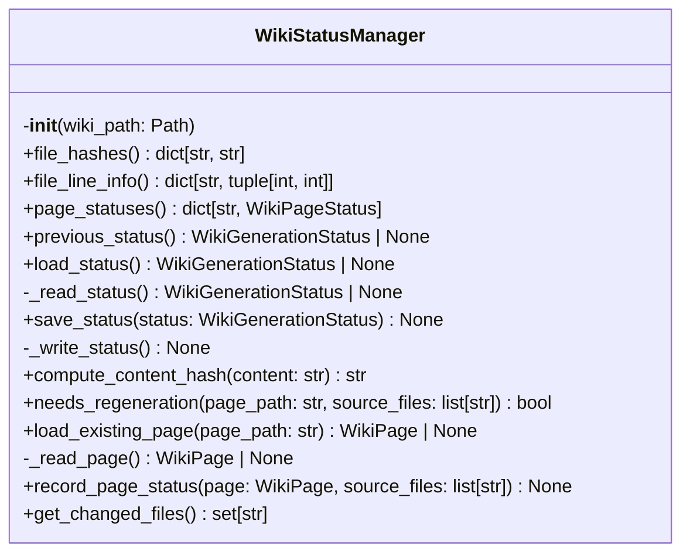

# File Overview

This file defines the `WikiStatusManager` class, which is responsible for managing the status of wiki generation, including tracking file hashes, page statuses, and handling incremental updates. It provides functionality for loading and saving generation status, computing content hashes, and determining whether pages need regeneration based on changes in source files.

The class integrates with the `local_deepwiki.models` module for data models like `WikiGenerationStatus`, `WikiPage`, and `WikiPageStatus`, and uses standard Python libraries for file I/O, hashing, and asynchronous operations.

# Classes

## WikiStatusManager

The `WikiStatusManager` class manages the status of wiki generation, enabling incremental updates by tracking file hashes, page statuses, and previous generation states.

### Key Methods

- `__init__(self, wiki_path: Path)`  
  Initializes the status manager with a path to the wiki output directory.

- `file_hashes(self) -> dict[str, str]`  
  Gets the current file hashes map.

- `file_hashes(self, value: dict[str, str]) -> None`  
  Sets the file hashes map.

- `file_line_info(self) -> dict[str, tuple[int, int]]`  
  Gets the current file line info map.

- `file_line_info(self, value: dict[str, tuple[int, int]]) -> None`  
  Sets the file line info map.

- `page_statuses(self) -> dict[str, WikiPageStatus]`  
  Gets the current page statuses map.

- `previous_status(self) -> WikiGenerationStatus | None`  
  Gets the previous wiki generation status.

- `load_status(self) -> WikiGenerationStatus | None`  
  Loads the previous wiki generation status from disk.  
  Returns: `WikiGenerationStatus` or `None` if not found.

- `_read_status()`  
  Internal method to read status from disk.  
  Returns: `WikiGenerationStatus` or `None` on failure.

- `save_status(self, status: WikiGenerationStatus) -> None`  
  Saves the current wiki generation status to disk.

- `_write_status()`  
  Internal method to write status to disk.

- `compute_content_hash(self, content: str) -> str`  
  Computes a SHA256 hash (first 16 characters) of the given content.  
  Returns: The hash as a string.

# Functions

This file does not define any standalone functions outside of class methods.

# Integration

This file integrates with:

- `local_deepwiki.logging.get_logger` for logging.
- `local_deepwiki.models.WikiGenerationStatus`, `WikiPage`, and `WikiPageStatus` for data models.
- `asyncio`, `hashlib`, `json`, `time`, and `pathlib.Path` for core functionality.
- It is used by other components in the `local_deepwiki.generators` module, such as `wiki.py` and `source_refs.py`, to manage incremental builds.

# Usage Examples

### Initialize `WikiStatusManager`

```python
from pathlib import Path
from local_deepwiki.generators.wiki_status import WikiStatusManager

wiki_path = Path("/path/to/wiki")
status_manager = WikiStatusManager(wiki_path)
```

### Load Previous Status

```python
status = await status_manager.load_status()
if status:
    print("Previous status loaded successfully")
else:
    print("No previous status found")
```

### Save Current Status

```python
await status_manager.save_status(current_status)
```

### Compute Content Hash

```python
content = "Some page content"
hash_value = status_manager.compute_content_hash(content)
print(hash_value)
```

## API Reference

### class `WikiStatusManager`

Manage wiki generation status for incremental updates.

**Methods:**


<details>
<summary>View Source (lines 17-320) | <a href="https://github.com/UrbanDiver/local-deepwiki-mcp/blob/main/src/local_deepwiki/generators/wiki_status.py#L17-L320">GitHub</a></summary>

```python
class WikiStatusManager:
    # Methods: __init__, file_hashes, file_hashes, file_line_info, file_line_info, page_statuses, previous_status, load_status, _read_status, save_status, _write_status, compute_content_hash, needs_regeneration, load_existing_page, _read_page, record_page_status, get_changed_files, build_reverse_index, get_affected_pages, get_regeneration_summary
```

</details>

#### `__init__`

```python
def __init__(wiki_path: Path)
```

Initialize the status manager.


| Parameter | Type | Default | Description |
|-----------|------|---------|-------------|
| `wiki_path` | `Path` | - | Path to wiki output directory. |


<details>
<summary>View Source (lines 22-40) | <a href="https://github.com/UrbanDiver/local-deepwiki-mcp/blob/main/src/local_deepwiki/generators/wiki_status.py#L22-L40">GitHub</a></summary>

```python
def __init__(self, wiki_path: Path):
        """Initialize the status manager.

        Args:
            wiki_path: Path to wiki output directory.
        """
        self.wiki_path = wiki_path

        # Track file hashes from index_status for incremental generation
        self._file_hashes: dict[str, str] = {}

        # Previous wiki generation status for incremental updates
        self._previous_status: WikiGenerationStatus | None = None

        # New page statuses for current generation
        self._page_statuses: dict[str, WikiPageStatus] = {}

        # Line info for source files (computed from chunks)
        self._file_line_info: dict[str, tuple[int, int]] = {}
```

</details>

#### `file_hashes`

```python
def file_hashes() -> dict[str, str]
```

Get file hashes map.


<details>
<summary>View Source (lines 48-50) | <a href="https://github.com/UrbanDiver/local-deepwiki-mcp/blob/main/src/local_deepwiki/generators/wiki_status.py#L48-L50">GitHub</a></summary>

```python
def file_hashes(self, value: dict[str, str]) -> None:
        """Set file hashes map."""
        self._file_hashes = value
```

</details>

#### `file_hashes`

```python
def file_hashes(value: dict[str, str]) -> None
```

Set file hashes map.


| Parameter | Type | Default | Description |
|-----------|------|---------|-------------|
| `value` | `dict[str, str]` | - | - |


<details>
<summary>View Source (lines 48-50) | <a href="https://github.com/UrbanDiver/local-deepwiki-mcp/blob/main/src/local_deepwiki/generators/wiki_status.py#L48-L50">GitHub</a></summary>

```python
def file_hashes(self, value: dict[str, str]) -> None:
        """Set file hashes map."""
        self._file_hashes = value
```

</details>

#### `file_line_info`

```python
def file_line_info() -> dict[str, tuple[int, int]]
```

Get file line info map.


<details>
<summary>View Source (lines 58-60) | <a href="https://github.com/UrbanDiver/local-deepwiki-mcp/blob/main/src/local_deepwiki/generators/wiki_status.py#L58-L60">GitHub</a></summary>

```python
def file_line_info(self, value: dict[str, tuple[int, int]]) -> None:
        """Set file line info map."""
        self._file_line_info = value
```

</details>

#### `file_line_info`

```python
def file_line_info(value: dict[str, tuple[int, int]]) -> None
```

Set file line info map.


| Parameter | Type | Default | Description |
|-----------|------|---------|-------------|
| `value` | `dict[str, tuple[int, int]]` | - | - |


<details>
<summary>View Source (lines 58-60) | <a href="https://github.com/UrbanDiver/local-deepwiki-mcp/blob/main/src/local_deepwiki/generators/wiki_status.py#L58-L60">GitHub</a></summary>

```python
def file_line_info(self, value: dict[str, tuple[int, int]]) -> None:
        """Set file line info map."""
        self._file_line_info = value
```

</details>

#### `page_statuses`

```python
def page_statuses() -> dict[str, WikiPageStatus]
```

Get page statuses map.


<details>
<summary>View Source (lines 63-65) | <a href="https://github.com/UrbanDiver/local-deepwiki-mcp/blob/main/src/local_deepwiki/generators/wiki_status.py#L63-L65">GitHub</a></summary>

```python
def page_statuses(self) -> dict[str, WikiPageStatus]:
        """Get page statuses map."""
        return self._page_statuses
```

</details>

#### `previous_status`

```python
def previous_status() -> WikiGenerationStatus | None
```

Get previous wiki generation status.


<details>
<summary>View Source (lines 68-70) | <a href="https://github.com/UrbanDiver/local-deepwiki-mcp/blob/main/src/local_deepwiki/generators/wiki_status.py#L68-L70">GitHub</a></summary>

```python
def previous_status(self) -> WikiGenerationStatus | None:
        """Get previous wiki generation status."""
        return self._previous_status
```

</details>

#### `load_status`

```python
async def load_status() -> WikiGenerationStatus | None
```

Load previous wiki generation status.


<details>
<summary>View Source (lines 72-95) | <a href="https://github.com/UrbanDiver/local-deepwiki-mcp/blob/main/src/local_deepwiki/generators/wiki_status.py#L72-L95">GitHub</a></summary>

```python
async def load_status(self) -> WikiGenerationStatus | None:
        """Load previous wiki generation status.

        Returns:
            WikiGenerationStatus or None if not found.
        """
        status_path = self.wiki_path / self.WIKI_STATUS_FILE
        if not status_path.exists():
            return None

        def _read_status() -> WikiGenerationStatus | None:
            try:
                with open(status_path) as f:
                    data = json.load(f)
                return WikiGenerationStatus.model_validate(data)
            except (json.JSONDecodeError, OSError, ValueError) as e:
                # json.JSONDecodeError: Corrupted or invalid JSON
                # OSError: File read issues
                # ValueError: Pydantic validation failure
                logger.warning(f"Failed to load wiki status from {status_path}: {e}")
                return None

        self._previous_status = await asyncio.to_thread(_read_status)
        return self._previous_status
```

</details>

#### `save_status`

```python
async def save_status(status: WikiGenerationStatus) -> None
```

Save wiki generation status.


| Parameter | Type | Default | Description |
|-----------|------|---------|-------------|
| `status` | `WikiGenerationStatus` | - | The WikiGenerationStatus to save. |


<details>
<summary>View Source (lines 97-110) | <a href="https://github.com/UrbanDiver/local-deepwiki-mcp/blob/main/src/local_deepwiki/generators/wiki_status.py#L97-L110">GitHub</a></summary>

```python
async def save_status(self, status: WikiGenerationStatus) -> None:
        """Save wiki generation status.

        Args:
            status: The WikiGenerationStatus to save.
        """
        status_path = self.wiki_path / self.WIKI_STATUS_FILE
        data = status.model_dump()

        def _write_status() -> None:
            with open(status_path, "w") as f:
                json.dump(data, f, indent=2)

        await asyncio.to_thread(_write_status)
```

</details>

#### `compute_content_hash`

```python
def compute_content_hash(content: str) -> str
```

Compute hash of page content.


| Parameter | Type | Default | Description |
|-----------|------|---------|-------------|
| `content` | `str` | - | Page content. |


<details>
<summary>View Source (lines 112-121) | <a href="https://github.com/UrbanDiver/local-deepwiki-mcp/blob/main/src/local_deepwiki/generators/wiki_status.py#L112-L121">GitHub</a></summary>

```python
def compute_content_hash(self, content: str) -> str:
        """Compute hash of page content.

        Args:
            content: Page content.

        Returns:
            SHA256 hash of content (first 16 chars).
        """
        return hashlib.sha256(content.encode()).hexdigest()[:16]
```

</details>

#### `needs_regeneration`

```python
def needs_regeneration(page_path: str, source_files: list[str]) -> bool
```

Check if a page needs regeneration based on source file changes.


| Parameter | Type | Default | Description |
|-----------|------|---------|-------------|
| `page_path` | `str` | - | Wiki page path. |
| `source_files` | `list[str]` | - | List of source files that contribute to this page. |


<details>
<summary>View Source (lines 123-158) | <a href="https://github.com/UrbanDiver/local-deepwiki-mcp/blob/main/src/local_deepwiki/generators/wiki_status.py#L123-L158">GitHub</a></summary>

```python
def needs_regeneration(
        self,
        page_path: str,
        source_files: list[str],
    ) -> bool:
        """Check if a page needs regeneration based on source file changes.

        Args:
            page_path: Wiki page path.
            source_files: List of source files that contribute to this page.

        Returns:
            True if page needs regeneration, False if it can be skipped.
        """
        if self._previous_status is None:
            return True

        prev_page = self._previous_status.pages.get(page_path)
        if prev_page is None:
            return True

        # Check if any source file has changed
        for source_file in source_files:
            current_hash = self._file_hashes.get(source_file)
            prev_hash = prev_page.source_hashes.get(source_file)

            if current_hash is None or prev_hash is None:
                return True
            if current_hash != prev_hash:
                return True

        # Check if source files list changed
        if set(source_files) != set(prev_page.source_files):
            return True

        return False
```

</details>

#### `load_existing_page`

```python
async def load_existing_page(page_path: str) -> WikiPage | None
```

Load an existing wiki page from disk.


| Parameter | Type | Default | Description |
|-----------|------|---------|-------------|
| `page_path` | `str` | - | Relative path to the page. |


<details>
<summary>View Source (lines 160-193) | <a href="https://github.com/UrbanDiver/local-deepwiki-mcp/blob/main/src/local_deepwiki/generators/wiki_status.py#L160-L193">GitHub</a></summary>

```python
async def load_existing_page(self, page_path: str) -> WikiPage | None:
        """Load an existing wiki page from disk.

        Args:
            page_path: Relative path to the page.

        Returns:
            WikiPage if found, None otherwise.
        """
        full_path = self.wiki_path / page_path
        if not full_path.exists():
            return None

        # Capture values needed for the sync function
        prev_page = self._previous_status.pages.get(page_path) if self._previous_status else None
        title = Path(page_path).stem.replace("_", " ").title()
        generated_at = prev_page.generated_at if prev_page else time.time()

        def _read_page() -> WikiPage | None:
            try:
                content = full_path.read_text()
                return WikiPage(
                    path=page_path,
                    title=title,
                    content=content,
                    generated_at=generated_at,
                )
            except (OSError, UnicodeDecodeError) as e:
                # OSError: File read issues
                # UnicodeDecodeError: File encoding issues
                logger.warning(f"Failed to load existing page {page_path}: {e}")
                return None

        return await asyncio.to_thread(_read_page)
```

</details>

#### `record_page_status`

```python
def record_page_status(page: WikiPage, source_files: list[str]) -> None
```

Record status for a generated/loaded page.


| Parameter | Type | Default | Description |
|-----------|------|---------|-------------|
| `page` | `WikiPage` | - | The wiki page. |
| `source_files` | `list[str]` | - | Source files that contributed to this page. |


<details>
<summary>View Source (lines 195-222) | <a href="https://github.com/UrbanDiver/local-deepwiki-mcp/blob/main/src/local_deepwiki/generators/wiki_status.py#L195-L222">GitHub</a></summary>

```python
def record_page_status(
        self,
        page: WikiPage,
        source_files: list[str],
    ) -> None:
        """Record status for a generated/loaded page.

        Args:
            page: The wiki page.
            source_files: Source files that contributed to this page.
        """
        source_hashes = {f: self._file_hashes.get(f, "") for f in source_files}

        # Include line info for source files that have it
        source_line_info = {
            f: {"start_line": self._file_line_info[f][0], "end_line": self._file_line_info[f][1]}
            for f in source_files
            if f in self._file_line_info
        }

        self._page_statuses[page.path] = WikiPageStatus(
            path=page.path,
            source_files=source_files,
            source_hashes=source_hashes,
            source_line_info=source_line_info,
            content_hash=self.compute_content_hash(page.content),
            generated_at=page.generated_at,
        )
```

</details>

#### `get_changed_files`

```python
def get_changed_files() -> set[str]
```

Get set of files that have changed since last generation.  Compares current file hashes with previous generation's hashes.


<details>
<summary>View Source (lines 224-250) | <a href="https://github.com/UrbanDiver/local-deepwiki-mcp/blob/main/src/local_deepwiki/generators/wiki_status.py#L224-L250">GitHub</a></summary>

```python
def get_changed_files(self) -> set[str]:
        """Get set of files that have changed since last generation.

        Compares current file hashes with previous generation's hashes.

        Returns:
            Set of file paths that have changed or are new.
        """
        if self._previous_status is None:
            # No previous status means all files are "new"
            return set(self._file_hashes.keys())

        changed = set()

        # Check each current file against previous hashes
        for file_path, current_hash in self._file_hashes.items():
            # Find any page that previously tracked this file
            prev_hash = None
            for page_status in self._previous_status.pages.values():
                if file_path in page_status.source_hashes:
                    prev_hash = page_status.source_hashes[file_path]
                    break

            if prev_hash is None or prev_hash != current_hash:
                changed.add(file_path)

        return changed
```

</details>

#### `build_reverse_index`

```python
def build_reverse_index() -> dict[str, set[str]]
```

Build reverse index mapping source files to dependent wiki pages.  Uses previous generation's page statuses to build the mapping.


<details>
<summary>View Source (lines 252-271) | <a href="https://github.com/UrbanDiver/local-deepwiki-mcp/blob/main/src/local_deepwiki/generators/wiki_status.py#L252-L271">GitHub</a></summary>

```python
def build_reverse_index(self) -> dict[str, set[str]]:
        """Build reverse index mapping source files to dependent wiki pages.

        Uses previous generation's page statuses to build the mapping.

        Returns:
            Dict mapping source file path to set of wiki page paths that depend on it.
        """
        reverse_index: dict[str, set[str]] = {}

        if self._previous_status is None:
            return reverse_index

        for page_path, page_status in self._previous_status.pages.items():
            for source_file in page_status.source_files:
                if source_file not in reverse_index:
                    reverse_index[source_file] = set()
                reverse_index[source_file].add(page_path)

        return reverse_index
```

</details>

#### `get_affected_pages`

```python
def get_affected_pages(changed_files: set[str] | None = None) -> set[str]
```

Get set of wiki pages affected by file changes.  Uses reverse index to efficiently find all pages that depend on changed files.


| Parameter | Type | Default | Description |
|-----------|------|---------|-------------|
| `changed_files` | `set[str] | None` | `None` | Optional set of changed files. If None, computes automatically. |


<details>
<summary>View Source (lines 273-297) | <a href="https://github.com/UrbanDiver/local-deepwiki-mcp/blob/main/src/local_deepwiki/generators/wiki_status.py#L273-L297">GitHub</a></summary>

```python
def get_affected_pages(self, changed_files: set[str] | None = None) -> set[str]:
        """Get set of wiki pages affected by file changes.

        Uses reverse index to efficiently find all pages that depend on changed files.

        Args:
            changed_files: Optional set of changed files. If None, computes automatically.

        Returns:
            Set of wiki page paths that need regeneration.
        """
        if changed_files is None:
            changed_files = self.get_changed_files()

        if not changed_files:
            return set()

        reverse_index = self.build_reverse_index()
        affected: set[str] = set()

        for file_path in changed_files:
            if file_path in reverse_index:
                affected.update(reverse_index[file_path])

        return affected
```

</details>

#### `get_regeneration_summary`

```python
def get_regeneration_summary() -> dict[str, Any]
```

Get a summary of what will be regenerated and why.


<details>
<summary>View Source (lines 299-320) | <a href="https://github.com/UrbanDiver/local-deepwiki-mcp/blob/main/src/local_deepwiki/generators/wiki_status.py#L299-L320">GitHub</a></summary>

```python
def get_regeneration_summary(self) -> dict[str, Any]:
        """Get a summary of what will be regenerated and why.

        Returns:
            Dict with 'changed_files', 'affected_pages', 'unchanged_pages' counts.
        """
        changed_files = self.get_changed_files()
        affected_pages = self.get_affected_pages(changed_files)

        total_previous_pages = (
            len(self._previous_status.pages) if self._previous_status else 0
        )
        unchanged_pages = total_previous_pages - len(affected_pages)

        return {
            "changed_files": list(changed_files),
            "changed_file_count": len(changed_files),
            "affected_pages": list(affected_pages),
            "affected_page_count": len(affected_pages),
            "unchanged_page_count": max(0, unchanged_pages),
            "is_full_rebuild": self._previous_status is None,
        }
```

</details>

## Class Diagram


```mermaid
classDiagram
    class WikiStatusManager {
        -__init__(wiki_path: Path)
        +file_hashes() dict[str, str]
        +file_line_info() dict[str, tuple[int, int]]
        +page_statuses() dict[str, WikiPageStatus]
        +previous_status() WikiGenerationStatus | None
        +load_status() WikiGenerationStatus | None
        -_read_status() WikiGenerationStatus | None
        +save_status(status: WikiGenerationStatus) None
        -_write_status() None
        +compute_content_hash(content: str) str
        +needs_regeneration(page_path: str, source_files: list[str]) bool
        +load_existing_page(page_path: str) WikiPage | None
        -_read_page() WikiPage | None
        +record_page_status(page: WikiPage, source_files: list[str]) None
        +get_changed_files() set[str]
    }
```

## Call Graph


```mermaid
flowchart TD
    N0[Path]
    N1[WikiPage]
    N2[WikiPageStatus]
    N3[WikiStatusManager._read_page]
    N4[WikiStatusManager._read_status]
    N5[WikiStatusManager._write_st...]
    N6[WikiStatusManager.build_rev...]
    N7[WikiStatusManager.compute_c...]
    N8[WikiStatusManager.get_affec...]
    N9[WikiStatusManager.get_chang...]
    N10[WikiStatusManager.get_regen...]
    N11[WikiStatusManager.load_exis...]
    N12[WikiStatusManager.load_status]
    N13[WikiStatusManager.record_pa...]
    N14[WikiStatusManager.save_status]
    N15[add]
    N16[compute_content_hash]
    N17[dump]
    N18[encode]
    N19[exists]
    N20[get_changed_files]
    N21[hexdigest]
    N22[load]
    N23[model_dump]
    N24[model_validate]
    N25[read_text]
    N26[sha256]
    N27[time]
    N28[title]
    N29[to_thread]
    N12 --> N19
    N12 --> N22
    N12 --> N24
    N12 --> N29
    N4 --> N22
    N4 --> N24
    N14 --> N23
    N14 --> N17
    N14 --> N29
    N5 --> N17
    N7 --> N21
    N7 --> N26
    N7 --> N18
    N11 --> N19
    N11 --> N28
    N11 --> N0
    N11 --> N27
    N11 --> N25
    N11 --> N1
    N11 --> N29
    N3 --> N25
    N3 --> N1
    N13 --> N2
    N13 --> N16
    N9 --> N15
    N6 --> N15
    N8 --> N20
    N10 --> N20
    classDef func fill:#e1f5fe
    class N0,N1,N2,N15,N16,N17,N18,N19,N20,N21,N22,N23,N24,N25,N26,N27,N28,N29 func
    classDef method fill:#fff3e0
    class N3,N4,N5,N6,N7,N8,N9,N10,N11,N12,N13,N14 method
```

## Used By

Functions and methods in this file and their callers:

- **`Path`**: called by `WikiStatusManager.load_existing_page`
- **`WikiPage`**: called by `WikiStatusManager._read_page`, `WikiStatusManager.load_existing_page`
- **`WikiPageStatus`**: called by `WikiStatusManager.record_page_status`
- **`add`**: called by `WikiStatusManager.build_reverse_index`, `WikiStatusManager.get_changed_files`
- **`build_reverse_index`**: called by `WikiStatusManager.get_affected_pages`
- **`compute_content_hash`**: called by `WikiStatusManager.record_page_status`
- **`dump`**: called by `WikiStatusManager._write_status`, `WikiStatusManager.save_status`
- **`encode`**: called by `WikiStatusManager.compute_content_hash`
- **`exists`**: called by `WikiStatusManager.load_existing_page`, `WikiStatusManager.load_status`
- **`get_affected_pages`**: called by `WikiStatusManager.get_regeneration_summary`
- **`get_changed_files`**: called by `WikiStatusManager.get_affected_pages`, `WikiStatusManager.get_regeneration_summary`
- **`hexdigest`**: called by `WikiStatusManager.compute_content_hash`
- **`load`**: called by `WikiStatusManager._read_status`, `WikiStatusManager.load_status`
- **`model_dump`**: called by `WikiStatusManager.save_status`
- **`model_validate`**: called by `WikiStatusManager._read_status`, `WikiStatusManager.load_status`
- **`read_text`**: called by `WikiStatusManager._read_page`, `WikiStatusManager.load_existing_page`
- **`sha256`**: called by `WikiStatusManager.compute_content_hash`
- **`time`**: called by `WikiStatusManager.load_existing_page`
- **`title`**: called by `WikiStatusManager.load_existing_page`
- **`to_thread`**: called by `WikiStatusManager.load_existing_page`, `WikiStatusManager.load_status`, `WikiStatusManager.save_status`

## Usage Examples

*Examples extracted from test files*

### Test creating a WikiStatusManager instance

From `test_wiki_status.py::TestWikiStatusManager::test_creation`:

```python
manager = WikiStatusManager(wiki_path=tmp_path)
assert manager.wiki_path == tmp_path
assert manager.file_hashes == {}
assert manager.file_line_info == {}
assert manager.page_statuses == {}
assert manager.previous_status is None
```

### Test creating a WikiStatusManager instance

From `test_wiki_status.py::TestWikiStatusManager::test_creation`:

```python
manager = WikiStatusManager(wiki_path=tmp_path)
assert manager.wiki_path == tmp_path
assert manager.file_hashes == {}
assert manager.file_line_info == {}
assert manager.page_statuses == {}
assert manager.previous_status is None
```

### Test creating a WikiStatusManager instance

From `test_wiki_status.py::TestWikiStatusManager::test_creation`:

```python
manager = WikiStatusManager(wiki_path=tmp_path)
assert manager.wiki_path == tmp_path
assert manager.file_hashes == {}
assert manager.file_line_info == {}
assert manager.page_statuses == {}
assert manager.previous_status is None
```

### Test creating a WikiStatusManager instance

From `test_wiki_status.py::TestWikiStatusManager::test_creation`:

```python
manager = WikiStatusManager(wiki_path=tmp_path)
assert manager.wiki_path == tmp_path
assert manager.file_hashes == {}
assert manager.file_line_info == {}
assert manager.page_statuses == {}
assert manager.previous_status is None
```

### Test creating a WikiStatusManager instance

From `test_wiki_status.py::TestWikiStatusManager::test_creation`:

```python
manager = WikiStatusManager(wiki_path=tmp_path)
assert manager.wiki_path == tmp_path
assert manager.file_hashes == {}
assert manager.file_line_info == {}
assert manager.page_statuses == {}
assert manager.previous_status is None
```


## Last Modified

| Entity | Type | Author | Date | Commit |
|--------|------|--------|------|--------|
| `WikiStatusManager` | class | Brian Breidenbach | 1 week ago | `f62161e` Add incremental wiki update... |
| `get_changed_files` | method | Brian Breidenbach | 1 week ago | `f62161e` Add incremental wiki update... |
| `build_reverse_index` | method | Brian Breidenbach | 1 week ago | `f62161e` Add incremental wiki update... |
| `get_affected_pages` | method | Brian Breidenbach | 1 week ago | `f62161e` Add incremental wiki update... |
| `get_regeneration_summary` | method | Brian Breidenbach | 1 week ago | `f62161e` Add incremental wiki update... |
| `load_status` | method | Brian Breidenbach | 3 weeks ago | `39e8c73` Replace generic except Exce... |
| `_read_status` | method | Brian Breidenbach | 3 weeks ago | `39e8c73` Replace generic except Exce... |
| `load_existing_page` | method | Brian Breidenbach | 3 weeks ago | `39e8c73` Replace generic except Exce... |
| `_read_page` | method | Brian Breidenbach | 3 weeks ago | `39e8c73` Replace generic except Exce... |
| `__init__` | method | Brian Breidenbach | 3 weeks ago | `3defaaa` Refactor: Extract validatio... |
| `file_hashes` | method | Brian Breidenbach | 3 weeks ago | `3defaaa` Refactor: Extract validatio... |
| `file_hashes` | method | Brian Breidenbach | 3 weeks ago | `3defaaa` Refactor: Extract validatio... |
| `file_line_info` | method | Brian Breidenbach | 3 weeks ago | `3defaaa` Refactor: Extract validatio... |
| `file_line_info` | method | Brian Breidenbach | 3 weeks ago | `3defaaa` Refactor: Extract validatio... |
| `page_statuses` | method | Brian Breidenbach | 3 weeks ago | `3defaaa` Refactor: Extract validatio... |
| `previous_status` | method | Brian Breidenbach | 3 weeks ago | `3defaaa` Refactor: Extract validatio... |
| `save_status` | method | Brian Breidenbach | 3 weeks ago | `3defaaa` Refactor: Extract validatio... |
| `_write_status` | method | Brian Breidenbach | 3 weeks ago | `3defaaa` Refactor: Extract validatio... |
| `compute_content_hash` | method | Brian Breidenbach | 3 weeks ago | `3defaaa` Refactor: Extract validatio... |
| `needs_regeneration` | method | Brian Breidenbach | 3 weeks ago | `3defaaa` Refactor: Extract validatio... |
| `record_page_status` | method | Brian Breidenbach | 3 weeks ago | `3defaaa` Refactor: Extract validatio... |

## Additional Source Code

Source code for functions and methods not listed in the API Reference above.

#### `file_hashes`

<details>
<summary>View Source (lines 43-45) | <a href="https://github.com/UrbanDiver/local-deepwiki-mcp/blob/main/src/local_deepwiki/generators/wiki_status.py#L43-L45">GitHub</a></summary>

```python
def file_hashes(self) -> dict[str, str]:
        """Get file hashes map."""
        return self._file_hashes
```

</details>


#### `file_line_info`

<details>
<summary>View Source (lines 53-55) | <a href="https://github.com/UrbanDiver/local-deepwiki-mcp/blob/main/src/local_deepwiki/generators/wiki_status.py#L53-L55">GitHub</a></summary>

```python
def file_line_info(self) -> dict[str, tuple[int, int]]:
        """Get file line info map."""
        return self._file_line_info
```

</details>


#### `_read_status`

<details>
<summary>View Source (lines 82-92) | <a href="https://github.com/UrbanDiver/local-deepwiki-mcp/blob/main/src/local_deepwiki/generators/wiki_status.py#L82-L92">GitHub</a></summary>

```python
def _read_status() -> WikiGenerationStatus | None:
            try:
                with open(status_path) as f:
                    data = json.load(f)
                return WikiGenerationStatus.model_validate(data)
            except (json.JSONDecodeError, OSError, ValueError) as e:
                # json.JSONDecodeError: Corrupted or invalid JSON
                # OSError: File read issues
                # ValueError: Pydantic validation failure
                logger.warning(f"Failed to load wiki status from {status_path}: {e}")
                return None
```

</details>


#### `_write_status`

<details>
<summary>View Source (lines 106-108) | <a href="https://github.com/UrbanDiver/local-deepwiki-mcp/blob/main/src/local_deepwiki/generators/wiki_status.py#L106-L108">GitHub</a></summary>

```python
def _write_status() -> None:
            with open(status_path, "w") as f:
                json.dump(data, f, indent=2)
```

</details>


#### `_read_page`

<details>
<summary>View Source (lines 178-191) | <a href="https://github.com/UrbanDiver/local-deepwiki-mcp/blob/main/src/local_deepwiki/generators/wiki_status.py#L178-L191">GitHub</a></summary>

```python
def _read_page() -> WikiPage | None:
            try:
                content = full_path.read_text()
                return WikiPage(
                    path=page_path,
                    title=title,
                    content=content,
                    generated_at=generated_at,
                )
            except (OSError, UnicodeDecodeError) as e:
                # OSError: File read issues
                # UnicodeDecodeError: File encoding issues
                logger.warning(f"Failed to load existing page {page_path}: {e}")
                return None
```

</details>

