# handlers.py

## File Overview

The handlers module provides tool handlers for the local_deepwiki MCP (Model Context Protocol) server. It contains functions that handle various operations like repository indexing, wiki generation, and HTML export, serving as the interface layer between MCP tool calls and the core functionality.

## Functions

### Error Handling

#### handle_tool_errors
```python
def handle_tool_errors(func: Callable[..., Awaitable[list[TextContent]]]) -> Callable[..., Awaitable[list[TextContent]]]
```
A [decorator](providers/base.md) function that wraps tool handlers to provide consistent error handling. Returns a wrapper function that catches exceptions and formats them as TextContent responses.

**Parameters:**
- `func`: The async function to wrap that returns a list of TextContent

**Returns:**
- A wrapped function with error handling

### Validation Functions

#### _validate_positive_int
Validates that a value is a positive integer.

#### _validate_non_empty_string  
Validates that a value is a non-empty string.

#### _validate_language
Validates that a language value is valid.

#### _validate_languages_list
Validates that a list of languages is valid.

#### _validate_provider
Validates that a provider value is valid.

### Tool Handlers

#### handle_index_repository
```python
async def handle_index_repository(args: dict[str, Any]) -> list[TextContent]
```
Handles repository indexing operations. Uses the [RepositoryIndexer](core/indexer.md) class to index code repositories for later wiki generation.

**Parameters:**
- `args`: Dictionary containing indexing arguments

**Returns:**
- List of TextContent with indexing results

#### handle_export_wiki_html
```python
async def handle_export_wiki_html(args: dict[str, Any]) -> list[TextContent]
```
Handles HTML export of generated wikis. Converts wiki content to HTML format for web viewing.

**Parameters:**
- `args`: Dictionary containing:
  - `wiki_path`: Path to the wiki to export
  - `output_path`: Optional output path for the HTML files

**Returns:**
- List of TextContent with export results

**Validation:**
- Checks that the wiki path exists
- Resolves paths to absolute paths
- Uses default output path if none provided

## Usage Examples

### Using Tool Handlers

```python
# Repository indexing
args = {
    "repository_path": "/path/to/repo",
    "language": "python"
}
result = await handle_index_repository(args)

# HTML export
args = {
    "wiki_path": "/path/to/wiki",
    "output_path": "/path/to/output"
}
result = await handle_export_wiki_html(args)
```

### Error Handling Decorator

```python
@handle_tool_errors
async def my_tool_handler(args: dict[str, Any]) -> list[TextContent]:
    # Tool implementation
    return [TextContent(type="text", text="Success")]
```

## Related Components

This module works with several other components from the local_deepwiki package:

- **[RepositoryIndexer](core/indexer.md)**: Used for indexing code repositories
- **[VectorStore](core/vectorstore.md)**: Handles vector storage operations
- **[generate_wiki](generators/wiki.md)**: Function for generating wiki content
- **get_embedding_provider**: Retrieves embedding providers
- **get_cached_llm_provider**: Retrieves cached LLM providers
- **[Language](models.md)**: Model for language types
- **[export_to_html](export/html.md)**: Function for HTML export functionality

The module serves as the bridge between MCP tool calls and the core local_deepwiki functionality, providing validation, error handling, and standardized responses for all supported operations.

## API Reference

### Functions

#### `handle_tool_errors`

```python
def handle_tool_errors(func: ToolHandler) -> ToolHandler
```

Decorator for consistent error handling in tool handlers.  Catches common exceptions and returns properly formatted error responses: - ValueError: Input validation errors (logged at ERROR level) - Exception: Unexpected errors (logged with full traceback)


| [Parameter](generators/api_docs.md) | Type | Default | Description |
|-----------|------|---------|-------------|
| `func` | `ToolHandler` | - | The async tool handler function to wrap. |

**Returns:** `ToolHandler`


#### `wrapper`

`@wraps(func)`

```python
async def wrapper(args: dict[str, Any]) -> list[TextContent]
```


| [Parameter](generators/api_docs.md) | Type | Default | Description |
|-----------|------|---------|-------------|
| `args` | `dict[str, Any]` | - | - |

**Returns:** `list[TextContent]`


#### `handle_index_repository`

`@handle_tool_errors`

```python
async def handle_index_repository(args: dict[str, Any]) -> list[TextContent]
```

Handle index_repository tool call.


| [Parameter](generators/api_docs.md) | Type | Default | Description |
|-----------|------|---------|-------------|
| `args` | `dict[str, Any]` | - | - |

**Returns:** `list[TextContent]`


#### `progress_callback`

```python
def progress_callback(msg: str, current: int, total: int)
```


| [Parameter](generators/api_docs.md) | Type | Default | Description |
|-----------|------|---------|-------------|
| `msg` | `str` | - | - |
| `current` | `int` | - | - |
| `total` | `int` | - | - |


#### `handle_ask_question`

`@handle_tool_errors`

```python
async def handle_ask_question(args: dict[str, Any]) -> list[TextContent]
```

Handle ask_question tool call.


| [Parameter](generators/api_docs.md) | Type | Default | Description |
|-----------|------|---------|-------------|
| `args` | `dict[str, Any]` | - | - |

**Returns:** `list[TextContent]`


#### `handle_deep_research`

```python
async def handle_deep_research(args: dict[str, Any], server: Any = None) -> list[TextContent]
```

Handle deep_research tool call for multi-step reasoning.


| [Parameter](generators/api_docs.md) | Type | Default | Description |
|-----------|------|---------|-------------|
| `args` | `dict[str, Any]` | - | Tool arguments. |
| `server` | `Any` | `None` | Optional MCP server instance for progress notifications. |

**Returns:** `list[TextContent]`


#### `is_cancelled`

```python
def is_cancelled() -> bool
```

Check if the research should be cancelled.

**Returns:** `bool`


#### `progress_callback`

```python
async def progress_callback(progress: ResearchProgress) -> None
```


| [Parameter](generators/api_docs.md) | Type | Default | Description |
|-----------|------|---------|-------------|
| `progress` | [`ResearchProgress`](models.md) | - | - |

**Returns:** `None`


#### `send_cancellation_notification`

```python
async def send_cancellation_notification(step: str) -> None
```

Send a cancellation progress notification.


| [Parameter](generators/api_docs.md) | Type | Default | Description |
|-----------|------|---------|-------------|
| `step` | `str` | - | - |

**Returns:** `None`


#### `handle_read_wiki_structure`

`@handle_tool_errors`

```python
async def handle_read_wiki_structure(args: dict[str, Any]) -> list[TextContent]
```

Handle read_wiki_structure tool call.


| [Parameter](generators/api_docs.md) | Type | Default | Description |
|-----------|------|---------|-------------|
| `args` | `dict[str, Any]` | - | - |

**Returns:** `list[TextContent]`


#### `handle_read_wiki_page`

`@handle_tool_errors`

```python
async def handle_read_wiki_page(args: dict[str, Any]) -> list[TextContent]
```

Handle read_wiki_page tool call.


| [Parameter](generators/api_docs.md) | Type | Default | Description |
|-----------|------|---------|-------------|
| `args` | `dict[str, Any]` | - | - |

**Returns:** `list[TextContent]`


#### `handle_search_code`

`@handle_tool_errors`

```python
async def handle_search_code(args: dict[str, Any]) -> list[TextContent]
```

Handle search_code tool call.


| [Parameter](generators/api_docs.md) | Type | Default | Description |
|-----------|------|---------|-------------|
| `args` | `dict[str, Any]` | - | - |

**Returns:** `list[TextContent]`


#### `handle_export_wiki_html`

`@handle_tool_errors`

```python
async def handle_export_wiki_html(args: dict[str, Any]) -> list[TextContent]
```

Handle export_wiki_html tool call.


| [Parameter](generators/api_docs.md) | Type | Default | Description |
|-----------|------|---------|-------------|
| `args` | `dict[str, Any]` | - | - |

**Returns:** `list[TextContent]`


#### `handle_export_wiki_pdf`

`@handle_tool_errors`

```python
async def handle_export_wiki_pdf(args: dict[str, Any]) -> list[TextContent]
```

Handle export_wiki_pdf tool call.


| [Parameter](generators/api_docs.md) | Type | Default | Description |
|-----------|------|---------|-------------|
| `args` | `dict[str, Any]` | - | - |

**Returns:** `list[TextContent]`


## Call Graph

```mermaid
flowchart TD
    N0[Path]
    N1[TextContent]
    N2[ValueError]
    N3[VectorStore]
    N4[_handle_deep_research_impl]
    N5[_validate_language]
    N6[_validate_non_empty_string]
    N7[_validate_positive_int]
    N8[dumps]
    N9[exception]
    N10[exists]
    N11[func]
    N12[get_config]
    N13[get_embedding_provider]
    N14[get_vector_db_path]
    N15[handle_ask_question]
    N16[handle_deep_research]
    N17[handle_export_wiki_html]
    N18[handle_export_wiki_pdf]
    N19[handle_index_repository]
    N20[handle_read_wiki_page]
    N21[handle_read_wiki_structure]
    N22[handle_search_code]
    N23[handle_tool_errors]
    N24[is_cancelled]
    N25[model_dump_json]
    N26[resolve]
    N27[send_cancellation_notification]
    N28[send_progress_notification]
    N29[wrapper]
    N23 --> N11
    N23 --> N1
    N23 --> N9
    N29 --> N11
    N29 --> N1
    N29 --> N9
    N7 --> N2
    N6 --> N2
    N5 --> N2
    N19 --> N26
    N19 --> N0
    N19 --> N10
    N19 --> N2
    N19 --> N12
    N19 --> N1
    N19 --> N8
    N15 --> N26
    N15 --> N0
    N15 --> N6
    N15 --> N7
    N15 --> N12
    N15 --> N14
    N15 --> N10
    N15 --> N2
    N15 --> N13
    N15 --> N3
    N15 --> N1
    N15 --> N8
    N16 --> N4
    N16 --> N1
    N16 --> N9
    N4 --> N26
    N4 --> N0
    N4 --> N6
    N4 --> N7
    N4 --> N12
    N4 --> N14
    N4 --> N10
    N4 --> N2
    N4 --> N13
    N4 --> N3
    N4 --> N28
    N4 --> N25
    N4 --> N1
    N4 --> N8
    N4 --> N27
    N27 --> N28
    N27 --> N25
    N21 --> N26
    N21 --> N0
    N21 --> N10
    N21 --> N2
    N21 --> N1
    N21 --> N8
    N20 --> N26
    N20 --> N0
    N20 --> N2
    N20 --> N10
    N20 --> N1
    N22 --> N26
    N22 --> N0
    N22 --> N6
    N22 --> N7
    N22 --> N5
    N22 --> N12
    N22 --> N14
    N22 --> N10
    N22 --> N2
    N22 --> N13
    N22 --> N3
    N22 --> N1
    N22 --> N8
    N17 --> N26
    N17 --> N0
    N17 --> N10
    N17 --> N2
    N17 --> N1
    N17 --> N8
    N18 --> N26
    N18 --> N0
    N18 --> N10
    N18 --> N2
    N18 --> N1
    N18 --> N8
    classDef func fill:#e1f5fe
    class N0,N1,N2,N3,N4,N5,N6,N7,N8,N9,N10,N11,N12,N13,N14,N15,N16,N17,N18,N19,N20,N21,N22,N23,N24,N25,N26,N27,N28,N29 func
```



## Relevant Source Files

- `src/local_deepwiki/handlers.py:40-68`

## See Also

- [server](server.md) - uses this
