# handlers.py

## File Overview

The handlers module provides error handling utilities and core functionality for repository indexing, question answering, and deep research operations. It serves as the primary interface layer for processing user requests and managing asynchronous operations with proper error handling and progress tracking.

## Functions

### handle_tool_errors

A [decorator](providers/base.md) function that wraps other functions to provide consistent error handling for tool operations.

**Parameters:**
- `func`: The function to wrap with error handling

**Returns:**
- `wrapper`: A wrapped function with error handling capabilities

### handle_index_repository

Handles the indexing of a repository by processing its contents and storing them in a vector database.

**Parameters:**
- Repository path and configuration parameters (specific signature not fully visible in provided code)

**Returns:**
- Processing results and status information

### handle_ask_question

Processes question-answering requests by retrieving relevant context from the indexed repository and generating responses.

**Parameters:**
- Question text and related query parameters (specific signature not fully visible in provided code)

**Returns:**
- Answer content and relevant context information

### handle_deep_research

Orchestrates comprehensive research operations by analyzing repository content in depth and generating detailed insights.

**Parameters:**
- Research query and configuration options (specific signature not fully visible in provided code)

**Returns:**
- Research results and analysis data

### _handle_deep_research_impl

Internal implementation function for deep research operations, handling the core logic and processing.

### is_cancelled

Utility function to check if an operation has been cancelled.

**Returns:**
- Boolean indicating cancellation status

### progress_callback

Callback function for tracking and reporting progress of long-running operations.

**Parameters:**
- Progress information and status updates (specific signature not fully visible in provided code)

## Related Components

This module integrates with several other components based on the imports:

- **[RepositoryIndexer](core/indexer.md)**: Used for processing and indexing repository contents
- **[VectorStore](core/vectorstore.md)**: Manages vector storage and retrieval operations
- **[generate_wiki](generators/wiki.md)**: Handles wiki generation functionality
- **get_embedding_provider**: Provides embedding services for text processing
- **[get_config](config.md)**: Manages configuration settings
- **[get_logger](logging.md)**: Provides logging capabilities

The module also uses validation utilities including `DEFAULT_DEEP_RESEARCH_CHUNKS`, `MAX_CONTEXT_CHUNKS`, and other constants for parameter validation.

## Usage Context

The handlers in this module are designed to work with asynchronous operations and include proper error handling, progress tracking, and cancellation support. They serve as the [main](export/pdf.md) entry points for repository processing, question answering, and research operations within the local deepwiki system.

## API Reference

### Functions

#### `handle_tool_errors`

```python
def handle_tool_errors(func: ToolHandler) -> ToolHandler
```

Decorator for consistent error handling in tool handlers.  Catches common exceptions and returns properly formatted error responses: - ValueError: Input validation errors (logged at ERROR level) - Exception: Unexpected errors (logged with full traceback)


| [Parameter](generators/api_docs.md) | Type | Default | Description |
|-----------|------|---------|-------------|
| `func` | `ToolHandler` | - | The async tool handler function to wrap. |

**Returns:** `ToolHandler`


<details>
<summary>View Source (lines 40-70) | <a href="https://github.com/UrbanDiver/local-deepwiki-mcp/blob/feature/wiki-enhancements-round2/src/local_deepwiki/handlers.py#L40-L70">GitHub</a></summary>

```python
def handle_tool_errors(func: ToolHandler) -> ToolHandler:
    """Decorator for consistent error handling in tool handlers.

    Catches common exceptions and returns properly formatted error responses:
    - ValueError: Input validation errors (logged at ERROR level)
    - Exception: Unexpected errors (logged with full traceback)

    Args:
        func: The async tool handler function to wrap.

    Returns:
        Wrapped function with consistent error handling.
    """

    @wraps(func)
    async def wrapper(args: dict[str, Any]) -> list[TextContent]:
        try:
            return await func(args)
        except ValueError as e:
            logger.error(f"Invalid input in {func.__name__}: {e}")
            return [TextContent(type="text", text=f"Error: {e}")]
        except asyncio.CancelledError:
            # Re-raise cancellation to propagate properly
            raise
        except Exception as e:  # noqa: BLE001
            # Broad catch is intentional: top-level error handler for MCP tools
            # that converts any unhandled exception to a user-friendly error message
            logger.exception(f"Error in {func.__name__}: {e}")
            return [TextContent(type="text", text=f"Error: {e}")]

    return wrapper
```

</details>

#### `wrapper`

`@wraps(func)`

```python
async def wrapper(args: dict[str, Any]) -> list[TextContent]
```


| [Parameter](generators/api_docs.md) | Type | Default | Description |
|-----------|------|---------|-------------|
| `args` | `dict[str, Any]` | - | - |

**Returns:** `list[TextContent]`


<details>
<summary>View Source (lines 55-68) | <a href="https://github.com/UrbanDiver/local-deepwiki-mcp/blob/feature/wiki-enhancements-round2/src/local_deepwiki/handlers.py#L55-L68">GitHub</a></summary>

```python
async def wrapper(args: dict[str, Any]) -> list[TextContent]:
        try:
            return await func(args)
        except ValueError as e:
            logger.error(f"Invalid input in {func.__name__}: {e}")
            return [TextContent(type="text", text=f"Error: {e}")]
        except asyncio.CancelledError:
            # Re-raise cancellation to propagate properly
            raise
        except Exception as e:  # noqa: BLE001
            # Broad catch is intentional: top-level error handler for MCP tools
            # that converts any unhandled exception to a user-friendly error message
            logger.exception(f"Error in {func.__name__}: {e}")
            return [TextContent(type="text", text=f"Error: {e}")]
```

</details>

#### `handle_index_repository`

`@handle_tool_errors`

```python
async def handle_index_repository(args: dict[str, Any]) -> list[TextContent]
```

Handle index_repository tool call.


| [Parameter](generators/api_docs.md) | Type | Default | Description |
|-----------|------|---------|-------------|
| `args` | `dict[str, Any]` | - | - |

**Returns:** `list[TextContent]`


<details>
<summary>View Source (lines 74-152) | <a href="https://github.com/UrbanDiver/local-deepwiki-mcp/blob/feature/wiki-enhancements-round2/src/local_deepwiki/handlers.py#L74-L152">GitHub</a></summary>

```python
async def handle_index_repository(args: dict[str, Any]) -> list[TextContent]:
    """Handle index_repository tool call."""
    repo_path = Path(args["repo_path"]).resolve()
    logger.info(f"Indexing repository: {repo_path}")

    if not repo_path.exists():
        raise ValueError(f"Repository path does not exist: {repo_path}")

    if not repo_path.is_dir():
        raise ValueError(f"Path is not a directory: {repo_path}")

    # Validate optional parameters
    languages = validate_languages_list(args.get("languages"))
    llm_provider = validate_provider(args.get("llm_provider"), VALID_LLM_PROVIDERS, "llm_provider")
    embedding_provider = validate_provider(
        args.get("embedding_provider"), VALID_EMBEDDING_PROVIDERS, "embedding_provider"
    )

    # Get config
    config = get_config()

    # Override languages if specified
    if languages:
        config.parsing.languages = languages

    # Override use_cloud_for_github if specified
    use_cloud_for_github = args.get("use_cloud_for_github")
    if use_cloud_for_github is not None:
        config.wiki.use_cloud_for_github = use_cloud_for_github

    # Create indexer
    indexer = RepositoryIndexer(
        repo_path=repo_path,
        config=config,
        embedding_provider_name=embedding_provider,
    )

    # Index the repository
    full_rebuild = args.get("full_rebuild", False)

    messages = []

    def progress_callback(msg: str, current: int, total: int):
        messages.append(f"[{current}/{total}] {msg}")

    status = await indexer.index(
        full_rebuild=full_rebuild,
        progress_callback=progress_callback,
    )

    # Generate wiki documentation
    messages.append("Generating wiki documentation...")

    wiki_structure = await generate_wiki(
        repo_path=repo_path,
        wiki_path=indexer.wiki_path,
        vector_store=indexer.vector_store,
        index_status=status,
        config=config,
        llm_provider=llm_provider,
        progress_callback=progress_callback,
        full_rebuild=full_rebuild,
    )

    result = {
        "status": "success",
        "repo_path": str(repo_path),
        "wiki_path": str(indexer.wiki_path),
        "files_indexed": status.total_files,
        "chunks_created": status.total_chunks,
        "languages": status.languages,
        "wiki_pages": len(wiki_structure.pages),
        "messages": messages,
    }

    logger.info(
        f"Indexing complete: {status.total_files} files, {status.total_chunks} chunks, {len(wiki_structure.pages)} wiki pages"
    )
    return [TextContent(type="text", text=json.dumps(result, indent=2))]
```

</details>

#### `progress_callback`

```python
def progress_callback(msg: str, current: int, total: int)
```


| [Parameter](generators/api_docs.md) | Type | Default | Description |
|-----------|------|---------|-------------|
| `msg` | `str` | - | - |
| `current` | `int` | - | - |
| `total` | `int` | - | - |


<details>
<summary>View Source (lines 345-360) | <a href="https://github.com/UrbanDiver/local-deepwiki-mcp/blob/feature/wiki-enhancements-round2/src/local_deepwiki/handlers.py#L345-L360">GitHub</a></summary>

```python
async def progress_callback(progress: ResearchProgress) -> None:
        if progress_token is None or server is None:
            return
        try:
            ctx = server.request_context
            await ctx.session.send_progress_notification(
                progress_token=progress_token,
                progress=float(progress.step),
                total=float(progress.total_steps),
                message=progress.model_dump_json(),
            )
        except (RuntimeError, OSError, AttributeError) as e:
            # RuntimeError: Session or context issues
            # OSError: Network communication failures
            # AttributeError: Missing session/context attributes
            logger.warning(f"Failed to send progress notification: {e}")
```

</details>

#### `handle_ask_question`

`@handle_tool_errors`

```python
async def handle_ask_question(args: dict[str, Any]) -> list[TextContent]
```

Handle ask_question tool call.


| [Parameter](generators/api_docs.md) | Type | Default | Description |
|-----------|------|---------|-------------|
| `args` | `dict[str, Any]` | - | - |

**Returns:** `list[TextContent]`


<details>
<summary>View Source (lines 156-241) | <a href="https://github.com/UrbanDiver/local-deepwiki-mcp/blob/feature/wiki-enhancements-round2/src/local_deepwiki/handlers.py#L156-L241">GitHub</a></summary>

```python
async def handle_ask_question(args: dict[str, Any]) -> list[TextContent]:
    """Handle ask_question tool call."""
    repo_path = Path(args["repo_path"]).resolve()

    # Validate inputs
    question = validate_non_empty_string(args.get("question", ""), "question")
    max_context = validate_positive_int(
        args.get("max_context"),
        "max_context",
        MIN_CONTEXT_CHUNKS,
        MAX_CONTEXT_CHUNKS,
        default=5,
    )

    logger.info(f"Question about {repo_path}: {question[:100]}...")
    logger.debug(f"Max context chunks: {max_context}")

    config = get_config()
    wiki_path = config.get_wiki_path(repo_path)
    vector_db_path = config.get_vector_db_path(repo_path)

    if not vector_db_path.exists():
        raise ValueError("Repository not indexed. Run index_repository first.")

    # Create vector store
    embedding_provider = get_embedding_provider(config.embedding)
    vector_store = VectorStore(vector_db_path, embedding_provider)

    # Search for relevant context
    search_results = await vector_store.search(question, limit=max_context)

    if not search_results:
        return [TextContent(type="text", text="No relevant code found for your question.")]

    # Build context from search results
    context_parts = []
    for search_result in search_results:
        chunk = search_result.chunk
        context_parts.append(
            f"File: {chunk.file_path} (lines {chunk.start_line}-{chunk.end_line})\n"
            f"Type: {chunk.chunk_type.value}\n"
            f"```\n{chunk.content}\n```"
        )

    context = "\n\n---\n\n".join(context_parts)

    # Generate answer using LLM (with caching if enabled)
    from local_deepwiki.providers.llm import get_cached_llm_provider

    cache_path = wiki_path / "llm_cache.lance"
    llm = get_cached_llm_provider(
        cache_path=cache_path,
        embedding_provider=embedding_provider,
        cache_config=config.llm_cache,
        llm_config=config.llm,
    )

    prompt = f"""Based on the following code context, answer this question: {question}

Code Context:
{context}

Provide a clear, accurate answer based only on the code provided. If the code doesn't contain enough information to answer fully, say so."""

    system_prompt = (
        "You are a helpful code assistant. Answer questions about code clearly and accurately."
    )

    answer = await llm.generate(prompt, system_prompt=system_prompt)

    result = {
        "question": question,
        "answer": answer,
        "sources": [
            {
                "file": r.chunk.file_path,
                "lines": f"{r.chunk.start_line}-{r.chunk.end_line}",
                "type": r.chunk.chunk_type.value,
                "score": r.score,
            }
            for r in search_results
        ],
    }

    logger.info(f"Generated answer with {len(search_results)} sources")
    return [TextContent(type="text", text=json.dumps(result, indent=2))]
```

</details>

#### `handle_deep_research`

```python
async def handle_deep_research(args: dict[str, Any], server: Any = None) -> list[TextContent]
```

Handle deep_research tool call for multi-step reasoning.


| [Parameter](generators/api_docs.md) | Type | Default | Description |
|-----------|------|---------|-------------|
| `args` | `dict[str, Any]` | - | Tool arguments. |
| `server` | `Any` | `None` | Optional MCP server instance for progress notifications. |

**Returns:** `list[TextContent]`


<details>
<summary>View Source (lines 244-268) | <a href="https://github.com/UrbanDiver/local-deepwiki-mcp/blob/feature/wiki-enhancements-round2/src/local_deepwiki/handlers.py#L244-L268">GitHub</a></summary>

```python
async def handle_deep_research(
    args: dict[str, Any],
    server: Any = None,
) -> list[TextContent]:
    """Handle deep_research tool call for multi-step reasoning.

    Args:
        args: Tool arguments.
        server: Optional MCP server instance for progress notifications.

    Returns:
        List of TextContent with research results.
    """
    try:
        return await _handle_deep_research_impl(args, server)
    except ValueError as e:
        logger.error(f"Invalid input in handle_deep_research: {e}")
        return [TextContent(type="text", text=f"Error: {e}")]
    except asyncio.CancelledError:
        raise
    except Exception as e:  # noqa: BLE001
        # Broad catch is intentional: top-level error handler for deep_research
        # that converts any unhandled exception to a user-friendly error message
        logger.exception(f"Error in handle_deep_research: {e}")
        return [TextContent(type="text", text=f"Error: {e}")]
```

</details>

#### `is_cancelled`

```python
def is_cancelled() -> bool
```

Check if the research should be cancelled.

**Returns:** `bool`


<details>
<summary>View Source (lines 330-342) | <a href="https://github.com/UrbanDiver/local-deepwiki-mcp/blob/feature/wiki-enhancements-round2/src/local_deepwiki/handlers.py#L330-L342">GitHub</a></summary>

```python
def is_cancelled() -> bool:
        """Check if the research should be cancelled."""
        # Check both our event and the current task's cancellation state
        if cancellation_event.is_set():
            return True
        # Check if current asyncio task is being cancelled
        try:
            task = asyncio.current_task()
            if task and task.cancelled():
                return True
        except RuntimeError:
            pass
        return False
```

</details>

#### `progress_callback`

```python
async def progress_callback(progress: ResearchProgress) -> None
```


| [Parameter](generators/api_docs.md) | Type | Default | Description |
|-----------|------|---------|-------------|
| `progress` | [`ResearchProgress`](models.md) | - | - |

**Returns:** `None`


<details>
<summary>View Source (lines 345-360) | <a href="https://github.com/UrbanDiver/local-deepwiki-mcp/blob/feature/wiki-enhancements-round2/src/local_deepwiki/handlers.py#L345-L360">GitHub</a></summary>

```python
async def progress_callback(progress: ResearchProgress) -> None:
        if progress_token is None or server is None:
            return
        try:
            ctx = server.request_context
            await ctx.session.send_progress_notification(
                progress_token=progress_token,
                progress=float(progress.step),
                total=float(progress.total_steps),
                message=progress.model_dump_json(),
            )
        except (RuntimeError, OSError, AttributeError) as e:
            # RuntimeError: Session or context issues
            # OSError: Network communication failures
            # AttributeError: Missing session/context attributes
            logger.warning(f"Failed to send progress notification: {e}")
```

</details>

#### `send_cancellation_notification`

```python
async def send_cancellation_notification(step: str) -> None
```

Send a cancellation progress notification.


| [Parameter](generators/api_docs.md) | Type | Default | Description |
|-----------|------|---------|-------------|
| `step` | `str` | - | - |

**Returns:** `None`


<details>
<summary>View Source (lines 362-383) | <a href="https://github.com/UrbanDiver/local-deepwiki-mcp/blob/feature/wiki-enhancements-round2/src/local_deepwiki/handlers.py#L362-L383">GitHub</a></summary>

```python
async def send_cancellation_notification(step: str) -> None:
        """Send a cancellation progress notification."""
        if progress_token is None or server is None:
            return
        try:
            ctx = server.request_context
            progress = ResearchProgress(
                step=0,
                step_type=ResearchProgressType.CANCELLED,
                message=f"Research cancelled during {step}",
            )
            await ctx.session.send_progress_notification(
                progress_token=progress_token,
                progress=0.0,
                total=5.0,
                message=progress.model_dump_json(),
            )
        except (RuntimeError, OSError, AttributeError) as e:
            # RuntimeError: Session or context issues
            # OSError: Network communication failures
            # AttributeError: Missing session/context attributes
            logger.warning(f"Failed to send cancellation notification: {e}")
```

</details>

#### `handle_read_wiki_structure`

`@handle_tool_errors`

```python
async def handle_read_wiki_structure(args: dict[str, Any]) -> list[TextContent]
```

Handle read_wiki_structure tool call.


| [Parameter](generators/api_docs.md) | Type | Default | Description |
|-----------|------|---------|-------------|
| `args` | `dict[str, Any]` | - | - |

**Returns:** `list[TextContent]`


<details>
<summary>View Source (lines 477-528) | <a href="https://github.com/UrbanDiver/local-deepwiki-mcp/blob/feature/wiki-enhancements-round2/src/local_deepwiki/handlers.py#L477-L528">GitHub</a></summary>

```python
async def handle_read_wiki_structure(args: dict[str, Any]) -> list[TextContent]:
    """Handle read_wiki_structure tool call."""
    wiki_path = Path(args["wiki_path"]).resolve()

    if not wiki_path.exists():
        raise ValueError(f"Wiki path does not exist: {wiki_path}")

    # Check for toc.json (numbered hierarchical structure)
    toc_path = wiki_path / "toc.json"
    if toc_path.exists():
        try:
            toc_data = json.loads(toc_path.read_text())
            return [TextContent(type="text", text=json.dumps(toc_data, indent=2))]
        except (json.JSONDecodeError, OSError):
            pass  # Fall back to dynamic generation

    # Fall back to dynamic generation if no toc.json
    pages = []
    for md_file in wiki_path.rglob("*.md"):
        rel_path = str(md_file.relative_to(wiki_path))
        # Read first line for title
        try:
            with open(md_file) as f:
                first_line = f.readline().strip()
                title = first_line.lstrip("#").strip() if first_line.startswith("#") else rel_path
        except (OSError, UnicodeDecodeError) as e:
            # OSError: File access issues
            # UnicodeDecodeError: File encoding issues
            logger.debug(f"Could not read title from {md_file}: {e}")
            title = rel_path

        pages.append(
            {
                "path": rel_path,
                "title": title,
            }
        )

    # Build hierarchical structure (legacy format without numbers)
    structure: dict[str, Any] = {"pages": [], "sections": {}}

    for page in sorted(pages, key=lambda p: p["path"]):
        parts = Path(page["path"]).parts
        if len(parts) == 1:
            structure["pages"].append(page)
        else:
            section = parts[0]
            if section not in structure["sections"]:
                structure["sections"][section] = []
            structure["sections"][section].append(page)

    return [TextContent(type="text", text=json.dumps(structure, indent=2))]
```

</details>

#### `handle_read_wiki_page`

`@handle_tool_errors`

```python
async def handle_read_wiki_page(args: dict[str, Any]) -> list[TextContent]
```

Handle read_wiki_page tool call.


| [Parameter](generators/api_docs.md) | Type | Default | Description |
|-----------|------|---------|-------------|
| `args` | `dict[str, Any]` | - | - |

**Returns:** `list[TextContent]`


<details>
<summary>View Source (lines 532-547) | <a href="https://github.com/UrbanDiver/local-deepwiki-mcp/blob/feature/wiki-enhancements-round2/src/local_deepwiki/handlers.py#L532-L547">GitHub</a></summary>

```python
async def handle_read_wiki_page(args: dict[str, Any]) -> list[TextContent]:
    """Handle read_wiki_page tool call."""
    wiki_path = Path(args["wiki_path"]).resolve()
    page = args["page"]

    # Resolve the full path and validate it's within the wiki directory
    # This prevents path traversal attacks (e.g., "../../etc/passwd")
    page_path = (wiki_path / page).resolve()
    if not page_path.is_relative_to(wiki_path):
        raise ValueError("Invalid page path")

    if not page_path.exists():
        raise ValueError(f"Page not found: {page}")

    content = page_path.read_text()
    return [TextContent(type="text", text=content)]
```

</details>

#### `handle_search_code`

`@handle_tool_errors`

```python
async def handle_search_code(args: dict[str, Any]) -> list[TextContent]
```

Handle search_code tool call.


| [Parameter](generators/api_docs.md) | Type | Default | Description |
|-----------|------|---------|-------------|
| `args` | `dict[str, Any]` | - | - |

**Returns:** `list[TextContent]`


<details>
<summary>View Source (lines 551-604) | <a href="https://github.com/UrbanDiver/local-deepwiki-mcp/blob/feature/wiki-enhancements-round2/src/local_deepwiki/handlers.py#L551-L604">GitHub</a></summary>

```python
async def handle_search_code(args: dict[str, Any]) -> list[TextContent]:
    """Handle search_code tool call."""
    repo_path = Path(args["repo_path"]).resolve()

    # Validate inputs
    query = validate_non_empty_string(args.get("query", ""), "query")
    limit = validate_positive_int(
        args.get("limit"),
        "limit",
        MIN_SEARCH_LIMIT,
        MAX_SEARCH_LIMIT,
        default=10,
    )
    language = validate_language(args.get("language"))

    logger.info(f"Code search in {repo_path}: {query[:50]}...")
    logger.debug(f"Search limit: {limit}, language filter: {language}")

    config = get_config()
    vector_db_path = config.get_vector_db_path(repo_path)

    if not vector_db_path.exists():
        raise ValueError("Repository not indexed. Run index_repository first.")

    # Create vector store
    embedding_provider = get_embedding_provider(config.embedding)
    vector_store = VectorStore(vector_db_path, embedding_provider)

    # Search
    results = await vector_store.search(query, limit=limit, language=language)

    logger.info(f"Search returned {len(results)} results")
    if not results:
        return [TextContent(type="text", text="No results found.")]

    output = []
    for r in results:
        chunk = r.chunk
        output.append(
            {
                "file_path": chunk.file_path,
                "name": chunk.name,
                "type": chunk.chunk_type.value,
                "language": chunk.language.value,
                "lines": f"{chunk.start_line}-{chunk.end_line}",
                "score": round(r.score, 4),
                "preview": (
                    chunk.content[:300] + "..." if len(chunk.content) > 300 else chunk.content
                ),
                "docstring": chunk.docstring,
            }
        )

    return [TextContent(type="text", text=json.dumps(output, indent=2))]
```

</details>

#### `handle_export_wiki_html`

`@handle_tool_errors`

```python
async def handle_export_wiki_html(args: dict[str, Any]) -> list[TextContent]
```

Handle export_wiki_html tool call.


| [Parameter](generators/api_docs.md) | Type | Default | Description |
|-----------|------|---------|-------------|
| `args` | `dict[str, Any]` | - | - |

**Returns:** `list[TextContent]`


<details>
<summary>View Source (lines 608-633) | <a href="https://github.com/UrbanDiver/local-deepwiki-mcp/blob/feature/wiki-enhancements-round2/src/local_deepwiki/handlers.py#L608-L633">GitHub</a></summary>

```python
async def handle_export_wiki_html(args: dict[str, Any]) -> list[TextContent]:
    """Handle export_wiki_html tool call."""
    from local_deepwiki.export.html import export_to_html

    wiki_path = Path(args["wiki_path"]).resolve()
    output_path = args.get("output_path")

    if not wiki_path.exists():
        raise ValueError(f"Wiki path does not exist: {wiki_path}")

    if output_path:
        output_path = Path(output_path).resolve()

    result = export_to_html(wiki_path, output_path)

    # Get actual output path for the response
    actual_output = output_path or (wiki_path.parent / f"{wiki_path.name}_html")

    response = {
        "status": "success",
        "message": result,
        "output_path": str(actual_output),
        "open_with": f"open {actual_output}/index.html",
    }

    return [TextContent(type="text", text=json.dumps(response, indent=2))]
```

</details>

#### `handle_export_wiki_pdf`

`@handle_tool_errors`

```python
async def handle_export_wiki_pdf(args: dict[str, Any]) -> list[TextContent]
```

Handle export_wiki_pdf tool call.


| [Parameter](generators/api_docs.md) | Type | Default | Description |
|-----------|------|---------|-------------|
| `args` | `dict[str, Any]` | - | - |

**Returns:** `list[TextContent]`


<details>
<summary>View Source (lines 637-665) | <a href="https://github.com/UrbanDiver/local-deepwiki-mcp/blob/feature/wiki-enhancements-round2/src/local_deepwiki/handlers.py#L637-L665">GitHub</a></summary>

```python
async def handle_export_wiki_pdf(args: dict[str, Any]) -> list[TextContent]:
    """Handle export_wiki_pdf tool call."""
    from local_deepwiki.export.pdf import export_to_pdf

    wiki_path = Path(args["wiki_path"]).resolve()
    output_path = args.get("output_path")
    single_file = args.get("single_file", True)

    if not wiki_path.exists():
        raise ValueError(f"Wiki path does not exist: {wiki_path}")

    if output_path:
        output_path = Path(output_path).resolve()

    result = export_to_pdf(wiki_path, output_path, single_file=single_file)

    # Get actual output path for the response
    if single_file:
        actual_output = output_path or (wiki_path.parent / f"{wiki_path.name}.pdf")
    else:
        actual_output = output_path or (wiki_path.parent / f"{wiki_path.name}_pdfs")

    response = {
        "status": "success",
        "message": result,
        "output_path": str(actual_output),
    }

    return [TextContent(type="text", text=json.dumps(response, indent=2))]
```

</details>

## Call Graph

```mermaid
flowchart TD
    N0[Path]
    N1[TextContent]
    N2[ValueError]
    N3[VectorStore]
    N4[_handle_deep_research_impl]
    N5[dumps]
    N6[exception]
    N7[exists]
    N8[func]
    N9[get_config]
    N10[get_embedding_provider]
    N11[get_vector_db_path]
    N12[get_wiki_path]
    N13[handle_ask_question]
    N14[handle_deep_research]
    N15[handle_export_wiki_html]
    N16[handle_export_wiki_pdf]
    N17[handle_index_repository]
    N18[handle_read_wiki_page]
    N19[handle_read_wiki_structure]
    N20[handle_search_code]
    N21[handle_tool_errors]
    N22[is_cancelled]
    N23[model_dump_json]
    N24[resolve]
    N25[send_cancellation_notification]
    N26[send_progress_notification]
    N27[validate_non_empty_string]
    N28[validate_positive_int]
    N29[wrapper]
    N21 --> N8
    N21 --> N1
    N21 --> N6
    N29 --> N8
    N29 --> N1
    N29 --> N6
    N17 --> N24
    N17 --> N0
    N17 --> N7
    N17 --> N2
    N17 --> N9
    N17 --> N1
    N17 --> N5
    N13 --> N24
    N13 --> N0
    N13 --> N27
    N13 --> N28
    N13 --> N9
    N13 --> N12
    N13 --> N11
    N13 --> N7
    N13 --> N2
    N13 --> N10
    N13 --> N3
    N13 --> N1
    N13 --> N5
    N14 --> N4
    N14 --> N1
    N14 --> N6
    N4 --> N24
    N4 --> N0
    N4 --> N27
    N4 --> N28
    N4 --> N9
    N4 --> N11
    N4 --> N7
    N4 --> N2
    N4 --> N10
    N4 --> N3
    N4 --> N12
    N4 --> N26
    N4 --> N23
    N4 --> N1
    N4 --> N5
    N4 --> N25
    N25 --> N26
    N25 --> N23
    N19 --> N24
    N19 --> N0
    N19 --> N7
    N19 --> N2
    N19 --> N1
    N19 --> N5
    N18 --> N24
    N18 --> N0
    N18 --> N2
    N18 --> N7
    N18 --> N1
    N20 --> N24
    N20 --> N0
    N20 --> N27
    N20 --> N28
    N20 --> N9
    N20 --> N11
    N20 --> N7
    N20 --> N2
    N20 --> N10
    N20 --> N3
    N20 --> N1
    N20 --> N5
    N15 --> N24
    N15 --> N0
    N15 --> N7
    N15 --> N2
    N15 --> N1
    N15 --> N5
    N16 --> N24
    N16 --> N0
    N16 --> N7
    N16 --> N2
    N16 --> N1
    N16 --> N5
    classDef func fill:#e1f5fe
    class N0,N1,N2,N3,N4,N5,N6,N7,N8,N9,N10,N11,N12,N13,N14,N15,N16,N17,N18,N19,N20,N21,N22,N23,N24,N25,N26,N27,N28,N29 func
```



## Used By

Functions and methods in this file and their callers:

- **[`DeepResearchPipeline`](core/deep_research.md)**: called by `_handle_deep_research_impl`
- **`Event`**: called by `_handle_deep_research_impl`
- **`Path`**: called by `_handle_deep_research_impl`, `handle_ask_question`, `handle_export_wiki_html`, `handle_export_wiki_pdf`, `handle_index_repository`, `handle_read_wiki_page`, `handle_read_wiki_structure`, `handle_search_code`
- **[`RepositoryIndexer`](core/indexer.md)**: called by `handle_index_repository`
- **[`ResearchProgress`](models.md)**: called by `_handle_deep_research_impl`, `send_cancellation_notification`
- **`TextContent`**: called by `_handle_deep_research_impl`, `handle_ask_question`, `handle_deep_research`, `handle_export_wiki_html`, `handle_export_wiki_pdf`, `handle_index_repository`, `handle_read_wiki_page`, `handle_read_wiki_structure`, `handle_search_code`, `handle_tool_errors`, `wrapper`
- **`ValueError`**: called by `_handle_deep_research_impl`, `handle_ask_question`, `handle_export_wiki_html`, `handle_export_wiki_pdf`, `handle_index_repository`, `handle_read_wiki_page`, `handle_read_wiki_structure`, `handle_search_code`
- **[`VectorStore`](core/vectorstore.md)**: called by `_handle_deep_research_impl`, `handle_ask_question`, `handle_search_code`
- **`_handle_deep_research_impl`**: called by `handle_deep_research`
- **`cancelled`**: called by `_handle_deep_research_impl`, `is_cancelled`
- **`current_task`**: called by `_handle_deep_research_impl`, `is_cancelled`
- **`dumps`**: called by `_handle_deep_research_impl`, `handle_ask_question`, `handle_export_wiki_html`, `handle_export_wiki_pdf`, `handle_index_repository`, `handle_read_wiki_structure`, `handle_search_code`
- **`exception`**: called by `handle_deep_research`, `handle_tool_errors`, `wrapper`
- **`exists`**: called by `_handle_deep_research_impl`, `handle_ask_question`, `handle_export_wiki_html`, `handle_export_wiki_pdf`, `handle_index_repository`, `handle_read_wiki_page`, `handle_read_wiki_structure`, `handle_search_code`
- **[`export_to_html`](export/html.md)**: called by `handle_export_wiki_html`
- **[`export_to_pdf`](export/pdf.md)**: called by `handle_export_wiki_pdf`
- **`func`**: called by `handle_tool_errors`, `wrapper`
- **`generate`**: called by `handle_ask_question`
- **[`generate_wiki`](generators/wiki.md)**: called by `handle_index_repository`
- **`get_cached_llm_provider`**: called by `_handle_deep_research_impl`, `handle_ask_question`
- **[`get_config`](config.md)**: called by `_handle_deep_research_impl`, `handle_ask_question`, `handle_index_repository`, `handle_search_code`
- **`get_embedding_provider`**: called by `_handle_deep_research_impl`, `handle_ask_question`, `handle_search_code`
- **`get_prompts`**: called by `_handle_deep_research_impl`
- **`get_vector_db_path`**: called by `_handle_deep_research_impl`, `handle_ask_question`, `handle_search_code`
- **`get_wiki_path`**: called by `_handle_deep_research_impl`, `handle_ask_question`
- **`is_dir`**: called by `handle_index_repository`
- **`is_relative_to`**: called by `handle_read_wiki_page`
- **`is_set`**: called by `_handle_deep_research_impl`, `is_cancelled`
- **`loads`**: called by `handle_read_wiki_structure`
- **`lstrip`**: called by `handle_read_wiki_structure`
- **`model_dump_json`**: called by `_handle_deep_research_impl`, `progress_callback`, `send_cancellation_notification`
- **`read_text`**: called by `handle_read_wiki_page`, `handle_read_wiki_structure`
- **`readline`**: called by `handle_read_wiki_structure`
- **`relative_to`**: called by `handle_read_wiki_structure`
- **`research`**: called by `_handle_deep_research_impl`
- **`resolve`**: called by `_handle_deep_research_impl`, `handle_ask_question`, `handle_export_wiki_html`, `handle_export_wiki_pdf`, `handle_index_repository`, `handle_read_wiki_page`, `handle_read_wiki_structure`, `handle_search_code`
- **`rglob`**: called by `handle_read_wiki_structure`
- **`search`**: called by `handle_ask_question`, `handle_search_code`
- **`send_cancellation_notification`**: called by `_handle_deep_research_impl`
- **`send_progress_notification`**: called by `_handle_deep_research_impl`, `progress_callback`, `send_cancellation_notification`
- **[`validate_language`](validation.md)**: called by `handle_search_code`
- **[`validate_languages_list`](validation.md)**: called by `handle_index_repository`
- **[`validate_non_empty_string`](validation.md)**: called by `_handle_deep_research_impl`, `handle_ask_question`, `handle_search_code`
- **[`validate_positive_int`](validation.md)**: called by `_handle_deep_research_impl`, `handle_ask_question`, `handle_search_code`
- **[`validate_provider`](validation.md)**: called by `handle_index_repository`
- **`with_preset`**: called by `_handle_deep_research_impl`
- **`wraps`**: called by `handle_tool_errors`

## Additional Source Code

Source code for functions and methods not listed in the API Reference above.

#### `progress_callback`

<details>
<summary>View Source (lines 116-117) | <a href="https://github.com/UrbanDiver/local-deepwiki-mcp/blob/feature/wiki-enhancements-round2/src/local_deepwiki/handlers.py#L116-L117">GitHub</a></summary>

```python
def progress_callback(msg: str, current: int, total: int):
        messages.append(f"[{current}/{total}] {msg}")
```

</details>


#### `_handle_deep_research_impl`

<details>
<summary>View Source (lines 271-473) | <a href="https://github.com/UrbanDiver/local-deepwiki-mcp/blob/feature/wiki-enhancements-round2/src/local_deepwiki/handlers.py#L271-L473">GitHub</a></summary>

```python
async def _handle_deep_research_impl(
    args: dict[str, Any],
    server: Any = None,
) -> list[TextContent]:
    """Internal implementation of deep_research handler."""
    repo_path = Path(args["repo_path"]).resolve()

    # Validate inputs
    question = validate_non_empty_string(args.get("question", ""), "question")
    max_chunks = validate_positive_int(
        args.get("max_chunks"),
        "max_chunks",
        MIN_DEEP_RESEARCH_CHUNKS,
        MAX_DEEP_RESEARCH_CHUNKS,
        default=DEFAULT_DEEP_RESEARCH_CHUNKS,
    )

    # Get preset parameter (optional)
    preset = args.get("preset")

    logger.info(f"Deep research on {repo_path}: {question[:100]}...")
    logger.debug(f"Max chunks: {max_chunks}, preset: {preset or 'default'}")

    config = get_config()
    vector_db_path = config.get_vector_db_path(repo_path)

    if not vector_db_path.exists():
        raise ValueError("Repository not indexed. Run index_repository first.")

    # Create vector store and LLM provider
    embedding_provider = get_embedding_provider(config.embedding)
    vector_store = VectorStore(vector_db_path, embedding_provider)

    from local_deepwiki.core.deep_research import DeepResearchPipeline, ResearchCancelledError
    from local_deepwiki.models import ResearchProgress, ResearchProgressType
    from local_deepwiki.providers.llm import get_cached_llm_provider

    cache_path = config.get_wiki_path(repo_path) / "llm_cache.lance"
    llm = get_cached_llm_provider(
        cache_path=cache_path,
        embedding_provider=embedding_provider,
        cache_config=config.llm_cache,
        llm_config=config.llm,
    )

    # Get progress token from MCP request context (if client provided one)
    progress_token: str | int | None = None
    if server is not None:
        try:
            ctx = server.request_context
            if ctx.meta and ctx.meta.progressToken:
                progress_token = ctx.meta.progressToken
        except LookupError:
            # Not in a request context (e.g., testing)
            pass

    # Create cancellation event for cooperative cancellation
    cancellation_event = asyncio.Event()

    def is_cancelled() -> bool:
        """Check if the research should be cancelled."""
        # Check both our event and the current task's cancellation state
        if cancellation_event.is_set():
            return True
        # Check if current asyncio task is being cancelled
        try:
            task = asyncio.current_task()
            if task and task.cancelled():
                return True
        except RuntimeError:
            pass
        return False

    # Create progress callback that sends MCP notifications
    async def progress_callback(progress: ResearchProgress) -> None:
        if progress_token is None or server is None:
            return
        try:
            ctx = server.request_context
            await ctx.session.send_progress_notification(
                progress_token=progress_token,
                progress=float(progress.step),
                total=float(progress.total_steps),
                message=progress.model_dump_json(),
            )
        except (RuntimeError, OSError, AttributeError) as e:
            # RuntimeError: Session or context issues
            # OSError: Network communication failures
            # AttributeError: Missing session/context attributes
            logger.warning(f"Failed to send progress notification: {e}")

    async def send_cancellation_notification(step: str) -> None:
        """Send a cancellation progress notification."""
        if progress_token is None or server is None:
            return
        try:
            ctx = server.request_context
            progress = ResearchProgress(
                step=0,
                step_type=ResearchProgressType.CANCELLED,
                message=f"Research cancelled during {step}",
            )
            await ctx.session.send_progress_notification(
                progress_token=progress_token,
                progress=0.0,
                total=5.0,
                message=progress.model_dump_json(),
            )
        except (RuntimeError, OSError, AttributeError) as e:
            # RuntimeError: Session or context issues
            # OSError: Network communication failures
            # AttributeError: Missing session/context attributes
            logger.warning(f"Failed to send cancellation notification: {e}")

    # Create and run the deep research pipeline with config parameters
    # Apply preset if specified (overrides config file values)
    dr_config = config.deep_research.with_preset(preset)

    # Use max_chunks from args if provided, otherwise use preset/config value
    effective_max_chunks = (
        max_chunks if args.get("max_chunks") is not None else dr_config.max_total_chunks
    )

    # Get provider-specific prompts
    prompts = config.get_prompts()

    pipeline = DeepResearchPipeline(
        vector_store=vector_store,
        llm_provider=llm,
        max_sub_questions=dr_config.max_sub_questions,
        chunks_per_subquestion=dr_config.chunks_per_subquestion,
        max_total_chunks=effective_max_chunks,
        max_follow_up_queries=dr_config.max_follow_up_queries,
        synthesis_temperature=dr_config.synthesis_temperature,
        synthesis_max_tokens=dr_config.synthesis_max_tokens,
        decomposition_prompt=prompts.research_decomposition,
        gap_analysis_prompt=prompts.research_gap_analysis,
        synthesis_prompt=prompts.research_synthesis,
    )

    try:
        result = await pipeline.research(
            question,
            progress_callback=progress_callback,
            cancellation_check=is_cancelled,
        )

        # Format the response
        response = {
            "question": result.question,
            "answer": result.answer,
            "sub_questions": [
                {"question": sq.question, "category": sq.category} for sq in result.sub_questions
            ],
            "sources": [
                {
                    "file": src.file_path,
                    "lines": f"{src.start_line}-{src.end_line}",
                    "type": src.chunk_type,
                    "name": src.name,
                    "relevance": round(src.relevance_score, 3),
                }
                for src in result.sources
            ],
            "research_trace": [
                {
                    "step": step.step_type.value,
                    "description": step.description,
                    "duration_ms": step.duration_ms,
                }
                for step in result.reasoning_trace
            ],
            "stats": {
                "chunks_analyzed": result.total_chunks_analyzed,
                "llm_calls": result.total_llm_calls,
            },
        }

        logger.info(
            f"Deep research complete: {result.total_chunks_analyzed} chunks, "
            f"{result.total_llm_calls} LLM calls"
        )
        return [TextContent(type="text", text=json.dumps(response, indent=2))]

    except ResearchCancelledError as e:
        logger.info(f"Deep research cancelled: {e}")
        await send_cancellation_notification(e.step)
        return [
            TextContent(
                type="text",
                text=json.dumps(
                    {
                        "status": "cancelled",
                        "message": f"Research cancelled during {e.step}",
                    }
                ),
            )
        ]

    except asyncio.CancelledError:
        logger.info("Deep research task cancelled")
        await send_cancellation_notification("task_cancellation")
        raise  # Re-raise to properly propagate cancellation
```

</details>

## Relevant Source Files

- `src/local_deepwiki/handlers.py:40-70`
