# handlers.py

## File Overview

The handlers module provides error handling utilities and tool handlers for the local_deepwiki application. It contains decorators for error management and handler functions for processing tool calls related to repository indexing and wiki export functionality.

## Functions

### handle_tool_errors

A [decorator](providers/base.md) function that provides error handling for tool operations. The implementation details are not visible in the provided code, but it appears to wrap other functions to handle exceptions gracefully.

### _validate_positive_int

A validation function that checks if a value is a positive integer. The specific implementation is not shown in the provided code.

### _validate_non_empty_string

A validation function that ensures a string value is not empty. The implementation details are not visible in the provided code.

### _validate_language

A validation function for language parameters, likely working with the [Language](models.md) model from the imports. The specific validation logic is not shown.

### _validate_languages_list

A validation function for lists of languages, presumably validating multiple [Language](models.md) instances. The implementation is not visible in the provided code.

### _validate_provider

A validation function for provider parameters. The specific validation criteria are not shown in the provided code.

### handle_index_repository

A handler function for repository indexing operations. The implementation details are not visible in the provided code, but it likely works with the [RepositoryIndexer](core/indexer.md) class based on the imports.

### handle_export_wiki_html

```python
async def handle_export_wiki_html(args: dict[str, Any]) -> list[TextContent]:
```

An asynchronous handler function that exports wiki content to HTML format.

**Parameters:**
- `args`: Dictionary containing:
  - `wiki_path`: Path to the wiki directory to export
  - `output_path` (optional): Destination path for the exported HTML

**Returns:**
- `list[TextContent]`: List of text content objects

**Functionality:**
- Resolves the wiki path and validates its existence
- Optionally resolves an output path, defaulting to the wiki parent directory with appropriate naming
- Calls the [export_to_html](export/html.md) function from the html export module
- Raises ValueError if the wiki path doesn't exist

## Related Components

This module integrates with several other components of the local_deepwiki system:

- **[RepositoryIndexer](core/indexer.md)**: Used for repository indexing operations
- **[VectorStore](core/vectorstore.md)**: Provides vector storage capabilities
- **[Language](models.md)**: Model for language representation
- **Configuration**: Uses [get_config](config.md) for application configuration
- **Logging**: Integrates with the application logging system
- **Embedding Providers**: Works with embedding provider functionality
- **LLM Providers**: Utilizes cached LLM provider services
- **[Wiki Generator](generators/wiki.md)**: Connects to wiki generation functionality
- **HTML Export**: Integrates with HTML export capabilities

## Usage Examples

### Exporting Wiki to HTML

```python
# Example args dictionary for handle_export_wiki_html
args = {
    "wiki_path": "/path/to/wiki",
    "output_path": "/path/to/output"  # Optional
}

# Call the handler
result = await handle_export_wiki_html(args)
```

The function will validate the wiki path exists and export the wiki content to HTML format at the specified or default output location.

## API Reference

### Functions

#### `handle_tool_errors`

```python
def handle_tool_errors(func: ToolHandler) -> ToolHandler
```

Decorator for consistent error handling in tool handlers.  Catches common exceptions and returns properly formatted error responses: - ValueError: Input validation errors (logged at ERROR level) - Exception: Unexpected errors (logged with full traceback)


| [Parameter](generators/api_docs.md) | Type | Default | Description |
|-----------|------|---------|-------------|
| `func` | `ToolHandler` | - | The async tool handler function to wrap. |

**Returns:** `ToolHandler`


#### `wrapper`

`@wraps(func)`

```python
async def wrapper(args: dict[str, Any]) -> list[TextContent]
```


| [Parameter](generators/api_docs.md) | Type | Default | Description |
|-----------|------|---------|-------------|
| `args` | `dict[str, Any]` | - | - |

**Returns:** `list[TextContent]`


#### `handle_index_repository`

`@handle_tool_errors`

```python
async def handle_index_repository(args: dict[str, Any]) -> list[TextContent]
```

Handle index_repository tool call.


| [Parameter](generators/api_docs.md) | Type | Default | Description |
|-----------|------|---------|-------------|
| `args` | `dict[str, Any]` | - | - |

**Returns:** `list[TextContent]`


#### `progress_callback`

```python
def progress_callback(msg: str, current: int, total: int)
```


| [Parameter](generators/api_docs.md) | Type | Default | Description |
|-----------|------|---------|-------------|
| `msg` | `str` | - | - |
| `current` | `int` | - | - |
| `total` | `int` | - | - |


#### `handle_ask_question`

`@handle_tool_errors`

```python
async def handle_ask_question(args: dict[str, Any]) -> list[TextContent]
```

Handle ask_question tool call.


| [Parameter](generators/api_docs.md) | Type | Default | Description |
|-----------|------|---------|-------------|
| `args` | `dict[str, Any]` | - | - |

**Returns:** `list[TextContent]`


#### `handle_deep_research`

```python
async def handle_deep_research(args: dict[str, Any], server: Any = None) -> list[TextContent]
```

Handle deep_research tool call for multi-step reasoning.


| [Parameter](generators/api_docs.md) | Type | Default | Description |
|-----------|------|---------|-------------|
| `args` | `dict[str, Any]` | - | Tool arguments. |
| `server` | `Any` | `None` | Optional MCP server instance for progress notifications. |

**Returns:** `list[TextContent]`


#### `is_cancelled`

```python
def is_cancelled() -> bool
```

Check if the research should be cancelled.

**Returns:** `bool`


#### `progress_callback`

```python
async def progress_callback(progress: ResearchProgress) -> None
```


| [Parameter](generators/api_docs.md) | Type | Default | Description |
|-----------|------|---------|-------------|
| `progress` | [`ResearchProgress`](models.md) | - | - |

**Returns:** `None`


#### `send_cancellation_notification`

```python
async def send_cancellation_notification(step: str) -> None
```

Send a cancellation progress notification.


| [Parameter](generators/api_docs.md) | Type | Default | Description |
|-----------|------|---------|-------------|
| `step` | `str` | - | - |

**Returns:** `None`


#### `handle_read_wiki_structure`

`@handle_tool_errors`

```python
async def handle_read_wiki_structure(args: dict[str, Any]) -> list[TextContent]
```

Handle read_wiki_structure tool call.


| [Parameter](generators/api_docs.md) | Type | Default | Description |
|-----------|------|---------|-------------|
| `args` | `dict[str, Any]` | - | - |

**Returns:** `list[TextContent]`


#### `handle_read_wiki_page`

`@handle_tool_errors`

```python
async def handle_read_wiki_page(args: dict[str, Any]) -> list[TextContent]
```

Handle read_wiki_page tool call.


| [Parameter](generators/api_docs.md) | Type | Default | Description |
|-----------|------|---------|-------------|
| `args` | `dict[str, Any]` | - | - |

**Returns:** `list[TextContent]`


#### `handle_search_code`

`@handle_tool_errors`

```python
async def handle_search_code(args: dict[str, Any]) -> list[TextContent]
```

Handle search_code tool call.


| [Parameter](generators/api_docs.md) | Type | Default | Description |
|-----------|------|---------|-------------|
| `args` | `dict[str, Any]` | - | - |

**Returns:** `list[TextContent]`


#### `handle_export_wiki_html`

`@handle_tool_errors`

```python
async def handle_export_wiki_html(args: dict[str, Any]) -> list[TextContent]
```

Handle export_wiki_html tool call.


| [Parameter](generators/api_docs.md) | Type | Default | Description |
|-----------|------|---------|-------------|
| `args` | `dict[str, Any]` | - | - |

**Returns:** `list[TextContent]`


#### `handle_export_wiki_pdf`

`@handle_tool_errors`

```python
async def handle_export_wiki_pdf(args: dict[str, Any]) -> list[TextContent]
```

Handle export_wiki_pdf tool call.


| [Parameter](generators/api_docs.md) | Type | Default | Description |
|-----------|------|---------|-------------|
| `args` | `dict[str, Any]` | - | - |

**Returns:** `list[TextContent]`


## Call Graph

```mermaid
flowchart TD
    N0[Path]
    N1[TextContent]
    N2[ValueError]
    N3[VectorStore]
    N4[_handle_deep_research_impl]
    N5[_validate_language]
    N6[_validate_non_empty_string]
    N7[_validate_positive_int]
    N8[dumps]
    N9[exception]
    N10[exists]
    N11[func]
    N12[get_config]
    N13[get_embedding_provider]
    N14[get_vector_db_path]
    N15[handle_ask_question]
    N16[handle_deep_research]
    N17[handle_export_wiki_html]
    N18[handle_export_wiki_pdf]
    N19[handle_index_repository]
    N20[handle_read_wiki_page]
    N21[handle_read_wiki_structure]
    N22[handle_search_code]
    N23[handle_tool_errors]
    N24[is_cancelled]
    N25[model_dump_json]
    N26[resolve]
    N27[send_cancellation_notification]
    N28[send_progress_notification]
    N29[wrapper]
    N23 --> N11
    N23 --> N1
    N23 --> N9
    N29 --> N11
    N29 --> N1
    N29 --> N9
    N7 --> N2
    N6 --> N2
    N5 --> N2
    N19 --> N26
    N19 --> N0
    N19 --> N10
    N19 --> N2
    N19 --> N12
    N19 --> N1
    N19 --> N8
    N15 --> N26
    N15 --> N0
    N15 --> N6
    N15 --> N7
    N15 --> N12
    N15 --> N14
    N15 --> N10
    N15 --> N2
    N15 --> N13
    N15 --> N3
    N15 --> N1
    N15 --> N8
    N16 --> N4
    N16 --> N1
    N16 --> N9
    N4 --> N26
    N4 --> N0
    N4 --> N6
    N4 --> N7
    N4 --> N12
    N4 --> N14
    N4 --> N10
    N4 --> N2
    N4 --> N13
    N4 --> N3
    N4 --> N28
    N4 --> N25
    N4 --> N1
    N4 --> N8
    N4 --> N27
    N27 --> N28
    N27 --> N25
    N21 --> N26
    N21 --> N0
    N21 --> N10
    N21 --> N2
    N21 --> N1
    N21 --> N8
    N20 --> N26
    N20 --> N0
    N20 --> N2
    N20 --> N10
    N20 --> N1
    N22 --> N26
    N22 --> N0
    N22 --> N6
    N22 --> N7
    N22 --> N5
    N22 --> N12
    N22 --> N14
    N22 --> N10
    N22 --> N2
    N22 --> N13
    N22 --> N3
    N22 --> N1
    N22 --> N8
    N17 --> N26
    N17 --> N0
    N17 --> N10
    N17 --> N2
    N17 --> N1
    N17 --> N8
    N18 --> N26
    N18 --> N0
    N18 --> N10
    N18 --> N2
    N18 --> N1
    N18 --> N8
    classDef func fill:#e1f5fe
    class N0,N1,N2,N3,N4,N5,N6,N7,N8,N9,N10,N11,N12,N13,N14,N15,N16,N17,N18,N19,N20,N21,N22,N23,N24,N25,N26,N27,N28,N29 func
```



## Relevant Source Files

- `src/local_deepwiki/handlers.py:40-68`

## See Also

- [server](server.md) - uses this
