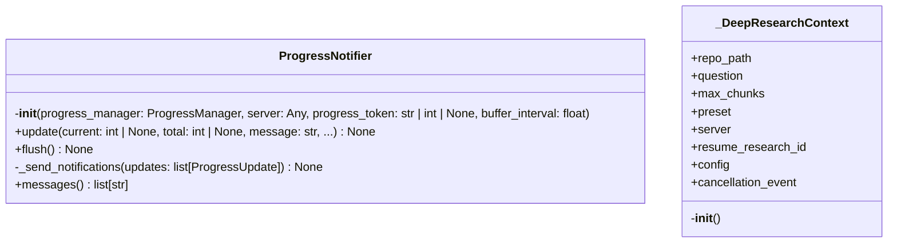

# File Overview

This file, `src/local_deepwiki/handlers.py`, defines the core tool handlers for the Local DeepWiki system. It provides the logic for indexing repositories, performing deep research, and managing progress notifications. The handlers are designed to work within an MCP (Model Control Protocol) environment, supporting asynchronous operations with progress tracking and error handling.

## Key Features

- **Tool Handler Decorators**: Standardized error handling for tool functions.
- **Indexing Operations**: Indexing repository contents with progress reporting.
- **Deep Research**: Execution of research workflows with progress tracking.
- **Progress Management**: Utilities for managing and notifying progress updates.
- **Error Handling**: Consistent error formatting and propagation.

## Dependencies

This file imports from:
- `asyncio`, `json`, `time`, `uuid`: Standard Python libraries.
- `functools.wraps`: For decorator implementation.
- `pathlib.Path`: For filesystem path handling.
- `typing.TYPE_CHECKING`, `Any`, `Awaitable`, `Callable`: Type hints.
- `local_deepwiki.core.deep_research.DeepResearchPipeline`: Core research pipeline.
- `local_deepwiki.models.IndexingProgress`, `ResearchProgress`: Progress models.
- `mcp.types.TextContent`: MCP text content type.
- `pydantic.ValidationError`: For input validation.
- `local_deepwiki.errors`: Custom error types and utilities.
- Various internal modules and utilities for configuration, access control, and logging.

## Integration

This module is a core part of the Local DeepWiki system, integrating with:
- CLI tools (`src/local_deepwiki/cli/__init__.py`)
- Core research logic (`src/local_deepwiki/core/__init__.py`)
- Generator components (`src/local_deepwiki/generators/`)
- Test suite (`tests/test_plugins.py`)

Functions and classes in this file are called by:
- `progress_callback` (used by `deep_research`, `html`, `watcher`, and 4 more)
- `handle_read_wiki_structure`, `handle_read_wiki_page`, `handle_export_wiki_pdf`, `handle_list_research_checkpoints`, `handle_get_glossary`, `handle_detect_stale_docs`, `handle_get_test_examples` (used by tests)

# Classes

## _DeepResearchContext

A context object holding state for deep research execution.

### Attributes

- `repo_path`: The path to the repository being indexed.
- `question`: The research question to be answered.
- `max_chunks`: Maximum number of chunks to process.
- `preset`: Research preset to use.
- `server`: The MCP server instance.
- `resume_research_id`: ID to resume a previous research session.
- `config`: System configuration.
- `progress_token`: Token for progress tracking.

## ProgressNotifier

A class for managing and sending progress notifications via MCP.

### Methods

#### `__init__`

Initialize the notifier.

**Parameters:**
- `progress_manager`: The `ProgressManager` to use for tracking.
- `server`: MCP server instance.
- `progress_token`: Progress token from MCP request.
- `buffer_interval`: Minimum seconds between notifications.

#### `update`

Update progress and send buffered notification.

**Parameters:**
- `current`: Current progress value.
- `total`: Total items.
- `message`: Status message.
- `phase`: Current phase.
- `step_type`: `IndexingProgressType` for backward compatibility.
- `metadata`: Additional metadata.

#### `flush`

Flush any pending notifications.

#### `_send_notifications`

Send MCP progress notifications.

**Parameters:**
- `updates`: List of progress updates to send.

#### `messages`

Get accumulated progress messages.

**Returns:**
- `list[str]`: List of progress messages.

# Functions

## _validate_export_path

Validate that export output path is not in a sensitive system directory.

**Parameters:**
- `output_path`: The requested output path (must be resolved to absolute).
- `wiki_path`: The source wiki path (for context in error messages).

**Returns:**
- `Path`: The validated output path.

**Raises:**
- `ValidationError`: If the output path is in a forbidden directory.

## handle_tool_errors

Decorator for consistent error handling in tool handlers.

**Parameters:**
- `func`: The async tool handler function to wrap.

**Returns:**
- `ToolHandler`: Wrapped function.

## wrapper

Wrapper function for handling exceptions in tool handlers.

**Parameters:**
- `args`: Tool arguments.
- `**kwargs`: Additional keyword arguments.

**Returns:**
- `list[TextContent]`: List of text content with results or error messages.

## handle_index_repository

Handle `index_repository` tool call with streaming progress.

**Parameters:**
- `args`: Tool arguments.
- `server`: Optional MCP server instance for progress notifications.

**Returns:**
- `list[TextContent]`: List of `TextContent` with indexing results.

## _handle_index_repository_impl

Internal implementation of `index_repository` with progress streaming and ETA.

**Parameters:**
- `args`: Tool arguments.
- `server`: Optional MCP server instance for progress notifications.

**Returns:**
- `list[TextContent]`: List of `TextContent` with indexing results.

## sync_progress_callback

Sync callback for indexer - updates state for next async notification.

**Parameters:**
- `msg`: Progress message.
- `current`: Current progress value.
- `total`: Total items.

**Returns:**
- `None`

## handle_ask_question

Handle `ask_question` tool call.

**Parameters:**
- `args`: Tool arguments.
- `server`: Optional MCP server instance.

**Returns:**
- `list[TextContent]`: List of `TextContent` with results.

## handle_deep_research

Handle `deep_research` tool call.

**Parameters:**
- `args`: Tool arguments.
- `server`: Optional MCP server instance.

**Returns:**
- `list[TextContent]`: List of `TextContent` with research results.

## handle_read_wiki_structure

Handle `read_wiki_structure` tool call.

**Parameters:**
- `args`: Tool arguments.
- `server`: Optional MCP server instance.

**Returns:**
- `list[TextContent]`: List of `TextContent` with wiki structure.

## handle_read_wiki_page

Handle `read_wiki_page` tool call.

**Parameters:**
- `args`: Tool arguments.
- `server`: Optional MCP server instance.

**Returns:**
- `list[TextContent]`: List of `TextContent` with wiki page content.

## handle_export_wiki_pdf

Handle `export_wiki_pdf` tool call.

**Parameters:**
- `args`: Tool arguments.
- `server`: Optional MCP server instance.

**Returns:**
- `list[TextContent]`: List of `TextContent` with export results.

## handle_list_research_checkpoints

Handle `list_research_checkpoints` tool call.

**Parameters:**
- `args`: Tool arguments.
- `server`: Optional MCP server instance.

**Returns:**
- `list[TextContent]`: List of `TextContent` with checkpoint information.

## handle_get_glossary

Handle `get_glossary` tool call.

**Parameters:**
- `args`: Tool arguments.
- `server`: Optional MCP server instance.

**Returns:**
- `list[TextContent]`: List of `TextContent` with glossary terms.

## handle_detect_stale_docs

Handle `detect_stale_docs` tool call.

**Parameters:**
- `args`: Tool arguments.
- `server`: Optional MCP server instance.

**Returns:**
- `list[TextContent]`: List of `TextContent` with stale document information.

## handle_get_test_examples

Handle `get_test_examples` tool call.

**Parameters:**
- `args`: Tool arguments.
- `server`: Optional MCP server instance.

**Returns:**
- `list[TextContent]`: List of `TextContent` with test examples.

# Usage Examples

The following examples illustrate how to use the components based on their actual signatures:

```python
# Example usage of handle_index_repository
args = {
    "repo_path": "/path/to/repo",
    "include_patterns": ["*.md"],
    "exclude_patterns": ["node_modules"]
}
result = await handle_index_repository(args)
```

```python
# Example usage of handle_deep_research
args = {
    "question": "What is the purpose of this project?",
    "repo_path": "/path/to/repo"
}
result = await handle_deep_research(args)
```

```python
# Example usage of handle_export_wiki_pdf
args = {
    "output_path": "/path/to/export.pdf",
    "wiki_path": "/path/to/wiki"
}
result = await handle_export_wiki_pdf(args)
```

## API Reference

### class `ProgressNotifier`

Helper class for sending buffered MCP progress notifications.  Integrates ProgressManager with MCP server notifications, handling buffering and async notification delivery.

**Methods:**


<details>
<summary>View Source (lines 2419-2529) | <a href="https://github.com/UrbanDiver/local-deepwiki-mcp/blob/main/src/local_deepwiki/handlers.py#L2419-L2529">GitHub</a></summary>

```python
class ProgressNotifier:
    # Methods: __init__, update, flush, _send_notifications, messages
```

</details>

#### `__init__`

```python
def __init__(progress_manager: ProgressManager, server: Any, progress_token: str | int | None, buffer_interval: float = 0.5)
```

Initialize the notifier.


| Parameter | Type | Default | Description |
|-----------|------|---------|-------------|
| `progress_manager` | `ProgressManager` | - | The ProgressManager to use for tracking. |
| `server` | `Any` | - | MCP server instance. |
| `progress_token` | `str | int | None` | - | Progress token from MCP request. |
| `buffer_interval` | `float` | `0.5` | Minimum seconds between notifications. |


<details>
<summary>View Source (lines 2426-2445) | <a href="https://github.com/UrbanDiver/local-deepwiki-mcp/blob/main/src/local_deepwiki/handlers.py#L2426-L2445">GitHub</a></summary>

```python
def __init__(
        self,
        progress_manager: ProgressManager,
        server: Any,
        progress_token: str | int | None,
        buffer_interval: float = 0.5,
    ):
        """Initialize the notifier.

        Args:
            progress_manager: The ProgressManager to use for tracking.
            server: MCP server instance.
            progress_token: Progress token from MCP request.
            buffer_interval: Minimum seconds between notifications.
        """
        self.progress_manager = progress_manager
        self.server = server
        self.progress_token = progress_token
        self.buffer = ProgressBuffer(flush_interval=buffer_interval)
        self._messages: list[str] = []
```

</details>

#### `update`

```python
async def update(current: int | None = None, total: int | None = None, message: str = "", phase: ProgressPhase | None = None, step_type: IndexingProgressType | None = None, metadata: dict[str, Any] | None = None) -> None
```

Update progress and send buffered notification.


| Parameter | Type | Default | Description |
|-----------|------|---------|-------------|
| `current` | `int | None` | `None` | Current progress value. |
| `total` | `int | None` | `None` | Total items. |
| `message` | `str` | `""` | Status message. |
| `phase` | `ProgressPhase | None` | `None` | Current phase. |
| `step_type` | `IndexingProgressType | None` | `None` | IndexingProgressType for backward compatibility. |
| `metadata` | `dict[str, Any] | None` | `None` | Additional metadata. |


<details>
<summary>View Source (lines 2447-2484) | <a href="https://github.com/UrbanDiver/local-deepwiki-mcp/blob/main/src/local_deepwiki/handlers.py#L2447-L2484">GitHub</a></summary>

```python
async def update(
        self,
        current: int | None = None,
        total: int | None = None,
        message: str = "",
        phase: ProgressPhase | None = None,
        step_type: IndexingProgressType | None = None,
        metadata: dict[str, Any] | None = None,
    ) -> None:
        """Update progress and send buffered notification.

        Args:
            current: Current progress value.
            total: Total items.
            message: Status message.
            phase: Current phase.
            step_type: IndexingProgressType for backward compatibility.
            metadata: Additional metadata.
        """
        # Track message history
        if message:
            self._messages.append(message)

        # Update progress manager
        update = self.progress_manager.update(
            current=current,
            total=total,
            message=message,
            phase=phase,
            metadata=metadata,
        )

        # Add to buffer
        updates_to_send = self.buffer.add(update)

        # Send notifications if buffer flushed
        if updates_to_send:
            await self._send_notifications(updates_to_send)
```

</details>

#### `flush`

```python
async def flush() -> None
```

Flush any pending notifications.


<details>
<summary>View Source (lines 2486-2490) | <a href="https://github.com/UrbanDiver/local-deepwiki-mcp/blob/main/src/local_deepwiki/handlers.py#L2486-L2490">GitHub</a></summary>

```python
async def flush(self) -> None:
        """Flush any pending notifications."""
        updates = self.buffer.flush()
        if updates:
            await self._send_notifications(updates)
```

</details>

#### `messages`

```python
def messages() -> list[str]
```

Get accumulated progress messages.


---


<details>
<summary>View Source (lines 2527-2529) | <a href="https://github.com/UrbanDiver/local-deepwiki-mcp/blob/main/src/local_deepwiki/handlers.py#L2527-L2529">GitHub</a></summary>

```python
def messages(self) -> list[str]:
        """Get accumulated progress messages."""
        return self._messages
```

</details>

### Functions

#### `handle_tool_errors`

```python
def handle_tool_errors(func: ToolHandler) -> ToolHandler
```

Decorator for consistent error handling in tool handlers.  Catches exceptions and returns properly formatted error responses with actionable hints when available:  - DeepWikiError subclasses: Format with message and hint - ValueError: Input validation errors (logged at ERROR level) - Common exceptions: Map to DeepWikiError with appropriate hints - Other exceptions: Log with traceback and return generic error


| Parameter | Type | Default | Description |
|-----------|------|---------|-------------|
| `func` | `ToolHandler` | - | The async tool handler function to wrap. |

**Returns:** `ToolHandler`


<details>
<summary>View Source (lines 208-291) | <a href="https://github.com/UrbanDiver/local-deepwiki-mcp/blob/main/src/local_deepwiki/handlers.py#L208-L291">GitHub</a></summary>

```python
def handle_tool_errors(func: ToolHandler) -> ToolHandler:
    """Decorator for consistent error handling in tool handlers.

    Catches exceptions and returns properly formatted error responses with
    actionable hints when available:

    - DeepWikiError subclasses: Format with message and hint
    - ValueError: Input validation errors (logged at ERROR level)
    - Common exceptions: Map to DeepWikiError with appropriate hints
    - Other exceptions: Log with traceback and return generic error

    Args:
        func: The async tool handler function to wrap.

    Returns:
        Wrapped function with consistent error handling.
    """

    @wraps(func)
    async def wrapper(args: dict[str, Any], **kwargs: Any) -> list[TextContent]:
        try:
            return await func(args, **kwargs)
        except AccessDeniedException as e:
            # RBAC: User lacks required permission
            logger.warning(f"Access denied in {func.__name__}: {e}")
            error = DeepWikiError(
                message=f"Access denied: {e}",
                hint="You don't have permission for this operation. Contact an administrator to request access.",
            )
            return [TextContent(type="text", text=format_error_response(error))]
        except AuthenticationException as e:
            # RBAC: No authenticated subject
            logger.warning(f"Authentication required in {func.__name__}: {e}")
            error = DeepWikiError(
                message=f"Authentication required: {e}",
                hint="Please authenticate before performing this operation.",
            )
            return [TextContent(type="text", text=format_error_response(error))]
        except DeepWikiError as e:
            # Our custom errors already have good messages and hints
            logger.error(f"DeepWiki error in {func.__name__}: {e.message}")
            if e.context:
                logger.debug(f"Error context: {e.context}")
            return [TextContent(type="text", text=format_error_response(e))]
        except ValueError as e:
            # Wrap ValueError in ValidationError for better hints
            error = ValidationError(
                message=str(e),
                hint="Check that all input parameters are valid.",
            )
            logger.error(f"Validation error in {func.__name__}: {e}")
            return [TextContent(type="text", text=format_error_response(error))]
        except (FileNotFoundError, PermissionError) as e:
            # Map common file system errors
            error = map_exception_to_deepwiki_error(e)
            logger.error(f"File system error in {func.__name__}: {e}")
            return [TextContent(type="text", text=format_error_response(error))]
        except (ConnectionError, TimeoutError) as e:
            # Map common network errors
            error = map_exception_to_deepwiki_error(e)
            logger.error(f"Network error in {func.__name__}: {e}")
            return [TextContent(type="text", text=format_error_response(error))]
        except RateLimitExceeded as e:
            # Rate limit exceeded - provide helpful message
            logger.warning(f"Rate limit exceeded in {func.__name__}: {e}")
            error = DeepWikiError(
                message=str(e),
                hint="Wait for the rate limit to reset, or reduce the frequency of requests.",
            )
            return [TextContent(type="text", text=format_error_response(error))]
        except asyncio.CancelledError:
            # Re-raise cancellation to propagate properly
            raise
        except Exception as e:  # noqa: BLE001
            # Broad catch is intentional: top-level error handler for MCP tools
            # that converts any unhandled exception to a user-friendly error message
            logger.exception(f"Unexpected error in {func.__name__}: {e}")
            error = DeepWikiError(
                message=f"An unexpected error occurred: {e}",
                hint="Check the logs for more details. If this persists, please report the issue.",
            )
            return [TextContent(type="text", text=format_error_response(error))]

    return wrapper
```

</details>

#### `wrapper`

`@wraps(func)`

```python
async def wrapper(args: dict[str, Any]) -> list[TextContent]
```


| Parameter | Type | Default | Description |
|-----------|------|---------|-------------|
| `args` | `dict[str, Any]` | - | - |

**Returns:** `list[TextContent]`


<details>
<summary>View Source (lines 227-289) | <a href="https://github.com/UrbanDiver/local-deepwiki-mcp/blob/main/src/local_deepwiki/handlers.py#L227-L289">GitHub</a></summary>

```python
async def wrapper(args: dict[str, Any], **kwargs: Any) -> list[TextContent]:
        try:
            return await func(args, **kwargs)
        except AccessDeniedException as e:
            # RBAC: User lacks required permission
            logger.warning(f"Access denied in {func.__name__}: {e}")
            error = DeepWikiError(
                message=f"Access denied: {e}",
                hint="You don't have permission for this operation. Contact an administrator to request access.",
            )
            return [TextContent(type="text", text=format_error_response(error))]
        except AuthenticationException as e:
            # RBAC: No authenticated subject
            logger.warning(f"Authentication required in {func.__name__}: {e}")
            error = DeepWikiError(
                message=f"Authentication required: {e}",
                hint="Please authenticate before performing this operation.",
            )
            return [TextContent(type="text", text=format_error_response(error))]
        except DeepWikiError as e:
            # Our custom errors already have good messages and hints
            logger.error(f"DeepWiki error in {func.__name__}: {e.message}")
            if e.context:
                logger.debug(f"Error context: {e.context}")
            return [TextContent(type="text", text=format_error_response(e))]
        except ValueError as e:
            # Wrap ValueError in ValidationError for better hints
            error = ValidationError(
                message=str(e),
                hint="Check that all input parameters are valid.",
            )
            logger.error(f"Validation error in {func.__name__}: {e}")
            return [TextContent(type="text", text=format_error_response(error))]
        except (FileNotFoundError, PermissionError) as e:
            # Map common file system errors
            error = map_exception_to_deepwiki_error(e)
            logger.error(f"File system error in {func.__name__}: {e}")
            return [TextContent(type="text", text=format_error_response(error))]
        except (ConnectionError, TimeoutError) as e:
            # Map common network errors
            error = map_exception_to_deepwiki_error(e)
            logger.error(f"Network error in {func.__name__}: {e}")
            return [TextContent(type="text", text=format_error_response(error))]
        except RateLimitExceeded as e:
            # Rate limit exceeded - provide helpful message
            logger.warning(f"Rate limit exceeded in {func.__name__}: {e}")
            error = DeepWikiError(
                message=str(e),
                hint="Wait for the rate limit to reset, or reduce the frequency of requests.",
            )
            return [TextContent(type="text", text=format_error_response(error))]
        except asyncio.CancelledError:
            # Re-raise cancellation to propagate properly
            raise
        except Exception as e:  # noqa: BLE001
            # Broad catch is intentional: top-level error handler for MCP tools
            # that converts any unhandled exception to a user-friendly error message
            logger.exception(f"Unexpected error in {func.__name__}: {e}")
            error = DeepWikiError(
                message=f"An unexpected error occurred: {e}",
                hint="Check the logs for more details. If this persists, please report the issue.",
            )
            return [TextContent(type="text", text=format_error_response(error))]
```

</details>

#### `handle_index_repository`

`@handle_tool_errors`

```python
async def handle_index_repository(args: dict[str, Any], server: Any = None) -> list[TextContent]
```

Handle index_repository tool call with streaming progress.


| Parameter | Type | Default | Description |
|-----------|------|---------|-------------|
| `args` | `dict[str, Any]` | - | Tool arguments. |
| `server` | `Any` | `None` | Optional MCP server instance for progress notifications. |

**Returns:** `list[TextContent]`


<details>
<summary>View Source (lines 295-308) | <a href="https://github.com/UrbanDiver/local-deepwiki-mcp/blob/main/src/local_deepwiki/handlers.py#L295-L308">GitHub</a></summary>

```python
async def handle_index_repository(
    args: dict[str, Any],
    server: Any = None,
) -> list[TextContent]:
    """Handle index_repository tool call with streaming progress.

    Args:
        args: Tool arguments.
        server: Optional MCP server instance for progress notifications.

    Returns:
        List of TextContent with indexing results.
    """
    return await _handle_index_repository_impl(args, server)
```

</details>

#### `sync_progress_callback`

```python
def sync_progress_callback(msg: str, current: int, total: int) -> None
```

Sync callback for indexer - updates state for next async notification.


| Parameter | Type | Default | Description |
|-----------|------|---------|-------------|
| `msg` | `str` | - | - |
| `current` | `int` | - | - |
| `total` | `int` | - | - |

**Returns:** `None`


<details>
<summary>View Source (lines 427-431) | <a href="https://github.com/UrbanDiver/local-deepwiki-mcp/blob/main/src/local_deepwiki/handlers.py#L427-L431">GitHub</a></summary>

```python
def sync_progress_callback(msg: str, current: int, total: int) -> None:
        """Sync callback for indexer - updates state for next async notification."""
        indexing_state["files_processed"] = current
        indexing_state["total_files"] = total
        progress_messages.append(f"[{current}/{total}] {msg}")
```

</details>

#### `handle_ask_question`

`@handle_tool_errors`

```python
async def handle_ask_question(args: dict[str, Any]) -> list[TextContent]
```

Handle ask_question tool call.


| Parameter | Type | Default | Description |
|-----------|------|---------|-------------|
| `args` | `dict[str, Any]` | - | - |

**Returns:** `list[TextContent]`


<details>
<summary>View Source (lines 564-675) | <a href="https://github.com/UrbanDiver/local-deepwiki-mcp/blob/main/src/local_deepwiki/handlers.py#L564-L675">GitHub</a></summary>

```python
async def handle_ask_question(args: dict[str, Any]) -> list[TextContent]:
    """Handle ask_question tool call."""
    # RBAC check - behavior depends on controller mode (disabled/permissive/enforced)
    controller = get_access_controller()
    controller.require_permission(Permission.QUERY_SEARCH)

    # Validate with Pydantic
    try:
        validated = AskQuestionArgs.model_validate(args)
    except PydanticValidationError as e:
        raise ValueError(str(e)) from e

    repo_path = Path(validated.repo_path).resolve()
    question = validated.question
    max_context = validated.max_context

    # Validate input size limits (CWE-400 prevention)
    validate_query_parameters(question, str(repo_path), max_context)

    # Get subject ID for audit logging
    subject = controller.get_current_subject()
    subject_id = subject.identifier if subject else "anonymous"
    audit_logger = get_audit_logger()
    start_time = time.time()

    logger.info(f"Question about {repo_path}: {question[:100]}...")
    logger.debug(f"Max context chunks: {max_context}")

    config = get_config()
    wiki_path = config.get_wiki_path(repo_path)
    vector_db_path = config.get_vector_db_path(repo_path)

    if not vector_db_path.exists():
        raise not_indexed_error(str(repo_path))

    # Create vector store
    embedding_provider = get_embedding_provider(config.embedding)
    vector_store = VectorStore(vector_db_path, embedding_provider)

    # Search for relevant context
    search_results = await vector_store.search(question, limit=max_context)

    if not search_results:
        return [
            TextContent(type="text", text="No relevant code found for your question.")
        ]

    # Build context from search results
    context_parts = []
    for search_result in search_results:
        chunk = search_result.chunk
        context_parts.append(
            f"File: {chunk.file_path} (lines {chunk.start_line}-{chunk.end_line})\n"
            f"Type: {chunk.chunk_type.value}\n"
            f"```\n{chunk.content}\n```"
        )

    context = "\n\n---\n\n".join(context_parts)

    # Generate answer using LLM (with caching if enabled)
    from local_deepwiki.providers.llm import get_cached_llm_provider

    cache_path = wiki_path / "llm_cache.lance"
    llm = get_cached_llm_provider(
        cache_path=cache_path,
        embedding_provider=embedding_provider,
        cache_config=config.llm_cache,
        llm_config=config.llm,
    )

    prompt = f"""Based on the following code context, answer this question: {question}

Code Context:
{context}

Provide a clear, accurate answer based only on the code provided. If the code doesn't contain enough information to answer fully, say so."""

    system_prompt = "You are a helpful code assistant. Answer questions about code clearly and accurately."

    # Acquire rate limit before LLM call
    rate_limiter = get_rate_limiter()
    async with rate_limiter:
        answer = await llm.generate(prompt, system_prompt=system_prompt)

    result = {
        "question": question,
        "answer": answer,
        "sources": [
            {
                "file": r.chunk.file_path,
                "lines": f"{r.chunk.start_line}-{r.chunk.end_line}",
                "type": r.chunk.chunk_type.value,
                "score": r.score,
            }
            for r in search_results
        ],
    }

    # Audit: Log query execution success
    duration_ms = int((time.time() - start_time) * 1000)
    audit_logger.log_query_execution(
        subject_id=subject_id,
        repo_path=str(repo_path),
        query=question,
        success=True,
        query_type="ask_question",
        chunks_returned=len(search_results),
        duration_ms=duration_ms,
    )

    logger.info(f"Generated answer with {len(search_results)} sources")
    return [TextContent(type="text", text=json.dumps(result, indent=2))]
```

</details>

#### `handle_deep_research`

`@handle_tool_errors`

```python
async def handle_deep_research(args: dict[str, Any], server: Any = None) -> list[TextContent]
```

Handle deep_research tool call for multi-step reasoning.


| Parameter | Type | Default | Description |
|-----------|------|---------|-------------|
| `args` | `dict[str, Any]` | - | Tool arguments. |
| `server` | `Any` | `None` | Optional MCP server instance for progress notifications. |

**Returns:** `list[TextContent]`


<details>
<summary>View Source (lines 679-692) | <a href="https://github.com/UrbanDiver/local-deepwiki-mcp/blob/main/src/local_deepwiki/handlers.py#L679-L692">GitHub</a></summary>

```python
async def handle_deep_research(
    args: dict[str, Any],
    server: Any = None,
) -> list[TextContent]:
    """Handle deep_research tool call for multi-step reasoning.

    Args:
        args: Tool arguments.
        server: Optional MCP server instance for progress notifications.

    Returns:
        List of TextContent with research results.
    """
    return await _handle_deep_research_impl(args, server)
```

</details>

#### `is_cancelled`

```python
def is_cancelled() -> bool
```

Check if the research should be cancelled.

**Returns:** `bool`


<details>
<summary>View Source (lines 861-873) | <a href="https://github.com/UrbanDiver/local-deepwiki-mcp/blob/main/src/local_deepwiki/handlers.py#L861-L873">GitHub</a></summary>

```python
def is_cancelled() -> bool:
        """Check if the research should be cancelled."""
        # Check both our event and the current task's cancellation state
        if ctx.cancellation_event.is_set():
            return True
        # Check if current asyncio task is being cancelled
        try:
            task = asyncio.current_task()
            if task and task.cancelled():
                return True
        except RuntimeError:
            pass
        return False
```

</details>

#### `progress_callback`

```python
async def progress_callback(progress: ResearchProgress) -> None
```

Send MCP progress notifications.


| Parameter | Type | Default | Description |
|-----------|------|---------|-------------|
| `progress` | `ResearchProgress` | - | - |

**Returns:** `None`


<details>
<summary>View Source (lines 875-891) | <a href="https://github.com/UrbanDiver/local-deepwiki-mcp/blob/main/src/local_deepwiki/handlers.py#L875-L891">GitHub</a></summary>

```python
async def progress_callback(progress: ResearchProgress) -> None:
        """Send MCP progress notifications."""
        if ctx.progress_token is None or ctx.server is None:
            return
        try:
            request_ctx = ctx.server.request_context
            await request_ctx.session.send_progress_notification(
                progress_token=ctx.progress_token,
                progress=float(progress.step),
                total=float(progress.total_steps),
                message=progress.model_dump_json(),
            )
        except (RuntimeError, OSError, AttributeError) as e:
            # RuntimeError: Session or context issues
            # OSError: Network communication failures
            # AttributeError: Missing session/context attributes
            logger.warning(f"Failed to send progress notification: {e}")
```

</details>

#### `send_cancellation_notification`

```python
async def send_cancellation_notification(step: str) -> None
```

Send a cancellation progress notification.


| Parameter | Type | Default | Description |
|-----------|------|---------|-------------|
| `step` | `str` | - | - |

**Returns:** `None`


<details>
<summary>View Source (lines 893-914) | <a href="https://github.com/UrbanDiver/local-deepwiki-mcp/blob/main/src/local_deepwiki/handlers.py#L893-L914">GitHub</a></summary>

```python
async def send_cancellation_notification(step: str) -> None:
        """Send a cancellation progress notification."""
        if ctx.progress_token is None or ctx.server is None:
            return
        try:
            request_ctx = ctx.server.request_context
            progress = ResearchProgress(
                step=0,
                step_type=ResearchProgressType.CANCELLED,
                message=f"Research cancelled during {step}",
            )
            await request_ctx.session.send_progress_notification(
                progress_token=ctx.progress_token,
                progress=0.0,
                total=5.0,
                message=progress.model_dump_json(),
            )
        except (RuntimeError, OSError, AttributeError) as e:
            # RuntimeError: Session or context issues
            # OSError: Network communication failures
            # AttributeError: Missing session/context attributes
            logger.warning(f"Failed to send cancellation notification: {e}")
```

</details>

#### `handle_read_wiki_structure`

`@handle_tool_errors`

```python
async def handle_read_wiki_structure(args: dict[str, Any]) -> list[TextContent]
```

Handle read_wiki_structure tool call.


| Parameter | Type | Default | Description |
|-----------|------|---------|-------------|
| `args` | `dict[str, Any]` | - | - |

**Returns:** `list[TextContent]`


<details>
<summary>View Source (lines 1066-1132) | <a href="https://github.com/UrbanDiver/local-deepwiki-mcp/blob/main/src/local_deepwiki/handlers.py#L1066-L1132">GitHub</a></summary>

```python
async def handle_read_wiki_structure(args: dict[str, Any]) -> list[TextContent]:
    """Handle read_wiki_structure tool call."""
    # RBAC check - behavior depends on controller mode (disabled/permissive/enforced)
    controller = get_access_controller()
    controller.require_permission(Permission.INDEX_READ)

    # Validate with Pydantic
    try:
        validated = ReadWikiStructureArgs.model_validate(args)
    except PydanticValidationError as e:
        raise ValueError(str(e)) from e

    wiki_path = Path(validated.wiki_path).resolve()

    if not wiki_path.exists():
        raise path_not_found_error(str(wiki_path), "wiki")

    # Check for toc.json (numbered hierarchical structure)
    toc_path = wiki_path / "toc.json"
    if toc_path.exists():
        try:
            toc_content = await asyncio.to_thread(toc_path.read_text)
            toc_data = json.loads(toc_content)
            return [TextContent(type="text", text=json.dumps(toc_data, indent=2))]
        except (json.JSONDecodeError, OSError):
            pass  # Fall back to dynamic generation

    # Fall back to dynamic generation if no toc.json
    pages = []
    for md_file in wiki_path.rglob("*.md"):
        rel_path = str(md_file.relative_to(wiki_path))
        # Read first line for title
        try:
            file_content = await asyncio.to_thread(md_file.read_text)
            first_line = file_content.split("\n", 1)[0].strip()
            title = (
                first_line.lstrip("#").strip()
                if first_line.startswith("#")
                else rel_path
            )
        except (OSError, UnicodeDecodeError) as e:
            # OSError: File access issues
            # UnicodeDecodeError: File encoding issues
            logger.debug(f"Could not read title from {md_file}: {e}")
            title = rel_path

        pages.append(
            {
                "path": rel_path,
                "title": title,
            }
        )

    # Build hierarchical structure (legacy format without numbers)
    structure: dict[str, Any] = {"pages": [], "sections": {}}

    for page in sorted(pages, key=lambda p: p["path"]):
        parts = Path(page["path"]).parts
        if len(parts) == 1:
            structure["pages"].append(page)
        else:
            section = parts[0]
            if section not in structure["sections"]:
                structure["sections"][section] = []
            structure["sections"][section].append(page)

    return [TextContent(type="text", text=json.dumps(structure, indent=2))]
```

</details>

#### `handle_read_wiki_page`

`@handle_tool_errors`

```python
async def handle_read_wiki_page(args: dict[str, Any]) -> list[TextContent]
```

Handle read_wiki_page tool call.


| Parameter | Type | Default | Description |
|-----------|------|---------|-------------|
| `args` | `dict[str, Any]` | - | - |

**Returns:** `list[TextContent]`


<details>
<summary>View Source (lines 1136-1177) | <a href="https://github.com/UrbanDiver/local-deepwiki-mcp/blob/main/src/local_deepwiki/handlers.py#L1136-L1177">GitHub</a></summary>

```python
async def handle_read_wiki_page(args: dict[str, Any]) -> list[TextContent]:
    """Handle read_wiki_page tool call."""
    # RBAC check - behavior depends on controller mode (disabled/permissive/enforced)
    controller = get_access_controller()
    controller.require_permission(Permission.INDEX_READ)

    # Validate with Pydantic
    try:
        validated = ReadWikiPageArgs.model_validate(args)
    except PydanticValidationError as e:
        raise ValueError(str(e)) from e

    wiki_path = Path(validated.wiki_path).resolve()
    page = validated.page

    # Resolve the full path and validate it's within the wiki directory
    # This prevents path traversal attacks (e.g., "../../etc/passwd")
    page_path = (wiki_path / page).resolve()
    if not page_path.is_relative_to(wiki_path):
        raise ValidationError(
            message="Invalid page path: path traversal not allowed",
            hint="The page path must be within the wiki directory.",
            field="page",
            value=page,
        )

    if not page_path.exists():
        raise path_not_found_error(page, "wiki page")

    # Check file size to prevent memory exhaustion
    file_size = page_path.stat().st_size
    if file_size > MAX_WIKI_PAGE_SIZE:
        raise ValidationError(
            message=f"Page too large: {file_size:,} bytes",
            hint=f"Maximum allowed size is {MAX_WIKI_PAGE_SIZE:,} bytes. Consider splitting the content.",
            field="page",
            value=page,
            context={"file_size": file_size, "max_size": MAX_WIKI_PAGE_SIZE},
        )

    content = await asyncio.to_thread(page_path.read_text)
    return [TextContent(type="text", text=content)]
```

</details>

#### `handle_search_code`

`@handle_tool_errors`

```python
async def handle_search_code(args: dict[str, Any]) -> list[TextContent]
```

Handle search_code tool call.  Supports both vector similarity search and optional fuzzy matching, with filters for language, chunk type, and file path patterns.


| Parameter | Type | Default | Description |
|-----------|------|---------|-------------|
| `args` | `dict[str, Any]` | - | - |

**Returns:** `list[TextContent]`


<details>
<summary>View Source (lines 1181-1259) | <a href="https://github.com/UrbanDiver/local-deepwiki-mcp/blob/main/src/local_deepwiki/handlers.py#L1181-L1259">GitHub</a></summary>

```python
async def handle_search_code(args: dict[str, Any]) -> list[TextContent]:
    """Handle search_code tool call.

    Supports both vector similarity search and optional fuzzy matching,
    with filters for language, chunk type, and file path patterns.
    """
    # RBAC check - behavior depends on controller mode (disabled/permissive/enforced)
    controller = get_access_controller()
    controller.require_permission(Permission.QUERY_SEARCH)

    # Validate with Pydantic
    try:
        validated = SearchCodeArgs.model_validate(args)
    except PydanticValidationError as e:
        raise ValueError(str(e)) from e

    repo_path = Path(validated.repo_path).resolve()
    query = validated.query
    limit = validated.limit
    language = validate_language(validated.language)
    chunk_type = validate_chunk_type(validated.type)
    path_pattern = validate_path_pattern(validated.path)
    use_fuzzy = validated.fuzzy
    fuzzy_weight = validated.fuzzy_weight

    logger.info(f"Code search in {repo_path}: {query[:50]}...")
    logger.debug(
        f"Search limit: {limit}, language: {language}, type: {chunk_type}, "
        f"path: {path_pattern}, fuzzy: {use_fuzzy}"
    )

    config = get_config()
    vector_db_path = config.get_vector_db_path(repo_path)

    if not vector_db_path.exists():
        raise not_indexed_error(str(repo_path))

    # Create vector store
    embedding_provider = get_embedding_provider(config.embedding)
    vector_store = VectorStore(vector_db_path, embedding_provider)

    # Search with filters
    results = await vector_store.search(
        query,
        limit=limit,
        language=language,
        chunk_type=chunk_type,
        path_pattern=path_pattern,
        use_fuzzy=use_fuzzy,
        fuzzy_weight=fuzzy_weight,
    )

    logger.info(f"Search returned {len(results)} results")
    if not results:
        return [TextContent(type="text", text="No results found.")]

    output = []
    for r in results:
        chunk = r.chunk
        result_entry: dict[str, Any] = {
            "file_path": chunk.file_path,
            "name": chunk.name,
            "type": chunk.chunk_type.value,
            "language": chunk.language.value,
            "lines": f"{chunk.start_line}-{chunk.end_line}",
            "score": round(r.score, 4),
            "preview": (
                chunk.content[:300] + "..."
                if len(chunk.content) > 300
                else chunk.content
            ),
            "docstring": chunk.docstring,
        }
        # Include highlights if present (from fuzzy search)
        if r.highlights:
            result_entry["highlights"] = r.highlights
        output.append(result_entry)

    return [TextContent(type="text", text=json.dumps(output, indent=2))]
```

</details>

#### `handle_export_wiki_html`

`@handle_tool_errors`

```python
async def handle_export_wiki_html(args: dict[str, Any]) -> list[TextContent]
```

Handle export_wiki_html tool call with streaming support for large wikis.


| Parameter | Type | Default | Description |
|-----------|------|---------|-------------|
| `args` | `dict[str, Any]` | - | - |

**Returns:** `list[TextContent]`


<details>
<summary>View Source (lines 1263-1347) | <a href="https://github.com/UrbanDiver/local-deepwiki-mcp/blob/main/src/local_deepwiki/handlers.py#L1263-L1347">GitHub</a></summary>

```python
async def handle_export_wiki_html(args: dict[str, Any]) -> list[TextContent]:
    """Handle export_wiki_html tool call with streaming support for large wikis."""
    # RBAC check - behavior depends on controller mode (disabled/permissive/enforced)
    controller = get_access_controller()
    controller.require_permission(Permission.EXPORT_HTML)

    from local_deepwiki.export.html import export_to_html
    from local_deepwiki.export.streaming import ExportConfig, WikiPageIterator

    # Validate with Pydantic
    try:
        validated = ExportWikiHtmlArgs.model_validate(args)
    except PydanticValidationError as e:
        raise ValueError(str(e)) from e

    wiki_path = Path(validated.wiki_path).resolve()
    output_path = validated.output_path

    if not wiki_path.exists():
        raise path_not_found_error(str(wiki_path), "wiki")

    # Determine and validate output path
    if output_path:
        output_path = _validate_export_path(Path(output_path), wiki_path)
    else:
        output_path = wiki_path.parent / f"{wiki_path.name}_html"
        # Validate default path as well
        output_path = _validate_export_path(output_path, wiki_path)

    # Get subject ID for audit logging
    subject = controller.get_current_subject()
    subject_id = subject.identifier if subject else "anonymous"
    audit_logger = get_audit_logger()
    start_time = time.time()

    # Audit: Log export operation started
    actual_output = output_path
    audit_logger.log_export_operation(
        subject_id=subject_id,
        wiki_path=str(wiki_path),
        output_path=str(actual_output),
        export_type="html",
        operation="started",
        success=True,
    )

    # Check wiki size and recommend streaming if large
    iterator = WikiPageIterator(wiki_path)
    page_count = iterator.get_page_count()
    total_size_mb = iterator.get_total_size_bytes() / (1024 * 1024)
    use_streaming = iterator.should_use_streaming()

    logger.info(
        f"Wiki export: {page_count} pages, {total_size_mb:.2f}MB, "
        f"streaming: {use_streaming}"
    )

    result = export_to_html(wiki_path, output_path)

    # Audit: Log export operation completed
    duration_ms = int((time.time() - start_time) * 1000)
    audit_logger.log_export_operation(
        subject_id=subject_id,
        wiki_path=str(wiki_path),
        output_path=str(actual_output),
        export_type="html",
        operation="completed",
        success=True,
        pages_exported=page_count,
        duration_ms=duration_ms,
    )

    response = {
        "status": "success",
        "message": result,
        "output_path": str(actual_output),
        "open_with": f"open {actual_output}/index.html",
        "stats": {
            "pages_exported": page_count,
            "total_size_mb": round(total_size_mb, 2),
            "streaming_mode": use_streaming,
        },
    }

    return [TextContent(type="text", text=json.dumps(response, indent=2))]
```

</details>

#### `handle_export_wiki_pdf`

`@handle_tool_errors`

```python
async def handle_export_wiki_pdf(args: dict[str, Any]) -> list[TextContent]
```

Handle export_wiki_pdf tool call with streaming support for large wikis.


| Parameter | Type | Default | Description |
|-----------|------|---------|-------------|
| `args` | `dict[str, Any]` | - | - |

**Returns:** `list[TextContent]`


<details>
<summary>View Source (lines 1351-1440) | <a href="https://github.com/UrbanDiver/local-deepwiki-mcp/blob/main/src/local_deepwiki/handlers.py#L1351-L1440">GitHub</a></summary>

```python
async def handle_export_wiki_pdf(args: dict[str, Any]) -> list[TextContent]:
    """Handle export_wiki_pdf tool call with streaming support for large wikis."""
    # RBAC check - behavior depends on controller mode (disabled/permissive/enforced)
    controller = get_access_controller()
    controller.require_permission(Permission.EXPORT_PDF)

    from local_deepwiki.export.pdf import export_to_pdf
    from local_deepwiki.export.streaming import ExportConfig, WikiPageIterator

    # Validate with Pydantic
    try:
        validated = ExportWikiPdfArgs.model_validate(args)
    except PydanticValidationError as e:
        raise ValueError(str(e)) from e

    wiki_path = Path(validated.wiki_path).resolve()
    output_path = validated.output_path
    single_file = validated.single_file

    if not wiki_path.exists():
        raise path_not_found_error(str(wiki_path), "wiki")

    # Determine and validate output path
    if output_path:
        output_path = _validate_export_path(Path(output_path), wiki_path)
    else:
        # Determine default path based on single_file mode
        if single_file:
            output_path = wiki_path.parent / f"{wiki_path.name}.pdf"
        else:
            output_path = wiki_path.parent / f"{wiki_path.name}_pdfs"
        # Validate default path as well
        output_path = _validate_export_path(output_path, wiki_path)

    # Get subject ID for audit logging
    subject = controller.get_current_subject()
    subject_id = subject.identifier if subject else "anonymous"
    audit_logger = get_audit_logger()
    start_time = time.time()

    actual_output = output_path

    # Audit: Log export operation started
    audit_logger.log_export_operation(
        subject_id=subject_id,
        wiki_path=str(wiki_path),
        output_path=str(actual_output),
        export_type="pdf",
        operation="started",
        success=True,
    )

    # Check wiki size for stats
    iterator = WikiPageIterator(wiki_path)
    page_count = iterator.get_page_count()
    total_size_mb = iterator.get_total_size_bytes() / (1024 * 1024)
    use_streaming = iterator.should_use_streaming()

    logger.info(
        f"PDF export: {page_count} pages, {total_size_mb:.2f}MB, "
        f"streaming: {use_streaming}"
    )

    result = export_to_pdf(wiki_path, output_path, single_file=single_file)

    # Audit: Log export operation completed
    duration_ms = int((time.time() - start_time) * 1000)
    audit_logger.log_export_operation(
        subject_id=subject_id,
        wiki_path=str(wiki_path),
        output_path=str(actual_output),
        export_type="pdf",
        operation="completed",
        success=True,
        pages_exported=page_count,
        duration_ms=duration_ms,
    )

    response = {
        "status": "success",
        "message": result,
        "output_path": str(actual_output),
        "stats": {
            "pages_exported": page_count,
            "total_size_mb": round(total_size_mb, 2),
            "streaming_mode": use_streaming,
        },
    }

    return [TextContent(type="text", text=json.dumps(response, indent=2))]
```

</details>

#### `handle_list_research_checkpoints`

`@handle_tool_errors`

```python
async def handle_list_research_checkpoints(args: dict[str, Any]) -> list[TextContent]
```

Handle list_research_checkpoints tool call.  Lists all research checkpoints for a repository, including incomplete and cancelled research sessions that can be resumed.


| Parameter | Type | Default | Description |
|-----------|------|---------|-------------|
| `args` | `dict[str, Any]` | - | - |

**Returns:** `list[TextContent]`


<details>
<summary>View Source (lines 1444-1505) | <a href="https://github.com/UrbanDiver/local-deepwiki-mcp/blob/main/src/local_deepwiki/handlers.py#L1444-L1505">GitHub</a></summary>

```python
async def handle_list_research_checkpoints(args: dict[str, Any]) -> list[TextContent]:
    """Handle list_research_checkpoints tool call.

    Lists all research checkpoints for a repository, including incomplete
    and cancelled research sessions that can be resumed.
    """
    from local_deepwiki.core.deep_research import list_research_checkpoints

    # Validate with Pydantic
    try:
        validated = ListResearchCheckpointsArgs.model_validate(args)
    except PydanticValidationError as e:
        raise ValueError(str(e)) from e

    repo_path = Path(validated.repo_path).resolve()

    if not repo_path.exists():
        raise path_not_found_error(str(repo_path), "repository")

    checkpoints = list_research_checkpoints(repo_path)

    if not checkpoints:
        return [
            TextContent(
                type="text",
                text=json.dumps(
                    {
                        "status": "success",
                        "message": "No research checkpoints found",
                        "checkpoints": [],
                    },
                    indent=2,
                ),
            )
        ]

    # Format checkpoints for output
    checkpoint_list = []
    for cp in checkpoints:
        checkpoint_list.append(
            {
                "research_id": cp.research_id,
                "question": cp.question[:100] + "..."
                if len(cp.question) > 100
                else cp.question,
                "current_step": cp.current_step.value,
                "completed_steps": cp.completed_steps,
                "started_at": cp.started_at,
                "updated_at": cp.updated_at,
                "can_resume": cp.current_step.value not in ("complete", "error"),
                "error": cp.error,
            }
        )

    response = {
        "status": "success",
        "checkpoint_count": len(checkpoints),
        "checkpoints": checkpoint_list,
    }

    logger.info(f"Listed {len(checkpoints)} research checkpoints for {repo_path}")
    return [TextContent(type="text", text=json.dumps(response, indent=2))]
```

</details>

#### `handle_cancel_research`

`@handle_tool_errors`

```python
async def handle_cancel_research(args: dict[str, Any]) -> list[TextContent]
```

Handle cancel_research tool call.  Cancels an active research session and saves its checkpoint for potential resumption later.


| Parameter | Type | Default | Description |
|-----------|------|---------|-------------|
| `args` | `dict[str, Any]` | - | - |

**Returns:** `list[TextContent]`


<details>
<summary>View Source (lines 1509-1555) | <a href="https://github.com/UrbanDiver/local-deepwiki-mcp/blob/main/src/local_deepwiki/handlers.py#L1509-L1555">GitHub</a></summary>

```python
async def handle_cancel_research(args: dict[str, Any]) -> list[TextContent]:
    """Handle cancel_research tool call.

    Cancels an active research session and saves its checkpoint for
    potential resumption later.
    """
    from local_deepwiki.core.deep_research import cancel_research

    # Validate with Pydantic
    try:
        validated = CancelResearchArgs.model_validate(args)
    except PydanticValidationError as e:
        raise ValueError(str(e)) from e

    repo_path = Path(validated.repo_path).resolve()
    research_id = validated.research_id

    if not repo_path.exists():
        raise path_not_found_error(str(repo_path), "repository")

    checkpoint = cancel_research(repo_path, research_id)

    if not checkpoint:
        return [
            TextContent(
                type="text",
                text=json.dumps(
                    {
                        "status": "error",
                        "message": f"Research checkpoint {research_id} not found",
                    },
                    indent=2,
                ),
            )
        ]

    response = {
        "status": "success",
        "message": f"Research {research_id} cancelled and checkpointed",
        "research_id": checkpoint.research_id,
        "question": checkpoint.question,
        "completed_steps": checkpoint.completed_steps,
        "hint": "Use deep_research with resume_research_id to continue later",
    }

    logger.info(f"Cancelled research {research_id}")
    return [TextContent(type="text", text=json.dumps(response, indent=2))]
```

</details>

#### `handle_resume_research`

`@handle_tool_errors`

```python
async def handle_resume_research(args: dict[str, Any], server: Any = None) -> list[TextContent]
```

Handle resume_research tool call.  Resumes a previously interrupted research session from its checkpoint. This is a convenience wrapper around deep_research with resume_research_id.


| Parameter | Type | Default | Description |
|-----------|------|---------|-------------|
| `args` | `dict[str, Any]` | - | - |
| `server` | `Any` | `None` | - |

**Returns:** `list[TextContent]`


<details>
<summary>View Source (lines 1559-1620) | <a href="https://github.com/UrbanDiver/local-deepwiki-mcp/blob/main/src/local_deepwiki/handlers.py#L1559-L1620">GitHub</a></summary>

```python
async def handle_resume_research(
    args: dict[str, Any],
    server: Any = None,
) -> list[TextContent]:
    """Handle resume_research tool call.

    Resumes a previously interrupted research session from its checkpoint.
    This is a convenience wrapper around deep_research with resume_research_id.
    """
    from local_deepwiki.core.deep_research import get_research_checkpoint

    # Validate with Pydantic
    try:
        validated = ResumeResearchArgs.model_validate(args)
    except PydanticValidationError as e:
        raise ValueError(str(e)) from e

    repo_path = Path(validated.repo_path).resolve()
    research_id = validated.research_id

    if not repo_path.exists():
        raise path_not_found_error(str(repo_path), "repository")

    # Load the checkpoint to get the original question
    checkpoint = get_research_checkpoint(repo_path, research_id)

    if not checkpoint:
        return [
            TextContent(
                type="text",
                text=json.dumps(
                    {
                        "status": "error",
                        "message": f"Research checkpoint {research_id} not found",
                    },
                    indent=2,
                ),
            )
        ]

    if checkpoint.current_step.value == "complete":
        return [
            TextContent(
                type="text",
                text=json.dumps(
                    {
                        "status": "error",
                        "message": f"Research {research_id} is already complete",
                    },
                    indent=2,
                ),
            )
        ]

    # Delegate to deep_research handler with resume_research_id
    deep_research_args = {
        "repo_path": str(repo_path),
        "question": checkpoint.question,
        "resume_research_id": research_id,
    }

    return await handle_deep_research(deep_research_args, server)
```

</details>

#### `handle_get_operation_progress`

`@handle_tool_errors`

```python
async def handle_get_operation_progress(args: dict[str, Any]) -> list[TextContent]
```

Handle get_operation_progress tool call.  Returns current progress for active operations, supporting the pull-based progress model for clients that cannot receive push notifications.


| Parameter | Type | Default | Description |
|-----------|------|---------|-------------|
| `args` | `dict[str, Any]` | - | - |

**Returns:** `list[TextContent]`


<details>
<summary>View Source (lines 1624-1664) | <a href="https://github.com/UrbanDiver/local-deepwiki-mcp/blob/main/src/local_deepwiki/handlers.py#L1624-L1664">GitHub</a></summary>

```python
async def handle_get_operation_progress(args: dict[str, Any]) -> list[TextContent]:
    """Handle get_operation_progress tool call.

    Returns current progress for active operations, supporting the
    pull-based progress model for clients that cannot receive push notifications.
    """
    # Validate with Pydantic
    try:
        validated = GetOperationProgressArgs.model_validate(args)
    except PydanticValidationError as e:
        raise ValueError(str(e)) from e

    registry = get_progress_registry()
    operation_id = validated.operation_id

    if operation_id:
        # Get progress for specific operation
        progress = registry.get_operation_progress(operation_id)
        if not progress:
            return [
                TextContent(
                    type="text",
                    text=json.dumps(
                        {
                            "status": "not_found",
                            "message": f"Operation {operation_id} not found or already completed",
                        },
                        indent=2,
                    ),
                )
            ]
        return [TextContent(type="text", text=json.dumps(progress, indent=2))]
    else:
        # List all active operations
        operations = registry.list_operations()
        response = {
            "status": "success",
            "active_operations": len(operations),
            "operations": operations,
        }
        return [TextContent(type="text", text=json.dumps(response, indent=2))]
```

</details>

#### `handle_get_glossary`

`@handle_tool_errors`

```python
async def handle_get_glossary(args: dict[str, Any]) -> list[TextContent]
```

Handle get_glossary tool call.


| Parameter | Type | Default | Description |
|-----------|------|---------|-------------|
| `args` | `dict[str, Any]` | - | - |

**Returns:** `list[TextContent]`


<details>
<summary>View Source (lines 1702-1751) | <a href="https://github.com/UrbanDiver/local-deepwiki-mcp/blob/main/src/local_deepwiki/handlers.py#L1702-L1751">GitHub</a></summary>

```python
async def handle_get_glossary(args: dict[str, Any]) -> list[TextContent]:
    """Handle get_glossary tool call."""
    controller = get_access_controller()
    controller.require_permission(Permission.INDEX_READ)

    try:
        validated = GetGlossaryArgs.model_validate(args)
    except PydanticValidationError as e:
        raise ValueError(str(e)) from e

    repo_path = Path(validated.repo_path).resolve()
    search_term = validated.search

    if not repo_path.exists():
        raise path_not_found_error(str(repo_path), "repository")

    index_status, wiki_path, config = _load_index_status(repo_path)

    from local_deepwiki.generators.glossary import collect_all_entities

    embedding_provider = get_embedding_provider(config.embedding)
    vector_store = VectorStore(config.get_vector_db_path(repo_path), embedding_provider)

    entities = await collect_all_entities(index_status, vector_store)

    if search_term:
        search_lower = search_term.lower()
        entities = [
            e
            for e in entities
            if search_lower in e.name.lower()
            or (e.docstring and search_lower in e.docstring.lower())
        ]

    result = {
        "status": "success",
        "total_entities": len(entities),
        "entities": [
            {
                "name": e.name,
                "type": e.entity_type,
                "file_path": e.file_path,
                "docstring": e.docstring,
            }
            for e in entities
        ],
    }

    logger.info(f"Glossary: {len(entities)} entities for {repo_path}")
    return [TextContent(type="text", text=json.dumps(result, indent=2))]
```

</details>

#### `handle_get_diagrams`

`@handle_tool_errors`

```python
async def handle_get_diagrams(args: dict[str, Any]) -> list[TextContent]
```

Handle get_diagrams tool call.


| Parameter | Type | Default | Description |
|-----------|------|---------|-------------|
| `args` | `dict[str, Any]` | - | - |

**Returns:** `list[TextContent]`


<details>
<summary>View Source (lines 1755-1839) | <a href="https://github.com/UrbanDiver/local-deepwiki-mcp/blob/main/src/local_deepwiki/handlers.py#L1755-L1839">GitHub</a></summary>

```python
async def handle_get_diagrams(args: dict[str, Any]) -> list[TextContent]:
    """Handle get_diagrams tool call."""
    controller = get_access_controller()
    controller.require_permission(Permission.INDEX_READ)

    try:
        validated = GetDiagramsArgs.model_validate(args)
    except PydanticValidationError as e:
        raise ValueError(str(e)) from e

    repo_path = Path(validated.repo_path).resolve()
    diagram_type = validated.diagram_type
    entry_point = validated.entry_point

    if not repo_path.exists():
        raise path_not_found_error(str(repo_path), "repository")

    index_status, wiki_path, config = _load_index_status(repo_path)

    from local_deepwiki.generators.diagrams import (
        generate_class_diagram,
        generate_dependency_graph,
        generate_language_pie_chart,
        generate_module_overview,
        generate_sequence_diagram,
    )
    from local_deepwiki.generators.callgraph import CallGraphExtractor

    embedding_provider = get_embedding_provider(config.embedding)
    vector_store = VectorStore(config.get_vector_db_path(repo_path), embedding_provider)

    # Collect chunks from vector store for diagram generation
    all_chunks = list(vector_store.get_all_chunks())

    diagram: str | None = None

    if diagram_type.value == "class":
        diagram = generate_class_diagram(all_chunks)
    elif diagram_type.value == "dependency":
        diagram = generate_dependency_graph(all_chunks)
    elif diagram_type.value == "module":
        diagram = generate_module_overview(index_status)
    elif diagram_type.value == "language_pie":
        diagram = generate_language_pie_chart(index_status)
    elif diagram_type.value == "sequence":
        if entry_point:
            # Build call graph first
            extractor = CallGraphExtractor()
            combined_graph: dict[str, list[str]] = {}
            for file_info in index_status.files:
                file_path = repo_path / file_info.path
                if file_path.exists():
                    graph = extractor.extract_from_file(file_path, repo_path)
                    for k, v in graph.items():
                        combined_graph.setdefault(k, []).extend(v)
            diagram = generate_sequence_diagram(combined_graph, entry_point=entry_point)
        else:
            raise ValidationError(
                message="entry_point is required for sequence diagrams",
                hint="Provide the name of the function to use as the sequence diagram entry point.",
                field="entry_point",
            )

    if diagram is None:
        return [
            TextContent(
                type="text",
                text=json.dumps(
                    {
                        "status": "success",
                        "message": f"No {diagram_type.value} diagram could be generated (no relevant data found)",
                    },
                    indent=2,
                ),
            )
        ]

    result = {
        "status": "success",
        "diagram_type": diagram_type.value,
        "mermaid": diagram,
    }

    logger.info(f"Generated {diagram_type.value} diagram for {repo_path}")
    return [TextContent(type="text", text=json.dumps(result, indent=2))]
```

</details>

#### `handle_get_inheritance`

`@handle_tool_errors`

```python
async def handle_get_inheritance(args: dict[str, Any]) -> list[TextContent]
```

Handle get_inheritance tool call.


| Parameter | Type | Default | Description |
|-----------|------|---------|-------------|
| `args` | `dict[str, Any]` | - | - |

**Returns:** `list[TextContent]`


<details>
<summary>View Source (lines 1843-1905) | <a href="https://github.com/UrbanDiver/local-deepwiki-mcp/blob/main/src/local_deepwiki/handlers.py#L1843-L1905">GitHub</a></summary>

```python
async def handle_get_inheritance(args: dict[str, Any]) -> list[TextContent]:
    """Handle get_inheritance tool call."""
    controller = get_access_controller()
    controller.require_permission(Permission.INDEX_READ)

    try:
        validated = GetInheritanceArgs.model_validate(args)
    except PydanticValidationError as e:
        raise ValueError(str(e)) from e

    repo_path = Path(validated.repo_path).resolve()

    if not repo_path.exists():
        raise path_not_found_error(str(repo_path), "repository")

    index_status, wiki_path, config = _load_index_status(repo_path)

    from local_deepwiki.generators.inheritance import (
        collect_class_hierarchy,
        generate_inheritance_diagram,
    )

    embedding_provider = get_embedding_provider(config.embedding)
    vector_store = VectorStore(config.get_vector_db_path(repo_path), embedding_provider)

    classes = await collect_class_hierarchy(index_status, vector_store)

    if not classes:
        return [
            TextContent(
                type="text",
                text=json.dumps(
                    {
                        "status": "success",
                        "message": "No class hierarchies found in the codebase",
                        "classes": [],
                    },
                    indent=2,
                ),
            )
        ]

    diagram = generate_inheritance_diagram(classes)

    result = {
        "status": "success",
        "total_classes": len(classes),
        "classes": [
            {
                "name": node.name,
                "file_path": node.file_path,
                "parents": node.parents,
                "children": node.children,
                "is_abstract": node.is_abstract,
                "docstring": node.docstring,
            }
            for node in classes.values()
        ],
        "mermaid_diagram": diagram,
    }

    logger.info(f"Inheritance: {len(classes)} classes for {repo_path}")
    return [TextContent(type="text", text=json.dumps(result, indent=2))]
```

</details>

#### `handle_get_call_graph`

`@handle_tool_errors`

```python
async def handle_get_call_graph(args: dict[str, Any]) -> list[TextContent]
```

Handle get_call_graph tool call.


| Parameter | Type | Default | Description |
|-----------|------|---------|-------------|
| `args` | `dict[str, Any]` | - | - |

**Returns:** `list[TextContent]`


<details>
<summary>View Source (lines 1909-1980) | <a href="https://github.com/UrbanDiver/local-deepwiki-mcp/blob/main/src/local_deepwiki/handlers.py#L1909-L1980">GitHub</a></summary>

```python
async def handle_get_call_graph(args: dict[str, Any]) -> list[TextContent]:
    """Handle get_call_graph tool call."""
    controller = get_access_controller()
    controller.require_permission(Permission.INDEX_READ)

    try:
        validated = GetCallGraphArgs.model_validate(args)
    except PydanticValidationError as e:
        raise ValueError(str(e)) from e

    repo_path = Path(validated.repo_path).resolve()
    file_path = validated.file_path

    if not repo_path.exists():
        raise path_not_found_error(str(repo_path), "repository")

    from local_deepwiki.generators.callgraph import (
        CallGraphExtractor,
        generate_call_graph_diagram,
    )

    extractor = CallGraphExtractor()

    if file_path:
        # Validate file path is within repo (prevent traversal)
        target = (repo_path / file_path).resolve()
        if not target.is_relative_to(repo_path):
            raise ValidationError(
                message="Invalid file path: path traversal not allowed",
                hint="The file path must be within the repository.",
                field="file_path",
                value=file_path,
            )
        if not target.exists():
            raise path_not_found_error(file_path, "file")

        graph = extractor.extract_from_file(target, repo_path)
        diagram = generate_call_graph_diagram(graph, title=file_path)
    else:
        # Build combined call graph for entire repo
        index_status, wiki_path, config = _load_index_status(repo_path)
        combined_graph: dict[str, list[str]] = {}
        for file_info in index_status.files:
            fp = repo_path / file_info.path
            if fp.exists():
                graph = extractor.extract_from_file(fp, repo_path)
                for k, v in graph.items():
                    combined_graph.setdefault(k, []).extend(v)
        diagram = generate_call_graph_diagram(combined_graph)

    if diagram is None:
        return [
            TextContent(
                type="text",
                text=json.dumps(
                    {
                        "status": "success",
                        "message": "No call relationships found",
                    },
                    indent=2,
                ),
            )
        ]

    result = {
        "status": "success",
        "mermaid": diagram,
        "scope": file_path or "full_repository",
    }

    logger.info(f"Call graph generated for {file_path or repo_path}")
    return [TextContent(type="text", text=json.dumps(result, indent=2))]
```

</details>

#### `handle_get_coverage`

`@handle_tool_errors`

```python
async def handle_get_coverage(args: dict[str, Any]) -> list[TextContent]
```

Handle get_coverage tool call.


| Parameter | Type | Default | Description |
|-----------|------|---------|-------------|
| `args` | `dict[str, Any]` | - | - |

**Returns:** `list[TextContent]`


<details>
<summary>View Source (lines 1984-2028) | <a href="https://github.com/UrbanDiver/local-deepwiki-mcp/blob/main/src/local_deepwiki/handlers.py#L1984-L2028">GitHub</a></summary>

```python
async def handle_get_coverage(args: dict[str, Any]) -> list[TextContent]:
    """Handle get_coverage tool call."""
    controller = get_access_controller()
    controller.require_permission(Permission.INDEX_READ)

    try:
        validated = GetCoverageArgs.model_validate(args)
    except PydanticValidationError as e:
        raise ValueError(str(e)) from e

    repo_path = Path(validated.repo_path).resolve()

    if not repo_path.exists():
        raise path_not_found_error(str(repo_path), "repository")

    index_status, wiki_path, config = _load_index_status(repo_path)

    from local_deepwiki.generators.coverage import analyze_project_coverage

    embedding_provider = get_embedding_provider(config.embedding)
    vector_store = VectorStore(config.get_vector_db_path(repo_path), embedding_provider)

    stats, file_coverages = await analyze_project_coverage(index_status, vector_store)

    result = {
        "status": "success",
        "overall": {
            "total_entities": stats.total_entities,
            "documented": stats.documented_entities,
            "undocumented": stats.total_entities - stats.documented_entities,
            "coverage_percent": round(stats.coverage_percent, 1),
        },
        "files": [
            {
                "file_path": fc.file_path,
                "coverage_percent": round(fc.stats.coverage_percent, 1),
                "undocumented": fc.undocumented,
            }
            for fc in file_coverages
            if fc.undocumented  # Only include files with gaps
        ],
    }

    logger.info(f"Coverage: {stats.coverage_percent:.1f}% for {repo_path}")
    return [TextContent(type="text", text=json.dumps(result, indent=2))]
```

</details>

#### `handle_detect_stale_docs`

`@handle_tool_errors`

```python
async def handle_detect_stale_docs(args: dict[str, Any]) -> list[TextContent]
```

Handle detect_stale_docs tool call.


| Parameter | Type | Default | Description |
|-----------|------|---------|-------------|
| `args` | `dict[str, Any]` | - | - |

**Returns:** `list[TextContent]`


<details>
<summary>View Source (lines 2032-2096) | <a href="https://github.com/UrbanDiver/local-deepwiki-mcp/blob/main/src/local_deepwiki/handlers.py#L2032-L2096">GitHub</a></summary>

```python
async def handle_detect_stale_docs(args: dict[str, Any]) -> list[TextContent]:
    """Handle detect_stale_docs tool call."""
    controller = get_access_controller()
    controller.require_permission(Permission.INDEX_READ)

    try:
        validated = DetectStaleDocsArgs.model_validate(args)
    except PydanticValidationError as e:
        raise ValueError(str(e)) from e

    repo_path = Path(validated.repo_path).resolve()
    threshold_days = validated.threshold_days

    if not repo_path.exists():
        raise path_not_found_error(str(repo_path), "repository")

    config = get_config()
    wiki_path = config.get_wiki_path(repo_path)

    if not wiki_path.exists():
        raise not_indexed_error(str(repo_path))

    from local_deepwiki.generators.stale_detection import analyze_staleness
    from local_deepwiki.generators.wiki_status import WikiStatusManager

    manager = WikiStatusManager(wiki_path)
    wiki_status = await manager.load_status()

    if wiki_status is None:
        return [
            TextContent(
                type="text",
                text=json.dumps(
                    {
                        "status": "success",
                        "message": "No wiki generation status found. Run index_repository first.",
                        "stale_pages": [],
                    },
                    indent=2,
                ),
            )
        ]

    report = analyze_staleness(repo_path, wiki_status, threshold_days)

    result = {
        "status": "success",
        "total_pages": report.total_pages,
        "stale_count": report.stale_pages,
        "stale_pages": [
            {
                "page_path": info.page_path,
                "days_stale": info.days_stale,
                "source_files": info.source_files,
                "newest_source_date": info.newest_source_date.isoformat(),
                "generated_at": info.generated_at.isoformat(),
            }
            for info in report.stale_info
        ],
    }

    logger.info(
        f"Stale detection: {report.stale_pages}/{report.total_pages} stale for {repo_path}"
    )
    return [TextContent(type="text", text=json.dumps(result, indent=2))]
```

</details>

#### `handle_get_changelog`

`@handle_tool_errors`

```python
async def handle_get_changelog(args: dict[str, Any]) -> list[TextContent]
```

Handle get_changelog tool call.


| Parameter | Type | Default | Description |
|-----------|------|---------|-------------|
| `args` | `dict[str, Any]` | - | - |

**Returns:** `list[TextContent]`


<details>
<summary>View Source (lines 2100-2142) | <a href="https://github.com/UrbanDiver/local-deepwiki-mcp/blob/main/src/local_deepwiki/handlers.py#L2100-L2142">GitHub</a></summary>

```python
async def handle_get_changelog(args: dict[str, Any]) -> list[TextContent]:
    """Handle get_changelog tool call."""
    controller = get_access_controller()
    controller.require_permission(Permission.INDEX_READ)

    try:
        validated = GetChangelogArgs.model_validate(args)
    except PydanticValidationError as e:
        raise ValueError(str(e)) from e

    repo_path = Path(validated.repo_path).resolve()
    max_commits = validated.max_commits

    if not repo_path.exists():
        raise path_not_found_error(str(repo_path), "repository")

    from local_deepwiki.generators.changelog import generate_changelog_content

    content = await asyncio.to_thread(
        generate_changelog_content, repo_path, max_commits
    )

    if content is None:
        return [
            TextContent(
                type="text",
                text=json.dumps(
                    {
                        "status": "success",
                        "message": "No git history found. Is this a git repository?",
                    },
                    indent=2,
                ),
            )
        ]

    result = {
        "status": "success",
        "changelog": content,
    }

    logger.info(f"Changelog generated for {repo_path}")
    return [TextContent(type="text", text=json.dumps(result, indent=2))]
```

</details>

#### `handle_detect_secrets`

`@handle_tool_errors`

```python
async def handle_detect_secrets(args: dict[str, Any]) -> list[TextContent]
```

Handle detect_secrets tool call.


| Parameter | Type | Default | Description |
|-----------|------|---------|-------------|
| `args` | `dict[str, Any]` | - | - |

**Returns:** `list[TextContent]`


<details>
<summary>View Source (lines 2146-2199) | <a href="https://github.com/UrbanDiver/local-deepwiki-mcp/blob/main/src/local_deepwiki/handlers.py#L2146-L2199">GitHub</a></summary>

```python
async def handle_detect_secrets(args: dict[str, Any]) -> list[TextContent]:
    """Handle detect_secrets tool call."""
    controller = get_access_controller()
    controller.require_permission(Permission.INDEX_READ)

    try:
        validated = DetectSecretsArgs.model_validate(args)
    except PydanticValidationError as e:
        raise ValueError(str(e)) from e

    repo_path = Path(validated.repo_path).resolve()

    if not repo_path.exists():
        raise path_not_found_error(str(repo_path), "repository")

    if not repo_path.is_dir():
        raise ValidationError(
            message=f"Path is not a directory: {repo_path}",
            hint="Provide a path to a directory, not a file.",
            field="repo_path",
            value=str(repo_path),
        )

    from local_deepwiki.core.secret_detector import scan_repository_for_secrets

    findings_by_file = await asyncio.to_thread(scan_repository_for_secrets, repo_path)

    total_findings = sum(len(findings) for findings in findings_by_file.values())

    result = {
        "status": "success",
        "files_with_secrets": len(findings_by_file),
        "total_findings": total_findings,
        "findings": [
            {
                "file_path": file_path,
                "secrets": [
                    {
                        "type": f.secret_type.value,
                        "line": f.line_number,
                        "confidence": round(f.confidence, 2),
                        "recommendation": f.recommendation,
                    }
                    for f in findings
                ],
            }
            for file_path, findings in findings_by_file.items()
        ],
    }

    logger.info(
        f"Secret scan: {total_findings} findings in {len(findings_by_file)} files for {repo_path}"
    )
    return [TextContent(type="text", text=json.dumps(result, indent=2))]
```

</details>

#### `handle_get_test_examples`

`@handle_tool_errors`

```python
async def handle_get_test_examples(args: dict[str, Any]) -> list[TextContent]
```

Handle get_test_examples tool call.


| Parameter | Type | Default | Description |
|-----------|------|---------|-------------|
| `args` | `dict[str, Any]` | - | - |

**Returns:** `list[TextContent]`


<details>
<summary>View Source (lines 2203-2270) | <a href="https://github.com/UrbanDiver/local-deepwiki-mcp/blob/main/src/local_deepwiki/handlers.py#L2203-L2270">GitHub</a></summary>

```python
async def handle_get_test_examples(args: dict[str, Any]) -> list[TextContent]:
    """Handle get_test_examples tool call."""
    controller = get_access_controller()
    controller.require_permission(Permission.QUERY_SEARCH)

    try:
        validated = GetTestExamplesArgs.model_validate(args)
    except PydanticValidationError as e:
        raise ValueError(str(e)) from e

    repo_path = Path(validated.repo_path).resolve()
    entity_name = validated.entity_name
    max_examples = validated.max_examples

    if not repo_path.exists():
        raise path_not_found_error(str(repo_path), "repository")

    index_status, wiki_path, config = _load_index_status(repo_path)

    from local_deepwiki.generators.test_examples import CodeExampleExtractor

    embedding_provider = get_embedding_provider(config.embedding)
    vector_store = VectorStore(config.get_vector_db_path(repo_path), embedding_provider)

    extractor = CodeExampleExtractor(vector_store, repo_path=repo_path)

    # Try function first, then class
    examples = await extractor.extract_examples_for_function(
        entity_name, max_examples=max_examples
    )
    if not examples:
        examples = await extractor.extract_examples_for_class(
            entity_name, max_examples=max_examples
        )

    if not examples:
        return [
            TextContent(
                type="text",
                text=json.dumps(
                    {
                        "status": "success",
                        "message": f"No test examples found for '{entity_name}'",
                        "examples": [],
                    },
                    indent=2,
                ),
            )
        ]

    result = {
        "status": "success",
        "entity_name": entity_name,
        "total_examples": len(examples),
        "examples": [
            {
                "source": e.source,
                "code": e.code,
                "description": e.description,
                "test_file": e.test_file,
                "language": e.language,
            }
            for e in examples
        ],
    }

    logger.info(f"Test examples: {len(examples)} for '{entity_name}' in {repo_path}")
    return [TextContent(type="text", text=json.dumps(result, indent=2))]
```

</details>

#### `handle_get_api_docs`

`@handle_tool_errors`

```python
async def handle_get_api_docs(args: dict[str, Any]) -> list[TextContent]
```

Handle get_api_docs tool call.


| Parameter | Type | Default | Description |
|-----------|------|---------|-------------|
| `args` | `dict[str, Any]` | - | - |

**Returns:** `list[TextContent]`


<details>
<summary>View Source (lines 2274-2328) | <a href="https://github.com/UrbanDiver/local-deepwiki-mcp/blob/main/src/local_deepwiki/handlers.py#L2274-L2328">GitHub</a></summary>

```python
async def handle_get_api_docs(args: dict[str, Any]) -> list[TextContent]:
    """Handle get_api_docs tool call."""
    controller = get_access_controller()
    controller.require_permission(Permission.INDEX_READ)

    try:
        validated = GetApiDocsArgs.model_validate(args)
    except PydanticValidationError as e:
        raise ValueError(str(e)) from e

    repo_path = Path(validated.repo_path).resolve()
    file_path = validated.file_path

    if not repo_path.exists():
        raise path_not_found_error(str(repo_path), "repository")

    # Validate file path is within repo (prevent traversal)
    target = (repo_path / file_path).resolve()
    if not target.is_relative_to(repo_path):
        raise ValidationError(
            message="Invalid file path: path traversal not allowed",
            hint="The file path must be within the repository.",
            field="file_path",
            value=file_path,
        )

    if not target.exists():
        raise path_not_found_error(file_path, "file")

    from local_deepwiki.generators.api_docs import get_file_api_docs

    api_docs = await asyncio.to_thread(get_file_api_docs, target)

    if api_docs is None:
        return [
            TextContent(
                type="text",
                text=json.dumps(
                    {
                        "status": "success",
                        "message": f"No API documentation could be extracted from '{file_path}'",
                    },
                    indent=2,
                ),
            )
        ]

    result = {
        "status": "success",
        "file_path": file_path,
        "api_docs": api_docs,
    }

    logger.info(f"API docs generated for {file_path}")
    return [TextContent(type="text", text=json.dumps(result, indent=2))]
```

</details>

#### `handle_list_indexed_repos`

`@handle_tool_errors`

```python
async def handle_list_indexed_repos(args: dict[str, Any]) -> list[TextContent]
```

Handle list_indexed_repos tool call.


| Parameter | Type | Default | Description |
|-----------|------|---------|-------------|
| `args` | `dict[str, Any]` | - | - |

**Returns:** `list[TextContent]`


<details>
<summary>View Source (lines 2332-2378) | <a href="https://github.com/UrbanDiver/local-deepwiki-mcp/blob/main/src/local_deepwiki/handlers.py#L2332-L2378">GitHub</a></summary>

```python
async def handle_list_indexed_repos(args: dict[str, Any]) -> list[TextContent]:
    """Handle list_indexed_repos tool call."""
    controller = get_access_controller()
    controller.require_permission(Permission.INDEX_READ)

    try:
        validated = ListIndexedReposArgs.model_validate(args)
    except PydanticValidationError as e:
        raise ValueError(str(e)) from e

    base_path = (
        Path(validated.base_path).resolve() if validated.base_path else Path.cwd()
    )

    if not base_path.exists():
        raise path_not_found_error(str(base_path), "directory")

    from local_deepwiki.core.index_manager import IndexStatusManager

    manager = IndexStatusManager()
    repos: list[dict[str, Any]] = []

    # Search for .deepwiki directories
    for deepwiki_dir in base_path.rglob(".deepwiki"):
        if not deepwiki_dir.is_dir():
            continue
        status = manager.load(deepwiki_dir)
        if status is not None:
            repos.append(
                {
                    "repo_path": status.repo_path,
                    "wiki_path": str(deepwiki_dir),
                    "total_files": status.total_files,
                    "total_chunks": status.total_chunks,
                    "languages": status.languages,
                    "indexed_at": status.indexed_at,
                }
            )

    result = {
        "status": "success",
        "total_repos": len(repos),
        "repos": repos,
    }

    logger.info(f"Found {len(repos)} indexed repos under {base_path}")
    return [TextContent(type="text", text=json.dumps(result, indent=2))]
```

</details>

#### `handle_get_index_status`

`@handle_tool_errors`

```python
async def handle_get_index_status(args: dict[str, Any]) -> list[TextContent]
```

Handle get_index_status tool call.


| Parameter | Type | Default | Description |
|-----------|------|---------|-------------|
| `args` | `dict[str, Any]` | - | - |

**Returns:** `list[TextContent]`


<details>
<summary>View Source (lines 2382-2416) | <a href="https://github.com/UrbanDiver/local-deepwiki-mcp/blob/main/src/local_deepwiki/handlers.py#L2382-L2416">GitHub</a></summary>

```python
async def handle_get_index_status(args: dict[str, Any]) -> list[TextContent]:
    """Handle get_index_status tool call."""
    controller = get_access_controller()
    controller.require_permission(Permission.INDEX_READ)

    try:
        validated = GetIndexStatusArgs.model_validate(args)
    except PydanticValidationError as e:
        raise ValueError(str(e)) from e

    repo_path = Path(validated.repo_path).resolve()

    if not repo_path.exists():
        raise path_not_found_error(str(repo_path), "repository")

    index_status, wiki_path, config = _load_index_status(repo_path)

    from datetime import datetime

    result = {
        "status": "success",
        "repo_path": index_status.repo_path,
        "wiki_path": str(wiki_path),
        "indexed_at": index_status.indexed_at,
        "indexed_at_human": datetime.fromtimestamp(index_status.indexed_at).isoformat(),
        "total_files": index_status.total_files,
        "total_chunks": index_status.total_chunks,
        "languages": index_status.languages,
        "schema_version": index_status.schema_version,
    }

    logger.info(
        f"Index status: {index_status.total_files} files, {index_status.total_chunks} chunks for {repo_path}"
    )
    return [TextContent(type="text", text=json.dumps(result, indent=2))]
```

</details>

#### `create_progress_notifier`

```python
def create_progress_notifier(operation_type: OperationType, server: Any, total: int | None = None) -> tuple[ProgressNotifier | None, str]
```

Create a ProgressNotifier for an MCP operation.


| Parameter | Type | Default | Description |
|-----------|------|---------|-------------|
| `operation_type` | `OperationType` | - | Type of operation. |
| `server` | `Any` | - | MCP server instance. |
| `total` | `int | None` | `None` | Total items to process. |

**Returns:** `tuple[ProgressNotifier | None, str]`


<details>
<summary>View Source (lines 2532-2576) | <a href="https://github.com/UrbanDiver/local-deepwiki-mcp/blob/main/src/local_deepwiki/handlers.py#L2532-L2576">GitHub</a></summary>

```python
def create_progress_notifier(
    operation_type: OperationType,
    server: Any,
    total: int | None = None,
) -> tuple[ProgressNotifier | None, str]:
    """Create a ProgressNotifier for an MCP operation.

    Args:
        operation_type: Type of operation.
        server: MCP server instance.
        total: Total items to process.

    Returns:
        Tuple of (ProgressNotifier or None, operation_id).
    """
    operation_id = str(uuid.uuid4())
    registry = get_progress_registry()

    # Extract progress token from MCP request context
    progress_token: str | int | None = None
    if server is not None:
        try:
            request_ctx = server.request_context
            if request_ctx.meta and request_ctx.meta.progressToken:
                progress_token = request_ctx.meta.progressToken
        except LookupError:
            logger.debug(
                "No MCP request context available for progress token extraction"
            )

    # Create progress manager
    progress_manager = registry.start_operation(
        operation_id=operation_id,
        operation_type=operation_type,
        total=total,
    )

    # Create notifier
    notifier = ProgressNotifier(
        progress_manager=progress_manager,
        server=server,
        progress_token=progress_token,
    )

    return notifier, operation_id
```

</details>

## Class Diagram


```mermaid
classDiagram
    class ProgressNotifier {
        -__init__(progress_manager: ProgressManager, server: Any, progress_token: str | int | None, buffer_interval: float)
        +update(current: int | None, total: int | None, message: str, ...) None
        +flush() None
        -_send_notifications(updates: list[ProgressUpdate]) None
        +messages() list[str]
    }
    class _DeepResearchContext {
        +repo_path
        +question
        +max_chunks
        +preset
        +server
        +resume_research_id
        +config
        +cancellation_event
        -__init__()
    }
```

## Call Graph


```mermaid
flowchart TD
    N0[Path]
    N1[TextContent]
    N2[ValueError]
    N3[_handle_index_repository_impl]
    N4[_load_index_status]
    N5[dumps]
    N6[exists]
    N7[get_access_controller]
    N8[handle_ask_question]
    N9[handle_detect_secrets]
    N10[handle_detect_stale_docs]
    N11[handle_export_wiki_html]
    N12[handle_export_wiki_pdf]
    N13[handle_get_api_docs]
    N14[handle_get_call_graph]
    N15[handle_get_changelog]
    N16[handle_get_coverage]
    N17[handle_get_diagrams]
    N18[handle_get_glossary]
    N19[handle_get_index_status]
    N20[handle_get_inheritance]
    N21[handle_get_test_examples]
    N22[handle_list_indexed_repos]
    N23[handle_read_wiki_page]
    N24[handle_read_wiki_structure]
    N25[handle_search_code]
    N26[model_validate]
    N27[path_not_found_error]
    N28[require_permission]
    N29[resolve]
    N3 --> N7
    N3 --> N28
    N3 --> N26
    N3 --> N2
    N3 --> N29
    N3 --> N0
    N3 --> N6
    N3 --> N27
    N3 --> N1
    N3 --> N5
    N8 --> N7
    N8 --> N28
    N8 --> N26
    N8 --> N2
    N8 --> N29
    N8 --> N0
    N8 --> N6
    N8 --> N1
    N8 --> N5
    N24 --> N7
    N24 --> N28
    N24 --> N26
    N24 --> N2
    N24 --> N29
    N24 --> N0
    N24 --> N6
    N24 --> N27
    N24 --> N1
    N24 --> N5
    N23 --> N7
    N23 --> N28
    N23 --> N26
    N23 --> N2
    N23 --> N29
    N23 --> N0
    N23 --> N6
    N23 --> N27
    N23 --> N1
    N25 --> N7
    N25 --> N28
    N25 --> N26
    N25 --> N2
    N25 --> N29
    N25 --> N0
    N25 --> N6
    N25 --> N1
    N25 --> N5
    N11 --> N7
    N11 --> N28
    N11 --> N26
    N11 --> N2
    N11 --> N29
    N11 --> N0
    N11 --> N6
    N11 --> N27
    N11 --> N1
    N11 --> N5
    N12 --> N7
    N12 --> N28
    N12 --> N26
    N12 --> N2
    N12 --> N29
    N12 --> N0
    N12 --> N6
    N12 --> N27
    N12 --> N1
    N12 --> N5
    N4 --> N6
    N18 --> N7
    N18 --> N28
    N18 --> N26
    N18 --> N2
    N18 --> N29
    N18 --> N0
    N18 --> N6
    N18 --> N27
    N18 --> N4
    N18 --> N1
    N18 --> N5
    N17 --> N7
    N17 --> N28
    N17 --> N26
    N17 --> N2
    N17 --> N29
    N17 --> N0
    N17 --> N6
    N17 --> N27
    N17 --> N4
    N17 --> N1
    N17 --> N5
    N20 --> N7
    N20 --> N28
    N20 --> N26
    N20 --> N2
    N20 --> N29
    N20 --> N0
    N20 --> N6
    N20 --> N27
    N20 --> N4
    N20 --> N1
    N20 --> N5
    N14 --> N7
    N14 --> N28
    N14 --> N26
    N14 --> N2
    N14 --> N29
    N14 --> N0
    N14 --> N6
    N14 --> N27
    N14 --> N4
    N14 --> N1
    N14 --> N5
    N16 --> N7
    N16 --> N28
    N16 --> N26
    N16 --> N2
    N16 --> N29
    N16 --> N0
    N16 --> N6
    N16 --> N27
    N16 --> N4
    N16 --> N1
    N16 --> N5
    N10 --> N7
    N10 --> N28
    N10 --> N26
    N10 --> N2
    N10 --> N29
    N10 --> N0
    N10 --> N6
    N10 --> N27
    N10 --> N1
    N10 --> N5
    N15 --> N7
    N15 --> N28
    N15 --> N26
    N15 --> N2
    N15 --> N29
    N15 --> N0
    N15 --> N6
    N15 --> N27
    N15 --> N1
    N15 --> N5
    N9 --> N7
    N9 --> N28
    N9 --> N26
    N9 --> N2
    N9 --> N29
    N9 --> N0
    N9 --> N6
    N9 --> N27
    N9 --> N1
    N9 --> N5
    N21 --> N7
    N21 --> N28
    N21 --> N26
    N21 --> N2
    N21 --> N29
    N21 --> N0
    N21 --> N6
    N21 --> N27
    N21 --> N4
    N21 --> N1
    N21 --> N5
    N13 --> N7
    N13 --> N28
    N13 --> N26
    N13 --> N2
    N13 --> N29
    N13 --> N0
    N13 --> N6
    N13 --> N27
    N13 --> N1
    N13 --> N5
    N22 --> N7
    N22 --> N28
    N22 --> N26
    N22 --> N2
    N22 --> N29
    N22 --> N0
    N22 --> N6
    N22 --> N27
    N22 --> N1
    N22 --> N5
    N19 --> N7
    N19 --> N28
    N19 --> N26
    N19 --> N2
    N19 --> N29
    N19 --> N0
    N19 --> N6
    N19 --> N27
    N19 --> N4
    N19 --> N1
    N19 --> N5
    classDef func fill:#e1f5fe
    class N0,N1,N2,N3,N4,N5,N6,N7,N8,N9,N10,N11,N12,N13,N14,N15,N16,N17,N18,N19,N20,N21,N22,N23,N24,N25,N26,N27,N28,N29 func
```

## Used By

Functions and methods in this file and their callers:

- **`CallGraphExtractor`**: called by `handle_get_call_graph`, `handle_get_diagrams`
- **`CodeExampleExtractor`**: called by `handle_get_test_examples`
- **`DeepResearchPipeline`**: called by `_create_research_pipeline`
- **`DeepWikiError`**: called by `handle_tool_errors`, `wrapper`
- **`Event`**: called by `_DeepResearchContext.__init__`
- **`IndexStatusManager`**: called by `_load_index_status`, `handle_list_indexed_repos`
- **`Path`**: called by `_handle_index_repository_impl`, `_setup_deep_research_config`, `handle_ask_question`, `handle_cancel_research`, `handle_detect_secrets`, `handle_detect_stale_docs`, `handle_export_wiki_html`, `handle_export_wiki_pdf`, `handle_get_api_docs`, `handle_get_call_graph`, `handle_get_changelog`, `handle_get_coverage`, `handle_get_diagrams`, `handle_get_glossary`, `handle_get_index_status`, `handle_get_inheritance`, `handle_get_test_examples`, `handle_list_indexed_repos`, `handle_list_research_checkpoints`, `handle_read_wiki_page`, `handle_read_wiki_structure`, `handle_resume_research`, `handle_search_code`
- **`ProgressBuffer`**: called by `ProgressNotifier.__init__`
- **`ProgressNotifier`**: called by `create_progress_notifier`
- **`RepositoryIndexer`**: called by `_handle_index_repository_impl`
- **`ResearchProgress`**: called by `_create_progress_callbacks`, `send_cancellation_notification`
- **`TextContent`**: called by `_execute_research_phases`, `_handle_index_repository_impl`, `handle_ask_question`, `handle_cancel_research`, `handle_detect_secrets`, `handle_detect_stale_docs`, `handle_export_wiki_html`, `handle_export_wiki_pdf`, `handle_get_api_docs`, `handle_get_call_graph`, `handle_get_changelog`, `handle_get_coverage`, `handle_get_diagrams`, `handle_get_glossary`, `handle_get_index_status`, `handle_get_inheritance`, `handle_get_operation_progress`, `handle_get_test_examples`, `handle_list_indexed_repos`, `handle_list_research_checkpoints`, `handle_read_wiki_page`, `handle_read_wiki_structure`, `handle_resume_research`, `handle_search_code`, `handle_tool_errors`, `wrapper`
- **`ValidationError`**: called by `_handle_index_repository_impl`, `_validate_export_path`, `handle_detect_secrets`, `handle_get_api_docs`, `handle_get_call_graph`, `handle_get_diagrams`, `handle_read_wiki_page`, `handle_tool_errors`, `wrapper`
- **`ValueError`**: called by `_handle_index_repository_impl`, `_setup_deep_research_config`, `handle_ask_question`, `handle_cancel_research`, `handle_detect_secrets`, `handle_detect_stale_docs`, `handle_export_wiki_html`, `handle_export_wiki_pdf`, `handle_get_api_docs`, `handle_get_call_graph`, `handle_get_changelog`, `handle_get_coverage`, `handle_get_diagrams`, `handle_get_glossary`, `handle_get_index_status`, `handle_get_inheritance`, `handle_get_operation_progress`, `handle_get_test_examples`, `handle_list_indexed_repos`, `handle_list_research_checkpoints`, `handle_read_wiki_page`, `handle_read_wiki_structure`, `handle_resume_research`, `handle_search_code`
- **`VectorStore`**: called by `_create_research_pipeline`, `handle_ask_question`, `handle_get_coverage`, `handle_get_diagrams`, `handle_get_glossary`, `handle_get_inheritance`, `handle_get_test_examples`, `handle_search_code`
- **`WikiPageIterator`**: called by `handle_export_wiki_html`, `handle_export_wiki_pdf`
- **`WikiStatusManager`**: called by `handle_detect_stale_docs`
- **`_DeepResearchContext`**: called by `_setup_deep_research_config`
- **`_create_progress_callbacks`**: called by `_handle_deep_research_impl`
- **`_create_research_pipeline`**: called by `_handle_deep_research_impl`
- **`_execute_research_phases`**: called by `_handle_deep_research_impl`
- **`_format_research_results`**: called by `_execute_research_phases`
- **`_handle_deep_research_impl`**: called by `handle_deep_research`
- **`_handle_index_repository_impl`**: called by `handle_index_repository`
- **`_load_index_status`**: called by `handle_get_call_graph`, `handle_get_coverage`, `handle_get_diagrams`, `handle_get_glossary`, `handle_get_index_status`, `handle_get_inheritance`, `handle_get_test_examples`
- **`_send_notifications`**: called by `ProgressNotifier.flush`, `ProgressNotifier.update`
- **`_setup_deep_research_config`**: called by `_handle_deep_research_impl`
- **`_validate_export_path`**: called by `handle_export_wiki_html`, `handle_export_wiki_pdf`
- **`add`**: called by `ProgressNotifier.update`
- **`analyze_project_coverage`**: called by `handle_get_coverage`
- **`analyze_staleness`**: called by `handle_detect_stale_docs`
- **`cancel_research`**: called by `handle_cancel_research`
- **`cancelled`**: called by `_create_progress_callbacks`, `is_cancelled`
- **`collect_all_entities`**: called by `handle_get_glossary`
- **`collect_class_hierarchy`**: called by `handle_get_inheritance`
- **`complete_operation`**: called by `_handle_index_repository_impl`
- **`create_progress_notifier`**: called by `_handle_index_repository_impl`
- **`current_task`**: called by `_create_progress_callbacks`, `is_cancelled`
- **`cwd`**: called by `handle_list_indexed_repos`
- **`dumps`**: called by `ProgressNotifier._send_notifications`, `_execute_research_phases`, `_handle_index_repository_impl`, `handle_ask_question`, `handle_cancel_research`, `handle_detect_secrets`, `handle_detect_stale_docs`, `handle_export_wiki_html`, `handle_export_wiki_pdf`, `handle_get_api_docs`, `handle_get_call_graph`, `handle_get_changelog`, `handle_get_coverage`, `handle_get_diagrams`, `handle_get_glossary`, `handle_get_index_status`, `handle_get_inheritance`, `handle_get_operation_progress`, `handle_get_test_examples`, `handle_list_indexed_repos`, `handle_list_research_checkpoints`, `handle_read_wiki_structure`, `handle_resume_research`, `handle_search_code`
- **`exception`**: called by `handle_tool_errors`, `wrapper`
- **`exists`**: called by `_handle_index_repository_impl`, `_load_index_status`, `_setup_deep_research_config`, `_validate_export_path`, `handle_ask_question`, `handle_cancel_research`, `handle_detect_secrets`, `handle_detect_stale_docs`, `handle_export_wiki_html`, `handle_export_wiki_pdf`, `handle_get_api_docs`, `handle_get_call_graph`, `handle_get_changelog`, `handle_get_coverage`, `handle_get_diagrams`, `handle_get_glossary`, `handle_get_index_status`, `handle_get_inheritance`, `handle_get_test_examples`, `handle_list_indexed_repos`, `handle_list_research_checkpoints`, `handle_read_wiki_page`, `handle_read_wiki_structure`, `handle_resume_research`, `handle_search_code`
- **`export_to_html`**: called by `handle_export_wiki_html`
- **`export_to_pdf`**: called by `handle_export_wiki_pdf`
- **`extract_examples_for_class`**: called by `handle_get_test_examples`
- **`extract_examples_for_function`**: called by `handle_get_test_examples`
- **`extract_from_file`**: called by `handle_get_call_graph`, `handle_get_diagrams`
- **`flush`**: called by `ProgressNotifier.flush`, `_handle_index_repository_impl`
- **`format_error_response`**: called by `handle_tool_errors`, `wrapper`
- **`fromtimestamp`**: called by `handle_get_index_status`
- **`func`**: called by `handle_tool_errors`, `wrapper`
- **`generate`**: called by `handle_ask_question`
- **`generate_call_graph_diagram`**: called by `handle_get_call_graph`
- **`generate_class_diagram`**: called by `handle_get_diagrams`
- **`generate_dependency_graph`**: called by `handle_get_diagrams`
- **`generate_inheritance_diagram`**: called by `handle_get_inheritance`
- **`generate_language_pie_chart`**: called by `handle_get_diagrams`
- **`generate_module_overview`**: called by `handle_get_diagrams`
- **`generate_sequence_diagram`**: called by `handle_get_diagrams`
- **`generate_wiki`**: called by `_handle_index_repository_impl`
- **`get_access_controller`**: called by `_handle_deep_research_impl`, `_handle_index_repository_impl`, `handle_ask_question`, `handle_detect_secrets`, `handle_detect_stale_docs`, `handle_export_wiki_html`, `handle_export_wiki_pdf`, `handle_get_api_docs`, `handle_get_call_graph`, `handle_get_changelog`, `handle_get_coverage`, `handle_get_diagrams`, `handle_get_glossary`, `handle_get_index_status`, `handle_get_inheritance`, `handle_get_test_examples`, `handle_list_indexed_repos`, `handle_read_wiki_page`, `handle_read_wiki_structure`, `handle_search_code`
- **`get_all_chunks`**: called by `handle_get_diagrams`
- **`get_audit_logger`**: called by `_handle_index_repository_impl`, `handle_ask_question`, `handle_export_wiki_html`, `handle_export_wiki_pdf`
- **`get_cached_llm_provider`**: called by `_create_research_pipeline`, `handle_ask_question`
- **`get_config`**: called by `_DeepResearchContext.__init__`, `_handle_index_repository_impl`, `_load_index_status`, `handle_ask_question`, `handle_detect_stale_docs`, `handle_search_code`
- **`get_current_subject`**: called by `_handle_index_repository_impl`, `handle_ask_question`, `handle_export_wiki_html`, `handle_export_wiki_pdf`
- **`get_embedding_provider`**: called by `_create_research_pipeline`, `handle_ask_question`, `handle_get_coverage`, `handle_get_diagrams`, `handle_get_glossary`, `handle_get_inheritance`, `handle_get_test_examples`, `handle_search_code`
- **`get_operation_progress`**: called by `handle_get_operation_progress`
- **`get_page_count`**: called by `handle_export_wiki_html`, `handle_export_wiki_pdf`
- **`get_progress_registry`**: called by `_handle_index_repository_impl`, `create_progress_notifier`, `handle_get_operation_progress`
- **`get_prompts`**: called by `_create_research_pipeline`
- **`get_rate_limiter`**: called by `handle_ask_question`
- **`get_repository_access_controller`**: called by `_handle_index_repository_impl`
- **`get_research_checkpoint`**: called by `handle_resume_research`
- **`get_total_size_bytes`**: called by `handle_export_wiki_html`, `handle_export_wiki_pdf`
- **`get_vector_db_path`**: called by `_create_research_pipeline`, `_load_index_status`, `_setup_deep_research_config`, `handle_ask_question`, `handle_get_coverage`, `handle_get_diagrams`, `handle_get_glossary`, `handle_get_inheritance`, `handle_get_test_examples`, `handle_search_code`
- **`get_wiki_path`**: called by `_create_research_pipeline`, `_handle_index_repository_impl`, `_load_index_status`, `handle_ask_question`, `handle_detect_stale_docs`
- **`handle_deep_research`**: called by `handle_resume_research`
- **`home`**: called by `_validate_export_path`
- **`is_dir`**: called by `_handle_index_repository_impl`, `handle_detect_secrets`, `handle_list_indexed_repos`
- **`is_relative_to`**: called by `handle_get_api_docs`, `handle_get_call_graph`, `handle_read_wiki_page`
- **`is_set`**: called by `_create_progress_callbacks`, `is_cancelled`
- **`isoformat`**: called by `handle_detect_stale_docs`, `handle_get_index_status`
- **`list_operations`**: called by `handle_get_operation_progress`
- **`list_research_checkpoints`**: called by `handle_list_research_checkpoints`
- **`load`**: called by `_load_index_status`, `handle_list_indexed_repos`
- **`load_status`**: called by `handle_detect_stale_docs`
- **`loads`**: called by `handle_read_wiki_structure`
- **`log_export_operation`**: called by `handle_export_wiki_html`, `handle_export_wiki_pdf`
- **`log_index_operation`**: called by `_handle_index_repository_impl`
- **`log_query_execution`**: called by `handle_ask_question`
- **`lstrip`**: called by `handle_read_wiki_structure`
- **`map_exception_to_deepwiki_error`**: called by `handle_tool_errors`, `wrapper`
- **`mkdir`**: called by `_validate_export_path`
- **`model_copy`**: called by `_handle_index_repository_impl`
- **`model_dump_json`**: called by `_create_progress_callbacks`, `progress_callback`, `send_cancellation_notification`
- **`model_validate`**: called by `_handle_index_repository_impl`, `_setup_deep_research_config`, `handle_ask_question`, `handle_cancel_research`, `handle_detect_secrets`, `handle_detect_stale_docs`, `handle_export_wiki_html`, `handle_export_wiki_pdf`, `handle_get_api_docs`, `handle_get_call_graph`, `handle_get_changelog`, `handle_get_coverage`, `handle_get_diagrams`, `handle_get_glossary`, `handle_get_index_status`, `handle_get_inheritance`, `handle_get_operation_progress`, `handle_get_test_examples`, `handle_list_indexed_repos`, `handle_list_research_checkpoints`, `handle_read_wiki_page`, `handle_read_wiki_structure`, `handle_resume_research`, `handle_search_code`
- **`not_indexed_error`**: called by `_load_index_status`, `_setup_deep_research_config`, `handle_ask_question`, `handle_detect_stale_docs`, `handle_search_code`
- **`path_not_found_error`**: called by `_handle_index_repository_impl`, `handle_cancel_research`, `handle_detect_secrets`, `handle_detect_stale_docs`, `handle_export_wiki_html`, `handle_export_wiki_pdf`, `handle_get_api_docs`, `handle_get_call_graph`, `handle_get_changelog`, `handle_get_coverage`, `handle_get_diagrams`, `handle_get_glossary`, `handle_get_index_status`, `handle_get_inheritance`, `handle_get_test_examples`, `handle_list_indexed_repos`, `handle_list_research_checkpoints`, `handle_read_wiki_page`, `handle_read_wiki_structure`, `handle_resume_research`
- **`relative_to`**: called by `handle_read_wiki_structure`
- **`require_access`**: called by `_handle_index_repository_impl`
- **`require_permission`**: called by `_handle_deep_research_impl`, `_handle_index_repository_impl`, `handle_ask_question`, `handle_detect_secrets`, `handle_detect_stale_docs`, `handle_export_wiki_html`, `handle_export_wiki_pdf`, `handle_get_api_docs`, `handle_get_call_graph`, `handle_get_changelog`, `handle_get_coverage`, `handle_get_diagrams`, `handle_get_glossary`, `handle_get_index_status`, `handle_get_inheritance`, `handle_get_test_examples`, `handle_list_indexed_repos`, `handle_read_wiki_page`, `handle_read_wiki_structure`, `handle_search_code`
- **`research`**: called by `_execute_research_phases`
- **`resolve`**: called by `_handle_index_repository_impl`, `_setup_deep_research_config`, `_validate_export_path`, `handle_ask_question`, `handle_cancel_research`, `handle_detect_secrets`, `handle_detect_stale_docs`, `handle_export_wiki_html`, `handle_export_wiki_pdf`, `handle_get_api_docs`, `handle_get_call_graph`, `handle_get_changelog`, `handle_get_coverage`, `handle_get_diagrams`, `handle_get_glossary`, `handle_get_index_status`, `handle_get_inheritance`, `handle_get_test_examples`, `handle_list_indexed_repos`, `handle_list_research_checkpoints`, `handle_read_wiki_page`, `handle_read_wiki_structure`, `handle_resume_research`, `handle_search_code`
- **`rglob`**: called by `handle_list_indexed_repos`, `handle_read_wiki_structure`
- **`search`**: called by `handle_ask_question`, `handle_search_code`
- **`send_cancellation_notification`**: called by `_execute_research_phases`
- **`send_progress_notification`**: called by `ProgressNotifier._send_notifications`, `_create_progress_callbacks`, `progress_callback`, `send_cancellation_notification`
- **`set_data_path`**: called by `_handle_index_repository_impl`
- **`setdefault`**: called by `handle_get_call_graph`, `handle_get_diagrams`
- **`should_use_streaming`**: called by `handle_export_wiki_html`, `handle_export_wiki_pdf`
- **`start_operation`**: called by `create_progress_notifier`
- **`stat`**: called by `handle_read_wiki_page`
- **`time`**: called by `_handle_index_repository_impl`, `handle_ask_question`, `handle_export_wiki_html`, `handle_export_wiki_pdf`
- **`to_thread`**: called by `handle_detect_secrets`, `handle_get_api_docs`, `handle_get_changelog`, `handle_read_wiki_page`, `handle_read_wiki_structure`
- **`uuid4`**: called by `create_progress_notifier`
- **`validate_chunk_type`**: called by `handle_search_code`
- **`validate_deep_research_parameters`**: called by `_setup_deep_research_config`
- **`validate_index_parameters`**: called by `_handle_index_repository_impl`
- **`validate_language`**: called by `handle_search_code`
- **`validate_languages_list`**: called by `_handle_index_repository_impl`
- **`validate_path_pattern`**: called by `handle_search_code`
- **`validate_query_parameters`**: called by `handle_ask_question`
- **`with_preset`**: called by `_create_research_pipeline`
- **`wraps`**: called by `handle_tool_errors`

## Usage Examples

*Examples extracted from test files*

### Test decorator returns result when handler succeeds

From `test_handlers_coverage.py::TestHandleToolErrorsDecorator::test_returns_result_on_success`:

```python
@handle_tool_errors
async def successful_handler(args):
    return [TextContent(type="text", text="success")]

result = await successful_handler({})
assert len(result) == 1
assert result[0].text == "success"
```

### Test decorator catches ValueError and returns error message

From `test_handlers_coverage.py::TestHandleToolErrorsDecorator::test_catches_value_error`:

```python
@handle_tool_errors
async def failing_handler(args):
    raise ValueError("Invalid input")

result = await failing_handler({})
assert len(result) == 1
assert "Error: Invalid input" in result[0].text
```

### Test error returned for empty question

From `test_handlers_coverage.py::TestHandleDeepResearch::test_returns_error_for_empty_question`:

```python
result = await handle_deep_research(
    {
        "repo_path": "/some/path",
        "question": "",
    }
)

assert len(result) == 1
assert "Error" in result[0].text
```

### Test error returned when repository is not indexed

From `test_handlers_coverage.py::TestHandleDeepResearch::test_returns_error_for_unindexed_repo`:

```python
result = await handle_deep_research(
    {
        "repo_path": str(tmp_path),
        "question": "What is the architecture?",
    }
)

assert len(result) == 1
assert "Error" in result[0].text
```

### Test falls back to dynamic structure when toc.json is invalid

From `test_handlers_coverage.py::TestHandleReadWikiStructureExtended::test_handles_invalid_toc_json`:

```python
result = await handle_read_wiki_structure({"wiki_path": str(tmp_path)})

assert len(result) == 1
data = json.loads(result[0].text)
# Should have fallen back to dynamic structure
assert "pages" in data or "sections" in data
```


## Last Modified

| Entity | Type | Author | Date | Commit |
|--------|------|--------|------|--------|
| `_validate_export_path` | function | Brian Breidenbach | today | `21d245e` feat: Add 12 new MCP tools ... |
| `_handle_index_repository_impl` | function | Brian Breidenbach | today | `21d245e` feat: Add 12 new MCP tools ... |
| `handle_ask_question` | function | Brian Breidenbach | today | `21d245e` feat: Add 12 new MCP tools ... |
| `_setup_deep_research_config` | function | Brian Breidenbach | today | `21d245e` feat: Add 12 new MCP tools ... |
| `_create_research_pipeline` | function | Brian Breidenbach | today | `21d245e` feat: Add 12 new MCP tools ... |
| `_create_progress_callbacks` | function | Brian Breidenbach | today | `21d245e` feat: Add 12 new MCP tools ... |
| `_format_research_results` | function | Brian Breidenbach | today | `21d245e` feat: Add 12 new MCP tools ... |
| `_execute_research_phases` | function | Brian Breidenbach | today | `21d245e` feat: Add 12 new MCP tools ... |
| `_handle_deep_research_impl` | function | Brian Breidenbach | today | `21d245e` feat: Add 12 new MCP tools ... |
| `handle_read_wiki_structure` | function | Brian Breidenbach | today | `21d245e` feat: Add 12 new MCP tools ... |
| `handle_search_code` | function | Brian Breidenbach | today | `21d245e` feat: Add 12 new MCP tools ... |
| `handle_list_research_checkpoints` | function | Brian Breidenbach | today | `21d245e` feat: Add 12 new MCP tools ... |
| `handle_cancel_research` | function | Brian Breidenbach | today | `21d245e` feat: Add 12 new MCP tools ... |
| `handle_resume_research` | function | Brian Breidenbach | today | `21d245e` feat: Add 12 new MCP tools ... |
| `handle_get_operation_progress` | function | Brian Breidenbach | today | `21d245e` feat: Add 12 new MCP tools ... |
| `_load_index_status` | function | Brian Breidenbach | today | `21d245e` feat: Add 12 new MCP tools ... |
| `handle_get_glossary` | function | Brian Breidenbach | today | `21d245e` feat: Add 12 new MCP tools ... |
| `handle_get_diagrams` | function | Brian Breidenbach | today | `21d245e` feat: Add 12 new MCP tools ... |
| `handle_get_inheritance` | function | Brian Breidenbach | today | `21d245e` feat: Add 12 new MCP tools ... |
| `handle_get_call_graph` | function | Brian Breidenbach | today | `21d245e` feat: Add 12 new MCP tools ... |
| `handle_get_coverage` | function | Brian Breidenbach | today | `21d245e` feat: Add 12 new MCP tools ... |
| `handle_detect_stale_docs` | function | Brian Breidenbach | today | `21d245e` feat: Add 12 new MCP tools ... |
| `handle_get_changelog` | function | Brian Breidenbach | today | `21d245e` feat: Add 12 new MCP tools ... |
| `handle_detect_secrets` | function | Brian Breidenbach | today | `21d245e` feat: Add 12 new MCP tools ... |
| `handle_get_test_examples` | function | Brian Breidenbach | today | `21d245e` feat: Add 12 new MCP tools ... |
| `handle_get_api_docs` | function | Brian Breidenbach | today | `21d245e` feat: Add 12 new MCP tools ... |
| `handle_list_indexed_repos` | function | Brian Breidenbach | today | `21d245e` feat: Add 12 new MCP tools ... |
| `handle_get_index_status` | function | Brian Breidenbach | today | `21d245e` feat: Add 12 new MCP tools ... |
| `create_progress_notifier` | function | Brian Breidenbach | today | `21d245e` feat: Add 12 new MCP tools ... |
| `handle_tool_errors` | function | Brian Breidenbach | 1 week ago | `89d3399` Add code quality improvemen... |
| `wrapper` | function | Brian Breidenbach | 1 week ago | `89d3399` Add code quality improvemen... |
| `handle_index_repository` | function | Brian Breidenbach | 1 week ago | `89d3399` Add code quality improvemen... |
| `handle_deep_research` | function | Brian Breidenbach | 1 week ago | `89d3399` Add code quality improvemen... |
| `handle_read_wiki_page` | function | Brian Breidenbach | 1 week ago | `5717c3a` Phase 4: RBAC hardening wit... |
| `handle_export_wiki_html` | function | Brian Breidenbach | 1 week ago | `5717c3a` Phase 4: RBAC hardening wit... |
| `handle_export_wiki_pdf` | function | Brian Breidenbach | 1 week ago | `5717c3a` Phase 4: RBAC hardening wit... |
| `ProgressNotifier` | class | Brian Breidenbach | 1 week ago | `a64166a` Add seven medium-priority e... |
| `__init__` | method | Brian Breidenbach | 1 week ago | `a64166a` Add seven medium-priority e... |
| `update` | method | Brian Breidenbach | 1 week ago | `a64166a` Add seven medium-priority e... |
| `flush` | method | Brian Breidenbach | 1 week ago | `a64166a` Add seven medium-priority e... |
| `_send_notifications` | method | Brian Breidenbach | 1 week ago | `a64166a` Add seven medium-priority e... |
| `messages` | method | Brian Breidenbach | 1 week ago | `a64166a` Add seven medium-priority e... |
| `sync_progress_callback` | function | Brian Breidenbach | 1 week ago | `a64166a` Add seven medium-priority e... |
| `_DeepResearchContext` | class | Brian Breidenbach | 1 week ago | `e899c6c` Add three high-value enhanc... |
| `is_cancelled` | function | Brian Breidenbach | 2 weeks ago | `85c8346` Performance optimizations a... |
| `progress_callback` | function | Brian Breidenbach | 2 weeks ago | `85c8346` Performance optimizations a... |
| `send_cancellation_notification` | function | Brian Breidenbach | 2 weeks ago | `85c8346` Performance optimizations a... |

## Additional Source Code

Source code for functions and methods not listed in the API Reference above.

#### `_validate_export_path`

<details>
<summary>View Source (lines 134-205) | <a href="https://github.com/UrbanDiver/local-deepwiki-mcp/blob/main/src/local_deepwiki/handlers.py#L134-L205">GitHub</a></summary>

```python
def _validate_export_path(output_path: Path, wiki_path: Path) -> Path:
    """Validate that export output path is not in a sensitive system directory.

    Args:
        output_path: The requested output path (must be resolved to absolute).
        wiki_path: The source wiki path (for context in error messages).

    Returns:
        The validated output path.

    Raises:
        ValidationError: If the output path is in a forbidden directory.
    """
    resolved = output_path.resolve()
    resolved_str = str(resolved)

    # Check against forbidden directories
    for forbidden in FORBIDDEN_EXPORT_DIRS:
        if resolved_str == forbidden or resolved_str.startswith(forbidden + "/"):
            raise ValidationError(
                message=f"Cannot export to system directory: {forbidden}",
                hint="Choose an output path in your project or home directory.",
                field="output_path",
                value=str(output_path),
            )

    # Check against forbidden /var subdirectories (but allow /var/folders, /var/tmp for temp files)
    for forbidden in FORBIDDEN_VAR_SUBDIRS:
        if resolved_str == forbidden or resolved_str.startswith(forbidden + "/"):
            raise ValidationError(
                message=f"Cannot export to system directory: {forbidden}",
                hint="Choose an output path in your project or home directory.",
                field="output_path",
                value=str(output_path),
            )

    # Check for ~/.config (allow only ~/.config/local-deepwiki)
    config_dir = Path.home() / ".config"
    local_deepwiki_config = config_dir / "local-deepwiki"
    if resolved_str.startswith(str(config_dir) + "/"):
        if (
            not resolved_str.startswith(str(local_deepwiki_config) + "/")
            and resolved != local_deepwiki_config
        ):
            raise ValidationError(
                message=f"Cannot export to config directory: {config_dir}",
                hint="Choose an output path in your project or home directory.",
                field="output_path",
                value=str(output_path),
            )

    # Ensure parent directory exists or can be created
    parent = resolved.parent
    if not parent.exists():
        try:
            parent.mkdir(parents=True, exist_ok=True)
        except PermissionError as e:
            raise ValidationError(
                message=f"Cannot create output directory: {parent}",
                hint="Ensure you have write permissions to the parent directory.",
                field="output_path",
                value=str(output_path),
            ) from e
        except OSError as e:
            raise ValidationError(
                message=f"Failed to create output directory: {e}",
                hint="Check that the path is valid and accessible.",
                field="output_path",
                value=str(output_path),
            ) from e

    return resolved
```

</details>


#### `_handle_index_repository_impl`

<details>
<summary>View Source (lines 311-560) | <a href="https://github.com/UrbanDiver/local-deepwiki-mcp/blob/main/src/local_deepwiki/handlers.py#L311-L560">GitHub</a></summary>

```python
async def _handle_index_repository_impl(
    args: dict[str, Any],
    server: Any = None,
) -> list[TextContent]:
    """Internal implementation of index_repository with progress streaming and ETA."""
    # RBAC check - behavior depends on controller mode (disabled/permissive/enforced)
    controller = get_access_controller()
    controller.require_permission(Permission.INDEX_WRITE)

    # Validate with Pydantic
    try:
        validated = IndexRepositoryArgs.model_validate(args)
    except PydanticValidationError as e:
        raise ValueError(str(e)) from e

    repo_path = Path(validated.repo_path).resolve()

    # Check repository access (allowlist/denylist)
    repo_access = get_repository_access_controller()
    repo_access.require_access(repo_path)

    # Validate input size limits (CWE-400 prevention)
    total_size, file_count = validate_index_parameters(str(repo_path))
    logger.info(
        f"Indexing repository: {repo_path} ({total_size:,} bytes, {file_count:,} files)"
    )

    # Get subject ID for audit logging
    subject = controller.get_current_subject()
    subject_id = subject.identifier if subject else "anonymous"

    # Audit: Log index operation started
    audit_logger = get_audit_logger()
    start_time = time.time()
    audit_logger.log_index_operation(
        subject_id=subject_id,
        repo_path=str(repo_path),
        operation="started",
        success=True,
    )

    if not repo_path.exists():
        raise path_not_found_error(str(repo_path), "repository")

    if not repo_path.is_dir():
        raise ValidationError(
            message=f"Path is not a directory: {repo_path}",
            hint="Provide a path to a directory, not a file.",
            field="repo_path",
            value=str(repo_path),
        )

    # Use validated values
    languages = validate_languages_list(validated.languages)
    llm_provider = validated.llm_provider.value if validated.llm_provider else None
    embedding_provider = (
        validated.embedding_provider.value if validated.embedding_provider else None
    )

    # Get config (immutable, create copy with any overrides)
    base_config = get_config()
    config_updates: dict = {}

    # Override languages if specified
    if languages:
        new_parsing = base_config.parsing.model_copy(update={"languages": languages})
        config_updates["parsing"] = new_parsing

    # Override use_cloud_for_github if specified
    use_cloud_for_github = validated.use_cloud_for_github
    if use_cloud_for_github is not None:
        new_wiki = base_config.wiki.model_copy(
            update={"use_cloud_for_github": use_cloud_for_github}
        )
        config_updates["wiki"] = new_wiki

    # Create modified config or use base if no overrides
    if config_updates:
        config = base_config.model_copy(update=config_updates)
    else:
        config = base_config

    # Initialize progress registry data path for persistence
    registry = get_progress_registry()
    wiki_path = config.get_wiki_path(repo_path)
    progress_data_path = wiki_path / "progress_history.json"
    registry.set_data_path(progress_data_path)

    # Create progress notifier with ETA support
    notifier, operation_id = create_progress_notifier(
        operation_type=OperationType.INDEX_REPOSITORY,
        server=server,
        total=6,  # Total steps: scan, parse, embed, store, generate wiki, complete
    )

    # Create indexer
    indexer = RepositoryIndexer(
        repo_path=repo_path,
        config=config,
        embedding_provider_name=embedding_provider,
    )

    # Index the repository
    full_rebuild = validated.full_rebuild

    # Track indexing state for backward compatibility
    indexing_state = {
        "files_processed": 0,
        "total_files": 0,
        "chunks_created": 0,
        "pages_generated": 0,
    }

    # Capture all progress messages for backward compatibility
    progress_messages: list[str] = []

    def sync_progress_callback(msg: str, current: int, total: int) -> None:
        """Sync callback for indexer - updates state for next async notification."""
        indexing_state["files_processed"] = current
        indexing_state["total_files"] = total
        progress_messages.append(f"[{current}/{total}] {msg}")

    try:
        # Step 1: Started
        if notifier:
            await notifier.update(
                current=1,
                phase=ProgressPhase.SCANNING,
                message=f"Starting indexing of {repo_path.name}",
                metadata={
                    "files_processed": 0,
                    "total_files": 0,
                    "chunks_created": 0,
                    "pages_generated": 0,
                },
            )

        # Step 2-4: Index repository (parsing, embedding, storing)
        if notifier:
            await notifier.update(
                current=2,
                phase=ProgressPhase.PARSING,
                message="Parsing source files...",
            )

        status = await indexer.index(
            full_rebuild=full_rebuild,
            progress_callback=sync_progress_callback,
        )

        indexing_state["chunks_created"] = status.total_chunks

        if notifier:
            await notifier.update(
                current=4,
                phase=ProgressPhase.STORING,
                message=f"Indexed {status.total_files} files, {status.total_chunks} chunks",
                metadata={
                    "files_processed": status.total_files,
                    "total_files": status.total_files,
                    "chunks_created": status.total_chunks,
                },
            )

        # Step 5: Generate wiki documentation
        if notifier:
            await notifier.update(
                current=5,
                phase=ProgressPhase.WIKI_GENERATION,
                message="Generating wiki documentation...",
            )

        wiki_structure = await generate_wiki(
            repo_path=repo_path,
            wiki_path=indexer.wiki_path,
            vector_store=indexer.vector_store,
            index_status=status,
            config=config,
            llm_provider=llm_provider,
            progress_callback=sync_progress_callback,
            full_rebuild=full_rebuild,
        )

        indexing_state["pages_generated"] = len(wiki_structure.pages)

        # Step 6: Complete
        if notifier:
            await notifier.update(
                current=6,
                phase=ProgressPhase.COMPLETE,
                message=f"Complete: {status.total_files} files, {status.total_chunks} chunks, {len(wiki_structure.pages)} pages",
                metadata={
                    "files_processed": status.total_files,
                    "total_files": status.total_files,
                    "chunks_created": status.total_chunks,
                    "pages_generated": len(wiki_structure.pages),
                },
            )
            await notifier.flush()

        # Complete operation in registry (records timing for future ETA predictions)
        registry.complete_operation(operation_id, record_timing=True)

    except Exception as e:
        # Clean up operation on error
        registry.complete_operation(operation_id, record_timing=False)

        # Audit: Log index operation failed
        duration_ms = int((time.time() - start_time) * 1000)
        audit_logger.log_index_operation(
            subject_id=subject_id,
            repo_path=str(repo_path),
            operation="failed",
            success=False,
            duration_ms=duration_ms,
            error_message=str(e),
        )
        raise

    # Audit: Log index operation completed
    duration_ms = int((time.time() - start_time) * 1000)
    audit_logger.log_index_operation(
        subject_id=subject_id,
        repo_path=str(repo_path),
        operation="completed",
        success=True,
        files_processed=status.total_files,
        chunks_created=status.total_chunks,
        duration_ms=duration_ms,
    )

    # Build result with ETA information
    # Combine notifier messages with sync callback messages for full history
    all_messages = (notifier.messages if notifier else []) + progress_messages
    result = {
        "status": "success",
        "repo_path": str(repo_path),
        "wiki_path": str(indexer.wiki_path),
        "files_indexed": status.total_files,
        "chunks_created": status.total_chunks,
        "languages": status.languages,
        "wiki_pages": len(wiki_structure.pages),
        "operation_id": operation_id,
        "messages": all_messages,
    }

    logger.info(
        f"Indexing complete: {status.total_files} files, {status.total_chunks} chunks, {len(wiki_structure.pages)} wiki pages"
    )
    return [TextContent(type="text", text=json.dumps(result, indent=2))]
```

</details>


### `_DeepResearchContext`

<details>
<summary>View Source (lines 695-715) | <a href="https://github.com/UrbanDiver/local-deepwiki-mcp/blob/main/src/local_deepwiki/handlers.py#L695-L715">GitHub</a></summary>

```python
class _DeepResearchContext:
    """Context object holding state for deep research execution."""

    def __init__(
        self,
        repo_path: Path,
        question: str,
        max_chunks: int,
        preset: str | None,
        server: Any,
        resume_research_id: str | None = None,
    ):
        self.repo_path = repo_path
        self.question = question
        self.max_chunks = max_chunks
        self.preset = preset
        self.server = server
        self.resume_research_id = resume_research_id
        self.config = get_config()
        self.progress_token: str | int | None = None
        self.cancellation_event = asyncio.Event()
```

</details>


#### `_setup_deep_research_config`

<details>
<summary>View Source (lines 718-781) | <a href="https://github.com/UrbanDiver/local-deepwiki-mcp/blob/main/src/local_deepwiki/handlers.py#L718-L781">GitHub</a></summary>

```python
def _setup_deep_research_config(
    args: dict[str, Any],
    server: Any = None,
) -> _DeepResearchContext:
    """Handle config setup and input validation for deep research.

    Args:
        args: Tool arguments containing repo_path, question, max_chunks, preset.
        server: Optional MCP server instance for progress notifications.

    Returns:
        DeepResearchContext with validated inputs and config.

    Raises:
        ValueError: If inputs are invalid or repository not indexed.
    """
    # Validate with Pydantic
    try:
        validated = DeepResearchArgs.model_validate(args)
    except PydanticValidationError as e:
        raise ValueError(str(e)) from e

    repo_path = Path(validated.repo_path).resolve()
    question = validated.question
    max_chunks = validated.max_chunks
    preset = validated.preset
    resume_research_id = validated.resume_research_id

    # Validate input size limits (CWE-400 prevention)
    validate_deep_research_parameters(question, preset, max_chunks)

    logger.info(f"Deep research on {repo_path}: {question[:100]}...")
    logger.debug(
        f"Max chunks: {max_chunks}, preset: {preset or 'default'}, resume: {resume_research_id or 'new'}"
    )

    # Create context
    ctx = _DeepResearchContext(
        repo_path=repo_path,
        question=question,
        max_chunks=max_chunks,
        preset=preset,
        server=server,
        resume_research_id=resume_research_id,
    )

    # Validate repository is indexed
    vector_db_path = ctx.config.get_vector_db_path(repo_path)
    if not vector_db_path.exists():
        raise not_indexed_error(str(repo_path))

    # Extract progress token from MCP request context
    if server is not None:
        try:
            request_ctx = server.request_context
            if request_ctx.meta and request_ctx.meta.progressToken:
                ctx.progress_token = request_ctx.meta.progressToken
        except LookupError:
            # Not in a request context (e.g., testing or direct API calls)
            logger.debug(
                "No MCP request context available for deep research progress token"
            )

    return ctx
```

</details>


#### `_create_research_pipeline`

<details>
<summary>View Source (lines 784-841) | <a href="https://github.com/UrbanDiver/local-deepwiki-mcp/blob/main/src/local_deepwiki/handlers.py#L784-L841">GitHub</a></summary>

```python
def _create_research_pipeline(
    ctx: _DeepResearchContext,
    args: dict[str, Any],
) -> tuple["DeepResearchPipeline", "VectorStore", Any]:
    """Create the DeepResearchPipeline instance with providers.

    Args:
        ctx: Deep research context with config and settings.
        args: Original tool arguments for max_chunks override check.

    Returns:
        Tuple of (pipeline, vector_store, llm_provider).
    """
    from local_deepwiki.core.deep_research import DeepResearchPipeline
    from local_deepwiki.providers.llm import get_cached_llm_provider

    # Create vector store and LLM provider
    embedding_provider = get_embedding_provider(ctx.config.embedding)
    vector_db_path = ctx.config.get_vector_db_path(ctx.repo_path)
    vector_store = VectorStore(vector_db_path, embedding_provider)

    cache_path = ctx.config.get_wiki_path(ctx.repo_path) / "llm_cache.lance"
    llm = get_cached_llm_provider(
        cache_path=cache_path,
        embedding_provider=embedding_provider,
        cache_config=ctx.config.llm_cache,
        llm_config=ctx.config.llm,
    )

    # Apply preset if specified (overrides config file values)
    dr_config = ctx.config.deep_research.with_preset(ctx.preset)

    # Use max_chunks from args if provided, otherwise use preset/config value
    effective_max_chunks = (
        ctx.max_chunks
        if args.get("max_chunks") is not None
        else dr_config.max_total_chunks
    )

    # Get provider-specific prompts
    prompts = ctx.config.get_prompts()

    pipeline = DeepResearchPipeline(
        vector_store=vector_store,
        llm_provider=llm,
        max_sub_questions=dr_config.max_sub_questions,
        chunks_per_subquestion=dr_config.chunks_per_subquestion,
        max_total_chunks=effective_max_chunks,
        max_follow_up_queries=dr_config.max_follow_up_queries,
        synthesis_temperature=dr_config.synthesis_temperature,
        synthesis_max_tokens=dr_config.synthesis_max_tokens,
        decomposition_prompt=prompts.research_decomposition,
        gap_analysis_prompt=prompts.research_gap_analysis,
        synthesis_prompt=prompts.research_synthesis,
        repo_path=ctx.repo_path,  # Enable checkpointing
    )

    return pipeline, vector_store, llm
```

</details>


#### `_create_progress_callbacks`

<details>
<summary>View Source (lines 844-916) | <a href="https://github.com/UrbanDiver/local-deepwiki-mcp/blob/main/src/local_deepwiki/handlers.py#L844-L916">GitHub</a></summary>

```python
def _create_progress_callbacks(
    ctx: _DeepResearchContext,
) -> tuple[
    Callable[[], bool],
    Callable[["ResearchProgress"], Awaitable[None]],
    Callable[[str], Awaitable[None]],
]:
    """Create cancellation checker and progress callback functions.

    Args:
        ctx: Deep research context with server and progress token.

    Returns:
        Tuple of (is_cancelled, progress_callback, send_cancellation_notification).
    """
    from local_deepwiki.models import ResearchProgress, ResearchProgressType

    def is_cancelled() -> bool:
        """Check if the research should be cancelled."""
        # Check both our event and the current task's cancellation state
        if ctx.cancellation_event.is_set():
            return True
        # Check if current asyncio task is being cancelled
        try:
            task = asyncio.current_task()
            if task and task.cancelled():
                return True
        except RuntimeError:
            pass
        return False

    async def progress_callback(progress: ResearchProgress) -> None:
        """Send MCP progress notifications."""
        if ctx.progress_token is None or ctx.server is None:
            return
        try:
            request_ctx = ctx.server.request_context
            await request_ctx.session.send_progress_notification(
                progress_token=ctx.progress_token,
                progress=float(progress.step),
                total=float(progress.total_steps),
                message=progress.model_dump_json(),
            )
        except (RuntimeError, OSError, AttributeError) as e:
            # RuntimeError: Session or context issues
            # OSError: Network communication failures
            # AttributeError: Missing session/context attributes
            logger.warning(f"Failed to send progress notification: {e}")

    async def send_cancellation_notification(step: str) -> None:
        """Send a cancellation progress notification."""
        if ctx.progress_token is None or ctx.server is None:
            return
        try:
            request_ctx = ctx.server.request_context
            progress = ResearchProgress(
                step=0,
                step_type=ResearchProgressType.CANCELLED,
                message=f"Research cancelled during {step}",
            )
            await request_ctx.session.send_progress_notification(
                progress_token=ctx.progress_token,
                progress=0.0,
                total=5.0,
                message=progress.model_dump_json(),
            )
        except (RuntimeError, OSError, AttributeError) as e:
            # RuntimeError: Session or context issues
            # OSError: Network communication failures
            # AttributeError: Missing session/context attributes
            logger.warning(f"Failed to send cancellation notification: {e}")

    return is_cancelled, progress_callback, send_cancellation_notification
```

</details>


#### `_format_research_results`

<details>
<summary>View Source (lines 919-957) | <a href="https://github.com/UrbanDiver/local-deepwiki-mcp/blob/main/src/local_deepwiki/handlers.py#L919-L957">GitHub</a></summary>

```python
def _format_research_results(result: Any) -> dict[str, Any]:
    """Format the research results for return.

    Args:
        result: The ResearchResult from the pipeline.

    Returns:
        Formatted dictionary ready for JSON serialization.
    """
    return {
        "question": result.question,
        "answer": result.answer,
        "sub_questions": [
            {"question": sq.question, "category": sq.category}
            for sq in result.sub_questions
        ],
        "sources": [
            {
                "file": src.file_path,
                "lines": f"{src.start_line}-{src.end_line}",
                "type": src.chunk_type,
                "name": src.name,
                "relevance": round(src.relevance_score, 3),
            }
            for src in result.sources
        ],
        "research_trace": [
            {
                "step": step.step_type.value,
                "description": step.description,
                "duration_ms": step.duration_ms,
            }
            for step in result.reasoning_trace
        ],
        "stats": {
            "chunks_analyzed": result.total_chunks_analyzed,
            "llm_calls": result.total_llm_calls,
        },
    }
```

</details>


#### `_execute_research_phases`

<details>
<summary>View Source (lines 960-1018) | <a href="https://github.com/UrbanDiver/local-deepwiki-mcp/blob/main/src/local_deepwiki/handlers.py#L960-L1018">GitHub</a></summary>

```python
async def _execute_research_phases(
    ctx: _DeepResearchContext,
    pipeline: "DeepResearchPipeline",
    is_cancelled: Callable[[], bool],
    progress_callback: Callable[["ResearchProgress"], Awaitable[None]],
    send_cancellation_notification: Callable[[str], Awaitable[None]],
) -> list[TextContent]:
    """Execute the research phases with progress tracking.

    Args:
        ctx: Deep research context.
        pipeline: The configured DeepResearchPipeline.
        is_cancelled: Function to check if research is cancelled.
        progress_callback: Function to send progress updates.
        send_cancellation_notification: Function to send cancellation notifications.

    Returns:
        List of TextContent with research results.

    Raises:
        asyncio.CancelledError: If the task is cancelled.
    """
    from local_deepwiki.core.deep_research import ResearchCancelledError

    try:
        result = await pipeline.research(
            ctx.question,
            progress_callback=progress_callback,
            cancellation_check=is_cancelled,
            resume_id=ctx.resume_research_id,
            cancellation_event=ctx.cancellation_event,
        )

        response = _format_research_results(result)

        logger.info(
            f"Deep research complete: {result.total_chunks_analyzed} chunks, "
            f"{result.total_llm_calls} LLM calls"
        )
        return [TextContent(type="text", text=json.dumps(response, indent=2))]

    except ResearchCancelledError as e:
        logger.info(f"Deep research cancelled: {e}")
        await send_cancellation_notification(e.step)
        response = {
            "status": "cancelled",
            "message": f"Research cancelled during {e.step}",
        }
        if e.checkpoint_id:
            response["checkpoint_id"] = e.checkpoint_id
            response["hint"] = (
                "Use resume_research_id to continue from where you left off"
            )
        return [TextContent(type="text", text=json.dumps(response))]

    except asyncio.CancelledError:
        logger.info("Deep research task cancelled")
        await send_cancellation_notification("task_cancellation")
        raise  # Re-raise to properly propagate cancellation
```

</details>


#### `_handle_deep_research_impl`

<details>
<summary>View Source (lines 1021-1062) | <a href="https://github.com/UrbanDiver/local-deepwiki-mcp/blob/main/src/local_deepwiki/handlers.py#L1021-L1062">GitHub</a></summary>

```python
async def _handle_deep_research_impl(
    args: dict[str, Any],
    server: Any = None,
) -> list[TextContent]:
    """Internal implementation of deep_research handler.

    Coordinates the deep research process by delegating to focused helper functions:
    1. Setup and validation via _setup_deep_research_config()
    2. Pipeline creation via _create_research_pipeline()
    3. Progress callbacks via _create_progress_callbacks()
    4. Execution via _execute_research_phases()

    Args:
        args: Tool arguments.
        server: Optional MCP server instance for progress notifications.

    Returns:
        List of TextContent with research results.
    """
    # RBAC check - behavior depends on controller mode (disabled/permissive/enforced)
    controller = get_access_controller()
    controller.require_permission(Permission.QUERY_DEEP_RESEARCH)

    # Step 1: Setup config and validate inputs
    ctx = _setup_deep_research_config(args, server)

    # Step 2: Create the research pipeline with providers
    pipeline, *_ = _create_research_pipeline(ctx, args)

    # Step 3: Create progress and cancellation callbacks
    is_cancelled, progress_callback, send_cancellation_notification = (
        _create_progress_callbacks(ctx)
    )

    # Step 4: Execute research phases with progress tracking
    return await _execute_research_phases(
        ctx,
        pipeline,
        is_cancelled,
        progress_callback,
        send_cancellation_notification,
    )
```

</details>


#### `_load_index_status`

<details>
<summary>View Source (lines 1672-1698) | <a href="https://github.com/UrbanDiver/local-deepwiki-mcp/blob/main/src/local_deepwiki/handlers.py#L1672-L1698">GitHub</a></summary>

```python
def _load_index_status(repo_path: Path) -> tuple[Any, Path, Any]:
    """Load index status for a repository, raising if not indexed.

    Args:
        repo_path: Resolved path to the repository.

    Returns:
        Tuple of (IndexStatus, wiki_path, config).

    Raises:
        ValidationError: If repository is not indexed.
    """
    from local_deepwiki.core.index_manager import IndexStatusManager

    config = get_config()
    wiki_path = config.get_wiki_path(repo_path)
    vector_db_path = config.get_vector_db_path(repo_path)

    if not vector_db_path.exists():
        raise not_indexed_error(str(repo_path))

    manager = IndexStatusManager()
    index_status = manager.load(wiki_path)
    if index_status is None:
        raise not_indexed_error(str(repo_path))

    return index_status, wiki_path, config
```

</details>


#### `_send_notifications`

<details>
<summary>View Source (lines 2492-2524) | <a href="https://github.com/UrbanDiver/local-deepwiki-mcp/blob/main/src/local_deepwiki/handlers.py#L2492-L2524">GitHub</a></summary>

```python
async def _send_notifications(self, updates: list[ProgressUpdate]) -> None:
        """Send MCP progress notifications.

        Args:
            updates: List of progress updates to send.
        """
        if not self.progress_token or not self.server:
            return

        # Send the most recent update (MCP expects single progress per notification)
        latest = updates[-1]

        try:
            request_ctx = self.server.request_context

            # Build backward-compatible progress message
            progress_data = {
                "step": latest.current,
                "total_steps": latest.total or 0,
                "step_type": latest.phase.value,
                "message": latest.message,
                "eta_seconds": latest.eta_seconds,
                **latest.metadata,
            }

            await request_ctx.session.send_progress_notification(
                progress_token=self.progress_token,
                progress=float(latest.current),
                total=float(latest.total) if latest.total else None,
                message=json.dumps(progress_data),
            )
        except (RuntimeError, OSError, AttributeError, LookupError) as e:
            logger.warning(f"Failed to send progress notification: {e}")
```

</details>

