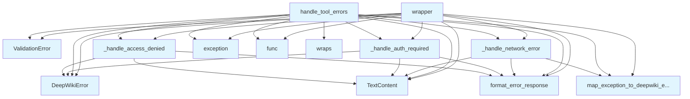

# File: `src/local_deepwiki/handlers/_error_handling.py`

## File Overview

This file provides a [decorator](../providers/retry.md), `handle_tool_errors`, for consistent error handling in tool handlers within the `local_deepwiki` application. It centralizes the logic for catching and formatting exceptions into user-friendly error responses that can be returned to the caller (e.g., an MCP client). The [decorator](../providers/retry.md) ensures that all tool handlers follow a consistent error reporting pattern, improving maintainability and user experience.

The file also includes helper functions to format specific error types such as access denied, authentication required, and network errors. These are used internally by the `handle_tool_errors` [decorator](../providers/retry.md).

## Key Concepts

### Error Handling Decorator Pattern

The `handle_tool_errors` function implements a [decorator](../providers/retry.md) pattern that wraps async tool handler functions. This approach is chosen for its ability to encapsulate cross-cutting concerns like error handling, without cluttering the core logic of individual handlers.

### Exception Mapping and Formatting

The module maps various Python exceptions into [`DeepWikiError`](../errors.md) instances with appropriate messages and hints. This design choice ensures that errors are actionable and user-friendly. For example, `ValueError` is wrapped in [`ValidationError`](../errors.md), and common system-level errors like `FileNotFoundError` are mapped using [`map_exception_to_deepwiki_error`](../error_factories.md).

### Retryable Errors

Network-related and rate-limit errors are marked as retryable with a `retry_after_seconds` value, which allows clients to determine when to retry operations. This is a deliberate design choice to support resilient systems in distributed or API-heavy environments.

### Cancellation Propagation

The `asyncio.CancelledError` is explicitly re-raised, ensuring that cancellation signals propagate correctly through the async stack. This is essential for proper task cancellation in concurrent environments.

## Integration

This file is part of the `local_deepwiki.handlers` module and is used by other handler modules to apply consistent error handling. The `handle_tool_errors` [decorator](../providers/retry.md) is used by test modules (`test_handlers_index_qa`, `test_handlers_shared`) to wrap handler functions during testing.

It integrates with:

- `local_deepwiki.core.rate_limiter` for handling [`RateLimitExceeded`](../core/rate_limiter.md)
- `local_deepwiki.errors` for [`DeepWikiError`](../errors.md), [`ValidationError`](../errors.md), [`format_error_response`](../error_factories.md), and [`map_exception_to_deepwiki_error`](../error_factories.md)
- `local_deepwiki.logging` for structured logging
- `local_deepwiki.security` for [`AccessDeniedException`](../security/access_control.md) and [`AuthenticationException`](../security/access_control.md)

These dependencies provide the core error types, utilities, and logging mechanisms necessary to implement the centralized error handling logic.

## Design Notes

### Why Centralized Error Handling?

Centralizing error handling avoids duplication of logic across handlers and ensures that all errors are formatted consistently. This improves maintainability and allows for easy updates to error presentation or logging behavior.

### Why Specific Exception Types?

The [decorator](../providers/retry.md) explicitly catches specific exceptions ([`AccessDeniedException`](../security/access_control.md), [`AuthenticationException`](../security/access_control.md), [`DeepWikiError`](../errors.md), etc.) before falling back to a generic `Exception` handler. This allows for more precise and meaningful error responses tailored to each case.

### Retryable Errors

The decision to mark certain errors (e.g., network errors, rate limits) as retryable supports a more resilient system. This is particularly important in an LLM or MCP context where transient failures are common.

### Logging Granularity

Different log levels are used based on error severity:
- `WARNING` for access denied and rate limit exceeded
- `ERROR` for most other errors
- `DEBUG` for error context when available

This helps operators quickly identify and triage issues without being overwhelmed by log noise.

### Broad Exception Catching

A final `except Exception` clause is intentionally broad to catch any unhandled exceptions and convert them into user-friendly errors. This ensures that unexpected issues do not crash the application or leak implementation details to users, aligning with the principle of graceful degradation.

### Use of `TextContent`

All error responses are returned as `TextContent` objects, which is a requirement of the MCP protocol. This ensures compatibility with MCP clients that expect structured text-based responses.

## API Reference

### Functions

#### `handle_tool_errors`

```python
def handle_tool_errors(func: ToolHandler) -> ToolHandler
```

Decorator for consistent error handling in tool handlers.  Catches exceptions and returns properly formatted error responses with actionable hints when available:  - [DeepWikiError](../errors.md) subclasses: Format with message and hint - ValueError: Input validation errors (logged at ERROR level) - Common exceptions: Map to [DeepWikiError](../errors.md) with appropriate hints - Other exceptions: Log with traceback and return generic error


| Parameter | Type | Default | Description |
|-----------|------|---------|-------------|
| `func` | `ToolHandler` | - | The async tool handler function to wrap. |

**Returns:** `ToolHandler`


<details>
<summary>View Source (lines 61-133) | <a href="https://github.com/UrbanDiver/local-deepwiki-mcp/blob/main/src/local_deepwiki/handlers/_error_handling.py#L61-L133">GitHub</a></summary>

```python
def handle_tool_errors(func: ToolHandler) -> ToolHandler:
    """Decorator for consistent error handling in tool handlers.

    Catches exceptions and returns properly formatted error responses with
    actionable hints when available:

    - DeepWikiError subclasses: Format with message and hint
    - ValueError: Input validation errors (logged at ERROR level)
    - Common exceptions: Map to DeepWikiError with appropriate hints
    - Other exceptions: Log with traceback and return generic error

    Args:
        func: The async tool handler function to wrap.

    Returns:
        Wrapped function with consistent error handling.
    """

    @wraps(func)
    async def wrapper(
        args: dict[str, Any], **kwargs: dict[str, Any]
    ) -> list[TextContent]:
        try:
            return await func(args, **kwargs)
        except AccessDeniedException as e:
            return _handle_access_denied(func.__name__, e)
        except AuthenticationException as e:
            return _handle_auth_required(func.__name__, e)
        except DeepWikiError as e:
            # Our custom errors already have good messages and hints
            logger.error("DeepWiki error in %s: %s", func.__name__, e.message)
            if e.context:
                logger.debug("Error context: %s", e.context)
            return [TextContent(type="text", text=format_error_response(e))]
        except ValueError as e:
            # Wrap ValueError in ValidationError for better hints
            error = ValidationError(
                message=str(e),
                hint="Check that all input parameters are valid.",
            )
            logger.error("Validation error in %s: %s", func.__name__, e)
            return [TextContent(type="text", text=format_error_response(error))]
        except (FileNotFoundError, PermissionError) as e:
            # Map common file system errors
            error = map_exception_to_deepwiki_error(e)
            logger.error("File system error in %s: %s", func.__name__, e)
            return [TextContent(type="text", text=format_error_response(error))]
        except (ConnectionError, TimeoutError) as e:
            return _handle_network_error(func.__name__, e)
        except RateLimitExceeded as e:
            # Rate limit exceeded — retryable after cooldown
            logger.warning("Rate limit exceeded in %s: %s", func.__name__, e)
            error = DeepWikiError(
                message=str(e),
                hint="Wait for the rate limit to reset, or reduce the frequency of requests.",
                retryable=True,
                retry_after_seconds=60,
            )
            return [TextContent(type="text", text=format_error_response(error))]
        except asyncio.CancelledError:
            # Re-raise cancellation to propagate properly
            raise
        except Exception as e:  # noqa: BLE001
            # Broad catch is intentional: top-level error handler for MCP tools
            # that converts any unhandled exception to a user-friendly error message
            logger.exception("Unexpected error in %s: %s", func.__name__, e)
            error = DeepWikiError(
                message=f"An unexpected error occurred: {e}",
                hint="Check the logs for more details. If this persists, please report the issue.",
            )
            return [TextContent(type="text", text=format_error_response(error))]

    return wrapper
```

</details>

#### `wrapper`

`@wraps(func)`

```python
async def wrapper(args: dict[str, Any]) -> list[TextContent]
```


| Parameter | Type | Default | Description |
|-----------|------|---------|-------------|
| `args` | `dict[str, Any]` | - | - |

**Returns:** `list[TextContent]`


<details>
<summary>View Source (lines 80-131) | <a href="https://github.com/UrbanDiver/local-deepwiki-mcp/blob/main/src/local_deepwiki/handlers/_error_handling.py#L80-L131">GitHub</a></summary>

```python
async def wrapper(
        args: dict[str, Any], **kwargs: dict[str, Any]
    ) -> list[TextContent]:
        try:
            return await func(args, **kwargs)
        except AccessDeniedException as e:
            return _handle_access_denied(func.__name__, e)
        except AuthenticationException as e:
            return _handle_auth_required(func.__name__, e)
        except DeepWikiError as e:
            # Our custom errors already have good messages and hints
            logger.error("DeepWiki error in %s: %s", func.__name__, e.message)
            if e.context:
                logger.debug("Error context: %s", e.context)
            return [TextContent(type="text", text=format_error_response(e))]
        except ValueError as e:
            # Wrap ValueError in ValidationError for better hints
            error = ValidationError(
                message=str(e),
                hint="Check that all input parameters are valid.",
            )
            logger.error("Validation error in %s: %s", func.__name__, e)
            return [TextContent(type="text", text=format_error_response(error))]
        except (FileNotFoundError, PermissionError) as e:
            # Map common file system errors
            error = map_exception_to_deepwiki_error(e)
            logger.error("File system error in %s: %s", func.__name__, e)
            return [TextContent(type="text", text=format_error_response(error))]
        except (ConnectionError, TimeoutError) as e:
            return _handle_network_error(func.__name__, e)
        except RateLimitExceeded as e:
            # Rate limit exceeded — retryable after cooldown
            logger.warning("Rate limit exceeded in %s: %s", func.__name__, e)
            error = DeepWikiError(
                message=str(e),
                hint="Wait for the rate limit to reset, or reduce the frequency of requests.",
                retryable=True,
                retry_after_seconds=60,
            )
            return [TextContent(type="text", text=format_error_response(error))]
        except asyncio.CancelledError:
            # Re-raise cancellation to propagate properly
            raise
        except Exception as e:  # noqa: BLE001
            # Broad catch is intentional: top-level error handler for MCP tools
            # that converts any unhandled exception to a user-friendly error message
            logger.exception("Unexpected error in %s: %s", func.__name__, e)
            error = DeepWikiError(
                message=f"An unexpected error occurred: {e}",
                hint="Check the logs for more details. If this persists, please report the issue.",
            )
            return [TextContent(type="text", text=format_error_response(error))]
```

</details>

## Call Graph



## Used By

Functions and methods in this file and their callers:

- **[`DeepWikiError`](../errors.md)**: called by `_handle_access_denied`, `_handle_auth_required`, `handle_tool_errors`, `wrapper`
- **`TextContent`**: called by `_handle_access_denied`, `_handle_auth_required`, `_handle_network_error`, `handle_tool_errors`, `wrapper`
- **[`ValidationError`](../errors.md)**: called by `handle_tool_errors`, `wrapper`
- **`_handle_access_denied`**: called by `handle_tool_errors`, `wrapper`
- **`_handle_auth_required`**: called by `handle_tool_errors`, `wrapper`
- **`_handle_network_error`**: called by `handle_tool_errors`, `wrapper`
- **`exception`**: called by `handle_tool_errors`, `wrapper`
- **[`format_error_response`](../error_factories.md)**: called by `_handle_access_denied`, `_handle_auth_required`, `_handle_network_error`, `handle_tool_errors`, `wrapper`
- **`func`**: called by `handle_tool_errors`, `wrapper`
- **[`map_exception_to_deepwiki_error`](../error_factories.md)**: called by `_handle_network_error`, `handle_tool_errors`, `wrapper`
- **`wraps`**: called by `handle_tool_errors`

## Last Modified

| Entity | Type | Author | Date | Commit |
|--------|------|--------|------|--------|
| `_handle_access_denied` | function | Brian Breidenbach | yesterday | `29ae780` refactor: decompose long me... |
| `_handle_auth_required` | function | Brian Breidenbach | yesterday | `29ae780` refactor: decompose long me... |
| `_handle_network_error` | function | Brian Breidenbach | yesterday | `29ae780` refactor: decompose long me... |
| `handle_tool_errors` | function | Brian Breidenbach | yesterday | `29ae780` refactor: decompose long me... |
| `wrapper` | function | Brian Breidenbach | yesterday | `29ae780` refactor: decompose long me... |

## Additional Source Code

Source code for functions and methods not listed in the API Reference above.

#### `_handle_access_denied`

<details>
<summary>View Source (lines 28-37) | <a href="https://github.com/UrbanDiver/local-deepwiki-mcp/blob/main/src/local_deepwiki/handlers/_error_handling.py#L28-L37">GitHub</a></summary>

```python
def _handle_access_denied(
    func_name: str, e: AccessDeniedException
) -> list[TextContent]:
    """Format an access-denied error response."""
    logger.warning("Access denied in %s: %s", func_name, e)
    error = DeepWikiError(
        message=f"Access denied: {e}",
        hint="You don't have permission for this operation. Contact an administrator to request access.",
    )
    return [TextContent(type="text", text=format_error_response(error))]
```

</details>


#### `_handle_auth_required`

<details>
<summary>View Source (lines 40-49) | <a href="https://github.com/UrbanDiver/local-deepwiki-mcp/blob/main/src/local_deepwiki/handlers/_error_handling.py#L40-L49">GitHub</a></summary>

```python
def _handle_auth_required(
    func_name: str, e: AuthenticationException
) -> list[TextContent]:
    """Format an authentication-required error response."""
    logger.warning("Authentication required in %s: %s", func_name, e)
    error = DeepWikiError(
        message=f"Authentication required: {e}",
        hint="Please authenticate before performing this operation.",
    )
    return [TextContent(type="text", text=format_error_response(error))]
```

</details>


#### `_handle_network_error`

<details>
<summary>View Source (lines 52-58) | <a href="https://github.com/UrbanDiver/local-deepwiki-mcp/blob/main/src/local_deepwiki/handlers/_error_handling.py#L52-L58">GitHub</a></summary>

```python
def _handle_network_error(func_name: str, e: Exception) -> list[TextContent]:
    """Format a retryable network error response."""
    error = map_exception_to_deepwiki_error(e)
    error.retryable = True
    error.retry_after_seconds = 5
    logger.error("Network error in %s: %s", func_name, e)
    return [TextContent(type="text", text=format_error_response(error))]
```

</details>

## Relevant Source Files

- `src/local_deepwiki/handlers/_error_handling.py:28-37`
