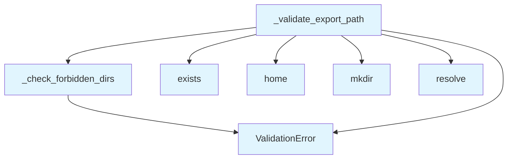

# File: `src/local_deepwiki/handlers/_export_validation.py`

## File Overview

This file provides validation logic for export output paths in the `local_deepwiki` project. Its primary responsibility is to ensure that export operations do not write to sensitive or forbidden directories, such as system directories or configuration folders, to prevent accidental overwrites or security issues.

The validation is performed by two core functions:
- `_check_forbidden_dirs`: Validates that a given path is not inside a set of forbidden directories.
- `_validate_export_path`: Main function that orchestrates the checks and ensures the output directory can be created.

The module is designed to be used in export-related handlers and is called by test utilities to validate export path behavior.

## Key Concepts

### Forbidden Directory Checks
The module enforces restrictions on export paths by checking against two sets of forbidden paths:
1. `FORBIDDEN_EXPORT_DIRS`: A set of system or sensitive directories that are never allowed as export destinations.
2. `FORBIDDEN_VAR_SUBDIRS`: A set of subdirectories under `/var` that are also forbidden.

These checks are implemented via `_check_forbidden_dirs`, which raises a [`ValidationError`](../errors.md) if the resolved export path matches or is inside any of these directories.

### Special Handling of `~/.config`
While the general forbidden directories check is applied, `~/.config` is treated specially:
- It is allowed only if the export path is inside `~/.config/local-deepwiki`.
- Any other usage of `~/.config` raises a [`ValidationError`](../errors.md).

This is a security measure to prevent accidental overwrites of system configuration files while still allowing use of a dedicated config subdirectory for the tool.

### Directory Creation Validation
Before allowing an export, the module ensures that the parent directory of the export path exists or can be created:
- If the parent does not exist, it attempts to create it recursively.
- If creation fails due to permission or OS errors, a [`ValidationError`](../errors.md) is raised with appropriate hints.

This ensures robustness in export handling and provides clear feedback to users when path setup fails.

## Integration

This file is part of the `local_deepwiki` CLI and export system. It is imported and used by:
- `src/local_deepwiki/cli/main.py` (likely for export command validation)
- `src/local_deepwiki/cli/config_validator.py` (possibly for validating export paths in configuration)
- `src/local_deepwiki/generators/wiki/pages.py` and other export generators (to validate output paths before writing)
- `src/local_deepwiki/handlers/_export_validation.py` (used by `test_handlers_shared` for testing export validation logic)

The functions in this file are called by export handlers and CLI commands that require validation of user-provided output paths. The module is tightly integrated into the export workflow to enforce safety and prevent misuse.

## Design Notes

### Why Check for Forbidden Directories?
The module enforces directory restrictions to prevent:
- Accidental overwrites of system files.
- Writing to directories where the tool might not have appropriate permissions.
- Misuse of configuration or temporary directories.

This is a security-by-design principle that helps prevent silent failures or user errors.

### Why Not Allow All Paths?
While the module allows exports to user directories like `~/` or project directories, it explicitly blocks paths in:
- System directories like `/usr`, `/etc`, `/var`, etc.
- Configuration directories like `~/.config` (except `~/.config/local-deepwiki`)

This prevents accidental misuse of system or user configuration areas.

### Handling of `~/.config` Subdirectories
The module allows `~/.config/local-deepwiki` to be used as an export destination, but blocks other uses of `~/.config`. This is a compromise between allowing flexibility and enforcing safety.

### Permission and OS Error Handling
The code catches `PermissionError` and `OSError` when attempting to create directories. This provides clear error messages and hints to users, making it easier to diagnose path issues.

### Why Not Use `os.path` Instead of `pathlib`?
While `pathlib` is used for consistency with modern Python practices and to simplify path manipulations, the module could have used `os.path` for some checks. However, `pathlib` was chosen for its cleaner API and better integration with modern Python codebases.

## Call Graph



## Used By

Functions and methods in this file and their callers:

- **[`ValidationError`](../errors.md)**: called by `_check_forbidden_dirs`, `_validate_export_path`
- **`_check_forbidden_dirs`**: called by `_validate_export_path`
- **`exists`**: called by `_validate_export_path`
- **`home`**: called by `_validate_export_path`
- **`mkdir`**: called by `_validate_export_path`
- **`resolve`**: called by `_validate_export_path`

## Last Modified

| Entity | Type | Author | Date | Commit |
|--------|------|--------|------|--------|
| `_check_forbidden_dirs` | function | Brian Breidenbach | Feb 23, 2026 | `3aeaa22` refactor: split _shared.py ... |
| `_validate_export_path` | function | Brian Breidenbach | Feb 23, 2026 | `3aeaa22` refactor: split _shared.py ... |

## Additional Source Code

Source code for functions and methods not listed in the API Reference above.

#### `_check_forbidden_dirs`

<details>
<summary>View Source (lines 40-61) | <a href="https://github.com/UrbanDiver/local-deepwiki-mcp/blob/main/src/local_deepwiki/handlers/_export_validation.py#L40-L61">GitHub</a></summary>

```python
def _check_forbidden_dirs(
    resolved_str: str,
    dirs: frozenset[str],
    output_path: Path,
    label: str = "system directory",
) -> None:
    """Raise ValidationError if resolved_str is inside any forbidden directory.

    Args:
        resolved_str: Resolved absolute path as string.
        dirs: Set of forbidden directory paths.
        output_path: Original output path (for error context).
        label: Label for error messages (e.g., "system directory").
    """
    for forbidden in dirs:
        if resolved_str == forbidden or resolved_str.startswith(forbidden + "/"):
            raise ValidationError(
                message=f"Cannot export to {label}: {forbidden}",
                hint="Choose an output path in your project or home directory.",
                field="output_path",
                value=str(output_path),
            )
```

</details>


#### `_validate_export_path`

<details>
<summary>View Source (lines 64-120) | <a href="https://github.com/UrbanDiver/local-deepwiki-mcp/blob/main/src/local_deepwiki/handlers/_export_validation.py#L64-L120">GitHub</a></summary>

```python
def _validate_export_path(output_path: Path, wiki_path: Path) -> Path:
    """Validate that export output path is not in a sensitive system directory.

    Args:
        output_path: The requested output path (must be resolved to absolute).
        wiki_path: The source wiki path (for context in error messages).

    Returns:
        The validated output path.

    Raises:
        ValidationError: If the output path is in a forbidden directory.
    """
    resolved = output_path.resolve()
    resolved_str = str(resolved)

    _check_forbidden_dirs(resolved_str, FORBIDDEN_EXPORT_DIRS, output_path)
    _check_forbidden_dirs(
        resolved_str, FORBIDDEN_VAR_SUBDIRS, output_path, label="system directory"
    )

    # Check for ~/.config (allow only ~/.config/local-deepwiki)
    config_dir = Path.home() / ".config"
    local_deepwiki_config = config_dir / "local-deepwiki"
    if resolved_str.startswith(str(config_dir) + "/"):
        if (
            not resolved_str.startswith(str(local_deepwiki_config) + "/")
            and resolved != local_deepwiki_config
        ):
            raise ValidationError(
                message=f"Cannot export to config directory: {config_dir}",
                hint="Choose an output path in your project or home directory.",
                field="output_path",
                value=str(output_path),
            )

    # Ensure parent directory exists or can be created
    parent = resolved.parent
    if not parent.exists():
        try:
            parent.mkdir(parents=True, exist_ok=True)
        except PermissionError as e:
            raise ValidationError(
                message=f"Cannot create output directory: {parent}",
                hint="Ensure you have write permissions to the parent directory.",
                field="output_path",
                value=str(output_path),
            ) from e
        except OSError as e:
            raise ValidationError(
                message=f"Failed to create output directory: {e}",
                hint="Check that the path is valid and accessible.",
                field="output_path",
                value=str(output_path),
            ) from e

    return resolved
```

</details>

## Relevant Source Files

- `src/local_deepwiki/handlers/_export_validation.py:40-61`
