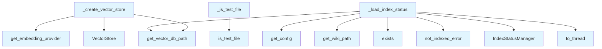

# File: `src/local_deepwiki/handlers/_index_helpers.py`

## File Overview

This module provides shared helper functions used across various handlers in the `local_deepwiki` system. These functions encapsulate common operations related to index status loading, vector store creation, and formatting of research results. The module centralizes logic that is required by multiple handler components, promoting code reuse and reducing duplication.

The primary responsibilities of this file are:
- Loading and validating index status for repositories
- Creating vector stores with configured embedding providers
- Formatting research results for output
- Identifying test files using a shared utility

These helpers are essential for maintaining consistency and reducing boilerplate code in handler logic.

## Key Concepts

### Index Status Management
The `_load_index_status` function is responsible for ensuring that a repository is indexed before proceeding with any operations. It checks for the existence of a vector database and loads the index status using an [`IndexStatusManager`](../core/index_manager.md). If either check fails, it raises a [`ValidationError`](../errors.md) indicating that the repository is not indexed.

This design choice ensures that downstream operations are not performed on unindexed repositories, preventing runtime errors and maintaining data integrity.

### Vector Store Creation
The `_create_vector_store` function abstracts the instantiation of a [`VectorStore`](../core/vectorstore/store.md) with appropriate parameters derived from the application configuration. It uses a configured embedding provider to initialize the vector store, enabling flexible integration with different embedding models.

This abstraction allows handlers to create vector stores without needing to know the internal details of how embeddings are handled or where the vector database is stored.

### Research Result Formatting
The `_format_research_results` function transforms internal [`DeepResearchResult`](../models/research.md) objects into a structured dictionary format suitable for serialization. This includes mapping sub-questions, sources, reasoning trace steps, and statistics into a consistent schema.

This pattern promotes a clear separation between internal processing and external representation, making it easier to evolve the internal data structures without affecting the API contract.

### Test File Detection
The `_is_test_file` function delegates to a utility in `local_deepwiki.core.path_utils`, ensuring consistent behavior across the codebase when identifying test files. This simplifies logic in handlers that need to filter out test files during processing.

## Integration

This module integrates deeply with the core components of the system through its imports and usage:

- **Configuration and Settings**: It uses `get_config()` to access application settings, including paths and embedding configurations. This ties it closely to the configuration system (`local_deepwiki.config`).
- **Core Utilities**: It relies on [`is_test_file`](../generators/analysis/source_filter.md) from `local_deepwiki.core.path_utils` and [`IndexStatusManager`](../core/index_manager.md) from `local_deepwiki.core.index_manager`, indicating its role in foundational operations.
- **Providers and Embeddings**: It integrates with the embedding provider system (`local_deepwiki.providers.embeddings`) to configure vector stores dynamically based on the selected embedding model.
- **[Vector Store](../core/vectorstore/store.md)**: It directly uses the [`VectorStore`](../core/vectorstore/store.md) class from `local_deepwiki.core.vectorstore`, which is central to the system's retrieval-augmented generation (RAG) capabilities.
- **Error Handling**: It raises [`not_indexed_error`](../error_factories.md), which is defined in `local_deepwiki.errors`, ensuring consistent error signaling for unindexed repositories.

The functions in this file are used by:
- `_create_vector_store`: Called by generators to set up vector stores.
- `_format_research_results`: Used by types and test handlers to prepare output.
- `_is_test_file`: Used by file processors, test handlers, and secret detectors.

This modular approach allows handlers to remain focused on their specific logic while reusing well-tested, shared components.

## Design Notes

### Asynchronous Index Loading
The `_load_index_status` function uses `asyncio.to_thread()` to load the index status synchronously in a background thread. This is a design choice to avoid blocking the event loop while still allowing synchronous operations to be performed in a non-blocking way.

### Flexible Embedding Provider Integration
The `_create_vector_store` function retrieves the embedding provider dynamically via `get_embedding_provider(config.embedding)`. This supports extensibility and allows different embedding models to be configured without modifying the core logic.

### Consistent Result Formatting
The `_format_research_results` function ensures that all research outputs are formatted consistently. This includes rounding relevance scores to three decimal places and mapping internal objects to a flat dictionary structure, which simplifies serialization and consumption by clients.

### Reuse of Shared Utilities
The module avoids duplicating logic by delegating test file detection to a shared utility ([`is_test_file`](../generators/analysis/source_filter.md)). This ensures uniformity and reduces maintenance overhead.

### Error Handling Strategy
All index-related operations raise a [`ValidationError`](../errors.md) if the repository is not indexed. This provides a clear and consistent signal to callers that they must index the repository before proceeding, helping prevent runtime errors and guiding users toward correct usage.

## Call Graph



## Used By

Functions and methods in this file and their callers:

- **[`IndexStatusManager`](../core/index_manager.md)**: called by `_load_index_status`
- **[`VectorStore`](../core/vectorstore/store.md)**: called by `_create_vector_store`
- **`exists`**: called by `_load_index_status`
- **[`get_config`](../config/loader.md)**: called by `_load_index_status`
- **`get_embedding_provider`**: called by `_create_vector_store`
- **`get_vector_db_path`**: called by `_create_vector_store`, `_load_index_status`
- **[`get_wiki_path`](../web/utils.md)**: called by `_load_index_status`
- **[`is_test_file`](../generators/analysis/source_filter.md)**: called by `_is_test_file`
- **[`not_indexed_error`](../error_factories.md)**: called by `_load_index_status`
- **`to_thread`**: called by `_load_index_status`

## Last Modified

| Entity | Type | Author | Date | Commit |
|--------|------|--------|------|--------|
| `_create_vector_store` | function | Brian Breidenbach | 2 weeks ago | `8203fe8` feat: add service layer, hy... |
| `_format_research_results` | function | Brian Breidenbach | Feb 23, 2026 | `c6fe2bd` refactor: split oversized m... |
| `_load_index_status` | function | Brian Breidenbach | Feb 23, 2026 | `3aeaa22` refactor: split _shared.py ... |
| `_is_test_file` | function | Brian Breidenbach | Feb 23, 2026 | `3aeaa22` refactor: split _shared.py ... |

## Additional Source Code

Source code for functions and methods not listed in the API Reference above.

#### `_load_index_status`

<details>
<summary>View Source (lines 23-49) | <a href="https://github.com/UrbanDiver/local-deepwiki-mcp/blob/main/src/local_deepwiki/handlers/_index_helpers.py#L23-L49">GitHub</a></summary>

```python
async def _load_index_status(repo_path: Path) -> tuple[Any, Path, Any]:
    """Load index status for a repository, raising if not indexed.

    Args:
        repo_path: Resolved path to the repository.

    Returns:
        Tuple of (IndexStatus, wiki_path, config).

    Raises:
        ValidationError: If repository is not indexed.
    """
    from local_deepwiki.core.index_manager import IndexStatusManager

    config = get_config()
    wiki_path = config.get_wiki_path(repo_path)
    vector_db_path = config.get_vector_db_path(repo_path)

    if not vector_db_path.exists():
        raise not_indexed_error(str(repo_path))

    manager = IndexStatusManager()
    index_status = await asyncio.to_thread(manager.load, wiki_path)
    if index_status is None:
        raise not_indexed_error(str(repo_path))

    return index_status, wiki_path, config
```

</details>


#### `_create_vector_store`

<details>
<summary>View Source (lines 52-68) | <a href="https://github.com/UrbanDiver/local-deepwiki-mcp/blob/main/src/local_deepwiki/handlers/_index_helpers.py#L52-L68">GitHub</a></summary>

```python
def _create_vector_store(repo_path: Path, config: Any) -> VectorStore:
    """Create a VectorStore with the configured embedding provider.

    Args:
        repo_path: Resolved path to the repository.
        config: Application configuration object.

    Returns:
        Initialized VectorStore instance.
    """
    embedding_provider = get_embedding_provider(config.embedding)
    return VectorStore(
        config.get_vector_db_path(repo_path),
        embedding_provider,
        default_search_mode=config.search.default_search_mode,
        bm25_weight=config.search.bm25_weight,
    )
```

</details>


#### `_format_research_results`

<details>
<summary>View Source (lines 71-109) | <a href="https://github.com/UrbanDiver/local-deepwiki-mcp/blob/main/src/local_deepwiki/handlers/_index_helpers.py#L71-L109">GitHub</a></summary>

```python
def _format_research_results(result: "DeepResearchResult") -> ResearchResult:
    """Format the research results for return.

    Args:
        result: The ResearchResult from the pipeline.

    Returns:
        Formatted dictionary ready for JSON serialization.
    """
    return {
        "question": result.question,
        "answer": result.answer,
        "sub_questions": [
            {"question": sq.question, "category": sq.category}
            for sq in result.sub_questions
        ],
        "sources": [
            {
                "file": src.file_path,
                "lines": f"{src.start_line}-{src.end_line}",
                "type": src.chunk_type,
                "name": src.name or "",
                "relevance": round(src.relevance_score, 3),
            }
            for src in result.sources
        ],
        "research_trace": [
            {
                "step": step.step_type.value,
                "description": step.description,
                "duration_ms": step.duration_ms,
            }
            for step in result.reasoning_trace
        ],
        "stats": {
            "chunks_analyzed": result.total_chunks_analyzed,
            "llm_calls": result.total_llm_calls,
        },
    }
```

</details>


#### `_is_test_file`

<details>
<summary>View Source (lines 112-117) | <a href="https://github.com/UrbanDiver/local-deepwiki-mcp/blob/main/src/local_deepwiki/handlers/_index_helpers.py#L112-L117">GitHub</a></summary>

```python
def _is_test_file(file_path: str) -> bool:
    """Check if a file path looks like a test file.

    Delegates to :func:`local_deepwiki.core.path_utils.is_test_file`.
    """
    return is_test_file(file_path, check_filename=True)
```

</details>

## Relevant Source Files

- `src/local_deepwiki/handlers/_index_helpers.py:23-49`
