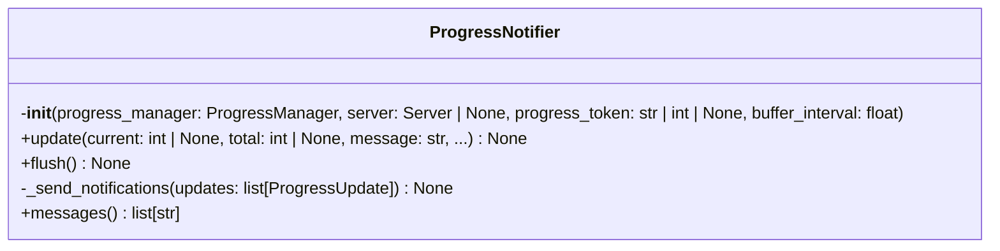
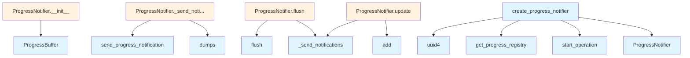

# File: `src/local_deepwiki/handlers/_progress.py`

## File Overview

This file provides helper utilities for managing and notifying progress updates during MCP (Model Control Protocol) operations. It is designed to support progress tracking in asynchronous workflows, particularly in indexing and processing tasks, by integrating with the MCP protocol's progress notification mechanism.

The core responsibility of this file is to encapsulate the logic for creating progress notifiers, buffering updates, and sending progress notifications via the MCP server. It leverages a shared progress registry to maintain state across operations and ensures that progress updates are sent efficiently, avoiding excessive network overhead.

## Key Concepts

### Progress Tracking with `ProgressManager`
The [`ProgressManager`](../progress.md) class is responsible for tracking the state of a given operation, including current progress, total items, phase, and metadata. This abstraction allows for a consistent way to represent progress across different types of operations, while also providing a mechanism to compute ETA and other useful metrics.

### Buffered Notifications with `ProgressBuffer`
To avoid sending too many progress updates over the network, this file uses a [`ProgressBuffer`](../progress.md) to [collect](../web/routes_chat.md) updates and flush them at a specified interval. This design choice improves performance by reducing the number of MCP notifications sent, especially during high-frequency progress updates.

### MCP Integration via `ProgressNotifier`
The `ProgressNotifier` class ties together the progress tracking logic with the MCP protocol. It ensures that updates are sent to the client using the correct progress token from the MCP request context. It also handles the serialization of progress data into a format compatible with the MCP specification.

### Operation Identification with UUIDs
Each operation is uniquely identified using a UUID (`operation_id`) to allow for proper tracking and management in the shared `ProgressRegistry`. This helps distinguish between concurrent operations, especially in multi-client scenarios.

## Integration

This file is used by the `ProgressNotifier` class, which is directly referenced in the `test_handlers_shared` test suite. This suggests that it is part of a shared module for testing progress-related functionality in handlers.

The file imports from:
- `mcp.server.Server`: To access the MCP request context and send progress notifications.
- `local_deepwiki.logging`: For logging warnings when progress notifications fail.
- `local_deepwiki.progress`: For core progress tracking components ([`ProgressManager`](../progress.md), [`ProgressBuffer`](../progress.md), [`ProgressUpdate`](../progress.md), [`get_progress_registry`](../progress.md), etc.).
- `local_deepwiki.models`: For [`IndexingProgressType`](../models/research.md), which provides backward compatibility for older progress reporting formats.

It is closely related to:
- CLI modules like `check_cli.py`, `config_validator.py`, `main.py`, and `status_cli.py` which may initiate operations tracked by this module.
- Core graph RAG models in `models.py` that might rely on progress reporting during indexing or retrieval tasks.

The `create_progress_notifier` function is the primary entry point for creating a `ProgressNotifier` for a given operation. It is designed to be called by handler functions or command-line tools that initiate long-running operations and need to report progress back to the client.

## Design Notes

### Why Buffered Updates?
Sending progress notifications on every small update can lead to performance degradation due to network overhead and client-side processing. By buffering updates, the system ensures that progress is reported at a reasonable cadence without losing important information.

### Handling Missing MCP Context
The `create_progress_notifier` function gracefully handles cases where the MCP server is not available or the request context is missing. It logs a debug message and proceeds without sending notifications, ensuring that operations can still run even if progress cannot be reported.

### Backward Compatibility
The `_send_notifications` method includes logic to build a backward-compatible progress message for older clients. It uses a dictionary that includes fields like `step`, `total_steps`, `step_type`, and `message`, which are mapped from the current [`ProgressUpdate`](../progress.md) object. This ensures compatibility with clients that expect a specific JSON structure.

### Exception Handling
The `_send_notifications` method includes a broad exception handler for `RuntimeError`, `OSError`, `AttributeError`, and `LookupError`. This ensures that a failure to send a progress notification does not crash the operation, instead logging a warning and continuing. This is a defensive approach to ensure that progress tracking does not become a point of failure.

### Type Safety and Forward References
The use of `TYPE_CHECKING` and forward references (e.g., `IndexingProgressType | None`) ensures that type hints are correct at runtime while avoiding circular import issues during type checking.

## API Reference

### class `ProgressNotifier`

Helper class for sending buffered MCP progress notifications.  Integrates [ProgressManager](../progress.md) with MCP server notifications, handling buffering and async notification delivery.

**Methods:**


<details>
<summary>View Source (lines 27-137) | <a href="https://github.com/UrbanDiver/local-deepwiki-mcp/blob/main/src/local_deepwiki/handlers/_progress.py#L27-L137">GitHub</a></summary>

```python
class ProgressNotifier:
    # Methods: __init__, update, flush, _send_notifications, messages
```

</details>

#### `__init__`

```python
def __init__(progress_manager: ProgressManager, server: Server | None, progress_token: str | int | None, buffer_interval: float = 0.5)
```

Initialize the notifier.


| Parameter | Type | Default | Description |
|-----------|------|---------|-------------|
| `progress_manager` | `ProgressManager` | - | The ProgressManager to use for tracking. |
| `server` | `Server | None` | - | MCP server instance. |
| `progress_token` | `str | int | None` | - | Progress token from MCP request. |
| `buffer_interval` | `float` | `0.5` | Minimum seconds between notifications. |


<details>
<summary>View Source (lines 34-53) | <a href="https://github.com/UrbanDiver/local-deepwiki-mcp/blob/main/src/local_deepwiki/handlers/_progress.py#L34-L53">GitHub</a></summary>

```python
def __init__(
        self,
        progress_manager: ProgressManager,
        server: Server | None,
        progress_token: str | int | None,
        buffer_interval: float = 0.5,
    ):
        """Initialize the notifier.

        Args:
            progress_manager: The ProgressManager to use for tracking.
            server: MCP server instance.
            progress_token: Progress token from MCP request.
            buffer_interval: Minimum seconds between notifications.
        """
        self.progress_manager = progress_manager
        self.server = server
        self.progress_token = progress_token
        self.buffer = ProgressBuffer(flush_interval=buffer_interval)
        self._messages: list[str] = []
```

</details>

#### `update`

```python
async def update(current: int | None = None, total: int | None = None, message: str = "", phase: ProgressPhase | None = None, step_type: "IndexingProgressType | None" = None, metadata: dict[str, Any] | None = None) -> None
```

Update progress and send buffered notification.


| Parameter | Type | Default | Description |
|-----------|------|---------|-------------|
| `current` | `int | None` | `None` | Current progress value. |
| `total` | `int | None` | `None` | Total items. |
| `message` | `str` | `""` | Status message. |
| `phase` | `ProgressPhase | None` | `None` | Current phase. |
| `step_type` | `"IndexingProgressType | None"` | `None` | IndexingProgressType for backward compatibility. |
| `metadata` | `dict[str, Any] | None` | `None` | Additional metadata. |


<details>
<summary>View Source (lines 55-92) | <a href="https://github.com/UrbanDiver/local-deepwiki-mcp/blob/main/src/local_deepwiki/handlers/_progress.py#L55-L92">GitHub</a></summary>

```python
async def update(
        self,
        current: int | None = None,
        total: int | None = None,
        message: str = "",
        phase: ProgressPhase | None = None,
        step_type: "IndexingProgressType | None" = None,
        metadata: dict[str, Any] | None = None,
    ) -> None:
        """Update progress and send buffered notification.

        Args:
            current: Current progress value.
            total: Total items.
            message: Status message.
            phase: Current phase.
            step_type: IndexingProgressType for backward compatibility.
            metadata: Additional metadata.
        """
        # Track message history
        if message:
            self._messages.append(message)

        # Update progress manager
        update = self.progress_manager.update(
            current=current,
            total=total,
            message=message,
            phase=phase,
            metadata=metadata,
        )

        # Add to buffer
        updates_to_send = self.buffer.add(update)

        # Send notifications if buffer flushed
        if updates_to_send:
            await self._send_notifications(updates_to_send)
```

</details>

#### `flush`

```python
async def flush() -> None
```

Flush any pending notifications.


<details>
<summary>View Source (lines 94-98) | <a href="https://github.com/UrbanDiver/local-deepwiki-mcp/blob/main/src/local_deepwiki/handlers/_progress.py#L94-L98">GitHub</a></summary>

```python
async def flush(self) -> None:
        """Flush any pending notifications."""
        updates = self.buffer.flush()
        if updates:
            await self._send_notifications(updates)
```

</details>

#### `messages`

```python
def messages() -> list[str]
```

Get accumulated progress messages.


---


<details>
<summary>View Source (lines 135-137) | <a href="https://github.com/UrbanDiver/local-deepwiki-mcp/blob/main/src/local_deepwiki/handlers/_progress.py#L135-L137">GitHub</a></summary>

```python
def messages(self) -> list[str]:
        """Get accumulated progress messages."""
        return self._messages
```

</details>

### Functions

#### `create_progress_notifier`

```python
def create_progress_notifier(operation_type: OperationType, server: Server | None, total: int | None = None) -> tuple[ProgressNotifier | None, str]
```

Create a ProgressNotifier for an MCP operation.


| Parameter | Type | Default | Description |
|-----------|------|---------|-------------|
| `operation_type` | `OperationType` | - | Type of operation. |
| `server` | `Server | None` | - | MCP server instance. |
| `total` | `int | None` | `None` | Total items to process. |

**Returns:** `tuple[ProgressNotifier | None, str]`


<details>
<summary>View Source (lines 140-184) | <a href="https://github.com/UrbanDiver/local-deepwiki-mcp/blob/main/src/local_deepwiki/handlers/_progress.py#L140-L184">GitHub</a></summary>

```python
def create_progress_notifier(
    operation_type: OperationType,
    server: Server | None,
    total: int | None = None,
) -> tuple[ProgressNotifier | None, str]:
    """Create a ProgressNotifier for an MCP operation.

    Args:
        operation_type: Type of operation.
        server: MCP server instance.
        total: Total items to process.

    Returns:
        Tuple of (ProgressNotifier or None, operation_id).
    """
    operation_id = str(uuid.uuid4())
    registry = get_progress_registry()

    # Extract progress token from MCP request context
    progress_token: str | int | None = None
    if server is not None:
        try:
            request_ctx = server.request_context
            if request_ctx.meta and request_ctx.meta.progressToken:
                progress_token = request_ctx.meta.progressToken
        except LookupError:
            logger.debug(
                "No MCP request context available for progress token extraction"
            )

    # Create progress manager
    progress_manager = registry.start_operation(
        operation_id=operation_id,
        operation_type=operation_type,
        total=total,
    )

    # Create notifier
    notifier = ProgressNotifier(
        progress_manager=progress_manager,
        server=server,
        progress_token=progress_token,
    )

    return notifier, operation_id
```

</details>

## Class Diagram



## Call Graph



## Used By

Functions and methods in this file and their callers:

- **[`ProgressBuffer`](../progress.md)**: called by `ProgressNotifier.__init__`
- **`ProgressNotifier`**: called by `create_progress_notifier`
- **`_send_notifications`**: called by `ProgressNotifier.flush`, `ProgressNotifier.update`
- **`add`**: called by `ProgressNotifier.update`
- **`dumps`**: called by `ProgressNotifier._send_notifications`
- **`flush`**: called by `ProgressNotifier.flush`
- **[`get_progress_registry`](../progress.md)**: called by `create_progress_notifier`
- **`send_progress_notification`**: called by `ProgressNotifier._send_notifications`
- **`start_operation`**: called by `create_progress_notifier`
- **`uuid4`**: called by `create_progress_notifier`

## Last Modified

| Entity | Type | Author | Date | Commit |
|--------|------|--------|------|--------|
| `ProgressNotifier` | class | Brian Breidenbach | Feb 23, 2026 | `3aeaa22` refactor: split _shared.py ... |
| `__init__` | method | Brian Breidenbach | Feb 23, 2026 | `3aeaa22` refactor: split _shared.py ... |
| `update` | method | Brian Breidenbach | Feb 23, 2026 | `3aeaa22` refactor: split _shared.py ... |
| `flush` | method | Brian Breidenbach | Feb 23, 2026 | `3aeaa22` refactor: split _shared.py ... |
| `_send_notifications` | method | Brian Breidenbach | Feb 23, 2026 | `3aeaa22` refactor: split _shared.py ... |
| `messages` | method | Brian Breidenbach | Feb 23, 2026 | `3aeaa22` refactor: split _shared.py ... |
| `create_progress_notifier` | function | Brian Breidenbach | Feb 23, 2026 | `3aeaa22` refactor: split _shared.py ... |

## Additional Source Code

Source code for functions and methods not listed in the API Reference above.

#### `_send_notifications`

<details>
<summary>View Source (lines 100-132) | <a href="https://github.com/UrbanDiver/local-deepwiki-mcp/blob/main/src/local_deepwiki/handlers/_progress.py#L100-L132">GitHub</a></summary>

```python
async def _send_notifications(self, updates: list[ProgressUpdate]) -> None:
        """Send MCP progress notifications.

        Args:
            updates: List of progress updates to send.
        """
        if not self.progress_token or not self.server:
            return

        # Send the most recent update (MCP expects single progress per notification)
        latest = updates[-1]

        try:
            request_ctx = self.server.request_context

            # Build backward-compatible progress message
            progress_data = {
                "step": latest.current,
                "total_steps": latest.total or 0,
                "step_type": latest.phase.value,
                "message": latest.message,
                "eta_seconds": latest.eta_seconds,
                **latest.metadata,
            }

            await request_ctx.session.send_progress_notification(
                progress_token=self.progress_token,
                progress=float(latest.current),
                total=float(latest.total) if latest.total else None,
                message=json.dumps(progress_data),
            )
        except (RuntimeError, OSError, AttributeError, LookupError) as e:
            logger.warning("Failed to send progress notification: %s", e)
```

</details>

## Relevant Source Files

- `src/local_deepwiki/handlers/_progress.py:27-137`
