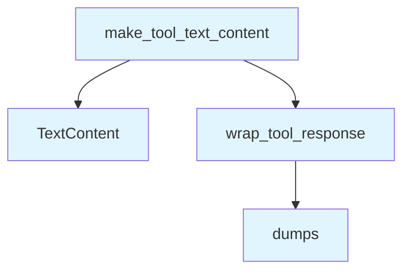

# File: `src/local_deepwiki/handlers/_response.py`

## File Overview

This module provides utility functions for formatting and wrapping tool responses within the local_deepwiki system. It ensures that tool outputs are consistently structured and can be easily consumed by downstream components such as handlers or agents.

The functions in this file are primarily used to:
- Wrap tool results in a standardized JSON envelope
- Convert wrapped results into `TextContent` objects, which are used in the MCP (Model Control Protocol) context
- Construct resource URIs for wiki pages

This design promotes consistency, readability, and maintainability of tool responses across the system.

## Key Concepts

### Standardized Response Envelope
The `wrap_tool_response` function introduces a consistent envelope pattern for all tool outputs. This envelope includes:
- The original tool data
- The tool name (`tool`)
- A default `status` field if not present
- Optional `hints` for follow-up actions

This approach ensures backward compatibility while providing a clear structure for parsing tool outputs.

### TextContent Construction
The `make_tool_text_content` function provides a convenience [wrapper](_error_handling.md) that combines the envelope creation with the construction of a `TextContent` object. This is particularly useful in environments where MCP handlers expect responses in the form of `TextContent`.

This abstraction simplifies the process of returning structured tool results in a format compatible with the MCP protocol.

### Resource URI Generation
The `build_wiki_resource_uri` function generates a standardized URI for wiki resources. It combines the absolute path to a wiki directory with a relative page path, producing a URI that can be used to reference specific wiki content.

This utility supports navigation and linking within the deepwiki ecosystem.

## Integration

This file is part of the `local_deepwiki.handlers` module and is used by various CLI tools and generators, including:
- `check_cli.py`
- `status_cli.py`
- `api_docs.py`
- `module_health.py`
- `tours.py`

It is imported and used by these modules to format tool responses in a consistent and standardized way. The `build_wiki_resource_uri` function, for example, is called by `test_structured_output`, indicating its use in test scenarios where structured output and URI generation are important.

The module imports `TextContent` from `mcp.types`, which indicates its integration with the MCP protocol and suggests that this module is used in environments where MCP-compatible responses are expected.

## Design Notes

### Response Envelope Design
The `wrap_tool_response` function merges the tool's data with metadata (`tool`, `status`, `hints`) into a single dictionary. This design choice ensures that:
- All relevant information is available at the top level
- Backward compatibility is maintained for existing parsers that expect certain fields at the root level
- The envelope is easy to serialize to JSON

### Default Status Handling
If a tool response does not include a `status` field, the `wrap_tool_response` function defaults it to `"success"`. This is a pragmatic choice that avoids requiring every tool to explicitly set a status, while still ensuring a consistent baseline for downstream processing.

### TextContent Convenience
The `make_tool_text_content` function abstracts the process of creating a `TextContent` from a wrapped response. This reduces boilerplate code and ensures that all tool responses are consistently formatted for use in MCP handlers.

### URI Construction
The `build_wiki_resource_uri` function constructs a URI using a fixed scheme (`deepwiki://`) and assumes that `wiki_path` is an absolute path. This design choice ensures that URIs are unambiguous and correctly reference wiki resources, but it also implies that the caller must ensure paths are properly resolved before calling this function.

## API Reference

### Functions

#### `wrap_tool_response`

```python
def wrap_tool_response(tool_name: str, data: dict[str, Any], hints: dict[str, Any] | None = None) -> str
```

Wrap tool output in a structured JSON envelope.  Merges ``tool`` (and optionally ``hints``) into the data dict so that existing fields like ``status``, ``message``, etc. remain at the top level for backward-compatible parsing.


| Parameter | Type | Default | Description |
|-----------|------|---------|-------------|
| `tool_name` | `str` | - | Name of the tool that produced this response. |
| `data` | `dict[str, Any]` | - | The tool's result payload. |
| `hints` | `dict[str, Any] | None` | `None` | Optional follow-up suggestions for agents. |

**Returns:** `str`


<details>
<summary>View Source (lines 12-37) | <a href="https://github.com/UrbanDiver/local-deepwiki-mcp/blob/main/src/local_deepwiki/handlers/_response.py#L12-L37">GitHub</a></summary>

```python
def wrap_tool_response(
    tool_name: str,
    data: dict[str, Any],
    *,
    hints: dict[str, Any] | None = None,
) -> str:
    """Wrap tool output in a structured JSON envelope.

    Merges ``tool`` (and optionally ``hints``) into the data dict so that
    existing fields like ``status``, ``message``, etc. remain at the top
    level for backward-compatible parsing.

    Args:
        tool_name: Name of the tool that produced this response.
        data: The tool's result payload.
        hints: Optional follow-up suggestions for agents.

    Returns:
        JSON string with standard envelope.
    """
    envelope: dict[str, Any] = {**data, "tool": tool_name}
    if "status" not in envelope:
        envelope["status"] = "success"
    if hints is not None:
        envelope["hints"] = hints
    return json.dumps(envelope, indent=2)
```

</details>

#### `make_tool_text_content`

```python
def make_tool_text_content(tool_name: str, data: dict[str, Any], hints: dict[str, Any] | None = None) -> list[TextContent]
```

Produce a list[TextContent] wrapped in a standard JSON envelope.  Convenience [wrapper](_error_handling.md) combining ``wrap_tool_response`` with the ``TextContent`` construction that every handler needs.


| Parameter | Type | Default | Description |
|-----------|------|---------|-------------|
| `tool_name` | `str` | - | Name of the tool that produced this response. |
| `data` | `dict[str, Any]` | - | The tool's result payload. |
| `hints` | `dict[str, Any] | None` | `None` | Optional follow-up suggestions for agents. |

**Returns:** `list[TextContent]`


<details>
<summary>View Source (lines 40-61) | <a href="https://github.com/UrbanDiver/local-deepwiki-mcp/blob/main/src/local_deepwiki/handlers/_response.py#L40-L61">GitHub</a></summary>

```python
def make_tool_text_content(
    tool_name: str,
    data: dict[str, Any],
    *,
    hints: dict[str, Any] | None = None,
) -> list[TextContent]:
    """Produce a list[TextContent] wrapped in a standard JSON envelope.

    Convenience wrapper combining ``wrap_tool_response`` with the
    ``TextContent`` construction that every handler needs.

    Args:
        tool_name: Name of the tool that produced this response.
        data: The tool's result payload.
        hints: Optional follow-up suggestions for agents.

    Returns:
        Single-element list of TextContent with the JSON envelope.
    """
    return [
        TextContent(type="text", text=wrap_tool_response(tool_name, data, hints=hints))
    ]
```

</details>

#### `build_wiki_resource_uri`

```python
def build_wiki_resource_uri(wiki_path: Path, page_relative: str) -> str
```

Build a deepwiki:// resource URI for a wiki page.


| Parameter | Type | Default | Description |
|-----------|------|---------|-------------|
| `wiki_path` | `Path` | - | Absolute path to the wiki directory. |
| `page_relative` | `str` | - | Page path relative to wiki root. |

**Returns:** `str`


<details>
<summary>View Source (lines 64-74) | <a href="https://github.com/UrbanDiver/local-deepwiki-mcp/blob/main/src/local_deepwiki/handlers/_response.py#L64-L74">GitHub</a></summary>

```python
def build_wiki_resource_uri(wiki_path: Path, page_relative: str) -> str:
    """Build a deepwiki:// resource URI for a wiki page.

    Args:
        wiki_path: Absolute path to the wiki directory.
        page_relative: Page path relative to wiki root.

    Returns:
        URI string like 'deepwiki:///path/to/.deepwiki/index.md'.
    """
    return f"deepwiki://{wiki_path}/{page_relative}"
```

</details>

## Call Graph



## Used By

Functions and methods in this file and their callers:

- **`TextContent`**: called by `make_tool_text_content`
- **`dumps`**: called by `wrap_tool_response`
- **`wrap_tool_response`**: called by `make_tool_text_content`

## Last Modified

| Entity | Type | Author | Date | Commit |
|--------|------|--------|------|--------|
| `wrap_tool_response` | function | Brian Breidenbach | Feb 23, 2026 | `3aeaa22` refactor: split _shared.py ... |
| `make_tool_text_content` | function | Brian Breidenbach | Feb 23, 2026 | `3aeaa22` refactor: split _shared.py ... |
| `build_wiki_resource_uri` | function | Brian Breidenbach | Feb 23, 2026 | `3aeaa22` refactor: split _shared.py ... |

## Relevant Source Files

- `src/local_deepwiki/handlers/_response.py:12-37`

## See Also

- [protocols](../core/protocols.md) - shares 2 dependencies
- [cli_progress](../cli_progress.md) - shares 2 dependencies