# File: `src/local_deepwiki/handlers/agentic.py`

## File Overview

This file implements agentic tool handlers that orchestrate workflow decisions, suggest next actions, and manage batch operations for codebase exploration. It provides the logic for intelligent tool selection, query escalation, and entity explanation, enabling a dynamic and context-aware interaction with the codebase.

The handlers in this file are designed to be state-aware and context-sensitive, using session state, index status, and keyword-based scoring to make intelligent decisions about which tools to suggest or invoke. It integrates with core components like [`handle_ask_question`](core.md), [`handle_explain_entity`](analysis_entity.md), and [`handle_deep_research`](research.md) to provide a cohesive experience.

## Key Concepts

### Agentic Workflow Orchestration
The core concept revolves around building an intelligent workflow where tools are suggested based on:
- The tools already used (`_compute_suggestions`)
- Contextual relevance (`_prioritize_by_context`)
- Repository indexing status (`_get_starting_suggestions`)

This decision tree allows for a non-LLM-based, deterministic path to guide the user through the exploration process, reducing latency and maintaining control over the agent's behavior.

### Batch Entity Handling
The `_batch_explain_full` and `_lookup_shallow_entities` functions implement concurrent processing for explaining multiple entities. This is a performance optimization that leverages `asyncio.gather` to process entities in parallel, significantly improving throughput for batch operations.

### Query Escalation
The `_try_escalate_to_research` function provides a mechanism to automatically escalate short or insufficient answers to `deep_research`. This is a trade-off between speed and depth: initial queries are handled quickly with `ask_question`, but if the result is inadequate, a more thorough analysis is triggered.

### Tool Discovery
The `handle_find_tools` function enables users to search for available tools based on keyword matching against tool descriptions. This uses a scoring algorithm to rank tools, promoting a discoverable interface for the agent.

## Integration

This file integrates with:
- Core handlers like [`handle_ask_question`](core.md), [`handle_explain_entity`](analysis_entity.md), and [`handle_deep_research`](research.md)
- Session state management via [`get_session_state`](session_state.md) and [`is_repo_indexed`](session_state.md)
- Index status helpers via `_load_index_status`
- Configuration and access control through [`get_config`](../config/loader.md) and [`get_access_controller`](../security/access_control.md)
- Response formatting via [`wrap_tool_response`](_response.md)
- Error handling via [`handle_tool_errors`](_error_handling.md)

It is called by:
- `handle_suggest_next_actions` (used by `test_handlers_agentic`)
- `handle_batch_explain_entities` (used by `test_handlers_agentic`, `test_integration_agentic`)

The functions in this file are part of the broader agentic workflow and are designed to be stateless or minimally stateful, relying on external state (session, index status) to inform decisions.

## Design Notes

### Decision Tree for Suggestion
The `_compute_suggestions` and `_get_starting_suggestions` functions implement a decision tree that prioritizes tool usage based on:
- Recent tool usage (to maintain context)
- Repository indexing status (to suggest appropriate next steps)
- Fallback suggestions for when no context is available

This is a deliberate choice to avoid LLM dependency for basic navigation, making the system more predictable and responsive.

### Performance Considerations
- Concurrent processing in `_batch_explain_full` uses `asyncio.gather` to reduce I/O latency.
- The `_build_name_index` function pre-processes entity data into a lookup structure, improving performance for repeated lookups.
- Tool matching in `handle_find_tools` is optimized with a scoring algorithm that avoids full-text search.

### Escalation Logic
The `_answer_seems_insufficient` function and `_try_escalate_to_research` provide a safety net for short answers. The system avoids escalating on every query, instead only escalating when:
- The `auto_escalate` flag is set
- The answer is deemed insufficient

This prevents unnecessary overhead from deep research while still enabling intelligent escalation.

### Error Handling
Error handling is centralized through [`handle_tool_errors`](_error_handling.md) and [`path_not_found_error`](../error_factories.md). The system is designed to gracefully handle missing files or invalid inputs by returning structured error messages to the caller, maintaining a consistent API surface.

### Context Awareness
All suggestions and tool rankings are context-aware:
- `_prioritize_by_context` boosts suggestions that match keywords in the provided context
- `handle_suggest_next_actions` passes session state to provide richer suggestions
- `handle_query_codebase` considers whether the answer is sufficient before escalating

This ensures that the agent adapts to the user's intent and current situation.

## API Reference

### Functions

#### `handle_suggest_next_actions`

`@handle_tool_errors`

```python
async def handle_suggest_next_actions(args: dict[str, Any]) -> list[TextContent]
```

Suggest next tools to use based on what has already been used.  Static decision tree — no LLM calls required.


| Parameter | Type | Default | Description |
|-----------|------|---------|-------------|
| `args` | `dict[str, Any]` | - | - |

**Returns:** `list[TextContent]`


<details>
<summary>View Source (lines 154-195) | <a href="https://github.com/UrbanDiver/local-deepwiki-mcp/blob/main/src/local_deepwiki/handlers/agentic.py#L154-L195">GitHub</a></summary>

```python
async def handle_suggest_next_actions(args: dict[str, Any]) -> list[TextContent]:
    """Suggest next tools to use based on what has already been used.

    Static decision tree — no LLM calls required.
    """
    try:
        validated = SuggestNextActionsArgs.model_validate(args)
    except PydanticValidationError as e:
        raise ValueError(str(e)) from e

    tools_used = validated.tools_used

    # If no tools used, suggest starting points
    if not tools_used:
        suggestions = _get_starting_suggestions(validated.repo_path)
        data: dict[str, Any] = {"suggestions": suggestions, "based_on": "no_tools_used"}
        return [
            TextContent(
                type="text", text=wrap_tool_response("suggest_next_actions", data)
            )
        ]

    suggestions = _compute_suggestions(tools_used)
    suggestions = _prioritize_by_context(suggestions, validated.context)

    from local_deepwiki.handlers.session_state import get_session_state

    session = get_session_state()

    data = {
        "suggestions": suggestions[:8],
        "based_on": tools_used[-3:],
        "session": {
            "tool_call_count": session["tool_call_count"],
            "indexed_repos": list(session["indexed_repos"].keys()),
        },
    }
    if validated.context:
        data["context_applied"] = True  # type: ignore[assignment]
    return [
        TextContent(type="text", text=wrap_tool_response("suggest_next_actions", data))
    ]
```

</details>

#### `handle_batch_explain_entities`

`@handle_tool_errors`

```python
async def handle_batch_explain_entities(args: dict[str, Any]) -> list[TextContent]
```

Explain multiple entities in a single call.  Loads the shared search.json once and looks up each entity. Uses asyncio.gather for concurrent processing.


| Parameter | Type | Default | Description |
|-----------|------|---------|-------------|
| `args` | `dict[str, Any]` | - | - |

**Returns:** `list[TextContent]`


<details>
<summary>View Source (lines 268-339) | <a href="https://github.com/UrbanDiver/local-deepwiki-mcp/blob/main/src/local_deepwiki/handlers/agentic.py#L268-L339">GitHub</a></summary>

```python
async def handle_batch_explain_entities(args: dict[str, Any]) -> list[TextContent]:
    """Explain multiple entities in a single call.

    Loads the shared search.json once and looks up each entity.
    Uses asyncio.gather for concurrent processing.
    """
    controller = get_access_controller()
    controller.require_permission(Permission.INDEX_READ)

    try:
        validated = BatchExplainEntitiesArgs.model_validate(args)
    except PydanticValidationError as e:
        raise ValueError(str(e)) from e

    repo_path = Path(validated.repo_path).resolve()
    entity_names = validated.entity_names
    depth = validated.depth

    if not repo_path.exists():
        raise path_not_found_error(str(repo_path), "repository")

    _index_status, wiki_path, _config = await _load_index_status(repo_path)

    # Full depth: delegate to explain_entity for each name
    if depth == "full":
        results = await _batch_explain_full(repo_path, entity_names)
        data: dict[str, Any] = {
            "repo_path": str(repo_path),
            "total_requested": len(entity_names),
            "total_found": sum(1 for r in results if r.get("found")),
            "depth": "full",
            "results": list(results),
        }
        return [
            TextContent(
                type="text",
                text=wrap_tool_response("batch_explain_entities", data),
            )
        ]

    # Shallow depth (default): search index lookup
    search_index_path = wiki_path / "search.json"
    if not search_index_path.exists():
        data = {
            "entities": [],
            "error": "Search index not found. Re-index the repository to generate it.",
        }
        return [
            TextContent(
                type="text", text=wrap_tool_response("batch_explain_entities", data)
            )
        ]

    search_content = search_index_path.read_text(encoding="utf-8")
    search_data = json.loads(search_content)
    all_entities = search_data.get("entities", [])
    name_index = _build_name_index(all_entities)
    results_list = _lookup_shallow_entities(entity_names, name_index)

    data = {
        "repo_path": str(repo_path),
        "total_requested": len(entity_names),
        "total_found": sum(1 for r in results_list if r["found"]),
        "depth": "shallow",
        "results": results_list,
    }

    return [
        TextContent(
            type="text", text=wrap_tool_response("batch_explain_entities", data)
        )
    ]
```

</details>

#### `handle_query_codebase`

`@handle_tool_errors`

```python
async def handle_query_codebase(args: dict[str, Any]) -> list[TextContent]
```

Smart query that uses ask_question and optionally escalates to deep_research.  If the initial answer is short (<200 chars) and auto_escalate is True, automatically escalates to deep_research for a more thorough answer.


| Parameter | Type | Default | Description |
|-----------|------|---------|-------------|
| `args` | `dict[str, Any]` | - | - |

**Returns:** `list[TextContent]`


<details>
<summary>View Source (lines 376-447) | <a href="https://github.com/UrbanDiver/local-deepwiki-mcp/blob/main/src/local_deepwiki/handlers/agentic.py#L376-L447">GitHub</a></summary>

```python
async def handle_query_codebase(args: dict[str, Any]) -> list[TextContent]:
    """Smart query that uses ask_question and optionally escalates to deep_research.

    If the initial answer is short (<200 chars) and auto_escalate is True,
    automatically escalates to deep_research for a more thorough answer.
    """
    controller = get_access_controller()
    controller.require_permission(Permission.QUERY_SEARCH)

    try:
        validated = QueryCodebaseArgs.model_validate(args)
    except PydanticValidationError as e:
        raise ValueError(str(e)) from e

    repo_path = Path(validated.repo_path).resolve()
    query = validated.query
    auto_escalate = validated.auto_escalate

    if not repo_path.exists():
        raise path_not_found_error(str(repo_path), "repository")

    from local_deepwiki.handlers.core import handle_ask_question

    # First try with ask_question (max_context=15, agentic_rag for smarter retrieval)
    ask_result = await handle_ask_question(
        {
            "repo_path": str(repo_path),
            "question": query,
            "max_context": 15,
            "agentic_rag": True,
        }
    )

    # Parse the result
    ask_text = ask_result[0].text if ask_result else ""
    try:
        ask_data = json.loads(ask_text)
    except (json.JSONDecodeError, TypeError):
        ask_data = {"answer": ask_text}

    answer = ask_data.get("answer", "")
    escalated = False

    # Escalate if answer seems insufficient and auto_escalate is enabled (Item 6)
    if auto_escalate and _answer_seems_insufficient(answer, query):
        ask_data, escalated = await _try_escalate_to_research(
            ask_data, repo_path, query
        )

    data = {
        **ask_data,
        "escalated": escalated,
        "query": query,
    }

    hints = None
    if not escalated:
        hints = {
            "next_tools": [
                {"tool": "deep_research", "reason": "For more thorough analysis"},
                {
                    "tool": "explain_entity",
                    "reason": "To deep-dive on specific entities",
                },
            ]
        }

    return [
        TextContent(
            type="text", text=wrap_tool_response("query_codebase", data, hints=hints)
        )
    ]
```

</details>

#### `handle_find_tools`

`@handle_tool_errors`

```python
async def handle_find_tools(args: dict[str, Any]) -> list[TextContent]
```

Search available tools by capability description.  Scores each tool's description against the query using keyword matching. Returns the top-5 ranked tools with name, description, and whether they require prior indexing.


| Parameter | Type | Default | Description |
|-----------|------|---------|-------------|
| `args` | `dict[str, Any]` | - | - |

**Returns:** `list[TextContent]`


<details>
<summary>View Source (lines 490-520) | <a href="https://github.com/UrbanDiver/local-deepwiki-mcp/blob/main/src/local_deepwiki/handlers/agentic.py#L490-L520">GitHub</a></summary>

```python
async def handle_find_tools(args: dict[str, Any]) -> list[TextContent]:
    """Search available tools by capability description.

    Scores each tool's description against the query using keyword matching.
    Returns the top-5 ranked tools with name, description, and whether they
    require prior indexing.
    """
    query = (args.get("query") or "").strip()
    if not query:
        raise ValueError("query is required")

    from local_deepwiki.tool_defs import TOOL_DEFINITIONS

    query_lower = query.lower()
    query_words = set(query_lower.split())

    scored: list[tuple[float, Any]] = []
    for tool_def in TOOL_DEFINITIONS:
        entry = _score_tool_match(tool_def, query_lower, query_words)
        if entry is not None:
            scored.append(entry)

    scored = sorted(scored, key=itemgetter(0), reverse=True)
    top_results = [item for _, item in scored[:5]]

    data = {
        "query": query,
        "results": top_results,
        "total_tools": len(TOOL_DEFINITIONS),
    }
    return [TextContent(type="text", text=wrap_tool_response("find_tools", data))]
```

</details>

## Call Graph

```mermaid
flowchart TD
    N0[Path]
    N1[TextContent]
    N2[ValueError]
    N3[_batch_explain_full]
    N4[_build_name_index]
    N5[_compute_suggestions]
    N6[_explain_entity_full]
    N7[_get_starting_suggestions]
    N8[_prioritize_by_context]
    N9[_try_escalate_to_research]
    N10[add]
    N11[exists]
    N12[gather]
    N13[get_access_controller]
    N14[get_config]
    N15[get_session_state]
    N16[get_wiki_path]
    N17[handle_batch_explain_entities]
    N18[handle_explain_entity]
    N19[handle_find_tools]
    N20[handle_query_codebase]
    N21[handle_suggest_next_actions]
    N22[is_repo_indexed]
    N23[loads]
    N24[model_validate]
    N25[path_not_found_error]
    N26[require_permission]
    N27[resolve]
    N28[setdefault]
    N29[wrap_tool_response]
    N5 --> N10
    N7 --> N22
    N7 --> N27
    N7 --> N0
    N7 --> N14
    N7 --> N16
    N7 --> N11
    N21 --> N24
    N21 --> N2
    N21 --> N7
    N21 --> N1
    N21 --> N29
    N21 --> N5
    N21 --> N8
    N21 --> N15
    N6 --> N18
    N6 --> N23
    N3 --> N12
    N3 --> N6
    N4 --> N28
    N17 --> N13
    N17 --> N26
    N17 --> N24
    N17 --> N2
    N17 --> N27
    N17 --> N0
    N17 --> N11
    N17 --> N25
    N17 --> N3
    N17 --> N1
    N17 --> N29
    N17 --> N23
    N17 --> N4
    N9 --> N23
    N20 --> N13
    N20 --> N26
    N20 --> N24
    N20 --> N2
    N20 --> N27
    N20 --> N0
    N20 --> N11
    N20 --> N25
    N20 --> N23
    N20 --> N9
    N20 --> N1
    N20 --> N29
    N19 --> N2
    N19 --> N1
    N19 --> N29
    classDef func fill:#e1f5fe
    class N0,N1,N2,N3,N4,N5,N6,N7,N8,N9,N10,N11,N12,N13,N14,N15,N16,N17,N18,N19,N20,N21,N22,N23,N24,N25,N26,N27,N28,N29 func
```



## Used By

Functions and methods in this file and their callers:

- **`Path`**: called by `_get_starting_suggestions`, `handle_batch_explain_entities`, `handle_query_codebase`
- **`TextContent`**: called by `handle_batch_explain_entities`, `handle_find_tools`, `handle_query_codebase`, `handle_suggest_next_actions`
- **`ValueError`**: called by `handle_batch_explain_entities`, `handle_find_tools`, `handle_query_codebase`, `handle_suggest_next_actions`
- **`_answer_seems_insufficient`**: called by `handle_query_codebase`
- **`_batch_explain_full`**: called by `handle_batch_explain_entities`
- **`_build_name_index`**: called by `handle_batch_explain_entities`
- **`_compute_suggestions`**: called by `handle_suggest_next_actions`
- **`_explain_entity_full`**: called by `_batch_explain_full`
- **`_get_starting_suggestions`**: called by `handle_suggest_next_actions`
- **`_load_index_status`**: called by `handle_batch_explain_entities`
- **`_lookup_shallow_entities`**: called by `handle_batch_explain_entities`
- **`_prioritize_by_context`**: called by `handle_suggest_next_actions`
- **`_score_tool_match`**: called by `handle_find_tools`
- **`_try_escalate_to_research`**: called by `handle_query_codebase`
- **`add`**: called by `_compute_suggestions`
- **`exists`**: called by `_get_starting_suggestions`, `handle_batch_explain_entities`, `handle_query_codebase`
- **`gather`**: called by `_batch_explain_full`
- **[`get_access_controller`](../security/access_control.md)**: called by `handle_batch_explain_entities`, `handle_query_codebase`
- **[`get_config`](../config/loader.md)**: called by `_get_starting_suggestions`
- **[`get_session_state`](session_state.md)**: called by `handle_suggest_next_actions`
- **[`get_wiki_path`](../web/utils.md)**: called by `_get_starting_suggestions`
- **[`handle_ask_question`](core.md)**: called by `handle_query_codebase`
- **[`handle_deep_research`](research.md)**: called by `_try_escalate_to_research`
- **[`handle_explain_entity`](analysis_entity.md)**: called by `_explain_entity_full`
- **[`is_repo_indexed`](session_state.md)**: called by `_get_starting_suggestions`
- **`itemgetter`**: called by `handle_find_tools`
- **`loads`**: called by `_explain_entity_full`, `_try_escalate_to_research`, `handle_batch_explain_entities`, `handle_query_codebase`
- **`model_validate`**: called by `handle_batch_explain_entities`, `handle_query_codebase`, `handle_suggest_next_actions`
- **[`path_not_found_error`](../error_factories.md)**: called by `handle_batch_explain_entities`, `handle_query_codebase`
- **`read_text`**: called by `handle_batch_explain_entities`
- **[`require_permission`](../security/access_control.md)**: called by `handle_batch_explain_entities`, `handle_query_codebase`
- **`resolve`**: called by `_get_starting_suggestions`, `handle_batch_explain_entities`, `handle_query_codebase`
- **`setdefault`**: called by `_build_name_index`
- **[`wrap_tool_response`](_response.md)**: called by `handle_batch_explain_entities`, `handle_find_tools`, `handle_query_codebase`, `handle_suggest_next_actions`

## Usage Examples

*Examples extracted from test files*

### When most results are relevant, no rewrite should happen

From `test_agentic_rag.py::TestAgenticRetrieve::test_high_quality_no_rewrite`:

```python
vector_store = AsyncMock()
llm = AsyncMock()

search_results = [_make_search_result(f"{i}.py") for i in range(5)]
vector_store.search.return_value = search_results

# All relevant
llm.generate.return_value = json.dumps(["relevant"] * 5)

result = await agentic_retrieve("question", vector_store, llm, max_context=5)

assert isinstance(result, AgenticRetrievalResult)
assert len(result.results) == 5
assert result.rewritten_query is None
assert result.metadata["rewritten"] is False
assert result.metadata["rounds"] == 1
```


## Last Modified

| Entity | Type | Author | Date | Commit |
|--------|------|--------|------|--------|
| `handle_find_tools` | function | Brian Breidenbach | today | `1276e81` refactor: remove backward-c... |
| `_get_starting_suggestions` | function | Brian Breidenbach | 2 days ago | `29ae780` refactor: decompose long me... |
| `handle_suggest_next_actions` | function | Brian Breidenbach | 2 days ago | `29ae780` refactor: decompose long me... |
| `_explain_entity_full` | function | Brian Breidenbach | 2 days ago | `09de062` refactor: decompose CC > 15... |
| `_batch_explain_full` | function | Brian Breidenbach | 2 days ago | `09de062` refactor: decompose CC > 15... |
| `_build_name_index` | function | Brian Breidenbach | 2 days ago | `09de062` refactor: decompose CC > 15... |
| `_lookup_shallow_entities` | function | Brian Breidenbach | 2 days ago | `09de062` refactor: decompose CC > 15... |
| `handle_batch_explain_entities` | function | Brian Breidenbach | 2 days ago | `09de062` refactor: decompose CC > 15... |
| `_compute_suggestions` | function | Brian Breidenbach | 1 week ago | `f3faf1e` refactor: split generator a... |
| `_prioritize_by_context` | function | Brian Breidenbach | 1 week ago | `f3faf1e` refactor: split generator a... |
| `_try_escalate_to_research` | function | Brian Breidenbach | 1 week ago | `f3faf1e` refactor: split generator a... |
| `handle_query_codebase` | function | Brian Breidenbach | 1 week ago | `f3faf1e` refactor: split generator a... |
| `_score_tool_match` | function | Brian Breidenbach | 1 week ago | `f3faf1e` refactor: split generator a... |

## Additional Source Code

Source code for functions and methods not listed in the API Reference above.

#### `_compute_suggestions`

<details>
<summary>View Source (lines 35-77) | <a href="https://github.com/UrbanDiver/local-deepwiki-mcp/blob/main/src/local_deepwiki/handlers/agentic.py#L35-L77">GitHub</a></summary>

```python
def _compute_suggestions(
    tools_used: list[str],
) -> list[dict[str, str]]:
    """Build ordered suggestions from the tool-graph based on recently used tools.

    Args:
        tools_used: Ordered list of tools already called (most-recent last).

    Returns:
        Deduplicated suggestion list from TOOL_GRAPH, or a generic fallback.
    """
    seen_tools: set[str] = set()
    suggestions: list[dict[str, str]] = []

    for tool_name in reversed(tools_used):
        for suggestion in TOOL_GRAPH.get(tool_name, []):
            if (
                suggestion["tool"] not in seen_tools
                and suggestion["tool"] not in tools_used
            ):
                seen_tools.add(suggestion["tool"])
                suggestions.append(suggestion)

    if not suggestions:
        suggestions = [
            {
                "tool": "ask_question",
                "reason": "Ask questions about the codebase",
                "priority": "medium",
            },
            {
                "tool": "search_wiki",
                "reason": "Search across wiki content",
                "priority": "medium",
            },
            {
                "tool": "search_code",
                "reason": "Search for code snippets",
                "priority": "medium",
            },
        ]

    return suggestions
```

</details>


#### `_prioritize_by_context`

<details>
<summary>View Source (lines 80-103) | <a href="https://github.com/UrbanDiver/local-deepwiki-mcp/blob/main/src/local_deepwiki/handlers/agentic.py#L80-L103">GitHub</a></summary>

```python
def _prioritize_by_context(
    suggestions: list[dict[str, str]],
    context: str | None,
) -> list[dict[str, str]]:
    """Boost priority of suggestions that match context keywords, then sort.

    Args:
        suggestions: Current suggestion list (may be mutated in-place for boost).
        context: Optional free-text context string from the caller.

    Returns:
        Sorted suggestion list (high first).
    """
    if context:
        context_lower = context.lower()
        for suggestion in suggestions:
            tool_kws = _TOOL_KEYWORDS.get(suggestion["tool"], [])
            if any(kw in context_lower for kw in tool_kws):
                suggestion["priority"] = "high"

    priority_order = {"high": 0, "medium": 1, "low": 2}
    return sorted(
        suggestions, key=lambda s: priority_order.get(s.get("priority", "low"), 2)
    )
```

</details>


#### `_get_starting_suggestions`

<details>
<summary>View Source (lines 106-150) | <a href="https://github.com/UrbanDiver/local-deepwiki-mcp/blob/main/src/local_deepwiki/handlers/agentic.py#L106-L150">GitHub</a></summary>

```python
def _get_starting_suggestions(repo_path_str: str | None) -> list[dict[str, str]]:
    """Return starting suggestions when no tools have been used yet."""
    from local_deepwiki.handlers.session_state import is_repo_indexed

    has_wiki = False
    if repo_path_str:
        if is_repo_indexed(str(Path(repo_path_str).resolve())):
            has_wiki = True
        else:
            from local_deepwiki.config import get_config

            config = get_config()
            wiki_path = config.get_wiki_path(Path(repo_path_str).resolve())
            has_wiki = wiki_path.exists()

    if has_wiki:
        return [
            {
                "tool": "read_wiki_structure",
                "reason": "Browse existing wiki documentation",
                "priority": "high",
            },
            {
                "tool": "ask_question",
                "reason": "Ask questions about the codebase",
                "priority": "high",
            },
            {
                "tool": "get_wiki_stats",
                "reason": "Check wiki health dashboard",
                "priority": "medium",
            },
        ]
    return [
        {
            "tool": "index_repository",
            "reason": "Index the repository first to generate wiki",
            "priority": "high",
        },
        {
            "tool": "get_project_manifest",
            "reason": "Check project metadata",
            "priority": "medium",
        },
    ]
```

</details>


#### `_explain_entity_full`

<details>
<summary>View Source (lines 198-212) | <a href="https://github.com/UrbanDiver/local-deepwiki-mcp/blob/main/src/local_deepwiki/handlers/agentic.py#L198-L212">GitHub</a></summary>

```python
async def _explain_entity_full(repo_path: Path, name: str) -> dict[str, Any]:
    """Explain one entity at full depth, returning a result dict."""
    from local_deepwiki.handlers.analysis_entity import handle_explain_entity

    try:
        res = await handle_explain_entity(
            {"repo_path": str(repo_path), "entity_name": name}
        )
        text = res[0].text if res else ""
        try:
            return {"entity": name, "found": True, **json.loads(text)}
        except (json.JSONDecodeError, TypeError):
            return {"entity": name, "found": True, "raw": text[:500]}
    except Exception as exc:  # noqa: BLE001
        return {"entity": name, "found": False, "error": str(exc)}
```

</details>


#### `_batch_explain_full`

<details>
<summary>View Source (lines 215-223) | <a href="https://github.com/UrbanDiver/local-deepwiki-mcp/blob/main/src/local_deepwiki/handlers/agentic.py#L215-L223">GitHub</a></summary>

```python
async def _batch_explain_full(
    repo_path: Path, entity_names: list[str]
) -> list[dict[str, Any]]:
    """Explain all entity names at full depth concurrently."""
    return list(
        await asyncio.gather(
            *[_explain_entity_full(repo_path, n) for n in entity_names]
        )
    )
```

</details>


#### `_build_name_index`

<details>
<summary>View Source (lines 226-235) | <a href="https://github.com/UrbanDiver/local-deepwiki-mcp/blob/main/src/local_deepwiki/handlers/agentic.py#L226-L235">GitHub</a></summary>

```python
def _build_name_index(all_entities: list[dict]) -> dict[str, list[dict]]:
    """Build a lowercase name -> entity list index for fast lookups."""
    index: dict[str, list[dict]] = {}
    for entity in all_entities:
        name = (entity.get("name") or "").lower()
        display_name = (entity.get("display_name") or "").lower()
        for key in (name, display_name):
            if key:
                index.setdefault(key, []).append(entity)
    return index
```

</details>


#### `_lookup_shallow_entities`

<details>
<summary>View Source (lines 238-264) | <a href="https://github.com/UrbanDiver/local-deepwiki-mcp/blob/main/src/local_deepwiki/handlers/agentic.py#L238-L264">GitHub</a></summary>

```python
def _lookup_shallow_entities(
    entity_names: list[str], name_index: dict[str, list[dict]]
) -> list[dict[str, Any]]:
    """Look up each entity name in the index, returning result dicts."""
    results: list[dict[str, Any]] = []
    for entity_name in entity_names:
        matches = name_index.get(entity_name.lower(), [])
        if matches:
            results.append(
                {
                    "entity": entity_name,
                    "found": True,
                    "matches": [
                        {
                            "name": m.get("display_name", m.get("name")),
                            "type": m.get("entity_type"),
                            "file": m.get("file"),
                            "signature": m.get("signature", ""),
                            "description": m.get("description", ""),
                        }
                        for m in matches[:5]
                    ],
                }
            )
        else:
            results.append({"entity": entity_name, "found": False, "matches": []})
    return results
```

</details>


#### `_try_escalate_to_research`

<details>
<summary>View Source (lines 342-372) | <a href="https://github.com/UrbanDiver/local-deepwiki-mcp/blob/main/src/local_deepwiki/handlers/agentic.py#L342-L372">GitHub</a></summary>

```python
async def _try_escalate_to_research(
    ask_data: dict[str, Any],
    repo_path: Path,
    query: str,
) -> tuple[dict[str, Any], bool]:
    """Attempt to escalate an insufficient answer to deep_research.

    Args:
        ask_data: The original ask_question response dict.
        repo_path: Resolved repository path.
        query: The user's query string.

    Returns:
        Tuple of (response_data, escalated_flag). If escalation fails,
        returns the original ask_data with escalated=False.
    """
    logger.info("Answer seems insufficient, escalating to deep_research")
    try:
        from local_deepwiki.handlers.research import handle_deep_research

        research_result = await handle_deep_research(
            {"repo_path": str(repo_path), "question": query, "preset": "quick"}
        )
        research_text = research_result[0].text if research_result else ""
        try:
            return json.loads(research_text), True
        except (json.JSONDecodeError, TypeError):
            return {"answer": research_text}, True
    except Exception as e:  # noqa: BLE001
        logger.warning("Escalation to deep_research failed: %s", e)
        return ask_data, False
```

</details>


#### `_score_tool_match`

<details>
<summary>View Source (lines 450-486) | <a href="https://github.com/UrbanDiver/local-deepwiki-mcp/blob/main/src/local_deepwiki/handlers/agentic.py#L450-L486">GitHub</a></summary>

```python
def _score_tool_match(
    tool_def: Any,
    query_lower: str,
    query_words: set[str],
) -> tuple[float, dict[str, Any]] | None:
    """Score one tool definition against a lowercased query.

    Args:
        tool_def: A tool definition object with ``name`` and ``description``.
        query_lower: The full query string in lowercase.
        query_words: Set of individual query words in lowercase.

    Returns:
        ``(score, result_dict)`` tuple if score > 0, else ``None``.
    """
    desc_lower = (tool_def.description or "").lower()
    name_lower = tool_def.name.lower()

    score: float = sum(1 for w in query_words if w in desc_lower or w in name_lower)
    if query_lower in desc_lower:
        score += 3
    if query_lower in name_lower:
        score += 5

    if score <= 0:
        return None

    requires_index = "Requires: index_repository" in (tool_def.description or "")
    return (
        score,
        {
            "tool": tool_def.name,
            "description": (tool_def.description or "")[:200],
            "requires_index": requires_index,
            "score": score,
        },
    )
```

</details>

## Relevant Source Files

- `src/local_deepwiki/handlers/agentic.py:35-77`
