# File: `src/local_deepwiki/handlers/agentic_workflows.py`

## File Overview

This file implements a set of multi-step agentic workflows that orchestrate the execution of various existing handlers to perform complex tasks on a repository. These workflows are designed to be modular, allowing individual steps to run independently, and to gracefully handle failures in any step without halting the entire workflow.

The module is intended to be called by the `handle_run_workflow` function, which acts as the entry point for executing these predefined workflows. It leverages existing handler functions for tasks like reading wiki structure, detecting secrets, analyzing complexity, and generating coverage metrics.

## Key Concepts

### Workflow Orchestration Pattern
The core abstraction in this module is the **workflow orchestration pattern**, where a workflow is composed of multiple independent steps. Each step is encapsulated in a `_run_step` function that wraps an async handler with consistent error handling.

This approach allows for:
- **Parallel execution** of independent steps for performance.
- **Graceful degradation** — if one step fails, others continue.
- **Reusability** — individual steps can be used in multiple workflows.

### Asynchronous Execution with Error Handling
Each workflow step is executed asynchronously using `asyncio.gather`, which enables parallelism while maintaining control over errors. The `_run_step` function ensures consistent error handling by catching exceptions and returning structured error information.

### Modular Workflow Definition
Workflows are defined as independent functions (`_run_onboarding`, `_run_security_audit`, etc.), each tailored to a specific use case. These functions are mapped to names via `_WORKFLOW_RUNNER_NAMES` and invoked dynamically by `handle_run_workflow`.

This modular design supports:
- Easy addition of new workflows.
- Separation of concerns between different workflow types.
- Clear delineation of what each workflow does (e.g., full analysis vs. quick refresh).

## Integration

### Within the Codebase
This module integrates deeply with:
- **Handler functions** from other modules like `analysis_metadata`, `codemap`, `core`, and `generators`.
- **Error handling and response wrapping** from `_error_handling` and `_response`.
- **Security and permission checks** via [`get_access_controller`](../security/access_control.md) and `Permission.QUERY_SEARCH`.
- **Configuration management** via [`get_config`](../config/loader.md).

It is called from:
- `handle_run_workflow`, which is used by test files like `test_handlers_agentic`.

### External Dependencies
- Uses `mcp.types.TextContent` for response formatting.
- Relies on `pydantic` for input validation ([`RunWorkflowArgs`](../models/tool_args.md)).
- Leverages `asyncio` for concurrent execution of steps.
- Uses `json` and `pathlib` for data handling and path resolution.

### Related Files
This module is part of the agentic workflow system and works closely with:
- `src/local_deepwiki/handlers/agentic_data.py` — Provides workflow presets and runner names.
- `src/local_deepwiki/handlers/_error_handling.py` — For consistent error handling.
- `src/local_deepwiki/handlers/_response.py` — For wrapping responses.
- `src/local_deepwiki/handlers/core.py` — For reading wiki structure.
- `src/local_deepwiki/handlers/analysis_metadata.py` — For project manifest and stats.
- `src/local_deepwiki/handlers/generators.py` — For secrets, coverage, and stale doc detection.

## Design Notes

### Parallelism and Independence
Steps within workflows are designed to be independent to allow for parallel execution. For example:
- The onboarding workflow runs `get_project_manifest`, `read_wiki_structure`, `get_wiki_stats`, and `suggest_codemap_topics` in parallel.
- The security audit workflow runs `detect_secrets` and complexity metrics for source files in parallel.

This design improves performance and reduces the time to complete a workflow.

### Graceful Failure Handling
Each workflow step is wrapped in `_run_step`, which catches exceptions and returns structured data indicating failure. This prevents a single failure from stopping the entire workflow. For example, if `read_wiki_structure` fails, `get_wiki_stats` and `suggest_codemap_topics` still run.

### Dynamic Workflow Selection
The `handle_run_workflow` function dynamically selects which runner function to call based on the `workflow` argument. This allows for extensibility without modifying core logic. It uses `_WORKFLOW_RUNNER_NAMES` to map workflow names to functions, making it easy to add new workflows.

### Path Resolution and Validation
All paths are resolved using `Path().resolve()` to ensure consistency. The module also validates that the repository path exists and raises appropriate errors if not, using [`path_not_found_error`](../error_factories.md).

### Handling Missing Wiki
In the `_run_onboarding` workflow, if the wiki is not indexed (i.e., does not exist), the workflow skips the wiki-dependent steps and only runs the project manifest step, returning a "skipped" status for the others. This ensures that the workflow doesn't crash on missing data.

### Error Reporting
Workflow results are returned with a structured format including:
- `step`: The name of the step.
- `status`: Either "success", "error", or "skipped".
- `data`: The result data (if successful).
- `error`: The error message (if failed).

This format is consistent and helps callers parse results effectively.

## API Reference

### Functions

#### `handle_run_workflow`

`@handle_tool_errors`

```python
async def handle_run_workflow(args: dict[str, Any]) -> list[TextContent]
```

Run a pre-built multi-step workflow by calling existing handlers.  Each step has independent error handling — failures produce an error entry but the workflow continues.


| Parameter | Type | Default | Description |
|-----------|------|---------|-------------|
| `args` | `dict[str, Any]` | - | - |

**Returns:** `list[TextContent]`


<details>
<summary>View Source (lines 192-237) | <a href="https://github.com/UrbanDiver/local-deepwiki-mcp/blob/main/src/local_deepwiki/handlers/agentic_workflows.py#L192-L237">GitHub</a></summary>

```python
async def handle_run_workflow(args: dict[str, Any]) -> list[TextContent]:
    """Run a pre-built multi-step workflow by calling existing handlers.

    Each step has independent error handling — failures produce an error
    entry but the workflow continues.
    """
    controller = get_access_controller()
    controller.require_permission(Permission.QUERY_SEARCH)

    try:
        validated = RunWorkflowArgs.model_validate(args)
    except PydanticValidationError as e:
        raise ValueError(str(e)) from e

    repo_path = Path(validated.repo_path).resolve()
    workflow = validated.workflow

    if not repo_path.exists():
        raise path_not_found_error(str(repo_path), "repository")

    runner_name = _WORKFLOW_RUNNER_NAMES.get(workflow)
    if runner_name is None:
        from local_deepwiki.errors import ValidationError

        raise ValidationError(
            message=f"Unknown workflow: {workflow}",
            hint=f"Available workflows: {', '.join(sorted(WORKFLOW_PRESETS))}",
            field="workflow",
            value=workflow,
        )

    import local_deepwiki.handlers.agentic_workflows as _self_module

    runner = getattr(_self_module, runner_name)
    logger.info("Running workflow '%s' for %s", workflow, repo_path)
    steps = await runner(str(repo_path))

    data = {
        "workflow": workflow,
        "repo_path": str(repo_path),
        "steps": steps,
        "completed": sum(1 for s in steps if s.get("status") == "success"),
        "failed": sum(1 for s in steps if s.get("status") == "error"),
    }

    return [TextContent(type="text", text=wrap_tool_response("run_workflow", data))]
```

</details>

## Call Graph

```mermaid
flowchart TD
    N0[Path]
    N1[TextContent]
    N2[ValidationError]
    N3[ValueError]
    N4[_run_full_analysis]
    N5[_run_onboarding]
    N6[_run_quick_refresh]
    N7[_run_security_audit]
    N8[_run_step]
    N9[exists]
    N10[gather]
    N11[get_access_controller]
    N12[get_config]
    N13[get_wiki_path]
    N14[handle_run_workflow]
    N15[handler_func]
    N16[loads]
    N17[model_validate]
    N18[path_not_found_error]
    N19[relative_to]
    N20[require_permission]
    N21[resolve]
    N22[rglob]
    N23[runner]
    N24[wrap_tool_response]
    N8 --> N15
    N8 --> N16
    N5 --> N12
    N5 --> N13
    N5 --> N21
    N5 --> N0
    N5 --> N9
    N5 --> N10
    N5 --> N8
    N7 --> N0
    N7 --> N22
    N7 --> N8
    N7 --> N19
    N7 --> N10
    N4 --> N10
    N4 --> N8
    N6 --> N10
    N6 --> N8
    N14 --> N11
    N14 --> N20
    N14 --> N17
    N14 --> N3
    N14 --> N21
    N14 --> N0
    N14 --> N9
    N14 --> N18
    N14 --> N2
    N14 --> N23
    N14 --> N1
    N14 --> N24
    classDef func fill:#e1f5fe
    class N0,N1,N2,N3,N4,N5,N6,N7,N8,N9,N10,N11,N12,N13,N14,N15,N16,N17,N18,N19,N20,N21,N22,N23,N24 func
```



## Used By

Functions and methods in this file and their callers:

- **`Path`**: called by `_run_onboarding`, `_run_security_audit`, `handle_run_workflow`
- **`TextContent`**: called by `handle_run_workflow`
- **[`ValidationError`](../errors.md)**: called by `handle_run_workflow`
- **`ValueError`**: called by `handle_run_workflow`
- **`_run_step`**: called by `_run_full_analysis`, `_run_onboarding`, `_run_quick_refresh`, `_run_security_audit`
- **`exists`**: called by `_run_onboarding`, `handle_run_workflow`
- **`gather`**: called by `_run_full_analysis`, `_run_onboarding`, `_run_quick_refresh`, `_run_security_audit`
- **[`get_access_controller`](../security/access_control.md)**: called by `handle_run_workflow`
- **[`get_config`](../config/loader.md)**: called by `_run_onboarding`
- **[`get_wiki_path`](../web/utils.md)**: called by `_run_onboarding`
- **`handler_func`**: called by `_run_step`
- **`loads`**: called by `_run_step`
- **`model_validate`**: called by `handle_run_workflow`
- **[`path_not_found_error`](../error_factories.md)**: called by `handle_run_workflow`
- **`relative_to`**: called by `_run_security_audit`
- **[`require_permission`](../security/access_control.md)**: called by `handle_run_workflow`
- **`resolve`**: called by `_run_onboarding`, `handle_run_workflow`
- **`rglob`**: called by `_run_security_audit`
- **`runner`**: called by `handle_run_workflow`
- **[`wrap_tool_response`](_response.md)**: called by `handle_run_workflow`

## Last Modified

| Entity | Type | Author | Date | Commit |
|--------|------|--------|------|--------|
| `handle_run_workflow` | function | Brian Breidenbach | today | `1276e81` refactor: remove backward-c... |
| `_run_step` | function | Brian Breidenbach | Feb 21, 2026 | `aad50cb` refactor: split 9 files (80... |
| `_run_onboarding` | function | Brian Breidenbach | Feb 21, 2026 | `aad50cb` refactor: split 9 files (80... |
| `_run_security_audit` | function | Brian Breidenbach | Feb 21, 2026 | `aad50cb` refactor: split 9 files (80... |
| `_run_full_analysis` | function | Brian Breidenbach | Feb 21, 2026 | `aad50cb` refactor: split 9 files (80... |
| `_run_quick_refresh` | function | Brian Breidenbach | Feb 21, 2026 | `aad50cb` refactor: split 9 files (80... |

## Additional Source Code

Source code for functions and methods not listed in the API Reference above.

#### `_run_step`

<details>
<summary>View Source (lines 27-51) | <a href="https://github.com/UrbanDiver/local-deepwiki-mcp/blob/main/src/local_deepwiki/handlers/agentic_workflows.py#L27-L51">GitHub</a></summary>

```python
async def _run_step(
    handler_func: ToolHandler, step_name: str, args: dict[str, Any]
) -> dict[str, Any]:
    """Run a single workflow step with error handling.

    Args:
        handler_func: The async handler function to call.
        step_name: Human-readable step name for the result.
        args: Arguments to pass to the handler.

    Returns:
        Step result dict with status, name, and data or error.
    """
    try:
        result = await handler_func(args)
        # Extract text content from the result
        text = result[0].text if result else ""
        try:
            data = json.loads(text)
        except (json.JSONDecodeError, TypeError):
            data = {"raw": text[:500]}
        return {"step": step_name, "status": "success", "data": data}
    except Exception as e:  # noqa: BLE001
        logger.warning("Workflow step '%s' failed: %s", step_name, e)
        return {"step": step_name, "status": "error", "error": str(e)}
```

</details>


#### `_run_onboarding`

<details>
<summary>View Source (lines 54-110) | <a href="https://github.com/UrbanDiver/local-deepwiki-mcp/blob/main/src/local_deepwiki/handlers/agentic_workflows.py#L54-L110">GitHub</a></summary>

```python
async def _run_onboarding(repo_path: str) -> list[dict[str, Any]]:
    """Run the onboarding workflow.

    Project manifest runs in parallel with wiki-dependent steps.
    The three wiki steps are also independent of each other.
    """
    from local_deepwiki.handlers.analysis_metadata import (
        handle_get_project_manifest,
        handle_get_wiki_stats,
    )
    from local_deepwiki.handlers.codemap import handle_suggest_codemap_topics
    from local_deepwiki.handlers.core import handle_read_wiki_structure

    # Check if wiki exists before reading structure
    from local_deepwiki.config import get_config

    config = get_config()
    wiki_path = config.get_wiki_path(Path(repo_path).resolve())

    if wiki_path.exists():
        # All four steps are independent — run in parallel
        results = await asyncio.gather(
            _run_step(
                handle_get_project_manifest,
                "get_project_manifest",
                {"repo_path": repo_path},
            ),
            _run_step(
                handle_read_wiki_structure,
                "read_wiki_structure",
                {"wiki_path": str(wiki_path)},
            ),
            _run_step(
                handle_get_wiki_stats, "get_wiki_stats", {"repo_path": repo_path}
            ),
            _run_step(
                handle_suggest_codemap_topics,
                "suggest_codemap_topics",
                {"repo_path": repo_path},
            ),
        )
        return list(results)

    # Wiki not indexed — manifest only, skip wiki steps
    manifest_step = await _run_step(
        handle_get_project_manifest,
        "get_project_manifest",
        {"repo_path": repo_path},
    )
    return [
        manifest_step,
        {
            "step": "read_wiki_structure",
            "status": "skipped",
            "reason": "Wiki not indexed yet",
        },
    ]
```

</details>


#### `_run_security_audit`

<details>
<summary>View Source (lines 113-146) | <a href="https://github.com/UrbanDiver/local-deepwiki-mcp/blob/main/src/local_deepwiki/handlers/agentic_workflows.py#L113-L146">GitHub</a></summary>

```python
async def _run_security_audit(repo_path: str) -> list[dict[str, Any]]:
    """Run the security audit workflow.

    Secret detection and complexity metrics are independent, so they
    run in parallel.  Individual complexity-metrics calls are also
    independent of each other.
    """
    from local_deepwiki.handlers.analysis_metadata import handle_get_complexity_metrics
    from local_deepwiki.handlers.generators import handle_detect_secrets

    # Try to find top-level source files for complexity analysis
    repo = Path(repo_path)
    source_files: list[Path] = []
    for ext in ("*.py", "*.ts", "*.js", "*.go", "*.rs"):
        source_files.extend(repo.rglob(ext))
        if len(source_files) >= 5:
            break

    # Build all coroutines — secrets + per-file complexity — then run in parallel
    coros = [
        _run_step(handle_detect_secrets, "detect_secrets", {"repo_path": repo_path}),
    ]
    for src_file in source_files[:3]:
        rel_path = str(src_file.relative_to(repo))
        coros.append(
            _run_step(
                handle_get_complexity_metrics,
                f"complexity:{rel_path}",
                {"repo_path": repo_path, "file_path": rel_path},
            )
        )

    results = await asyncio.gather(*coros)
    return list(results)
```

</details>


#### `_run_full_analysis`

<details>
<summary>View Source (lines 149-169) | <a href="https://github.com/UrbanDiver/local-deepwiki-mcp/blob/main/src/local_deepwiki/handlers/agentic_workflows.py#L149-L169">GitHub</a></summary>

```python
async def _run_full_analysis(repo_path: str) -> list[dict[str, Any]]:
    """Run the full analysis workflow.

    All four steps are independent, so they run in parallel.
    """
    from local_deepwiki.handlers.analysis_metadata import handle_get_wiki_stats
    from local_deepwiki.handlers.generators import (
        handle_detect_secrets,
        handle_detect_stale_docs,
        handle_get_coverage,
    )

    steps = await asyncio.gather(
        _run_step(handle_get_wiki_stats, "get_wiki_stats", {"repo_path": repo_path}),
        _run_step(handle_get_coverage, "get_coverage", {"repo_path": repo_path}),
        _run_step(
            handle_detect_stale_docs, "detect_stale_docs", {"repo_path": repo_path}
        ),
        _run_step(handle_detect_secrets, "detect_secrets", {"repo_path": repo_path}),
    )
    return list(steps)
```

</details>


#### `_run_quick_refresh`

<details>
<summary>View Source (lines 172-188) | <a href="https://github.com/UrbanDiver/local-deepwiki-mcp/blob/main/src/local_deepwiki/handlers/agentic_workflows.py#L172-L188">GitHub</a></summary>

```python
async def _run_quick_refresh(repo_path: str) -> list[dict[str, Any]]:
    """Run the quick refresh workflow.

    Both steps are independent, so they run in parallel.
    """
    from local_deepwiki.handlers.generators import (
        handle_detect_stale_docs,
        handle_get_changelog,
    )

    steps = await asyncio.gather(
        _run_step(
            handle_detect_stale_docs, "detect_stale_docs", {"repo_path": repo_path}
        ),
        _run_step(handle_get_changelog, "get_changelog", {"repo_path": repo_path}),
    )
    return list(steps)
```

</details>

## Relevant Source Files

- `src/local_deepwiki/handlers/agentic_workflows.py:27-51`
