# File: `src/local_deepwiki/handlers/analysis_architecture.py`

## File Overview

This file provides a collection of asynchronous handler functions that implement various architecture analysis tools. These tools analyze codebases for structural health, dependencies, design smells, and maintainability metrics.

The handlers are designed to be called by a tooling interface (likely a LLM agent or CLI) and return structured results in the form of `TextContent` objects. They integrate with the broader local_deepwiki system by validating inputs, enforcing access control, and delegating to specialized generators for the actual analysis logic.

## Key Concepts

### Architecture Analysis Tools
This file implements a suite of tools for static code analysis:
- **Layer Dependencies**: Detects violations of architectural layering rules
- **Hotspots**: Identifies complex functions based on cyclomatic complexity or other metrics
- **Cross-Module Dependencies**: Builds and analyzes the inter-module import graph
- **Coupling Metrics**: Computes Martin's coupling metrics (Ca, Ce, I, A, D) per module
- **Design Smells**: Detects common design smells like God Class or Long Method
- **Architecture Health**: Provides a comprehensive health score and summary
- **Onboarding Guide**: Generates a guide for new developers
- **Recommendations**: Offers actionable improvement suggestions
- **Module Health**: Analyzes the health of a specific module
- **Trends**: Tracks architecture health over time
- **Guided Tour**: Provides a guided walkthrough of architecture aspects
- **Churn Metrics**: Identifies frequently changed code sections
- **Cohesion Metrics**: Measures module cohesion
- **Duplication Metrics**: Finds duplicated code blocks
- **Testability Metrics**: Evaluates code testability
- **Maintainability Metrics**: Assesses code maintainability

### Design Rationale
- **Modularity**: Each handler function encapsulates a distinct analysis task, promoting separation of concerns.
- **Input Validation**: All handlers validate input arguments using pydantic models, ensuring robustness.
- **Access Control**: Handlers enforce `INDEX_READ` permissions using a central access controller.
- **Result Filtering**: For performance, handlers implement overflow-prevention filters (summary_only, top_n) that are applied post-analysis.
- **Fallback Mechanisms**: Some handlers (e.g., `handle_get_onboarding_guide`) provide fallbacks when advanced features like vector stores or LLMs are unavailable.
- **Logging**: Comprehensive logging is used to track tool execution and results for debugging and monitoring.

## Integration

### External Usage
This file is the core of the architecture analysis module. It is called by:
- `handle_get_layer_dependencies`
- `handle_get_architecture_summary`
- `handle_get_hotspots`
- `handle_get_cross_module_dependencies`
- `handle_get_coupling_metrics`
- `handle_get_design_smells`
- `handle_get_architecture_health`
- `handle_compare_architecture`
- `handle_analyze_architecture`
- `handle_get_onboarding_guide`
- `handle_get_recommendations`
- `handle_get_module_health`
- `handle_get_architecture_trends`
- `handle_get_guided_tour`
- `handle_get_churn_metrics`
- `handle_get_co_change`
- `handle_get_cohesion_metrics`
- `handle_get_duplication_metrics`
- `handle_get_testability_metrics`
- `handle_get_maintainability_metrics`

These functions are likely invoked by an LLM agent or command-line interface that orchestrates analysis tasks.

### Dependencies
The file imports:
- Core utilities: `Path`, `Any`, `TextContent`, `pydanticValidationError`, [`get_logger`](../logging.md)
- Error handling: [`path_not_found_error`](../error_factories.md), [`handle_tool_errors`](_error_handling.md), [`make_tool_text_content`](_response.md)
- Models: Various `Args` models from `local_deepwiki.models` for input validation
- Generators: Specific analysis logic from `local_deepwiki.generators.analysis.*` modules
- Infrastructure: [`get_access_controller`](../security/access_control.md), [`get_cached_manifest`](../generators/manifest.md), [`get_config`](../config/loader.md), `get_llm_provider`, `_create_vector_store`
- Utilities: [`read_toc`](../generators/toc.md), [`write_toc`](../generators/toc.md), [`TocEntry`](../generators/toc.md), [`load_snapshots`](../core/health_history.md)

These dependencies enable the handlers to perform:
- Input validation and error handling
- Access control enforcement
- Repository path resolution and existence checks
- Static code analysis using specialized generators
- Vector store and LLM integration for rich onboarding
- Tool output formatting and logging

## Design Notes

### Input Validation and Error Handling
All handlers validate their arguments using pydantic models (`Get*Args` classes). This ensures consistent input expectations and provides clear error messages. Invalid arguments result in a `ValueError` being raised.

### Access Control
Each handler requires `INDEX_READ` permission, enforced via `get_access_controller()`. This design centralizes access control and ensures that analysis tools are only accessible to authorized users.

### Overflow Prevention
Handlers that return potentially large result sets implement overflow-prevention filters:
- `summary_only`: Returns only summary statistics
- `top_n`: Limits the number of results returned
- `include_leaves`: Filters out modules with no external dependencies (Ce=0) unless explicitly requested

### Fallback Strategies
Some handlers, like `handle_get_onboarding_guide`, implement fallback logic:
- Attempt rich onboarding using vector store and LLM
- Fall back to basic onboarding if advanced features are unavailable

### Logging
Comprehensive logging is used throughout:
- Tool execution details
- Summary statistics (e.g., number of violations, smells, modules)
- Performance metrics (e.g., snapshot count, score change)

### Result Formatting
All handlers return results wrapped in `make_tool_text_content()`, ensuring consistent output formatting for the calling system.

### Performance Considerations
- File traversal is optimized using `Path.rglob()` and filtering out hidden directories and common non-source trees.
- Large files are identified and tracked using a threshold (`_LARGE_FILE_LINE_THRESHOLD`).
- Results are sorted and truncated to prevent overwhelming output.
- Some handlers cache manifest data to avoid repeated file I/O.

## API Reference

### Functions

#### `handle_get_layer_dependencies`

`@handle_tool_errors`

```python
async def handle_get_layer_dependencies(args: dict[str, Any]) -> list[TextContent]
```

Handle get_layer_dependencies tool call.  Runs static layer dependency analysis on Python files in the repository, categorizing them into architectural layers and detecting upward dependency violations.


| Parameter | Type | Default | Description |
|-----------|------|---------|-------------|
| `args` | `dict[str, Any]` | - | - |

**Returns:** `list[TextContent]`


<details>
<summary>View Source (lines 49-100) | <a href="https://github.com/UrbanDiver/local-deepwiki-mcp/blob/main/src/local_deepwiki/handlers/analysis_architecture.py#L49-L100">GitHub</a></summary>

```python
async def handle_get_layer_dependencies(
    args: dict[str, Any],
) -> list[TextContent]:
    """Handle get_layer_dependencies tool call.

    Runs static layer dependency analysis on Python files in the repository,
    categorizing them into architectural layers and detecting upward
    dependency violations.
    """
    controller = get_access_controller()
    controller.require_permission(Permission.INDEX_READ)

    try:
        validated = GetLayerDependenciesArgs.model_validate(args)
    except PydanticValidationError as e:
        raise ValueError(str(e)) from e

    repo_path = Path(validated.repo_path).resolve()

    if not repo_path.exists():
        raise path_not_found_error(str(repo_path), "repository")

    from local_deepwiki.generators.analysis.layer_analysis import (
        analyze_layer_dependencies,
    )
    from local_deepwiki.generators.manifest import get_cached_manifest

    manifest = get_cached_manifest(repo_path)
    project_name = manifest.name or repo_path.name

    layer_result = analyze_layer_dependencies(repo_path, project_name)

    if validated.summary_only:
        result: dict[str, Any] = {
            "status": "success",
            "project_name": project_name,
            "total_violations": layer_result["total_violations"],
            "tool": "get_layer_dependencies",
        }
    else:
        result = {
            "status": "success",
            "project_name": project_name,
            **layer_result,
        }

    logger.info(
        "Layer dependencies: %d violations in %s",
        layer_result["total_violations"],
        repo_path,
    )
    return make_tool_text_content("get_layer_dependencies", result)
```

</details>

#### `handle_get_architecture_summary`

`@handle_tool_errors`

```python
async def handle_get_architecture_summary(args: dict[str, Any]) -> list[TextContent]
```

Handle get_architecture_summary tool call.  Deprecated: delegates to get_architecture_health with detail_level=full.


| Parameter | Type | Default | Description |
|-----------|------|---------|-------------|
| `args` | `dict[str, Any]` | - | - |

**Returns:** `list[TextContent]`


<details>
<summary>View Source (lines 153-161) | <a href="https://github.com/UrbanDiver/local-deepwiki-mcp/blob/main/src/local_deepwiki/handlers/analysis_architecture.py#L153-L161">GitHub</a></summary>

```python
async def handle_get_architecture_summary(
    args: dict[str, Any],
) -> list[TextContent]:
    """Handle get_architecture_summary tool call.

    Deprecated: delegates to get_architecture_health with detail_level=full.
    """
    health_args = {**args, "detail_level": "full"}
    return await handle_get_architecture_health(health_args)
```

</details>

#### `handle_get_hotspots`

`@handle_tool_errors`

```python
async def handle_get_hotspots(args: dict[str, Any]) -> list[TextContent]
```

Handle get_hotspots tool call.  Ranks all functions in the repository by a chosen complexity metric (cyclomatic complexity, parameter count, line length, or nesting depth).


| Parameter | Type | Default | Description |
|-----------|------|---------|-------------|
| `args` | `dict[str, Any]` | - | - |

**Returns:** `list[TextContent]`


<details>
<summary>View Source (lines 165-209) | <a href="https://github.com/UrbanDiver/local-deepwiki-mcp/blob/main/src/local_deepwiki/handlers/analysis_architecture.py#L165-L209">GitHub</a></summary>

```python
async def handle_get_hotspots(
    args: dict[str, Any],
) -> list[TextContent]:
    """Handle get_hotspots tool call.

    Ranks all functions in the repository by a chosen complexity metric
    (cyclomatic complexity, parameter count, line length, or nesting depth).
    """
    controller = get_access_controller()
    controller.require_permission(Permission.INDEX_READ)

    try:
        validated = GetHotspotsArgs.model_validate(args)
    except PydanticValidationError as e:
        raise ValueError(str(e)) from e

    repo_path = Path(validated.repo_path).resolve()

    if not repo_path.exists():
        raise path_not_found_error(str(repo_path), "repository")

    from local_deepwiki.generators.analysis.hotspots import analyze_hotspots

    result = analyze_hotspots(
        repo_path=repo_path,
        metric=validated.metric,
        top_n=validated.top_n,
        min_threshold=validated.min_threshold,
        exclude_tests=validated.exclude_tests,
    )

    if validated.summary_only:
        result = {
            "status": result.get("status", "success"),
            "stats": result.get("stats", {}),
            "tool": result.get("tool", "get_hotspots"),
        }

    logger.info(
        "Hotspots: %d results for metric=%s in %s",
        len(result.get("hotspots", [])),
        validated.metric,
        repo_path,
    )
    return make_tool_text_content("get_hotspots", result)
```

</details>

#### `handle_get_cross_module_dependencies`

`@handle_tool_errors`

```python
async def handle_get_cross_module_dependencies(args: dict[str, Any]) -> list[TextContent]
```

Handle get_cross_module_dependencies tool call.  Builds the inter-module import graph for the repository and returns module nodes, weighted edges, stats, and a Mermaid diagram.


| Parameter | Type | Default | Description |
|-----------|------|---------|-------------|
| `args` | `dict[str, Any]` | - | - |

**Returns:** `list[TextContent]`


<details>
<summary>View Source (lines 239-294) | <a href="https://github.com/UrbanDiver/local-deepwiki-mcp/blob/main/src/local_deepwiki/handlers/analysis_architecture.py#L239-L294">GitHub</a></summary>

```python
async def handle_get_cross_module_dependencies(
    args: dict[str, Any],
) -> list[TextContent]:
    """Handle get_cross_module_dependencies tool call.

    Builds the inter-module import graph for the repository and returns
    module nodes, weighted edges, stats, and a Mermaid diagram.
    """
    controller = get_access_controller()
    controller.require_permission(Permission.INDEX_READ)

    try:
        validated = GetCrossModuleDependenciesArgs.model_validate(args)
    except PydanticValidationError as e:
        raise ValueError(str(e)) from e

    repo_path = Path(validated.repo_path).resolve()

    if not repo_path.exists():
        raise path_not_found_error(str(repo_path), "repository")

    from local_deepwiki.generators.analysis.module_dependencies import (
        analyze_cross_module_dependencies,
    )

    result = analyze_cross_module_dependencies(
        repo_path=repo_path,
        module_filter=validated.module_filter,
        include_external=validated.include_external,
        min_edge_weight=validated.min_edge_weight,
    )

    # Apply overflow-prevention filters (immutable — new dicts, no mutation).
    if validated.summary_only:
        result = {
            "status": result.get("status", "success"),
            "stats": result.get("stats", {}),
            "tool": result.get("tool", "get_cross_module_dependencies"),
        }
    else:
        edges = result.get("edges", [])
        edge_counts: dict[str, int] = _count_module_edges(edges)
        modules = sorted(
            result.get("modules", []),
            key=lambda m: edge_counts.get(m.get("name", ""), 0),
            reverse=True,
        )
        result = {**result, "modules": modules[: validated.top_n]}

    logger.info(
        "Cross-module deps: %d modules, %d edges in %s",
        result.get("stats", {}).get("total_modules", 0),
        result.get("stats", {}).get("total_edges", 0),
        repo_path,
    )
    return make_tool_text_content("get_cross_module_dependencies", result)
```

</details>

#### `handle_get_coupling_metrics`

`@handle_tool_errors`

```python
async def handle_get_coupling_metrics(args: dict[str, Any]) -> list[TextContent]
```

Handle get_coupling_metrics tool call.  Computes Robert C. Martin coupling metrics (Ca, Ce, I, A, D) per module.


| Parameter | Type | Default | Description |
|-----------|------|---------|-------------|
| `args` | `dict[str, Any]` | - | - |

**Returns:** `list[TextContent]`


<details>
<summary>View Source (lines 298-359) | <a href="https://github.com/UrbanDiver/local-deepwiki-mcp/blob/main/src/local_deepwiki/handlers/analysis_architecture.py#L298-L359">GitHub</a></summary>

```python
async def handle_get_coupling_metrics(
    args: dict[str, Any],
) -> list[TextContent]:
    """Handle get_coupling_metrics tool call.

    Computes Robert C. Martin coupling metrics (Ca, Ce, I, A, D) per module.
    """
    controller = get_access_controller()
    controller.require_permission(Permission.INDEX_READ)

    try:
        validated = GetCouplingMetricsArgs.model_validate(args)
    except PydanticValidationError as e:
        raise ValueError(str(e)) from e

    repo_path = Path(validated.repo_path).resolve()

    if not repo_path.exists():
        raise path_not_found_error(str(repo_path), "repository")

    from local_deepwiki.generators.analysis.coupling import analyze_coupling_metrics

    result = analyze_coupling_metrics(
        repo_path=repo_path,
        module_filter=validated.module_filter,
        exclude_tests=validated.exclude_tests,
    )

    # Filter out pure leaf modules (Ce == 0) unless explicitly requested.
    if not validated.include_leaves:
        metrics = result.get("metrics", [])
        filtered = [m for m in metrics if m.get("efferent_coupling", 0) > 0]
        result = {
            **result,
            "metrics": filtered,
            "stats": {
                **result.get("stats", {}),
                "filtered_modules": len(metrics) - len(filtered),
            },
        }

    # Apply overflow-prevention filters (immutable — new dicts, no mutation).
    if validated.summary_only:
        result = {
            "status": result.get("status", "success"),
            "stats": result.get("stats", {}),
            "tool": result.get("tool", "get_coupling_metrics"),
        }
    else:
        metrics = sorted(
            result.get("metrics", []),
            key=lambda m: m.get("distance", 0),
            reverse=True,
        )
        result = {**result, "metrics": metrics[: validated.top_n]}

    logger.info(
        "Coupling metrics: %d modules analyzed in %s",
        result.get("stats", {}).get("total_modules", 0),
        repo_path,
    )
    return make_tool_text_content("get_coupling_metrics", result)
```

</details>

#### `handle_get_design_smells`

`@handle_tool_errors`

```python
async def handle_get_design_smells(args: dict[str, Any]) -> list[TextContent]
```

Handle get_design_smells tool call.  Detects design smells (God Class, Long Method, Feature Envy, etc.) using heuristic AST-based thresholds.


| Parameter | Type | Default | Description |
|-----------|------|---------|-------------|
| `args` | `dict[str, Any]` | - | - |

**Returns:** `list[TextContent]`


<details>
<summary>View Source (lines 363-409) | <a href="https://github.com/UrbanDiver/local-deepwiki-mcp/blob/main/src/local_deepwiki/handlers/analysis_architecture.py#L363-L409">GitHub</a></summary>

```python
async def handle_get_design_smells(
    args: dict[str, Any],
) -> list[TextContent]:
    """Handle get_design_smells tool call.

    Detects design smells (God Class, Long Method, Feature Envy, etc.) using
    heuristic AST-based thresholds.
    """
    controller = get_access_controller()
    controller.require_permission(Permission.INDEX_READ)

    try:
        validated = GetDesignSmellsArgs.model_validate(args)
    except PydanticValidationError as e:
        raise ValueError(str(e)) from e

    repo_path = Path(validated.repo_path).resolve()

    if not repo_path.exists():
        raise path_not_found_error(str(repo_path), "repository")

    from local_deepwiki.generators.analysis.design_smells import analyze_design_smells

    result = analyze_design_smells(
        repo_path=repo_path,
        severity_threshold=validated.severity_threshold,
        exclude_tests=validated.exclude_tests,
    )

    # Apply overflow-prevention filters (immutable — new dicts, no mutation).
    if validated.summary_only:
        smells = result.get("smells", [])
        smells_by_type = _count_smells_by_type(smells)
        result = {
            **{k: v for k, v in result.items() if k != "smells"},
            "smells_by_type": smells_by_type,
            "total_smells": len(smells),
        }
    elif validated.top_n is not None:
        result = {**result, "smells": result.get("smells", [])[: validated.top_n]}

    logger.info(
        "Design smells: %d smells found in %s",
        result.get("summary", {}).get("total", 0),
        repo_path,
    )
    return make_tool_text_content("get_design_smells", result)
```

</details>

#### `handle_get_architecture_health`

`@handle_tool_errors`

```python
async def handle_get_architecture_health(args: dict[str, Any]) -> list[TextContent]
```

Handle get_architecture_health tool call.


| Parameter | Type | Default | Description |
|-----------|------|---------|-------------|
| `args` | `dict[str, Any]` | - | - |

**Returns:** `list[TextContent]`


<details>
<summary>View Source (lines 413-465) | <a href="https://github.com/UrbanDiver/local-deepwiki-mcp/blob/main/src/local_deepwiki/handlers/analysis_architecture.py#L413-L465">GitHub</a></summary>

```python
async def handle_get_architecture_health(
    args: dict[str, Any],
) -> list[TextContent]:
    """Handle get_architecture_health tool call."""
    controller = get_access_controller()
    controller.require_permission(Permission.INDEX_READ)

    try:
        validated = GetArchitectureHealthArgs.model_validate(args)
    except PydanticValidationError as e:
        raise ValueError(str(e)) from e

    repo_path = Path(validated.repo_path).resolve()
    if not repo_path.exists():
        raise path_not_found_error(str(repo_path), "repository")

    from local_deepwiki.generators.analysis.architecture_health import (
        analyze_architecture_health,
    )
    from local_deepwiki.generators.manifest import get_cached_manifest

    manifest = get_cached_manifest(repo_path)
    project_name = manifest.name or repo_path.name
    result = analyze_architecture_health(
        repo_path,
        project_name,
        top_findings=validated.top_findings,
    )

    detail = validated.detail_level
    if detail == "summary":
        overall = result.get("overall", {})
        findings = result.get("top_findings", {})
        trimmed_findings = {k: v[:3] if isinstance(v, list) else v for k, v in findings.items()}
        result = {
            "status": "success",
            "project_name": result.get("project_name", ""),
            "overall": overall,
            "top_findings": trimmed_findings,
            "tool": "get_architecture_health",
        }
    elif detail == "full":
        file_metrics = _collect_file_metrics(repo_path)
        result = {**result, "file_metrics": file_metrics}
    # "standard" — return as-is (current behavior)

    logger.info(
        "Architecture health: %s (%s) in %s",
        result.get("overall", {}).get("grade"),
        result.get("overall", {}).get("score"),
        repo_path,
    )
    return make_tool_text_content("get_architecture_health", result)
```

</details>

#### `handle_compare_architecture`

`@handle_tool_errors`

```python
async def handle_compare_architecture(args: dict[str, Any]) -> list[TextContent]
```

Handle [compare_architecture](../generators/analysis/architecture_compare.md) tool call.


| Parameter | Type | Default | Description |
|-----------|------|---------|-------------|
| `args` | `dict[str, Any]` | - | - |

**Returns:** `list[TextContent]`


<details>
<summary>View Source (lines 469-505) | <a href="https://github.com/UrbanDiver/local-deepwiki-mcp/blob/main/src/local_deepwiki/handlers/analysis_architecture.py#L469-L505">GitHub</a></summary>

```python
async def handle_compare_architecture(
    args: dict[str, Any],
) -> list[TextContent]:
    """Handle compare_architecture tool call."""
    controller = get_access_controller()
    controller.require_permission(Permission.INDEX_READ)

    try:
        validated = CompareArchitectureArgs.model_validate(args)
    except PydanticValidationError as e:
        raise ValueError(str(e)) from e

    repo_path = Path(validated.repo_path).resolve()
    if not repo_path.exists():
        raise path_not_found_error(str(repo_path), "repository")

    from local_deepwiki.generators.analysis.architecture_compare import (
        compare_architecture,
    )
    from local_deepwiki.generators.manifest import get_cached_manifest

    manifest = get_cached_manifest(repo_path)
    project_name = manifest.name or repo_path.name
    result = compare_architecture(
        repo_path,
        project_name,
        base_ref=validated.base_ref,
        head_ref=validated.head_ref,
        detail_level=validated.detail_level,
    )
    logger.info(
        "Architecture comparison %s..%s in %s",
        validated.base_ref,
        validated.head_ref,
        repo_path,
    )
    return make_tool_text_content("compare_architecture", result)
```

</details>

#### `handle_analyze_architecture`

`@handle_tool_errors`

```python
async def handle_analyze_architecture(args: dict[str, Any]) -> list[TextContent]
```

Handle analyze_architecture composite tool call.


| Parameter | Type | Default | Description |
|-----------|------|---------|-------------|
| `args` | `dict[str, Any]` | - | - |

**Returns:** `list[TextContent]`


<details>
<summary>View Source (lines 509-544) | <a href="https://github.com/UrbanDiver/local-deepwiki-mcp/blob/main/src/local_deepwiki/handlers/analysis_architecture.py#L509-L544">GitHub</a></summary>

```python
async def handle_analyze_architecture(
    args: dict[str, Any],
) -> list[TextContent]:
    """Handle analyze_architecture composite tool call."""
    controller = get_access_controller()
    controller.require_permission(Permission.INDEX_READ)

    try:
        validated = AnalyzeArchitectureArgs.model_validate(args)
    except PydanticValidationError as e:
        raise ValueError(str(e)) from e

    repo_path = Path(validated.repo_path).resolve()
    if not repo_path.exists():
        raise path_not_found_error(str(repo_path), "repository")

    from local_deepwiki.generators.analysis.architecture_composite import (
        analyze_architecture_composite,
    )
    from local_deepwiki.generators.manifest import get_cached_manifest

    manifest = get_cached_manifest(repo_path)
    project_name = manifest.name or repo_path.name
    result = analyze_architecture_composite(
        repo_path,
        project_name,
        detail_level=validated.detail_level,
        focus=validated.focus,
    )
    logger.info(
        "Architecture analysis: %s (%s) in %s",
        result.get("overall", {}).get("grade"),
        result.get("overall", {}).get("score"),
        repo_path,
    )
    return make_tool_text_content("analyze_architecture", result)
```

</details>

#### `handle_get_onboarding_guide`

`@handle_tool_errors`

```python
async def handle_get_onboarding_guide(args: dict[str, Any]) -> list[TextContent]
```

Handle get_onboarding_guide tool call.


| Parameter | Type | Default | Description |
|-----------|------|---------|-------------|
| `args` | `dict[str, Any]` | - | - |

**Returns:** `list[TextContent]`


<details>
<summary>View Source (lines 580-653) | <a href="https://github.com/UrbanDiver/local-deepwiki-mcp/blob/main/src/local_deepwiki/handlers/analysis_architecture.py#L580-L653">GitHub</a></summary>

```python
async def handle_get_onboarding_guide(
    args: dict[str, Any],
) -> list[TextContent]:
    """Handle get_onboarding_guide tool call."""
    controller = get_access_controller()
    controller.require_permission(Permission.INDEX_READ)

    try:
        validated = GetOnboardingGuideArgs.model_validate(args)
    except PydanticValidationError as e:
        raise ValueError(str(e)) from e

    repo_path = Path(validated.repo_path).resolve()
    if not repo_path.exists():
        raise path_not_found_error(str(repo_path), "repository")

    wiki_path = repo_path / ".deepwiki"

    # Try rich onboarding (requires index + vector store + LLM)
    try:
        from local_deepwiki.config import get_config
        from local_deepwiki.generators.analysis.onboarding import (
            generate_rich_onboarding,
        )
        from local_deepwiki.handlers._index_helpers import _create_vector_store
        from local_deepwiki.providers.llm import get_llm_provider

        config = get_config()
        vector_store = _create_vector_store(repo_path, config)
        llm = get_llm_provider()

        result = await generate_rich_onboarding(
            repo_path=repo_path,
            vector_store=vector_store,
            llm=llm,
            detail_level=validated.detail_level,
        )
        guide = result["guide"]

        # Save to wiki
        if wiki_path.exists():
            (wiki_path / "onboarding.md").write_text(guide)
            _ensure_toc_entry(wiki_path)

        logger.info("Rich onboarding guide generated for %s", repo_path)
        return make_tool_text_content(
            "get_onboarding_guide",
            {
                "status": "success",
                "guide": guide,
                "tool": "get_onboarding_guide",
            },
        )
    except Exception:
        logger.info("Rich onboarding unavailable, falling back to basic for %s", repo_path)

    # Fallback to basic onboarding
    from local_deepwiki.generators.analysis.onboarding import (
        format_onboarding_guide,
        generate_onboarding_guide,
    )

    basic_result = generate_onboarding_guide(repo_path, detail_level=validated.detail_level)
    guide = format_onboarding_guide(basic_result, detail_level=validated.detail_level)

    logger.info("Basic onboarding guide generated for %s", repo_path)
    return make_tool_text_content(
        "get_onboarding_guide",
        {
            "status": "success",
            "guide": guide,
            "tool": "get_onboarding_guide",
        },
    )
```

</details>

#### `handle_get_recommendations`

`@handle_tool_errors`

```python
async def handle_get_recommendations(args: dict[str, Any]) -> list[TextContent]
```

Handle get_recommendations tool call.


| Parameter | Type | Default | Description |
|-----------|------|---------|-------------|
| `args` | `dict[str, Any]` | - | - |

**Returns:** `list[TextContent]`


<details>
<summary>View Source (lines 657-704) | <a href="https://github.com/UrbanDiver/local-deepwiki-mcp/blob/main/src/local_deepwiki/handlers/analysis_architecture.py#L657-L704">GitHub</a></summary>

```python
async def handle_get_recommendations(
    args: dict[str, Any],
) -> list[TextContent]:
    """Handle get_recommendations tool call."""
    controller = get_access_controller()
    controller.require_permission(Permission.INDEX_READ)

    try:
        validated = GetRecommendationsArgs.model_validate(args)
    except PydanticValidationError as e:
        raise ValueError(str(e)) from e

    repo_path = Path(validated.repo_path).resolve()
    if not repo_path.exists():
        raise path_not_found_error(str(repo_path), "repository")

    from local_deepwiki.generators.analysis.recommendations import (
        enrich_recommendations,
        generate_recommendations,
    )

    result = generate_recommendations(
        repo_path,
        max_items=validated.max_items,
        category_filter=validated.category_filter,
    )

    if validated.enrich and result["recommendations"]:
        try:
            from local_deepwiki.providers.llm import get_llm_provider

            provider = get_llm_provider()
            result = {
                **result,
                "recommendations": await enrich_recommendations(
                    result["recommendations"], provider
                ),
            }
        except Exception:
            logger.debug("LLM enrichment unavailable, using template-only")

    logger.info(
        "Recommendations: %d returned (of %d) in %s",
        result["stats"]["returned"],
        result["stats"]["total_findings"],
        repo_path,
    )
    return make_tool_text_content("get_recommendations", result)
```

</details>

#### `handle_get_module_health`

`@handle_tool_errors`

```python
async def handle_get_module_health(args: dict[str, Any]) -> list[TextContent]
```

Handle get_module_health tool call.


| Parameter | Type | Default | Description |
|-----------|------|---------|-------------|
| `args` | `dict[str, Any]` | - | - |

**Returns:** `list[TextContent]`


<details>
<summary>View Source (lines 708-733) | <a href="https://github.com/UrbanDiver/local-deepwiki-mcp/blob/main/src/local_deepwiki/handlers/analysis_architecture.py#L708-L733">GitHub</a></summary>

```python
async def handle_get_module_health(
    args: dict[str, Any],
) -> list[TextContent]:
    """Handle get_module_health tool call."""
    controller = get_access_controller()
    controller.require_permission(Permission.INDEX_READ)

    try:
        validated = GetModuleHealthArgs.model_validate(args)
    except PydanticValidationError as e:
        raise ValueError(str(e)) from e

    repo_path = Path(validated.repo_path).resolve()
    if not repo_path.exists():
        raise path_not_found_error(str(repo_path), "repository")

    from local_deepwiki.generators.analysis.module_health import analyze_module_health

    result = analyze_module_health(repo_path, validated.module_name)
    logger.info(
        "Module health for %s: score=%s in %s",
        validated.module_name,
        result.get("health", {}).get("score"),
        repo_path,
    )
    return make_tool_text_content("get_module_health", result)
```

</details>

#### `handle_get_architecture_trends`

`@handle_tool_errors`

```python
async def handle_get_architecture_trends(args: dict[str, Any]) -> list[TextContent]
```

Handle get_architecture_trends tool call.


| Parameter | Type | Default | Description |
|-----------|------|---------|-------------|
| `args` | `dict[str, Any]` | - | - |

**Returns:** `list[TextContent]`


<details>
<summary>View Source (lines 737-789) | <a href="https://github.com/UrbanDiver/local-deepwiki-mcp/blob/main/src/local_deepwiki/handlers/analysis_architecture.py#L737-L789">GitHub</a></summary>

```python
async def handle_get_architecture_trends(
    args: dict[str, Any],
) -> list[TextContent]:
    """Handle get_architecture_trends tool call."""
    controller = get_access_controller()
    controller.require_permission(Permission.INDEX_READ)

    try:
        validated = GetArchitectureTrendsArgs.model_validate(args)
    except PydanticValidationError as e:
        raise ValueError(str(e)) from e

    repo_path = Path(validated.repo_path).resolve()
    if not repo_path.exists():
        raise path_not_found_error(str(repo_path), "repository")

    from datetime import datetime, timedelta, timezone

    from local_deepwiki.core.health_history import load_snapshots

    wiki_path = repo_path / ".deepwiki"
    since = validated.since
    if since is None:
        since = (datetime.now(timezone.utc) - timedelta(days=30)).strftime("%Y-%m-%d")

    snapshots = load_snapshots(wiki_path, since=since)

    summary = None
    if snapshots:
        summary = {
            "snapshot_count": len(snapshots),
            "date_range": {
                "from": snapshots[0].get("timestamp", ""),
                "to": snapshots[-1].get("timestamp", ""),
            },
            "score_change": snapshots[-1].get("score", 0) - snapshots[0].get("score", 0),
            "current_grade": snapshots[-1].get("grade", "?"),
        }

    result: dict[str, Any] = {
        "status": "success",
        "snapshots": snapshots,
        "summary": summary,
        "tool": "get_architecture_trends",
    }

    logger.info(
        "Architecture trends: %d snapshots since %s in %s",
        len(snapshots),
        since,
        repo_path,
    )
    return make_tool_text_content("get_architecture_trends", result)
```

</details>

#### `handle_get_guided_tour`

`@handle_tool_errors`

```python
async def handle_get_guided_tour(args: dict[str, Any]) -> list[TextContent]
```

Handle get_guided_tour tool call.


| Parameter | Type | Default | Description |
|-----------|------|---------|-------------|
| `args` | `dict[str, Any]` | - | - |

**Returns:** `list[TextContent]`


<details>
<summary>View Source (lines 793-824) | <a href="https://github.com/UrbanDiver/local-deepwiki-mcp/blob/main/src/local_deepwiki/handlers/analysis_architecture.py#L793-L824">GitHub</a></summary>

```python
async def handle_get_guided_tour(
    args: dict[str, Any],
) -> list[TextContent]:
    """Handle get_guided_tour tool call."""
    controller = get_access_controller()
    controller.require_permission(Permission.INDEX_READ)

    try:
        validated = GetGuidedTourArgs.model_validate(args)
    except PydanticValidationError as e:
        raise ValueError(str(e)) from e

    repo_path = Path(validated.repo_path).resolve()
    if not repo_path.exists():
        raise path_not_found_error(str(repo_path), "repository")

    from local_deepwiki.generators.analysis.tours import generate_tour

    result = generate_tour(
        repo_path,
        topic=validated.topic,
        max_stops=validated.max_stops,
        enrich=validated.enrich,
    )

    logger.info(
        "Guided tour: %s (%d stops) in %s",
        validated.topic,
        len(result.get("stops", [])),
        repo_path,
    )
    return make_tool_text_content("get_guided_tour", result)
```

</details>

#### `handle_get_churn_metrics`

`@handle_tool_errors`

```python
async def handle_get_churn_metrics(args: dict[str, Any]) -> list[TextContent]
```

Handle get_churn_metrics tool call.


| Parameter | Type | Default | Description |
|-----------|------|---------|-------------|
| `args` | `dict[str, Any]` | - | - |

**Returns:** `list[TextContent]`


<details>
<summary>View Source (lines 828-852) | <a href="https://github.com/UrbanDiver/local-deepwiki-mcp/blob/main/src/local_deepwiki/handlers/analysis_architecture.py#L828-L852">GitHub</a></summary>

```python
async def handle_get_churn_metrics(
    args: dict[str, Any],
) -> list[TextContent]:
    """Handle get_churn_metrics tool call."""
    controller = get_access_controller()
    controller.require_permission(Permission.INDEX_READ)

    try:
        validated = GetChurnMetricsArgs.model_validate(args)
    except PydanticValidationError as e:
        raise ValueError(str(e)) from e

    repo_path = Path(validated.repo_path).resolve()
    if not repo_path.exists():
        raise path_not_found_error(str(repo_path), "repository")

    from local_deepwiki.generators.analysis.churn import analyze_churn

    result = analyze_churn(
        repo_path,
        window_days=validated.window_days,
        top_n=validated.top_n,
        include_complexity=validated.include_complexity,
    )
    return make_tool_text_content("get_churn_metrics", result)
```

</details>

#### `handle_get_co_change`

`@handle_tool_errors`

```python
async def handle_get_co_change(args: dict[str, Any]) -> list[TextContent]
```

Handle get_co_change tool call.


| Parameter | Type | Default | Description |
|-----------|------|---------|-------------|
| `args` | `dict[str, Any]` | - | - |

**Returns:** `list[TextContent]`


<details>
<summary>View Source (lines 856-888) | <a href="https://github.com/UrbanDiver/local-deepwiki-mcp/blob/main/src/local_deepwiki/handlers/analysis_architecture.py#L856-L888">GitHub</a></summary>

```python
async def handle_get_co_change(
    args: dict[str, Any],
) -> list[TextContent]:
    """Handle get_co_change tool call."""
    controller = get_access_controller()
    controller.require_permission(Permission.INDEX_READ)

    try:
        validated = GetCoChangeArgs.model_validate(args)
    except PydanticValidationError as e:
        raise ValueError(str(e)) from e

    repo_path = Path(validated.repo_path).resolve()
    if not repo_path.exists():
        raise path_not_found_error(str(repo_path), "repository")

    from local_deepwiki.generators.analysis.churn import analyze_churn

    result = analyze_churn(
        repo_path,
        window_days=validated.window_days,
        top_n=validated.top_n,
        min_co_change=validated.min_shared,
        include_complexity=False,
    )
    return make_tool_text_content(
        "get_co_change",
        {
            "status": "success",
            "co_change": result["co_change"],
            "stats": result["stats"],
        },
    )
```

</details>

#### `handle_get_cohesion_metrics`

`@handle_tool_errors`

```python
async def handle_get_cohesion_metrics(args: dict[str, Any]) -> list[TextContent]
```

Handle get_cohesion_metrics tool call.


| Parameter | Type | Default | Description |
|-----------|------|---------|-------------|
| `args` | `dict[str, Any]` | - | - |

**Returns:** `list[TextContent]`


<details>
<summary>View Source (lines 892-915) | <a href="https://github.com/UrbanDiver/local-deepwiki-mcp/blob/main/src/local_deepwiki/handlers/analysis_architecture.py#L892-L915">GitHub</a></summary>

```python
async def handle_get_cohesion_metrics(
    args: dict[str, Any],
) -> list[TextContent]:
    """Handle get_cohesion_metrics tool call."""
    controller = get_access_controller()
    controller.require_permission(Permission.INDEX_READ)

    try:
        validated = GetCohesionMetricsArgs.model_validate(args)
    except PydanticValidationError as e:
        raise ValueError(str(e)) from e

    repo_path = Path(validated.repo_path).resolve()
    if not repo_path.exists():
        raise path_not_found_error(str(repo_path), "repository")

    from local_deepwiki.generators.analysis.cohesion import analyze_cohesion

    result = analyze_cohesion(
        repo_path,
        top_n=validated.top_n,
        exclude_tests=validated.exclude_tests,
    )
    return make_tool_text_content("get_cohesion_metrics", result)
```

</details>

#### `handle_get_duplication_metrics`

`@handle_tool_errors`

```python
async def handle_get_duplication_metrics(args: dict[str, Any]) -> list[TextContent]
```

Handle get_duplication_metrics tool call.


| Parameter | Type | Default | Description |
|-----------|------|---------|-------------|
| `args` | `dict[str, Any]` | - | - |

**Returns:** `list[TextContent]`


<details>
<summary>View Source (lines 919-943) | <a href="https://github.com/UrbanDiver/local-deepwiki-mcp/blob/main/src/local_deepwiki/handlers/analysis_architecture.py#L919-L943">GitHub</a></summary>

```python
async def handle_get_duplication_metrics(
    args: dict[str, Any],
) -> list[TextContent]:
    """Handle get_duplication_metrics tool call."""
    controller = get_access_controller()
    controller.require_permission(Permission.INDEX_READ)

    try:
        validated = GetDuplicationMetricsArgs.model_validate(args)
    except PydanticValidationError as e:
        raise ValueError(str(e)) from e

    repo_path = Path(validated.repo_path).resolve()
    if not repo_path.exists():
        raise path_not_found_error(str(repo_path), "repository")

    from local_deepwiki.generators.analysis.duplication import analyze_duplication

    result = analyze_duplication(
        repo_path,
        min_lines=validated.min_lines,
        top_n=validated.top_n,
        exclude_tests=validated.exclude_tests,
    )
    return make_tool_text_content("get_duplication_metrics", result)
```

</details>

#### `handle_get_testability_metrics`

`@handle_tool_errors`

```python
async def handle_get_testability_metrics(args: dict[str, Any]) -> list[TextContent]
```

Handle get_testability_metrics tool call.


| Parameter | Type | Default | Description |
|-----------|------|---------|-------------|
| `args` | `dict[str, Any]` | - | - |

**Returns:** `list[TextContent]`


<details>
<summary>View Source (lines 947-966) | <a href="https://github.com/UrbanDiver/local-deepwiki-mcp/blob/main/src/local_deepwiki/handlers/analysis_architecture.py#L947-L966">GitHub</a></summary>

```python
async def handle_get_testability_metrics(
    args: dict[str, Any],
) -> list[TextContent]:
    """Handle get_testability_metrics tool call."""
    controller = get_access_controller()
    controller.require_permission(Permission.INDEX_READ)

    try:
        validated = GetTestabilityMetricsArgs.model_validate(args)
    except PydanticValidationError as e:
        raise ValueError(str(e)) from e

    repo_path = Path(validated.repo_path).resolve()
    if not repo_path.exists():
        raise path_not_found_error(str(repo_path), "repository")

    from local_deepwiki.generators.analysis.testability import analyze_testability

    result = analyze_testability(repo_path)
    return make_tool_text_content("get_testability_metrics", result)
```

</details>

#### `handle_get_maintainability_metrics`

`@handle_tool_errors`

```python
async def handle_get_maintainability_metrics(args: dict[str, Any]) -> list[TextContent]
```

Handle get_maintainability_metrics tool call.


| Parameter | Type | Default | Description |
|-----------|------|---------|-------------|
| `args` | `dict[str, Any]` | - | - |

**Returns:** `list[TextContent]`


<details>
<summary>View Source (lines 970-995) | <a href="https://github.com/UrbanDiver/local-deepwiki-mcp/blob/main/src/local_deepwiki/handlers/analysis_architecture.py#L970-L995">GitHub</a></summary>

```python
async def handle_get_maintainability_metrics(
    args: dict[str, Any],
) -> list[TextContent]:
    """Handle get_maintainability_metrics tool call."""
    controller = get_access_controller()
    controller.require_permission(Permission.INDEX_READ)

    try:
        validated = GetMaintainabilityMetricsArgs.model_validate(args)
    except PydanticValidationError as e:
        raise ValueError(str(e)) from e

    repo_path = Path(validated.repo_path).resolve()
    if not repo_path.exists():
        raise path_not_found_error(str(repo_path), "repository")

    from local_deepwiki.generators.analysis.maintainability import (
        analyze_maintainability,
    )

    result = analyze_maintainability(
        repo_path,
        top_n=validated.top_n,
        exclude_tests=validated.exclude_tests,
    )
    return make_tool_text_content("get_maintainability_metrics", result)
```

</details>

## Call Graph

```mermaid
flowchart TD
    N0[Path]
    N1[ValueError]
    N2[_collect_file_metrics]
    N3[exists]
    N4[get_access_controller]
    N5[get_cached_manifest]
    N6[handle_analyze_architecture]
    N7[handle_compare_architecture]
    N8[handle_get_architecture_health]
    N9[handle_get_architecture_trends]
    N10[handle_get_churn_metrics]
    N11[handle_get_co_change]
    N12[handle_get_cohesion_metrics]
    N13[handle_get_coupling_metrics]
    N14[handle_get_cross_module_dep...]
    N15[handle_get_design_smells]
    N16[handle_get_duplication_metrics]
    N17[handle_get_guided_tour]
    N18[handle_get_hotspots]
    N19[handle_get_layer_dependencies]
    N20[handle_get_maintainability_...]
    N21[handle_get_module_health]
    N22[handle_get_onboarding_guide]
    N23[handle_get_recommendations]
    N24[handle_get_testability_metrics]
    N25[make_tool_text_content]
    N26[model_validate]
    N27[path_not_found_error]
    N28[require_permission]
    N29[resolve]
    N19 --> N4
    N19 --> N28
    N19 --> N26
    N19 --> N1
    N19 --> N29
    N19 --> N0
    N19 --> N3
    N19 --> N27
    N19 --> N5
    N19 --> N25
    N18 --> N4
    N18 --> N28
    N18 --> N26
    N18 --> N1
    N18 --> N29
    N18 --> N0
    N18 --> N3
    N18 --> N27
    N18 --> N25
    N14 --> N4
    N14 --> N28
    N14 --> N26
    N14 --> N1
    N14 --> N29
    N14 --> N0
    N14 --> N3
    N14 --> N27
    N14 --> N25
    N13 --> N4
    N13 --> N28
    N13 --> N26
    N13 --> N1
    N13 --> N29
    N13 --> N0
    N13 --> N3
    N13 --> N27
    N13 --> N25
    N15 --> N4
    N15 --> N28
    N15 --> N26
    N15 --> N1
    N15 --> N29
    N15 --> N0
    N15 --> N3
    N15 --> N27
    N15 --> N25
    N8 --> N4
    N8 --> N28
    N8 --> N26
    N8 --> N1
    N8 --> N29
    N8 --> N0
    N8 --> N3
    N8 --> N27
    N8 --> N5
    N8 --> N2
    N8 --> N25
    N7 --> N4
    N7 --> N28
    N7 --> N26
    N7 --> N1
    N7 --> N29
    N7 --> N0
    N7 --> N3
    N7 --> N27
    N7 --> N5
    N7 --> N25
    N6 --> N4
    N6 --> N28
    N6 --> N26
    N6 --> N1
    N6 --> N29
    N6 --> N0
    N6 --> N3
    N6 --> N27
    N6 --> N5
    N6 --> N25
    N22 --> N4
    N22 --> N28
    N22 --> N26
    N22 --> N1
    N22 --> N29
    N22 --> N0
    N22 --> N3
    N22 --> N27
    N22 --> N25
    N23 --> N4
    N23 --> N28
    N23 --> N26
    N23 --> N1
    N23 --> N29
    N23 --> N0
    N23 --> N3
    N23 --> N27
    N23 --> N25
    N21 --> N4
    N21 --> N28
    N21 --> N26
    N21 --> N1
    N21 --> N29
    N21 --> N0
    N21 --> N3
    N21 --> N27
    N21 --> N25
    N9 --> N4
    N9 --> N28
    N9 --> N26
    N9 --> N1
    N9 --> N29
    N9 --> N0
    N9 --> N3
    N9 --> N27
    N9 --> N25
    N17 --> N4
    N17 --> N28
    N17 --> N26
    N17 --> N1
    N17 --> N29
    N17 --> N0
    N17 --> N3
    N17 --> N27
    N17 --> N25
    N10 --> N4
    N10 --> N28
    N10 --> N26
    N10 --> N1
    N10 --> N29
    N10 --> N0
    N10 --> N3
    N10 --> N27
    N10 --> N25
    N11 --> N4
    N11 --> N28
    N11 --> N26
    N11 --> N1
    N11 --> N29
    N11 --> N0
    N11 --> N3
    N11 --> N27
    N11 --> N25
    N12 --> N4
    N12 --> N28
    N12 --> N26
    N12 --> N1
    N12 --> N29
    N12 --> N0
    N12 --> N3
    N12 --> N27
    N12 --> N25
    N16 --> N4
    N16 --> N28
    N16 --> N26
    N16 --> N1
    N16 --> N29
    N16 --> N0
    N16 --> N3
    N16 --> N27
    N16 --> N25
    N24 --> N4
    N24 --> N28
    N24 --> N26
    N24 --> N1
    N24 --> N29
    N24 --> N0
    N24 --> N3
    N24 --> N27
    N24 --> N25
    N20 --> N4
    N20 --> N28
    N20 --> N26
    N20 --> N1
    N20 --> N29
    N20 --> N0
    N20 --> N3
    N20 --> N27
    N20 --> N25
    classDef func fill:#e1f5fe
    class N0,N1,N2,N3,N4,N5,N6,N7,N8,N9,N10,N11,N12,N13,N14,N15,N16,N17,N18,N19,N20,N21,N22,N23,N24,N25,N26,N27,N28,N29 func
```



## Used By

Functions and methods in this file and their callers:

- **`Path`**: called by `handle_analyze_architecture`, `handle_compare_architecture`, `handle_get_architecture_health`, `handle_get_architecture_trends`, `handle_get_churn_metrics`, `handle_get_co_change`, `handle_get_cohesion_metrics`, `handle_get_coupling_metrics`, `handle_get_cross_module_dependencies`, `handle_get_design_smells`, `handle_get_duplication_metrics`, `handle_get_guided_tour`, `handle_get_hotspots`, `handle_get_layer_dependencies`, `handle_get_maintainability_metrics`, `handle_get_module_health`, `handle_get_onboarding_guide`, `handle_get_recommendations`, `handle_get_testability_metrics`
- **[`TocEntry`](../generators/toc.md)**: called by `_ensure_toc_entry`
- **`ValueError`**: called by `handle_analyze_architecture`, `handle_compare_architecture`, `handle_get_architecture_health`, `handle_get_architecture_trends`, `handle_get_churn_metrics`, `handle_get_co_change`, `handle_get_cohesion_metrics`, `handle_get_coupling_metrics`, `handle_get_cross_module_dependencies`, `handle_get_design_smells`, `handle_get_duplication_metrics`, `handle_get_guided_tour`, `handle_get_hotspots`, `handle_get_layer_dependencies`, `handle_get_maintainability_metrics`, `handle_get_module_health`, `handle_get_onboarding_guide`, `handle_get_recommendations`, `handle_get_testability_metrics`
- **`_collect_file_metrics`**: called by `handle_get_architecture_health`
- **`_count_module_edges`**: called by `handle_get_cross_module_dependencies`
- **`_count_smells_by_type`**: called by `handle_get_design_smells`
- **`_create_vector_store`**: called by `handle_get_onboarding_guide`
- **`_ensure_toc_entry`**: called by `handle_get_onboarding_guide`
- **[`analyze_architecture_composite`](../generators/analysis/architecture_composite.md)**: called by `handle_analyze_architecture`
- **[`analyze_architecture_health`](../generators/analysis/architecture_health.md)**: called by `handle_get_architecture_health`
- **[`analyze_churn`](../generators/analysis/churn.md)**: called by `handle_get_churn_metrics`, `handle_get_co_change`
- **[`analyze_cohesion`](../generators/analysis/cohesion.md)**: called by `handle_get_cohesion_metrics`
- **[`analyze_coupling_metrics`](../generators/analysis/coupling.md)**: called by `handle_get_coupling_metrics`
- **[`analyze_cross_module_dependencies`](../generators/analysis/module_dependencies.md)**: called by `handle_get_cross_module_dependencies`
- **[`analyze_design_smells`](../generators/analysis/design_smells.md)**: called by `handle_get_design_smells`
- **[`analyze_duplication`](../generators/analysis/duplication.md)**: called by `handle_get_duplication_metrics`
- **[`analyze_hotspots`](../generators/analysis/hotspots.md)**: called by `handle_get_hotspots`
- **[`analyze_layer_dependencies`](../generators/analysis/layer_analysis.md)**: called by `handle_get_layer_dependencies`
- **[`analyze_maintainability`](../generators/analysis/maintainability.md)**: called by `handle_get_maintainability_metrics`
- **[`analyze_module_health`](../generators/analysis/module_health.md)**: called by `handle_get_module_health`
- **[`analyze_testability`](../generators/analysis/testability.md)**: called by `handle_get_testability_metrics`
- **[`compare_architecture`](../generators/analysis/architecture_compare.md)**: called by `handle_compare_architecture`
- **[`enrich_recommendations`](../generators/analysis/recommendations.md)**: called by `handle_get_recommendations`
- **`exists`**: called by `handle_analyze_architecture`, `handle_compare_architecture`, `handle_get_architecture_health`, `handle_get_architecture_trends`, `handle_get_churn_metrics`, `handle_get_co_change`, `handle_get_cohesion_metrics`, `handle_get_coupling_metrics`, `handle_get_cross_module_dependencies`, `handle_get_design_smells`, `handle_get_duplication_metrics`, `handle_get_guided_tour`, `handle_get_hotspots`, `handle_get_layer_dependencies`, `handle_get_maintainability_metrics`, `handle_get_module_health`, `handle_get_onboarding_guide`, `handle_get_recommendations`, `handle_get_testability_metrics`
- **[`format_onboarding_guide`](../generators/analysis/onboarding.md)**: called by `handle_get_onboarding_guide`
- **[`generate_onboarding_guide`](../generators/analysis/onboarding.md)**: called by `handle_get_onboarding_guide`
- **[`generate_recommendations`](../generators/analysis/recommendations.md)**: called by `handle_get_recommendations`
- **[`generate_rich_onboarding`](../generators/analysis/onboarding.md)**: called by `handle_get_onboarding_guide`
- **[`generate_tour`](../generators/analysis/tours.md)**: called by `handle_get_guided_tour`
- **[`get_access_controller`](../security/access_control.md)**: called by `handle_analyze_architecture`, `handle_compare_architecture`, `handle_get_architecture_health`, `handle_get_architecture_trends`, `handle_get_churn_metrics`, `handle_get_co_change`, `handle_get_cohesion_metrics`, `handle_get_coupling_metrics`, `handle_get_cross_module_dependencies`, `handle_get_design_smells`, `handle_get_duplication_metrics`, `handle_get_guided_tour`, `handle_get_hotspots`, `handle_get_layer_dependencies`, `handle_get_maintainability_metrics`, `handle_get_module_health`, `handle_get_onboarding_guide`, `handle_get_recommendations`, `handle_get_testability_metrics`
- **[`get_cached_manifest`](../generators/manifest.md)**: called by `handle_analyze_architecture`, `handle_compare_architecture`, `handle_get_architecture_health`, `handle_get_layer_dependencies`
- **[`get_config`](../config/loader.md)**: called by `handle_get_onboarding_guide`
- **`get_llm_provider`**: called by `handle_get_onboarding_guide`, `handle_get_recommendations`
- **`handle_get_architecture_health`**: called by `handle_get_architecture_summary`
- **[`load_snapshots`](../core/health_history.md)**: called by `handle_get_architecture_trends`
- **[`make_tool_text_content`](_response.md)**: called by `handle_analyze_architecture`, `handle_compare_architecture`, `handle_get_architecture_health`, `handle_get_architecture_trends`, `handle_get_churn_metrics`, `handle_get_co_change`, `handle_get_cohesion_metrics`, `handle_get_coupling_metrics`, `handle_get_cross_module_dependencies`, `handle_get_design_smells`, `handle_get_duplication_metrics`, `handle_get_guided_tour`, `handle_get_hotspots`, `handle_get_layer_dependencies`, `handle_get_maintainability_metrics`, `handle_get_module_health`, `handle_get_onboarding_guide`, `handle_get_recommendations`, `handle_get_testability_metrics`
- **`model_validate`**: called by `handle_analyze_architecture`, `handle_compare_architecture`, `handle_get_architecture_health`, `handle_get_architecture_trends`, `handle_get_churn_metrics`, `handle_get_co_change`, `handle_get_cohesion_metrics`, `handle_get_coupling_metrics`, `handle_get_cross_module_dependencies`, `handle_get_design_smells`, `handle_get_duplication_metrics`, `handle_get_guided_tour`, `handle_get_hotspots`, `handle_get_layer_dependencies`, `handle_get_maintainability_metrics`, `handle_get_module_health`, `handle_get_onboarding_guide`, `handle_get_recommendations`, `handle_get_testability_metrics`
- **`now`**: called by `handle_get_architecture_trends`
- **[`path_not_found_error`](../error_factories.md)**: called by `handle_analyze_architecture`, `handle_compare_architecture`, `handle_get_architecture_health`, `handle_get_architecture_trends`, `handle_get_churn_metrics`, `handle_get_co_change`, `handle_get_cohesion_metrics`, `handle_get_coupling_metrics`, `handle_get_cross_module_dependencies`, `handle_get_design_smells`, `handle_get_duplication_metrics`, `handle_get_guided_tour`, `handle_get_hotspots`, `handle_get_layer_dependencies`, `handle_get_maintainability_metrics`, `handle_get_module_health`, `handle_get_onboarding_guide`, `handle_get_recommendations`, `handle_get_testability_metrics`
- **`read_text`**: called by `_collect_file_metrics`
- **[`read_toc`](../generators/toc.md)**: called by `_ensure_toc_entry`
- **`relative_to`**: called by `_collect_file_metrics`
- **[`require_permission`](../security/access_control.md)**: called by `handle_analyze_architecture`, `handle_compare_architecture`, `handle_get_architecture_health`, `handle_get_architecture_trends`, `handle_get_churn_metrics`, `handle_get_co_change`, `handle_get_cohesion_metrics`, `handle_get_coupling_metrics`, `handle_get_cross_module_dependencies`, `handle_get_design_smells`, `handle_get_duplication_metrics`, `handle_get_guided_tour`, `handle_get_hotspots`, `handle_get_layer_dependencies`, `handle_get_maintainability_metrics`, `handle_get_module_health`, `handle_get_onboarding_guide`, `handle_get_recommendations`, `handle_get_testability_metrics`
- **`resolve`**: called by `handle_analyze_architecture`, `handle_compare_architecture`, `handle_get_architecture_health`, `handle_get_architecture_trends`, `handle_get_churn_metrics`, `handle_get_co_change`, `handle_get_cohesion_metrics`, `handle_get_coupling_metrics`, `handle_get_cross_module_dependencies`, `handle_get_design_smells`, `handle_get_duplication_metrics`, `handle_get_guided_tour`, `handle_get_hotspots`, `handle_get_layer_dependencies`, `handle_get_maintainability_metrics`, `handle_get_module_health`, `handle_get_onboarding_guide`, `handle_get_recommendations`, `handle_get_testability_metrics`
- **`rglob`**: called by `_collect_file_metrics`
- **`sort`**: called by `_collect_file_metrics`
- **`strftime`**: called by `handle_get_architecture_trends`
- **`timedelta`**: called by `handle_get_architecture_trends`
- **`write_text`**: called by `handle_get_onboarding_guide`
- **[`write_toc`](../generators/toc.md)**: called by `_ensure_toc_entry`

## Usage Examples

*Examples extracted from test files*

### Example: `handle_get_layer_dependencies`

From `test_analysis_architecture.py::TestToolRegistration::test_get_layer_dependencies_handler_matches`:

```python
assert TOOL_HANDLERS["get_layer_dependencies"] is handle_get_layer_dependencies
```

### Example: `handle_get_architecture_summary`

From `test_analysis_architecture.py::TestToolRegistration::test_get_architecture_summary_handler_matches`:

```python
assert (
            TOOL_HANDLERS["get_architecture_summary"] is handle_get_architecture_summary
        )
```

### Example: `handle_get_layer_dependencies`

From `test_analysis_architecture.py::TestHandleGetLayerDependencies::test_nonexistent_repo_path`:

```python
bogus = tmp_path / "does_not_exist"
        result = await handle_get_layer_dependencies({"repo_path": str(bogus)})
        data = json.loads(result[0].text)
        # Error response from handle_tool_errors decorator
        assert "error" in data or data.get("status") == "error"
```

### Example: `handle_get_architecture_summary`

From `test_analysis_architecture.py::TestHandleGetArchitectureSummary::test_nonexistent_repo_path`:

```python
bogus = tmp_path / "does_not_exist"
        result = await handle_get_architecture_summary({"repo_path": str(bogus)})
        data = json.loads(result[0].text)
        assert "error" in data or data.get("status") == "error"
```

### get_design_smells with top_n=5 returns at most 5 smells

From `test_analysis_architecture.py::TestHandleGetDesignSmellsOverflow::test_top_n_limits_smells`:

```python
result = await handle_get_design_smells(
        {"repo_path": str(tmp_path), "top_n": 5}
    )

data = json.loads(result[0].text)
assert len(data["smells"]) == 5
```


## Last Modified

| Entity | Type | Author | Date | Commit |
|--------|------|--------|------|--------|
| `_collect_file_metrics` | function | Brian Breidenbach | today | `d50a656` feat: add maintainability i... |
| `handle_get_architecture_health` | function | Brian Breidenbach | today | `d50a656` feat: add maintainability i... |
| `_ensure_toc_entry` | function | Brian Breidenbach | today | `d50a656` feat: add maintainability i... |
| `handle_get_onboarding_guide` | function | Brian Breidenbach | today | `d50a656` feat: add maintainability i... |
| `handle_get_architecture_trends` | function | Brian Breidenbach | today | `d50a656` feat: add maintainability i... |
| `handle_get_maintainability_metrics` | function | Brian Breidenbach | today | `64e4b55` feat: add maintainability i... |
| `handle_get_testability_metrics` | function | Brian Breidenbach | today | `6d8243f` feat: add testability-based... |
| `handle_get_duplication_metrics` | function | Brian Breidenbach | today | `d7e2187` feat(duplication): add scor... |
| `handle_get_layer_dependencies` | function | Brian Breidenbach | today | `d2646c8` feat(cohesion): integrate i... |
| `handle_compare_architecture` | function | Brian Breidenbach | today | `d2646c8` feat(cohesion): integrate i... |
| `handle_get_cohesion_metrics` | function | Brian Breidenbach | today | `d2646c8` feat(cohesion): integrate i... |
| `handle_get_churn_metrics` | function | Brian Breidenbach | today | `148a027` feat(churn): add MCP tools ... |
| `handle_get_co_change` | function | Brian Breidenbach | today | `148a027` feat(churn): add MCP tools ... |
| `handle_get_coupling_metrics` | function | Brian Breidenbach | yesterday | `56000bf` fix: improve analysis accur... |
| `handle_get_guided_tour` | function | Brian Breidenbach | 1 week ago | `d2cd819` feat: add get_guided_tour M... |
| `handle_get_recommendations` | function | Brian Breidenbach | 1 week ago | `caa4c66` feat: add get_recommendatio... |
| `handle_analyze_architecture` | function | Brian Breidenbach | 1 week ago | `133094f` feat: add analyze_architect... |
| `handle_get_architecture_summary` | function | Brian Breidenbach | 1 week ago | `8c05f89` refactor: deprecate get_arc... |
| `handle_get_hotspots` | function | Brian Breidenbach | 1 week ago | `38ffb40` feat: add summary_only para... |
| `handle_get_cross_module_dependencies` | function | Brian Breidenbach | 1 week ago | `38ffb40` feat: add summary_only para... |
| `_count_smells_by_type` | function | Brian Breidenbach | 2 weeks ago | `2b6636a` feat: add top_n and summary... |
| `_count_module_edges` | function | Brian Breidenbach | 2 weeks ago | `2b6636a` feat: add top_n and summary... |
| `handle_get_design_smells` | function | Brian Breidenbach | 2 weeks ago | `2b6636a` feat: add top_n and summary... |
| `handle_get_module_health` | function | Brian Breidenbach | 2 weeks ago | `b1fa5b6` fix: restore v2 tools and l... |

## Additional Source Code

Source code for functions and methods not listed in the API Reference above.

#### `_collect_file_metrics`

<details>
<summary>View Source (lines 103-149) | <a href="https://github.com/UrbanDiver/local-deepwiki-mcp/blob/main/src/local_deepwiki/handlers/analysis_architecture.py#L103-L149">GitHub</a></summary>

```python
def _collect_file_metrics(repo_path: Path) -> dict[str, Any]:
    """Scan .py files and compute file-level metrics.

    Returns a dict with total_files, total_lines, largest_files (sorted
    descending by line count), and files_over_threshold (count of files
    exceeding ``_LARGE_FILE_LINE_THRESHOLD`` lines).
    """
    file_sizes: list[dict[str, Any]] = []
    total_lines = 0
    files_over_threshold = 0

    for py_file in sorted(repo_path.rglob("*.py")):
        try:
            rel_path = py_file.relative_to(repo_path)
        except ValueError:
            continue

        # Skip hidden dirs and common non-source trees
        rel_parts = rel_path.parts
        if any(
            part.startswith(".") or part in ("node_modules", "__pycache__") for part in rel_parts
        ):
            continue

        try:
            content = py_file.read_text(encoding="utf-8", errors="replace")
        except OSError:
            continue

        line_count = content.count("\n") + (1 if content and not content.endswith("\n") else 0)
        total_lines += line_count

        file_sizes.append({"file": str(rel_path), "lines": line_count})
        if line_count > _LARGE_FILE_LINE_THRESHOLD:
            files_over_threshold += 1

    # Sort by line count descending, take top N
    file_sizes.sort(key=lambda f: f["lines"], reverse=True)
    largest_files = file_sizes[:_TOP_LARGEST_FILES]

    return {
        "total_files": len(file_sizes),
        "total_lines": total_lines,
        "largest_files": largest_files,
        "files_over_threshold": files_over_threshold,
        "threshold_lines": _LARGE_FILE_LINE_THRESHOLD,
    }
```

</details>


#### `_count_smells_by_type`

<details>
<summary>View Source (lines 212-221) | <a href="https://github.com/UrbanDiver/local-deepwiki-mcp/blob/main/src/local_deepwiki/handlers/analysis_architecture.py#L212-L221">GitHub</a></summary>

```python
def _count_smells_by_type(smells: list[dict[str, Any]]) -> dict[str, int]:
    """Count smell occurrences grouped by type.

    Returns a new dict mapping smell type to its count.
    """
    counts: dict[str, int] = {}
    for smell in smells:
        t = smell["type"]
        counts[t] = counts.get(t, 0) + 1
    return counts
```

</details>


#### `_count_module_edges`

<details>
<summary>View Source (lines 224-235) | <a href="https://github.com/UrbanDiver/local-deepwiki-mcp/blob/main/src/local_deepwiki/handlers/analysis_architecture.py#L224-L235">GitHub</a></summary>

```python
def _count_module_edges(edges: list[dict[str, Any]]) -> dict[str, int]:
    """Count total edge appearances (source + target) per module name.

    Returns a new dict mapping module name to its total edge count.
    """
    counts: dict[str, int] = {}
    for edge in edges:
        src = edge.get("source", "")
        tgt = edge.get("target", "")
        counts[src] = counts.get(src, 0) + 1
        counts[tgt] = counts.get(tgt, 0) + 1
    return counts
```

</details>


#### `_ensure_toc_entry`

<details>
<summary>View Source (lines 547-576) | <a href="https://github.com/UrbanDiver/local-deepwiki-mcp/blob/main/src/local_deepwiki/handlers/analysis_architecture.py#L547-L576">GitHub</a></summary>

```python
def _ensure_toc_entry(wiki_path: Path) -> None:
    """Insert an Onboarding Guide entry into toc.json if not already present."""
    from local_deepwiki.generators.toc import TocEntry, read_toc, write_toc

    toc = read_toc(wiki_path)
    if toc is None:
        return

    # Check if already present
    for entry in toc.entries:
        if entry.path == "onboarding.md":
            return

    # Build new entries list with onboarding inserted at position 1
    new_entry = TocEntry(number="", title="Onboarding Guide", path="onboarding.md")
    insert_pos = min(1, len(toc.entries))
    all_entries = list(toc.entries[:insert_pos]) + [new_entry] + list(toc.entries[insert_pos:])

    # Renumber all entries (TocEntry is frozen, so build new list)
    toc.entries = [
        TocEntry(
            number=str(i + 1),
            title=entry.title,
            path=entry.path,
            children=entry.children,
        )
        for i, entry in enumerate(all_entries)
    ]

    write_toc(toc, wiki_path)
```

</details>

## Relevant Source Files

- `src/local_deepwiki/handlers/analysis_architecture.py:49-100`
