# File: `src/local_deepwiki/handlers/analysis_architecture.py`

## File Overview

This file implements a suite of handler functions for architecture analysis tools. These functions are responsible for processing user requests to analyze the structure, health, and dependencies of a Python codebase. Each handler corresponds to a specific analysis task, such as detecting design smells, computing coupling metrics, or generating onboarding guides.

The handlers validate input arguments using pydantic models, perform permission checks, and delegate the actual analysis to specialized generator modules. They return structured results wrapped in `TextContent` objects for consumption by the tool calling system.

## Key Concepts

### 1. **Tool Handler Pattern**
Each public function in this module (`handle_*`) follows a consistent pattern:
- Validates incoming arguments using pydantic models
- Performs permission checks
- Resolves the repository path and ensures it exists
- Delegates to a corresponding generator function
- Applies filtering or summarization based on flags like `summary_only`
- Wraps results in `TextContent` for output

This pattern promotes consistency, reduces boilerplate, and centralizes validation logic.

### 2. **Modular Architecture Analysis**
The module integrates with various generator modules to perform different types of analysis:
- Layer dependency analysis (`layer_analysis`)
- Hotspot detection (`hotspots`)
- Cross-module dependency graphs (`module_dependencies`)
- Coupling metrics (`coupling`)
- Design smell detection (`design_smells`)
- Architecture health (`architecture_health`)
- Architecture comparison (`architecture_compare`)
- Composite architecture analysis (`architecture_composite`)
- Onboarding guide generation (`onboarding`)
- Recommendations (`recommendations`)
- Module health (`module_health`)
- Trends analysis (`tours`)

Each generator encapsulates its own domain-specific logic, promoting separation of concerns and reusability.

### 3. **Result Filtering and Overflow Prevention**
Several handlers apply filters to prevent overwhelming output:
- For cross-module dependencies, it sorts modules by edge count and limits the number returned.
- For coupling metrics, it sorts by distance and limits the number returned.
- For design smells, it limits the number of results returned or groups by type.

These measures ensure that responses remain manageable and useful for end users.

### 4. **Fallback Mechanisms**
Some handlers implement fallbacks:
- The `get_onboarding_guide` handler attempts to generate a rich version using vector stores and LLMs, falling back to a basic version if those are unavailable.
- The `get_recommendations` handler uses template-only recommendations if LLM enrichment fails.

This design ensures robustness even when optional dependencies are missing.

## Integration

### External Usage
This file is the core of the architecture analysis functionality and is used by:
- The main server for processing tool calls
- Various test modules (`test_analysis_architecture`, `test_architecture_health`, etc.) for validating behavior

Handlers are invoked by the tool calling system via the `tool_call` interface, which routes calls to these functions based on the tool name.

### Dependencies
This file depends on:
- Core utilities like [`get_logger`](../logging.md), [`get_access_controller`](../security/access_control.md), and [`make_tool_text_content`](_response.md)
- Generator modules from `local_deepwiki.generators.analysis.*` and related submodules
- Configuration and model definitions from `local_deepwiki.config` and `local_deepwiki.models`
- File system operations via `pathlib.Path`
- LLM and vector store helpers for rich onboarding and recommendation enrichment

It integrates tightly with the indexing and manifest system ([`get_cached_manifest`](../generators/manifest.md)) to ensure accurate analysis and caching behavior.

## Design Notes

### 1. **Permission Enforcement**
All handlers enforce `INDEX_READ` permissions using the access controller. This ensures that architecture analysis is only performed when appropriate access is granted, aligning with the system's security model.

### 2. **Path Resolution and Validation**
Repository paths are resolved using `Path(...).resolve()` to normalize them and prevent path traversal issues. Additionally, a check ensures the path exists before proceeding, raising a specific error if not found.

### 3. **Immutability in Filtering**
When applying filters (e.g., limiting results or sorting), the handlers create new dictionaries instead of mutating existing ones. This preserves the original data and avoids side effects.

### 4. **Summary vs Full Output**
Many handlers support a `summary_only` flag that returns a minimal version of the result. This allows callers to quickly get an overview without full details, optimizing performance and reducing data transfer.

### 5. **Error Handling**
All handlers use [`handle_tool_errors`](_error_handling.md) for consistent error wrapping and logging. Validation errors are caught and re-raised as `ValueError` to propagate meaningful messages to the caller.

### 6. **Logging**
Each handler logs key information about the operation performed, including the repository path, counts of findings, and grades/scores where applicable. This provides visibility into tool usage and helps with debugging.

### 7. **Onboarding Guide TOC Entry**
The `_ensure_toc_entry` function ensures that the generated onboarding guide is listed in the table of contents. It inserts the entry at position 1 (after the first item) and renumbers all subsequent entries, maintaining a clean and consistent structure.

### 8. **Rich vs Basic Onboarding**
The `get_onboarding_guide` handler tries to generate a rich version using LLMs and vector stores. If unavailable, it falls back to a basic version, ensuring functionality regardless of environment capabilities.

### 9. **Recommendation Enrichment**
Recommendations can be enriched using an LLM provider if enabled. If enrichment fails, the handler continues with template-based results, ensuring no failure in the tool call chain.

### 10. **Architecture Trends Snapshot Loading**
The `get_architecture_trends` handler loads historical snapshots from `.deepwiki/health_history.json`. It defaults to a 30-day lookback if no `since` date is provided, making trend analysis accessible by default.

## API Reference

### Functions

#### `handle_get_layer_dependencies`

`@handle_tool_errors`

```python
async def handle_get_layer_dependencies(args: dict[str, Any]) -> list[TextContent]
```

Handle get_layer_dependencies tool call.  Runs static layer dependency analysis on Python files in the repository, categorizing them into architectural layers and detecting upward dependency violations.


| Parameter | Type | Default | Description |
|-----------|------|---------|-------------|
| `args` | `dict[str, Any]` | - | - |

**Returns:** `list[TextContent]`


<details>
<summary>View Source (lines 43-94) | <a href="https://github.com/UrbanDiver/local-deepwiki-mcp/blob/main/src/local_deepwiki/handlers/analysis_architecture.py#L43-L94">GitHub</a></summary>

```python
async def handle_get_layer_dependencies(
    args: dict[str, Any],
) -> list[TextContent]:
    """Handle get_layer_dependencies tool call.

    Runs static layer dependency analysis on Python files in the repository,
    categorizing them into architectural layers and detecting upward
    dependency violations.
    """
    controller = get_access_controller()
    controller.require_permission(Permission.INDEX_READ)

    try:
        validated = GetLayerDependenciesArgs.model_validate(args)
    except PydanticValidationError as e:
        raise ValueError(str(e)) from e

    repo_path = Path(validated.repo_path).resolve()

    if not repo_path.exists():
        raise path_not_found_error(str(repo_path), "repository")

    from local_deepwiki.generators.analysis.layer_analysis import (
        analyze_layer_dependencies,
    )
    from local_deepwiki.generators.manifest import get_cached_manifest

    manifest = get_cached_manifest(repo_path)
    project_name = manifest.name or repo_path.name

    layer_result = analyze_layer_dependencies(repo_path, project_name)

    if validated.summary_only:
        result: dict[str, Any] = {
            "status": "success",
            "project_name": project_name,
            "total_violations": layer_result["total_violations"],
            "tool": "get_layer_dependencies",
        }
    else:
        result = {
            "status": "success",
            "project_name": project_name,
            **layer_result,
        }

    logger.info(
        "Layer dependencies: %d violations in %s",
        layer_result["total_violations"],
        repo_path,
    )
    return make_tool_text_content("get_layer_dependencies", result)
```

</details>

#### `handle_get_architecture_summary`

`@handle_tool_errors`

```python
async def handle_get_architecture_summary(args: dict[str, Any]) -> list[TextContent]
```

Handle get_architecture_summary tool call.  Deprecated: delegates to get_architecture_health with detail_level=full.


| Parameter | Type | Default | Description |
|-----------|------|---------|-------------|
| `args` | `dict[str, Any]` | - | - |

**Returns:** `list[TextContent]`


<details>
<summary>View Source (lines 150-158) | <a href="https://github.com/UrbanDiver/local-deepwiki-mcp/blob/main/src/local_deepwiki/handlers/analysis_architecture.py#L150-L158">GitHub</a></summary>

```python
async def handle_get_architecture_summary(
    args: dict[str, Any],
) -> list[TextContent]:
    """Handle get_architecture_summary tool call.

    Deprecated: delegates to get_architecture_health with detail_level=full.
    """
    health_args = {**args, "detail_level": "full"}
    return await handle_get_architecture_health(health_args)
```

</details>

#### `handle_get_hotspots`

`@handle_tool_errors`

```python
async def handle_get_hotspots(args: dict[str, Any]) -> list[TextContent]
```

Handle get_hotspots tool call.  Ranks all functions in the repository by a chosen complexity metric (cyclomatic complexity, parameter count, line length, or nesting depth).


| Parameter | Type | Default | Description |
|-----------|------|---------|-------------|
| `args` | `dict[str, Any]` | - | - |

**Returns:** `list[TextContent]`


<details>
<summary>View Source (lines 162-206) | <a href="https://github.com/UrbanDiver/local-deepwiki-mcp/blob/main/src/local_deepwiki/handlers/analysis_architecture.py#L162-L206">GitHub</a></summary>

```python
async def handle_get_hotspots(
    args: dict[str, Any],
) -> list[TextContent]:
    """Handle get_hotspots tool call.

    Ranks all functions in the repository by a chosen complexity metric
    (cyclomatic complexity, parameter count, line length, or nesting depth).
    """
    controller = get_access_controller()
    controller.require_permission(Permission.INDEX_READ)

    try:
        validated = GetHotspotsArgs.model_validate(args)
    except PydanticValidationError as e:
        raise ValueError(str(e)) from e

    repo_path = Path(validated.repo_path).resolve()

    if not repo_path.exists():
        raise path_not_found_error(str(repo_path), "repository")

    from local_deepwiki.generators.analysis.hotspots import analyze_hotspots

    result = analyze_hotspots(
        repo_path=repo_path,
        metric=validated.metric,
        top_n=validated.top_n,
        min_threshold=validated.min_threshold,
        exclude_tests=validated.exclude_tests,
    )

    if validated.summary_only:
        result = {
            "status": result.get("status", "success"),
            "stats": result.get("stats", {}),
            "tool": result.get("tool", "get_hotspots"),
        }

    logger.info(
        "Hotspots: %d results for metric=%s in %s",
        len(result.get("hotspots", [])),
        validated.metric,
        repo_path,
    )
    return make_tool_text_content("get_hotspots", result)
```

</details>

#### `handle_get_cross_module_dependencies`

`@handle_tool_errors`

```python
async def handle_get_cross_module_dependencies(args: dict[str, Any]) -> list[TextContent]
```

Handle get_cross_module_dependencies tool call.  Builds the inter-module import graph for the repository and returns module nodes, weighted edges, stats, and a Mermaid diagram.


| Parameter | Type | Default | Description |
|-----------|------|---------|-------------|
| `args` | `dict[str, Any]` | - | - |

**Returns:** `list[TextContent]`


<details>
<summary>View Source (lines 236-291) | <a href="https://github.com/UrbanDiver/local-deepwiki-mcp/blob/main/src/local_deepwiki/handlers/analysis_architecture.py#L236-L291">GitHub</a></summary>

```python
async def handle_get_cross_module_dependencies(
    args: dict[str, Any],
) -> list[TextContent]:
    """Handle get_cross_module_dependencies tool call.

    Builds the inter-module import graph for the repository and returns
    module nodes, weighted edges, stats, and a Mermaid diagram.
    """
    controller = get_access_controller()
    controller.require_permission(Permission.INDEX_READ)

    try:
        validated = GetCrossModuleDependenciesArgs.model_validate(args)
    except PydanticValidationError as e:
        raise ValueError(str(e)) from e

    repo_path = Path(validated.repo_path).resolve()

    if not repo_path.exists():
        raise path_not_found_error(str(repo_path), "repository")

    from local_deepwiki.generators.analysis.module_dependencies import (
        analyze_cross_module_dependencies,
    )

    result = analyze_cross_module_dependencies(
        repo_path=repo_path,
        module_filter=validated.module_filter,
        include_external=validated.include_external,
        min_edge_weight=validated.min_edge_weight,
    )

    # Apply overflow-prevention filters (immutable — new dicts, no mutation).
    if validated.summary_only:
        result = {
            "status": result.get("status", "success"),
            "stats": result.get("stats", {}),
            "tool": result.get("tool", "get_cross_module_dependencies"),
        }
    else:
        edges = result.get("edges", [])
        edge_counts: dict[str, int] = _count_module_edges(edges)
        modules = sorted(
            result.get("modules", []),
            key=lambda m: edge_counts.get(m.get("name", ""), 0),
            reverse=True,
        )
        result = {**result, "modules": modules[: validated.top_n]}

    logger.info(
        "Cross-module deps: %d modules, %d edges in %s",
        result.get("stats", {}).get("total_modules", 0),
        result.get("stats", {}).get("total_edges", 0),
        repo_path,
    )
    return make_tool_text_content("get_cross_module_dependencies", result)
```

</details>

#### `handle_get_coupling_metrics`

`@handle_tool_errors`

```python
async def handle_get_coupling_metrics(args: dict[str, Any]) -> list[TextContent]
```

Handle get_coupling_metrics tool call.  Computes Robert C. Martin coupling metrics (Ca, Ce, I, A, D) per module.


| Parameter | Type | Default | Description |
|-----------|------|---------|-------------|
| `args` | `dict[str, Any]` | - | - |

**Returns:** `list[TextContent]`


<details>
<summary>View Source (lines 295-356) | <a href="https://github.com/UrbanDiver/local-deepwiki-mcp/blob/main/src/local_deepwiki/handlers/analysis_architecture.py#L295-L356">GitHub</a></summary>

```python
async def handle_get_coupling_metrics(
    args: dict[str, Any],
) -> list[TextContent]:
    """Handle get_coupling_metrics tool call.

    Computes Robert C. Martin coupling metrics (Ca, Ce, I, A, D) per module.
    """
    controller = get_access_controller()
    controller.require_permission(Permission.INDEX_READ)

    try:
        validated = GetCouplingMetricsArgs.model_validate(args)
    except PydanticValidationError as e:
        raise ValueError(str(e)) from e

    repo_path = Path(validated.repo_path).resolve()

    if not repo_path.exists():
        raise path_not_found_error(str(repo_path), "repository")

    from local_deepwiki.generators.analysis.coupling import analyze_coupling_metrics

    result = analyze_coupling_metrics(
        repo_path=repo_path,
        module_filter=validated.module_filter,
        exclude_tests=validated.exclude_tests,
    )

    # Filter out pure leaf modules (Ce == 0) unless explicitly requested.
    if not validated.include_leaves:
        metrics = result.get("metrics", [])
        filtered = [m for m in metrics if m.get("efferent_coupling", 0) > 0]
        result = {
            **result,
            "metrics": filtered,
            "stats": {
                **result.get("stats", {}),
                "filtered_modules": len(metrics) - len(filtered),
            },
        }

    # Apply overflow-prevention filters (immutable — new dicts, no mutation).
    if validated.summary_only:
        result = {
            "status": result.get("status", "success"),
            "stats": result.get("stats", {}),
            "tool": result.get("tool", "get_coupling_metrics"),
        }
    else:
        metrics = sorted(
            result.get("metrics", []),
            key=lambda m: m.get("distance", 0),
            reverse=True,
        )
        result = {**result, "metrics": metrics[: validated.top_n]}

    logger.info(
        "Coupling metrics: %d modules analyzed in %s",
        result.get("stats", {}).get("total_modules", 0),
        repo_path,
    )
    return make_tool_text_content("get_coupling_metrics", result)
```

</details>

#### `handle_get_design_smells`

`@handle_tool_errors`

```python
async def handle_get_design_smells(args: dict[str, Any]) -> list[TextContent]
```

Handle get_design_smells tool call.  Detects design smells (God Class, Long Method, Feature Envy, etc.) using heuristic AST-based thresholds.


| Parameter | Type | Default | Description |
|-----------|------|---------|-------------|
| `args` | `dict[str, Any]` | - | - |

**Returns:** `list[TextContent]`


<details>
<summary>View Source (lines 360-406) | <a href="https://github.com/UrbanDiver/local-deepwiki-mcp/blob/main/src/local_deepwiki/handlers/analysis_architecture.py#L360-L406">GitHub</a></summary>

```python
async def handle_get_design_smells(
    args: dict[str, Any],
) -> list[TextContent]:
    """Handle get_design_smells tool call.

    Detects design smells (God Class, Long Method, Feature Envy, etc.) using
    heuristic AST-based thresholds.
    """
    controller = get_access_controller()
    controller.require_permission(Permission.INDEX_READ)

    try:
        validated = GetDesignSmellsArgs.model_validate(args)
    except PydanticValidationError as e:
        raise ValueError(str(e)) from e

    repo_path = Path(validated.repo_path).resolve()

    if not repo_path.exists():
        raise path_not_found_error(str(repo_path), "repository")

    from local_deepwiki.generators.analysis.design_smells import analyze_design_smells

    result = analyze_design_smells(
        repo_path=repo_path,
        severity_threshold=validated.severity_threshold,
        exclude_tests=validated.exclude_tests,
    )

    # Apply overflow-prevention filters (immutable — new dicts, no mutation).
    if validated.summary_only:
        smells = result.get("smells", [])
        smells_by_type = _count_smells_by_type(smells)
        result = {
            **{k: v for k, v in result.items() if k != "smells"},
            "smells_by_type": smells_by_type,
            "total_smells": len(smells),
        }
    elif validated.top_n is not None:
        result = {**result, "smells": result.get("smells", [])[: validated.top_n]}

    logger.info(
        "Design smells: %d smells found in %s",
        result.get("summary", {}).get("total", 0),
        repo_path,
    )
    return make_tool_text_content("get_design_smells", result)
```

</details>

#### `handle_get_architecture_health`

`@handle_tool_errors`

```python
async def handle_get_architecture_health(args: dict[str, Any]) -> list[TextContent]
```

Handle get_architecture_health tool call.


| Parameter | Type | Default | Description |
|-----------|------|---------|-------------|
| `args` | `dict[str, Any]` | - | - |

**Returns:** `list[TextContent]`


<details>
<summary>View Source (lines 410-464) | <a href="https://github.com/UrbanDiver/local-deepwiki-mcp/blob/main/src/local_deepwiki/handlers/analysis_architecture.py#L410-L464">GitHub</a></summary>

```python
async def handle_get_architecture_health(
    args: dict[str, Any],
) -> list[TextContent]:
    """Handle get_architecture_health tool call."""
    controller = get_access_controller()
    controller.require_permission(Permission.INDEX_READ)

    try:
        validated = GetArchitectureHealthArgs.model_validate(args)
    except PydanticValidationError as e:
        raise ValueError(str(e)) from e

    repo_path = Path(validated.repo_path).resolve()
    if not repo_path.exists():
        raise path_not_found_error(str(repo_path), "repository")

    from local_deepwiki.generators.analysis.architecture_health import (
        analyze_architecture_health,
    )
    from local_deepwiki.generators.manifest import get_cached_manifest

    manifest = get_cached_manifest(repo_path)
    project_name = manifest.name or repo_path.name
    result = analyze_architecture_health(
        repo_path,
        project_name,
        top_findings=validated.top_findings,
    )

    detail = validated.detail_level
    if detail == "summary":
        overall = result.get("overall", {})
        findings = result.get("top_findings", {})
        trimmed_findings = {
            k: v[:3] if isinstance(v, list) else v for k, v in findings.items()
        }
        result = {
            "status": "success",
            "project_name": result.get("project_name", ""),
            "overall": overall,
            "top_findings": trimmed_findings,
            "tool": "get_architecture_health",
        }
    elif detail == "full":
        file_metrics = _collect_file_metrics(repo_path)
        result = {**result, "file_metrics": file_metrics}
    # "standard" — return as-is (current behavior)

    logger.info(
        "Architecture health: %s (%s) in %s",
        result.get("overall", {}).get("grade"),
        result.get("overall", {}).get("score"),
        repo_path,
    )
    return make_tool_text_content("get_architecture_health", result)
```

</details>

#### `handle_compare_architecture`

`@handle_tool_errors`

```python
async def handle_compare_architecture(args: dict[str, Any]) -> list[TextContent]
```

Handle [compare_architecture](../generators/analysis/architecture_compare.md) tool call.


| Parameter | Type | Default | Description |
|-----------|------|---------|-------------|
| `args` | `dict[str, Any]` | - | - |

**Returns:** `list[TextContent]`


<details>
<summary>View Source (lines 468-504) | <a href="https://github.com/UrbanDiver/local-deepwiki-mcp/blob/main/src/local_deepwiki/handlers/analysis_architecture.py#L468-L504">GitHub</a></summary>

```python
async def handle_compare_architecture(
    args: dict[str, Any],
) -> list[TextContent]:
    """Handle compare_architecture tool call."""
    controller = get_access_controller()
    controller.require_permission(Permission.INDEX_READ)

    try:
        validated = CompareArchitectureArgs.model_validate(args)
    except PydanticValidationError as e:
        raise ValueError(str(e)) from e

    repo_path = Path(validated.repo_path).resolve()
    if not repo_path.exists():
        raise path_not_found_error(str(repo_path), "repository")

    from local_deepwiki.generators.analysis.architecture_compare import (
        compare_architecture,
    )
    from local_deepwiki.generators.manifest import get_cached_manifest

    manifest = get_cached_manifest(repo_path)
    project_name = manifest.name or repo_path.name
    result = compare_architecture(
        repo_path,
        project_name,
        base_ref=validated.base_ref,
        head_ref=validated.head_ref,
        detail_level=validated.detail_level,
    )
    logger.info(
        "Architecture comparison %s..%s in %s",
        validated.base_ref,
        validated.head_ref,
        repo_path,
    )
    return make_tool_text_content("compare_architecture", result)
```

</details>

#### `handle_analyze_architecture`

`@handle_tool_errors`

```python
async def handle_analyze_architecture(args: dict[str, Any]) -> list[TextContent]
```

Handle analyze_architecture composite tool call.


| Parameter | Type | Default | Description |
|-----------|------|---------|-------------|
| `args` | `dict[str, Any]` | - | - |

**Returns:** `list[TextContent]`


<details>
<summary>View Source (lines 508-543) | <a href="https://github.com/UrbanDiver/local-deepwiki-mcp/blob/main/src/local_deepwiki/handlers/analysis_architecture.py#L508-L543">GitHub</a></summary>

```python
async def handle_analyze_architecture(
    args: dict[str, Any],
) -> list[TextContent]:
    """Handle analyze_architecture composite tool call."""
    controller = get_access_controller()
    controller.require_permission(Permission.INDEX_READ)

    try:
        validated = AnalyzeArchitectureArgs.model_validate(args)
    except PydanticValidationError as e:
        raise ValueError(str(e)) from e

    repo_path = Path(validated.repo_path).resolve()
    if not repo_path.exists():
        raise path_not_found_error(str(repo_path), "repository")

    from local_deepwiki.generators.analysis.architecture_composite import (
        analyze_architecture_composite,
    )
    from local_deepwiki.generators.manifest import get_cached_manifest

    manifest = get_cached_manifest(repo_path)
    project_name = manifest.name or repo_path.name
    result = analyze_architecture_composite(
        repo_path,
        project_name,
        detail_level=validated.detail_level,
        focus=validated.focus,
    )
    logger.info(
        "Architecture analysis: %s (%s) in %s",
        result.get("overall", {}).get("grade"),
        result.get("overall", {}).get("score"),
        repo_path,
    )
    return make_tool_text_content("analyze_architecture", result)
```

</details>

#### `handle_get_onboarding_guide`

`@handle_tool_errors`

```python
async def handle_get_onboarding_guide(args: dict[str, Any]) -> list[TextContent]
```

Handle get_onboarding_guide tool call.


| Parameter | Type | Default | Description |
|-----------|------|---------|-------------|
| `args` | `dict[str, Any]` | - | - |

**Returns:** `list[TextContent]`


<details>
<summary>View Source (lines 581-658) | <a href="https://github.com/UrbanDiver/local-deepwiki-mcp/blob/main/src/local_deepwiki/handlers/analysis_architecture.py#L581-L658">GitHub</a></summary>

```python
async def handle_get_onboarding_guide(
    args: dict[str, Any],
) -> list[TextContent]:
    """Handle get_onboarding_guide tool call."""
    controller = get_access_controller()
    controller.require_permission(Permission.INDEX_READ)

    try:
        validated = GetOnboardingGuideArgs.model_validate(args)
    except PydanticValidationError as e:
        raise ValueError(str(e)) from e

    repo_path = Path(validated.repo_path).resolve()
    if not repo_path.exists():
        raise path_not_found_error(str(repo_path), "repository")

    wiki_path = repo_path / ".deepwiki"

    # Try rich onboarding (requires index + vector store + LLM)
    try:
        from local_deepwiki.config import get_config
        from local_deepwiki.generators.analysis.onboarding import (
            generate_rich_onboarding,
        )
        from local_deepwiki.handlers._index_helpers import _create_vector_store
        from local_deepwiki.providers.llm import get_llm_provider

        config = get_config()
        vector_store = _create_vector_store(repo_path, config)
        llm = get_llm_provider()

        result = await generate_rich_onboarding(
            repo_path=repo_path,
            vector_store=vector_store,
            llm=llm,
            detail_level=validated.detail_level,
        )
        guide = result["guide"]

        # Save to wiki
        if wiki_path.exists():
            (wiki_path / "onboarding.md").write_text(guide)
            _ensure_toc_entry(wiki_path)

        logger.info("Rich onboarding guide generated for %s", repo_path)
        return make_tool_text_content(
            "get_onboarding_guide",
            {
                "status": "success",
                "guide": guide,
                "tool": "get_onboarding_guide",
            },
        )
    except Exception:
        logger.info(
            "Rich onboarding unavailable, falling back to basic for %s", repo_path
        )

    # Fallback to basic onboarding
    from local_deepwiki.generators.analysis.onboarding import (
        format_onboarding_guide,
        generate_onboarding_guide,
    )

    basic_result = generate_onboarding_guide(
        repo_path, detail_level=validated.detail_level
    )
    guide = format_onboarding_guide(basic_result, detail_level=validated.detail_level)

    logger.info("Basic onboarding guide generated for %s", repo_path)
    return make_tool_text_content(
        "get_onboarding_guide",
        {
            "status": "success",
            "guide": guide,
            "tool": "get_onboarding_guide",
        },
    )
```

</details>

#### `handle_get_recommendations`

`@handle_tool_errors`

```python
async def handle_get_recommendations(args: dict[str, Any]) -> list[TextContent]
```

Handle get_recommendations tool call.


| Parameter | Type | Default | Description |
|-----------|------|---------|-------------|
| `args` | `dict[str, Any]` | - | - |

**Returns:** `list[TextContent]`


<details>
<summary>View Source (lines 662-709) | <a href="https://github.com/UrbanDiver/local-deepwiki-mcp/blob/main/src/local_deepwiki/handlers/analysis_architecture.py#L662-L709">GitHub</a></summary>

```python
async def handle_get_recommendations(
    args: dict[str, Any],
) -> list[TextContent]:
    """Handle get_recommendations tool call."""
    controller = get_access_controller()
    controller.require_permission(Permission.INDEX_READ)

    try:
        validated = GetRecommendationsArgs.model_validate(args)
    except PydanticValidationError as e:
        raise ValueError(str(e)) from e

    repo_path = Path(validated.repo_path).resolve()
    if not repo_path.exists():
        raise path_not_found_error(str(repo_path), "repository")

    from local_deepwiki.generators.analysis.recommendations import (
        enrich_recommendations,
        generate_recommendations,
    )

    result = generate_recommendations(
        repo_path,
        max_items=validated.max_items,
        category_filter=validated.category_filter,
    )

    if validated.enrich and result["recommendations"]:
        try:
            from local_deepwiki.providers.llm import get_llm_provider

            provider = get_llm_provider()
            result = {
                **result,
                "recommendations": await enrich_recommendations(
                    result["recommendations"], provider
                ),
            }
        except Exception:
            logger.debug("LLM enrichment unavailable, using template-only")

    logger.info(
        "Recommendations: %d returned (of %d) in %s",
        result["stats"]["returned"],
        result["stats"]["total_findings"],
        repo_path,
    )
    return make_tool_text_content("get_recommendations", result)
```

</details>

#### `handle_get_module_health`

`@handle_tool_errors`

```python
async def handle_get_module_health(args: dict[str, Any]) -> list[TextContent]
```

Handle get_module_health tool call.


| Parameter | Type | Default | Description |
|-----------|------|---------|-------------|
| `args` | `dict[str, Any]` | - | - |

**Returns:** `list[TextContent]`


<details>
<summary>View Source (lines 713-738) | <a href="https://github.com/UrbanDiver/local-deepwiki-mcp/blob/main/src/local_deepwiki/handlers/analysis_architecture.py#L713-L738">GitHub</a></summary>

```python
async def handle_get_module_health(
    args: dict[str, Any],
) -> list[TextContent]:
    """Handle get_module_health tool call."""
    controller = get_access_controller()
    controller.require_permission(Permission.INDEX_READ)

    try:
        validated = GetModuleHealthArgs.model_validate(args)
    except PydanticValidationError as e:
        raise ValueError(str(e)) from e

    repo_path = Path(validated.repo_path).resolve()
    if not repo_path.exists():
        raise path_not_found_error(str(repo_path), "repository")

    from local_deepwiki.generators.analysis.module_health import analyze_module_health

    result = analyze_module_health(repo_path, validated.module_name)
    logger.info(
        "Module health for %s: score=%s in %s",
        validated.module_name,
        result.get("health", {}).get("score"),
        repo_path,
    )
    return make_tool_text_content("get_module_health", result)
```

</details>

#### `handle_get_architecture_trends`

`@handle_tool_errors`

```python
async def handle_get_architecture_trends(args: dict[str, Any]) -> list[TextContent]
```

Handle get_architecture_trends tool call.


| Parameter | Type | Default | Description |
|-----------|------|---------|-------------|
| `args` | `dict[str, Any]` | - | - |

**Returns:** `list[TextContent]`


<details>
<summary>View Source (lines 742-795) | <a href="https://github.com/UrbanDiver/local-deepwiki-mcp/blob/main/src/local_deepwiki/handlers/analysis_architecture.py#L742-L795">GitHub</a></summary>

```python
async def handle_get_architecture_trends(
    args: dict[str, Any],
) -> list[TextContent]:
    """Handle get_architecture_trends tool call."""
    controller = get_access_controller()
    controller.require_permission(Permission.INDEX_READ)

    try:
        validated = GetArchitectureTrendsArgs.model_validate(args)
    except PydanticValidationError as e:
        raise ValueError(str(e)) from e

    repo_path = Path(validated.repo_path).resolve()
    if not repo_path.exists():
        raise path_not_found_error(str(repo_path), "repository")

    from datetime import datetime, timedelta, timezone

    from local_deepwiki.core.health_history import load_snapshots

    wiki_path = repo_path / ".deepwiki"
    since = validated.since
    if since is None:
        since = (datetime.now(timezone.utc) - timedelta(days=30)).strftime("%Y-%m-%d")

    snapshots = load_snapshots(wiki_path, since=since)

    summary = None
    if snapshots:
        summary = {
            "snapshot_count": len(snapshots),
            "date_range": {
                "from": snapshots[0].get("timestamp", ""),
                "to": snapshots[-1].get("timestamp", ""),
            },
            "score_change": snapshots[-1].get("score", 0)
            - snapshots[0].get("score", 0),
            "current_grade": snapshots[-1].get("grade", "?"),
        }

    result: dict[str, Any] = {
        "status": "success",
        "snapshots": snapshots,
        "summary": summary,
        "tool": "get_architecture_trends",
    }

    logger.info(
        "Architecture trends: %d snapshots since %s in %s",
        len(snapshots),
        since,
        repo_path,
    )
    return make_tool_text_content("get_architecture_trends", result)
```

</details>

#### `handle_get_guided_tour`

`@handle_tool_errors`

```python
async def handle_get_guided_tour(args: dict[str, Any]) -> list[TextContent]
```

Handle get_guided_tour tool call.


| Parameter | Type | Default | Description |
|-----------|------|---------|-------------|
| `args` | `dict[str, Any]` | - | - |

**Returns:** `list[TextContent]`


<details>
<summary>View Source (lines 799-830) | <a href="https://github.com/UrbanDiver/local-deepwiki-mcp/blob/main/src/local_deepwiki/handlers/analysis_architecture.py#L799-L830">GitHub</a></summary>

```python
async def handle_get_guided_tour(
    args: dict[str, Any],
) -> list[TextContent]:
    """Handle get_guided_tour tool call."""
    controller = get_access_controller()
    controller.require_permission(Permission.INDEX_READ)

    try:
        validated = GetGuidedTourArgs.model_validate(args)
    except PydanticValidationError as e:
        raise ValueError(str(e)) from e

    repo_path = Path(validated.repo_path).resolve()
    if not repo_path.exists():
        raise path_not_found_error(str(repo_path), "repository")

    from local_deepwiki.generators.analysis.tours import generate_tour

    result = generate_tour(
        repo_path,
        topic=validated.topic,
        max_stops=validated.max_stops,
        enrich=validated.enrich,
    )

    logger.info(
        "Guided tour: %s (%d stops) in %s",
        validated.topic,
        len(result.get("stops", [])),
        repo_path,
    )
    return make_tool_text_content("get_guided_tour", result)
```

</details>

## Call Graph

```mermaid
flowchart TD
    N0[Path]
    N1[ValueError]
    N2[_collect_file_metrics]
    N3[_ensure_toc_entry]
    N4[analyze_layer_dependencies]
    N5[exists]
    N6[get_access_controller]
    N7[get_cached_manifest]
    N8[get_llm_provider]
    N9[handle_analyze_architecture]
    N10[handle_compare_architecture]
    N11[handle_get_architecture_health]
    N12[handle_get_architecture_trends]
    N13[handle_get_coupling_metrics]
    N14[handle_get_cross_module_dep...]
    N15[handle_get_design_smells]
    N16[handle_get_guided_tour]
    N17[handle_get_hotspots]
    N18[handle_get_layer_dependencies]
    N19[handle_get_module_health]
    N20[handle_get_onboarding_guide]
    N21[handle_get_recommendations]
    N22[make_tool_text_content]
    N23[model_validate]
    N24[path_not_found_error]
    N25[read_text]
    N26[relative_to]
    N27[require_permission]
    N28[resolve]
    N29[rglob]
    N18 --> N6
    N18 --> N27
    N18 --> N23
    N18 --> N1
    N18 --> N28
    N18 --> N0
    N18 --> N5
    N18 --> N24
    N18 --> N7
    N18 --> N4
    N18 --> N22
    N2 --> N29
    N2 --> N26
    N2 --> N25
    N17 --> N6
    N17 --> N27
    N17 --> N23
    N17 --> N1
    N17 --> N28
    N17 --> N0
    N17 --> N5
    N17 --> N24
    N17 --> N22
    N14 --> N6
    N14 --> N27
    N14 --> N23
    N14 --> N1
    N14 --> N28
    N14 --> N0
    N14 --> N5
    N14 --> N24
    N14 --> N22
    N13 --> N6
    N13 --> N27
    N13 --> N23
    N13 --> N1
    N13 --> N28
    N13 --> N0
    N13 --> N5
    N13 --> N24
    N13 --> N22
    N15 --> N6
    N15 --> N27
    N15 --> N23
    N15 --> N1
    N15 --> N28
    N15 --> N0
    N15 --> N5
    N15 --> N24
    N15 --> N22
    N11 --> N6
    N11 --> N27
    N11 --> N23
    N11 --> N1
    N11 --> N28
    N11 --> N0
    N11 --> N5
    N11 --> N24
    N11 --> N7
    N11 --> N2
    N11 --> N22
    N10 --> N6
    N10 --> N27
    N10 --> N23
    N10 --> N1
    N10 --> N28
    N10 --> N0
    N10 --> N5
    N10 --> N24
    N10 --> N7
    N10 --> N22
    N9 --> N6
    N9 --> N27
    N9 --> N23
    N9 --> N1
    N9 --> N28
    N9 --> N0
    N9 --> N5
    N9 --> N24
    N9 --> N7
    N9 --> N22
    N20 --> N6
    N20 --> N27
    N20 --> N23
    N20 --> N1
    N20 --> N28
    N20 --> N0
    N20 --> N5
    N20 --> N24
    N20 --> N8
    N20 --> N3
    N20 --> N22
    N21 --> N6
    N21 --> N27
    N21 --> N23
    N21 --> N1
    N21 --> N28
    N21 --> N0
    N21 --> N5
    N21 --> N24
    N21 --> N8
    N21 --> N22
    N19 --> N6
    N19 --> N27
    N19 --> N23
    N19 --> N1
    N19 --> N28
    N19 --> N0
    N19 --> N5
    N19 --> N24
    N19 --> N22
    N12 --> N6
    N12 --> N27
    N12 --> N23
    N12 --> N1
    N12 --> N28
    N12 --> N0
    N12 --> N5
    N12 --> N24
    N12 --> N22
    N16 --> N6
    N16 --> N27
    N16 --> N23
    N16 --> N1
    N16 --> N28
    N16 --> N0
    N16 --> N5
    N16 --> N24
    N16 --> N22
    classDef func fill:#e1f5fe
    class N0,N1,N2,N3,N4,N5,N6,N7,N8,N9,N10,N11,N12,N13,N14,N15,N16,N17,N18,N19,N20,N21,N22,N23,N24,N25,N26,N27,N28,N29 func
```



## Used By

Functions and methods in this file and their callers:

- **`Path`**: called by `handle_analyze_architecture`, `handle_compare_architecture`, `handle_get_architecture_health`, `handle_get_architecture_trends`, `handle_get_coupling_metrics`, `handle_get_cross_module_dependencies`, `handle_get_design_smells`, `handle_get_guided_tour`, `handle_get_hotspots`, `handle_get_layer_dependencies`, `handle_get_module_health`, `handle_get_onboarding_guide`, `handle_get_recommendations`
- **[`TocEntry`](../generators/toc.md)**: called by `_ensure_toc_entry`
- **`ValueError`**: called by `handle_analyze_architecture`, `handle_compare_architecture`, `handle_get_architecture_health`, `handle_get_architecture_trends`, `handle_get_coupling_metrics`, `handle_get_cross_module_dependencies`, `handle_get_design_smells`, `handle_get_guided_tour`, `handle_get_hotspots`, `handle_get_layer_dependencies`, `handle_get_module_health`, `handle_get_onboarding_guide`, `handle_get_recommendations`
- **`_collect_file_metrics`**: called by `handle_get_architecture_health`
- **`_count_module_edges`**: called by `handle_get_cross_module_dependencies`
- **`_count_smells_by_type`**: called by `handle_get_design_smells`
- **`_create_vector_store`**: called by `handle_get_onboarding_guide`
- **`_ensure_toc_entry`**: called by `handle_get_onboarding_guide`
- **[`analyze_architecture_composite`](../generators/analysis/architecture_composite.md)**: called by `handle_analyze_architecture`
- **[`analyze_architecture_health`](../generators/analysis/architecture_health.md)**: called by `handle_get_architecture_health`
- **[`analyze_coupling_metrics`](../generators/analysis/coupling.md)**: called by `handle_get_coupling_metrics`
- **[`analyze_cross_module_dependencies`](../generators/analysis/module_dependencies.md)**: called by `handle_get_cross_module_dependencies`
- **[`analyze_design_smells`](../generators/analysis/design_smells.md)**: called by `handle_get_design_smells`
- **[`analyze_hotspots`](../generators/analysis/hotspots.md)**: called by `handle_get_hotspots`
- **[`analyze_layer_dependencies`](../generators/analysis/layer_analysis.md)**: called by `handle_get_layer_dependencies`
- **[`analyze_module_health`](../generators/analysis/module_health.md)**: called by `handle_get_module_health`
- **[`compare_architecture`](../generators/analysis/architecture_compare.md)**: called by `handle_compare_architecture`
- **[`enrich_recommendations`](../generators/analysis/recommendations.md)**: called by `handle_get_recommendations`
- **`exists`**: called by `handle_analyze_architecture`, `handle_compare_architecture`, `handle_get_architecture_health`, `handle_get_architecture_trends`, `handle_get_coupling_metrics`, `handle_get_cross_module_dependencies`, `handle_get_design_smells`, `handle_get_guided_tour`, `handle_get_hotspots`, `handle_get_layer_dependencies`, `handle_get_module_health`, `handle_get_onboarding_guide`, `handle_get_recommendations`
- **[`format_onboarding_guide`](../generators/analysis/onboarding.md)**: called by `handle_get_onboarding_guide`
- **[`generate_onboarding_guide`](../generators/analysis/onboarding.md)**: called by `handle_get_onboarding_guide`
- **[`generate_recommendations`](../generators/analysis/recommendations.md)**: called by `handle_get_recommendations`
- **[`generate_rich_onboarding`](../generators/analysis/onboarding.md)**: called by `handle_get_onboarding_guide`
- **[`generate_tour`](../generators/analysis/tours.md)**: called by `handle_get_guided_tour`
- **[`get_access_controller`](../security/access_control.md)**: called by `handle_analyze_architecture`, `handle_compare_architecture`, `handle_get_architecture_health`, `handle_get_architecture_trends`, `handle_get_coupling_metrics`, `handle_get_cross_module_dependencies`, `handle_get_design_smells`, `handle_get_guided_tour`, `handle_get_hotspots`, `handle_get_layer_dependencies`, `handle_get_module_health`, `handle_get_onboarding_guide`, `handle_get_recommendations`
- **[`get_cached_manifest`](../generators/manifest.md)**: called by `handle_analyze_architecture`, `handle_compare_architecture`, `handle_get_architecture_health`, `handle_get_layer_dependencies`
- **[`get_config`](../config/loader.md)**: called by `handle_get_onboarding_guide`
- **`get_llm_provider`**: called by `handle_get_onboarding_guide`, `handle_get_recommendations`
- **`handle_get_architecture_health`**: called by `handle_get_architecture_summary`
- **[`load_snapshots`](../core/health_history.md)**: called by `handle_get_architecture_trends`
- **[`make_tool_text_content`](_response.md)**: called by `handle_analyze_architecture`, `handle_compare_architecture`, `handle_get_architecture_health`, `handle_get_architecture_trends`, `handle_get_coupling_metrics`, `handle_get_cross_module_dependencies`, `handle_get_design_smells`, `handle_get_guided_tour`, `handle_get_hotspots`, `handle_get_layer_dependencies`, `handle_get_module_health`, `handle_get_onboarding_guide`, `handle_get_recommendations`
- **`model_validate`**: called by `handle_analyze_architecture`, `handle_compare_architecture`, `handle_get_architecture_health`, `handle_get_architecture_trends`, `handle_get_coupling_metrics`, `handle_get_cross_module_dependencies`, `handle_get_design_smells`, `handle_get_guided_tour`, `handle_get_hotspots`, `handle_get_layer_dependencies`, `handle_get_module_health`, `handle_get_onboarding_guide`, `handle_get_recommendations`
- **`now`**: called by `handle_get_architecture_trends`
- **[`path_not_found_error`](../error_factories.md)**: called by `handle_analyze_architecture`, `handle_compare_architecture`, `handle_get_architecture_health`, `handle_get_architecture_trends`, `handle_get_coupling_metrics`, `handle_get_cross_module_dependencies`, `handle_get_design_smells`, `handle_get_guided_tour`, `handle_get_hotspots`, `handle_get_layer_dependencies`, `handle_get_module_health`, `handle_get_onboarding_guide`, `handle_get_recommendations`
- **`read_text`**: called by `_collect_file_metrics`
- **[`read_toc`](../generators/toc.md)**: called by `_ensure_toc_entry`
- **`relative_to`**: called by `_collect_file_metrics`
- **[`require_permission`](../security/access_control.md)**: called by `handle_analyze_architecture`, `handle_compare_architecture`, `handle_get_architecture_health`, `handle_get_architecture_trends`, `handle_get_coupling_metrics`, `handle_get_cross_module_dependencies`, `handle_get_design_smells`, `handle_get_guided_tour`, `handle_get_hotspots`, `handle_get_layer_dependencies`, `handle_get_module_health`, `handle_get_onboarding_guide`, `handle_get_recommendations`
- **`resolve`**: called by `handle_analyze_architecture`, `handle_compare_architecture`, `handle_get_architecture_health`, `handle_get_architecture_trends`, `handle_get_coupling_metrics`, `handle_get_cross_module_dependencies`, `handle_get_design_smells`, `handle_get_guided_tour`, `handle_get_hotspots`, `handle_get_layer_dependencies`, `handle_get_module_health`, `handle_get_onboarding_guide`, `handle_get_recommendations`
- **`rglob`**: called by `_collect_file_metrics`
- **`sort`**: called by `_collect_file_metrics`
- **`strftime`**: called by `handle_get_architecture_trends`
- **`timedelta`**: called by `handle_get_architecture_trends`
- **`write_text`**: called by `handle_get_onboarding_guide`
- **[`write_toc`](../generators/toc.md)**: called by `_ensure_toc_entry`

## Usage Examples

*Examples extracted from test files*

### Example: `handle_get_layer_dependencies`

From `test_analysis_architecture.py::TestToolRegistration::test_get_layer_dependencies_handler_matches`:

```python
assert TOOL_HANDLERS["get_layer_dependencies"] is handle_get_layer_dependencies
```

### Example: `handle_get_architecture_summary`

From `test_analysis_architecture.py::TestToolRegistration::test_get_architecture_summary_handler_matches`:

```python
assert (
            TOOL_HANDLERS["get_architecture_summary"] is handle_get_architecture_summary
        )
```

### Example: `handle_get_layer_dependencies`

From `test_analysis_architecture.py::TestHandleGetLayerDependencies::test_nonexistent_repo_path`:

```python
bogus = tmp_path / "does_not_exist"
        result = await handle_get_layer_dependencies({"repo_path": str(bogus)})
        data = json.loads(result[0].text)
        # Error response from handle_tool_errors decorator
        assert "error" in data or data.get("status") == "error"
```

### Example: `handle_get_architecture_summary`

From `test_analysis_architecture.py::TestHandleGetArchitectureSummary::test_nonexistent_repo_path`:

```python
bogus = tmp_path / "does_not_exist"
        result = await handle_get_architecture_summary({"repo_path": str(bogus)})
        data = json.loads(result[0].text)
        assert "error" in data or data.get("status") == "error"
```

### get_design_smells with top_n=5 returns at most 5 smells

From `test_analysis_architecture.py::TestHandleGetDesignSmellsOverflow::test_top_n_limits_smells`:

```python
result = await handle_get_design_smells(
        {"repo_path": str(tmp_path), "top_n": 5}
    )

data = json.loads(result[0].text)
assert len(data["smells"]) == 5
```


## Last Modified

| Entity | Type | Author | Date | Commit |
|--------|------|--------|------|--------|
| `handle_get_coupling_metrics` | function | Brian Breidenbach | today | `56000bf` fix: improve analysis accur... |
| `_ensure_toc_entry` | function | Brian Breidenbach | 4 days ago | `d570a08` fix: eliminate list mutatio... |
| `handle_get_onboarding_guide` | function | Brian Breidenbach | 4 days ago | `4cccc8d` feat: update onboarding han... |
| `handle_get_guided_tour` | function | Brian Breidenbach | 5 days ago | `d2cd819` feat: add get_guided_tour M... |
| `handle_compare_architecture` | function | Brian Breidenbach | 5 days ago | `37320f0` feat: add detail_level to c... |
| `handle_get_architecture_trends` | function | Brian Breidenbach | 5 days ago | `fc85c34` feat: add deepwiki check CL... |
| `handle_get_recommendations` | function | Brian Breidenbach | 5 days ago | `caa4c66` feat: add get_recommendatio... |
| `handle_analyze_architecture` | function | Brian Breidenbach | 5 days ago | `133094f` feat: add analyze_architect... |
| `handle_get_architecture_summary` | function | Brian Breidenbach | 5 days ago | `8c05f89` refactor: deprecate get_arc... |
| `handle_get_architecture_health` | function | Brian Breidenbach | 5 days ago | `951a981` feat: add detail_level para... |
| `handle_get_layer_dependencies` | function | Brian Breidenbach | 5 days ago | `38ffb40` feat: add summary_only para... |
| `handle_get_hotspots` | function | Brian Breidenbach | 5 days ago | `38ffb40` feat: add summary_only para... |
| `handle_get_cross_module_dependencies` | function | Brian Breidenbach | 5 days ago | `38ffb40` feat: add summary_only para... |
| `_count_smells_by_type` | function | Brian Breidenbach | 1 week ago | `2b6636a` feat: add top_n and summary... |
| `_count_module_edges` | function | Brian Breidenbach | 1 week ago | `2b6636a` feat: add top_n and summary... |
| `handle_get_design_smells` | function | Brian Breidenbach | 1 week ago | `2b6636a` feat: add top_n and summary... |
| `handle_get_module_health` | function | Brian Breidenbach | 1 week ago | `b1fa5b6` fix: restore v2 tools and l... |
| `_collect_file_metrics` | function | Brian Breidenbach | 2 weeks ago | `3d14562` feat: add get_layer_depende... |

## Additional Source Code

Source code for functions and methods not listed in the API Reference above.

#### `_collect_file_metrics`

<details>
<summary>View Source (lines 97-146) | <a href="https://github.com/UrbanDiver/local-deepwiki-mcp/blob/main/src/local_deepwiki/handlers/analysis_architecture.py#L97-L146">GitHub</a></summary>

```python
def _collect_file_metrics(repo_path: Path) -> dict[str, Any]:
    """Scan .py files and compute file-level metrics.

    Returns a dict with total_files, total_lines, largest_files (sorted
    descending by line count), and files_over_threshold (count of files
    exceeding ``_LARGE_FILE_LINE_THRESHOLD`` lines).
    """
    file_sizes: list[dict[str, Any]] = []
    total_lines = 0
    files_over_threshold = 0

    for py_file in sorted(repo_path.rglob("*.py")):
        try:
            rel_path = py_file.relative_to(repo_path)
        except ValueError:
            continue

        # Skip hidden dirs and common non-source trees
        rel_parts = rel_path.parts
        if any(
            part.startswith(".") or part in ("node_modules", "__pycache__")
            for part in rel_parts
        ):
            continue

        try:
            content = py_file.read_text(encoding="utf-8", errors="replace")
        except OSError:
            continue

        line_count = content.count("\n") + (
            1 if content and not content.endswith("\n") else 0
        )
        total_lines += line_count

        file_sizes.append({"file": str(rel_path), "lines": line_count})
        if line_count > _LARGE_FILE_LINE_THRESHOLD:
            files_over_threshold += 1

    # Sort by line count descending, take top N
    file_sizes.sort(key=lambda f: f["lines"], reverse=True)
    largest_files = file_sizes[:_TOP_LARGEST_FILES]

    return {
        "total_files": len(file_sizes),
        "total_lines": total_lines,
        "largest_files": largest_files,
        "files_over_threshold": files_over_threshold,
        "threshold_lines": _LARGE_FILE_LINE_THRESHOLD,
    }
```

</details>


#### `_count_smells_by_type`

<details>
<summary>View Source (lines 209-218) | <a href="https://github.com/UrbanDiver/local-deepwiki-mcp/blob/main/src/local_deepwiki/handlers/analysis_architecture.py#L209-L218">GitHub</a></summary>

```python
def _count_smells_by_type(smells: list[dict[str, Any]]) -> dict[str, int]:
    """Count smell occurrences grouped by type.

    Returns a new dict mapping smell type to its count.
    """
    counts: dict[str, int] = {}
    for smell in smells:
        t = smell["type"]
        counts[t] = counts.get(t, 0) + 1
    return counts
```

</details>


#### `_count_module_edges`

<details>
<summary>View Source (lines 221-232) | <a href="https://github.com/UrbanDiver/local-deepwiki-mcp/blob/main/src/local_deepwiki/handlers/analysis_architecture.py#L221-L232">GitHub</a></summary>

```python
def _count_module_edges(edges: list[dict[str, Any]]) -> dict[str, int]:
    """Count total edge appearances (source + target) per module name.

    Returns a new dict mapping module name to its total edge count.
    """
    counts: dict[str, int] = {}
    for edge in edges:
        src = edge.get("source", "")
        tgt = edge.get("target", "")
        counts[src] = counts.get(src, 0) + 1
        counts[tgt] = counts.get(tgt, 0) + 1
    return counts
```

</details>


#### `_ensure_toc_entry`

<details>
<summary>View Source (lines 546-577) | <a href="https://github.com/UrbanDiver/local-deepwiki-mcp/blob/main/src/local_deepwiki/handlers/analysis_architecture.py#L546-L577">GitHub</a></summary>

```python
def _ensure_toc_entry(wiki_path: Path) -> None:
    """Insert an Onboarding Guide entry into toc.json if not already present."""
    from local_deepwiki.generators.toc import TocEntry, read_toc, write_toc

    toc = read_toc(wiki_path)
    if toc is None:
        return

    # Check if already present
    for entry in toc.entries:
        if entry.path == "onboarding.md":
            return

    # Build new entries list with onboarding inserted at position 1
    new_entry = TocEntry(number="", title="Onboarding Guide", path="onboarding.md")
    insert_pos = min(1, len(toc.entries))
    all_entries = (
        list(toc.entries[:insert_pos]) + [new_entry] + list(toc.entries[insert_pos:])
    )

    # Renumber all entries (TocEntry is frozen, so build new list)
    toc.entries = [
        TocEntry(
            number=str(i + 1),
            title=entry.title,
            path=entry.path,
            children=entry.children,
        )
        for i, entry in enumerate(all_entries)
    ]

    write_toc(toc, wiki_path)
```

</details>

## Relevant Source Files

- `src/local_deepwiki/handlers/analysis_architecture.py:43-94`
