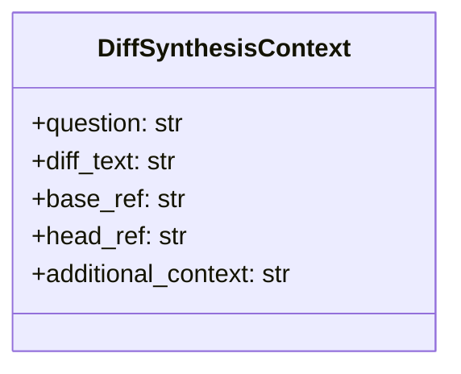

# File: `src/local_deepwiki/handlers/analysis_diff.py`

## File Overview

This file implements two core tool handlers for analyzing Git diffs in the context of a local DeepWiki system:

1. `handle_analyze_diff`: Analyzes a Git diff between two references and maps changed files to affected wiki pages and code entities.
2. `handle_ask_about_diff`: Enables RAG-based question-answering about Git changes, combining the diff content with vector-searched code context and LLM synthesis.

The handlers integrate Git operations, vector database lookups, and LLM-based reasoning to provide intelligent insights into code changes within a documentation context. This file is responsible for bridging Git diff analysis with the DeepWiki knowledge base.

## Key Concepts

### Diff Analysis Pipeline

The file implements a multi-step pipeline for Git diff analysis:
1. **Git Diff Execution**: Uses `git diff` to obtain the diff content.
2. **Name Status Parsing**: Parses `git diff --name-status` to identify changed files and their status.
3. **Per-File Content Fetching**: Retrieves full diff content for each changed file if requested.
4. **Wiki Mapping**: Cross-references changed files with the DeepWiki index to identify affected wiki pages and entities.
5. **Summary Generation**: Produces a structured summary of the diff analysis.

This pipeline is designed to be modular and extensible, with each step encapsulated in a dedicated function.

### RAG-Based Question Answering

The `handle_ask_about_diff` function implements a Retrieval-Augmented Generation (RAG) approach:
1. **Context Retrieval**: Queries the vector store for code chunks relevant to the user's question.
2. **Prompt Construction**: Combines the Git diff with retrieved context into a structured prompt.
3. **LLM Synthesis**: Uses a cached LLM provider to generate a human-readable answer.

This approach allows users to ask specific questions about code changes and get contextualized answers based on both the diff and the codebase's documentation.

### Security and Validation

The file enforces security through:
- **Git Reference Validation**: Ensures Git refs are valid to prevent injection attacks.
- **[Permission](../security/access_control.md) Checking**: Verifies that the user has appropriate permissions (`INDEX_READ` for `analyze_diff`, `QUERY_SEARCH` for `ask_about_diff`).
- **Error Handling**: Uses centralized error handling via [`handle_tool_errors`](_error_handling.md) and custom [`ValidationError`](../errors.md) types.

## Integration

This file is part of the DeepWiki tooling system and integrates with several other components:

- **Configuration**: Uses `get_config()` to access application settings, including vector DB and LLM configurations.
- **[Vector Store](../core/vectorstore/store.md)**: Interacts with [`VectorStore`](../core/vectorstore/store.md) to perform code context retrieval for RAG.
- **LLM Providers**: Leverages `get_cached_llm_provider` and `get_embedding_provider` for LLM and embedding services.
- **Access Control**: Uses `get_access_controller()` and [`Permission`](../security/access_control.md) enums for authorization checks.
- **Error Handling**: Integrates with `_error_handling` and [`make_tool_text_content`](_response.md) for consistent error reporting and tool responses.

The handlers are called by the CLI and tooling system, specifically:
- `handle_analyze_diff` is used by `test_analyze_diff`
- `handle_ask_about_diff` is used by `test_ask_about_diff`

These functions are expected to be invoked as part of a broader tooling or API flow, likely through a tool server or CLI entrypoint that dispatches tool calls to the appropriate handler.

## Design Notes

### Performance Considerations

- **Async I/O**: All Git subprocess calls and vector store operations are run asynchronously using `asyncio.to_thread` to avoid blocking the event loop.
- **Diff Truncation**: Large diffs are truncated to `MAX_DIFF_TEXT_LENGTH` to prevent performance or memory issues in the LLM prompt.
- **Context Limiting**: The RAG system limits the number of code chunks retrieved (`max_context`) to maintain prompt length and performance.

### Security and Robustness

- **Git Ref Injection Prevention**: The `_validate_git_refs` function ensures that Git references contain only safe characters, mitigating potential injection vulnerabilities.
- **Graceful Degradation**: When wiki index files (`toc.json`, `search.json`) are missing or malformed, the diff analysis continues without them, logging a debug message.
- **Timeout Handling**: Git subprocess calls are subject to timeouts (`GIT_DIFF_TIMEOUT`, `GIT_FILE_DIFF_TIMEOUT`) to prevent hanging.

### Modularity and Separation of Concerns

- **Context Bundling**: The `DiffSynthesisContext` dataclass bundles parameters for `_synthesize_diff_answer` to reduce parameter count and improve readability.
- **Modular Functions**: Each function has a single, well-defined responsibility, promoting reusability and testability.
- **Error Handling**: Errors are consistently handled with structured messages and appropriate logging, aiding debugging and monitoring.

### Extensibility

The architecture is designed to support future enhancements:
- The `DiffSynthesisContext` class can be extended to include more context fields.
- The RAG pipeline can be adapted to include more sophisticated retrieval or synthesis steps.
- The mapping of files to wiki pages and entities can be extended to support more complex indexing strategies.

## API Reference

### class `DiffSynthesisContext`

Immutable context for LLM-based diff answer synthesis.  Bundles the parameters of _synthesize_diff_answer to reduce its parameter count from 8 to a manageable level.

---


<details>
<summary>View Source (lines 47-58) | <a href="https://github.com/UrbanDiver/local-deepwiki-mcp/blob/main/src/local_deepwiki/handlers/analysis_diff.py#L47-L58">GitHub</a></summary>

```python
class DiffSynthesisContext:
    """Immutable context for LLM-based diff answer synthesis.

    Bundles the parameters of _synthesize_diff_answer to reduce its
    parameter count from 8 to a manageable level.
    """

    question: str
    diff_text: str
    base_ref: str
    head_ref: str
    additional_context: str
```

</details>

### Functions

#### `handle_analyze_diff`

`@handle_tool_errors`

```python
async def handle_analyze_diff(args: dict[str, Any]) -> list[TextContent]
```

Handle analyze_diff tool call.  Analyzes git diff and maps changed files to affected wiki pages and entities.


| Parameter | Type | Default | Description |
|-----------|------|---------|-------------|
| `args` | `dict[str, Any]` | - | - |

**Returns:** `list[TextContent]`


<details>
<summary>View Source (lines 299-378) | <a href="https://github.com/UrbanDiver/local-deepwiki-mcp/blob/main/src/local_deepwiki/handlers/analysis_diff.py#L299-L378">GitHub</a></summary>

```python
async def handle_analyze_diff(args: dict[str, Any]) -> list[TextContent]:
    """Handle analyze_diff tool call.

    Analyzes git diff and maps changed files to affected wiki pages and entities.
    """
    controller = get_access_controller()
    controller.require_permission(Permission.INDEX_READ)

    try:
        validated = AnalyzeDiffArgs.model_validate(args)
    except PydanticValidationError as e:
        raise ValueError(str(e)) from e

    repo_path = Path(validated.repo_path).resolve()
    if not repo_path.exists():
        raise path_not_found_error(str(repo_path), "repository")

    _validate_git_refs(
        [
            ("base_ref", validated.base_ref),
            ("head_ref", validated.head_ref),
        ]
    )

    # Run git diff --name-status
    diff_result = await _run_git_diff(
        repo_path,
        validated.base_ref,
        validated.head_ref,
        extra_args=["--name-status"],
    )
    if isinstance(diff_result, list):
        return diff_result

    changed_files = _parse_diff_name_status(diff_result.stdout)

    if not changed_files:
        return make_tool_text_content(
            "analyze_diff",
            {
                "status": "success",
                "base_ref": validated.base_ref,
                "head_ref": validated.head_ref,
                "message": "No file changes found between the specified refs.",
                "changed_files": [],
                "affected_wiki_pages": [],
                "affected_entities": [],
            },
        )

    if validated.include_content:
        await _fetch_per_file_diff_content(
            repo_path,
            validated.base_ref,
            validated.head_ref,
            changed_files,
        )

    affected_wiki_pages, affected_entities = await _build_structured_diff_result(
        repo_path, changed_files
    )

    summary = _build_diff_summary(changed_files, affected_wiki_pages, affected_entities)

    result = {
        "status": "success",
        "base_ref": validated.base_ref,
        "head_ref": validated.head_ref,
        "summary": summary,
        "changed_files": changed_files,
        "affected_wiki_pages": affected_wiki_pages,
        "affected_entities": affected_entities[:MAX_AFFECTED_ENTITIES],
    }

    logger.info(
        "Diff analysis: %d files changed, %d wiki pages affected",
        len(changed_files),
        len(affected_wiki_pages),
    )
    return make_tool_text_content("analyze_diff", result)
```

</details>

#### `handle_ask_about_diff`

`@handle_tool_errors`

```python
async def handle_ask_about_diff(args: dict[str, Any]) -> list[TextContent]
```

Handle ask_about_diff tool call.  RAG-based Q&A about recent code changes, combining git diff with vector search context and LLM synthesis.


| Parameter | Type | Default | Description |
|-----------|------|---------|-------------|
| `args` | `dict[str, Any]` | - | - |

**Returns:** `list[TextContent]`


<details>
<summary>View Source (lines 514-590) | <a href="https://github.com/UrbanDiver/local-deepwiki-mcp/blob/main/src/local_deepwiki/handlers/analysis_diff.py#L514-L590">GitHub</a></summary>

```python
async def handle_ask_about_diff(args: dict[str, Any]) -> list[TextContent]:
    """Handle ask_about_diff tool call.

    RAG-based Q&A about recent code changes, combining git diff
    with vector search context and LLM synthesis.
    """
    controller = get_access_controller()
    controller.require_permission(Permission.QUERY_SEARCH)

    try:
        validated = AskAboutDiffArgs.model_validate(args)
    except PydanticValidationError as e:
        raise ValueError(str(e)) from e

    repo_path = Path(validated.repo_path).resolve()
    question = validated.question

    if not repo_path.exists():
        raise path_not_found_error(str(repo_path), "repository")

    _validate_git_refs(
        [
            ("base_ref", validated.base_ref),
            ("head_ref", validated.head_ref),
        ]
    )

    # Get the diff
    diff_result = await _run_git_diff(
        repo_path,
        validated.base_ref,
        validated.head_ref,
    )
    if isinstance(diff_result, list):
        return diff_result

    diff_text = diff_result.stdout
    if not diff_text.strip():
        return make_tool_text_content(
            "ask_about_diff",
            {
                "status": "success",
                "question": question,
                "answer": "No changes found between the specified refs. There is nothing to analyze.",
                "sources": [],
            },
        )

    # Truncate diff if very large
    if len(diff_text) > MAX_DIFF_TEXT_LENGTH:
        diff_text = (
            diff_text[:MAX_DIFF_TEXT_LENGTH]
            + f"\n... (diff truncated, showing first {MAX_DIFF_TEXT_LENGTH} chars)"
        )

    answer, sources = await _rag_answer_about_diff(
        question,
        diff_text,
        repo_path,
        validated,
    )

    result = {
        "status": "success",
        "question": question,
        "base_ref": validated.base_ref,
        "head_ref": validated.head_ref,
        "answer": answer,
        "diff_stats": {
            "diff_length": len(diff_result.stdout),
            "truncated": len(diff_result.stdout) > MAX_DIFF_TEXT_LENGTH,
        },
        "sources": sources,
    }

    logger.info("Ask about diff: '%s...' for %s", question[:50], repo_path)
    return make_tool_text_content("ask_about_diff", result)
```

</details>

## Class Diagram



## Call Graph

```mermaid
flowchart TD
    N0[Path]
    N1[TextContent]
    N2[ValidationError]
    N3[ValueError]
    N4[VectorStore]
    N5[_build_diff_summary]
    N6[_build_structured_diff_result]
    N7[_fetch_per_file_diff_content]
    N8[_load_index_status]
    N9[_parse_diff_name_status]
    N10[_prepare_diff_context]
    N11[_rag_answer_about_diff]
    N12[_run_git_diff]
    N13[_synthesize_diff_answer]
    N14[_validate_git_refs]
    N15[dumps]
    N16[exists]
    N17[get_access_controller]
    N18[handle_analyze_diff]
    N19[handle_ask_about_diff]
    N20[loads]
    N21[make_tool_text_content]
    N22[match]
    N23[model_validate]
    N24[path_not_found_error]
    N25[require_permission]
    N26[resolve]
    N27[sanitize_error_message]
    N28[splitlines]
    N29[to_thread]
    N14 --> N22
    N14 --> N2
    N12 --> N29
    N12 --> N1
    N12 --> N15
    N12 --> N27
    N9 --> N28
    N7 --> N29
    N6 --> N8
    N6 --> N16
    N6 --> N29
    N6 --> N20
    N18 --> N17
    N18 --> N25
    N18 --> N23
    N18 --> N3
    N18 --> N26
    N18 --> N0
    N18 --> N16
    N18 --> N24
    N18 --> N14
    N18 --> N12
    N18 --> N9
    N18 --> N21
    N18 --> N7
    N18 --> N6
    N18 --> N5
    N10 --> N16
    N10 --> N4
    N11 --> N10
    N11 --> N13
    N19 --> N17
    N19 --> N25
    N19 --> N23
    N19 --> N3
    N19 --> N26
    N19 --> N0
    N19 --> N16
    N19 --> N24
    N19 --> N14
    N19 --> N12
    N19 --> N21
    N19 --> N11
    classDef func fill:#e1f5fe
    class N0,N1,N2,N3,N4,N5,N6,N7,N8,N9,N10,N11,N12,N13,N14,N15,N16,N17,N18,N19,N20,N21,N22,N23,N24,N25,N26,N27,N28,N29 func
```



## Used By

Functions and methods in this file and their callers:

- **`DiffSynthesisContext`**: called by `_rag_answer_about_diff`
- **`Path`**: called by `handle_analyze_diff`, `handle_ask_about_diff`
- **`TextContent`**: called by `_run_git_diff`
- **[`ValidationError`](../errors.md)**: called by `_validate_git_refs`
- **`ValueError`**: called by `handle_analyze_diff`, `handle_ask_about_diff`
- **[`VectorStore`](../core/vectorstore/store.md)**: called by `_prepare_diff_context`
- **`_build_diff_summary`**: called by `handle_analyze_diff`
- **`_build_structured_diff_result`**: called by `handle_analyze_diff`
- **`_fetch_per_file_diff_content`**: called by `handle_analyze_diff`
- **`_load_index_status`**: called by `_build_structured_diff_result`
- **`_parse_diff_name_status`**: called by `handle_analyze_diff`
- **`_prepare_diff_context`**: called by `_rag_answer_about_diff`
- **`_rag_answer_about_diff`**: called by `handle_ask_about_diff`
- **`_run_git_diff`**: called by `handle_analyze_diff`, `handle_ask_about_diff`
- **`_synthesize_diff_answer`**: called by `_rag_answer_about_diff`
- **`_validate_git_refs`**: called by `handle_analyze_diff`, `handle_ask_about_diff`
- **`dumps`**: called by `_run_git_diff`
- **`exists`**: called by `_build_structured_diff_result`, `_prepare_diff_context`, `handle_analyze_diff`, `handle_ask_about_diff`
- **`generate`**: called by `_synthesize_diff_answer`
- **[`get_access_controller`](../security/access_control.md)**: called by `handle_analyze_diff`, `handle_ask_about_diff`
- **`get_cached_llm_provider`**: called by `_synthesize_diff_answer`
- **[`get_config`](../config/loader.md)**: called by `_rag_answer_about_diff`
- **`get_embedding_provider`**: called by `_rag_answer_about_diff`
- **[`get_rate_limiter`](../core/rate_limiter.md)**: called by `_synthesize_diff_answer`
- **`get_vector_db_path`**: called by `_rag_answer_about_diff`
- **[`get_wiki_path`](../web/utils.md)**: called by `_rag_answer_about_diff`
- **`loads`**: called by `_build_structured_diff_result`
- **[`make_tool_text_content`](_response.md)**: called by `handle_analyze_diff`, `handle_ask_about_diff`
- **`match`**: called by `_validate_git_refs`
- **`model_validate`**: called by `handle_analyze_diff`, `handle_ask_about_diff`
- **[`path_not_found_error`](../error_factories.md)**: called by `handle_analyze_diff`, `handle_ask_about_diff`
- **[`require_permission`](../security/access_control.md)**: called by `handle_analyze_diff`, `handle_ask_about_diff`
- **`resolve`**: called by `handle_analyze_diff`, `handle_ask_about_diff`
- **[`sanitize_error_message`](../error_factories.md)**: called by `_run_git_diff`
- **`search`**: called by `_prepare_diff_context`
- **`splitlines`**: called by `_parse_diff_name_status`
- **`to_thread`**: called by `_build_structured_diff_result`, `_fetch_per_file_diff_content`, `_run_git_diff`

## Last Modified

| Entity | Type | Author | Date | Commit |
|--------|------|--------|------|--------|
| `DiffSynthesisContext` | class | Brian Breidenbach | yesterday | `1eef062` refactor: complete Grade A ... |
| `_synthesize_diff_answer` | function | Brian Breidenbach | yesterday | `1eef062` refactor: complete Grade A ... |
| `_rag_answer_about_diff` | function | Brian Breidenbach | yesterday | `1eef062` refactor: complete Grade A ... |
| `_validate_git_refs` | function | Brian Breidenbach | 1 week ago | `658356d` refactor: extract helpers f... |
| `_run_git_diff` | function | Brian Breidenbach | 1 week ago | `658356d` refactor: extract helpers f... |
| `_parse_diff_name_status` | function | Brian Breidenbach | 1 week ago | `658356d` refactor: extract helpers f... |
| `_fetch_per_file_diff_content` | function | Brian Breidenbach | 1 week ago | `658356d` refactor: extract helpers f... |
| `_build_diff_summary` | function | Brian Breidenbach | 1 week ago | `658356d` refactor: extract helpers f... |
| `handle_analyze_diff` | function | Brian Breidenbach | 1 week ago | `658356d` refactor: extract helpers f... |
| `handle_ask_about_diff` | function | Brian Breidenbach | 1 week ago | `658356d` refactor: extract helpers f... |
| `_build_structured_diff_result` | function | Brian Breidenbach | 1 week ago | `f3faf1e` refactor: split generator a... |
| `_prepare_diff_context` | function | Brian Breidenbach | 1 week ago | `f3faf1e` refactor: split generator a... |

## Additional Source Code

Source code for functions and methods not listed in the API Reference above.

#### `_validate_git_refs`

<details>
<summary>View Source (lines 65-83) | <a href="https://github.com/UrbanDiver/local-deepwiki-mcp/blob/main/src/local_deepwiki/handlers/analysis_diff.py#L65-L83">GitHub</a></summary>

```python
def _validate_git_refs(
    refs: list[tuple[str, str]],
) -> None:
    """Validate git ref strings to prevent injection.

    Args:
        refs: List of (field_name, ref_value) tuples.

    Raises:
        ValidationError: If any ref is invalid.
    """
    for ref_name, ref_value in refs:
        if not _GIT_REF_PATTERN.match(ref_value):
            raise ValidationError(
                message=f"Invalid git ref: {ref_value}",
                hint="Git refs must contain only alphanumeric chars, /, -, _, ~, ^, and .",
                field=ref_name,
                value=ref_value,
            )
```

</details>


#### `_run_git_diff`

<details>
<summary>View Source (lines 86-146) | <a href="https://github.com/UrbanDiver/local-deepwiki-mcp/blob/main/src/local_deepwiki/handlers/analysis_diff.py#L86-L146">GitHub</a></summary>

```python
async def _run_git_diff(
    repo_path: Path,
    base_ref: str,
    head_ref: str,
    *,
    extra_args: list[str] | None = None,
    timeout: int = GIT_DIFF_TIMEOUT,
) -> subprocess.CompletedProcess[str] | list[TextContent]:
    """Run a git diff command and return the result or an error response.

    Args:
        repo_path: Repository path.
        base_ref: Base git ref.
        head_ref: Head git ref.
        extra_args: Additional args inserted after ``head_ref``.
        timeout: Subprocess timeout in seconds.

    Returns:
        ``CompletedProcess`` on success, or ``list[TextContent]`` error response.
    """
    cmd = ["git", "diff"]
    if extra_args:
        cmd.extend(extra_args)
    cmd.extend([base_ref, head_ref])

    try:
        diff_result = await asyncio.to_thread(
            subprocess.run,
            cmd,
            cwd=str(repo_path),
            capture_output=True,
            text=True,
            timeout=timeout,
        )
        if diff_result.returncode != 0:
            return [
                TextContent(
                    type="text",
                    text=json.dumps(
                        {
                            "status": "error",
                            "error": f"git diff failed: {sanitize_error_message(diff_result.stderr.strip())}",
                        },
                        indent=2,
                    ),
                )
            ]
        return diff_result
    except subprocess.TimeoutExpired:
        return [
            TextContent(
                type="text",
                text=json.dumps(
                    {
                        "status": "error",
                        "error": f"git diff timed out after {timeout} seconds",
                    },
                    indent=2,
                ),
            )
        ]
```

</details>


#### `_parse_diff_name_status`

<details>
<summary>View Source (lines 149-173) | <a href="https://github.com/UrbanDiver/local-deepwiki-mcp/blob/main/src/local_deepwiki/handlers/analysis_diff.py#L149-L173">GitHub</a></summary>

```python
def _parse_diff_name_status(stdout: str) -> list[dict[str, Any]]:
    """Parse ``git diff --name-status`` output into changed-file dicts.

    Args:
        stdout: Raw stdout from the git diff command.

    Returns:
        List of dicts with ``file`` and ``status`` keys.
    """
    status_map = {
        "A": "added",
        "M": "modified",
        "D": "deleted",
        "R": "renamed",
    }
    changed_files: list[dict[str, Any]] = []
    for line in stdout.strip().splitlines():
        if not line.strip():
            continue
        parts = line.split("\t", 1)
        if len(parts) == 2:
            status_code, file_name = parts
            status = status_map.get(status_code[0], "modified")
            changed_files.append({"file": file_name, "status": status})
    return changed_files
```

</details>


#### `_fetch_per_file_diff_content`

<details>
<summary>View Source (lines 176-209) | <a href="https://github.com/UrbanDiver/local-deepwiki-mcp/blob/main/src/local_deepwiki/handlers/analysis_diff.py#L176-L209">GitHub</a></summary>

```python
async def _fetch_per_file_diff_content(
    repo_path: Path,
    base_ref: str,
    head_ref: str,
    changed_files: list[dict[str, Any]],
) -> None:
    """Mutate *changed_files* in-place to add ``diff_content`` per file.

    Args:
        repo_path: Repository path.
        base_ref: Base git ref.
        head_ref: Head git ref.
        changed_files: Changed-file dicts to augment.
    """
    for cf in changed_files:
        try:
            file_diff = await asyncio.to_thread(
                subprocess.run,
                [
                    "git",
                    "diff",
                    base_ref,
                    head_ref,
                    "--",
                    cf["file"],
                ],
                cwd=str(repo_path),
                capture_output=True,
                text=True,
                timeout=GIT_FILE_DIFF_TIMEOUT,
            )
            cf["diff_content"] = file_diff.stdout[:MAX_DIFF_CONTENT_LENGTH]
        except (subprocess.TimeoutExpired, OSError):
            cf["diff_content"] = "(diff content unavailable)"
```

</details>


#### `_build_diff_summary`

<details>
<summary>View Source (lines 212-234) | <a href="https://github.com/UrbanDiver/local-deepwiki-mcp/blob/main/src/local_deepwiki/handlers/analysis_diff.py#L212-L234">GitHub</a></summary>

```python
def _build_diff_summary(
    changed_files: list[dict[str, Any]],
    affected_wiki_pages: list[dict[str, str]],
    affected_entities: list[dict[str, str]],
) -> dict[str, int]:
    """Build a summary dict from diff analysis results.

    Args:
        changed_files: Changed-file dicts.
        affected_wiki_pages: Wiki pages affected by the diff.
        affected_entities: Code entities affected by the diff.

    Returns:
        Summary dict with counts.
    """
    return {
        "total_changed_files": len(changed_files),
        "added": sum(1 for f in changed_files if f["status"] == "added"),
        "modified": sum(1 for f in changed_files if f["status"] == "modified"),
        "deleted": sum(1 for f in changed_files if f["status"] == "deleted"),
        "affected_wiki_pages": len(affected_wiki_pages),
        "affected_entities": len(affected_entities),
    }
```

</details>


#### `_build_structured_diff_result`

<details>
<summary>View Source (lines 237-295) | <a href="https://github.com/UrbanDiver/local-deepwiki-mcp/blob/main/src/local_deepwiki/handlers/analysis_diff.py#L237-L295">GitHub</a></summary>

```python
async def _build_structured_diff_result(
    repo_path: Path,
    changed_files: list[dict[str, Any]],
) -> tuple[list[dict[str, str]], list[dict[str, str]]]:
    """Map changed files to wiki pages and entities via the index.

    Args:
        repo_path: Resolved repository path.
        changed_files: List of changed-file dicts with ``file`` and ``status`` keys.

    Returns:
        Tuple of (affected_wiki_pages, affected_entities) lists.
    """
    affected_wiki_pages: list[dict[str, str]] = []
    affected_entities: list[dict[str, str]] = []
    try:
        _index_status, wiki_path, _config = await _load_index_status(repo_path)
        changed_file_set = {cf["file"] for cf in changed_files}

        toc_path = wiki_path / "toc.json"
        if toc_path.exists():
            toc_content = await asyncio.to_thread(toc_path.read_text)
            toc_data = json.loads(toc_content)
            pages = (
                toc_data if isinstance(toc_data, list) else toc_data.get("pages", [])
            )
            for page in pages:
                source_file = page.get("source_file", "")
                if source_file in changed_file_set:
                    affected_wiki_pages.append(
                        {
                            "title": page.get("title", ""),
                            "path": page.get("path", ""),
                            "source_file": source_file,
                        }
                    )

        search_path = wiki_path / "search.json"
        if search_path.exists():
            search_content = await asyncio.to_thread(search_path.read_text)
            search_data = json.loads(search_content)
            for entity in search_data.get("entities", []):
                if entity.get("file", "") in changed_file_set:
                    affected_entities.append(
                        {
                            "name": entity.get("display_name", entity.get("name", "")),
                            "type": entity.get("entity_type", ""),
                            "file": entity.get("file", ""),
                        }
                    )
    except (
        FileNotFoundError,
        json.JSONDecodeError,
        OSError,
        KeyError,
        ValidationError,
    ) as e:
        logger.debug("Could not load wiki/entity mapping for diff analysis: %s", e)
    return affected_wiki_pages, affected_entities
```

</details>


#### `_prepare_diff_context`

<details>
<summary>View Source (lines 381-425) | <a href="https://github.com/UrbanDiver/local-deepwiki-mcp/blob/main/src/local_deepwiki/handlers/analysis_diff.py#L381-L425">GitHub</a></summary>

```python
async def _prepare_diff_context(
    question: str,
    max_context: int,
    vector_db_path: Any,
    embedding_provider: Any,
) -> tuple[str, list[dict[str, Any]]]:
    """Search the vector store for context relevant to *question*.

    Args:
        question: The user's question about the diff.
        max_context: Maximum number of code chunks to retrieve.
        vector_db_path: Path to the LanceDB vector store.
        embedding_provider: Provider for computing query embeddings.

    Returns:
        Tuple of (additional_context_string, sources_list).
    """
    context_parts: list[str] = []
    sources: list[dict[str, Any]] = []

    if vector_db_path.exists():
        vector_store = VectorStore(vector_db_path, embedding_provider)
        search_results = await vector_store.search(question, limit=max_context)
        for sr in search_results:
            chunk = sr.chunk
            context_parts.append(
                f"File: {chunk.file_path} (lines {chunk.start_line}-{chunk.end_line})\n"
                f"Type: {chunk.chunk_type.value}\n"
                f"```\n{chunk.content}\n```"
            )
            sources.append(
                {
                    "file": chunk.file_path,
                    "lines": f"{chunk.start_line}-{chunk.end_line}",
                    "type": chunk.chunk_type.value,
                    "score": sr.score,
                }
            )

    additional_context = (
        "\n\n---\n\n".join(context_parts)
        if context_parts
        else "(No additional code context available)"
    )
    return additional_context, sources
```

</details>


#### `_synthesize_diff_answer`

<details>
<summary>View Source (lines 428-468) | <a href="https://github.com/UrbanDiver/local-deepwiki-mcp/blob/main/src/local_deepwiki/handlers/analysis_diff.py#L428-L468">GitHub</a></summary>

```python
async def _synthesize_diff_answer(
    diff_ctx: DiffSynthesisContext,
    wiki_path: Any,
    config: Any,
    embedding_provider: Any,
) -> str:
    """Call the LLM to synthesize an answer about the diff.

    Args:
        diff_ctx: Immutable context with question, diff text, refs, and RAG context.
        wiki_path: Path to wiki directory (for LLM cache).
        config: Application config object.
        embedding_provider: Provider for embedding (needed by cached LLM).

    Returns:
        The LLM-generated answer string.
    """
    from local_deepwiki.providers.llm import get_cached_llm_provider

    cache_path = wiki_path / "llm_cache.lance"
    llm = get_cached_llm_provider(
        cache_path=cache_path,
        embedding_provider=embedding_provider,
        cache_config=config.llm_cache,
        llm_config=config.llm,
    )

    prompt = (
        f"You are analyzing recent code changes. Answer this question about the diff:\n\n"
        f"Question: {diff_ctx.question}\n\n"
        f"## Git Diff (changes between {diff_ctx.base_ref} and {diff_ctx.head_ref}):\n"
        f"```diff\n{diff_ctx.diff_text}\n```\n\n"
        f"## Additional Code Context (from the codebase):\n{diff_ctx.additional_context}\n\n"
        f"Provide a clear, specific answer based on the diff and context. "
        f"Focus on what changed, why it might matter, and any potential issues."
    )
    system_prompt = "You are a code review assistant. Analyze code diffs and answer questions accurately."

    rate_limiter = get_rate_limiter()
    async with rate_limiter:
        return await llm.generate(prompt, system_prompt=system_prompt)
```

</details>


#### `_rag_answer_about_diff`

<details>
<summary>View Source (lines 471-510) | <a href="https://github.com/UrbanDiver/local-deepwiki-mcp/blob/main/src/local_deepwiki/handlers/analysis_diff.py#L471-L510">GitHub</a></summary>

```python
async def _rag_answer_about_diff(
    question: str,
    diff_text: str,
    repo_path: Path,
    validated: AskAboutDiffArgs,
) -> tuple[str, list[dict[str, Any]]]:
    """Run RAG retrieval and LLM synthesis for a diff question.

    Args:
        question: The user's question.
        diff_text: (Possibly truncated) diff text.
        repo_path: Resolved repository path.
        validated: Validated request arguments.

    Returns:
        Tuple of (answer_string, sources_list).
    """
    config = get_config()
    vector_db_path = config.get_vector_db_path(repo_path)
    wiki_path = config.get_wiki_path(repo_path)
    embedding_provider = get_embedding_provider(config.embedding)

    additional_context, sources = await _prepare_diff_context(
        question, validated.max_context, vector_db_path, embedding_provider
    )

    diff_ctx = DiffSynthesisContext(
        question=question,
        diff_text=diff_text,
        base_ref=validated.base_ref,
        head_ref=validated.head_ref,
        additional_context=additional_context,
    )
    answer = await _synthesize_diff_answer(
        diff_ctx,
        wiki_path,
        config,
        embedding_provider,
    )
    return answer, sources
```

</details>

## Relevant Source Files

- `src/local_deepwiki/handlers/analysis_diff.py:47-58`
