# File: `src/local_deepwiki/handlers/analysis_entity.py`

## File Overview

This file implements the core logic for handling two primary entity-related analysis tools:
1. **Explain Entity**: Provides a detailed view of a specific entity (function, class, etc.) including its call graph, inheritance, test examples, and API documentation.
2. **Impact Analysis**: Analyzes the consequences of changes to a file or entity by examining reverse call graphs, inheritance, dependents, and related wiki pages.

The file acts as a bridge between the tool interface (e.g., LLM agents) and the underlying data processing logic, leveraging various generators and services from the codebase to produce structured analysis results.

## Key Concepts

### Composite Analysis Approach
The `handle_explain_entity` function orchestrates a composite analysis by invoking multiple specialized components:
- Call graph extraction using [`CallGraphExtractor`](../generators/analysis/callgraph.md)
- Inheritance hierarchy collection using [`collect_class_hierarchy`](../generators/analysis/inheritance.md)
- Test example extraction using [`CodeExampleExtractor`](../generators/examples/extractor.md)
- API documentation parsing using [`APIDocExtractor`](../generators/analysis/api_docs.md)

This approach allows for rich, multi-faceted understanding of an entity without duplicating effort across tools.

### Error Handling Strategy
The `_set_section_error` helper function ensures that partial failures during analysis do not halt execution. Instead, errors are logged and embedded in the result dictionary under a dedicated `error` key. This pattern supports graceful degradation and informative feedback to users.

### Asynchronous and Synchronous Patterns
Some operations, such as reading files or accessing vector stores, are handled asynchronously using `asyncio.to_thread`, while others are synchronous. The file balances these patterns based on performance requirements and I/O characteristics of the underlying operations.

### Vector Store Integration
Inheritance and test example analysis require access to a vector store. The code conditionally creates this store only when needed (`needs_vector_store` flag), optimizing resource usage.

## Integration

### With the Broader Codebase

This file is part of the `local_deepwiki.handlers` module and integrates deeply with:
- **Core utilities**: Uses [`validate_file_in_repo`](../core/path_utils.md) from `local_deepwiki.core.path_utils` for path validation.
- **Error handling**: Leverages [`handle_tool_errors`](_error_handling.md) and error utilities like [`path_not_found_error`](../error_factories.md) and [`sanitize_error_message`](../error_factories.md).
- **Indexing helpers**: Relies on `_create_vector_store` and `_load_index_status` from `_index_helpers` for managing index state.
- **Service layer**: Calls into [`AnalysisService`](../services/analysis_service.md) from `local_deepwiki.services.analysis_service` to perform the actual analysis logic.
- **Generators**: Uses various generators ([`CallGraphExtractor`](../generators/analysis/callgraph.md), [`collect_class_hierarchy`](../generators/analysis/inheritance.md), [`CodeExampleExtractor`](../generators/examples/extractor.md), [`APIDocExtractor`](../generators/analysis/api_docs.md)) from their respective modules to extract data.

### Usage by External Components

This file is called by:
- `analysis_service`: Used for implementing the underlying logic of `explain_entity` and `impact_analysis`.
- `agentic`: For integrating entity analysis into agent workflows.
- `test_explain_entity`, `test_integration_analysis`: For testing the tool's behavior.

## Design Notes

### Why Composite Tooling?
The `explain_entity` tool aggregates multiple analysis types to give a holistic view of an entity. This design avoids creating separate tools for each analysis type, reducing complexity and improving user experience by providing comprehensive information in one go.

### Conditional Vector Store Creation
The vector store is only created when inheritance or test examples are included in the request. This avoids unnecessary overhead, especially in environments where vector stores are expensive to initialize.

### Fallback Behavior in API Extraction
When extracting API documentation, the system first searches for top-level functions and then falls back to class methods. This ensures that even if a method is defined within a class, it can still be found and documented.

### Error Resilience
Rather than failing completely on any error, the system logs the error and includes a human-readable message in the output. This allows users to understand which parts of the analysis failed while still receiving partial results.

### Logging and Debugging
Comprehensive logging is used throughout the file to track execution flow and debug issues. For instance, debug-level logs are used when `search.json` cannot be read, and info-level logs record the success of explain and impact analyses.

### Path Validation
All file paths are validated using [`validate_file_in_repo`](../core/path_utils.md) to prevent unauthorized access or invalid paths. This is crucial for security in a tool that operates on user-provided repositories.

## API Reference

### Functions

#### `handle_explain_entity`

`@handle_tool_errors`

```python
async def handle_explain_entity(args: dict[str, Any]) -> list[TextContent]
```

Handle explain_entity tool call.  Composite tool that combines glossary, call graph, inheritance, test examples, and API docs for a single named entity.


| Parameter | Type | Default | Description |
|-----------|------|---------|-------------|
| `args` | `dict[str, Any]` | - | - |

**Returns:** `list[TextContent]`


<details>
<summary>View Source (lines 312-373) | <a href="https://github.com/UrbanDiver/local-deepwiki-mcp/blob/main/src/local_deepwiki/handlers/analysis_entity.py#L312-L373">GitHub</a></summary>

```python
async def handle_explain_entity(args: dict[str, Any]) -> list[TextContent]:
    """Handle explain_entity tool call.

    Composite tool that combines glossary, call graph, inheritance,
    test examples, and API docs for a single named entity.
    """
    controller = get_access_controller()
    controller.require_permission(Permission.INDEX_READ)

    try:
        validated = ExplainEntityArgs.model_validate(args)
    except PydanticValidationError as e:
        raise ValueError(str(e)) from e

    repo_path = Path(validated.repo_path).resolve()
    entity_name = validated.entity_name

    if not repo_path.exists():
        raise path_not_found_error(str(repo_path), "repository")

    index_status, wiki_path, config = await _load_index_status(repo_path)

    # Check entity existence before creating vector store (avoids unnecessary work)
    entity_info = await _lookup_entity_in_search_index(wiki_path, entity_name)
    if entity_info is None:
        result = {
            "status": "success",
            "entity_name": entity_name,
            "entity_found": False,
            "message": (
                f"Entity '{entity_name}' not found in the search index. "
                "Try using fuzzy_search or search_wiki to find the correct name."
            ),
        }
        return make_tool_text_content("explain_entity", result)

    entity_type = entity_info.get("entity_type", "unknown")
    needs_vector_store = (
        validated.include_inheritance and entity_type == "class"
    ) or validated.include_test_examples
    vector_store = (
        _create_vector_store(repo_path, config) if needs_vector_store else None
    )

    svc = AnalysisService()
    result = await svc.explain_entity(
        EntityExplainRequest(
            entity_name=entity_name,
            repo_path=repo_path,
            index_status=index_status,
            wiki_path=wiki_path,
            vector_store=vector_store,
            include_call_graph=validated.include_call_graph,
            include_inheritance=validated.include_inheritance,
            include_test_examples=validated.include_test_examples,
            include_api_docs=validated.include_api_docs,
            max_test_examples=validated.max_test_examples,
        )
    )

    logger.info("Explain entity: '%s' in %s", entity_name, repo_path)
    return make_tool_text_content("explain_entity", result)
```

</details>

#### `handle_impact_analysis`

`@handle_tool_errors`

```python
async def handle_impact_analysis(args: dict[str, Any]) -> list[TextContent]
```

Handle impact_analysis tool call.  Analyzes the blast radius of changes to a file or entity by examining reverse call graph, inheritance dependents, file imports, and wiki pages.


| Parameter | Type | Default | Description |
|-----------|------|---------|-------------|
| `args` | `dict[str, Any]` | - | - |

**Returns:** `list[TextContent]`


<details>
<summary>View Source (lines 377-433) | <a href="https://github.com/UrbanDiver/local-deepwiki-mcp/blob/main/src/local_deepwiki/handlers/analysis_entity.py#L377-L433">GitHub</a></summary>

```python
async def handle_impact_analysis(args: dict[str, Any]) -> list[TextContent]:
    """Handle impact_analysis tool call.

    Analyzes the blast radius of changes to a file or entity by examining
    reverse call graph, inheritance dependents, file imports, and wiki pages.
    """
    controller = get_access_controller()
    controller.require_permission(Permission.INDEX_READ)

    try:
        validated = ImpactAnalysisArgs.model_validate(args)
    except PydanticValidationError as e:
        raise ValueError(str(e)) from e

    repo_path = Path(validated.repo_path).resolve()
    file_path = validated.file_path
    entity_name = validated.entity_name

    if not repo_path.exists():
        raise path_not_found_error(str(repo_path), "repository")

    full_file = validate_file_in_repo(repo_path, file_path)

    index_status, wiki_path, config = await _load_index_status(repo_path)

    needs_vector_store = validated.include_inheritance or validated.include_dependents
    vector_store = (
        _create_vector_store(repo_path, config) if needs_vector_store else None
    )

    svc = AnalysisService()
    result = await svc.impact_analysis(
        ImpactAnalysisRequest(
            file_path=file_path,
            full_file=full_file,
            repo_path=repo_path,
            index_status=index_status,
            wiki_path=wiki_path,
            vector_store=vector_store,
            entity_name=entity_name,
            include_reverse_calls=validated.include_reverse_calls,
            include_inheritance=validated.include_inheritance,
            include_dependents=validated.include_dependents,
            include_wiki_pages=validated.include_wiki_pages,
        )
    )

    risk_level = result.get("impact_summary", {}).get("risk_level", "unknown")
    affected_count = result.get("impact_summary", {}).get("total_affected_files", 0)

    logger.info(
        "Impact analysis: %s -> %d files, risk=%s",
        file_path,
        affected_count,
        risk_level,
    )
    return make_tool_text_content("impact_analysis", result)
```

</details>

## Call Graph

```mermaid
flowchart TD
    N0[AnalysisService]
    N1[CallGraphExtractor]
    N2[CodeExampleExtractor]
    N3[Path]
    N4[ValueError]
    N5[_collect_api_docs]
    N6[_collect_call_graph]
    N7[_collect_inheritance]
    N8[_collect_test_examples]
    N9[_create_vector_store]
    N10[_load_index_status]
    N11[_lookup_entity_in_search_index]
    N12[_set_section_error]
    N13[build_reverse_call_graph]
    N14[collect_class_hierarchy]
    N15[exists]
    N16[extract_examples_for_class]
    N17[extract_from_file]
    N18[get_access_controller]
    N19[handle_explain_entity]
    N20[handle_impact_analysis]
    N21[is_relative_to]
    N22[loads]
    N23[make_tool_text_content]
    N24[model_validate]
    N25[path_not_found_error]
    N26[require_permission]
    N27[resolve]
    N28[sanitize_error_message]
    N29[to_thread]
    N12 --> N28
    N11 --> N15
    N11 --> N29
    N11 --> N22
    N6 --> N27
    N6 --> N15
    N6 --> N21
    N6 --> N1
    N6 --> N17
    N6 --> N13
    N6 --> N12
    N7 --> N14
    N7 --> N12
    N8 --> N2
    N8 --> N16
    N8 --> N12
    N5 --> N27
    N5 --> N15
    N5 --> N21
    N5 --> N17
    N5 --> N12
    N19 --> N18
    N19 --> N26
    N19 --> N24
    N19 --> N4
    N19 --> N27
    N19 --> N3
    N19 --> N15
    N19 --> N25
    N19 --> N10
    N19 --> N11
    N19 --> N23
    N19 --> N9
    N19 --> N0
    N20 --> N18
    N20 --> N26
    N20 --> N24
    N20 --> N4
    N20 --> N27
    N20 --> N3
    N20 --> N15
    N20 --> N25
    N20 --> N10
    N20 --> N9
    N20 --> N0
    N20 --> N23
    classDef func fill:#e1f5fe
    class N0,N1,N2,N3,N4,N5,N6,N7,N8,N9,N10,N11,N12,N13,N14,N15,N16,N17,N18,N19,N20,N21,N22,N23,N24,N25,N26,N27,N28,N29 func
```



## Used By

Functions and methods in this file and their callers:

- **[`APIDocExtractor`](../generators/analysis/api_docs.md)**: called by `_collect_api_docs`
- **[`AnalysisService`](../services/analysis_service.md)**: called by `handle_explain_entity`, `handle_impact_analysis`
- **[`CallGraphExtractor`](../generators/analysis/callgraph.md)**: called by `_collect_call_graph`
- **[`CodeExampleExtractor`](../generators/examples/extractor.md)**: called by `_collect_test_examples`
- **[`EntityExplainRequest`](../services/analysis_service.md)**: called by `handle_explain_entity`
- **[`ImpactAnalysisRequest`](../services/analysis_service.md)**: called by `handle_impact_analysis`
- **`Path`**: called by `handle_explain_entity`, `handle_impact_analysis`
- **`ValueError`**: called by `handle_explain_entity`, `handle_impact_analysis`
- **`_create_vector_store`**: called by `handle_explain_entity`, `handle_impact_analysis`
- **`_find_class_api_entry`**: called by `_collect_api_docs`
- **`_find_function_api_entry`**: called by `_collect_api_docs`
- **`_load_index_status`**: called by `handle_explain_entity`, `handle_impact_analysis`
- **`_lookup_entity_in_search_index`**: called by `handle_explain_entity`
- **`_set_section_error`**: called by `_collect_api_docs`, `_collect_call_graph`, `_collect_inheritance`, `_collect_test_examples`
- **[`build_reverse_call_graph`](../generators/analysis/callgraph.md)**: called by `_collect_call_graph`
- **[`collect_class_hierarchy`](../generators/analysis/inheritance.md)**: called by `_collect_inheritance`
- **`exists`**: called by `_collect_api_docs`, `_collect_call_graph`, `_lookup_entity_in_search_index`, `handle_explain_entity`, `handle_impact_analysis`
- **`explain_entity`**: called by `handle_explain_entity`
- **`extract_examples_for_class`**: called by `_collect_test_examples`
- **`extract_examples_for_function`**: called by `_collect_test_examples`
- **`extract_from_file`**: called by `_collect_api_docs`, `_collect_call_graph`
- **[`get_access_controller`](../security/access_control.md)**: called by `handle_explain_entity`, `handle_impact_analysis`
- **`impact_analysis`**: called by `handle_impact_analysis`
- **`is_relative_to`**: called by `_collect_api_docs`, `_collect_call_graph`
- **`loads`**: called by `_lookup_entity_in_search_index`
- **[`make_tool_text_content`](_response.md)**: called by `handle_explain_entity`, `handle_impact_analysis`
- **`model_validate`**: called by `handle_explain_entity`, `handle_impact_analysis`
- **[`path_not_found_error`](../error_factories.md)**: called by `handle_explain_entity`, `handle_impact_analysis`
- **[`require_permission`](../security/access_control.md)**: called by `handle_explain_entity`, `handle_impact_analysis`
- **`resolve`**: called by `_collect_api_docs`, `_collect_call_graph`, `handle_explain_entity`, `handle_impact_analysis`
- **[`sanitize_error_message`](../error_factories.md)**: called by `_set_section_error`
- **`to_thread`**: called by `_lookup_entity_in_search_index`
- **[`validate_file_in_repo`](../core/path_utils.md)**: called by `handle_impact_analysis`

## Last Modified

| Entity | Type | Author | Date | Commit |
|--------|------|--------|------|--------|
| `_collect_test_examples` | function | Brian Breidenbach | today | `1276e81` refactor: remove backward-c... |
| `handle_explain_entity` | function | Brian Breidenbach | yesterday | `ca3ccca` refactor: flatten deep nest... |
| `handle_impact_analysis` | function | Brian Breidenbach | yesterday | `ca3ccca` refactor: flatten deep nest... |
| `_collect_inheritance` | function | Brian Breidenbach | 2 weeks ago | `3e65004` fix: impact_analysis scans ... |
| `_collect_call_graph` | function | Brian Breidenbach | Feb 23, 2026 | `462ead0` refactor: reorganize genera... |
| `_collect_api_docs` | function | Brian Breidenbach | Feb 23, 2026 | `462ead0` refactor: reorganize genera... |
| `_lookup_entity_in_search_index` | function | Brian Breidenbach | Feb 23, 2026 | `a662e1a` refactor: reduce complexity... |
| `_find_function_api_entry` | function | Brian Breidenbach | Feb 23, 2026 | `a662e1a` refactor: reduce complexity... |
| `_find_class_api_entry` | function | Brian Breidenbach | Feb 23, 2026 | `a662e1a` refactor: reduce complexity... |
| `_set_section_error` | function | Brian Breidenbach | Feb 11, 2026 | `ba96da1` fix: publication plan P0-P2... |

## Additional Source Code

Source code for functions and methods not listed in the API Reference above.

#### `_set_section_error`

<details>
<summary>View Source (lines 46-55) | <a href="https://github.com/UrbanDiver/local-deepwiki-mcp/blob/main/src/local_deepwiki/handlers/analysis_entity.py#L46-L55">GitHub</a></summary>

```python
def _set_section_error(
    result: dict[str, Any],
    field: str,
    operation: str,
    detail: str,
    exc: Exception,
) -> None:
    """Record a non-fatal section error in an explain/impact result dict."""
    logger.warning("%s failed for '%s': %s", operation, detail, exc)
    result[field] = {"error": sanitize_error_message(str(exc))}
```

</details>


#### `_lookup_entity_in_search_index`

<details>
<summary>View Source (lines 63-81) | <a href="https://github.com/UrbanDiver/local-deepwiki-mcp/blob/main/src/local_deepwiki/handlers/analysis_entity.py#L63-L81">GitHub</a></summary>

```python
async def _lookup_entity_in_search_index(
    wiki_path: Path,
    entity_name: str,
) -> dict[str, Any] | None:
    """Look up *entity_name* in the pre-built ``search.json`` index."""
    search_json_path = wiki_path / "search.json"
    if not search_json_path.exists():
        return None
    try:
        search_content = await asyncio.to_thread(search_json_path.read_text)
        search_data = json.loads(search_content)
        for entry in search_data.get("entities", []):
            if entry.get("name") == entity_name:
                return entry
    except (json.JSONDecodeError, OSError) as e:
        logger.debug(
            "search.json exists but could not be read for entity lookup: %s", e
        )
    return None
```

</details>


#### `_collect_call_graph`

<details>
<summary>View Source (lines 84-116) | <a href="https://github.com/UrbanDiver/local-deepwiki-mcp/blob/main/src/local_deepwiki/handlers/analysis_entity.py#L84-L116">GitHub</a></summary>

```python
def _collect_call_graph(
    result: dict[str, Any],
    repo_path: Path,
    entity_name: str,
    entity_file: str,
) -> None:
    """Extract call graph for *entity_name* and store in *result*."""
    try:
        from local_deepwiki.generators.analysis.callgraph import (
            CallGraphExtractor,
            build_reverse_call_graph,
        )

        full_file_path = (repo_path / entity_file).resolve()
        if full_file_path.exists() and full_file_path.is_relative_to(repo_path):
            extractor = CallGraphExtractor()
            call_graph = extractor.extract_from_file(full_file_path, repo_path)
            reverse_graph = build_reverse_call_graph(call_graph)
            result["call_graph"] = {
                "calls": call_graph.get(entity_name, []),
                "called_by": reverse_graph.get(entity_name, []),
            }
        else:
            result["call_graph"] = {
                "calls": [],
                "called_by": [],
                "note": "Source file not found",
            }
    except (OSError, ValueError, RuntimeError) as exc:
        # OSError: file read errors; ValueError: parsing errors; RuntimeError: tree-sitter errors
        _set_section_error(
            result, "call_graph", "Call graph extraction", entity_name, exc
        )
```

</details>


#### `_collect_inheritance`

<details>
<summary>View Source (lines 119-150) | <a href="https://github.com/UrbanDiver/local-deepwiki-mcp/blob/main/src/local_deepwiki/handlers/analysis_entity.py#L119-L150">GitHub</a></summary>

```python
async def _collect_inheritance(
    result: dict[str, Any],
    entity_name: str,
    index_status: Any,
    vector_store: Any,
) -> None:
    """Collect inheritance hierarchy for a class entity."""
    try:
        from local_deepwiki.generators.analysis.inheritance import (
            collect_class_hierarchy,
        )

        classes = await collect_class_hierarchy(index_status, vector_store)
        class_node = classes.get(entity_name)
        if class_node is not None:
            result["inheritance"] = {
                "parents": class_node.parents,
                "children": class_node.children,
                "is_abstract": class_node.is_abstract,
            }
        else:
            result["inheritance"] = {
                "parents": [],
                "children": [],
                "is_abstract": False,
                "note": "Class not found in inheritance hierarchy",
            }
    except (OSError, ValueError, RuntimeError) as exc:
        # OSError: vector store errors; ValueError: data format errors; RuntimeError: collection errors
        _set_section_error(
            result, "inheritance", "Inheritance lookup", entity_name, exc
        )
```

</details>


#### `_collect_test_examples`

<details>
<summary>View Source (lines 153-191) | <a href="https://github.com/UrbanDiver/local-deepwiki-mcp/blob/main/src/local_deepwiki/handlers/analysis_entity.py#L153-L191">GitHub</a></summary>

```python
async def _collect_test_examples(
    result: dict[str, Any],
    entity_name: str,
    entity_type: str,
    max_examples: int,
    repo_path: Path,
    vector_store: Any,
) -> None:
    """Extract test examples for *entity_name* from test files."""
    try:
        from local_deepwiki.generators.examples.extractor import CodeExampleExtractor

        extractor = CodeExampleExtractor(vector_store, repo_path=repo_path)
        if entity_type == "class":
            examples = await extractor.extract_examples_for_class(
                entity_name, max_examples=max_examples
            )
        else:
            examples = await extractor.extract_examples_for_function(
                entity_name, max_examples=max_examples
            )
            if not examples:
                examples = await extractor.extract_examples_for_class(
                    entity_name, max_examples=max_examples
                )
        result["test_examples"] = [
            {
                "code": ex.code,
                "source_file": ex.test_file,
                "description": ex.description,
            }
            for ex in examples
        ]
    except (OSError, ValueError, RuntimeError, TypeError) as exc:
        # OSError: vector store errors; ValueError: data format errors
        # RuntimeError: extraction errors; TypeError: incompatible argument types
        _set_section_error(
            result, "test_examples", "Test example extraction", entity_name, exc
        )
```

</details>


#### `_find_function_api_entry`

<details>
<summary>View Source (lines 194-237) | <a href="https://github.com/UrbanDiver/local-deepwiki-mcp/blob/main/src/local_deepwiki/handlers/analysis_entity.py#L194-L237">GitHub</a></summary>

```python
def _find_function_api_entry(
    functions: list[Any],
    classes_sigs: list[Any],
    entity_name: str,
) -> dict[str, Any] | None:
    """Find API doc entry for a function/method entity."""
    # Search top-level functions first
    for func_sig in functions:
        if func_sig.name == entity_name:
            return {
                "parameters": [
                    {
                        "name": p.name,
                        "type": p.type_hint,
                        "default": p.default_value,
                    }
                    for p in func_sig.parameters
                ],
                "return_type": func_sig.return_type,
                "docstring": func_sig.docstring,
                "is_async": func_sig.is_async,
                "decorators": func_sig.decorators,
            }

    # Fall back to class methods
    for cls_sig in classes_sigs:
        for m in cls_sig.methods:
            if m.name == entity_name:
                return {
                    "parameters": [
                        {
                            "name": p.name,
                            "type": p.type_hint,
                            "default": p.default_value,
                        }
                        for p in m.parameters
                    ],
                    "return_type": m.return_type,
                    "docstring": m.docstring,
                    "is_async": m.is_async,
                    "decorators": m.decorators,
                    "class_name": cls_sig.name,
                }
    return None
```

</details>


#### `_find_class_api_entry`

<details>
<summary>View Source (lines 240-273) | <a href="https://github.com/UrbanDiver/local-deepwiki-mcp/blob/main/src/local_deepwiki/handlers/analysis_entity.py#L240-L273">GitHub</a></summary>

```python
def _find_class_api_entry(
    classes_sigs: list[Any],
    entity_name: str,
) -> dict[str, Any] | None:
    """Find API doc entry for a class entity."""
    for cls_sig in classes_sigs:
        if cls_sig.name == entity_name:
            return {
                "bases": cls_sig.bases,
                "docstring": cls_sig.docstring,
                "description": cls_sig.description,
                "methods": [
                    {
                        "name": m.name,
                        "parameters": [
                            {
                                "name": p.name,
                                "type": p.type_hint,
                                "default": p.default_value,
                            }
                            for p in m.parameters
                        ],
                        "return_type": m.return_type,
                        "is_async": m.is_async,
                        "docstring": m.docstring,
                    }
                    for m in cls_sig.methods
                ],
                "class_variables": [
                    {"name": cv[0], "type": cv[1], "value": cv[2]}
                    for cv in cls_sig.class_variables
                ],
            }
    return None
```

</details>


#### `_collect_api_docs`

<details>
<summary>View Source (lines 276-308) | <a href="https://github.com/UrbanDiver/local-deepwiki-mcp/blob/main/src/local_deepwiki/handlers/analysis_entity.py#L276-L308">GitHub</a></summary>

```python
def _collect_api_docs(
    result: dict[str, Any],
    repo_path: Path,
    entity_name: str,
    entity_type: str,
    entity_file: str,
) -> None:
    """Extract API docs for *entity_name* and store in *result*."""
    try:
        from local_deepwiki.generators.analysis.api_docs import APIDocExtractor

        full_file_path = (repo_path / entity_file).resolve()
        if not (full_file_path.exists() and full_file_path.is_relative_to(repo_path)):
            result["api_docs"] = {"note": "Source file not found"}
            return

        api_extractor = APIDocExtractor()
        functions, classes_sigs = api_extractor.extract_from_file(full_file_path)

        if entity_type == "class":
            api_entry = _find_class_api_entry(classes_sigs, entity_name)
        else:
            api_entry = _find_function_api_entry(functions, classes_sigs, entity_name)

        if api_entry is not None:
            result["api_docs"] = api_entry
        else:
            result["api_docs"] = {
                "note": f"No API signature found for '{entity_name}' in {entity_file}"
            }
    except (OSError, ValueError, RuntimeError) as exc:
        # OSError: file read errors; ValueError: parsing errors; RuntimeError: tree-sitter errors
        _set_section_error(result, "api_docs", "API doc extraction", entity_name, exc)
```

</details>

## Relevant Source Files

- `src/local_deepwiki/handlers/analysis_entity.py:46-55`
