# File: `src/local_deepwiki/handlers/analysis_metadata.py`

## File Overview

This module implements a set of handler functions responsible for gathering and analyzing metadata related to a repository's codebase and documentation. It serves as a core component for tools that provide insights into project structure, code complexity, file context, and wiki health. These handlers are designed to be invoked via a tool interface, likely through an LLM agent or CLI, to support tasks like code understanding, documentation coverage analysis, and project health checks.

The module integrates with various internal components such as parsers, index status loaders, manifest generators, and vector stores to deliver rich metadata insights. It handles validation, error management, and structured output generation using `TextContent` objects.

## Key Concepts

### Metadata Aggregation and Curation

The module centralizes logic for reading and curating metadata from various files:
- **`wiki_status.json`**: Curated to extract high-level metrics and stale page counts.
- **`coverage.json`**: Supports both new and legacy formats for coverage percentage and entity counts.
- **`toc.json` and `search.json`**: Used to compute page and entity entry counts for wiki search capabilities.

These curation steps ensure that only meaningful and high-level information is exposed, avoiding verbose or low-value data in responses.

### AST-Based Code Analysis

For analyzing code complexity and entities, the module uses `tree-sitter` via [`CodeParser`](../core/parser/code_parser.md). This enables:
- Extraction of top-level functions and classes from Python files.
- Detection of related test files that import a given module.
- Identification of recent Git commits touching a specific file.

This approach leverages structured parsing to provide accurate, language-specific insights.

### Async-Aware File Operations

To maintain responsiveness in a concurrent environment, the module extensively uses `asyncio.to_thread()` for file I/O operations (e.g., reading JSON files). This avoids blocking the event loop while performing disk reads.

### Tool-Specific Dispatch

The `handle_get_status` function demonstrates a scope-based dispatch pattern:
- `"index"`: Delegates to [`handle_get_index_status`](generators.md).
- `"wiki"`: Delegates to `handle_get_wiki_stats`.
- `"all"`: Combines both index and wiki status into a single response.

This design allows for fine-grained tool usage while maintaining a unified interface.

## Integration

### External Usage

This module is part of the `local_deepwiki.handlers` namespace and is used by:
- `_find_related_tests`: Called by `test_file_context_detail`, indicating this module supports test discovery in context.
- `handle_get_complexity_metrics`: Called by `test_complexity_metrics`, showing its role in unit test coverage.

These dependencies suggest that this module is integral to both documentation generation and analysis workflows.

### Related Files

The module imports from and integrates with:
- **Core utilities**: `local_deepwiki.core.path_utils`, `local_deepwiki.errors`, `local_deepwiki.logging`.
- **Handlers**: `_error_handling`, `_index_helpers`, `_response`.
- **Generators**: `manifest`, `context_builder`, `lazy_generator`, `analysis.complexity`.
- **Models**: [`GetProjectManifestArgs`](../models/tool_args.md), [`GetFileContextArgs`](../models/tool_args.md), [`GetWikiStatsArgs`](../models/tool_args.md), [`GetComplexityMetricsArgs`](../models/tool_args.md).
- **Security**: [`Permission`](../security/access_control.md), [`get_access_controller`](../security/access_control.md).

It also relies on:
- `mcp.types.TextContent` for structured tool output.
- `pydantic` for input validation.
- `subprocess` for Git operations.
- `asyncio`, `time`, and `json` for core async and data handling.

### CLI Integration

Based on the related files (`cli/check_cli.py`, `cli/main.py`, etc.), this module likely provides the backend for:
- Status checks (`status_cli.py`)
- Manifest inspection (`config_validator.py`)
- Project analysis (`check_cli.py`)

It supports CLI-driven analysis of repositories and documentation health.

## Design Notes

### Validation and Error Handling

All handlers perform input validation using pydantic models ([`GetProjectManifestArgs`](../models/tool_args.md), etc.) to ensure arguments conform to expected schemas. Errors are caught and re-raised with appropriate types ([`ValidationError`](../errors.md), [`path_not_found_error`](../error_factories.md)) for consistent error propagation.

### Permission Control

Each handler checks for `INDEX_READ` permission using `get_access_controller()`. This enforces access control at the handler level, ensuring that only authorized tools can access metadata.

### Caching and Manifest Handling

The `handle_get_project_manifest` function supports caching via `get_cached_manifest()` and fallback to parsing ([`parse_manifest`](../generators/manifest.md)) when `use_cache=False`. This balances performance with up-to-date information.

### File Path Validation

The module uses `validate_file_in_repo()` to ensure that file paths are within the repository, preventing path traversal issues and ensuring safe file access.

### Lazy Generator Integration

The `handle_get_wiki_stats` and `handle_get_status` functions integrate with the lazy generator system ([`get_active_generators`](../generators/lazy_generator.md)) to report on the status of ongoing wiki generation tasks, enabling monitoring of long-running processes.

### Complexity Metrics

The `handle_get_complexity_metrics` function uses a dedicated generator ([`compute_complexity_metrics`](../generators/analysis/complexity.md)) to analyze code complexity. This design separates complex logic from the handler, promoting testability and modularity.

### Stale Document Threshold

In `_curate_wiki_status`, a threshold (`STALE_DOCS_THRESHOLD_SECONDS`) is used to determine stale pages. This is a practical way to define "outdated" documentation without hardcoding arbitrary values.

### Git Commit Parsing

The `_get_recent_commits` function uses `git log` with a format string to extract commit SHAs and messages. It includes a timeout to avoid hanging on slow Git operations. The use of `subprocess` for Git is a pragmatic choice for this low-level, structured interaction.

### Output Format

All handlers return a list of `TextContent` objects, which are expected to be consumed by the tool interface. This standardizes output and ensures compatibility with downstream consumers.

## API Reference

### Functions

#### `handle_get_project_manifest`

`@handle_tool_errors`

```python
async def handle_get_project_manifest(args: dict[str, Any]) -> list[TextContent]
```

Handle get_project_manifest tool call.  Returns parsed project metadata from package manifest files (pyproject.toml, package.json, Cargo.toml, etc.).


| Parameter | Type | Default | Description |
|-----------|------|---------|-------------|
| `args` | `dict[str, Any]` | - | - |

**Returns:** `list[TextContent]`


<details>
<summary>View Source (lines 197-255) | <a href="https://github.com/UrbanDiver/local-deepwiki-mcp/blob/main/src/local_deepwiki/handlers/analysis_metadata.py#L197-L255">GitHub</a></summary>

```python
async def handle_get_project_manifest(args: dict[str, Any]) -> list[TextContent]:
    """Handle get_project_manifest tool call.

    Returns parsed project metadata from package manifest files
    (pyproject.toml, package.json, Cargo.toml, etc.).
    """
    controller = get_access_controller()
    controller.require_permission(Permission.INDEX_READ)

    try:
        validated = GetProjectManifestArgs.model_validate(args)
    except PydanticValidationError as e:
        raise ValueError(str(e)) from e

    repo_path = Path(validated.repo_path).resolve()

    if not repo_path.exists():
        raise path_not_found_error(str(repo_path), "repository")

    from local_deepwiki.generators.manifest import get_cached_manifest, parse_manifest

    if validated.use_cache:
        manifest = get_cached_manifest(repo_path)
    else:
        manifest = parse_manifest(repo_path)

    if not manifest.has_data():
        return make_tool_text_content(
            "get_project_manifest",
            {
                "message": "No recognized package manifest files found in repository.",
                "manifest": {},
            },
        )

    manifest_dict = {
        "name": manifest.name,
        "version": manifest.version,
        "description": manifest.description,
        "language": manifest.language,
        "language_version": manifest.language_version,
        "repository": manifest.repository,
        "license": manifest.license,
        "authors": manifest.authors,
        "manifest_files": manifest.manifest_files,
        "dependencies": manifest.dependencies,
        "dev_dependencies": manifest.dev_dependencies,
        "entry_points": manifest.entry_points,
        "scripts": manifest.scripts,
        "tech_stack_summary": manifest.get_tech_stack_summary(),
    }

    result = {
        "status": "success",
        "manifest": manifest_dict,
    }

    logger.info("Project manifest: %s for %s", manifest.name or "unknown", repo_path)
    return make_tool_text_content("get_project_manifest", result)
```

</details>

#### `handle_get_file_context`

`@handle_tool_errors`

```python
async def handle_get_file_context(args: dict[str, Any]) -> list[TextContent]
```

Handle get_file_context tool call.  Returns imports, callers, related files, and type definitions for a source file. When ``detail_level='full'``, also includes entities, related tests, and recent commits.


| Parameter | Type | Default | Description |
|-----------|------|---------|-------------|
| `args` | `dict[str, Any]` | - | - |

**Returns:** `list[TextContent]`


<details>
<summary>View Source (lines 382-457) | <a href="https://github.com/UrbanDiver/local-deepwiki-mcp/blob/main/src/local_deepwiki/handlers/analysis_metadata.py#L382-L457">GitHub</a></summary>

```python
async def handle_get_file_context(args: dict[str, Any]) -> list[TextContent]:
    """Handle get_file_context tool call.

    Returns imports, callers, related files, and type definitions for a source file.
    When ``detail_level='full'``, also includes entities, related tests, and recent commits.
    """
    controller = get_access_controller()
    controller.require_permission(Permission.INDEX_READ)

    try:
        validated = GetFileContextArgs.model_validate(args)
    except PydanticValidationError as e:
        raise ValueError(str(e)) from e

    repo_path = Path(validated.repo_path).resolve()
    file_path = validated.file_path

    if not repo_path.exists():
        raise path_not_found_error(str(repo_path), "repository")

    validate_file_in_repo(repo_path, file_path)

    index_status, _wiki_path, config = await _load_index_status(repo_path)

    from local_deepwiki.generators.context_builder import build_file_context

    vector_store = _create_vector_store(repo_path, config)

    # Get chunks for the file
    chunks = await vector_store.get_chunks_by_file(file_path)

    if not chunks:
        return make_tool_text_content(
            "get_file_context",
            {
                "message": f"No indexed chunks found for '{file_path}'. The file may not have been indexed.",
                "context": {"file_path": file_path},
            },
        )

    context = await build_file_context(
        file_path=file_path,
        chunks=chunks,
        repo_path=repo_path,
        vector_store=vector_store,
    )

    result_context: dict[str, Any] = {
        "file_path": context.file_path,
        "imports": context.imports,
        "imported_modules": context.imported_modules,
        "callers": context.callers,
        "related_files": context.related_files,
        "type_definitions": context.type_definitions,
    }
    if context.warnings:
        result_context["warnings"] = context.warnings

    if validated.detail_level == "full":
        full_file_path = repo_path / file_path
        result_context["entities"] = _extract_entities(full_file_path)
        result_context["related_tests"] = _find_related_tests(repo_path, file_path)
        result_context["recent_commits"] = _get_recent_commits(repo_path, file_path)

    result = {
        "status": "success",
        "context": result_context,
    }

    logger.info(
        "File context: %d imports, %d callers for %s",
        len(context.imports),
        len(context.callers),
        file_path,
    )
    return make_tool_text_content("get_file_context", result)
```

</details>

#### `handle_get_wiki_stats`

`@handle_tool_errors`

```python
async def handle_get_wiki_stats(args: dict[str, Any]) -> list[TextContent]
```

Handle get_wiki_stats tool call.  Returns a single-call wiki health dashboard aggregating index status, coverage, staleness, and search index metadata.


| Parameter | Type | Default | Description |
|-----------|------|---------|-------------|
| `args` | `dict[str, Any]` | - | - |

**Returns:** `list[TextContent]`


<details>
<summary>View Source (lines 461-524) | <a href="https://github.com/UrbanDiver/local-deepwiki-mcp/blob/main/src/local_deepwiki/handlers/analysis_metadata.py#L461-L524">GitHub</a></summary>

```python
async def handle_get_wiki_stats(args: dict[str, Any]) -> list[TextContent]:
    """Handle get_wiki_stats tool call.

    Returns a single-call wiki health dashboard aggregating index status,
    coverage, staleness, and search index metadata.
    """
    controller = get_access_controller()
    controller.require_permission(Permission.INDEX_READ)

    try:
        validated = GetWikiStatsArgs.model_validate(args)
    except PydanticValidationError as e:
        raise ValueError(str(e)) from e

    repo_path = Path(validated.repo_path).resolve()

    if not repo_path.exists():
        raise path_not_found_error(str(repo_path), "repository")

    index_status, wiki_path, _config = await _load_index_status(repo_path)

    stats: dict[str, Any] = {
        "status": "success",
        "repo_path": index_status.repo_path,
        "wiki_dir": wiki_path.name,
    }

    # Index stats
    stats["index"] = _build_index_stats_dict(index_status)

    # Wiki page stats from toc.json
    stats["wiki_pages"] = await _build_toc_stats(wiki_path)

    # Search index stats from search.json
    stats["search_index"] = await _build_search_index_stats(wiki_path)

    # Wiki status from wiki_status.json (curated)
    curated_wiki_status = await _curate_wiki_status(wiki_path)
    if curated_wiki_status is not None:
        stats["wiki_status"] = curated_wiki_status

    # Coverage from coverage.json (curated)
    coverage = await _compute_coverage_stats(wiki_path)
    if coverage is not None:
        stats["coverage"] = coverage

    # Manifest cache info
    manifest_path = wiki_path / "manifest_cache.json"
    stats["manifest_cached"] = manifest_path.exists()

    # Count wiki markdown files
    wiki_files = await asyncio.to_thread(lambda: list(wiki_path.glob("**/*.md")))
    stats["total_wiki_files"] = len(wiki_files)

    # Drain status (if lazy generator is active for this wiki)
    from local_deepwiki.generators.lazy_generator import get_active_generators

    active = get_active_generators()
    lazy_key = str(wiki_path.resolve())
    if lazy_key in active:
        stats["drain"] = active[lazy_key].get_drain_status()

    logger.info("Wiki stats for %s", repo_path)
    return make_tool_text_content("get_wiki_stats", stats)
```

</details>

#### `handle_get_status`

`@handle_tool_errors`

```python
async def handle_get_status(args: dict[str, Any]) -> list[TextContent]
```

Handle get_status tool call with scope-based dispatch.  Supports three scopes: - ``"all"`` (default): Returns both index status and wiki stats. - ``"index"``: Index status only (file count, chunks, languages). - ``"wiki"``: Wiki health dashboard only (pages, coverage, staleness).  The old ``get_index_status`` and ``get_wiki_stats`` tools are aliases.


| Parameter | Type | Default | Description |
|-----------|------|---------|-------------|
| `args` | `dict[str, Any]` | - | - |

**Returns:** `list[TextContent]`


<details>
<summary>View Source (lines 528-592) | <a href="https://github.com/UrbanDiver/local-deepwiki-mcp/blob/main/src/local_deepwiki/handlers/analysis_metadata.py#L528-L592">GitHub</a></summary>

```python
async def handle_get_status(args: dict[str, Any]) -> list[TextContent]:
    """Handle get_status tool call with scope-based dispatch.

    Supports three scopes:
    - ``"all"`` (default): Returns both index status and wiki stats.
    - ``"index"``: Index status only (file count, chunks, languages).
    - ``"wiki"``: Wiki health dashboard only (pages, coverage, staleness).

    The old ``get_index_status`` and ``get_wiki_stats`` tools are aliases.
    """
    scope = args.get("scope", "all")

    if scope == "index":
        from local_deepwiki.handlers.generators import handle_get_index_status

        return await handle_get_index_status(args)

    if scope == "wiki":
        return await handle_get_wiki_stats(args)

    # scope == "all": combine both responses
    controller = get_access_controller()
    controller.require_permission(Permission.INDEX_READ)

    try:
        validated = GetWikiStatsArgs.model_validate(args)
    except PydanticValidationError as e:
        raise ValueError(str(e)) from e

    repo_path = Path(validated.repo_path).resolve()

    if not repo_path.exists():
        raise path_not_found_error(str(repo_path), "repository")

    index_status, wiki_path, _config = await _load_index_status(repo_path)

    # Build combined result
    result: dict[str, Any] = {
        "status": "success",
        "repo_path": index_status.repo_path,
        "scope": "all",
    }

    # Index section
    result["index"] = {
        **_build_index_stats_dict(index_status),
        "wiki_path": str(wiki_path),
    }

    # Wiki section
    wiki_section: dict[str, Any] = {"wiki_dir": wiki_path.name}
    wiki_section["wiki_pages"] = await _build_toc_stats(wiki_path)
    wiki_section["search_index"] = await _build_search_index_stats(wiki_path)

    curated = await _curate_wiki_status(wiki_path)
    if curated is not None:
        wiki_section["wiki_status"] = curated

    wiki_files = await asyncio.to_thread(lambda: list(wiki_path.glob("**/*.md")))
    wiki_section["total_wiki_files"] = len(wiki_files)

    result["wiki"] = wiki_section

    logger.info("Combined status for %s", repo_path)
    return make_tool_text_content("get_status", result)
```

</details>

#### `handle_get_complexity_metrics`

`@handle_tool_errors`

```python
async def handle_get_complexity_metrics(args: dict[str, Any]) -> list[TextContent]
```

Handle get_complexity_metrics tool call.  Analyzes code complexity using tree-sitter AST parsing. Returns function/class counts, line metrics, cyclomatic complexity, nesting depth, and parameter counts.


| Parameter | Type | Default | Description |
|-----------|------|---------|-------------|
| `args` | `dict[str, Any]` | - | - |

**Returns:** `list[TextContent]`


<details>
<summary>View Source (lines 596-646) | <a href="https://github.com/UrbanDiver/local-deepwiki-mcp/blob/main/src/local_deepwiki/handlers/analysis_metadata.py#L596-L646">GitHub</a></summary>

```python
async def handle_get_complexity_metrics(
    args: dict[str, Any],
) -> list[TextContent]:
    """Handle get_complexity_metrics tool call.

    Analyzes code complexity using tree-sitter AST parsing. Returns
    function/class counts, line metrics, cyclomatic complexity,
    nesting depth, and parameter counts.
    """
    controller = get_access_controller()
    controller.require_permission(Permission.INDEX_READ)

    try:
        validated = GetComplexityMetricsArgs.model_validate(args)
    except PydanticValidationError as e:
        raise ValueError(str(e)) from e

    repo_path = Path(validated.repo_path).resolve()
    file_path = validated.file_path

    if not repo_path.exists():
        raise path_not_found_error(str(repo_path), "repository")

    # Detect directory paths early and give a helpful error with suggestions
    resolved = (repo_path / file_path).resolve()
    if resolved.is_dir():
        py_files = sorted(
            f.name for f in resolved.glob("*.py") if not f.name.startswith("__")
        )
        suggestions = py_files[:5]
        message = (
            f"Path is a directory, not a file. "
            f"Files in '{file_path}': {', '.join(suggestions)}"
            if suggestions
            else "Path is a directory, not a file."
        )
        raise ValidationError(
            message=message,
            hint="Provide a path to a specific .py file, not a directory.",
            field="file_path",
            value=file_path,
        )

    validate_file_in_repo(repo_path, file_path)

    from local_deepwiki.generators.analysis.complexity import compute_complexity_metrics

    # Compute complexity metrics using the generator
    result = await compute_complexity_metrics(Path(file_path), repo_path)

    return make_tool_text_content("get_complexity_metrics", result)
```

</details>

## Call Graph

```mermaid
flowchart TD
    N0[Path]
    N1[ValueError]
    N2[_build_index_stats_dict]
    N3[_build_search_index_stats]
    N4[_build_toc_stats]
    N5[_compute_coverage_stats]
    N6[_curate_wiki_status]
    N7[_extract_entities]
    N8[_find_related_tests]
    N9[_get_recent_commits]
    N10[_load_index_status]
    N11[exists]
    N12[fromtimestamp]
    N13[get_access_controller]
    N14[glob]
    N15[handle_get_complexity_metrics]
    N16[handle_get_file_context]
    N17[handle_get_project_manifest]
    N18[handle_get_status]
    N19[handle_get_wiki_stats]
    N20[is_dir]
    N21[isoformat]
    N22[loads]
    N23[make_tool_text_content]
    N24[model_validate]
    N25[path_not_found_error]
    N26[require_permission]
    N27[resolve]
    N28[to_thread]
    N29[validate_file_in_repo]
    N2 --> N21
    N2 --> N12
    N4 --> N11
    N4 --> N28
    N4 --> N22
    N3 --> N11
    N3 --> N28
    N3 --> N22
    N6 --> N11
    N6 --> N28
    N6 --> N22
    N5 --> N11
    N5 --> N28
    N5 --> N22
    N17 --> N13
    N17 --> N26
    N17 --> N24
    N17 --> N1
    N17 --> N27
    N17 --> N0
    N17 --> N11
    N17 --> N25
    N17 --> N23
    N8 --> N0
    N8 --> N20
    N16 --> N13
    N16 --> N26
    N16 --> N24
    N16 --> N1
    N16 --> N27
    N16 --> N0
    N16 --> N11
    N16 --> N25
    N16 --> N29
    N16 --> N10
    N16 --> N23
    N16 --> N7
    N16 --> N8
    N16 --> N9
    N19 --> N13
    N19 --> N26
    N19 --> N24
    N19 --> N1
    N19 --> N27
    N19 --> N0
    N19 --> N11
    N19 --> N25
    N19 --> N10
    N19 --> N2
    N19 --> N4
    N19 --> N3
    N19 --> N6
    N19 --> N5
    N19 --> N28
    N19 --> N14
    N19 --> N23
    N18 --> N19
    N18 --> N13
    N18 --> N26
    N18 --> N24
    N18 --> N1
    N18 --> N27
    N18 --> N0
    N18 --> N11
    N18 --> N25
    N18 --> N10
    N18 --> N2
    N18 --> N4
    N18 --> N3
    N18 --> N6
    N18 --> N28
    N18 --> N14
    N18 --> N23
    N15 --> N13
    N15 --> N26
    N15 --> N24
    N15 --> N1
    N15 --> N27
    N15 --> N0
    N15 --> N11
    N15 --> N25
    N15 --> N20
    N15 --> N14
    N15 --> N29
    N15 --> N23
    classDef func fill:#e1f5fe
    class N0,N1,N2,N3,N4,N5,N6,N7,N8,N9,N10,N11,N12,N13,N14,N15,N16,N17,N18,N19,N20,N21,N22,N23,N24,N25,N26,N27,N28,N29 func
```



## Used By

Functions and methods in this file and their callers:

- **[`CodeParser`](../core/parser/code_parser.md)**: called by `_extract_entities`
- **`Path`**: called by `_find_related_tests`, `handle_get_complexity_metrics`, `handle_get_file_context`, `handle_get_project_manifest`, `handle_get_status`, `handle_get_wiki_stats`
- **[`ValidationError`](../errors.md)**: called by `handle_get_complexity_metrics`
- **`ValueError`**: called by `handle_get_complexity_metrics`, `handle_get_file_context`, `handle_get_project_manifest`, `handle_get_status`, `handle_get_wiki_stats`
- **`_build_index_stats_dict`**: called by `handle_get_status`, `handle_get_wiki_stats`
- **`_build_search_index_stats`**: called by `handle_get_status`, `handle_get_wiki_stats`
- **`_build_toc_stats`**: called by `handle_get_status`, `handle_get_wiki_stats`
- **`_compute_coverage_stats`**: called by `handle_get_wiki_stats`
- **`_create_vector_store`**: called by `handle_get_file_context`
- **`_curate_wiki_status`**: called by `handle_get_status`, `handle_get_wiki_stats`
- **`_extract_entities`**: called by `handle_get_file_context`
- **`_find_related_tests`**: called by `handle_get_file_context`
- **`_get_recent_commits`**: called by `handle_get_file_context`
- **`_load_index_status`**: called by `handle_get_file_context`, `handle_get_status`, `handle_get_wiki_stats`
- **[`build_file_context`](../generators/context_builder.md)**: called by `handle_get_file_context`
- **`child_by_field_name`**: called by `_extract_entities`
- **[`compute_complexity_metrics`](../generators/analysis/complexity.md)**: called by `handle_get_complexity_metrics`
- **`decode`**: called by `_extract_entities`
- **`exists`**: called by `_build_search_index_stats`, `_build_toc_stats`, `_compute_coverage_stats`, `_curate_wiki_status`, `handle_get_complexity_metrics`, `handle_get_file_context`, `handle_get_project_manifest`, `handle_get_status`, `handle_get_wiki_stats`
- **`fromtimestamp`**: called by `_build_index_stats_dict`
- **[`get_access_controller`](../security/access_control.md)**: called by `handle_get_complexity_metrics`, `handle_get_file_context`, `handle_get_project_manifest`, `handle_get_status`, `handle_get_wiki_stats`
- **[`get_active_generators`](../generators/lazy_generator.md)**: called by `handle_get_wiki_stats`
- **[`get_cached_manifest`](../generators/manifest.md)**: called by `handle_get_project_manifest`
- **`get_chunks_by_file`**: called by `handle_get_file_context`
- **`get_drain_status`**: called by `handle_get_wiki_stats`
- **`get_tech_stack_summary`**: called by `handle_get_project_manifest`
- **`glob`**: called by `handle_get_complexity_metrics`, `handle_get_status`, `handle_get_wiki_stats`
- **[`handle_get_index_status`](generators.md)**: called by `handle_get_status`
- **`handle_get_wiki_stats`**: called by `handle_get_status`
- **`has_data`**: called by `handle_get_project_manifest`
- **`is_dir`**: called by `_find_related_tests`, `handle_get_complexity_metrics`
- **`isoformat`**: called by `_build_index_stats_dict`
- **`loads`**: called by `_build_search_index_stats`, `_build_toc_stats`, `_compute_coverage_stats`, `_curate_wiki_status`
- **[`make_tool_text_content`](_response.md)**: called by `handle_get_complexity_metrics`, `handle_get_file_context`, `handle_get_project_manifest`, `handle_get_status`, `handle_get_wiki_stats`
- **`model_validate`**: called by `handle_get_complexity_metrics`, `handle_get_file_context`, `handle_get_project_manifest`, `handle_get_status`, `handle_get_wiki_stats`
- **`parse_file`**: called by `_extract_entities`
- **[`parse_manifest`](../generators/manifest.md)**: called by `handle_get_project_manifest`
- **[`path_not_found_error`](../error_factories.md)**: called by `handle_get_complexity_metrics`, `handle_get_file_context`, `handle_get_project_manifest`, `handle_get_status`, `handle_get_wiki_stats`
- **`read_text`**: called by `_find_related_tests`
- **`relative_to`**: called by `_find_related_tests`
- **[`require_permission`](../security/access_control.md)**: called by `handle_get_complexity_metrics`, `handle_get_file_context`, `handle_get_project_manifest`, `handle_get_status`, `handle_get_wiki_stats`
- **`resolve`**: called by `handle_get_complexity_metrics`, `handle_get_file_context`, `handle_get_project_manifest`, `handle_get_status`, `handle_get_wiki_stats`
- **`rglob`**: called by `_find_related_tests`
- **`run`**: called by `_get_recent_commits`
- **`splitlines`**: called by `_get_recent_commits`
- **`time`**: called by `_curate_wiki_status`
- **`to_thread`**: called by `_build_search_index_stats`, `_build_toc_stats`, `_compute_coverage_stats`, `_curate_wiki_status`, `handle_get_status`, `handle_get_wiki_stats`
- **[`validate_file_in_repo`](../core/path_utils.md)**: called by `handle_get_complexity_metrics`, `handle_get_file_context`
- **`with_suffix`**: called by `_find_related_tests`

## Last Modified

| Entity | Type | Author | Date | Commit |
|--------|------|--------|------|--------|
| `_extract_entities` | function | Brian Breidenbach | 3 days ago | `71bd7d7` feat: add detail_level to g... |
| `_find_related_tests` | function | Brian Breidenbach | 3 days ago | `71bd7d7` feat: add detail_level to g... |
| `_get_recent_commits` | function | Brian Breidenbach | 3 days ago | `71bd7d7` feat: add detail_level to g... |
| `handle_get_file_context` | function | Brian Breidenbach | 3 days ago | `71bd7d7` feat: add detail_level to g... |
| `_build_index_stats_dict` | function | Brian Breidenbach | 1 week ago | `f3faf1e` refactor: split generator a... |
| `_build_toc_stats` | function | Brian Breidenbach | 1 week ago | `f3faf1e` refactor: split generator a... |
| `_build_search_index_stats` | function | Brian Breidenbach | 1 week ago | `f3faf1e` refactor: split generator a... |
| `_curate_wiki_status` | function | Brian Breidenbach | 1 week ago | `f3faf1e` refactor: split generator a... |
| `_compute_coverage_stats` | function | Brian Breidenbach | 1 week ago | `f3faf1e` refactor: split generator a... |
| `handle_get_wiki_stats` | function | Brian Breidenbach | 1 week ago | `f3faf1e` refactor: split generator a... |
| `handle_get_status` | function | Brian Breidenbach | 1 week ago | `f3faf1e` refactor: split generator a... |
| `handle_get_complexity_metrics` | function | Brian Breidenbach | 2 weeks ago | `851816b` fix: get_complexity_metrics... |
| `handle_get_project_manifest` | function | Brian Breidenbach | Feb 14, 2026 | `2732638` feat: agent UX improvements... |

## Additional Source Code

Source code for functions and methods not listed in the API Reference above.

#### `_build_index_stats_dict`

<details>
<summary>View Source (lines 38-59) | <a href="https://github.com/UrbanDiver/local-deepwiki-mcp/blob/main/src/local_deepwiki/handlers/analysis_metadata.py#L38-L59">GitHub</a></summary>

```python
def _build_index_stats_dict(index_status: Any) -> dict[str, Any]:
    """Build the ``index`` section dict from an IndexStatus object.

    Args:
        index_status: Loaded IndexStatus for the repository.

    Returns:
        Dict with indexed_at, total_files, total_chunks, languages, and
        schema_version fields.
    """
    from datetime import datetime, timezone

    return {
        "indexed_at": index_status.indexed_at,
        "indexed_at_human": datetime.fromtimestamp(
            index_status.indexed_at, tz=timezone.utc
        ).isoformat(),
        "total_files": index_status.total_files,
        "total_chunks": index_status.total_chunks,
        "languages": index_status.languages,
        "schema_version": index_status.schema_version,
    }
```

</details>


#### `_build_toc_stats`

<details>
<summary>View Source (lines 62-77) | <a href="https://github.com/UrbanDiver/local-deepwiki-mcp/blob/main/src/local_deepwiki/handlers/analysis_metadata.py#L62-L77">GitHub</a></summary>

```python
async def _build_toc_stats(wiki_path: Path) -> dict[str, Any]:
    """Read toc.json and return a ``wiki_pages`` stats dict.

    Args:
        wiki_path: Path to the wiki directory.

    Returns:
        Dict with ``total_pages`` key.
    """
    toc_path = wiki_path / "toc.json"
    if toc_path.exists():
        toc_content = await asyncio.to_thread(toc_path.read_text)
        toc_data = json.loads(toc_content)
        pages = toc_data if isinstance(toc_data, list) else toc_data.get("pages", [])
        return {"total_pages": len(pages)}
    return {"total_pages": 0}
```

</details>


#### `_build_search_index_stats`

<details>
<summary>View Source (lines 80-103) | <a href="https://github.com/UrbanDiver/local-deepwiki-mcp/blob/main/src/local_deepwiki/handlers/analysis_metadata.py#L80-L103">GitHub</a></summary>

```python
async def _build_search_index_stats(wiki_path: Path) -> dict[str, Any]:
    """Read search.json and return a ``search_index`` stats dict.

    Args:
        wiki_path: Path to the wiki directory.

    Returns:
        Dict with ``total_page_entries`` and ``total_entity_entries``, or
        ``{"available": False}`` when the file is absent.
    """
    search_path = wiki_path / "search.json"
    if search_path.exists():
        search_content = await asyncio.to_thread(search_path.read_text)
        search_data = json.loads(search_content)
        meta = search_data.get("meta", {})
        return {
            "total_page_entries": meta.get(
                "total_pages", len(search_data.get("pages", []))
            ),
            "total_entity_entries": meta.get(
                "total_entities", len(search_data.get("entities", []))
            ),
        }
    return {"available": False}
```

</details>


#### `_curate_wiki_status`

<details>
<summary>View Source (lines 106-139) | <a href="https://github.com/UrbanDiver/local-deepwiki-mcp/blob/main/src/local_deepwiki/handlers/analysis_metadata.py#L106-L139">GitHub</a></summary>

```python
async def _curate_wiki_status(wiki_path: Path) -> dict[str, Any] | None:
    """Read wiki_status.json and return a curated summary dict.

    Drops verbose page lists; keeps high-level metrics plus stale/up-to-date counts.

    Args:
        wiki_path: Path to the wiki directory.

    Returns:
        Curated dict, or ``None`` if wiki_status.json does not exist.
    """
    wiki_status_path = wiki_path / "wiki_status.json"
    if not wiki_status_path.exists():
        return None

    wiki_status_content = await asyncio.to_thread(wiki_status_path.read_text)
    wiki_status_data = json.loads(wiki_status_content)
    curated: dict[str, Any] = {
        "total_pages": wiki_status_data.get(
            "total_pages", wiki_status_data.get("generated_pages", 0)
        ),
        "last_updated": wiki_status_data.get("generated_at"),
    }
    pages_dict = wiki_status_data.get("pages", {})
    if pages_dict:
        now = time.time()
        stale_count = sum(
            1
            for p in pages_dict.values()
            if now - p.get("generated_at", now) > STALE_DOCS_THRESHOLD_SECONDS
        )
        curated["stale_pages"] = stale_count
        curated["up_to_date_pages"] = len(pages_dict) - stale_count
    return curated
```

</details>


#### `_compute_coverage_stats`

<details>
<summary>View Source (lines 142-193) | <a href="https://github.com/UrbanDiver/local-deepwiki-mcp/blob/main/src/local_deepwiki/handlers/analysis_metadata.py#L142-L193">GitHub</a></summary>

```python
async def _compute_coverage_stats(wiki_path: Path) -> dict[str, Any] | None:
    """Read coverage.json and return a curated coverage dict.

    Handles both the new format (``overall`` key) and legacy format.

    Args:
        wiki_path: Path to the wiki directory.

    Returns:
        Dict with ``documented_percentage``, ``total_entities``,
        ``documented_entities``, and ``undocumented_entities``, or
        ``None`` if coverage.json does not exist.
    """
    coverage_path = wiki_path / "coverage.json"
    if not coverage_path.exists():
        return None

    coverage_content = await asyncio.to_thread(coverage_path.read_text)
    coverage_data = json.loads(coverage_content)

    if "overall" in coverage_data:
        # New format from handle_get_coverage
        overall = coverage_data["overall"]
        return {
            "documented_percentage": overall.get("coverage_percent", 0.0),
            "total_entities": overall.get("total_entities", 0),
            "documented_entities": overall.get("documented", 0),
            "undocumented_entities": overall.get("undocumented", 0),
        }

    # Legacy format or direct stats
    return {
        "documented_percentage": coverage_data.get(
            "coverage_percent",
            coverage_data.get("coverage", 0.0) * 100
            if "coverage" in coverage_data
            else 0.0,
        ),
        "total_entities": coverage_data.get(
            "total_entities", coverage_data.get("total_files", 0)
        ),
        "documented_entities": coverage_data.get(
            "documented_entities", coverage_data.get("documented_files", 0)
        ),
        "undocumented_entities": coverage_data.get(
            "undocumented_entities",
            coverage_data.get("total_files", 0)
            - coverage_data.get("documented_files", 0)
            if "total_files" in coverage_data and "documented_files" in coverage_data
            else 0,
        ),
    }
```

</details>


#### `_extract_entities`

<details>
<summary>View Source (lines 258-300) | <a href="https://github.com/UrbanDiver/local-deepwiki-mcp/blob/main/src/local_deepwiki/handlers/analysis_metadata.py#L258-L300">GitHub</a></summary>

```python
def _extract_entities(file_path: Path) -> list[dict[str, Any]]:
    """Extract top-level functions and classes from a source file using tree-sitter.

    Args:
        file_path: Absolute path to the source file.

    Returns:
        List of dicts with ``name``, ``type``, and ``line`` keys.
    """
    try:
        from local_deepwiki.core.parser import CodeParser

        parser = CodeParser()
        result = parser.parse_file(file_path)
        if result is None:
            return []
        root_node = result[0]
    except Exception:
        return []

    entities: list[dict[str, Any]] = []
    for node in root_node.children:
        if node.type == "function_definition":
            name_node = node.child_by_field_name("name")
            if name_node:
                entities.append(
                    {
                        "name": name_node.text.decode("utf-8"),
                        "type": "function",
                        "line": node.start_point[0] + 1,
                    }
                )
        elif node.type == "class_definition":
            name_node = node.child_by_field_name("name")
            if name_node:
                entities.append(
                    {
                        "name": name_node.text.decode("utf-8"),
                        "type": "class",
                        "line": node.start_point[0] + 1,
                    }
                )
    return entities
```

</details>


#### `_find_related_tests`

<details>
<summary>View Source (lines 303-337) | <a href="https://github.com/UrbanDiver/local-deepwiki-mcp/blob/main/src/local_deepwiki/handlers/analysis_metadata.py#L303-L337">GitHub</a></summary>

```python
def _find_related_tests(repo_path: Path, file_path: str) -> list[str]:
    """Scan test directories for test files that import the given module.

    Args:
        repo_path: Root of the repository.
        file_path: Relative file path within the repo.

    Returns:
        Sorted list of test file paths relative to ``repo_path``.
    """
    module_stem = Path(file_path).stem
    module_parts = Path(file_path).with_suffix("").parts
    results: list[str] = []
    for test_dir_name in ("tests", "test"):
        test_dir = repo_path / test_dir_name
        if not test_dir.is_dir():
            continue
        for test_file in test_dir.rglob("test_*.py"):
            try:
                content = test_file.read_text(encoding="utf-8", errors="replace")
            except OSError:
                continue
            if module_stem in content and (
                f"import {module_stem}" in content
                or f"from {module_stem}" in content
                or any(
                    ".".join(module_parts[i:]) in content
                    for i in range(len(module_parts))
                )
            ):
                try:
                    results.append(str(test_file.relative_to(repo_path)))
                except ValueError:
                    results.append(str(test_file))
    return sorted(results)
```

</details>


#### `_get_recent_commits`

<details>
<summary>View Source (lines 340-378) | <a href="https://github.com/UrbanDiver/local-deepwiki-mcp/blob/main/src/local_deepwiki/handlers/analysis_metadata.py#L340-L378">GitHub</a></summary>

```python
def _get_recent_commits(
    repo_path: Path, file_path: str, limit: int = 5
) -> list[dict[str, str]]:
    """Return recent git commits that touched the given file.

    Args:
        repo_path: Root of the repository (must be a git repo).
        file_path: Relative file path within the repo.
        limit: Maximum number of commits to return.

    Returns:
        List of dicts with ``sha`` and ``message`` keys.
    """
    try:
        result = subprocess.run(
            [
                "git",
                "log",
                f"--max-count={limit}",
                "--format=%h %s",
                "--",
                file_path,
            ],
            cwd=str(repo_path),
            capture_output=True,
            text=True,
            timeout=10,
        )
        if result.returncode != 0:
            return []
    except (subprocess.SubprocessError, OSError):
        return []

    commits: list[dict[str, str]] = []
    for line in result.stdout.strip().splitlines():
        if " " in line:
            sha, message = line.split(" ", 1)
            commits.append({"sha": sha, "message": message})
    return commits
```

</details>

## Relevant Source Files

- `src/local_deepwiki/handlers/analysis_metadata.py:38-59`
