# File: `src/local_deepwiki/handlers/analysis_search.py`

## File Overview

This file implements the core search functionality for the `local_deepwiki` system, providing two primary search tools: a **wiki search** and a **fuzzy search**. The wiki search leverages a pre-built `search.json` index to find matching wiki pages and code entities, while the fuzzy search performs Levenshtein-based name matching to suggest similar names and files.

The module is designed to be used as a handler for tool calls in the `local_deepwiki` CLI and tools system. It integrates with the indexing and access control systems to ensure secure and efficient search operations.

## Key Concepts

### 1. **Scoring and Matching Logic**
The search functionality is built on a scoring system for both wiki pages and code entities. The scoring logic is designed to prioritize matches that are more semantically relevant:
- For wiki pages, matches are scored based on whether the query appears in the title, headings, terms, or snippet.
- For code entities, matches are scored based on exact or partial matches in name, display name, description, and keywords.

This scoring system is implemented via `_score_page_match` and `_score_entity_match` functions, which return a float between 0.0 and 1.0. This allows for ranking results based on relevance.

### 2. **Search Index Utilization**
The wiki search relies on a pre-built `search.json` file, which contains structured data for both wiki pages and code entities. This design allows for fast and efficient search without needing to re-parse or re-analyze the entire repository.

The `_build_wiki_search_results` function orchestrates the process of:
- Filtering results by entity type (if specified),
- Collecting matches using the scoring functions,
- Sorting results by score,
- Returning a capped list of results.

This design is efficient and scalable for large repositories.

### 3. **Fuzzy Search with Did You Mean Suggestions**
The fuzzy search (`handle_fuzzy_search`) is based on the [`FuzzySearchHelper`](../core/fuzzy_search.md) class and uses Levenshtein distance to find similar names. It provides:
- Match suggestions with scores,
- File location information for each match,
- File suggestions based on the query (for context),
- A hint message when no matches are found.

This is particularly useful for developers who may have misspelled a function or class name and want to be guided toward the correct one.

## Integration

This module is part of the `local_deepwiki.handlers` package and is designed to be called as part of a tool system. It is used by the `handle_search_wiki` and `handle_fuzzy_search` functions, which are invoked by the CLI tools or tooling framework (e.g., `test_tools_v2`).

### Dependencies
- **Access Control**: Uses [`get_access_controller`](../security/access_control.md) and `Permission.INDEX_READ` to ensure only authorized users can perform searches.
- **Index Helpers**: Relies on `_load_index_status` and `_create_vector_store` for loading index metadata and vector stores.
- **Response Formatting**: Uses [`build_wiki_resource_uri`](_response.md) and [`make_tool_text_content`](_response.md) to format responses in a standardized way.
- **Validation**: Validates inputs using [`SearchWikiArgs`](../models/tool_args.md) and [`FuzzySearchArgs`](../models/tool_args.md) from `local_deepwiki.models`.

### Related Files
- `src/local_deepwiki/cli/main.py` and related CLI modules are likely the entry points for calling these search handlers.
- `src/local_deepwiki/core/fuzzy_search.py` provides the fuzzy search logic and is used by `handle_fuzzy_search`.
- `src/local_deepwiki/handlers/_index_helpers.py` provides index loading and vector store creation logic.

## Design Notes

### 1. **Efficiency of Search Index**
The decision to pre-build the `search.json` index and use it for wiki search allows for fast and scalable searches. It avoids the need for real-time parsing of wiki content or code, which would be expensive for large repositories.

### 2. **Scoring Granularity**
The scoring logic for both pages and entities is designed to be fine-grained:
- Exact matches get the highest score (1.0),
- Partial matches in names or descriptions are scored lower but still returned.

This allows for a good balance between relevance and inclusivity.

### 3. **Fuzzy Search Limitations**
In `handle_fuzzy_search`, the `chunk_type_filter` is mapped using a dictionary. This is a simple but effective approach for filtering by entity type. The code avoids using a more complex enum-based mapping, which is sufficient for the current supported types.

### 4. **Error Handling**
The module uses [`handle_tool_errors`](_error_handling.md) and [`path_not_found_error`](../error_factories.md) to ensure consistent error handling and user feedback. This makes the tool robust and user-friendly.

### 5. **Asynchronous Design**
Both `handle_search_wiki` and `handle_fuzzy_search` are defined as `async` functions, allowing them to perform I/O operations (e.g., reading files, building indexes) without blocking the main thread.

### 6. **Logging**
The module uses a logger ([`get_logger`](../logging.md)) to log search operations, which is valuable for debugging and monitoring tool usage.

### 7. **Capped Results**
Results are always capped using the `limit` parameter, ensuring predictable performance and avoiding overwhelming users with too many results.

### 8. **No External Tooling**
This module does not rely on external search engines or tools. All search logic is self-contained within the codebase, which enhances portability and security.

## API Reference

### Functions

#### `handle_search_wiki`

`@handle_tool_errors`

```python
async def handle_search_wiki(args: dict[str, Any]) -> list[TextContent]
```

Handle search_wiki tool call.  Searches across wiki pages and code entities using the pre-built search.json index.


| Parameter | Type | Default | Description |
|-----------|------|---------|-------------|
| `args` | `dict[str, Any]` | - | - |

**Returns:** `list[TextContent]`


<details>
<summary>View Source (lines 158-222) | <a href="https://github.com/UrbanDiver/local-deepwiki-mcp/blob/main/src/local_deepwiki/handlers/analysis_search.py#L158-L222">GitHub</a></summary>

```python
async def handle_search_wiki(args: dict[str, Any]) -> list[TextContent]:
    """Handle search_wiki tool call.

    Searches across wiki pages and code entities using the pre-built search.json index.
    """
    controller = get_access_controller()
    controller.require_permission(Permission.INDEX_READ)

    try:
        validated = SearchWikiArgs.model_validate(args)
    except PydanticValidationError as e:
        raise ValueError(str(e)) from e

    repo_path = Path(validated.repo_path).resolve()
    query = validated.query
    limit = validated.limit
    entity_types = validated.entity_types

    if not repo_path.exists():
        raise path_not_found_error(str(repo_path), "repository")

    validate_query_parameters(query, str(repo_path), limit)

    query = query.lower()

    _index_status, wiki_path, _config = await _load_index_status(repo_path)

    search_index_path = wiki_path / "search.json"
    if not search_index_path.exists():
        return [
            TextContent(
                type="text",
                text=json.dumps(
                    {
                        "status": "error",
                        "error": "Search index not found. Re-index the repository to generate it.",
                    },
                    indent=2,
                ),
            )
        ]

    search_content = await asyncio.to_thread(search_index_path.read_text)
    search_data = json.loads(search_content)
    pages = search_data.get("pages", [])
    entities = search_data.get("entities", [])

    matches = _build_wiki_search_results(
        pages, entities, query, entity_types, limit, wiki_path
    )

    result = {
        "status": "success",
        "query": validated.query,
        "total_matches": len(matches),
        "matches": matches,
    }

    logger.info(
        "Wiki search: %d results for '%s' in %s",
        len(matches),
        validated.query,
        repo_path,
    )
    return make_tool_text_content("search_wiki", result)
```

</details>

#### `handle_fuzzy_search`

`@handle_tool_errors`

```python
async def handle_fuzzy_search(args: dict[str, Any]) -> list[TextContent]
```

Handle fuzzy_search tool call.  Provides Levenshtein-based name matching with 'Did you mean?' suggestions.


| Parameter | Type | Default | Description |
|-----------|------|---------|-------------|
| `args` | `dict[str, Any]` | - | - |

**Returns:** `list[TextContent]`


<details>
<summary>View Source (lines 270-337) | <a href="https://github.com/UrbanDiver/local-deepwiki-mcp/blob/main/src/local_deepwiki/handlers/analysis_search.py#L270-L337">GitHub</a></summary>

```python
async def handle_fuzzy_search(args: dict[str, Any]) -> list[TextContent]:
    """Handle fuzzy_search tool call.

    Provides Levenshtein-based name matching with 'Did you mean?' suggestions.
    """
    controller = get_access_controller()
    controller.require_permission(Permission.INDEX_READ)

    try:
        validated = FuzzySearchArgs.model_validate(args)
    except PydanticValidationError as e:
        raise ValueError(str(e)) from e

    repo_path = Path(validated.repo_path).resolve()

    if not repo_path.exists():
        raise path_not_found_error(str(repo_path), "repository")

    _index_status, _wiki_path, config = await _load_index_status(repo_path)

    from local_deepwiki.core.fuzzy_search import FuzzySearchHelper
    from local_deepwiki.models import ChunkType

    vector_store = _create_vector_store(repo_path, config)

    helper = FuzzySearchHelper(vector_store)
    await helper.build_name_index()

    # Map entity_type string to ChunkType
    chunk_type_filter = None
    if validated.entity_type:
        type_map = {
            "function": ChunkType.FUNCTION,
            "class": ChunkType.CLASS,
            "method": ChunkType.METHOD,
            "module": ChunkType.MODULE,
        }
        chunk_type_filter = type_map.get(validated.entity_type)

    matches = helper.find_similar_names(
        query=validated.query,
        threshold=validated.threshold,
        limit=validated.limit,
        chunk_type=chunk_type_filter,
    )

    match_results, file_suggestions, hint = _build_fuzzy_results(
        helper, matches, validated.query, FILE_SUGGESTIONS_LIMIT
    )

    result: dict[str, Any] = {
        "status": "success",
        "query": validated.query,
        "total_matches": len(match_results),
        "matches": match_results,
        "file_suggestions": file_suggestions,
        "index_stats": helper.get_stats(),
    }
    if hint:
        result["hint"] = hint

    logger.info(
        "Fuzzy search: %d matches for '%s' in %s",
        len(match_results),
        validated.query,
        repo_path,
    )
    return make_tool_text_content("fuzzy_search", result)
```

</details>

## Call Graph

```mermaid
flowchart TD
    N0[FuzzySearchHelper]
    N1[Path]
    N2[TextContent]
    N3[ValueError]
    N4[_build_fuzzy_results]
    N5[_build_wiki_search_results]
    N6[_collect_entity_matches]
    N7[_collect_page_matches]
    N8[_create_vector_store]
    N9[_load_index_status]
    N10[_score_entity_match]
    N11[_score_page_match]
    N12[build_name_index]
    N13[build_wiki_resource_uri]
    N14[dumps]
    N15[exists]
    N16[get_access_controller]
    N17[get_entries_for_name]
    N18[get_file_suggestions]
    N19[handle_fuzzy_search]
    N20[handle_search_wiki]
    N21[itemgetter]
    N22[loads]
    N23[make_tool_text_content]
    N24[model_validate]
    N25[path_not_found_error]
    N26[require_permission]
    N27[resolve]
    N28[to_thread]
    N29[validate_query_parameters]
    N7 --> N11
    N7 --> N13
    N6 --> N10
    N5 --> N7
    N5 --> N6
    N5 --> N21
    N20 --> N16
    N20 --> N26
    N20 --> N24
    N20 --> N3
    N20 --> N27
    N20 --> N1
    N20 --> N15
    N20 --> N25
    N20 --> N29
    N20 --> N9
    N20 --> N2
    N20 --> N14
    N20 --> N28
    N20 --> N22
    N20 --> N5
    N20 --> N23
    N4 --> N17
    N4 --> N18
    N19 --> N16
    N19 --> N26
    N19 --> N24
    N19 --> N3
    N19 --> N27
    N19 --> N1
    N19 --> N15
    N19 --> N25
    N19 --> N9
    N19 --> N8
    N19 --> N0
    N19 --> N12
    N19 --> N4
    N19 --> N23
    classDef func fill:#e1f5fe
    class N0,N1,N2,N3,N4,N5,N6,N7,N8,N9,N10,N11,N12,N13,N14,N15,N16,N17,N18,N19,N20,N21,N22,N23,N24,N25,N26,N27,N28,N29 func
```



## Used By

Functions and methods in this file and their callers:

- **[`FuzzySearchHelper`](../core/fuzzy_search.md)**: called by `handle_fuzzy_search`
- **`Path`**: called by `handle_fuzzy_search`, `handle_search_wiki`
- **`TextContent`**: called by `handle_search_wiki`
- **`ValueError`**: called by `handle_fuzzy_search`, `handle_search_wiki`
- **`_build_fuzzy_results`**: called by `handle_fuzzy_search`
- **`_build_wiki_search_results`**: called by `handle_search_wiki`
- **`_collect_entity_matches`**: called by `_build_wiki_search_results`
- **`_collect_page_matches`**: called by `_build_wiki_search_results`
- **`_create_vector_store`**: called by `handle_fuzzy_search`
- **`_load_index_status`**: called by `handle_fuzzy_search`, `handle_search_wiki`
- **`_score_entity_match`**: called by `_collect_entity_matches`
- **`_score_page_match`**: called by `_collect_page_matches`
- **`build_name_index`**: called by `handle_fuzzy_search`
- **[`build_wiki_resource_uri`](_response.md)**: called by `_collect_page_matches`
- **`dumps`**: called by `handle_search_wiki`
- **`exists`**: called by `handle_fuzzy_search`, `handle_search_wiki`
- **`find_similar_names`**: called by `handle_fuzzy_search`
- **[`get_access_controller`](../security/access_control.md)**: called by `handle_fuzzy_search`, `handle_search_wiki`
- **`get_entries_for_name`**: called by `_build_fuzzy_results`
- **`get_file_suggestions`**: called by `_build_fuzzy_results`
- **`get_stats`**: called by `handle_fuzzy_search`
- **`itemgetter`**: called by `_build_wiki_search_results`
- **`loads`**: called by `handle_search_wiki`
- **[`make_tool_text_content`](_response.md)**: called by `handle_fuzzy_search`, `handle_search_wiki`
- **`model_validate`**: called by `handle_fuzzy_search`, `handle_search_wiki`
- **[`path_not_found_error`](../error_factories.md)**: called by `handle_fuzzy_search`, `handle_search_wiki`
- **[`require_permission`](../security/access_control.md)**: called by `handle_fuzzy_search`, `handle_search_wiki`
- **`resolve`**: called by `handle_fuzzy_search`, `handle_search_wiki`
- **`to_thread`**: called by `handle_search_wiki`
- **[`validate_query_parameters`](../validation.md)**: called by `handle_search_wiki`

## Last Modified

| Entity | Type | Author | Date | Commit |
|--------|------|--------|------|--------|
| `_collect_page_matches` | function | Brian Breidenbach | 2 days ago | `09de062` refactor: decompose CC > 15... |
| `_collect_entity_matches` | function | Brian Breidenbach | 2 days ago | `09de062` refactor: decompose CC > 15... |
| `_build_wiki_search_results` | function | Brian Breidenbach | 2 days ago | `09de062` refactor: decompose CC > 15... |
| `handle_search_wiki` | function | Brian Breidenbach | 1 week ago | `f3faf1e` refactor: split generator a... |
| `_build_fuzzy_results` | function | Brian Breidenbach | 1 week ago | `f3faf1e` refactor: split generator a... |
| `handle_fuzzy_search` | function | Brian Breidenbach | 1 week ago | `f3faf1e` refactor: split generator a... |
| `_score_page_match` | function | Brian Breidenbach | Feb 23, 2026 | `a662e1a` refactor: reduce complexity... |
| `_score_entity_match` | function | Brian Breidenbach | Feb 23, 2026 | `a662e1a` refactor: reduce complexity... |

## Additional Source Code

Source code for functions and methods not listed in the API Reference above.

#### `_score_page_match`

<details>
<summary>View Source (lines 35-46) | <a href="https://github.com/UrbanDiver/local-deepwiki-mcp/blob/main/src/local_deepwiki/handlers/analysis_search.py#L35-L46">GitHub</a></summary>

```python
def _score_page_match(page: dict[str, Any], query: str) -> float:
    """Score a wiki page against a lowercased *query*."""
    title = (page.get("title") or "").lower()
    if query in title:
        return 1.0
    if any(query in h.lower() for h in page.get("headings", [])):
        return 0.8
    if any(query in t.lower() for t in page.get("terms", [])):
        return 0.6
    if query in (page.get("snippet") or "").lower():
        return 0.4
    return 0.0
```

</details>


#### `_score_entity_match`

<details>
<summary>View Source (lines 49-63) | <a href="https://github.com/UrbanDiver/local-deepwiki-mcp/blob/main/src/local_deepwiki/handlers/analysis_search.py#L49-L63">GitHub</a></summary>

```python
def _score_entity_match(entity: dict[str, Any], query: str) -> float:
    """Score a code entity against a lowercased *query*."""
    name = (entity.get("name") or "").lower()
    display_name = (entity.get("display_name") or "").lower()
    if query == name or query == display_name:
        return 1.0
    if query in name or query in display_name:
        return 0.85
    description = (entity.get("description") or "").lower()
    if query in description:
        return 0.6
    keywords = [k.lower() for k in entity.get("keywords", [])]
    if any(query in k for k in keywords):
        return 0.5
    return 0.0
```

</details>


#### `_collect_page_matches`

<details>
<summary>View Source (lines 66-89) | <a href="https://github.com/UrbanDiver/local-deepwiki-mcp/blob/main/src/local_deepwiki/handlers/analysis_search.py#L66-L89">GitHub</a></summary>

```python
def _collect_page_matches(
    pages: list[dict[str, Any]],
    query: str,
    wiki_path: Path,
) -> list[dict[str, Any]]:
    """Score and collect matching wiki pages."""
    matches: list[dict[str, Any]] = []
    for page in pages:
        score = _score_page_match(page, query)
        if score > 0:
            page_match: dict[str, Any] = {
                "type": "page",
                "title": page.get("title"),
                "path": page.get("path"),
                "snippet": page.get("snippet", ""),
                "score": score,
            }
            page_path_str = page.get("path", "")
            if page_path_str:
                page_match["wiki_resource"] = build_wiki_resource_uri(
                    wiki_path, page_path_str
                )
            matches.append(page_match)
    return matches
```

</details>


#### `_collect_entity_matches`

<details>
<summary>View Source (lines 92-118) | <a href="https://github.com/UrbanDiver/local-deepwiki-mcp/blob/main/src/local_deepwiki/handlers/analysis_search.py#L92-L118">GitHub</a></summary>

```python
def _collect_entity_matches(
    entities: list[dict[str, Any]],
    query: str,
    allowed_entity_types: list[str] | None,
) -> list[dict[str, Any]]:
    """Score and collect matching code entities, filtered by type."""
    matches: list[dict[str, Any]] = []
    for entity in entities:
        if (
            allowed_entity_types
            and entity.get("entity_type") not in allowed_entity_types
        ):
            continue
        score = _score_entity_match(entity, query)
        if score > 0:
            matches.append(
                {
                    "type": "entity",
                    "entity_type": entity.get("entity_type"),
                    "name": entity.get("display_name"),
                    "file": entity.get("file"),
                    "signature": entity.get("signature", ""),
                    "description": entity.get("description", ""),
                    "score": score,
                }
            )
    return matches
```

</details>


#### `_build_wiki_search_results`

<details>
<summary>View Source (lines 121-154) | <a href="https://github.com/UrbanDiver/local-deepwiki-mcp/blob/main/src/local_deepwiki/handlers/analysis_search.py#L121-L154">GitHub</a></summary>

```python
def _build_wiki_search_results(
    pages: list[dict[str, Any]],
    entities: list[dict[str, Any]],
    query: str,
    entity_types: list[str] | None,
    limit: int,
    wiki_path: Path,
) -> list[dict[str, Any]]:
    """Score and collect matching pages and entities from a search index.

    Args:
        pages: Page records from ``search.json``.
        entities: Entity records from ``search.json``.
        query: Lowercased search query.
        entity_types: Optional filter list (``None`` means all types).
        limit: Maximum number of results to return.
        wiki_path: Wiki directory used for building wiki resource URIs.

    Returns:
        Sorted list of match dicts, capped at *limit*.
    """
    matches: list[dict[str, Any]] = []

    if entity_types is None or "page" in entity_types:
        matches.extend(_collect_page_matches(pages, query, wiki_path))

    allowed_entity_types = None
    if entity_types is not None:
        allowed_entity_types = [t for t in entity_types if t != "page"]

    if entity_types is None or allowed_entity_types:
        matches.extend(_collect_entity_matches(entities, query, allowed_entity_types))

    return sorted(matches, key=itemgetter("score"), reverse=True)[:limit]
```

</details>


#### `_build_fuzzy_results`

<details>
<summary>View Source (lines 225-266) | <a href="https://github.com/UrbanDiver/local-deepwiki-mcp/blob/main/src/local_deepwiki/handlers/analysis_search.py#L225-L266">GitHub</a></summary>

```python
def _build_fuzzy_results(
    helper: Any,
    matches: list[tuple[str, float]],
    query: str,
    file_suggestions_limit: int,
) -> tuple[list[dict[str, Any]], list[Any], str | None]:
    """Format fuzzy search matches into result dicts and collect file suggestions.

    Args:
        helper: ``FuzzySearchHelper`` instance with a built name index.
        matches: Raw ``(name, score)`` pairs from ``find_similar_names``.
        query: Original query string (for file suggestions).
        file_suggestions_limit: Maximum number of file suggestions to return.

    Returns:
        Tuple of ``(match_results, file_suggestions, hint)``.
        *hint* is ``None`` when matches were found.
    """
    match_results: list[dict[str, Any]] = []
    for name, score in matches:
        entries = helper.get_entries_for_name(name)
        locations = [
            {"file_path": e.file_path, "type": e.chunk_type.value} for e in entries[:3]
        ]
        match_results.append(
            {
                "name": name,
                "score": round(score, 4),
                "locations": locations,
            }
        )

    file_suggestions = helper.get_file_suggestions(query, limit=file_suggestions_limit)

    hint: str | None = None
    if not match_results:
        hint = (
            "No matches found. Try a shorter or less specific query, "
            "or lower the threshold (e.g. threshold=0.4)."
        )

    return match_results, file_suggestions, hint
```

</details>

## Relevant Source Files

- `src/local_deepwiki/handlers/analysis_search.py:35-46`
