# File: `src/local_deepwiki/handlers/codemap.py`

## File Overview

This file implements two asynchronous tool handlers for generating and suggesting codemap entry points within a codebase. The handlers are designed to support the [`generate_codemap`](../generators/codemap/generator.md) and `suggest_codemap_topics` tools, which are used to visualize execution flow and identify key areas of interest in a repository.

The handlers validate input arguments, perform access control checks, load index status and vector stores, and then delegate to specialized codemap generation and suggestion logic. They integrate with the project's LLM and embedding infrastructure for semantic understanding and caching.

## Key Concepts

### Codemap Generation and Suggestion

The core functionality revolves around two distinct but related tasks:

1. **Codemap Generation (`handle_generate_codemap`)**:
   - Generates a Windsurf-style codemap, which includes a Mermaid diagram and a narrative trace.
   - Uses a focus parameter to define how the codemap is structured (e.g., focusing on specific modules or call patterns).
   - Leverages a vector store for semantic search and an LLM for generating the narrative and diagram.

2. **Topic Suggestion (`handle_suggest_codemap_topics`)**:
   - Suggests interesting topics or entry points for codemap generation.
   - Uses the vector store to identify hubs and core modules in the codebase.
   - Provides a list of suggested queries to explore.

These abstractions are chosen to separate the concerns of input validation, access control, and data retrieval from the actual codemap generation logic, which is encapsulated in `local_deepwiki.generators.codemap`.

### Rate Limiting and Access Control

Both handlers enforce access control via the [`get_access_controller`](../security/access_control.md) and require specific permissions:
- [`generate_codemap`](../generators/codemap/generator.md) requires `QUERY_SEARCH` permission.
- `suggest_codemap_topics` requires `INDEX_READ` permission.

This ensures that only authorized users can perform these operations. Additionally, a rate limiter ([`get_rate_limiter`](../core/rate_limiter.md)) is used to prevent abuse and control resource consumption.

### Caching and LLM Integration

The LLM provider is wrapped with caching (`get_cached_llm_provider`) to reduce redundant API calls and improve performance. The cache path is derived from the wiki path, ensuring that cached results are persisted per repository.

## Integration

This file is part of the `local_deepwiki.handlers` module and is tightly integrated with:

- **Core Infrastructure**: Uses `_create_vector_store` and `_load_index_status` from `_index_helpers`, which are responsible for setting up the vector store and loading index configuration.
- **LLM and Embedding Providers**: Integrates with `get_embedding_provider` and `get_cached_llm_provider` to perform semantic queries and generate codemap content.
- **Error Handling**: Uses [`handle_tool_errors`](_error_handling.md) and [`path_not_found_error`](../error_factories.md) for consistent error management.
- **Validation**: Leverages pydantic models ([`GenerateCodemapArgs`](../models/tool_args.md), [`SuggestCodemapTopicsArgs`](../models/tool_args.md)) for input validation and [`validate_query_parameters`](../validation.md) for query sanitization.
- **Logging**: Uses [`get_logger`](../logging.md) for structured logging of codemap generation and suggestion results.

The functions `handle_generate_codemap` and `handle_suggest_codemap_topics` are called by the test suite (`test_codemap`), indicating that they are part of a public API intended for use in automated testing and tooling.

## Design Notes

### Input Validation and Error Handling

pydantic models are used for input validation, ensuring that arguments passed to the handlers conform to expected schemas. If validation fails, a `ValueError` is raised with the original error details. This provides clear feedback to callers and prevents downstream issues.

### Path Handling

Repository paths are resolved using `Path(...).resolve()` to ensure absolute paths are used. This helps avoid issues with relative paths and ensures consistent behavior across different environments.

### Permission Model

Access control is enforced using a permission model ([`Permission`](../security/access_control.md)) and [`get_access_controller`](../security/access_control.md). This is a design choice to centralize and standardize access control, especially in a multi-user or multi-environment setup.

### Caching Strategy

The LLM provider is cached using a path derived from the repository's wiki directory. This allows caching to be repository-specific, preventing conflicts and ensuring that different repositories have their own cache.

### Asynchronous Execution

Both handlers are `async` functions, which aligns with the project's use of asynchronous programming for I/O-bound operations like LLM calls and vector store queries.

### Logging

Structured logging is used to track codemap generation and suggestion tasks. This helps in debugging, monitoring, and understanding usage patterns of the codemap tools.

## API Reference

### Functions

#### `handle_generate_codemap`

`@handle_tool_errors`

```python
async def handle_generate_codemap(args: dict[str, Any]) -> list[TextContent]
```

Handle [generate_codemap](../generators/codemap/generator.md) tool call.  Generates a Windsurf-style codemap: a Mermaid diagram + narrative trace for a given question/topic, showing the execution flow through the codebase.


| Parameter | Type | Default | Description |
|-----------|------|---------|-------------|
| `args` | `dict[str, Any]` | - | - |

**Returns:** `list[TextContent]`


<details>
<summary>View Source (lines 29-102) | <a href="https://github.com/UrbanDiver/local-deepwiki-mcp/blob/main/src/local_deepwiki/handlers/codemap.py#L29-L102">GitHub</a></summary>

```python
async def handle_generate_codemap(args: dict[str, Any]) -> list[TextContent]:
    """Handle generate_codemap tool call.

    Generates a Windsurf-style codemap: a Mermaid diagram + narrative trace
    for a given question/topic, showing the execution flow through the codebase.
    """
    controller = get_access_controller()
    controller.require_permission(Permission.QUERY_SEARCH)

    try:
        validated = GenerateCodemapArgs.model_validate(args)
    except PydanticValidationError as e:
        raise ValueError(str(e)) from e

    repo_path = Path(validated.repo_path).resolve()
    if not repo_path.exists():
        raise path_not_found_error(str(repo_path), "repository")

    validate_query_parameters(validated.query, str(repo_path), 30)

    _index_status, wiki_path, config = await _load_index_status(repo_path)

    vector_store = _create_vector_store(repo_path, config)

    from local_deepwiki.generators.codemap import CodemapFocus, generate_codemap
    from local_deepwiki.providers.llm import get_cached_llm_provider

    cache_path = wiki_path / "llm_cache.lance"
    llm = get_cached_llm_provider(
        cache_path=cache_path,
        embedding_provider=get_embedding_provider(config.embedding),
        cache_config=config.llm_cache,
        llm_config=config.llm,
    )

    focus = CodemapFocus(validated.focus.value)

    rate_limiter = get_rate_limiter()
    async with rate_limiter:
        codemap_result = await generate_codemap(
            query=validated.query,
            vector_store=vector_store,
            repo_path=repo_path,
            llm=llm,
            entry_point=validated.entry_point,
            focus=focus,
            max_depth=validated.max_depth,
            max_nodes=validated.max_nodes,
        )

    result = {
        "status": "success",
        "query": codemap_result.query,
        "focus": codemap_result.focus,
        "entry_point": codemap_result.entry_point,
        "mermaid_diagram": codemap_result.mermaid_diagram,
        "narrative": codemap_result.narrative,
        "nodes": codemap_result.nodes,
        "edges": codemap_result.edges,
        "summary": {
            "files_involved": codemap_result.files_involved,
            "total_nodes": codemap_result.total_nodes,
            "total_edges": codemap_result.total_edges,
            "cross_file_edges": codemap_result.cross_file_edges,
        },
    }

    logger.info(
        "Codemap: '%s' -> %d nodes, %d files",
        validated.query[:50],
        codemap_result.total_nodes,
        len(codemap_result.files_involved),
    )
    return [TextContent(type="text", text=json.dumps(result, indent=2))]
```

</details>

#### `handle_suggest_codemap_topics`

`@handle_tool_errors`

```python
async def handle_suggest_codemap_topics(args: dict[str, Any]) -> list[TextContent]
```

Handle suggest_codemap_topics tool call.  Suggests interesting codemap entry points based on call graph hubs, core modules, and common entry patterns.


| Parameter | Type | Default | Description |
|-----------|------|---------|-------------|
| `args` | `dict[str, Any]` | - | - |

**Returns:** `list[TextContent]`


<details>
<summary>View Source (lines 106-143) | <a href="https://github.com/UrbanDiver/local-deepwiki-mcp/blob/main/src/local_deepwiki/handlers/codemap.py#L106-L143">GitHub</a></summary>

```python
async def handle_suggest_codemap_topics(args: dict[str, Any]) -> list[TextContent]:
    """Handle suggest_codemap_topics tool call.

    Suggests interesting codemap entry points based on call graph hubs,
    core modules, and common entry patterns.
    """
    controller = get_access_controller()
    controller.require_permission(Permission.INDEX_READ)

    try:
        validated = SuggestCodemapTopicsArgs.model_validate(args)
    except PydanticValidationError as e:
        raise ValueError(str(e)) from e

    repo_path = Path(validated.repo_path).resolve()
    if not repo_path.exists():
        raise path_not_found_error(str(repo_path), "repository")

    _index_status, _wiki_path, config = await _load_index_status(repo_path)

    vector_store = _create_vector_store(repo_path, config)

    from local_deepwiki.generators.codemap import suggest_topics

    suggestions = await suggest_topics(
        vector_store=vector_store,
        repo_path=repo_path,
        max_suggestions=validated.max_suggestions,
    )

    result = {
        "status": "success",
        "suggestions": suggestions,
        "total": len(suggestions),
    }

    logger.info("Codemap topics: %s suggestions for %s", len(suggestions), repo_path)
    return [TextContent(type="text", text=json.dumps(result, indent=2))]
```

</details>

## Call Graph

```mermaid
flowchart TD
    N0[CodemapFocus]
    N1[Path]
    N2[TextContent]
    N3[ValueError]
    N4[_create_vector_store]
    N5[_load_index_status]
    N6[dumps]
    N7[exists]
    N8[generate_codemap]
    N9[get_access_controller]
    N10[get_cached_llm_provider]
    N11[get_embedding_provider]
    N12[get_rate_limiter]
    N13[handle_generate_codemap]
    N14[handle_suggest_codemap_topics]
    N15[model_validate]
    N16[path_not_found_error]
    N17[require_permission]
    N18[resolve]
    N19[suggest_topics]
    N20[validate_query_parameters]
    N13 --> N9
    N13 --> N17
    N13 --> N15
    N13 --> N3
    N13 --> N18
    N13 --> N1
    N13 --> N7
    N13 --> N16
    N13 --> N20
    N13 --> N5
    N13 --> N4
    N13 --> N10
    N13 --> N11
    N13 --> N0
    N13 --> N12
    N13 --> N8
    N13 --> N2
    N13 --> N6
    N14 --> N9
    N14 --> N17
    N14 --> N15
    N14 --> N3
    N14 --> N18
    N14 --> N1
    N14 --> N7
    N14 --> N16
    N14 --> N5
    N14 --> N4
    N14 --> N19
    N14 --> N2
    N14 --> N6
    classDef func fill:#e1f5fe
    class N0,N1,N2,N3,N4,N5,N6,N7,N8,N9,N10,N11,N12,N13,N14,N15,N16,N17,N18,N19,N20 func
```



## Used By

Functions and methods in this file and their callers:

- **[`CodemapFocus`](../generators/codemap/models.md)**: called by `handle_generate_codemap`
- **`Path`**: called by `handle_generate_codemap`, `handle_suggest_codemap_topics`
- **`TextContent`**: called by `handle_generate_codemap`, `handle_suggest_codemap_topics`
- **`ValueError`**: called by `handle_generate_codemap`, `handle_suggest_codemap_topics`
- **`_create_vector_store`**: called by `handle_generate_codemap`, `handle_suggest_codemap_topics`
- **`_load_index_status`**: called by `handle_generate_codemap`, `handle_suggest_codemap_topics`
- **`dumps`**: called by `handle_generate_codemap`, `handle_suggest_codemap_topics`
- **`exists`**: called by `handle_generate_codemap`, `handle_suggest_codemap_topics`
- **[`generate_codemap`](../generators/codemap/generator.md)**: called by `handle_generate_codemap`
- **[`get_access_controller`](../security/access_control.md)**: called by `handle_generate_codemap`, `handle_suggest_codemap_topics`
- **`get_cached_llm_provider`**: called by `handle_generate_codemap`
- **`get_embedding_provider`**: called by `handle_generate_codemap`
- **[`get_rate_limiter`](../core/rate_limiter.md)**: called by `handle_generate_codemap`
- **`model_validate`**: called by `handle_generate_codemap`, `handle_suggest_codemap_topics`
- **[`path_not_found_error`](../error_factories.md)**: called by `handle_generate_codemap`, `handle_suggest_codemap_topics`
- **[`require_permission`](../security/access_control.md)**: called by `handle_generate_codemap`, `handle_suggest_codemap_topics`
- **`resolve`**: called by `handle_generate_codemap`, `handle_suggest_codemap_topics`
- **[`suggest_topics`](../generators/codemap/generator.md)**: called by `handle_suggest_codemap_topics`
- **[`validate_query_parameters`](../validation.md)**: called by `handle_generate_codemap`

## Usage Examples

*Examples extracted from test files*

### Example: `codemap`

From `test_codemap.py::TestCodemapDataStructures::test_codemap_node_frozen`:

```python
from local_deepwiki.generators.codemap import CodemapNode

        node = CodemapNode(
            name="my_func",
            qualified_name="module.my_func",
            file_path="src/module.py",
            start_line=10,
            end_line=20,
            chunk_type="function",
            docstring="Does something.",
            content_preview="def my_func(): ...",
        )
        assert node.name == "my_func"
        assert node.qualified_name == "module.my_func"
```

### Example: `handle_generate_codemap`

From `test_codemap.py::TestHandleGenerateCodemap::test_not_indexed`:

```python
result = await handle_generate_codemap(
        {"repo_path": str(tmp_path), "query": "test"}
    )

assert "error" in result[0].text.lower()
assert "not indexed" in result[0].text
```

### Example: `handle_generate_codemap`

From `test_codemap.py::TestHandleGenerateCodemap::test_nonexistent_repo`:

```python
result = await handle_generate_codemap(
            {"repo_path": "/nonexistent/path/xyz", "query": "test"}
        )
        assert "error" in result[0].text.lower()
        assert "does not exist" in result[0].text
```

### Example: `handle_suggest_codemap_topics`

From `test_codemap.py::TestHandleSuggestCodemapTopics::test_not_indexed`:

```python
from local_deepwiki.errors import ValidationError as DWValidationError

        with patch(
            "local_deepwiki.handlers.codemap._load_index_status",
            side_effect=DWValidationError(
                message=f"Repository {tmp_path} is not indexed",
                hint="Run index_repository first.",
            ),
        ):
            result = await handle_suggest_codemap_topics({"repo_path": str(tmp_path)})

        assert "error" in result[0].text.lower()
        assert "not indexed" in result[0].text
```

### Example: `handle_suggest_codemap_topics`

From `test_codemap.py::TestHandleSuggestCodemapTopics::test_nonexistent_repo`:

```python
result = await handle_suggest_codemap_topics(
            {"repo_path": "/nonexistent/path/xyz"}
        )
        assert "error" in result[0].text.lower()
        assert "does not exist" in result[0].text
```


## Last Modified

| Entity | Type | Author | Date | Commit |
|--------|------|--------|------|--------|
| `handle_generate_codemap` | function | Brian Breidenbach | Feb 20, 2026 | `b807417` refactor: high-priority Pyt... |
| `handle_suggest_codemap_topics` | function | Brian Breidenbach | Feb 11, 2026 | `ba96da1` fix: publication plan P0-P2... |

## Relevant Source Files

- `src/local_deepwiki/handlers/codemap.py:29-102`
