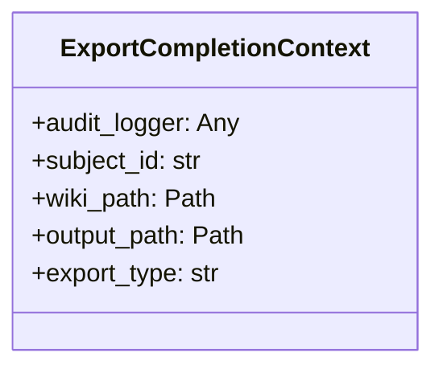

# File: `src/local_deepwiki/handlers/core.py`

## File Overview

This file contains the core tool handlers for the Local DeepWiki system, implementing the primary functionalities for querying, reading, searching, and exporting wiki content. These handlers are the main interface between the system's tool calling mechanism (e.g., via MCP) and the underlying services that process user requests.

The handlers are designed to be asynchronous, support role-based access control (RBAC), and integrate with audit logging for tracking operations. They validate inputs using pydantic models, interact with the wiki service and query service, and support streaming for large exports.

## Key Concepts

### Tool Handler Abstraction
Each handler function in this file corresponds to a specific tool call (e.g., `ask_question`, `read_wiki_page`, `export_wiki_pdf`). This abstraction allows the system to map user tool requests to specific operations, encapsulating the logic for validation, service interaction, and result formatting.

### RBAC Enforcement
All handlers enforce role-based access control using `get_access_controller()` and `require_permission()`. This ensures that only users with appropriate permissions (e.g., `QUERY_SEARCH`, `INDEX_READ`, `EXPORT_HTML`) can execute specific operations, aligning with security policies.

### Audit Logging
The handlers utilize `get_audit_logger()` to log query and export operations. This includes tracking operation start and completion, duration, subject ID, and relevant metadata. The `ExportCompletionContext` class is used to bundle audit parameters for cleaner function signatures.

### Input Validation and Error Handling
All handlers validate their inputs using pydantic models ([`AskQuestionArgs`](../models/tool_args.md), [`ReadWikiPageArgs`](../models/tool_args.md), etc.). Errors are caught and re-raised as `ValueError` for consistent error propagation. The `_error_handling` module is used for additional error handling logic, although it's not directly called in this file.

### Streaming for Large Exports
The HTML and PDF export handlers (`handle_export_wiki_html`, `handle_export_wiki_pdf`) use [`WikiPageIterator`](../export/streaming.md) to determine if streaming is needed for large wikis. This allows efficient handling of large exports without memory issues.

### Query Service Integration
The `handle_ask_question` and `handle_search_code` handlers interact with [`QueryService`](../services/query_service.md) to perform semantic searches and question answering. They set up the necessary components (vector store, LLM provider) based on configuration and index status.

## Integration

### With the Larger Codebase

This file is a central part of the tool handler layer, called by the main server or service orchestrator (e.g., `wiki_service`, `test_handlers_wiki_ops`, `test_server_handlers`, `test_handlers_research_export`). It integrates deeply with:

- **Configuration**: Uses `get_config()` to fetch system-wide settings.
- **[Wiki Service](../services/wiki_service.md)**: Interacts with [`WikiService`](../services/wiki_service.md) for reading structure and pages.
- **[Query Service](../services/query_service.md)**: Uses [`QueryService`](../services/query_service.md) for semantic search and question answering.
- **Export Services**: Integrates with [`export_to_html`](../export/html.md) and [`export_to_pdf`](../export/pdf_sync.md) for content generation.
- **Security**: Relies on `get_access_controller()` for RBAC enforcement.
- **Audit Logging**: Uses `get_audit_logger()` for logging operations.
- **Error Handling**: Leverages [`handle_tool_errors`](_error_handling.md) for consistent error management.

### External Dependencies

- **pydantic**: For input validation.
- **MCP Types**: For constructing `TextContent` responses.
- **Local DeepWiki Modules**: Including `core.audit`, `errors`, `models`, `providers`, `services`, `export`, and `validation`.

## Design Notes

### Why Asynchronous Handlers
The handlers are defined as `async def` to support concurrent processing, especially for I/O-bound operations like querying vector stores or reading files from disk. This design choice improves performance and responsiveness under load.

### Why pydantic Validation
Using pydantic models for input validation ensures type safety and provides clear error messages when invalid inputs are provided. It also integrates well with the tool calling interface, where arguments are passed as dictionaries.

### Why Modular Export Logic
The export handlers (`handle_export_wiki_html`, `handle_export_wiki_pdf`) separate concerns by:
1. Validating inputs and resolving paths.
2. Logging the start of the export.
3. Using [`WikiPageIterator`](../export/streaming.md) to determine if streaming is needed.
4. Delegating to [`export_to_html`](../export/html.md) or [`export_to_pdf`](../export/pdf_sync.md).
5. Logging completion with statistics.

This modular approach allows for easy extension and testing of export logic.

### Why Streaming for Large Exports
The [`WikiPageIterator`](../export/streaming.md) is used to determine if streaming is needed based on the number of pages and total size. This prevents memory exhaustion when exporting large wikis, demonstrating a thoughtful approach to resource management.

### Audit Logging Granularity
The audit logging includes both `started` and `completed` operations with metadata like duration, pages exported, and success status. This provides a comprehensive audit trail for monitoring system usage and performance. The `ExportCompletionContext` class reduces parameter count in `_audit_export_completed`.

### Input Size Limits (CWE-400 Prevention)
Handlers like `handle_ask_question` and `handle_search_code` call [`validate_query_parameters`](../validation.md) to prevent denial-of-service attacks by limiting input size. This is a security best practice to avoid resource exhaustion.

### Handling Anonymous Users
When no subject is found (e.g., in anonymous access scenarios), the `subject_id` is set to `"anonymous"` for audit logging. This ensures that all operations are logged with a valid identifier.

## API Reference

### class `ExportCompletionContext`

Immutable context for audit-logging an export completion.  Bundles the parameters of _audit_export_completed to reduce its parameter count.

---


<details>
<summary>View Source (lines 50-61) | <a href="https://github.com/UrbanDiver/local-deepwiki-mcp/blob/main/src/local_deepwiki/handlers/core.py#L50-L61">GitHub</a></summary>

```python
class ExportCompletionContext:
    """Immutable context for audit-logging an export completion.

    Bundles the parameters of _audit_export_completed to reduce its
    parameter count.
    """

    audit_logger: Any
    subject_id: str
    wiki_path: Path
    output_path: Path
    export_type: str
```

</details>

### Functions

#### `handle_ask_question`

`@handle_tool_errors`

```python
async def handle_ask_question(args: dict[str, Any]) -> list[TextContent]
```

Handle ask_question tool call.


| Parameter | Type | Default | Description |
|-----------|------|---------|-------------|
| `args` | `dict[str, Any]` | - | - |

**Returns:** `list[TextContent]`


<details>
<summary>View Source (lines 89-156) | <a href="https://github.com/UrbanDiver/local-deepwiki-mcp/blob/main/src/local_deepwiki/handlers/core.py#L89-L156">GitHub</a></summary>

```python
async def handle_ask_question(args: dict[str, Any]) -> list[TextContent]:
    """Handle ask_question tool call."""
    # RBAC check - behavior depends on controller mode (disabled/permissive/enforced)
    controller = get_access_controller()
    controller.require_permission(Permission.QUERY_SEARCH)

    # Validate with Pydantic
    try:
        validated = AskQuestionArgs.model_validate(args)
    except PydanticValidationError as e:
        raise ValueError(str(e)) from e

    repo_path = Path(validated.repo_path).resolve()
    question = validated.question
    max_context = validated.max_context

    # Validate input size limits (CWE-400 prevention)
    validate_query_parameters(question, str(repo_path), max_context)

    # Get subject ID for audit logging
    subject = controller.get_current_subject()
    subject_id = subject.identifier if subject else "anonymous"
    audit_logger = get_audit_logger()
    start_time = time.time()

    logger.info("Question about %s: %s...", repo_path, question[:100])

    _index_status, wiki_path, config = await _load_index_status(repo_path)
    vector_store = _create_vector_store(repo_path, config)

    llm = ProviderFactory.create_cached_llm_provider(
        cache_path=wiki_path / "llm_cache.lance",
        embedding_provider=get_embedding_provider(config.embedding),
        cache_config=config.llm_cache,
        llm_config=config.llm,
    )

    from local_deepwiki.services.query_service import QuestionRequest, QueryService

    svc = QueryService(vector_store, llm, config)
    query_result = await svc.answer_question(
        QuestionRequest(
            repo_path=repo_path,
            question=question,
            max_context=max_context,
            agentic_rag=validated.agentic_rag,
            wiki_path=wiki_path,
            debug=validated.debug,
        )
    )

    result = _build_ask_question_result(question, query_result)

    duration_ms = int((time.time() - start_time) * 1000)
    audit_logger.log_query(
        QueryAuditParams(
            subject_id=subject_id,
            repo_path=str(repo_path),
            query=question,
            success=True,
            query_type="ask_question",
            chunks_returned=len(query_result.sources),
            duration_ms=duration_ms,
        )
    )

    logger.info("Generated answer with %s sources", len(query_result.sources))
    return make_tool_text_content("ask_question", result)
```

</details>

#### `handle_read_wiki_structure`

`@handle_tool_errors`

```python
async def handle_read_wiki_structure(args: dict[str, Any]) -> list[TextContent]
```

Handle read_wiki_structure tool call.


| Parameter | Type | Default | Description |
|-----------|------|---------|-------------|
| `args` | `dict[str, Any]` | - | - |

**Returns:** `list[TextContent]`


<details>
<summary>View Source (lines 160-178) | <a href="https://github.com/UrbanDiver/local-deepwiki-mcp/blob/main/src/local_deepwiki/handlers/core.py#L160-L178">GitHub</a></summary>

```python
async def handle_read_wiki_structure(args: dict[str, Any]) -> list[TextContent]:
    """Handle read_wiki_structure tool call."""
    # RBAC check - behavior depends on controller mode (disabled/permissive/enforced)
    controller = get_access_controller()
    controller.require_permission(Permission.INDEX_READ)

    # Validate with Pydantic
    try:
        validated = ReadWikiStructureArgs.model_validate(args)
    except PydanticValidationError as e:
        raise ValueError(str(e)) from e

    wiki_path = Path(validated.wiki_path).resolve()

    from local_deepwiki.services.wiki_service import WikiService

    svc = WikiService(get_config())
    structure = await svc.read_structure(wiki_path)
    return make_tool_text_content("read_wiki_structure", structure)
```

</details>

#### `handle_read_wiki_page`

`@handle_tool_errors`

```python
async def handle_read_wiki_page(args: dict[str, Any]) -> list[TextContent]
```

Handle read_wiki_page tool call.


| Parameter | Type | Default | Description |
|-----------|------|---------|-------------|
| `args` | `dict[str, Any]` | - | - |

**Returns:** `list[TextContent]`


<details>
<summary>View Source (lines 182-200) | <a href="https://github.com/UrbanDiver/local-deepwiki-mcp/blob/main/src/local_deepwiki/handlers/core.py#L182-L200">GitHub</a></summary>

```python
async def handle_read_wiki_page(args: dict[str, Any]) -> list[TextContent]:
    """Handle read_wiki_page tool call."""
    # RBAC check - behavior depends on controller mode (disabled/permissive/enforced)
    controller = get_access_controller()
    controller.require_permission(Permission.INDEX_READ)

    # Validate with Pydantic
    try:
        validated = ReadWikiPageArgs.model_validate(args)
    except PydanticValidationError as e:
        raise ValueError(str(e)) from e

    wiki_path = Path(validated.wiki_path).resolve()

    from local_deepwiki.services.wiki_service import WikiService

    svc = WikiService(get_config())
    content = await svc.read_page(wiki_path, validated.page)
    return [TextContent(type="text", text=content)]
```

</details>

#### `handle_search_code`

`@handle_tool_errors`

```python
async def handle_search_code(args: dict[str, Any]) -> list[TextContent]
```

Handle search_code tool call.  Supports both vector similarity search and optional fuzzy matching, with filters for language, chunk type, and file path patterns.


| Parameter | Type | Default | Description |
|-----------|------|---------|-------------|
| `args` | `dict[str, Any]` | - | - |

**Returns:** `list[TextContent]`


<details>
<summary>View Source (lines 204-257) | <a href="https://github.com/UrbanDiver/local-deepwiki-mcp/blob/main/src/local_deepwiki/handlers/core.py#L204-L257">GitHub</a></summary>

```python
async def handle_search_code(args: dict[str, Any]) -> list[TextContent]:
    """Handle search_code tool call.

    Supports both vector similarity search and optional fuzzy matching,
    with filters for language, chunk type, and file path patterns.
    """
    # RBAC check - behavior depends on controller mode (disabled/permissive/enforced)
    controller = get_access_controller()
    controller.require_permission(Permission.QUERY_SEARCH)

    # Validate with Pydantic
    try:
        validated = SearchCodeArgs.model_validate(args)
    except PydanticValidationError as e:
        raise ValueError(str(e)) from e

    repo_path = Path(validated.repo_path).resolve()
    query = validated.query
    language = validate_language(validated.language)
    chunk_type = validate_chunk_type(validated.type)
    path_pattern = validate_path_pattern(validated.path)

    logger.info("Code search in %s: %s...", repo_path, query[:50])

    _index_status, _wiki_path, config = await _load_index_status(repo_path)
    vector_store = _create_vector_store(repo_path, config)

    from local_deepwiki.services.query_service import CodeSearchRequest, QueryService

    svc = QueryService(vector_store, None, config)  # type: ignore[arg-type]
    results = await svc.search_code(
        CodeSearchRequest(
            repo_path=repo_path,
            query=query,
            limit=validated.limit,
            language=language,
            chunk_type=chunk_type,
            path_filter=path_pattern,
            use_fuzzy=validated.fuzzy,
            fuzzy_weight=validated.fuzzy_weight,
        )
    )

    logger.info("Search returned %s results", len(results))
    if not results:
        return make_tool_text_content(
            "search_code",
            {"message": "No results found.", "total_results": 0, "results": []},
        )

    return make_tool_text_content(
        "search_code",
        {"total_results": len(results), "results": results},
    )
```

</details>

#### `handle_export_wiki_html`

`@handle_tool_errors`

```python
async def handle_export_wiki_html(args: dict[str, Any]) -> list[TextContent]
```

Handle export_wiki_html tool call with streaming support for large wikis.


| Parameter | Type | Default | Description |
|-----------|------|---------|-------------|
| `args` | `dict[str, Any]` | - | - |

**Returns:** `list[TextContent]`


<details>
<summary>View Source (lines 301-374) | <a href="https://github.com/UrbanDiver/local-deepwiki-mcp/blob/main/src/local_deepwiki/handlers/core.py#L301-L374">GitHub</a></summary>

```python
async def handle_export_wiki_html(args: dict[str, Any]) -> list[TextContent]:
    """Handle export_wiki_html tool call with streaming support for large wikis."""
    controller = get_access_controller()
    controller.require_permission(Permission.EXPORT_HTML)

    from local_deepwiki.export.html import export_to_html
    from local_deepwiki.export.streaming import WikiPageIterator

    try:
        validated = ExportWikiHtmlArgs.model_validate(args)
    except PydanticValidationError as e:
        raise ValueError(str(e)) from e

    wiki_path = Path(validated.wiki_path).resolve()
    if not wiki_path.exists():
        raise path_not_found_error(str(wiki_path), "wiki")

    raw_output = validated.output_path
    resolved_output = (
        _validate_export_path(Path(raw_output), wiki_path)
        if raw_output
        else _validate_export_path(
            wiki_path.parent / f"{wiki_path.name}_html", wiki_path
        )
    )

    subject = controller.get_current_subject()
    subject_id = subject.identifier if subject else "anonymous"
    audit_logger = get_audit_logger()
    start_time = time.time()

    _audit_export_started(audit_logger, subject_id, wiki_path, resolved_output, "html")

    export_ctx = ExportCompletionContext(
        audit_logger=audit_logger,
        subject_id=subject_id,
        wiki_path=wiki_path,
        output_path=resolved_output,
        export_type="html",
    )

    iterator = WikiPageIterator(wiki_path)
    page_count = iterator.get_page_count()
    total_size_mb = iterator.get_total_size_bytes() / (1024 * 1024)
    use_streaming = iterator.should_use_streaming()
    logger.info(
        "Wiki export: %d pages, %.2fMB, streaming: %s",
        page_count,
        total_size_mb,
        use_streaming,
    )

    result = export_to_html(wiki_path, resolved_output)

    _audit_export_completed(
        export_ctx,
        page_count,
        int((time.time() - start_time) * 1000),
    )

    return make_tool_text_content(
        "export_wiki_html",
        {
            "status": "success",
            "message": result,
            "output_path": str(resolved_output),
            "open_with": f"open {resolved_output}/index.html",
            "stats": {
                "pages_exported": page_count,
                "total_size_mb": round(total_size_mb, 2),
                "streaming_mode": use_streaming,
            },
        },
    )
```

</details>

#### `handle_export_wiki_pdf`

`@handle_tool_errors`

```python
async def handle_export_wiki_pdf(args: dict[str, Any]) -> list[TextContent]
```

Handle export_wiki_pdf tool call with streaming support for large wikis.


| Parameter | Type | Default | Description |
|-----------|------|---------|-------------|
| `args` | `dict[str, Any]` | - | - |

**Returns:** `list[TextContent]`


<details>
<summary>View Source (lines 378-453) | <a href="https://github.com/UrbanDiver/local-deepwiki-mcp/blob/main/src/local_deepwiki/handlers/core.py#L378-L453">GitHub</a></summary>

```python
async def handle_export_wiki_pdf(args: dict[str, Any]) -> list[TextContent]:
    """Handle export_wiki_pdf tool call with streaming support for large wikis."""
    controller = get_access_controller()
    controller.require_permission(Permission.EXPORT_PDF)

    from local_deepwiki.export.pdf import export_to_pdf
    from local_deepwiki.export.streaming import WikiPageIterator

    try:
        validated = ExportWikiPdfArgs.model_validate(args)
    except PydanticValidationError as e:
        raise ValueError(str(e)) from e

    wiki_path = Path(validated.wiki_path).resolve()
    single_file = validated.single_file
    if not wiki_path.exists():
        raise path_not_found_error(str(wiki_path), "wiki")

    raw_output = validated.output_path
    if raw_output:
        resolved_output = _validate_export_path(Path(raw_output), wiki_path)
    else:
        default_path = (
            wiki_path.parent / f"{wiki_path.name}.pdf"
            if single_file
            else wiki_path.parent / f"{wiki_path.name}_pdfs"
        )
        resolved_output = _validate_export_path(default_path, wiki_path)

    subject = controller.get_current_subject()
    subject_id = subject.identifier if subject else "anonymous"
    audit_logger = get_audit_logger()
    start_time = time.time()

    _audit_export_started(audit_logger, subject_id, wiki_path, resolved_output, "pdf")

    export_ctx = ExportCompletionContext(
        audit_logger=audit_logger,
        subject_id=subject_id,
        wiki_path=wiki_path,
        output_path=resolved_output,
        export_type="pdf",
    )

    iterator = WikiPageIterator(wiki_path)
    page_count = iterator.get_page_count()
    total_size_mb = iterator.get_total_size_bytes() / (1024 * 1024)
    use_streaming = iterator.should_use_streaming()
    logger.info(
        "PDF export: %d pages, %.2fMB, streaming: %s",
        page_count,
        total_size_mb,
        use_streaming,
    )

    result = export_to_pdf(wiki_path, resolved_output, single_file=single_file)

    _audit_export_completed(
        export_ctx,
        page_count,
        int((time.time() - start_time) * 1000),
    )

    return make_tool_text_content(
        "export_wiki_pdf",
        {
            "status": "success",
            "message": result,
            "output_path": str(resolved_output),
            "stats": {
                "pages_exported": page_count,
                "total_size_mb": round(total_size_mb, 2),
                "streaming_mode": use_streaming,
            },
        },
    )
```

</details>

## Class Diagram



## Call Graph

```mermaid
flowchart TD
    N0[ExportAuditParams]
    N1[ExportCompletionContext]
    N2[Path]
    N3[QueryService]
    N4[ValueError]
    N5[WikiPageIterator]
    N6[WikiService]
    N7[_audit_export_completed]
    N8[_audit_export_started]
    N9[_create_vector_store]
    N10[_load_index_status]
    N11[_validate_export_path]
    N12[exists]
    N13[get_access_controller]
    N14[get_audit_logger]
    N15[get_config]
    N16[get_current_subject]
    N17[handle_ask_question]
    N18[handle_export_wiki_html]
    N19[handle_export_wiki_pdf]
    N20[handle_read_wiki_page]
    N21[handle_read_wiki_structure]
    N22[handle_search_code]
    N23[log_export]
    N24[make_tool_text_content]
    N25[model_validate]
    N26[path_not_found_error]
    N27[require_permission]
    N28[resolve]
    N29[time]
    N17 --> N13
    N17 --> N27
    N17 --> N25
    N17 --> N4
    N17 --> N28
    N17 --> N2
    N17 --> N16
    N17 --> N14
    N17 --> N29
    N17 --> N10
    N17 --> N9
    N17 --> N3
    N17 --> N24
    N21 --> N13
    N21 --> N27
    N21 --> N25
    N21 --> N4
    N21 --> N28
    N21 --> N2
    N21 --> N6
    N21 --> N15
    N21 --> N24
    N20 --> N13
    N20 --> N27
    N20 --> N25
    N20 --> N4
    N20 --> N28
    N20 --> N2
    N20 --> N6
    N20 --> N15
    N22 --> N13
    N22 --> N27
    N22 --> N25
    N22 --> N4
    N22 --> N28
    N22 --> N2
    N22 --> N10
    N22 --> N9
    N22 --> N3
    N22 --> N24
    N8 --> N23
    N8 --> N0
    N7 --> N23
    N7 --> N0
    N18 --> N13
    N18 --> N27
    N18 --> N25
    N18 --> N4
    N18 --> N28
    N18 --> N2
    N18 --> N12
    N18 --> N26
    N18 --> N11
    N18 --> N16
    N18 --> N14
    N18 --> N29
    N18 --> N8
    N18 --> N1
    N18 --> N5
    N18 --> N7
    N18 --> N24
    N19 --> N13
    N19 --> N27
    N19 --> N25
    N19 --> N4
    N19 --> N28
    N19 --> N2
    N19 --> N12
    N19 --> N26
    N19 --> N11
    N19 --> N16
    N19 --> N14
    N19 --> N29
    N19 --> N8
    N19 --> N1
    N19 --> N5
    N19 --> N7
    N19 --> N24
    classDef func fill:#e1f5fe
    class N0,N1,N2,N3,N4,N5,N6,N7,N8,N9,N10,N11,N12,N13,N14,N15,N16,N17,N18,N19,N20,N21,N22,N23,N24,N25,N26,N27,N28,N29 func
```



## Used By

Functions and methods in this file and their callers:

- **[`CodeSearchRequest`](../services/query_service.md)**: called by `handle_search_code`
- **[`ExportAuditParams`](../core/audit.md)**: called by `_audit_export_completed`, `_audit_export_started`
- **`ExportCompletionContext`**: called by `handle_export_wiki_html`, `handle_export_wiki_pdf`
- **`Path`**: called by `handle_ask_question`, `handle_export_wiki_html`, `handle_export_wiki_pdf`, `handle_read_wiki_page`, `handle_read_wiki_structure`, `handle_search_code`
- **[`QueryAuditParams`](../core/audit.md)**: called by `handle_ask_question`
- **[`QueryService`](../services/query_service.md)**: called by `handle_ask_question`, `handle_search_code`
- **[`QuestionRequest`](../services/query_service.md)**: called by `handle_ask_question`
- **`TextContent`**: called by `handle_read_wiki_page`
- **`ValueError`**: called by `handle_ask_question`, `handle_export_wiki_html`, `handle_export_wiki_pdf`, `handle_read_wiki_page`, `handle_read_wiki_structure`, `handle_search_code`
- **[`WikiPageIterator`](../export/streaming.md)**: called by `handle_export_wiki_html`, `handle_export_wiki_pdf`
- **[`WikiService`](../services/wiki_service.md)**: called by `handle_read_wiki_page`, `handle_read_wiki_structure`
- **`_audit_export_completed`**: called by `handle_export_wiki_html`, `handle_export_wiki_pdf`
- **`_audit_export_started`**: called by `handle_export_wiki_html`, `handle_export_wiki_pdf`
- **`_build_ask_question_result`**: called by `handle_ask_question`
- **`_create_vector_store`**: called by `handle_ask_question`, `handle_search_code`
- **`_load_index_status`**: called by `handle_ask_question`, `handle_search_code`
- **`_validate_export_path`**: called by `handle_export_wiki_html`, `handle_export_wiki_pdf`
- **`answer_question`**: called by `handle_ask_question`
- **`create_cached_llm_provider`**: called by `handle_ask_question`
- **`exists`**: called by `handle_export_wiki_html`, `handle_export_wiki_pdf`
- **[`export_to_html`](../export/html.md)**: called by `handle_export_wiki_html`
- **[`export_to_pdf`](../export/pdf_sync.md)**: called by `handle_export_wiki_pdf`
- **[`get_access_controller`](../security/access_control.md)**: called by `handle_ask_question`, `handle_export_wiki_html`, `handle_export_wiki_pdf`, `handle_read_wiki_page`, `handle_read_wiki_structure`, `handle_search_code`
- **[`get_audit_logger`](../core/audit.md)**: called by `handle_ask_question`, `handle_export_wiki_html`, `handle_export_wiki_pdf`
- **[`get_config`](../config/loader.md)**: called by `handle_read_wiki_page`, `handle_read_wiki_structure`
- **`get_current_subject`**: called by `handle_ask_question`, `handle_export_wiki_html`, `handle_export_wiki_pdf`
- **`get_embedding_provider`**: called by `handle_ask_question`
- **`get_page_count`**: called by `handle_export_wiki_html`, `handle_export_wiki_pdf`
- **`get_total_size_bytes`**: called by `handle_export_wiki_html`, `handle_export_wiki_pdf`
- **`log_export`**: called by `_audit_export_completed`, `_audit_export_started`
- **`log_query`**: called by `handle_ask_question`
- **[`make_tool_text_content`](_response.md)**: called by `handle_ask_question`, `handle_export_wiki_html`, `handle_export_wiki_pdf`, `handle_read_wiki_structure`, `handle_search_code`
- **`model_validate`**: called by `handle_ask_question`, `handle_export_wiki_html`, `handle_export_wiki_pdf`, `handle_read_wiki_page`, `handle_read_wiki_structure`, `handle_search_code`
- **[`path_not_found_error`](../error_factories.md)**: called by `handle_export_wiki_html`, `handle_export_wiki_pdf`
- **`read_page`**: called by `handle_read_wiki_page`
- **`read_structure`**: called by `handle_read_wiki_structure`
- **[`require_permission`](../security/access_control.md)**: called by `handle_ask_question`, `handle_export_wiki_html`, `handle_export_wiki_pdf`, `handle_read_wiki_page`, `handle_read_wiki_structure`, `handle_search_code`
- **`resolve`**: called by `handle_ask_question`, `handle_export_wiki_html`, `handle_export_wiki_pdf`, `handle_read_wiki_page`, `handle_read_wiki_structure`, `handle_search_code`
- **`search_code`**: called by `handle_search_code`
- **`should_use_streaming`**: called by `handle_export_wiki_html`, `handle_export_wiki_pdf`
- **`time`**: called by `handle_ask_question`, `handle_export_wiki_html`, `handle_export_wiki_pdf`
- **[`validate_chunk_type`](../validation.md)**: called by `handle_search_code`
- **[`validate_language`](../validation.md)**: called by `handle_search_code`
- **[`validate_path_pattern`](../validation.md)**: called by `handle_search_code`
- **[`validate_query_parameters`](../validation.md)**: called by `handle_ask_question`

## Last Modified

| Entity | Type | Author | Date | Commit |
|--------|------|--------|------|--------|
| `ExportCompletionContext` | class | Brian Breidenbach | yesterday | `1eef062` refactor: complete Grade A ... |
| `handle_ask_question` | function | Brian Breidenbach | yesterday | `1eef062` refactor: complete Grade A ... |
| `handle_search_code` | function | Brian Breidenbach | yesterday | `1eef062` refactor: complete Grade A ... |
| `_audit_export_started` | function | Brian Breidenbach | yesterday | `1eef062` refactor: complete Grade A ... |
| `_audit_export_completed` | function | Brian Breidenbach | yesterday | `1eef062` refactor: complete Grade A ... |
| `handle_export_wiki_html` | function | Brian Breidenbach | yesterday | `1eef062` refactor: complete Grade A ... |
| `handle_export_wiki_pdf` | function | Brian Breidenbach | yesterday | `1eef062` refactor: complete Grade A ... |
| `_build_ask_question_result` | function | Brian Breidenbach | 2 days ago | `29ae780` refactor: decompose long me... |
| `handle_read_wiki_structure` | function | Brian Breidenbach | 2 weeks ago | `8203fe8` feat: add service layer, hy... |
| `handle_read_wiki_page` | function | Brian Breidenbach | 2 weeks ago | `8203fe8` feat: add service layer, hy... |

## Additional Source Code

Source code for functions and methods not listed in the API Reference above.

#### `_build_ask_question_result`

<details>
<summary>View Source (lines 64-85) | <a href="https://github.com/UrbanDiver/local-deepwiki-mcp/blob/main/src/local_deepwiki/handlers/core.py#L64-L85">GitHub</a></summary>

```python
def _build_ask_question_result(question: str, query_result: Any) -> dict[str, Any]:
    """Convert a QueryResult to the ask_question response dict."""
    sources = [
        {
            "file": s.file,
            "lines": s.lines,
            "type": s.chunk_type,
            "score": s.score,
            **({"wiki_resource": s.wiki_resource} if s.wiki_resource else {}),
        }
        for s in query_result.sources
    ]
    result: dict[str, Any] = {
        "question": question,
        "answer": query_result.answer,
        "sources": sources,
    }
    if query_result.agentic_metadata is not None:
        result["agentic_rag"] = query_result.agentic_metadata
    if query_result.trace is not None:
        result["_trace"] = query_result.trace
    return result
```

</details>


#### `_audit_export_started`

<details>
<summary>View Source (lines 260-277) | <a href="https://github.com/UrbanDiver/local-deepwiki-mcp/blob/main/src/local_deepwiki/handlers/core.py#L260-L277">GitHub</a></summary>

```python
def _audit_export_started(
    audit_logger: Any,
    subject_id: str,
    wiki_path: Path,
    output_path: Path,
    export_type: str,
) -> None:
    """Log the start of an export operation."""
    audit_logger.log_export(
        ExportAuditParams(
            subject_id=subject_id,
            wiki_path=str(wiki_path),
            output_path=str(output_path),
            export_type=export_type,
            operation="started",
            success=True,
        )
    )
```

</details>


#### `_audit_export_completed`

<details>
<summary>View Source (lines 280-297) | <a href="https://github.com/UrbanDiver/local-deepwiki-mcp/blob/main/src/local_deepwiki/handlers/core.py#L280-L297">GitHub</a></summary>

```python
def _audit_export_completed(
    ctx: ExportCompletionContext,
    page_count: int,
    duration_ms: int,
) -> None:
    """Log the completion of an export operation."""
    ctx.audit_logger.log_export(
        ExportAuditParams(
            subject_id=ctx.subject_id,
            wiki_path=str(ctx.wiki_path),
            output_path=str(ctx.output_path),
            export_type=ctx.export_type,
            operation="completed",
            success=True,
            pages_exported=page_count,
            duration_ms=duration_ms,
        )
    )
```

</details>

## Relevant Source Files

- `src/local_deepwiki/handlers/core.py:50-61`
