# File: `src/local_deepwiki/handlers/generators.py`

## File Overview

This file contains the handler functions for various tool calls related to code documentation and analysis. These tools generate diagrams, glossaries, call graphs, coverage reports, and other insights from code repositories. The handlers are responsible for validating inputs, ensuring access permissions, and delegating to the [`GeneratorService`](../services/generator_service.md) for actual processing.

The module is designed to be used as part of a larger system (likely a tooling or LLM agent interface) that allows users to query code repositories for various forms of documentation and analysis. Each handler function corresponds to a specific tool and encapsulates the logic required to process a tool call request.

## Key Concepts

### Generator Service Abstraction
The core of this module is the [`GeneratorService`](../services/generator_service.md) class, which encapsulates the logic for generating various types of documentation and analysis. The service is initialized with a vector store (used for semantic search) and a configuration, and it provides methods for generating glossaries, diagrams, call graphs, etc.

### Permission Management
All handlers require permission checks before proceeding. This is enforced using the `get_access_controller()` and `require_permission()` methods, which ensure that only users with appropriate permissions (e.g., `INDEX_READ`, `QUERY_SEARCH`) can execute the tools.

### Input Validation
Each handler validates its input arguments using pydantic models ([`GetGlossaryArgs`](../models/tool_args.md), [`GetDiagramsArgs`](../models/tool_args.md), etc.). This ensures that the arguments passed to the tool are well-formed and adhere to expected types and constraints. If validation fails, a `ValueError` is raised.

### Asynchronous Execution
All handler functions are `async` and use `await` when calling service methods or performing I/O operations. This allows for concurrent execution when multiple tool calls are made.

### Error Handling
Errors are handled using the [`handle_tool_errors`](_error_handling.md) utility, which provides consistent error formatting and propagation for tool execution failures.

### Index Status Loading
Handlers that require indexing information use `_load_index_status` to retrieve the index status and related metadata for a repository. This is crucial for tools that depend on an indexed codebase.

## Integration

### Usage Context
This module is used by the tooling system to process requests for documentation and analysis. Based on the provided context, the functions in this file are called from `handle_detect_secrets`, which suggests that this module is part of a larger command-line interface or agent that orchestrates tool execution.

### Dependencies
The module relies on several core components:
- [`GeneratorService`](../services/generator_service.md) from `local_deepwiki.services.generator_service` for the actual generation logic.
- `_create_vector_store` and `_load_index_status` from `local_deepwiki.handlers._index_helpers` for index management.
- pydantic models for input validation.
- [`make_tool_text_content`](_response.md) from `local_deepwiki.handlers._response` for constructing tool outputs.
- [`get_access_controller`](../security/access_control.md) from `local_deepwiki.security` for permission enforcement.

### External Usage
The functions in this module are designed to be called by a tool execution framework (possibly an LLM agent or CLI command handler). The specific function `handle_detect_secrets` is noted as calling into this module, indicating that this module is part of a broader system that supports tool-based interactions.

## Design Notes

### Why `GeneratorService` is Used
The [`GeneratorService`](../services/generator_service.md) is used to encapsulate the logic for generating various types of documentation and analysis. This abstraction allows for clean separation between the handler logic (which deals with inputs, permissions, and outputs) and the core generation logic. It also allows for reuse of components like the vector store and configuration.

### Why `_build_generator_service` is Used
The `_build_generator_service` helper function centralizes the logic for creating a [`GeneratorService`](../services/generator_service.md) instance with the appropriate vector store. This simplifies the handler functions and ensures consistency in how the service is initialized.

### Why `__new__` is Used for Some Services
Some handlers (e.g., `handle_get_changelog`, `handle_detect_secrets`, `handle_get_api_docs`, `handle_list_indexed_repos`, `handle_get_index_status`) use `GeneratorService.__new__(GeneratorService)` to create an instance without calling `__init__`. This is likely because these specific service methods do not require the vector store or other initialization that would normally occur in `__init__`, and they may use different or simpler initialization paths.

### Why Input Validation is Done with pydantic
pydantic models are used for input validation because they provide a clean and declarative way to define expected input types and constraints. This also integrates well with error handling and provides rich error messages when validation fails.

### Why `make_tool_text_content` is Used
The [`make_tool_text_content`](_response.md) function is used to wrap the results in a standard format (`list[TextContent]`) that is expected by the tooling framework. This ensures consistency in how tool outputs are structured.

### Asynchronous Design Choice
The handlers are implemented as `async` functions to allow for concurrent execution of tool calls, especially important when dealing with I/O-bound operations like file reading, network requests, or database queries. This is particularly relevant for tools that interact with repositories or external services.

### Permission Checks
All handlers perform permission checks to ensure that only authorized users can access certain tools. This is important for security, especially for tools that might expose sensitive information or perform operations that could be misused.

### Logging
Each handler includes logging statements to provide visibility into tool execution, including counts of entities processed, success/failure information, and other metrics. This is important for debugging and monitoring tool usage.

### Error Handling Strategy
The module uses [`handle_tool_errors`](_error_handling.md) to manage errors, which likely provides consistent formatting and propagation of errors. This ensures that errors are handled in a uniform way across all tools.

### Handling of Optional Inputs
Some tools (e.g., `handle_get_call_graph`) handle optional inputs like `file_path` differently. If a `file_path` is provided, the tool extracts the call graph for that specific file; otherwise, it uses the full index for analysis. This allows for both granular and comprehensive analysis depending on the user's needs.

## API Reference

### Functions

#### `handle_get_glossary`

`@handle_tool_errors`

```python
async def handle_get_glossary(args: dict[str, Any]) -> list[TextContent]
```

Handle get_glossary tool call.


| Parameter | Type | Default | Description |
|-----------|------|---------|-------------|
| `args` | `dict[str, Any]` | - | - |

**Returns:** `list[TextContent]`


<details>
<summary>View Source (lines 51-83) | <a href="https://github.com/UrbanDiver/local-deepwiki-mcp/blob/main/src/local_deepwiki/handlers/generators.py#L51-L83">GitHub</a></summary>

```python
async def handle_get_glossary(args: dict[str, Any]) -> list[TextContent]:
    """Handle get_glossary tool call."""
    controller = get_access_controller()
    controller.require_permission(Permission.INDEX_READ)

    try:
        validated = GetGlossaryArgs.model_validate(args)
    except PydanticValidationError as e:
        raise ValueError(str(e)) from e

    repo_path = Path(validated.repo_path).resolve()

    if not repo_path.exists():
        raise path_not_found_error(str(repo_path), "repository")

    index_status, _wiki_path, config = await _load_index_status(repo_path)
    svc = _build_generator_service(repo_path, config)

    result = await svc.generate_glossary(
        index_status,
        search=validated.search,
        file_path=validated.file_path,
        offset=validated.offset,
        limit=validated.limit,
    )

    logger.info(
        "Glossary: %s/%s entities for %s",
        result.get("returned", 0),
        result.get("total_entities", 0),
        repo_path,
    )
    return make_tool_text_content("get_glossary", result)
```

</details>

#### `handle_get_diagrams`

`@handle_tool_errors`

```python
async def handle_get_diagrams(args: dict[str, Any]) -> list[TextContent]
```

Handle get_diagrams tool call.


| Parameter | Type | Default | Description |
|-----------|------|---------|-------------|
| `args` | `dict[str, Any]` | - | - |

**Returns:** `list[TextContent]`


<details>
<summary>View Source (lines 87-113) | <a href="https://github.com/UrbanDiver/local-deepwiki-mcp/blob/main/src/local_deepwiki/handlers/generators.py#L87-L113">GitHub</a></summary>

```python
async def handle_get_diagrams(args: dict[str, Any]) -> list[TextContent]:
    """Handle get_diagrams tool call."""
    controller = get_access_controller()
    controller.require_permission(Permission.INDEX_READ)

    try:
        validated = GetDiagramsArgs.model_validate(args)
    except PydanticValidationError as e:
        raise ValueError(str(e)) from e

    repo_path = Path(validated.repo_path).resolve()

    if not repo_path.exists():
        raise path_not_found_error(str(repo_path), "repository")

    index_status, _wiki_path, config = await _load_index_status(repo_path)
    svc = _build_generator_service(repo_path, config)

    result = await svc.generate_diagrams(
        index_status,
        repo_path,
        validated.diagram_type.value,
        entry_point=validated.entry_point,
    )

    logger.info("Generated %s diagram for %s", validated.diagram_type.value, repo_path)
    return make_tool_text_content("get_diagrams", result)
```

</details>

#### `handle_get_inheritance`

`@handle_tool_errors`

```python
async def handle_get_inheritance(args: dict[str, Any]) -> list[TextContent]
```

Handle get_inheritance tool call.


| Parameter | Type | Default | Description |
|-----------|------|---------|-------------|
| `args` | `dict[str, Any]` | - | - |

**Returns:** `list[TextContent]`


<details>
<summary>View Source (lines 117-148) | <a href="https://github.com/UrbanDiver/local-deepwiki-mcp/blob/main/src/local_deepwiki/handlers/generators.py#L117-L148">GitHub</a></summary>

```python
async def handle_get_inheritance(args: dict[str, Any]) -> list[TextContent]:
    """Handle get_inheritance tool call."""
    controller = get_access_controller()
    controller.require_permission(Permission.INDEX_READ)

    try:
        validated = GetInheritanceArgs.model_validate(args)
    except PydanticValidationError as e:
        raise ValueError(str(e)) from e

    repo_path = Path(validated.repo_path).resolve()

    if not repo_path.exists():
        raise path_not_found_error(str(repo_path), "repository")

    index_status, _wiki_path, config = await _load_index_status(repo_path)
    svc = _build_generator_service(repo_path, config)

    result = await svc.generate_inheritance(
        index_status,
        search=validated.search,
        offset=validated.offset,
        limit=validated.limit,
    )

    logger.info(
        "Inheritance: %d/%d classes for %s",
        result.get("returned", 0),
        result.get("total_classes", 0),
        repo_path,
    )
    return make_tool_text_content("get_inheritance", result)
```

</details>

#### `handle_get_call_graph`

`@handle_tool_errors`

```python
async def handle_get_call_graph(args: dict[str, Any]) -> list[TextContent]
```

Handle get_call_graph tool call.


| Parameter | Type | Default | Description |
|-----------|------|---------|-------------|
| `args` | `dict[str, Any]` | - | - |

**Returns:** `list[TextContent]`


<details>
<summary>View Source (lines 152-189) | <a href="https://github.com/UrbanDiver/local-deepwiki-mcp/blob/main/src/local_deepwiki/handlers/generators.py#L152-L189">GitHub</a></summary>

```python
async def handle_get_call_graph(args: dict[str, Any]) -> list[TextContent]:
    """Handle get_call_graph tool call."""
    controller = get_access_controller()
    controller.require_permission(Permission.INDEX_READ)

    try:
        validated = GetCallGraphArgs.model_validate(args)
    except PydanticValidationError as e:
        raise ValueError(str(e)) from e

    repo_path = Path(validated.repo_path).resolve()
    file_path = validated.file_path

    if not repo_path.exists():
        raise path_not_found_error(str(repo_path), "repository")

    from local_deepwiki.generators.analysis.callgraph import (
        CallGraphExtractor,
        generate_call_graph_diagram,
    )

    extractor = CallGraphExtractor()

    if file_path:
        target = validate_file_in_repo(repo_path, file_path)
        graph = extractor.extract_from_file(target, repo_path)
        diagram = generate_call_graph_diagram(graph, title=file_path)
        if diagram is None:
            result: dict[str, Any] = {"message": "No call relationships found"}
        else:
            result = {"status": "success", "mermaid": diagram, "scope": file_path}
    else:
        index_status, _wiki_path, config = await _load_index_status(repo_path)
        svc = _build_generator_service(repo_path, config)
        result = await svc.generate_call_graph(repo_path, index_status=index_status)

    logger.info("Call graph generated for %s", file_path or repo_path)
    return make_tool_text_content("get_call_graph", result)
```

</details>

#### `handle_get_coverage`

`@handle_tool_errors`

```python
async def handle_get_coverage(args: dict[str, Any]) -> list[TextContent]
```

Handle get_coverage tool call.


| Parameter | Type | Default | Description |
|-----------|------|---------|-------------|
| `args` | `dict[str, Any]` | - | - |

**Returns:** `list[TextContent]`


<details>
<summary>View Source (lines 193-218) | <a href="https://github.com/UrbanDiver/local-deepwiki-mcp/blob/main/src/local_deepwiki/handlers/generators.py#L193-L218">GitHub</a></summary>

```python
async def handle_get_coverage(args: dict[str, Any]) -> list[TextContent]:
    """Handle get_coverage tool call."""
    controller = get_access_controller()
    controller.require_permission(Permission.INDEX_READ)

    try:
        validated = GetCoverageArgs.model_validate(args)
    except PydanticValidationError as e:
        raise ValueError(str(e)) from e

    repo_path = Path(validated.repo_path).resolve()

    if not repo_path.exists():
        raise path_not_found_error(str(repo_path), "repository")

    index_status, _wiki_path, config = await _load_index_status(repo_path)
    svc = _build_generator_service(repo_path, config)

    result = await svc.generate_coverage(index_status)

    logger.info(
        "Coverage: %.1f%% for %s",
        result.get("overall", {}).get("coverage_percent", 0),
        repo_path,
    )
    return make_tool_text_content("get_coverage", result)
```

</details>

#### `handle_detect_stale_docs`

`@handle_tool_errors`

```python
async def handle_detect_stale_docs(args: dict[str, Any]) -> list[TextContent]
```

Handle detect_stale_docs tool call.


| Parameter | Type | Default | Description |
|-----------|------|---------|-------------|
| `args` | `dict[str, Any]` | - | - |

**Returns:** `list[TextContent]`


<details>
<summary>View Source (lines 222-251) | <a href="https://github.com/UrbanDiver/local-deepwiki-mcp/blob/main/src/local_deepwiki/handlers/generators.py#L222-L251">GitHub</a></summary>

```python
async def handle_detect_stale_docs(args: dict[str, Any]) -> list[TextContent]:
    """Handle detect_stale_docs tool call."""
    controller = get_access_controller()
    controller.require_permission(Permission.INDEX_READ)

    try:
        validated = DetectStaleDocsArgs.model_validate(args)
    except PydanticValidationError as e:
        raise ValueError(str(e)) from e

    repo_path = Path(validated.repo_path).resolve()
    threshold_days = validated.threshold_days

    if not repo_path.exists():
        raise path_not_found_error(str(repo_path), "repository")

    _index_status, wiki_path, config = await _load_index_status(repo_path)
    svc = _build_generator_service(repo_path, config)

    result = await svc.detect_stale_docs(
        repo_path, wiki_path, threshold_days=validated.threshold_days
    )

    logger.info(
        "Stale detection: %d/%d stale for %s",
        result.get("stale_count", 0),
        result.get("total_pages", 0),
        repo_path,
    )
    return make_tool_text_content("detect_stale_docs", result)
```

</details>

#### `handle_get_changelog`

`@handle_tool_errors`

```python
async def handle_get_changelog(args: dict[str, Any]) -> list[TextContent]
```

Handle get_changelog tool call.


| Parameter | Type | Default | Description |
|-----------|------|---------|-------------|
| `args` | `dict[str, Any]` | - | - |

**Returns:** `list[TextContent]`


<details>
<summary>View Source (lines 255-275) | <a href="https://github.com/UrbanDiver/local-deepwiki-mcp/blob/main/src/local_deepwiki/handlers/generators.py#L255-L275">GitHub</a></summary>

```python
async def handle_get_changelog(args: dict[str, Any]) -> list[TextContent]:
    """Handle get_changelog tool call."""
    controller = get_access_controller()
    controller.require_permission(Permission.INDEX_READ)

    try:
        validated = GetChangelogArgs.model_validate(args)
    except PydanticValidationError as e:
        raise ValueError(str(e)) from e

    repo_path = Path(validated.repo_path).resolve()
    max_commits = validated.max_commits

    if not repo_path.exists():
        raise path_not_found_error(str(repo_path), "repository")

    svc = GeneratorService.__new__(GeneratorService)
    result = await svc.generate_changelog(repo_path, max_commits=max_commits)

    logger.info("Changelog generated for %s", repo_path)
    return make_tool_text_content("get_changelog", result)
```

</details>

#### `handle_detect_secrets`

`@handle_tool_errors`

```python
async def handle_detect_secrets(args: dict[str, Any]) -> list[TextContent]
```

Handle detect_secrets tool call.


| Parameter | Type | Default | Description |
|-----------|------|---------|-------------|
| `args` | `dict[str, Any]` | - | - |

**Returns:** `list[TextContent]`


<details>
<summary>View Source (lines 279-311) | <a href="https://github.com/UrbanDiver/local-deepwiki-mcp/blob/main/src/local_deepwiki/handlers/generators.py#L279-L311">GitHub</a></summary>

```python
async def handle_detect_secrets(args: dict[str, Any]) -> list[TextContent]:
    """Handle detect_secrets tool call."""
    controller = get_access_controller()
    controller.require_permission(Permission.INDEX_READ)

    try:
        validated = DetectSecretsArgs.model_validate(args)
    except PydanticValidationError as e:
        raise ValueError(str(e)) from e

    repo_path = Path(validated.repo_path).resolve()

    if not repo_path.exists():
        raise path_not_found_error(str(repo_path), "repository")

    if not repo_path.is_dir():
        raise ValidationError(
            message=f"Path is not a directory: {repo_path}",
            hint="Provide a path to a directory, not a file.",
            field="repo_path",
            value=str(repo_path),
        )

    svc = GeneratorService.__new__(GeneratorService)
    result = await svc.detect_secrets(repo_path, exclude_tests=validated.exclude_tests)

    logger.info(
        "Secret scan: %d findings in %d files for %s",
        result.get("total_findings", 0),
        result.get("files_with_secrets", 0),
        repo_path,
    )
    return make_tool_text_content("detect_secrets", result)
```

</details>

#### `handle_get_test_examples`

`@handle_tool_errors`

```python
async def handle_get_test_examples(args: dict[str, Any]) -> list[TextContent]
```

Handle get_test_examples tool call.


| Parameter | Type | Default | Description |
|-----------|------|---------|-------------|
| `args` | `dict[str, Any]` | - | - |

**Returns:** `list[TextContent]`


<details>
<summary>View Source (lines 315-345) | <a href="https://github.com/UrbanDiver/local-deepwiki-mcp/blob/main/src/local_deepwiki/handlers/generators.py#L315-L345">GitHub</a></summary>

```python
async def handle_get_test_examples(args: dict[str, Any]) -> list[TextContent]:
    """Handle get_test_examples tool call."""
    controller = get_access_controller()
    controller.require_permission(Permission.QUERY_SEARCH)

    try:
        validated = GetTestExamplesArgs.model_validate(args)
    except PydanticValidationError as e:
        raise ValueError(str(e)) from e

    repo_path = Path(validated.repo_path).resolve()
    entity_name = validated.entity_name
    max_examples = validated.max_examples

    if not repo_path.exists():
        raise path_not_found_error(str(repo_path), "repository")

    _index_status, _wiki_path, config = await _load_index_status(repo_path)
    svc = _build_generator_service(repo_path, config)

    result = await svc.generate_test_examples(
        repo_path, entity_name, max_examples=max_examples
    )

    logger.info(
        "Test examples: %s for '%s' in %s",
        result.get("total_examples", 0),
        entity_name,
        repo_path,
    )
    return make_tool_text_content("get_test_examples", result)
```

</details>

#### `handle_get_api_docs`

`@handle_tool_errors`

```python
async def handle_get_api_docs(args: dict[str, Any]) -> list[TextContent]
```

Handle get_api_docs tool call.


| Parameter | Type | Default | Description |
|-----------|------|---------|-------------|
| `args` | `dict[str, Any]` | - | - |

**Returns:** `list[TextContent]`


<details>
<summary>View Source (lines 349-369) | <a href="https://github.com/UrbanDiver/local-deepwiki-mcp/blob/main/src/local_deepwiki/handlers/generators.py#L349-L369">GitHub</a></summary>

```python
async def handle_get_api_docs(args: dict[str, Any]) -> list[TextContent]:
    """Handle get_api_docs tool call."""
    controller = get_access_controller()
    controller.require_permission(Permission.INDEX_READ)

    try:
        validated = GetApiDocsArgs.model_validate(args)
    except PydanticValidationError as e:
        raise ValueError(str(e)) from e

    repo_path = Path(validated.repo_path).resolve()
    file_path = validated.file_path

    if not repo_path.exists():
        raise path_not_found_error(str(repo_path), "repository")

    svc = GeneratorService.__new__(GeneratorService)
    result = await svc.get_api_docs(repo_path, file_path)

    logger.info("API docs generated for %s", file_path)
    return make_tool_text_content("get_api_docs", result)
```

</details>

#### `handle_list_indexed_repos`

`@handle_tool_errors`

```python
async def handle_list_indexed_repos(args: dict[str, Any]) -> list[TextContent]
```

Handle list_indexed_repos tool call.


| Parameter | Type | Default | Description |
|-----------|------|---------|-------------|
| `args` | `dict[str, Any]` | - | - |

**Returns:** `list[TextContent]`


<details>
<summary>View Source (lines 373-396) | <a href="https://github.com/UrbanDiver/local-deepwiki-mcp/blob/main/src/local_deepwiki/handlers/generators.py#L373-L396">GitHub</a></summary>

```python
async def handle_list_indexed_repos(args: dict[str, Any]) -> list[TextContent]:
    """Handle list_indexed_repos tool call."""
    controller = get_access_controller()
    controller.require_permission(Permission.INDEX_READ)

    try:
        validated = ListIndexedReposArgs.model_validate(args)
    except PydanticValidationError as e:
        raise ValueError(str(e)) from e

    base_path = (
        Path(validated.base_path).resolve() if validated.base_path else Path.cwd()
    )

    if not base_path.exists():
        raise path_not_found_error(str(base_path), "directory")

    svc = GeneratorService.__new__(GeneratorService)
    result = await svc.list_indexed_repos(base_path)

    logger.info(
        "Found %s indexed repos under %s", result.get("total_repos", 0), base_path
    )
    return make_tool_text_content("list_indexed_repos", result)
```

</details>

#### `handle_get_index_status`

`@handle_tool_errors`

```python
async def handle_get_index_status(args: dict[str, Any]) -> list[TextContent]
```

Handle get_index_status tool call.


| Parameter | Type | Default | Description |
|-----------|------|---------|-------------|
| `args` | `dict[str, Any]` | - | - |

**Returns:** `list[TextContent]`


<details>
<summary>View Source (lines 400-426) | <a href="https://github.com/UrbanDiver/local-deepwiki-mcp/blob/main/src/local_deepwiki/handlers/generators.py#L400-L426">GitHub</a></summary>

```python
async def handle_get_index_status(args: dict[str, Any]) -> list[TextContent]:
    """Handle get_index_status tool call."""
    controller = get_access_controller()
    controller.require_permission(Permission.INDEX_READ)

    try:
        validated = GetIndexStatusArgs.model_validate(args)
    except PydanticValidationError as e:
        raise ValueError(str(e)) from e

    repo_path = Path(validated.repo_path).resolve()

    if not repo_path.exists():
        raise path_not_found_error(str(repo_path), "repository")

    index_status, wiki_path, _config = await _load_index_status(repo_path)

    svc = GeneratorService.__new__(GeneratorService)
    result = await svc.get_index_status(index_status, wiki_path)

    logger.info(
        "Index status: %d files, %d chunks for %s",
        index_status.total_files,
        index_status.total_chunks,
        repo_path,
    )
    return make_tool_text_content("get_index_status", result)
```

</details>

## Call Graph

```mermaid
flowchart TD
    N0[CallGraphExtractor]
    N1[GeneratorService]
    N2[Path]
    N3[ValueError]
    N4[__new__]
    N5[_build_generator_service]
    N6[_create_vector_store]
    N7[_load_index_status]
    N8[exists]
    N9[generate_diagrams]
    N10[generate_glossary]
    N11[generate_inheritance]
    N12[get_access_controller]
    N13[handle_detect_secrets]
    N14[handle_detect_stale_docs]
    N15[handle_get_api_docs]
    N16[handle_get_call_graph]
    N17[handle_get_changelog]
    N18[handle_get_coverage]
    N19[handle_get_diagrams]
    N20[handle_get_glossary]
    N21[handle_get_index_status]
    N22[handle_get_inheritance]
    N23[handle_get_test_examples]
    N24[handle_list_indexed_repos]
    N25[make_tool_text_content]
    N26[model_validate]
    N27[path_not_found_error]
    N28[require_permission]
    N29[resolve]
    N5 --> N6
    N5 --> N1
    N20 --> N12
    N20 --> N28
    N20 --> N26
    N20 --> N3
    N20 --> N29
    N20 --> N2
    N20 --> N8
    N20 --> N27
    N20 --> N7
    N20 --> N5
    N20 --> N10
    N20 --> N25
    N19 --> N12
    N19 --> N28
    N19 --> N26
    N19 --> N3
    N19 --> N29
    N19 --> N2
    N19 --> N8
    N19 --> N27
    N19 --> N7
    N19 --> N5
    N19 --> N9
    N19 --> N25
    N22 --> N12
    N22 --> N28
    N22 --> N26
    N22 --> N3
    N22 --> N29
    N22 --> N2
    N22 --> N8
    N22 --> N27
    N22 --> N7
    N22 --> N5
    N22 --> N11
    N22 --> N25
    N16 --> N12
    N16 --> N28
    N16 --> N26
    N16 --> N3
    N16 --> N29
    N16 --> N2
    N16 --> N8
    N16 --> N27
    N16 --> N0
    N16 --> N7
    N16 --> N5
    N16 --> N25
    N18 --> N12
    N18 --> N28
    N18 --> N26
    N18 --> N3
    N18 --> N29
    N18 --> N2
    N18 --> N8
    N18 --> N27
    N18 --> N7
    N18 --> N5
    N18 --> N25
    N14 --> N12
    N14 --> N28
    N14 --> N26
    N14 --> N3
    N14 --> N29
    N14 --> N2
    N14 --> N8
    N14 --> N27
    N14 --> N7
    N14 --> N5
    N14 --> N25
    N17 --> N12
    N17 --> N28
    N17 --> N26
    N17 --> N3
    N17 --> N29
    N17 --> N2
    N17 --> N8
    N17 --> N27
    N17 --> N4
    N17 --> N25
    N13 --> N12
    N13 --> N28
    N13 --> N26
    N13 --> N3
    N13 --> N29
    N13 --> N2
    N13 --> N8
    N13 --> N27
    N13 --> N4
    N13 --> N25
    N23 --> N12
    N23 --> N28
    N23 --> N26
    N23 --> N3
    N23 --> N29
    N23 --> N2
    N23 --> N8
    N23 --> N27
    N23 --> N7
    N23 --> N5
    N23 --> N25
    N15 --> N12
    N15 --> N28
    N15 --> N26
    N15 --> N3
    N15 --> N29
    N15 --> N2
    N15 --> N8
    N15 --> N27
    N15 --> N4
    N15 --> N25
    N24 --> N12
    N24 --> N28
    N24 --> N26
    N24 --> N3
    N24 --> N29
    N24 --> N2
    N24 --> N8
    N24 --> N27
    N24 --> N4
    N24 --> N25
    N21 --> N12
    N21 --> N28
    N21 --> N26
    N21 --> N3
    N21 --> N29
    N21 --> N2
    N21 --> N8
    N21 --> N27
    N21 --> N7
    N21 --> N4
    N21 --> N25
    classDef func fill:#e1f5fe
    class N0,N1,N2,N3,N4,N5,N6,N7,N8,N9,N10,N11,N12,N13,N14,N15,N16,N17,N18,N19,N20,N21,N22,N23,N24,N25,N26,N27,N28,N29 func
```



## Used By

Functions and methods in this file and their callers:

- **[`CallGraphExtractor`](../generators/analysis/callgraph.md)**: called by `handle_get_call_graph`
- **[`GeneratorService`](../services/generator_service.md)**: called by `_build_generator_service`
- **`Path`**: called by `handle_detect_secrets`, `handle_detect_stale_docs`, `handle_get_api_docs`, `handle_get_call_graph`, `handle_get_changelog`, `handle_get_coverage`, `handle_get_diagrams`, `handle_get_glossary`, `handle_get_index_status`, `handle_get_inheritance`, `handle_get_test_examples`, `handle_list_indexed_repos`
- **[`ValidationError`](../errors.md)**: called by `handle_detect_secrets`
- **`ValueError`**: called by `handle_detect_secrets`, `handle_detect_stale_docs`, `handle_get_api_docs`, `handle_get_call_graph`, `handle_get_changelog`, `handle_get_coverage`, `handle_get_diagrams`, `handle_get_glossary`, `handle_get_index_status`, `handle_get_inheritance`, `handle_get_test_examples`, `handle_list_indexed_repos`
- **`__new__`**: called by `handle_detect_secrets`, `handle_get_api_docs`, `handle_get_changelog`, `handle_get_index_status`, `handle_list_indexed_repos`
- **`_build_generator_service`**: called by `handle_detect_stale_docs`, `handle_get_call_graph`, `handle_get_coverage`, `handle_get_diagrams`, `handle_get_glossary`, `handle_get_inheritance`, `handle_get_test_examples`
- **`_create_vector_store`**: called by `_build_generator_service`
- **`_load_index_status`**: called by `handle_detect_stale_docs`, `handle_get_call_graph`, `handle_get_coverage`, `handle_get_diagrams`, `handle_get_glossary`, `handle_get_index_status`, `handle_get_inheritance`, `handle_get_test_examples`
- **`cwd`**: called by `handle_list_indexed_repos`
- **`detect_secrets`**: called by `handle_detect_secrets`
- **`detect_stale_docs`**: called by `handle_detect_stale_docs`
- **`exists`**: called by `handle_detect_secrets`, `handle_detect_stale_docs`, `handle_get_api_docs`, `handle_get_call_graph`, `handle_get_changelog`, `handle_get_coverage`, `handle_get_diagrams`, `handle_get_glossary`, `handle_get_index_status`, `handle_get_inheritance`, `handle_get_test_examples`, `handle_list_indexed_repos`
- **`extract_from_file`**: called by `handle_get_call_graph`
- **`generate_call_graph`**: called by `handle_get_call_graph`
- **[`generate_call_graph_diagram`](../generators/analysis/callgraph.md)**: called by `handle_get_call_graph`
- **`generate_changelog`**: called by `handle_get_changelog`
- **`generate_coverage`**: called by `handle_get_coverage`
- **`generate_diagrams`**: called by `handle_get_diagrams`
- **`generate_glossary`**: called by `handle_get_glossary`
- **`generate_inheritance`**: called by `handle_get_inheritance`
- **`generate_test_examples`**: called by `handle_get_test_examples`
- **[`get_access_controller`](../security/access_control.md)**: called by `handle_detect_secrets`, `handle_detect_stale_docs`, `handle_get_api_docs`, `handle_get_call_graph`, `handle_get_changelog`, `handle_get_coverage`, `handle_get_diagrams`, `handle_get_glossary`, `handle_get_index_status`, `handle_get_inheritance`, `handle_get_test_examples`, `handle_list_indexed_repos`
- **`get_api_docs`**: called by `handle_get_api_docs`
- **`get_index_status`**: called by `handle_get_index_status`
- **`is_dir`**: called by `handle_detect_secrets`
- **`list_indexed_repos`**: called by `handle_list_indexed_repos`
- **[`make_tool_text_content`](_response.md)**: called by `handle_detect_secrets`, `handle_detect_stale_docs`, `handle_get_api_docs`, `handle_get_call_graph`, `handle_get_changelog`, `handle_get_coverage`, `handle_get_diagrams`, `handle_get_glossary`, `handle_get_index_status`, `handle_get_inheritance`, `handle_get_test_examples`, `handle_list_indexed_repos`
- **`model_validate`**: called by `handle_detect_secrets`, `handle_detect_stale_docs`, `handle_get_api_docs`, `handle_get_call_graph`, `handle_get_changelog`, `handle_get_coverage`, `handle_get_diagrams`, `handle_get_glossary`, `handle_get_index_status`, `handle_get_inheritance`, `handle_get_test_examples`, `handle_list_indexed_repos`
- **[`path_not_found_error`](../error_factories.md)**: called by `handle_detect_secrets`, `handle_detect_stale_docs`, `handle_get_api_docs`, `handle_get_call_graph`, `handle_get_changelog`, `handle_get_coverage`, `handle_get_diagrams`, `handle_get_glossary`, `handle_get_index_status`, `handle_get_inheritance`, `handle_get_test_examples`, `handle_list_indexed_repos`
- **[`require_permission`](../security/access_control.md)**: called by `handle_detect_secrets`, `handle_detect_stale_docs`, `handle_get_api_docs`, `handle_get_call_graph`, `handle_get_changelog`, `handle_get_coverage`, `handle_get_diagrams`, `handle_get_glossary`, `handle_get_index_status`, `handle_get_inheritance`, `handle_get_test_examples`, `handle_list_indexed_repos`
- **`resolve`**: called by `handle_detect_secrets`, `handle_detect_stale_docs`, `handle_get_api_docs`, `handle_get_call_graph`, `handle_get_changelog`, `handle_get_coverage`, `handle_get_diagrams`, `handle_get_glossary`, `handle_get_index_status`, `handle_get_inheritance`, `handle_get_test_examples`, `handle_list_indexed_repos`
- **[`validate_file_in_repo`](../core/path_utils.md)**: called by `handle_get_call_graph`

## Last Modified

| Entity | Type | Author | Date | Commit |
|--------|------|--------|------|--------|
| `_build_generator_service` | function | Brian Breidenbach | 1 week ago | `fd8bb32` fix: code quality — consoli... |
| `handle_get_glossary` | function | Brian Breidenbach | 1 week ago | `fd8bb32` fix: code quality — consoli... |
| `handle_get_diagrams` | function | Brian Breidenbach | 1 week ago | `fd8bb32` fix: code quality — consoli... |
| `handle_get_inheritance` | function | Brian Breidenbach | 1 week ago | `fd8bb32` fix: code quality — consoli... |
| `handle_get_call_graph` | function | Brian Breidenbach | 1 week ago | `fd8bb32` fix: code quality — consoli... |
| `handle_get_coverage` | function | Brian Breidenbach | 1 week ago | `fd8bb32` fix: code quality — consoli... |
| `handle_detect_stale_docs` | function | Brian Breidenbach | 1 week ago | `fd8bb32` fix: code quality — consoli... |
| `handle_get_changelog` | function | Brian Breidenbach | 1 week ago | `fd8bb32` fix: code quality — consoli... |
| `handle_detect_secrets` | function | Brian Breidenbach | 1 week ago | `fd8bb32` fix: code quality — consoli... |
| `handle_get_test_examples` | function | Brian Breidenbach | 1 week ago | `fd8bb32` fix: code quality — consoli... |
| `handle_get_api_docs` | function | Brian Breidenbach | 1 week ago | `fd8bb32` fix: code quality — consoli... |
| `handle_list_indexed_repos` | function | Brian Breidenbach | 1 week ago | `fd8bb32` fix: code quality — consoli... |
| `handle_get_index_status` | function | Brian Breidenbach | 1 week ago | `fd8bb32` fix: code quality — consoli... |

## Additional Source Code

Source code for functions and methods not listed in the API Reference above.

#### `_build_generator_service`

<details>
<summary>View Source (lines 44-47) | <a href="https://github.com/UrbanDiver/local-deepwiki-mcp/blob/main/src/local_deepwiki/handlers/generators.py#L44-L47">GitHub</a></summary>

```python
def _build_generator_service(repo_path: Path, config: Any) -> GeneratorService:
    """Create a GeneratorService with a vector store for the given repo."""
    vector_store = _create_vector_store(repo_path, config)
    return GeneratorService(vector_store, config)
```

</details>

## Relevant Source Files

- `src/local_deepwiki/handlers/generators.py:44-47`
