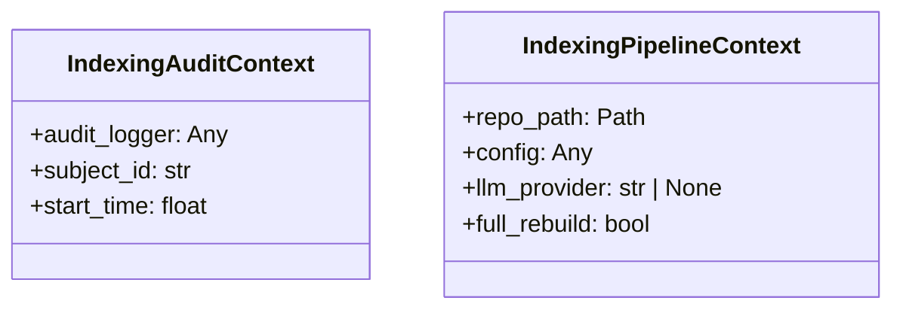
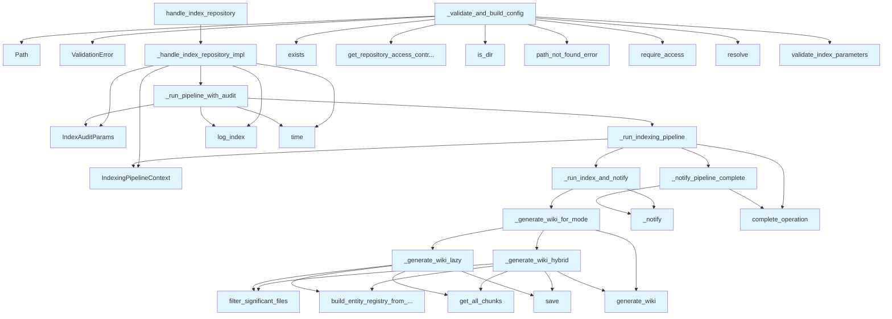

# File: `src/local_deepwiki/handlers/indexing.py`

## File Overview

This file implements the core indexing pipeline for repository documentation generation. It handles the `index_repository` tool call, orchestrating repository parsing, indexing, and wiki generation with progress tracking and audit logging.

The module is designed to support multiple generation modes (eager, lazy, hybrid) and integrates with the broader system through access control, progress notifications, and audit logging. It serves as the central coordination point for the indexing workflow.

## Key Concepts

### Indexing Pipeline Abstraction

The indexing process is abstracted into a multi-stage pipeline:
1. **Parse and Index**: Extract and store code information in a vector store.
2. **Wiki Generation**: Create documentation pages based on the indexed data.
3. **Progress Tracking**: Communicate status updates to the client.
4. **Audit Logging**: Record operation details for monitoring and debugging.

This modular design allows for different generation strategies (eager, lazy, hybrid) to be implemented and selected at runtime, enabling performance tuning based on repository size or user preference.

### Context Objects

Two context classes (`IndexingPipelineContext` and `IndexingAuditContext`) are used to pass shared parameters through the pipeline:
- `IndexingPipelineContext`: Bundles repository path, configuration, LLM provider, and rebuild flag for use across indexing functions.
- `IndexingAuditContext`: Encapsulates audit logger, subject identifier, and start time for consistent logging.

These objects help avoid parameter bloat in function signatures and improve code maintainability.

### Async/Await Pattern

The pipeline uses `async`/`await` for I/O-bound operations such as:
- Indexing repository files
- Generating wiki content
- Communicating progress updates

This ensures that the system remains responsive during long-running indexing operations.

### Progress Notification System

Progress is communicated through a `notifier` object that supports streaming updates to the client. The system defines a fixed number of stages (`SCANNING`, `PARSING`, `STORING`, `WIKI_GENERATION`, `COMPLETE`) and uses a [`ProgressPhase`](../progress.md) enum to track state.

This allows the client to display real-time status updates during indexing.

## Integration

This file integrates deeply with several core modules:

- **Access Control**: Uses `get_access_controller()` and `get_repository_access_controller()` to enforce permissions and repository access rules.
- **Configuration Management**: Relies on `get_config()` and [`IndexRepositoryArgs`](../models/tool_args.md) for validating and building the indexing configuration.
- **Indexing Core**: Integrates with [`RepositoryIndexer`](../core/indexer.md) to perform actual parsing and indexing of source files.
- **Progress Tracking**: Uses [`create_progress_notifier`](_progress.md) and [`get_progress_registry`](../progress.md) for real-time status updates.
- **Audit Logging**: Communicates with `get_audit_logger()` and [`IndexAuditParams`](../core/audit.md) for logging indexing operations.
- **Wiki Generation**: Delegates to [`generate_wiki`](../generators/wiki/generator.md), [`build_entity_registry_from_store`](../generators/crosslinks.md), and [`filter_significant_files`](../generators/wiki/files.md) for content creation.
- **Error Handling**: Uses [`handle_tool_errors`](_error_handling.md) for consistent error formatting in tool responses.

The main entry point `handle_index_repository` is called by the indexing service (`_generate_wiki_lazy`), indicating that this module is part of the tool execution chain.

## Design Notes

### Mode Selection Strategy

The system supports three wiki generation modes:
- **Eager**: Generates all pages immediately.
- **Lazy**: Builds only the entity registry, deferring page generation.
- **Hybrid**: Generates a subset eagerly, then defers the rest.

This design allows users to balance indexing speed and memory usage. For large repositories, lazy or hybrid modes can reduce resource consumption.

### Thread Safety and Blocking Calls

The configuration validation and repository path resolution (`_validate_and_build_config`) are run in a thread pool via `asyncio.to_thread()` to prevent blocking the event loop. This is crucial for maintaining responsiveness during potentially slow operations like path validation.

### Audit Logging

Audit logs are structured with [`IndexAuditParams`](../core/audit.md) to capture:
- Operation start, success, or failure
- Duration
- Repository path
- [Subject](../security/access_control.md) identifier

This provides a consistent audit trail for monitoring and debugging indexing operations.

### Error Handling

The module uses a structured error handling approach:
- Validation errors are caught and re-raised as `ValueError` with full context.
- Exceptions during pipeline execution are caught, audit logs are recorded, and the operation is marked as failed before re-raising.

This ensures that errors are logged and propagated correctly, preventing silent failures.

### Performance Considerations

- **LanceDB Stabilization**: After indexing, `indexer.vector_store.stabilize()` is called to compact datasets and avoid conflicts during concurrent wiki generation.
- **Prefetch Drain**: In hybrid mode, if enabled, a drain process is kicked off to generate remaining pages asynchronously.
- **Progress Callbacks**: A synchronous callback is used to [collect](../web/routes_chat.md) progress messages, which are later merged with notifier messages for comprehensive reporting.

This design balances performance with user feedback, allowing for efficient indexing while keeping users informed.

## API Reference

### class `IndexingPipelineContext`

Immutable context shared across indexing pipeline functions.  Consolidates the parameters threaded through _generate_wiki_hybrid, _generate_wiki_for_mode, _run_index_and_notify, and _run_pipeline_with_audit.


<details>
<summary>View Source (lines 36-46) | <a href="https://github.com/UrbanDiver/local-deepwiki-mcp/blob/main/src/local_deepwiki/handlers/indexing.py#L36-L46">GitHub</a></summary>

```python
class IndexingPipelineContext:
    """Immutable context shared across indexing pipeline functions.

    Consolidates the parameters threaded through _generate_wiki_hybrid,
    _generate_wiki_for_mode, _run_index_and_notify, and _run_pipeline_with_audit.
    """

    repo_path: Path
    config: Any
    llm_provider: str | None
    full_rebuild: bool
```

</details>

### class `IndexingAuditContext`

Immutable context for audit logging during the indexing pipeline.  Bundles audit_logger, subject_id, and start_time to reduce parameter counts in _run_pipeline_with_audit.

---


<details>
<summary>View Source (lines 50-59) | <a href="https://github.com/UrbanDiver/local-deepwiki-mcp/blob/main/src/local_deepwiki/handlers/indexing.py#L50-L59">GitHub</a></summary>

```python
class IndexingAuditContext:
    """Immutable context for audit logging during the indexing pipeline.

    Bundles audit_logger, subject_id, and start_time to reduce parameter
    counts in _run_pipeline_with_audit.
    """

    audit_logger: Any
    subject_id: str
    start_time: float
```

</details>

### Functions

#### `handle_index_repository`

`@handle_tool_errors`

```python
async def handle_index_repository(args: dict[str, Any], server: Any = None) -> list[TextContent]
```

Handle index_repository tool call with streaming progress.


| Parameter | Type | Default | Description |
|-----------|------|---------|-------------|
| `args` | `dict[str, Any]` | - | Tool arguments. |
| `server` | `Any` | `None` | Optional MCP server instance for progress notifications. |

**Returns:** `list[TextContent]`


<details>
<summary>View Source (lines 63-76) | <a href="https://github.com/UrbanDiver/local-deepwiki-mcp/blob/main/src/local_deepwiki/handlers/indexing.py#L63-L76">GitHub</a></summary>

```python
async def handle_index_repository(
    args: dict[str, Any],
    server: Any = None,
) -> list[TextContent]:
    """Handle index_repository tool call with streaming progress.

    Args:
        args: Tool arguments.
        server: Optional MCP server instance for progress notifications.

    Returns:
        List of TextContent with indexing results.
    """
    return await _handle_index_repository_impl(args, server)
```

</details>

#### `sync_progress_callback`

```python
def sync_progress_callback(msg: str, current: int, total: int) -> None
```


| Parameter | Type | Default | Description |
|-----------|------|---------|-------------|
| `msg` | `str` | - | - |
| `current` | `int` | - | - |
| `total` | `int` | - | - |

**Returns:** `None`


<details>
<summary>View Source (lines 395-396) | <a href="https://github.com/UrbanDiver/local-deepwiki-mcp/blob/main/src/local_deepwiki/handlers/indexing.py#L395-L396">GitHub</a></summary>

```python
def sync_progress_callback(msg: str, current: int, total: int) -> None:
        progress_messages.append(f"[{current}/{total}] {msg}")
```

</details>

## Class Diagram



## Call Graph



## Used By

Functions and methods in this file and their callers:

- **[`GenerationMode`](../config/models_wiki.md)**: called by `_validate_and_build_config`
- **[`IndexAuditParams`](../core/audit.md)**: called by `_handle_index_repository_impl`, `_run_pipeline_with_audit`
- **`IndexingAuditContext`**: called by `_handle_index_repository_impl`
- **`IndexingPipelineContext`**: called by `_handle_index_repository_impl`, `_run_indexing_pipeline`
- **`Path`**: called by `_validate_and_build_config`
- **[`RepositoryIndexer`](../core/indexer.md)**: called by `_run_indexing_pipeline`
- **[`ValidationError`](../errors.md)**: called by `_validate_and_build_config`
- **`ValueError`**: called by `_handle_index_repository_impl`
- **[`WikiStructure`](../models/wiki.md)**: called by `_generate_wiki_lazy`
- **`_build_index_result`**: called by `_handle_index_repository_impl`
- **`_generate_wiki_for_mode`**: called by `_run_index_and_notify`
- **`_generate_wiki_hybrid`**: called by `_generate_wiki_for_mode`
- **`_generate_wiki_lazy`**: called by `_generate_wiki_for_mode`
- **`_handle_index_repository_impl`**: called by `handle_index_repository`
- **`_notify`**: called by `_notify_pipeline_complete`, `_run_index_and_notify`
- **`_notify_pipeline_complete`**: called by `_run_indexing_pipeline`
- **`_run_index_and_notify`**: called by `_run_indexing_pipeline`
- **`_run_indexing_pipeline`**: called by `_run_pipeline_with_audit`
- **`_run_pipeline_with_audit`**: called by `_handle_index_repository_impl`
- **[`build_entity_registry_from_store`](../generators/crosslinks.md)**: called by `_generate_wiki_hybrid`, `_generate_wiki_lazy`
- **`complete_operation`**: called by `_notify_pipeline_complete`, `_run_indexing_pipeline`
- **[`create_progress_notifier`](_progress.md)**: called by `_run_indexing_pipeline`
- **`exists`**: called by `_validate_and_build_config`
- **[`filter_significant_files`](../generators/wiki/files.md)**: called by `_generate_wiki_hybrid`, `_generate_wiki_lazy`
- **`flush`**: called by `_notify_pipeline_complete`
- **[`generate_wiki`](../generators/wiki/generator.md)**: called by `_generate_wiki_for_mode`, `_generate_wiki_hybrid`
- **[`get_access_controller`](../security/access_control.md)**: called by `_handle_index_repository_impl`
- **`get_all_chunks`**: called by `_generate_wiki_hybrid`, `_generate_wiki_lazy`
- **[`get_audit_logger`](../core/audit.md)**: called by `_handle_index_repository_impl`
- **[`get_config`](../config/loader.md)**: called by `_validate_and_build_config`
- **`get_current_subject`**: called by `_handle_index_repository_impl`
- **[`get_lazy_generator`](../generators/lazy_generator.md)**: called by `_generate_wiki_hybrid`
- **[`get_progress_registry`](../progress.md)**: called by `_run_indexing_pipeline`
- **[`get_repository_access_controller`](../security/repository_access.md)**: called by `_validate_and_build_config`
- **[`get_wiki_path`](../web/utils.md)**: called by `_run_indexing_pipeline`
- **`is_dir`**: called by `_validate_and_build_config`
- **`kickstart_drain`**: called by `_generate_wiki_hybrid`
- **`log_index`**: called by `_handle_index_repository_impl`, `_run_pipeline_with_audit`
- **[`make_tool_text_content`](_response.md)**: called by `_handle_index_repository_impl`
- **`model_copy`**: called by `_validate_and_build_config`
- **`model_validate`**: called by `_handle_index_repository_impl`
- **[`path_not_found_error`](../error_factories.md)**: called by `_validate_and_build_config`
- **[`record_index`](session_state.md)**: called by `_handle_index_repository_impl`
- **`require_access`**: called by `_validate_and_build_config`
- **[`require_permission`](../security/access_control.md)**: called by `_handle_index_repository_impl`
- **`resolve`**: called by `_validate_and_build_config`
- **`save`**: called by `_generate_wiki_hybrid`, `_generate_wiki_lazy`
- **`set_data_path`**: called by `_run_indexing_pipeline`
- **`stabilize`**: called by `_run_index_and_notify`
- **`time`**: called by `_handle_index_repository_impl`, `_run_pipeline_with_audit`
- **`to_thread`**: called by `_handle_index_repository_impl`
- **[`validate_index_parameters`](../validation.md)**: called by `_validate_and_build_config`
- **[`validate_languages_list`](../validation.md)**: called by `_validate_and_build_config`

## Last Modified

| Entity | Type | Author | Date | Commit |
|--------|------|--------|------|--------|
| `IndexingPipelineContext` | class | Brian Breidenbach | yesterday | `1eef062` refactor: complete Grade A ... |
| `IndexingAuditContext` | class | Brian Breidenbach | yesterday | `1eef062` refactor: complete Grade A ... |
| `_generate_wiki_hybrid` | function | Brian Breidenbach | yesterday | `1eef062` refactor: complete Grade A ... |
| `_generate_wiki_for_mode` | function | Brian Breidenbach | yesterday | `1eef062` refactor: complete Grade A ... |
| `_run_index_and_notify` | function | Brian Breidenbach | yesterday | `1eef062` refactor: complete Grade A ... |
| `_run_indexing_pipeline` | function | Brian Breidenbach | yesterday | `1eef062` refactor: complete Grade A ... |
| `_run_pipeline_with_audit` | function | Brian Breidenbach | yesterday | `1eef062` refactor: complete Grade A ... |
| `_handle_index_repository_impl` | function | Brian Breidenbach | yesterday | `1eef062` refactor: complete Grade A ... |
| `_notify_pipeline_complete` | function | Brian Breidenbach | yesterday | `29ae780` refactor: decompose long me... |
| `_build_index_result` | function | Brian Breidenbach | yesterday | `29ae780` refactor: decompose long me... |
| `_generate_wiki_lazy` | function | Brian Breidenbach | Feb 23, 2026 | `462ead0` refactor: reorganize genera... |
| `_notify` | function | Brian Breidenbach | Feb 23, 2026 | `086ea33` refactor: reduce cyclomatic... |
| `handle_index_repository` | function | Brian Breidenbach | Feb 21, 2026 | `aad50cb` refactor: split 9 files (80... |
| `_validate_and_build_config` | function | Brian Breidenbach | Feb 21, 2026 | `aad50cb` refactor: split 9 files (80... |
| `sync_progress_callback` | function | Brian Breidenbach | Feb 21, 2026 | `aad50cb` refactor: split 9 files (80... |

## Additional Source Code

Source code for functions and methods not listed in the API Reference above.

#### `_validate_and_build_config`

<details>
<summary>View Source (lines 79-156) | <a href="https://github.com/UrbanDiver/local-deepwiki-mcp/blob/main/src/local_deepwiki/handlers/indexing.py#L79-L156">GitHub</a></summary>

```python
def _validate_and_build_config(
    validated: IndexRepositoryArgs,
) -> tuple[Path, Any, str | None, str | None]:
    """Validate inputs and build configuration for indexing.

    Returns:
        Tuple of (repo_path, config, llm_provider, embedding_provider).
    """
    repo_path = Path(validated.repo_path).resolve()

    # Check repository access (allowlist/denylist)
    repo_access = get_repository_access_controller()
    repo_access.require_access(repo_path)

    # Validate input size limits (CWE-400 prevention)
    total_size, file_count = validate_index_parameters(str(repo_path))
    logger.info(
        "Indexing repository: %s (%s bytes, %s files)",
        repo_path,
        f"{total_size:,}",
        f"{file_count:,}",
    )

    if not repo_path.exists():
        raise path_not_found_error(str(repo_path), "repository")

    if not repo_path.is_dir():
        raise ValidationError(
            message=f"Path is not a directory: {repo_path}",
            hint="Provide a path to a directory, not a file.",
            field="repo_path",
            value=str(repo_path),
        )

    languages = validate_languages_list(validated.languages)
    llm_provider = validated.llm_provider.value if validated.llm_provider else None
    embedding_provider = (
        validated.embedding_provider.value if validated.embedding_provider else None
    )

    # Build config with any overrides
    base_config = get_config()
    config_updates: dict = {}

    if languages:
        config_updates["parsing"] = base_config.parsing.model_copy(
            update={"languages": languages}
        )

    if validated.use_cloud_for_github is not None:
        config_updates["wiki"] = base_config.wiki.model_copy(
            update={"use_cloud_for_github": validated.use_cloud_for_github}
        )

    # Override generation_mode if specified (or skip_wiki forces lazy)
    effective_mode = validated.generation_mode
    if validated.skip_wiki:
        effective_mode = "lazy"
    wiki_overrides: dict = {}
    if effective_mode is not None:
        from local_deepwiki.config import GenerationMode

        wiki_overrides["generation_mode"] = GenerationMode(effective_mode)
    if validated.prefetch_drain is not None:
        wiki_overrides["prefetch_drain"] = validated.prefetch_drain
    if wiki_overrides:
        if "wiki" in config_updates:
            config_updates["wiki"] = config_updates["wiki"].model_copy(
                update=wiki_overrides
            )
        else:
            config_updates["wiki"] = base_config.wiki.model_copy(update=wiki_overrides)

    config = (
        base_config.model_copy(update=config_updates) if config_updates else base_config
    )

    return repo_path, config, llm_provider, embedding_provider
```

</details>


#### `_notify`

<details>
<summary>View Source (lines 159-171) | <a href="https://github.com/UrbanDiver/local-deepwiki-mcp/blob/main/src/local_deepwiki/handlers/indexing.py#L159-L171">GitHub</a></summary>

```python
async def _notify(
    notifier: Any,
    current: int,
    phase: ProgressPhase,
    message: str,
    metadata: dict[str, Any] | None = None,
) -> None:
    """Send a progress notification if a notifier is available."""
    if notifier is None:
        return
    await notifier.update(
        current=current, phase=phase, message=message, metadata=metadata
    )
```

</details>


#### `_generate_wiki_lazy`

<details>
<summary>View Source (lines 174-190) | <a href="https://github.com/UrbanDiver/local-deepwiki-mcp/blob/main/src/local_deepwiki/handlers/indexing.py#L174-L190">GitHub</a></summary>

```python
def _generate_wiki_lazy(
    indexer: RepositoryIndexer,
    status: Any,
    config: Any,
) -> WikiStructure:
    """Lazy mode: build entity registry only, defer all page generation."""
    from local_deepwiki.generators.crosslinks import build_entity_registry_from_store
    from local_deepwiki.generators.wiki.files import filter_significant_files

    significant = filter_significant_files(status.files, config.wiki.max_file_docs)
    sig_paths = {f.path for f in significant}
    entity_reg = build_entity_registry_from_store(
        indexer.vector_store.get_all_chunks(), sig_paths
    )
    entity_reg.save(indexer.wiki_path / "entity_registry.json")

    return WikiStructure(root=str(indexer.wiki_path), pages=[])
```

</details>


#### `_generate_wiki_hybrid`

<details>
<summary>View Source (lines 193-236) | <a href="https://github.com/UrbanDiver/local-deepwiki-mcp/blob/main/src/local_deepwiki/handlers/indexing.py#L193-L236">GitHub</a></summary>

```python
async def _generate_wiki_hybrid(
    ctx: IndexingPipelineContext,
    indexer: RepositoryIndexer,
    status: Any,
    sync_progress_callback: Any,
) -> WikiStructure:
    """Hybrid mode: generate eager pages, then build full entity registry."""
    from local_deepwiki.generators.crosslinks import build_entity_registry_from_store
    from local_deepwiki.generators.wiki.files import filter_significant_files

    eager_limit = ctx.config.wiki.hybrid_eager_pages
    wiki_structure = await generate_wiki(
        repo_path=ctx.repo_path,
        wiki_path=indexer.wiki_path,
        vector_store=indexer.vector_store,
        index_status=status,
        config=ctx.config,
        llm_provider=ctx.llm_provider,
        progress_callback=sync_progress_callback,
        full_rebuild=ctx.full_rebuild,
        max_file_pages=eager_limit,
    )

    significant = filter_significant_files(status.files, ctx.config.wiki.max_file_docs)
    sig_paths = {f.path for f in significant}
    entity_reg = build_entity_registry_from_store(
        indexer.vector_store.get_all_chunks(), sig_paths
    )
    entity_reg.save(indexer.wiki_path / "entity_registry.json")

    remaining = len(significant) - eager_limit
    if remaining > 0:
        logger.info(
            "Hybrid mode: %d pages generated eagerly, %d deferred to lazy/drain",
            eager_limit,
            remaining,
        )
        if ctx.config.wiki.prefetch_drain:
            from local_deepwiki.generators.lazy_generator import get_lazy_generator

            lazy_gen = get_lazy_generator(indexer.wiki_path, ctx.config)
            lazy_gen.kickstart_drain()

    return wiki_structure
```

</details>


#### `_generate_wiki_for_mode`

<details>
<summary>View Source (lines 239-269) | <a href="https://github.com/UrbanDiver/local-deepwiki-mcp/blob/main/src/local_deepwiki/handlers/indexing.py#L239-L269">GitHub</a></summary>

```python
async def _generate_wiki_for_mode(
    ctx: IndexingPipelineContext,
    indexer: RepositoryIndexer,
    status: Any,
    progress_callback: Any,
) -> WikiStructure:
    """Dispatch wiki generation based on the configured generation mode."""
    from local_deepwiki.config import GenerationMode

    gen_mode = ctx.config.wiki.generation_mode
    match gen_mode:
        case GenerationMode.LAZY:
            return _generate_wiki_lazy(indexer, status, ctx.config)
        case GenerationMode.HYBRID:
            return await _generate_wiki_hybrid(
                ctx,
                indexer,
                status,
                progress_callback,
            )
        case _:
            return await generate_wiki(
                repo_path=ctx.repo_path,
                wiki_path=indexer.wiki_path,
                vector_store=indexer.vector_store,
                index_status=status,
                config=ctx.config,
                llm_provider=ctx.llm_provider,
                progress_callback=progress_callback,
                full_rebuild=ctx.full_rebuild,
            )
```

</details>


#### `_notify_pipeline_complete`

<details>
<summary>View Source (lines 272-298) | <a href="https://github.com/UrbanDiver/local-deepwiki-mcp/blob/main/src/local_deepwiki/handlers/indexing.py#L272-L298">GitHub</a></summary>

```python
async def _notify_pipeline_complete(
    notifier: Any,
    registry: Any,
    operation_id: str,
    status: Any,
    wiki_structure: WikiStructure,
) -> None:
    """Send the final progress notification and mark the operation complete."""
    await _notify(
        notifier,
        current=6,
        phase=ProgressPhase.COMPLETE,
        message=(
            f"Complete: {status.total_files} files, "
            f"{status.total_chunks} chunks, "
            f"{len(wiki_structure.pages)} pages"
        ),
        metadata={
            "files_processed": status.total_files,
            "total_files": status.total_files,
            "chunks_created": status.total_chunks,
            "pages_generated": len(wiki_structure.pages),
        },
    )
    if notifier:
        await notifier.flush()
    registry.complete_operation(operation_id, record_timing=True)
```

</details>


#### `_run_index_and_notify`

<details>
<summary>View Source (lines 301-363) | <a href="https://github.com/UrbanDiver/local-deepwiki-mcp/blob/main/src/local_deepwiki/handlers/indexing.py#L301-L363">GitHub</a></summary>

```python
async def _run_index_and_notify(
    notifier: Any,
    indexer: RepositoryIndexer,
    ctx: IndexingPipelineContext,
    sync_progress_callback: Any,
) -> tuple[Any, Any]:
    """Run the parse/index and wiki-generation phases with progress notifications.

    Returns (status, wiki_structure).
    """
    await _notify(
        notifier,
        current=1,
        phase=ProgressPhase.SCANNING,
        message=f"Starting indexing of {ctx.repo_path.name}",
        metadata={
            "files_processed": 0,
            "total_files": 0,
            "chunks_created": 0,
            "pages_generated": 0,
        },
    )
    await _notify(
        notifier,
        current=2,
        phase=ProgressPhase.PARSING,
        message="Parsing source files...",
    )

    status = await indexer.index(
        full_rebuild=ctx.full_rebuild, progress_callback=sync_progress_callback
    )

    # LanceDB 0.26: compact all dataset versions into a single stable
    # snapshot so concurrent wiki-generation reads don't collide with
    # deferred fragment compaction.
    indexer.vector_store.stabilize()

    await _notify(
        notifier,
        current=4,
        phase=ProgressPhase.STORING,
        message=f"Indexed {status.total_files} files, {status.total_chunks} chunks",
        metadata={
            "files_processed": status.total_files,
            "total_files": status.total_files,
            "chunks_created": status.total_chunks,
        },
    )
    await _notify(
        notifier,
        current=5,
        phase=ProgressPhase.WIKI_GENERATION,
        message="Generating wiki documentation...",
    )

    wiki_structure = await _generate_wiki_for_mode(
        ctx,
        indexer,
        status,
        sync_progress_callback,
    )
    return status, wiki_structure
```

</details>


#### `_run_indexing_pipeline`

<details>
<summary>View Source (lines 366-420) | <a href="https://github.com/UrbanDiver/local-deepwiki-mcp/blob/main/src/local_deepwiki/handlers/indexing.py#L366-L420">GitHub</a></summary>

```python
async def _run_indexing_pipeline(
    repo_path: Path,
    config: Any,
    llm_provider: str | None,
    embedding_provider: str | None,
    full_rebuild: bool,
    server: Any,
) -> tuple[Any, Any, Any, list[str], str]:
    """Run the indexing and wiki generation pipeline with progress tracking.

    Returns:
        Tuple of (indexer, status, wiki_structure, progress_messages, operation_id).
    """
    registry = get_progress_registry()
    wiki_path = config.get_wiki_path(repo_path)
    registry.set_data_path(wiki_path / "progress_history.json")

    notifier, operation_id = create_progress_notifier(
        operation_type=OperationType.INDEX_REPOSITORY,
        server=server,
        total=6,
    )
    indexer = RepositoryIndexer(
        repo_path=repo_path,
        config=config,
        embedding_provider_name=embedding_provider,
    )
    progress_messages: list[str] = []

    def sync_progress_callback(msg: str, current: int, total: int) -> None:
        progress_messages.append(f"[{current}/{total}] {msg}")

    ctx = IndexingPipelineContext(
        repo_path=repo_path,
        config=config,
        llm_provider=llm_provider,
        full_rebuild=full_rebuild,
    )

    try:
        status, wiki_structure = await _run_index_and_notify(
            notifier,
            indexer,
            ctx,
            sync_progress_callback,
        )
        await _notify_pipeline_complete(
            notifier, registry, operation_id, status, wiki_structure
        )
    except Exception:  # noqa: BLE001 — handler boundary: ensure operation is marked complete before re-raising
        registry.complete_operation(operation_id, record_timing=False)
        raise

    all_messages = (notifier.messages if notifier else []) + progress_messages
    return indexer, status, wiki_structure, all_messages, operation_id
```

</details>


#### `_run_pipeline_with_audit`

<details>
<summary>View Source (lines 423-472) | <a href="https://github.com/UrbanDiver/local-deepwiki-mcp/blob/main/src/local_deepwiki/handlers/indexing.py#L423-L472">GitHub</a></summary>

```python
async def _run_pipeline_with_audit(
    *,
    ctx: IndexingPipelineContext,
    embedding_provider: Any,
    server: Any,
    audit: IndexingAuditContext,
) -> tuple[Any, Any, Any, list[str], str]:
    """Run the indexing pipeline and emit audit log events on failure or success."""
    try:
        (
            indexer,
            status,
            wiki_structure,
            all_messages,
            operation_id,
        ) = await _run_indexing_pipeline(
            repo_path=ctx.repo_path,
            config=ctx.config,
            llm_provider=ctx.llm_provider,
            embedding_provider=embedding_provider,
            full_rebuild=ctx.full_rebuild,
            server=server,
        )
    except Exception as e:  # noqa: BLE001 — handler boundary: audit log failure before re-raising
        duration_ms = int((time.time() - audit.start_time) * 1000)
        audit.audit_logger.log_index(
            IndexAuditParams(
                subject_id=audit.subject_id,
                repo_path=str(ctx.repo_path),
                operation="failed",
                success=False,
                duration_ms=duration_ms,
                error_message=str(e),
            )
        )
        raise

    duration_ms = int((time.time() - audit.start_time) * 1000)
    audit.audit_logger.log_index(
        IndexAuditParams(
            subject_id=audit.subject_id,
            repo_path=str(ctx.repo_path),
            operation="completed",
            success=True,
            files_processed=status.total_files,
            chunks_created=status.total_chunks,
            duration_ms=duration_ms,
        )
    )
    return indexer, status, wiki_structure, all_messages, operation_id
```

</details>


#### `_build_index_result`

<details>
<summary>View Source (lines 475-493) | <a href="https://github.com/UrbanDiver/local-deepwiki-mcp/blob/main/src/local_deepwiki/handlers/indexing.py#L475-L493">GitHub</a></summary>

```python
def _build_index_result(
    indexer: Any,
    status: Any,
    wiki_structure: Any,
    all_messages: list[str],
    operation_id: str,
) -> dict[str, Any]:
    """Assemble the JSON-serialisable result dict for index_repository."""
    return {
        "status": "success",
        "repo_path": str(indexer.repo_path),
        "wiki_path": str(indexer.wiki_path),
        "files_indexed": status.total_files,
        "chunks_created": status.total_chunks,
        "languages": status.languages,
        "wiki_pages": len(wiki_structure.pages),
        "operation_id": operation_id,
        "messages": all_messages,
    }
```

</details>


#### `_handle_index_repository_impl`

<details>
<summary>View Source (lines 496-568) | <a href="https://github.com/UrbanDiver/local-deepwiki-mcp/blob/main/src/local_deepwiki/handlers/indexing.py#L496-L568">GitHub</a></summary>

```python
async def _handle_index_repository_impl(
    args: dict[str, Any],
    server: Any = None,
) -> list[TextContent]:
    """Internal implementation of index_repository with progress streaming and ETA."""
    controller = get_access_controller()
    controller.require_permission(Permission.INDEX_WRITE)

    try:
        validated = IndexRepositoryArgs.model_validate(args)
    except PydanticValidationError as e:
        raise ValueError(str(e)) from e

    subject = controller.get_current_subject()
    subject_id = subject.identifier if subject else "anonymous"

    audit_logger = get_audit_logger()
    start_time = time.time()
    audit_logger.log_index(
        IndexAuditParams(
            subject_id=subject_id,
            repo_path=validated.repo_path,
            operation="started",
            success=True,
        )
    )

    repo_path, config, llm_provider, embedding_provider = await asyncio.to_thread(
        _validate_and_build_config, validated
    )

    pipeline_ctx = IndexingPipelineContext(
        repo_path=repo_path,
        config=config,
        llm_provider=llm_provider,
        full_rebuild=validated.full_rebuild,
    )
    audit = IndexingAuditContext(
        audit_logger=audit_logger,
        subject_id=subject_id,
        start_time=start_time,
    )

    (
        indexer,
        status,
        wiki_structure,
        all_messages,
        operation_id,
    ) = await _run_pipeline_with_audit(
        ctx=pipeline_ctx,
        embedding_provider=embedding_provider,
        server=server,
        audit=audit,
    )

    result = _build_index_result(
        indexer, status, wiki_structure, all_messages, operation_id
    )

    logger.info(
        "Indexing complete: %d files, %d chunks, %d wiki pages",
        status.total_files,
        status.total_chunks,
        len(wiki_structure.pages),
    )

    # Record in session state so downstream tools know this repo is indexed
    from local_deepwiki.handlers.session_state import record_index

    record_index(str(repo_path), str(indexer.wiki_path))

    return make_tool_text_content("index_repository", result)
```

</details>

## Relevant Source Files

- `src/local_deepwiki/handlers/indexing.py:36-46`
